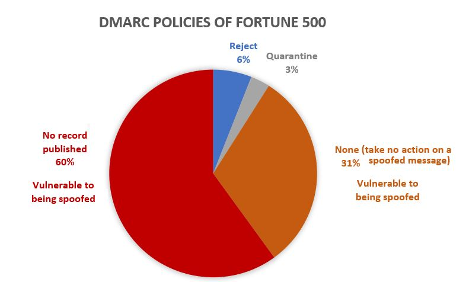
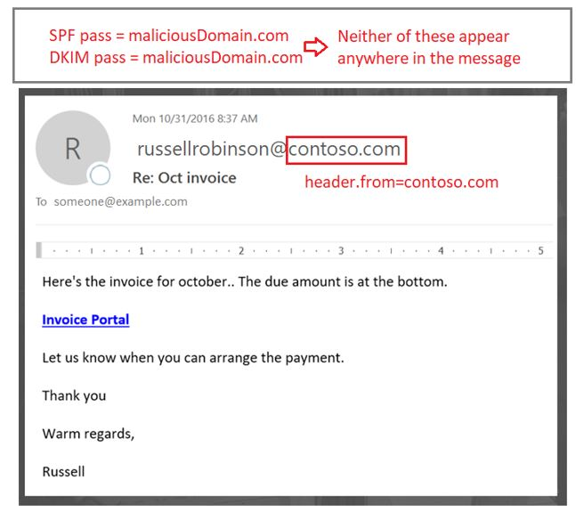
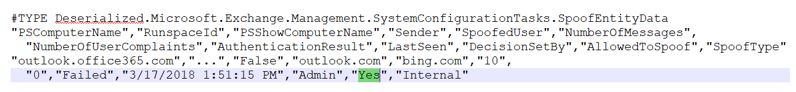
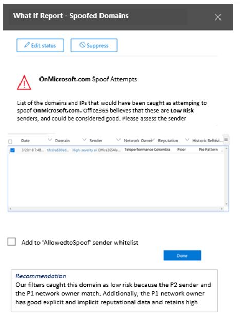
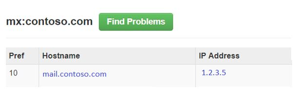

# <a name="anti-spoofing-protection-in-office-365"></a><span data-ttu-id="7f813-105">Protection anti-usurpation dans Office 365</span><span class="sxs-lookup"><span data-stu-id="7f813-105">Anti-spoofing protection in Office 365</span></span>

<span data-ttu-id="7f813-p102">Cet article explique comment Office 365 atténue les attaques par hameçonnage qui utilisent des domaines d'expéditeurs falsifiés, c'est-à-dire des domaines falsifiés. Pour ce faire, il analyse les messages et bloque ceux qui ne peuvent pas être authentifiés à l'aide de méthodes d'authentification de messagerie standard, ni d'autres techniques de réputation de l'expéditeur. Cette modification est implémentée pour réduire le nombre d'attaques de hameçonnage auxquelles les clients sont exposés.</span><span class="sxs-lookup"><span data-stu-id="7f813-p102">This article describes how Office 365 mitigates against phishing attacks that uses forged sender domains, that is, domains that are spoofed. It accomplishes this by analyzing the messages and blocking the ones that cannot be authenticated using standard email authentication methods, nor other sender reputation techniques. This change is being implemented to reduce the number of phishing attacks customers are exposed to.</span></span>
  
<span data-ttu-id="7f813-109">Cet article décrit également la raison pour laquelle cette modification est effectuée, la façon dont les clients peuvent se préparer à ce changement, comment afficher les messages qui seront affectés, comment générer des rapports sur les messages, comment atténuer les faux positifs, ainsi que comment les expéditeurs à Microsoft doivent se préparer à ce problème. port.</span><span class="sxs-lookup"><span data-stu-id="7f813-109">This article also describes why this change is being made, how customers can prepare for this change, how to view messages that will be affected, how to report on messages, how to mitigate false positives, as well as how senders to Microsoft should prepare for this change.</span></span>
  
<span data-ttu-id="7f813-p103">La technologie de détection d'usurpation de Microsoft a été déployée à l'origine dans ses organisations disposant d'un abonnement Office 365 entreprise E5 ou a acheté le complément Office 365 Advanced Threat Protection (ATP) pour leur abonnement. Depuis octobre 2018, nous avons étendu la protection aux organisations qui possèdent également Exchange Online Protection (EOP). En outre, en raison de la façon dont tous nos filtres apprennent les uns des autres, les utilisateurs de Outlook.com peuvent également être affectés.</span><span class="sxs-lookup"><span data-stu-id="7f813-p103">Microsoft's anti-spoofing technology was initially deployed to its organizations that had an Office 365 Enterprise E5 subscription or had purchased the Office 365 Advanced Threat Protection (ATP) add-on for their subscription. As of October, 2018 we've extended the protection to organizations that have Exchange Online Protection (EOP) as well. Additionally, because of the way all of our filters learn from each other, Outlook.com users may also be affected.</span></span>
  
## <a name="how-spoofing-is-used-in-phishing-attacks"></a><span data-ttu-id="7f813-113">Utilisation de l'usurpation dans les attaques par hameçonnage</span><span class="sxs-lookup"><span data-stu-id="7f813-113">How spoofing is used in phishing attacks</span></span>

<span data-ttu-id="7f813-p104">Lorsqu'il s'agit de protéger ses utilisateurs, Microsoft prend la menace de hameçonnage. L'une des techniques couramment utilisées par les spammeurs et les auteurs de phishing est l'usurpation, c'est-à-dire lorsque l'expéditeur est falsifié et qu'un message semble provenir de quelqu'un ou d'un autre emplacement que la source réelle. Cette technique est souvent utilisée dans les campagnes de hameçonnage conçues pour obtenir des informations d'identification utilisateur. La technologie anti-usurpation de Microsoft examine spécifiquement la contrefaçon de l'en-tête «From:» qui est celle qui s'affiche dans un client de messagerie tel qu'Outlook. Lorsque Microsoft a un niveau de confiance élevé que l'en-tête From: est usurpé, il identifie le message comme une usurpation.</span><span class="sxs-lookup"><span data-stu-id="7f813-p104">When it comes to protecting its users, Microsoft takes the threat of phishing seriously. One of the techniques that spammers and phishers commonly use is spoofing, which is when the sender is forged, and a message appears to originate from someone or somewhere other than the actual source. This technique is often used in phishing campaigns designed to obtain user credentials. Microsoft's Anti-spoof technology specifically examines forgery of the 'From: header' which is the one that shows up in an email client like Outlook. When Microsoft has high confidence that the From: header is spoofed, it identifies the message as a spoof.</span></span>
  
<span data-ttu-id="7f813-119">Les messages d'usurpation ont deux conséquences négatives pour les utilisateurs réels:</span><span class="sxs-lookup"><span data-stu-id="7f813-119">Spoofing messages have two negative implications for real life users:</span></span>
  
### <a name="1-spoofed-messages-deceive-users"></a><span data-ttu-id="7f813-120">1. les messages falsifiés tromper les utilisateurs</span><span class="sxs-lookup"><span data-stu-id="7f813-120">1. Spoofed messages deceive users</span></span>
  
<span data-ttu-id="7f813-p105">Tout d'abord, un message usurpé peut inciter un utilisateur à cliquer sur un lien et à donner des informations d'identification, télécharger des programmes malveillants ou répondre à un message avec du contenu sensible (ce qui est connu sous le nom de compromission du courrier électronique professionnel). Par exemple, voici un message de hameçonnage avec un expéditeur usurpé d'msoutlook94@service.outlook.com:</span><span class="sxs-lookup"><span data-stu-id="7f813-p105">First, a spoofed message may trick a user into clicking a link and giving up their credentials, downloading malware, or replying to a message with sensitive content (the latter of which is known as Business Email Compromise). For example, the following is a phishing message with a spoofed sender of msoutlook94@service.outlook.com:</span></span>
  

  
<span data-ttu-id="7f813-p106">Les éléments ci-dessus ne proviennent pas réellement de service.outlook.com, mais ont été falsifiés par le hameçonnage pour lui donner l'apparence souhaitée. Elle tente de tromper un utilisateur en cliquant sur le lien dans le message.</span><span class="sxs-lookup"><span data-stu-id="7f813-p106">The above did not actually come from service.outlook.com, but instead was spoofed by the phisher to make it look like it did. It is attempting to trick a user into clicking the link within the message.</span></span>
  
<span data-ttu-id="7f813-126">L'exemple suivant est l'usurpation d'contoso.com:</span><span class="sxs-lookup"><span data-stu-id="7f813-126">The next example is spoofing contoso.com:</span></span>
  

  
<span data-ttu-id="7f813-p107">Le message semble légitime, mais en réalité il s'agit d'une usurpation. Ce message de hameçonnage est un type de compromission de la messagerie professionnelle qui est une sous-catégorie du hameçonnage.</span><span class="sxs-lookup"><span data-stu-id="7f813-p107">The message looks legitimate, but in fact is a spoof. This phishing message is a type of Business Email Compromise which is a subcategory of phishing.</span></span>
    
### <a name="2-users-confuse-real-messages-for-fake-ones"></a><span data-ttu-id="7f813-130">2. les utilisateurs confondent les messages réels pour les fausses</span><span class="sxs-lookup"><span data-stu-id="7f813-130">2. Users confuse real messages for fake ones</span></span>
  
<span data-ttu-id="7f813-p108">Deuxièmement, les messages usurpés créent une incertitude pour les utilisateurs qui connaissent les messages d'hameçonnage, mais ils ne peuvent pas distinguer la différence entre un message réel et un message falsifié. Par exemple, voici un exemple de réinitialisation effective du mot de passe à partir de l'adresse de messagerie du compte de sécurité Microsoft:</span><span class="sxs-lookup"><span data-stu-id="7f813-p108">Second, spoofed messages create uncertainty for users who know about phishing messages but cannot tell the difference between a real message and spoofed one. For example, the following is an example of an actual password reset from the Microsoft Security account email address:</span></span>
  

  
<span data-ttu-id="7f813-p109">Le message ci-dessus provient de Microsoft, mais en même temps, les utilisateurs sont utilisés pour obtenir des messages de hameçonnage susceptibles de tromper un utilisateur en cliquant sur un lien et en donnant ses informations d'identification, en téléchargeant des programmes malveillants ou en répondant à un message avec du contenu sensible. Étant donné qu'il est difficile d'indiquer la différence entre une réinitialisation de mot de passe réelle et une fausse tentative, de nombreux utilisateurs ignorent ces messages, les signalent comme courrier indésirable ou signalent inutilement les messages à Microsoft comme étant des arnaques de hameçonnage manquées.</span><span class="sxs-lookup"><span data-stu-id="7f813-p109">The above message did come from Microsoft, but at the same time, users are used to getting phishing messages that may trick a user into clicking a link and giving up their credentials, downloading malware, or replying to a message with sensitive content. Because it is difficult to tell the difference between a real password reset and a fake one, many users ignore these messages, report them as spam, or unnecessarily report the messages back to Microsoft as missed phishing scams.</span></span>
    
<span data-ttu-id="7f813-p110">Pour arrêter l'usurpation d'identité, l'industrie de filtrage du courrier électronique a développé des protocoles d'authentification de messagerie, tels que [SPF](https://docs.microsoft.com/office365/SecurityCompliance/set-up-spf-in-office-365-to-help-prevent-spoofing), [DKIM](https://docs.microsoft.com/office365/SecurityCompliance/use-dkim-to-validate-outbound-email)et [DMARC](https://docs.microsoft.com/office365/SecurityCompliance/use-dmarc-to-validate-email). DMARC empêche l'usurpation d'identité de l'expéditeur d'un message, celle que l'utilisateur voit dans son client de messagerie (dans les exemples ci-dessus, il s'agit de service.outlook.com, outlook.com et accountprotection.microsoft.com)-avec le domaine qui a réussi ou DKIM. Autrement dit, le domaine que l'utilisateur voit a été authentifié et n'est donc pas usurpé. Pour une discussion plus complète, consultez la section «*comprendre pourquoi l'authentification de messagerie n'est pas toujours suffisante pour arrêter l'usurpation»* , plus loin dans ce document.</span><span class="sxs-lookup"><span data-stu-id="7f813-p110">To stop spoofing, the email filtering industry has developed email authentication protocols such as [SPF](https://docs.microsoft.com/office365/SecurityCompliance/set-up-spf-in-office-365-to-help-prevent-spoofing), [DKIM](https://docs.microsoft.com/office365/SecurityCompliance/use-dkim-to-validate-outbound-email), and [DMARC](https://docs.microsoft.com/office365/SecurityCompliance/use-dmarc-to-validate-email). DMARC prevents spoofing examining a message's sender - the one that the user sees in their email client (in the examples above, this is service.outlook.com, outlook.com, and accountprotection.microsoft.com) - with the domain that passed SPF or DKIM. That is, the domain that the user sees has been authenticated and is therefore not spoofed. For a more complete discussion, see the section "*Understanding why email authentication is not always enough to stop spoofing"*  later on in this document.</span></span> 
  
<span data-ttu-id="7f813-p111">Toutefois, le problème est que les enregistrements d'authentification de messagerie sont facultatifs, et non pas obligatoires. Par conséquent, tandis que les domaines avec des stratégies d'authentification fortes telles que microsoft.com et skype.com sont protégés contre l'usurpation, les domaines qui publient des stratégies d'authentification plus faibles ou aucune stratégie ne sont des cibles à usurper. Depuis le 2018 mars, seuls 9% des domaines des sociétés du Fortune 500 publient des stratégies d'authentification de messagerie fiables. Les 91% restants peuvent être usurpés par un hameçonnage et, sauf si le filtre de courrier électronique les détecte à l'aide d'une autre stratégie, peut être remis à un utilisateur final et le tromper:</span><span class="sxs-lookup"><span data-stu-id="7f813-p111">However, the problem is that email authentication records are optional, not required. Therefore, while domains with strong authentication policies like microsoft.com and skype.com are protected from spoofing, domains that publish weaker authentication policies, or no policy at all, are targets for being spoofed.As of March 2018, only 9% of domains of companies in the Fortune 500 publish strong email authentication policies. The remaining 91% may be spoofed by a phisher, and unless the email filter detects it using another policy, may be delivered to an end user and deceive them:</span></span>
  

  
<span data-ttu-id="7f813-144">La proportion des petites et moyennes entreprises qui ne figurent pas dans le Fortune 500 qui publient des stratégies d'authentification de messagerie forte est plus petite et encore plus petite pour les domaines situés en dehors de l'Amérique du Nord et de l'Europe occidentale.</span><span class="sxs-lookup"><span data-stu-id="7f813-144">The proportion of small-to-medium sized companies that are not in the Fortune 500 that publish strong email authentication policies is smaller, and smaller still for domains that are outside of North America and western Europe.</span></span>
  
<span data-ttu-id="7f813-145">Il s'agit d'un problème majeur, car les entreprises n'ont peut-être pas conscience du fonctionnement de l'authentification de messagerie, les auteurs de phishing comprennent et tirent parti de l'absence de service.</span><span class="sxs-lookup"><span data-stu-id="7f813-145">This is a big problem because while enterprises may not be aware of how email authentication works, phishers do understand and take advantage of the lack of it.</span></span>
  
<span data-ttu-id="7f813-146">Pour plus d'informations sur la configuration de SPF, DKIM et DMARC, consultez la section «*clients d'Office 365»* plus loin dans ce document.</span><span class="sxs-lookup"><span data-stu-id="7f813-146">For information on setting up SPF, DKIM, and DMARC, see the section "*Customers of Office 365"*  later on in this document.</span></span> 
  
## <a name="stopping-spoofing-with-implicit-email-authentication"></a><span data-ttu-id="7f813-147">Arrêt de l'usurpation avec l'authentification de messagerie implicite</span><span class="sxs-lookup"><span data-stu-id="7f813-147">Stopping spoofing with implicit email authentication</span></span>

<span data-ttu-id="7f813-p112">Étant donné que le hameçonnage et le Spear Phishing sont un problème, et en raison de l'adoption limitée de stratégies d'authentification de messagerie fortes, Microsoft continue d'investir dans des fonctionnalités pour protéger ses clients. Par conséquent, Microsoft se déplace vers *l'avant avec l'authentification de messagerie implicite* : si un domaine n'est pas authentifié, Microsoft le traitera comme s'il avait publié des enregistrements d'authentification de messagerie et le traitera en conséquence s'il ne réussit pas.</span><span class="sxs-lookup"><span data-stu-id="7f813-p112">Because phishing and spear phishing is such a problem, and because of the limited adoption of strong email authentication policies, Microsoft continues to invest in capabilities to protect its customers. Therefore, Microsoft is moving ahead with  *implicit email authentication* - if a domain doesn't authenticate, Microsoft will treat it as if it had published email authentication records and treat it accordingly if it doesn't pass.</span></span> 
  
<span data-ttu-id="7f813-p113">Pour ce faire, Microsoft a créé de nombreuses extensions à l'authentification de messagerie normale, notamment la réputation de l'expéditeur, l'historique des expéditeurs/destinataires, l'analyse comportementale et d'autres techniques avancées. Un message envoyé à partir d'un domaine qui ne publie pas d'authentification de messagerie sera marqué comme falsifié, sauf s'il contient d'autres signaux pour indiquer qu'il est légitime.</span><span class="sxs-lookup"><span data-stu-id="7f813-p113">To accomplish this, Microsoft has built numerous extensions to regular email authentication including sender reputation, sender/recipient history, behavioral analysis, and other advanced techniques. A message sent from a domain that doesn't publish email authentication will be marked as spoof unless it contains other signals to indicate that it is legitimate.</span></span>
  
<span data-ttu-id="7f813-152">En procédant ainsi, les utilisateurs finaux peuvent avoir la certitude qu'un courrier électronique qui leur est envoyé n'a pas été usurpé, mais les expéditeurs peuvent être assurés que personne n'emprunte l'identité de leur domaine, et les clients d'Office 365 peuvent offrir une meilleure protection, comme la protection contre l'emprunt d'identité.</span><span class="sxs-lookup"><span data-stu-id="7f813-152">By doing this, end users can have confidence that an email sent to them has not been spoofed, senders can be confident that nobody is impersonating their domain, and customers of Office 365 can offer even better protection such as Impersonation protection.</span></span>
  
<span data-ttu-id="7f813-153">Pour consulter l'annonce générale de Microsoft, reportez-vous à [la section Sea of phishing part 2-Enhanced anti-spoofing in Office 365](https://techcommunity.microsoft.com/t5/Security-Privacy-and-Compliance/Schooling-A-Sea-of-Phish-Part-2-Enhanced-Anti-spoofing/ba-p/176209).</span><span class="sxs-lookup"><span data-stu-id="7f813-153">To see Microsoft's general announcement, see [A Sea of Phish Part 2 - Enhanced Anti-spoofing in Office 365](https://techcommunity.microsoft.com/t5/Security-Privacy-and-Compliance/Schooling-A-Sea-of-Phish-Part-2-Enhanced-Anti-spoofing/ba-p/176209).</span></span>
  
## <a name="identifying-that-a-message-is-classified-as-spoofed"></a><span data-ttu-id="7f813-154">Identification d'un message considéré comme falsifié</span><span class="sxs-lookup"><span data-stu-id="7f813-154">Identifying that a message is classified as spoofed</span></span>

### <a name="composite-authentication"></a><span data-ttu-id="7f813-155">Authentification composite</span><span class="sxs-lookup"><span data-stu-id="7f813-155">Composite authentication</span></span>

<span data-ttu-id="7f813-p114">Bien que SPF, DKIM et DMARC soient tout à fait utiles, ils ne communiquent pas suffisamment d'état d'authentification dans l'éventualité où un message n'a pas d'enregistrement d'authentification explicite. Par conséquent, Microsoft a développé un algorithme qui combine plusieurs signaux en une seule valeur appelée authentification composite ou compauth pour Short. Les clients dans Office 365 ont des valeurs compauth indiquées dans l'en-tête *Authentication-Results* dans les en-têtes de message.</span><span class="sxs-lookup"><span data-stu-id="7f813-p114">While SPF, DKIM, and DMARC are all useful by themselves, they don't communicate enough authentication status in the event a message has no explicit authentication records. Therefore, Microsoft has developed an algorithm that combines multiple signals into a single value called Composite Authentication, or compauth for short. Customers in Office 365 have compauth values stamped into the *Authentication-Results* header in the message headers.</span></span> 
  
```
Authentication-Results:
  compauth=<fail|pass|softpass|none> reason=<yyy>

```

|<span data-ttu-id="7f813-159">**Résultat CompAuth**</span><span class="sxs-lookup"><span data-stu-id="7f813-159">**CompAuth result**</span></span>|<span data-ttu-id="7f813-160">**Description**</span><span class="sxs-lookup"><span data-stu-id="7f813-160">**Description**</span></span>|
|:-----|:-----|
|<span data-ttu-id="7f813-161">fonctionner</span><span class="sxs-lookup"><span data-stu-id="7f813-161">fail</span></span>|<span data-ttu-id="7f813-162">Échec de l'authentification explicite du message (envoi explicite d'enregistrements publiés dans le DNS) ou authentification implicite (le domaine d'envoi n'a pas publié les enregistrements dans le système DNS, de sorte qu'Office 365 interpole le résultat comme s'il avait publié des enregistrements).</span><span class="sxs-lookup"><span data-stu-id="7f813-162">Message failed explicit authentication (sending domain published records explicitly in DNS) or implicit authentication (sending domain did not publish records in DNS, so Office 365 interpolated the result as if it had published records).</span></span>|
|<span data-ttu-id="7f813-163">acceptation</span><span class="sxs-lookup"><span data-stu-id="7f813-163">pass</span></span>|<span data-ttu-id="7f813-164">Message passé l'authentification explicite (message passé DMARC, ou [meilleure estimation passée DMARC](https://blogs.msdn.microsoft.com/tzink/2015/05/06/what-is-dmarc-bestguesspass-in-office-365)) ou authentification implicite avec un niveau de confiance élevé (le domaine d'envoi ne publie pas les enregistrements d'authentification de messagerie, mais Office 365 a des signaux principaux forts vers indiquer que le message est vraisemblablement légitime.</span><span class="sxs-lookup"><span data-stu-id="7f813-164">Message passed explicit authentication (message passed DMARC, or [Best Guess Passed DMARC](https://blogs.msdn.microsoft.com/tzink/2015/05/06/what-is-dmarc-bestguesspass-in-office-365)) or implicit authentication with high confidence (sending domain does not publish email authentication records, but Office 365 has strong backend signals to indicate the message is likely legitimate).</span></span>|
|<span data-ttu-id="7f813-165">softpass</span><span class="sxs-lookup"><span data-stu-id="7f813-165">softpass</span></span>|<span data-ttu-id="7f813-166">Message passé authentification implicite avec un niveau de confiance faible à moyen (le domaine d'envoi ne publie pas l'authentification de messagerie, mais Office 365 a des signaux principaux pour indiquer que le message est légitime, mais que la force du signal est plus faible).</span><span class="sxs-lookup"><span data-stu-id="7f813-166">Message passed implicit authentication with low-to-medium confidence (sending domain does not publish email authentication, but Office 365 has backend signals to indicate the message is legitimate but the strength of the signal is weaker).</span></span>|
|<span data-ttu-id="7f813-167">aucune</span><span class="sxs-lookup"><span data-stu-id="7f813-167">none</span></span>|<span data-ttu-id="7f813-168">Le message ne s'est pas authentifié (ou s'il s'est authentifié mais ne s'est pas aligné), mais l'authentification composite n'a pas été appliquée en raison de la réputation de l'expéditeur ou d'autres facteurs.</span><span class="sxs-lookup"><span data-stu-id="7f813-168">Message did not authenticate (or it did authenticate but did not align), but composite authentication not applied due to sender reputation or other factors.</span></span>|
   
|||
|:-----|:-----|
|<span data-ttu-id="7f813-169">**Reason**</span><span class="sxs-lookup"><span data-stu-id="7f813-169">**Reason**</span></span>|<span data-ttu-id="7f813-170">**Description**</span><span class="sxs-lookup"><span data-stu-id="7f813-170">**Description**</span></span>|
|<span data-ttu-id="7f813-171">0XX</span><span class="sxs-lookup"><span data-stu-id="7f813-171">0xx</span></span>|<span data-ttu-id="7f813-172">Échec de l'authentification composite du message.</span><span class="sxs-lookup"><span data-stu-id="7f813-172">Message failed composite authentication.</span></span><br/><span data-ttu-id="7f813-173">**000** signifie que le message a échoué DMARC avec une action de refus ou de mise en quarantaine.</span><span class="sxs-lookup"><span data-stu-id="7f813-173">**000** means the message failed DMARC with an action of reject or quarantine.</span></span>  <br/><span data-ttu-id="7f813-p115">**001** signifie que le message a échoué à l'authentification de messagerie implicite. Cela signifie que le domaine d'envoi n'a pas publié des enregistrements d'authentification de messagerie électronique, ou si c'est le cas, ils avaient une stratégie d'échec plus faible (échec logiciel SPF ou stratégie neutre DMARC de p = None).</span><span class="sxs-lookup"><span data-stu-id="7f813-p115">**001** means the message failed implicit email authentication. This means that the sending domain did not have email authentication records published, or if they did, they had a weaker failure policy (SPF soft fail or neutral, DMARC policy of p=none).  </span></span><br/><span data-ttu-id="7f813-176">**002** signifie que l'organisation a une stratégie pour la paire d'expéditeurs/domaines qui est explicitement interdite à l'envoi d'un message électronique falsifié, ce paramètre est défini manuellement par un administrateur.</span><span class="sxs-lookup"><span data-stu-id="7f813-176">**002** means the organization has a policy for the sender/domain pair that is explicitly prohibited from sending spoofed email, this setting is manually set by an administrator.</span></span>  <br/><span data-ttu-id="7f813-177">**010** signifie que le message a échoué DMARC avec une action de refus ou de mise en quarantaine et que le domaine d'envoi est l'un des domaines acceptés de votre organisation (faisant partie de self-to-Self, ou intra-org, l'usurpation).</span><span class="sxs-lookup"><span data-stu-id="7f813-177">**010** means the message failed DMARC with an action of reject or quarantine, and the sending domain is one of your organization's accepted-domains (this is part of self-to-self, or intra-org, spoofing).</span></span>  <br/><span data-ttu-id="7f813-178">le **011** signifie que le message a échoué à l'authentification de messagerie implicite et que le domaine d'envoi est l'un des domaines acceptés de votre organisation (faisant partie de self-to-Self, ou intra-org, l'usurpation).</span><span class="sxs-lookup"><span data-stu-id="7f813-178">**011** means the message failed implicit email authentication, and the sending domain is one of your organization's accepted domains (this is part of self-to-self, or intra-org, spoofing).</span></span>|
|<span data-ttu-id="7f813-179">Tous les autres codes (1xx, 2xx, 3xx, 4xx, 5xx)</span><span class="sxs-lookup"><span data-stu-id="7f813-179">All other codes (1xx, 2xx, 3xx, 4xx, 5xx)</span></span>|<span data-ttu-id="7f813-180">Correspond à divers codes internes indiquant pourquoi un message a passé l'authentification implicite ou qu'aucune authentification n'a été appliquée.</span><span class="sxs-lookup"><span data-stu-id="7f813-180">Corresponds to various internal codes for why a message passed implicit authentication, or had no authentication but no action was applied.</span></span>|
   
<span data-ttu-id="7f813-181">En examinant les en-têtes d'un message, un administrateur ou un utilisateur final peut déterminer comment Office 365 arrive en conclusion que l'expéditeur peut être usurpé.</span><span class="sxs-lookup"><span data-stu-id="7f813-181">By looking at the headers of a message, an administrator or even an end user can determine how Office 365 arrives at the conclusion that the sender may be spoofed.</span></span>
  
### <a name="differentiating-between-different-types-of-spoofing"></a><span data-ttu-id="7f813-182">Différenciation entre différents types d'usurpation d'identité</span><span class="sxs-lookup"><span data-stu-id="7f813-182">Differentiating between different types of spoofing</span></span>

<span data-ttu-id="7f813-183">Microsoft différencie deux types différents de messages d'usurpation d'identité:</span><span class="sxs-lookup"><span data-stu-id="7f813-183">Microsoft differentiates between two different types of spoofing messages:</span></span>
  
 <span data-ttu-id="7f813-184">**Usurpation inter-organisationnelle**</span><span class="sxs-lookup"><span data-stu-id="7f813-184">**Intra-org spoofing**</span></span>
  
<span data-ttu-id="7f813-185">Également appelé «usurpation automatique», cela se produit lorsque le domaine de l'adresse de: est le même que le domaine du destinataire ou s'aligne avec celui-ci (lorsque le domaine du destinataire est l'un des [domaines acceptés](https://technet.microsoft.com/en-us/library/jj945194%28v=exchg.150%29.aspx)de votre organisation); ou, lorsque le domaine de l'adresse de: fait partie de la même organisation.</span><span class="sxs-lookup"><span data-stu-id="7f813-185">Also known as self-to-self spoofing, this occurs when the domain in the From: address is the same as, or aligns with, the recipient domain (when recipient domain is one of your organization's [Accepted Domains](https://technet.microsoft.com/en-us/library/jj945194%28v=exchg.150%29.aspx)); or, when the domain in the From: address is part of the same organization.</span></span>
  
<span data-ttu-id="7f813-p116">Par exemple, l'expéditeur et le destinataire du même domaine (contoso.com) sont les suivants: Des espaces sont insérés dans l'adresse de messagerie pour empêcher spambots récolte sur cette page):</span><span class="sxs-lookup"><span data-stu-id="7f813-p116">For example, the following has sender and recipient from the same domain (contoso.com). Spaces are inserted into the email address to prevent spambot harvesting on this page):</span></span>
  
<span data-ttu-id="7f813-188">From: sender @ contoso.com</span><span class="sxs-lookup"><span data-stu-id="7f813-188">From: sender @ contoso.com</span></span>
  
<span data-ttu-id="7f813-189">À: destinataire @ contoso.com</span><span class="sxs-lookup"><span data-stu-id="7f813-189">To: recipient @ contoso.com</span></span>
  
<span data-ttu-id="7f813-190">Les domaines de l'expéditeur et du destinataire sont alignés sur le domaine de l'organisation (fabrikam.com) de la façon suivante:</span><span class="sxs-lookup"><span data-stu-id="7f813-190">The following has the sender and recipient domains aligning with the organizational domain (fabrikam.com):</span></span>
  
<span data-ttu-id="7f813-191">From: sender @ foo.fabrikam.com</span><span class="sxs-lookup"><span data-stu-id="7f813-191">From: sender @ foo.fabrikam.com</span></span>
  
<span data-ttu-id="7f813-192">À: destinataire @ bar.fabrikam.com</span><span class="sxs-lookup"><span data-stu-id="7f813-192">To: recipient @ bar.fabrikam.com</span></span>
  
<span data-ttu-id="7f813-193">Les domaines des expéditeurs et des destinataires suivants sont différents (microsoft.com et bing.com), mais ils appartiennent à la même organisation (c'est-à-dire, tous deux font partie des domaines acceptés de l'organisation):</span><span class="sxs-lookup"><span data-stu-id="7f813-193">The following sender and recipient domains are different (microsoft.com and bing.com), but they belong to the same organization (that is, both are part of the organization's Accepted Domains):</span></span>
  
<span data-ttu-id="7f813-194">From: sender @ microsoft.com</span><span class="sxs-lookup"><span data-stu-id="7f813-194">From: sender @ microsoft.com</span></span>
  
<span data-ttu-id="7f813-195">À: destinataire @ bing.com</span><span class="sxs-lookup"><span data-stu-id="7f813-195">To: recipient @ bing.com</span></span>
  
<span data-ttu-id="7f813-196">Les messages qui échouent à l'usurpation d'organisation interne contiennent les valeurs suivantes dans les en-têtes:</span><span class="sxs-lookup"><span data-stu-id="7f813-196">Messages that fail intra-org spoofing contain the following values in the headers:</span></span>
  
<span data-ttu-id="7f813-197">X-Forefront-antispam-Report:... CAT: SPM/HSPM/PHSH;... SFTY: 9.11</span><span class="sxs-lookup"><span data-stu-id="7f813-197">X-Forefront-Antispam-Report: ...CAT:SPM/HSPM/PHSH;...SFTY:9.11</span></span>
  
<span data-ttu-id="7f813-198">Le Tao est la catégorie du message, et il est normalement marqué comme SPM (courrier indésirable), mais il peut parfois être HSPM (courrier indésirable à haute fiabilité) ou hameçon (phishing) en fonction des autres types de modèles qui se produisent dans le message.</span><span class="sxs-lookup"><span data-stu-id="7f813-198">The CAT is the category of the message, and it is normally stamped as SPM (spam), but occasionally may be HSPM (high confidence spam) or PHISH (phishing) depending upon what other types of patterns occur in the message.</span></span>
  
<span data-ttu-id="7f813-199">Le SFTY est le niveau de sécurité du message, le premier chiffre (9) signifie que le message est un hameçonnage et un deuxième jeu de chiffres après le point (11) signifie qu'il s'agit d'une usurpation intra-organisation.</span><span class="sxs-lookup"><span data-stu-id="7f813-199">The SFTY is the safety level of the message, the first digit (9) means the message is phishing, and second set of digits after the dot (11) means it is intra-org spoofing.</span></span>
  
<span data-ttu-id="7f813-200">Il n'existe pas de code de raison spécifique pour l'authentification composite pour l'usurpation intra-organisation, qui sera marqué ultérieurement dans 2018 (chronologie pas encore définie).</span><span class="sxs-lookup"><span data-stu-id="7f813-200">There is no specific reason code for Composite Authentication for intra-org spoofing, that will be stamped later in 2018 (timeline not yet defined).</span></span>
  
 <span data-ttu-id="7f813-201">**Usurpation d'identité entre domaines**</span><span class="sxs-lookup"><span data-stu-id="7f813-201">**Cross-domain spoofing**</span></span>
  
<span data-ttu-id="7f813-p117">Cela se produit lorsque le domaine d'envoi de l'adresse de: est un domaine externe pour l'organisation destinataire. Les messages dont l'authentification composite échoue en raison d'une usurpation entre domaines contiennent les valeurs suivantes dans les en-têtes:</span><span class="sxs-lookup"><span data-stu-id="7f813-p117">This occurs when the sending domain in the From: address is an external domain to the receiving organization. Messages that fail Composite Authentication due to cross-domain spoofing contain the following values in the headers:</span></span>
  
<span data-ttu-id="7f813-p118">Authentication-Results:... compauth = cause de l'échec = 000/001</span><span class="sxs-lookup"><span data-stu-id="7f813-p118">Authentication-Results: … compauth=fail reason=000/001</span></span>
  
<span data-ttu-id="7f813-206">X-Forefront-antispam-Report:... CAT: USURPATION;... SFTY: 9.22</span><span class="sxs-lookup"><span data-stu-id="7f813-206">X-Forefront-Antispam-Report: ...CAT:SPOOF;...SFTY:9.22</span></span>
  
<span data-ttu-id="7f813-207">Dans les deux cas, le Conseil de sécurité rouge suivant est marqué dans le message ou un équivalent adapté à la langue de la boîte aux lettres du destinataire:</span><span class="sxs-lookup"><span data-stu-id="7f813-207">In both cases, the following red safety tip is stamped in the message, or an equivalent that is customized to the recipient mailbox's language:</span></span>
  

  
<span data-ttu-id="7f813-209">Il s'agit uniquement de l'adresse de provenance et de la connaissance de l'adresse de messagerie du destinataire ou de l'examen des en-têtes des messages, que vous pouvez différencier de l'usurpation intra-org et inter-domaines.</span><span class="sxs-lookup"><span data-stu-id="7f813-209">It's only by looking at the From: address and knowing what your recipient email is, or by inspecting the email headers, that you can differentiate between intra-org and cross-domain spoofing.</span></span>
  
## <a name="how-customers-of-office-365-can-prepare-themselves-for-the-new-anti-spoofing-protection"></a><span data-ttu-id="7f813-210">Comment les clients d'Office 365 peuvent se préparer à la nouvelle protection contre l'usurpation d'identité</span><span class="sxs-lookup"><span data-stu-id="7f813-210">How customers of Office 365 can prepare themselves for the new anti-spoofing protection</span></span>

### <a name="information-for-administrators"></a><span data-ttu-id="7f813-211">Informations pour les administrateurs</span><span class="sxs-lookup"><span data-stu-id="7f813-211">Information for administrators</span></span>

<span data-ttu-id="7f813-212">En tant qu'administrateur d'une organisation dans Office 365, il existe plusieurs informations clés que vous devez connaître.</span><span class="sxs-lookup"><span data-stu-id="7f813-212">As an administrator of an organization in Office 365, there are several key pieces of information you should be aware of.</span></span>
  
### <a name="understanding-why-email-authentication-is-not-always-enough-to-stop-spoofing"></a><span data-ttu-id="7f813-213">Comprendre pourquoi l'authentification de messagerie n'est pas toujours suffisante pour arrêter l'usurpation d'identité</span><span class="sxs-lookup"><span data-stu-id="7f813-213">Understanding why email authentication is not always enough to stop spoofing</span></span>

<span data-ttu-id="7f813-p119">La nouvelle protection contre l'usurpation d'identité s'appuie sur l'authentification de messagerie (SPF, DKIM et DMARC) pour ne pas marquer un message comme falsifié. Un exemple courant est le fait lorsqu'un domaine d'envoi n'a jamais publié d'enregistrements SPF. S'il n'y a pas d'enregistrements SPF ou s'ils sont configurés de manière incorrecte, un message envoyé est marqué comme falsifié à moins que Microsoft n'ait une intelligence dorsale indiquant que le message est légitime.</span><span class="sxs-lookup"><span data-stu-id="7f813-p119">The new anti-spoofing protection relies on email authentication (SPF, DKIM, and DMARC) to not mark a message as spoofing. A common example is when a sending domain has never published SPF records. If there are no SPF records or they are incorrectly set up, a sent message will be marked as spoofed unless Microsoft has back-end intelligence that says the message is legitimate.</span></span>
  
<span data-ttu-id="7f813-217">Par exemple, avant le déploiement de la fonction de détection d'usurpation d'identité, un message peut s'afficher comme suit sans enregistrement SPF, sans enregistrement DKIM et sans enregistrement DMARC:</span><span class="sxs-lookup"><span data-stu-id="7f813-217">For example, prior to anti-spoofing being deployed, a message may have looked like the following with no SPF record, no DKIM record, and no DMARC record:</span></span> 
  
```
Authentication-Results: spf=none (sender IP is 1.2.3.4)
  smtp.mailfrom=example.com; contoso.com; dkim=none
  (message not signed) header.d=none; contoso.com; dmarc=none
  action=none header.from=example.com;
From: sender @ example.com
To: receiver @ contoso.com
```
<span data-ttu-id="7f813-218">Après la détection d'usurpation d'identité, si vous disposez d'Office 365 entreprise E5, EOP ou ATP, la valeur compauth est marquée:</span><span class="sxs-lookup"><span data-stu-id="7f813-218">After anti-spoofing, if you have Office 365 Enterprise E5, EOP, or ATP, the compauth value is stamped:</span></span>
  
```
Authentication-Results: spf=none (sender IP is 1.2.3.4)
  smtp.mailfrom=example.com; contoso.com; dkim=none
  (message not signed) header.d=none; contoso.com; dmarc=none
  action=none header.from=example.com; compauth=fail reason=001
From: sender @ example.com
To: receiver @ contoso.com

```

<span data-ttu-id="7f813-219">Si example.com le corrige en configurant un enregistrement SPF mais pas un enregistrement DKIM, l'authentification composite est transmise, car le domaine qui a passé SPF s'est aligné sur le domaine dans l'adresse de:</span><span class="sxs-lookup"><span data-stu-id="7f813-219">If example.com fixed this by setting up an SPF record but not a DKIM record, this would pass composite authentication because the domain that passed SPF aligned with the domain in the From: address:</span></span> 
  
```
Authentication-Results: spf=pass (sender IP is 1.2.3.4)
  smtp.mailfrom=example.com; contoso.com; dkim=none
  (message not signed) header.d=none; contoso.com; dmarc=bestguesspass
  action=none header.from=example.com; compauth=pass reason=109
From: sender @ example.com
To: receiver @ contoso.com
```

<span data-ttu-id="7f813-220">Ou bien, s'ils configurent un enregistrement DKIM mais pas un enregistrement SPF, l'authentification composite est également transmise, car le domaine dans la signature DKIM qui s'est passé avec le domaine dans l'adresse de::</span><span class="sxs-lookup"><span data-stu-id="7f813-220">Or, if they set up a DKIM record but not an SPF record, this would also pass composite authentication because the domain in the DKIM-Signature that passed aligned with the domain in the From: address:</span></span> 
  
```
Authentication-Results: spf=none (sender IP is 1.2.3.4)
  smtp.mailfrom=example.com; contoso.com; dkim=pass
  (signature was verified) header.d=outbound.example.com;
  contoso.com; dmarc=bestguesspass action=none
  header.from=example.com; compauth=pass reason=109
From: sender @ example.com
To: receiver @ contoso.com
```

<span data-ttu-id="7f813-p120">Toutefois, un hameçonnage peut également configurer SPF et DKIM et signer le message avec son propre domaine, mais spécifier un domaine différent dans l'adresse de:. Ni SPF, ni DKIM ne requièrent que le domaine s'aligne sur le domaine dans l'adresse de l'expéditeur, de sorte que, sauf si example.com a publié des enregistrements DMARC, il n'est pas marqué comme étant une usurpation à l'aide de DMARC:</span><span class="sxs-lookup"><span data-stu-id="7f813-p120">However, a phisher may also set up SPF and DKIM and sign the message with their own domain, but specify a different domain in the From: address. Neither SPF nor DKIM requires the domain to align with the domain in the From: address, so unless example.com published DMARC records, this would not be marked as a spoof using DMARC:</span></span> 
  
```
Authentication-Results: spf=pass (sender IP is 5.6.7.8)
  smtp.mailfrom=maliciousDomain.com; contoso.com; dkim=pass
  (signature was verified) header.d=maliciousDomain.com;
  contoso.com; dmarc=none action=none header.from=example.com;
From: sender @ example.com
To: receiver @ contoso.com
```

<span data-ttu-id="7f813-223">Dans le client de messagerie (Outlook, Outlook sur le Web ou tout autre client de messagerie), seul le domaine de: est affiché, et non le domaine dans SPF ou DKIM, et cela peut induire l'utilisateur à penser que le message provenait d'example.com, mais provient en réalité de maliciousDomain.com .</span><span class="sxs-lookup"><span data-stu-id="7f813-223">In the email client (Outlook, Outlook on the web, or any other email client), only the From: domain is displayed, not the domain in the SPF or DKIM, and that can mislead the user into thinking the message came from example.com, but actually came from maliciousDomain.com.</span></span>
  

  
<span data-ttu-id="7f813-p121">Pour cette raison, Office 365 nécessite que le domaine de l'adresse de: s'aligne sur le domaine dans la signature SPF ou DKIM et, si ce n'est pas le cas, contient d'autres signaux internes indiquant que le message est légitime. Dans le cas contraire, le message est un compauth Fail.</span><span class="sxs-lookup"><span data-stu-id="7f813-p121">For that reason, Office 365 requires that the domain in the From: address aligns with the domain in the SPF or DKIM signature, and if it doesn't, contains some other internal signals that indicates that the message is legitimate. Otherwise, the message would be a compauth fail.</span></span> 
  
```
Authentication-Results: spf=none (sender IP is 5.6.7.8)
  smtp.mailfrom=maliciousDomain.com; contoso.com; dkim=pass
  (signature was verified) header.d=maliciousDomain.com;
  contoso.com; dmarc=none action=none header.from=contoso.com;
  compauth=fail reason=001
From: sender@contoso.com
To: someone@example.com
```

<span data-ttu-id="7f813-p122">Par conséquent, l'usurpation d'identité Office 365 protège contre les domaines sans authentification et par les domaines qui configurent l'authentification mais qui ne correspondent pas au domaine de l'adresse de: comme celle que l'utilisateur voit et pense être l'expéditeur du message. Il s'agit des deux domaines à l'extérieur de votre organisation, ainsi que des domaines au sein de votre organisation.</span><span class="sxs-lookup"><span data-stu-id="7f813-p122">Thus, Office 365 anti-spoofing protects against domains with no authentication, and against domains who set up authentication but mismatch against the domain in the From: address as that is the one that the user sees and believes is the sender of the message. This is true both of domains external to your organization, as well as domains within your organization.</span></span>
  
<span data-ttu-id="7f813-229">Par conséquent, si vous recevez un message indiquant que l'authentification composite a échoué et qu'elle est usurpée, même si le message a passé SPF et DKIM, c'est que le domaine qui a passé SPF et DKIM n'est pas aligné sur le domaine dans l'adresse de:.</span><span class="sxs-lookup"><span data-stu-id="7f813-229">Therefore, if you ever receive a message that failed composite authentication and is marked as spoofed, even though the message passed SPF and DKIM, it's because the domain that passed SPF and DKIM are not aligned with the domain in the From: address.</span></span>
  
### <a name="understanding-changes-in-how-spoofed-emails-are-treated"></a><span data-ttu-id="7f813-230">Présentation des modifications apportées au traitement des courriers falsifiés</span><span class="sxs-lookup"><span data-stu-id="7f813-230">Understanding changes in how spoofed emails are treated</span></span>

<span data-ttu-id="7f813-p123">Actuellement, pour toutes les organisations dans Office 365-ATP et les messages non ATP qui échouent DMARC avec une stratégie de rejet ou de mise en quarantaine sont marqués comme courrier indésirable et prennent généralement l'action de courrier indésirable à niveau de confiance élevé, ou parfois l'action de courrier indésirable normal (selon que d'autres courriers indésirants ou non). les règles les identifient en tant que courrier indésirable). Les détections d'usurpation intra-org prennent l'action de courrier indésirable normale. Il n'est pas nécessaire d'activer ce comportement, ni de le désactiver.</span><span class="sxs-lookup"><span data-stu-id="7f813-p123">Currently, for all organizations in Office 365 - ATP and non-ATP - messages that fail DMARC with a policy of reject or quarantine are marked as spam and usually take the high confidence spam action, or sometimes the regular spam action (depending on whether other spam rules first identify it as spam). Intra-org spoof detections take the regular spam action. This behavior does not need to be enabled, nor can it be disabled.</span></span>
  
<span data-ttu-id="7f813-p124">Toutefois, pour les messages d'usurpation de domaine, avant que cette modification ne se produise, les vérifications de courrier indésirable, de hameçonnage et de programmes malveillants, et si d'autres parties du filtre les ont identifiées comme suspectes, les marquent comme courrier indésirable, hameçon ou programme malveillant. Avec la nouvelle protection contre l'usurpation d'identité d'un domaine, les messages qui ne peuvent pas être authentifiés effectuent, par défaut, l'action définie dans \> la stratégie anti-usurpation d'identité anti-hameçonnage. Si aucune n'est définie, elle est déplacée vers le dossier courrier inDésirable des utilisateurs. Dans certains cas, le Conseil de sécurité rouge est également ajouté aux messages plus suspects dans le message.</span><span class="sxs-lookup"><span data-stu-id="7f813-p124">However, for cross-domain spoofing messages, before this change they would go through regular spam, phish, and malware checks and if other parts of the filter identified them as suspicious, would mark them as spam, phish, or malware respectively. With the new cross-domain spoofing protection, any message that can't be authenticated will, by default, take the action defined in the Anti-phishing \> Anti-spoofing policy. If one is not defined, it will be moved to a users Junk Email folder. In some cases, more suspicious messages will also have the red safety tip added to the message.</span></span>
  
<span data-ttu-id="7f813-p125">Par conséquent, certains messages précédemment marqués comme courrier indésirable sont toujours marqués comme courrier indésirable, mais ils sont également dotés d'un Conseil de sécurité rouge. dans les autres cas, les messages précédemment marqués comme courrier non indésirable commencent à être marqués comme courrier indésirable (CAT: usurpation) avec un Conseil de sécurité rouge ajouté. Dans d'autres cas, les clients qui déplacent l'ensemble du courrier indésirable et du hameçonnage vers la mise en quarantaine verraient le dossier courrier inDésirable (ce comportement peut être modifié, voir [modification de vos paramètres anti-usurpation d'identité](#changing-your-anti-spoofing-settings)).</span><span class="sxs-lookup"><span data-stu-id="7f813-p125">This may result in some messages that were previously marked as spam still getting marked as spam but will now also have a red safety tip; in other cases, messages that were previously marked as non-spam will start getting marked as spam (CAT:SPOOF) with a red safety tip added. In still other cases, customers that were moving all spam and phish to the quarantine would now see them going to the Junk Mail Folder (this behavior can be changed, see [Changing your anti-spoofing settings](#changing-your-anti-spoofing-settings)).</span></span>
  
<span data-ttu-id="7f813-p126">Il existe plusieurs façons d'usurper un message (consultez la rubrique [différenciation entre différents types d'usurpations d'identité](#differentiating-between-different-types-of-spoofing) plus haut dans cet article) mais, depuis mars 2018, la façon dont Office 365 traite ces messages n'est pas encore unifié. Le tableau suivant est un résumé rapide: la protection contre l'usurpation d'identité de domaine est un nouveau comportement:</span><span class="sxs-lookup"><span data-stu-id="7f813-p126">There are multiple different ways a message can be spoofed (see  [Differentiating between different types of spoofing](#differentiating-between-different-types-of-spoofing) earlier in this article) but as of March 2018 the way Office 365 treats these messages is not yet unified. The following table is a quick summary, with Cross-domain spoofing protection being new behavior:</span></span> 
  
|<span data-ttu-id="7f813-242">**Type d'usurpation d'identité**</span><span class="sxs-lookup"><span data-stu-id="7f813-242">**Type of spoof**</span></span>|<span data-ttu-id="7f813-243">**Catégorie**</span><span class="sxs-lookup"><span data-stu-id="7f813-243">**Category**</span></span>|<span data-ttu-id="7f813-244">**Conseil de sécurité ajouté?**</span><span class="sxs-lookup"><span data-stu-id="7f813-244">**Safety tip added?**</span></span>|<span data-ttu-id="7f813-245">**S'applique à**</span><span class="sxs-lookup"><span data-stu-id="7f813-245">**Applies to**</span></span>|
|:-----|:-----|:-----|:-----|
|<span data-ttu-id="7f813-246">Échec de DMARC (mise en quarantaine ou rejet)</span><span class="sxs-lookup"><span data-stu-id="7f813-246">DMARC fail (quarantine or reject)</span></span>  <br/> |<span data-ttu-id="7f813-247">HSPM (valeur par défaut) peut également être défini sur SPM ou PHSH</span><span class="sxs-lookup"><span data-stu-id="7f813-247">HSPM (default), may also be SPM or PHSH</span></span>  <br/> |<span data-ttu-id="7f813-248">Non (pas encore)</span><span class="sxs-lookup"><span data-stu-id="7f813-248">No (not yet)</span></span>  <br/> |<span data-ttu-id="7f813-249">Tous les clients Office 365, Outlook.com</span><span class="sxs-lookup"><span data-stu-id="7f813-249">All Office 365 customers, Outlook.com</span></span>  <br/> |
|<span data-ttu-id="7f813-250">Self-to-Self</span><span class="sxs-lookup"><span data-stu-id="7f813-250">Self-to-self</span></span>  <br/> |<span data-ttu-id="7f813-251">MONITEUR</span><span class="sxs-lookup"><span data-stu-id="7f813-251">SPM</span></span>  <br/> |<span data-ttu-id="7f813-252">Oui</span><span class="sxs-lookup"><span data-stu-id="7f813-252">Yes</span></span>  <br/> |<span data-ttu-id="7f813-253">Toutes les organisations Office 365, Outlook.com</span><span class="sxs-lookup"><span data-stu-id="7f813-253">All Office 365 organizations, Outlook.com</span></span>  <br/> |
|<span data-ttu-id="7f813-254">Entre domaines</span><span class="sxs-lookup"><span data-stu-id="7f813-254">Cross-domain</span></span>  <br/> |<span data-ttu-id="7f813-255">Tromp</span><span class="sxs-lookup"><span data-stu-id="7f813-255">SPOOF</span></span>  <br/> |<span data-ttu-id="7f813-256">Oui</span><span class="sxs-lookup"><span data-stu-id="7f813-256">Yes</span></span>  <br/> |<span data-ttu-id="7f813-257">Clients Office 365 Advanced Threat Protection et E5</span><span class="sxs-lookup"><span data-stu-id="7f813-257">Office 365 Advanced Threat Protection and E5 customers</span></span>  <br/> |
   
### <a name="changing-your-anti-spoofing-settings"></a><span data-ttu-id="7f813-258">Modification de vos paramètres de détection d'usurpation d'identité</span><span class="sxs-lookup"><span data-stu-id="7f813-258">Changing your anti-spoofing settings</span></span>

<span data-ttu-id="7f813-p127">Pour créer ou mettre à jour vos paramètres de protection contre l'usurpation d'identité (entre domaines), accédez aux paramètres \> de détection d'usurpation d'identité sous l'onglet \> stratégie de gestion des menaces &amp; dans le centre de sécurité et de conformité. Si vous n'avez jamais créé de paramètres anti-hameçonnage, vous devrez en créer un:</span><span class="sxs-lookup"><span data-stu-id="7f813-p127">To create or update your (cross-domain) anti-spoofing settings, navigate to the Anti-phishing \> Anti-spoofing settings under the Threat Management \> Policy tab in the Security &amp; Compliance Center. If you have never created any anti-phishing settings, you will need to create one:</span></span>
  

  
<span data-ttu-id="7f813-262">Si vous en avez déjà créé un, vous pouvez le sélectionner pour le modifier:</span><span class="sxs-lookup"><span data-stu-id="7f813-262">If you've already created one, you can select it to modify it:</span></span>
  

  
<span data-ttu-id="7f813-264">Sélectionnez la stratégie que vous venez de créer et suivez les étapes décrites dans la section [en savoir plus sur les informations d'usurpation d'identité.](https://support.office.com/article/Learn-more-about-spoof-intelligence-978c3173-3578-4286-aaf4-8a10951978bf)</span><span class="sxs-lookup"><span data-stu-id="7f813-264">Select the policy you just created and proceed through the steps as described on [Learn More about Spoof Intelligence.](https://support.office.com/article/Learn-more-about-spoof-intelligence-978c3173-3578-4286-aaf4-8a10951978bf)</span></span>
  

  

  
<span data-ttu-id="7f813-267">Pour créer une nouvelle stratégie via PowerShell, procédez comme suit:</span><span class="sxs-lookup"><span data-stu-id="7f813-267">To create a new policy via PowerShell:</span></span> 
  
```
$org = Get-OrganizationConfig
$name = "My first anti-phishing policy for " + $org.Name
# Note: The name should not exclude 64 characters, including spaces.
# If it does, you will need to pick a smaller name.
# Next, create a new anti-phishing policy with the default values
New-AntiphishPolicy -Name $Name
# Select the domains to scope it to
# Multiple domains are specified in a comma-separated list
$domains = "domain1.com, domain2.com, domain3.com"
# Next, create the anti-phishing rule, scope it to the anti-phishing rule
New-AntiphishRule -Name $name -AntiphishPolicy $name -RecipientDomainIs $domains
```

<span data-ttu-id="7f813-p128">Vous pouvez ensuite modifier les paramètres de la stratégie anti-hameçonnage à l'aide de PowerShell, en suivant la documentation sur [Set-antiphishpolicy permet](https://docs.microsoft.com/powershell/module/exchange/advanced-threat-protection/Set-AntiPhishPolicy?view=exchange-ps). Vous pouvez spécifier le $name en tant que paramètre:</span><span class="sxs-lookup"><span data-stu-id="7f813-p128">You may then modify the anti-phishing policy parameters using PowerShell, following the documentation at [Set-AntiphishPolicy](https://docs.microsoft.com/powershell/module/exchange/advanced-threat-protection/Set-AntiPhishPolicy?view=exchange-ps). You may specify the $name as a parameter:</span></span>
  
```
Set-AntiphishPolicy -Identity $name <fill in rest of parameters>
```

<span data-ttu-id="7f813-270">Plus tard dans 2018, au lieu de créer une stratégie par défaut, il est créé pour vous, dont l'étendue est limitée à tous les destinataires de votre organisation, vous n'avez pas à le spécifier manuellement (les captures d'écran ci-dessous peuvent être modifiées avant la mise en œuvre finale).</span><span class="sxs-lookup"><span data-stu-id="7f813-270">Later in 2018, rather than you having to create a default policy, one will be created for you that is scoped to all the recipients in your organization so you don't have to specify it manually (the screenshots below are subject to change before the final implementation).</span></span>
  

  
<span data-ttu-id="7f813-272">Contrairement à une stratégie que vous créez, vous ne pouvez pas supprimer la stratégie par défaut, modifier sa priorité ou choisir les utilisateurs, domaines ou groupes auxquels elle doit s'étendre.</span><span class="sxs-lookup"><span data-stu-id="7f813-272">Unlike a policy that you create, you cannot delete the default policy, modify its priority, or choose which users, domains, or groups to scope it to.</span></span>
  

  
<span data-ttu-id="7f813-274">Pour configurer votre protection par défaut via PowerShell, procédez comme suit:</span><span class="sxs-lookup"><span data-stu-id="7f813-274">To set up your default protection via PowerShell:</span></span>
  
```
$defaultAntiphishPolicy = Get-AntiphishPolicy | ? {$_.IsDefault -eq $true}
Set-AntiphishPolicy -Identity $defaultAntiphishPolicy.Name -EnableAntispoofEnforcement <$true|$false>
```

<span data-ttu-id="7f813-275">Vous ne devez désactiver la protection contre l'usurpation d'identité que si vous disposez d'un ou de plusieurs serveurs de messagerie devant Office 365 (pour plus de détails, voir scénarios légitimes de désactivation de la détection d'usurpation d'identité).</span><span class="sxs-lookup"><span data-stu-id="7f813-275">You should only disable anti-spoofing protection if you have another mail server or servers in front of Office 365 (see Legitimate scenarios to disable anti-spoofing for more details).</span></span> 
  
```
$defaultAntiphishPolicy = Get-AntiphishiPolicy | ? {$_.IsDefault $true}
Set-AntiphishPolicy -Identity $defaultAntiphishPolicy.Name -EnableAntispoofEnforcement $false 

```
> [!IMPORTANT]
> <span data-ttu-id="7f813-p129">Si le premier tronçon dans le chemin d'accès de votre courrier électronique est Office 365 et que vous recevez trop de courriers électroniques légitimes marqués comme falsifiés, vous devez d'abord configurer vos expéditeurs autorisés à envoyer des messages falsifiés à votre domaine (voir la section *«gestion des expéditeurs légitimes qui envoient des u nauthenticated email»* ). Si vous obtenez toujours trop de faux positifs (par exemple, des messages légitimes marqués comme frauduleux), nous vous déconseillons de désactiver totalement la protection contre l'usurpation d'identité. Au lieu de cela, nous vous recommandons de choisir de base au lieu de protection élevée.                    Il est préférable d'utiliser des faux positifs plutôt que d'exposer votre organisation à des e-mails usurpés, ce qui pourrait entraîner des coûts nettement plus élevés à long terme.</span><span class="sxs-lookup"><span data-stu-id="7f813-p129">If the first hop in your email path is Office 365, and you are getting too many legitimate emails marked as spoof, you should first set up your senders that are allowed to send spoofed email to your domain (see the section  *"Managing legitimate senders who are sending unauthenticated email"*  ). If you are still getting too many false positives (e.g., legitimate messages marked as spoof), we do NOT recommend disabling anti-spoofing protection altogether. Instead, we recommend choosing Basic instead of High protection.                    It is better to work through false positives than to expose your organization to spoofed email which could end up imposing significantly higher costs in the long term.</span></span>

### <a name="managing-legitimate-senders-who-are-sending-unauthenticated-email"></a><span data-ttu-id="7f813-280">Gestion des expéditeurs légitimes qui envoient des messages électroniques non authentifiés</span><span class="sxs-lookup"><span data-stu-id="7f813-280">Managing legitimate senders who are sending unauthenticated email</span></span>

<span data-ttu-id="7f813-p130">Office 365 effectue le suivi des personnes qui envoient des messages électroniques non authentifiés à votre organisation. Si le service pense que l'expéditeur n'est pas légitime, il le marque comme une erreur *compauth* . Elle sera classée comme USURPée, même si elle dépend de votre stratégie d'usurpation d'identité appliquée au message.</span><span class="sxs-lookup"><span data-stu-id="7f813-p130">Office 365 keeps track of who is sending unauthenticated email to your organization. If the service thinks the sender is not legitimate, it will mark it as a *compauth* failure. This will be classified as SPOOF although it depends on your anti-spoofing policy that was applied to the message.</span></span> 
  
<span data-ttu-id="7f813-284">Toutefois, en tant qu'administrateur, vous pouvez spécifier quels expéditeurs sont autorisés à envoyer des messages falsifiés, en remplaçant la décision d'Office 365.</span><span class="sxs-lookup"><span data-stu-id="7f813-284">However, as an administrator, you can specify which senders are permitted to send spoofed email, overriding Office 365's decision.</span></span>
  
<span data-ttu-id="7f813-285">**Méthode 1: Si votre organisation est propriétaire du domaine, configurez l'authentification de messagerie.**</span><span class="sxs-lookup"><span data-stu-id="7f813-285">**Method 1 - If your organization owns the domain, set up email authentication**</span></span>
  
<span data-ttu-id="7f813-p131">Cette méthode peut être utilisée pour résoudre l'usurpation d'identité intra-organisationnelle et l'usurpation inter-domaines dans les cas où vous êtes propriétaire ou interagissez avec plusieurs clients. Il permet également de résoudre l'usurpation d'identité entre les domaines lorsque vous envoyez des e-mails à d'autres clients dans Office 365, ainsi qu'à des tiers hébergés par d'autres fournisseurs.</span><span class="sxs-lookup"><span data-stu-id="7f813-p131">This method can be used to resolve intra-org spoofing, and cross-domain spoofing in cases where you own or interact with multiple tenants. It also helps resolve cross-domain spoofing where you send to other customers within Office 365, and also third parties that are hosted in other providers.</span></span>
  
<span data-ttu-id="7f813-288">Pour plus d'informations, consultez la rubrique [Customers of Office 365](#customers-of-office-365).</span><span class="sxs-lookup"><span data-stu-id="7f813-288">For more details, see [Customers of Office 365](#customers-of-office-365).</span></span> 
 
<span data-ttu-id="7f813-289">**Méthode 2-utiliser l'intelligence d'usurpation d'identité pour configurer les expéditeurs autorisés d'un message électronique non authentifié**</span><span class="sxs-lookup"><span data-stu-id="7f813-289">**Method 2 - Use Spoof intelligence to configure permitted senders of unauthenticated email**</span></span>
  
<span data-ttu-id="7f813-290">Vous pouvez également utiliser l' [intelligence usurpée](https://support.office.com/article/Learn-more-about-spoof-intelligence-978c3173-3578-4286-aaf4-8a10951978bf) pour permettre aux expéditeurs de transmettre des messages non authentifiés à votre organisation.</span><span class="sxs-lookup"><span data-stu-id="7f813-290">You can also use [Spoof Intelligence](https://support.office.com/article/Learn-more-about-spoof-intelligence-978c3173-3578-4286-aaf4-8a10951978bf) to permit senders to transmit unauthenticated messages to your organization.</span></span> 
  
<span data-ttu-id="7f813-291">Pour les domaines externes, l'utilisateur usurpé est le domaine dans l'adresse de l'expéditeur, tandis que l'infrastructure d'envoi est l'adresse IP d'envoi (divisée au/24 plages CIDR) ou le domaine de l'organisation de l'enregistrement PTR (dans la capture d'écran ci-dessous, l'adresse IP d'envoi peut être 131.107.18.4 dont l'enregistrement PTR est outbound.mail.protection.outlook.com, et cela apparaîtra comme outlook.com pour l'infrastructure d'envoi).</span><span class="sxs-lookup"><span data-stu-id="7f813-291">For external domains, the spoofed user is the domain in the From address, while the sending infrastructure is either the sending IP address (divided up into /24 CIDR ranges), or the organizational domain of the PTR record (in the screenshot below, the sending IP might be 131.107.18.4 whose PTR record is outbound.mail.protection.outlook.com, and this would show up as outlook.com for the sending infrastructure).</span></span>
  
<span data-ttu-id="7f813-292">Pour autoriser cet expéditeur à envoyer des messages électroniques non authentifiés, attribuez la **valeur Oui**à l'option **non** .</span><span class="sxs-lookup"><span data-stu-id="7f813-292">To permit this sender to send unauthenticated email, change the **No** to a **Yes**.</span></span>
  

  
<span data-ttu-id="7f813-294">Vous pouvez également utiliser PowerShell pour permettre à un expéditeur spécifique d'usurper votre domaine:</span><span class="sxs-lookup"><span data-stu-id="7f813-294">You can also use PowerShell to allow specific sender to spoof your domain:</span></span> 
  
```
$file = "C:\My Documents\Summary Spoofed Internal Domains and Senders.csv"
```

```
Get-PhishFilterPolicy -Detailed -SpoofAllowBlockList -SpoofType External | Export-CSV $file
```


  
<span data-ttu-id="7f813-296">Dans l'image précédente, des sauts de ligne supplémentaires ont été ajoutés pour que cette capture d'écran s'ajuste, mais en réalité, toutes les valeurs apparaissent sur une seule ligne.</span><span class="sxs-lookup"><span data-stu-id="7f813-296">In the previous image, additional line breaks have been added to make this screenshot fit, but in actuality all the values would appear on a single line.</span></span>
  
<span data-ttu-id="7f813-297">Modifiez le fichier et recherchez la ligne correspondant à outlook.com et bing.com, et remplacez l'entrée AllowedToSpoof par oui:</span><span class="sxs-lookup"><span data-stu-id="7f813-297">Edit the file and look for the line that corresponds to outlook.com and bing.com, and change the AllowedToSpoof Entry from No to Yes:</span></span>
  

  
<span data-ttu-id="7f813-299">Enregistrez le fichier, puis exécutez:</span><span class="sxs-lookup"><span data-stu-id="7f813-299">Save the file, and then run:</span></span> 
  
```
$UpdateSpoofedSenders = Get-Content -Raw "C:\My Documents\Spoofed Senders.csv"
Set-PhishFilterPolicy -Identity Default -SpoofAllowBlockList $UpdateSpoofedSenders
```

<span data-ttu-id="7f813-300">Cela permettra à bing.com d'envoyer des messages électroniques non authentifiés \*à partir de. Outlook.com.</span><span class="sxs-lookup"><span data-stu-id="7f813-300">This will now allow bing.com to send unauthenticated email from \*.outlook.com.</span></span>

<span data-ttu-id="7f813-301">**Méthode 3-créer une entrée d'autorisation pour la paire expéditeur/destinataire**</span><span class="sxs-lookup"><span data-stu-id="7f813-301">**Method 3 - Create an allow entry for the sender/recipient pair**</span></span>
  
<span data-ttu-id="7f813-p132">Vous pouvez également choisir de contourner tout le filtrage du courrier indésirable pour un expéditeur particulier. Pour plus d'informations, consultez la rubrique relative [à l'ajout sécurisé d'un expéditeur à une liste verte dans Office 365](https://blogs.msdn.microsoft.com/tzink/2017/11/29/how-to-securely-add-a-sender-to-an-allow-list-in-office-365/).</span><span class="sxs-lookup"><span data-stu-id="7f813-p132">You can also choose to bypass all spam filtering for a particular sender. For more details, see [How to securely add a sender to an allow list in Office 365](https://blogs.msdn.microsoft.com/tzink/2017/11/29/how-to-securely-add-a-sender-to-an-allow-list-in-office-365/).</span></span>
  
<span data-ttu-id="7f813-304">Si vous utilisez cette méthode, elle ignore le courrier indésirable et certains des filtrages de hameçonnage, mais pas le filtrage des programmes malveillants.</span><span class="sxs-lookup"><span data-stu-id="7f813-304">If you use this method, it will skip spam and some of the phish filtering, but not malware filtering.</span></span>
  
<span data-ttu-id="7f813-305">**Méthode 4: contactez l'expéditeur et demandez-lui de configurer l'authentification de messagerie**</span><span class="sxs-lookup"><span data-stu-id="7f813-305">**Method 4 - Contact the sender and ask them to set up email authentication**</span></span>
  
<span data-ttu-id="7f813-p133">En raison du problème de courrier indésirable et de hameçonnage, Microsoft recommande à tous les expéditeurs de configurer l'authentification de messagerie. Si vous êtes un administrateur du domaine d'envoi, contactez-le et demandez-lui de configurer les enregistrements d'authentification de messagerie de sorte que vous n'ayez pas à ajouter de remplacements. Pour plus d'informations, consultez la section [administrateurs de domaines qui ne sont pas des clients Office 365](#administrators-of-domains-that-are-not-office-365-customers), plus loin dans cet article.</span><span class="sxs-lookup"><span data-stu-id="7f813-p133">Because of the problem of spam and phishing, Microsoft recommends all senders set up email authentication. If you know an administrator of the sending domain, contact them and request that they set up email authentication records so you do not have to add any overrides. For more information, see [Administrators of domains that are not Office 365 customers](#administrators-of-domains-that-are-not-office-365-customers)" later in this article.</span></span> 
  
<span data-ttu-id="7f813-309">Bien qu'il puisse s'avérer difficile d'obtenir des domaines d'envoi pour l'authentification, au fil du temps, lorsque de plus en plus de filtres de courrier indésirent ou refusent leur courrier, les enregistrements appropriés sont configurés pour garantir une meilleure remise.</span><span class="sxs-lookup"><span data-stu-id="7f813-309">While it may be difficult at first to get sending domains to authenticate, over time, as more and more email filters start junking or even rejecting their email, it will cause them to set up the proper records to ensure better delivery.</span></span>
  
### <a name="viewing-reports-of-how-many-messages-were-marked-as-spoofed"></a><span data-ttu-id="7f813-310">Affichage des rapports sur le nombre de messages marqués comme falsifiés</span><span class="sxs-lookup"><span data-stu-id="7f813-310">Viewing reports of how many messages were marked as spoofed</span></span>

<span data-ttu-id="7f813-p134">Une fois que votre stratégie d'usurpation d'identité est activée, vous pouvez utiliser Threat Intelligence pour obtenir des chiffres indiquant le nombre de messages marqués comme hameçonnage. Pour ce faire, accédez au centre de &amp; sécurité conformité dans l'Explorateur de gestion \> des menaces, définissez l'affichage sur hameçonnage, et regroupez par domaine de l'expéditeur ou état de protection:</span><span class="sxs-lookup"><span data-stu-id="7f813-p134">Once your anti-spoofing policy is enabled, you can use Threat Intelligence to get numbers around how many messages are marked as phish. To do this, go into the Security &amp; Compliance Center (SCC) under Threat Management \> Explorer, set the View to Phish, and group by Sender Domain or Protection Status:</span></span>
  

  
<span data-ttu-id="7f813-p135">Vous pouvez interagir avec les différents rapports pour connaître le nombre d'hameçons marqués comme courriers inactifs, y compris les messages marqués comme frauduleux. Pour plus d'informations, reportez-vous à la rubrique [prise en main d'Office 365 Threat Intelligence](https://support.office.com/article/get-started-with-office-365-threat-intelligence-38e9b67f-d188-490f-bc91-a1ae4b270441).</span><span class="sxs-lookup"><span data-stu-id="7f813-p135">You can interact with the various reports to see how many were marked as phishing, including messages marked as SPOOF. To learn more, see [Get started with Office 365 Threat Intelligence](https://support.office.com/article/get-started-with-office-365-threat-intelligence-38e9b67f-d188-490f-bc91-a1ae4b270441).</span></span>
  
<span data-ttu-id="7f813-p136">Vous ne pouvez pas encore séparer les messages qui ont été marqués en raison d'une usurpation et d'autres types de phishing (hameçonnage général, emprunt d'identité de domaine ou d'utilisateur, etc.). Toutefois, plus loin dans le 2018, vous serez en mesure de le faire via &amp; le centre de sécurité conformité. Une fois que vous avez effectué cette opération, vous pouvez utiliser ce rapport comme emplacement de départ pour identifier les domaines qui peuvent être légitimes et marqués comme des falsifications en raison de l'échec de l'authentification.</span><span class="sxs-lookup"><span data-stu-id="7f813-p136">You cannot yet split out which messages were marked due to spoofing vs. other types of phishing (general phishing, domain or user impersonation, and so on). However, later in 2018, you will be able to do this through the Security &amp; Compliance Center. Once you do, you can use this report as a starting place to identify sending domains that may be legitimate that are being marked as spoof due to failing authentication.</span></span>
  
<span data-ttu-id="7f813-319">La capture d'écran suivante est une proposition de l'apparence de ces données, mais peut changer lorsqu'elle est publiée:</span><span class="sxs-lookup"><span data-stu-id="7f813-319">The following screenshot is a proposal for how this data will look, but may change when released:</span></span>
  

  
<span data-ttu-id="7f813-p137">Pour les clients non-ATP et E5, ces rapports seront disponibles plus tard dans 2018 sous les rapports sur le statut de protection contre les menaces (TPS), mais seront retardés d'au moins 24 heures. Cette page sera mise à jour au fur et à mesure de &amp; son intégration dans le centre de sécurité conformité.</span><span class="sxs-lookup"><span data-stu-id="7f813-p137">For non-ATP and E5 customers, these reports will be available later in 2018 under the Threat Protection Status (TPS) reports, but will be delayed by at least 24 hours. This page will be updated as they are integrated into the Security &amp; Compliance Center.</span></span>
  
### <a name="predicting-how-many-messages-will-be-marked-as-spoof"></a><span data-ttu-id="7f813-323">PréDiction du nombre de messages qui seront marqués comme frauduleux</span><span class="sxs-lookup"><span data-stu-id="7f813-323">Predicting how many messages will be marked as spoof</span></span>

<span data-ttu-id="7f813-p138">Plus tard dans 2018, une fois qu'Office 365 a mis à jour ses paramètres pour vous permettre de désactiver l'application d'usurpation d'identité ou en utilisant une application de base ou une contrainte élevée, vous aurez la possibilité de voir le mode de modification de la disposition des messages aux différents paramètres. Autrement dit, si l'anti-usurpation d'identité est désActivée, vous pouvez voir le nombre de messages qui seront détectés comme usurpés si vous activez la fonctionnalité de base; Si elle est de base, vous pourrez voir le nombre d'autres messages à détecter en tant qu'usurpateur si vous le transformez en haute.</span><span class="sxs-lookup"><span data-stu-id="7f813-p138">Later in 2018, once Office 365 updates its settings to let you turn the anti-spoofing enforcement Off, or on with Basic or High enforcement, you will be given the ability to see how message disposition will change at the various settings. That is, if anti-spoofing is Off, you will be able to see how many messages will be detected as Spoof if you turn to Basic; or, if it's Basic, you will be able to see how many more messages will be detected as Spoof if you turn it to High.</span></span>
  
<span data-ttu-id="7f813-p139">Cette fonctionnalité est actuellement en cours de développement. À mesure que des détails supplémentaires sont définis, cette page sera mise à jour à la fois avec des captures d'écran du centre de sécurité et de conformité, et avec des exemples PowerShell.</span><span class="sxs-lookup"><span data-stu-id="7f813-p139">This feature is currently under development. As more details are defined, this page will be updated both with screenshots of the Security and Compliance Center, and with PowerShell examples.</span></span>
  

  

  
### <a name="understanding-how-spam-phishing-and-advanced-phishing-detections-are-combined"></a><span data-ttu-id="7f813-330">Comprendre le mode de combinaison du courrier indésirable, du hameçonnage et des détections d'hameçonnage avancées</span><span class="sxs-lookup"><span data-stu-id="7f813-330">Understanding how spam, phishing, and advanced phishing detections are combined</span></span>

<span data-ttu-id="7f813-p140">Les organisations qui utilisent Exchange Online, avec ou sans la protection avancée contre les menaces, peuvent spécifier les actions à effectuer lorsque le service identifie les messages comme des programmes malveillants, du courrier indésirable, du courrier indésirable à fiabilité élevée, du hameçonnage et en bloc. Avec les stratégies anti-hameçonnage ATP pour les clients ATP, ainsi que les stratégies anti-hameçonnage pour les clients EOP, et le fait qu'un message peut atteindre plusieurs types de détection (par exemple, les programmes malveillants, le hameçonnage et l'emprunt d'identité de l'utilisateur), il peut y avoir une certaine confusion quant à ce qui la stratégie s'applique.</span><span class="sxs-lookup"><span data-stu-id="7f813-p140">Organizations that use Exchange Online, with or without ATP, can specify which actions to take when the service identifies messages as malware, spam, high confidence spam, phishing, and bulk. With the ATP Anti-phishing policies for ATP customers, and the Anti-phishing policies for EOP customers, and the fact that a message may hit multiple detection types (for example, malware, phishing, and user-impersonation), there may be some confusion as to which policy applies.</span></span> 
  
<span data-ttu-id="7f813-333">En règle générale, la stratégie appliquée à un message est identifiée dans l'en-tête X-Forefront-antispam-report de la propriété CAT (Category).</span><span class="sxs-lookup"><span data-stu-id="7f813-333">In general, the policy applied to a message is identified in the X-Forefront-Antispam-Report header in the CAT (Category) property.</span></span> 
  
|<span data-ttu-id="7f813-334">**Priority (Priorité)**</span><span class="sxs-lookup"><span data-stu-id="7f813-334">**Priority**</span></span>|<span data-ttu-id="7f813-335">**Renvoi**</span><span class="sxs-lookup"><span data-stu-id="7f813-335">**Policy**</span></span>|<span data-ttu-id="7f813-336">**Catégorie**</span><span class="sxs-lookup"><span data-stu-id="7f813-336">**Category**</span></span>|<span data-ttu-id="7f813-337">**Où géré?**</span><span class="sxs-lookup"><span data-stu-id="7f813-337">**Where managed?**</span></span>|<span data-ttu-id="7f813-338">**S'applique à**</span><span class="sxs-lookup"><span data-stu-id="7f813-338">**Applies to**</span></span>|
|:-----|:-----|:-----|:-----|:-----|
|<span data-ttu-id="7f813-339">0,1</span><span class="sxs-lookup"><span data-stu-id="7f813-339">1</span></span>  <br/> |<span data-ttu-id="7f813-340">Malware : </span><span class="sxs-lookup"><span data-stu-id="7f813-340">Malware</span></span>  <br/> |<span data-ttu-id="7f813-341">MALW</span><span class="sxs-lookup"><span data-stu-id="7f813-341">MALW</span></span>  <br/> |[<span data-ttu-id="7f813-342">Stratégie de programmes malveillants</span><span class="sxs-lookup"><span data-stu-id="7f813-342">Malware policy</span></span>](https://technet.microsoft.com/en-us/library/jj200745%28v=exchg.150%29.aspx) <br/> |<span data-ttu-id="7f813-343">Toutes les organisations</span><span class="sxs-lookup"><span data-stu-id="7f813-343">All organizations</span></span>  <br/> |
|<span data-ttu-id="7f813-344">2 </span><span class="sxs-lookup"><span data-stu-id="7f813-344">2</span></span>  <br/> |<span data-ttu-id="7f813-345">Hameçonnage</span><span class="sxs-lookup"><span data-stu-id="7f813-345">Phishing</span></span>  <br/> |<span data-ttu-id="7f813-346">PHSH</span><span class="sxs-lookup"><span data-stu-id="7f813-346">PHSH</span></span>  <br/> |[<span data-ttu-id="7f813-347">Stratégie de filtrage de contenu hébergé</span><span class="sxs-lookup"><span data-stu-id="7f813-347">Hosted content filter policy</span></span>](https://technet.microsoft.com/library/jj200684%28v=exchg.150%29.aspx) <br/> |<span data-ttu-id="7f813-348">Toutes les organisations</span><span class="sxs-lookup"><span data-stu-id="7f813-348">All organizations</span></span>  <br/> |
|<span data-ttu-id="7f813-349">3 </span><span class="sxs-lookup"><span data-stu-id="7f813-349">3</span></span>  <br/> |<span data-ttu-id="7f813-350">Courrier indésirable à probabilité élevée</span><span class="sxs-lookup"><span data-stu-id="7f813-350">High confidence spam</span></span>  <br/> |<span data-ttu-id="7f813-351">HSPM</span><span class="sxs-lookup"><span data-stu-id="7f813-351">HSPM</span></span>  <br/> |[<span data-ttu-id="7f813-352">Stratégie de filtrage de contenu hébergé</span><span class="sxs-lookup"><span data-stu-id="7f813-352">Hosted content filter policy</span></span>](https://technet.microsoft.com/library/jj200684%28v=exchg.150%29.aspx) <br/> |<span data-ttu-id="7f813-353">Toutes les organisations</span><span class="sxs-lookup"><span data-stu-id="7f813-353">All organizations</span></span>  <br/> |
|<span data-ttu-id="7f813-354">4 </span><span class="sxs-lookup"><span data-stu-id="7f813-354">4</span></span>  <br/> |<span data-ttu-id="7f813-355">L'usurpation</span><span class="sxs-lookup"><span data-stu-id="7f813-355">Spoofing</span></span>  <br/> |<span data-ttu-id="7f813-356">Tromp</span><span class="sxs-lookup"><span data-stu-id="7f813-356">SPOOF</span></span>  <br/> |<span data-ttu-id="7f813-357">[Stratégie anti-hameçonnage](https://go.microsoft.com/fwlink/?linkid=864553), aide à l' [usurpation d'identité](https://support.office.com/article/Learn-more-about-spoof-intelligence-978c3173-3578-4286-aaf4-8a10951978bf)</span><span class="sxs-lookup"><span data-stu-id="7f813-357">[Anti-phishing policy](https://go.microsoft.com/fwlink/?linkid=864553),          [Spoof intelligence](https://support.office.com/article/Learn-more-about-spoof-intelligence-978c3173-3578-4286-aaf4-8a10951978bf)</span></span> <br/> |<span data-ttu-id="7f813-358">Toutes les organisations</span><span class="sxs-lookup"><span data-stu-id="7f813-358">All organizations</span></span>  <br/> |
|<span data-ttu-id="7f813-359">5 </span><span class="sxs-lookup"><span data-stu-id="7f813-359">5</span></span>  <br/> |<span data-ttu-id="7f813-360">Courrier indésirable</span><span class="sxs-lookup"><span data-stu-id="7f813-360">Spam</span></span>  <br/> |<span data-ttu-id="7f813-361">MONITEUR</span><span class="sxs-lookup"><span data-stu-id="7f813-361">SPM</span></span>  <br/> |[<span data-ttu-id="7f813-362">Stratégie de filtrage de contenu hébergé</span><span class="sxs-lookup"><span data-stu-id="7f813-362">Hosted content filter policy</span></span>](https://technet.microsoft.com/library/jj200684%28v=exchg.150%29.aspx) <br/> |<span data-ttu-id="7f813-363">Toutes les organisations</span><span class="sxs-lookup"><span data-stu-id="7f813-363">All organizations</span></span>  <br/> |
|<span data-ttu-id="7f813-364">6 </span><span class="sxs-lookup"><span data-stu-id="7f813-364">6</span></span>  <br/> |<span data-ttu-id="7f813-365">E-mails</span><span class="sxs-lookup"><span data-stu-id="7f813-365">Bulk</span></span>  <br/> |<span data-ttu-id="7f813-366">E-mails</span><span class="sxs-lookup"><span data-stu-id="7f813-366">BULK</span></span>  <br/> |[<span data-ttu-id="7f813-367">Stratégie de filtrage de contenu hébergé</span><span class="sxs-lookup"><span data-stu-id="7f813-367">Hosted content filter policy</span></span>](https://technet.microsoft.com/library/jj200684%28v=exchg.150%29.aspx) <br/> |<span data-ttu-id="7f813-368">Toutes les organisations</span><span class="sxs-lookup"><span data-stu-id="7f813-368">All organizations</span></span>  <br/> |
|<span data-ttu-id="7f813-369">7 </span><span class="sxs-lookup"><span data-stu-id="7f813-369">7</span></span>  <br/> |<span data-ttu-id="7f813-370">Emprunt d'identité de domaine</span><span class="sxs-lookup"><span data-stu-id="7f813-370">Domain Impersonation</span></span>  <br/> |<span data-ttu-id="7f813-371">DIMP</span><span class="sxs-lookup"><span data-stu-id="7f813-371">DIMP</span></span>  <br/> |[<span data-ttu-id="7f813-372">Stratégie anti-hameçonnage</span><span class="sxs-lookup"><span data-stu-id="7f813-372">Anti-phishing policy</span></span>](https://go.microsoft.com/fwlink/?linkid=864553) <br/> |<span data-ttu-id="7f813-373">Organisations avec ATP uniquement</span><span class="sxs-lookup"><span data-stu-id="7f813-373">Organizations with ATP only</span></span>  <br/> |
|<span data-ttu-id="7f813-374">8 </span><span class="sxs-lookup"><span data-stu-id="7f813-374">8</span></span>  <br/> |<span data-ttu-id="7f813-375">Emprunt d'identité de l'utilisateur</span><span class="sxs-lookup"><span data-stu-id="7f813-375">User Impersonation</span></span>  <br/> |<span data-ttu-id="7f813-376">UIMP</span><span class="sxs-lookup"><span data-stu-id="7f813-376">UIMP</span></span>  <br/> |[<span data-ttu-id="7f813-377">Stratégie anti-hameçonnage</span><span class="sxs-lookup"><span data-stu-id="7f813-377">Anti-phishing policy</span></span>](https://go.microsoft.com/fwlink/?linkid=864553) <br/> |<span data-ttu-id="7f813-378">Organisations avec ATP uniquement</span><span class="sxs-lookup"><span data-stu-id="7f813-378">Organizations with ATP only</span></span> <br/> |
   
<span data-ttu-id="7f813-p141">Si vous disposez de plusieurs stratégies de protection contre le hameçonnage, la priorité la plus élevée s'applique. Par exemple, supposons que vous avez deux stratégies:</span><span class="sxs-lookup"><span data-stu-id="7f813-p141">If you have multiple different Anti-phishing policies, the one at the highest priority will apply. For example, suppose you have two policies:</span></span>
  
|<span data-ttu-id="7f813-381">**Renvoi**</span><span class="sxs-lookup"><span data-stu-id="7f813-381">**Policy**</span></span>|<span data-ttu-id="7f813-382">**Priority (Priorité)**</span><span class="sxs-lookup"><span data-stu-id="7f813-382">**Priority**</span></span>|<span data-ttu-id="7f813-383">**Emprunt d'identité d'utilisateur/domaine**</span><span class="sxs-lookup"><span data-stu-id="7f813-383">**User/Domain Impersonation**</span></span>|<span data-ttu-id="7f813-384">**Protection contre l'usurpation d'identité**</span><span class="sxs-lookup"><span data-stu-id="7f813-384">**Anti-spoofing**</span></span>|
|:-----|:-----|:-----|:-----|
|<span data-ttu-id="7f813-385">A</span><span class="sxs-lookup"><span data-stu-id="7f813-385">A</span></span>  <br/> |<span data-ttu-id="7f813-386">0,1</span><span class="sxs-lookup"><span data-stu-id="7f813-386">1</span></span>  <br/> |<span data-ttu-id="7f813-387">On</span><span class="sxs-lookup"><span data-stu-id="7f813-387">On</span></span>  <br/> |<span data-ttu-id="7f813-388">Off</span><span class="sxs-lookup"><span data-stu-id="7f813-388">Off</span></span>  <br/> |
|<span data-ttu-id="7f813-389">B</span><span class="sxs-lookup"><span data-stu-id="7f813-389">B</span></span>  <br/> |<span data-ttu-id="7f813-390">2 </span><span class="sxs-lookup"><span data-stu-id="7f813-390">2</span></span>  <br/> |<span data-ttu-id="7f813-391">Off</span><span class="sxs-lookup"><span data-stu-id="7f813-391">Off</span></span>  <br/> |<span data-ttu-id="7f813-392">On</span><span class="sxs-lookup"><span data-stu-id="7f813-392">On</span></span>  <br/> |
   
<span data-ttu-id="7f813-393">Si un message arrive et est identifié comme une usurpation et l'emprunt d'identité de l'utilisateur, et que le même ensemble d'utilisateurs est inclus dans la stratégie A et la stratégie B, le message est traité comme une usurpation, mais aucune action n'est appliquée, étant donné que l'anti-usurpation d'identité est désactivée et l'usurpation s'exécute avec une priorité plus élevée (4) que l'emprunt d'identité d'utilisateur (8).</span><span class="sxs-lookup"><span data-stu-id="7f813-393">If a message comes in and is identified as both spoofing and user impersonation, and the same set of users is scoped to Policy A and Policy B, then the message is treated as a spoof but no action is applied since Anti-spoofing is turned off, and SPOOF runs at a higher priority (4) than User Impersonation (8).</span></span>
  
<span data-ttu-id="7f813-394">Pour appliquer d'autres types de stratégies de hameçonnage, vous devrez ajuster les paramètres d'application des différentes stratégies.</span><span class="sxs-lookup"><span data-stu-id="7f813-394">To make other types of phishing policy apply, you will need to adjust the settings of who the various policies are applied to.</span></span>
  
### <a name="legitimate-scenarios-to-disable-anti-spoofing"></a><span data-ttu-id="7f813-395">Scénarios légitimes pour désactiver la détection d'usurpation d'identité</span><span class="sxs-lookup"><span data-stu-id="7f813-395">Legitimate scenarios to disable anti-spoofing</span></span>

<span data-ttu-id="7f813-p142">La protection contre l'usurpation d'identité protège les clients contre les attaques par hameçonnage et, par conséquent, la désactivation de la protection contre l'usurpation d'identité est fortement déconseillée. En le désactivant, vous pouvez résoudre certains faux positifs à court terme, mais à long terme, vous serez exposé à davantage de risques. Le coût de configuration de l'authentification côté expéditeur ou d'ajustements dans les stratégies de hameçonnage est généralement un événement unique ou nécessite uniquement une maintenance périodique minimale. Toutefois, le coût de récupération d'une attaque par hameçonnage dans laquelle les données ont été exposées ou les ressources ont été compromis est bien plus élevé.</span><span class="sxs-lookup"><span data-stu-id="7f813-p142">Anti-spoofing better protects customers from phishing attacks, and therefore disabling anti-spoofing protection is strongly discouraged. By disabling it, you may resolve some short-term false positives, but long term you will be exposed to more risk. The cost for setting up authentication on the sender side, or making adjustments in the phishing policies, are usually one-time events or require only minimal, periodic maintenance. However, the cost to recover from a phishing attack where data has been exposed, or assets have been compromised is much higher.</span></span>
  
<span data-ttu-id="7f813-400">Pour cette raison, il est préférable d'utiliser des faux positifs d'usurpation d'identité plutôt que de désactiver la protection contre l'usurpation d'identité.</span><span class="sxs-lookup"><span data-stu-id="7f813-400">For this reason, it is better to work through anti-spoofing false positives than to disable anti-spoof protection.</span></span>
  
<span data-ttu-id="7f813-401">Toutefois, il existe un scénario légitime où l'anti-usurpation d'identité doit être désactivée, et c'est le cas lorsqu'il y a des produits de filtrage du courrier supplémentaires dans le routage des messages, et Office 365 n'est pas le premier tronçon dans le chemin d'accès du courrier électronique:</span><span class="sxs-lookup"><span data-stu-id="7f813-401">However, there is a legitimate scenario where anti-spoofing should be disabled, and that is when there are additional mail-filtering products in the message routing, and Office 365 is not the first hop in the email path:</span></span>
  

  
<span data-ttu-id="7f813-403">L'autre serveur peut être un serveur de messagerie Exchange local, un périphérique de filtrage de messagerie tel qu'IronPort ou un autre service hébergé sur le Cloud.</span><span class="sxs-lookup"><span data-stu-id="7f813-403">The other server may be an Exchange on-premises mail server, a mail filtering device such as Ironport, or another cloud hosted service.</span></span>
  
<span data-ttu-id="7f813-p143">Si l'enregistrement MX du domaine du destinataire ne pointe pas vers Office 365, il n'est pas nécessaire de désactiver l'usurpation d'identité, car Office 365 recherche l'enregistrement MX de votre domaine de réception et supprime l'usurpation d'identité s'il pointe vers un autre service. Si vous ne le faites pas si votre domaine dispose d'un autre serveur, vous pouvez utiliser un site Web comme MX boîte à outils pour Rechercher l'enregistrement MX. Cela peut dire ce qui suit:</span><span class="sxs-lookup"><span data-stu-id="7f813-p143">If the MX record of the recipient domain does not point to Office 365, then there is no need to disable anti-spoofing because Office 365 looks up your receiving domain's MX record and suppresses anti-spoofing if it points to another service. If you don't know if your domain has another server in front, you can use a website like MX Toolbox to look up the MX record. It might say something like the following:</span></span>
  

  
<span data-ttu-id="7f813-408">Ce domaine a un enregistrement MX qui ne pointe pas vers Office 365, de sorte qu'Office 365 n'applique pas l'application d'usurpation d'identité.</span><span class="sxs-lookup"><span data-stu-id="7f813-408">This domain has an MX record that does not point to Office 365, so Office 365 would not apply anti-spoofing enforcement.</span></span>
  
<span data-ttu-id="7f813-p144">Toutefois, si l'enregistrement MX du domaine du destinataire \*\* pointe vers Office 365, même s'il existe un autre service devant Office 365, vous devez désactiver la détection d'usurpation d'identité. L'exemple le plus courant consiste à utiliser la réécriture d'un destinataire:</span><span class="sxs-lookup"><span data-stu-id="7f813-p144">However, if the MX record of the recipient domain  *does*  point to Office 365, even though there is another service in front of Office 365, then you should disable anti-spoofing. The most common example is through the use of a recipient rewrite:</span></span> 
  

  
<span data-ttu-id="7f813-412">L'enregistrement MX du domaine contoso. com pointe vers le serveur local, tandis que l'enregistrement MX du domaine @office365. contoso. net pointe vers Office 365 car il contient \*. protection.Outlook.com ou \*. eo.Outlook.com dans l'enregistrement MX:</span><span class="sxs-lookup"><span data-stu-id="7f813-412">The domain contoso.com's MX record points to the on-premises server, while the domain @office365.contoso.net's MX record points to Office 365 because it contains \*.protection.outlook.com, or \*.eo.outlook.com in the MX record:</span></span>
  

  
<span data-ttu-id="7f813-p145">N'oubliez pas de distinguer lorsque l'enregistrement MX d'un domaine du destinataire ne pointe pas vers Office 365 et lorsqu'il a subi une réécriture de destinataire. Il est important de déterminer la différence entre ces deux cas.</span><span class="sxs-lookup"><span data-stu-id="7f813-p145">Be sure to differentiate when a recipient domain's MX record does not point to Office 365, and when it has undergone a recipient rewrite. It is important to tell the difference between these two cases.</span></span>
  
<span data-ttu-id="7f813-416">Si vous ne savez pas si votre domaine de réception a subi une réécriture de destinataire, vous pouvez parfois en examiner les en-têtes.</span><span class="sxs-lookup"><span data-stu-id="7f813-416">If you are unsure whether or not your receiving domain has undergone a recipient-rewrite, sometimes you can tell by looking at the message headers.</span></span>
  
<span data-ttu-id="7f813-417">a) d'abord, examinez les en-têtes du message pour le domaine du destinataire dans l'en-tête Authentication-Results:</span><span class="sxs-lookup"><span data-stu-id="7f813-417">a) First, look at the headers in the message for the recipient domain in the Authentication-Results header:</span></span> 
  
```
Authentication-Results: spf=fail (sender IP is 1.2.3.4)
  smtp.mailfrom=example.com; office365.contoso.net; dkim=fail
  (body hash did not verify) header.d=simple.example.com;
  office365.contoso.net; dmarc=none action=none
  header.from=example.com; compauth=fail reason=001
```

<span data-ttu-id="7f813-p146">Le domaine du destinataire est indiqué en gras en gras au-dessus, dans ce cas office365.contoso.net. Cela peut être différent pour le destinataire de l'en-tête to::</span><span class="sxs-lookup"><span data-stu-id="7f813-p146">The recipient domain is found in the bold red text above, in this case office365.contoso.net. This may be different that the recipient in the To: header:</span></span>
  
<span data-ttu-id="7f813-420">Vers: exemple de \<destinataire de destinataire @ contoso.com\></span><span class="sxs-lookup"><span data-stu-id="7f813-420">To: Example Recipient \<recipient @ contoso.com\></span></span>
  
<span data-ttu-id="7f813-p147">Effectuer une recherche de l'enregistrement MX du domaine du destinataire réel. S'il contient \*. protection.outlook.com, mail.Messaging.Microsoft.com, \*. eo.Outlook.com ou mail.global.FrontBridge.com, le MX pointe vers Office 365.</span><span class="sxs-lookup"><span data-stu-id="7f813-p147">Perform an MX-record lookup of the actual recipient domain. If it contains \*.protection.outlook.com, mail.messaging.microsoft.com, \*.eo.outlook.com, or mail.global.frontbridge.com, that means that the MX points to Office 365.</span></span>
  
<span data-ttu-id="7f813-p148">S'il ne contient pas ces valeurs, cela signifie que MX ne pointe pas vers Office 365. Vous pouvez utiliser un outil pour vérifier qu'il s'agit de la boîte à outils MX.</span><span class="sxs-lookup"><span data-stu-id="7f813-p148">If it does not contain those values, then it means that the MX does not point to Office 365. One tool you can use to verify this is MX Toolbox.</span></span>
  
<span data-ttu-id="7f813-425">Pour cet exemple particulier, le code suivant indique que contoso.com, le domaine qui ressemble au destinataire, étant donné qu'il s'agissait de l'en-tête to:, qu'il pointe vers un serveur sur local:</span><span class="sxs-lookup"><span data-stu-id="7f813-425">For this particular example, the following says that contoso.com, the domain that looks like the recipient since it was the To: header, has MX record points to an on-prem server:</span></span>
  

  
<span data-ttu-id="7f813-427">Toutefois, le destinataire réel est office365.contoso.net dont l'enregistrement MX pointe vers Office 365:</span><span class="sxs-lookup"><span data-stu-id="7f813-427">However, the actual recipient is office365.contoso.net whose MX record does point to Office 365:</span></span>
  

  
<span data-ttu-id="7f813-429">Par conséquent, ce message a probablement subi une réécriture de destinataire.</span><span class="sxs-lookup"><span data-stu-id="7f813-429">Therefore, this message has likely undergone a recipient-rewrite.</span></span>
  
<span data-ttu-id="7f813-p149">b) Deuxièmement, veillez à bien faire la distinction entre les cas d'utilisation courants des réécrits de destinataires. Si vous envisagez de réécrire le domaine du \*destinataire dans. onmicrosoft.com, vous devez le \*réécrire dans. mail.onmicrosoft.com.</span><span class="sxs-lookup"><span data-stu-id="7f813-p149">b) Second, be sure to distinguish between common use cases of recipient rewrites. If you are going to rewrite the recipient domain to \*.onmicrosoft.com, instead rewrite it to \*.mail.onmicrosoft.com.</span></span>
  
<span data-ttu-id="7f813-432">Une fois que vous avez identifié le domaine de destinataire final qui est acheminé derrière un autre serveur et que l'enregistrement MX du domaine du destinataire pointe en fait vers Office 365 (tel que publié dans ses enregistrements DNS), vous pouvez désactiver la détection d'usurpation d'identité.</span><span class="sxs-lookup"><span data-stu-id="7f813-432">Once you have identified the final recipient domain that is routed behind another server and the recipient domain's MX record actually points to Office 365 (as published in its DNS records), you may proceed to disable anti-spoofing.</span></span>
  
<span data-ttu-id="7f813-433">N'oubliez pas de désactiver l'usurpation d'identité si le premier tronçon du domaine dans le chemin de routage est Office 365, uniquement lorsqu'il est derrière un ou plusieurs services.</span><span class="sxs-lookup"><span data-stu-id="7f813-433">Remember, you don't want to disable anti-spoofing if the domain's first hop in the routing path is Office 365, only when it's behind one or more services.</span></span>
  
### <a name="how-to-disable-anti-spoofing"></a><span data-ttu-id="7f813-434">Procédure de désactivation de l'usurpation d'identité</span><span class="sxs-lookup"><span data-stu-id="7f813-434">How to disable anti-spoofing</span></span>

<span data-ttu-id="7f813-435">Si vous avez déjà créé une stratégie anti-hameçonnage, définissez le paramètre EnableAntispoofEnforcement sur $false:</span><span class="sxs-lookup"><span data-stu-id="7f813-435">If you already have an Anti-phishing policy created, set the EnableAntispoofEnforcement parameter to $false:</span></span> 
  
```
$name = "<name of policy>"
Set-AntiphishPolicy -Identity $name -EnableAntiSpoofEnforcement $false 

```

<span data-ttu-id="7f813-436">Si vous ne connaissiez pas le nom de la ou des stratégies à désactiver, vous pouvez les afficher:</span><span class="sxs-lookup"><span data-stu-id="7f813-436">If you don't know the name of the policy (or policies) to disable, you can display them:</span></span> 
  
```
Get-AntiphishPolicy | fl Name
```

<span data-ttu-id="7f813-p150">Si vous n'avez pas de stratégies anti-hameçonnage existantes, vous pouvez en créer une, puis la désactiver (même si vous n'avez pas de stratégie, la détection d'usurpation d'identité est toujours appliquée; ensuite, une stratégie par défaut sera créée pour vous, puis désactivez-la au lieu d'en créer une). . Vous devrez effectuer cette opération en plusieurs étapes:</span><span class="sxs-lookup"><span data-stu-id="7f813-p150">If you don't have any existing anti-phishing policies, you can create one and then disable it (even if you don't have a policy, anti-spoofing is still applied; later on in 2018, a default policy will be created for you and you can then disable that instead of creating one). You will have to do this in multiple steps:</span></span> 
  
```
$org = Get-OrganizationConfig
$name = "My first anti-phishing policy for " + $org.Name
# Note: If the name is more than 64 characters, you will need to choose a smaller one
```

```
# Next, create a new anti-phishing policy with the default values
New-AntiphishPolicy -Name $Name
# Select the domains to scope it to
# Multiple domains are specified in a comma-separated list
$domains = "domain1.com, domain2.com, domain3.com"
# Next, create the anti-phishing rule, scope it to the anti-phishing rule
New-AntiphishRule -Name $name -AntiphishPolicy -RecipientDomainIs $domains
# Finally, scope the antiphishing policy to the domains
Set-AntiphishPolicy -Identity $name -EnableAntispoofEnforcement $false 

```

<span data-ttu-id="7f813-p151">La désActivation de la détection d'usurpation d'identité est uniquement disponible via la cmdlet (plus loin dans le 2ème trimestre &amp; 2018, elle sera disponible dans le centre de sécurité conformité). Si vous n'avez pas accès à PowerShell, créez un ticket de support.</span><span class="sxs-lookup"><span data-stu-id="7f813-p151">Disabling anti-spoofing is only available via cmdlet (later in Q2 2018 it will be available in the Security &amp; Compliance Center). If you do not have access to PowerShell, create a support ticket.</span></span>
  
<span data-ttu-id="7f813-p152">N'oubliez pas que cette application doit être appliquée uniquement aux domaines qui subissent un routage indirect lors de l'envoi vers Office 365. Résistez à la tentation de désactiver la détection d'usurpation d'identité en raison de certains faux positifs, il sera préférable de le faire à long terme.</span><span class="sxs-lookup"><span data-stu-id="7f813-p152">Remember, this should only be applied to domains that undergo indirect routing when sent to Office 365. Resist the temptation to disable anti-spoofing because of some false positives, it will be better in the long run to work through them.</span></span>
  
### <a name="information-for-individual-users"></a><span data-ttu-id="7f813-443">Informations pour les utilisateurs individuels</span><span class="sxs-lookup"><span data-stu-id="7f813-443">Information for individual users</span></span>

<span data-ttu-id="7f813-p153">Les utilisateurs individuels sont limités dans la façon dont ils peuvent interagir avec le Conseil de sécurité d'usurpation d'identité. Toutefois, il existe plusieurs choses que vous pouvez faire pour résoudre des scénarios courants.</span><span class="sxs-lookup"><span data-stu-id="7f813-p153">Individual users are limited in how they can interact with the anti-spoofing safety tip. However, there are several things you can do to resolve common scenarios.</span></span>
  
### <a name="common-scenario-1---mailbox-forwarding"></a><span data-ttu-id="7f813-446">#1 de scénario courant-transfert de boîte aux lettres</span><span class="sxs-lookup"><span data-stu-id="7f813-446">Common scenario #1 - Mailbox forwarding</span></span>

<span data-ttu-id="7f813-p154">Si vous utilisez un autre service de messagerie et transférez votre courrier électronique vers Office 365 ou Outlook.com, votre courrier peut être marqué comme une usurpation d'identité et recevoir un Conseil de sécurité rouge. Office 365 et Outlook.com plan pour résoudre ce cas automatiquement lorsque le redirecteur est l'un des Outlook.com, Office 365, Gmail ou tout autre service qui utilise le [protocole arc](https://arc-spec.org). Toutefois, jusqu'à ce que ce correctif soit déployé, les utilisateurs doivent utiliser la fonctionnalité comptes connectés pour importer leurs messages directement au lieu d'utiliser l'option de transfert.</span><span class="sxs-lookup"><span data-stu-id="7f813-p154">If you use another email service and forward your email to Office 365 or Outlook.com, your email may be marked as spoofing and receive a red safety tip. Office 365 and Outlook.com plan to address this automatically when the forwarder is one of Outlook.com, Office 365, Gmail, or any other service that uses the [ARC protocol](https://arc-spec.org). However, until that fix is deployed, users should use the Connected Accounts feature to import their messages directly, rather than using the forwarding option.</span></span>
  
<span data-ttu-id="7f813-450">Pour configurer des comptes connectés dans Office 365, sélectionnez l'icône d'engrenage dans le coin supérieur droit \> des comptes de \> messagerie \> \> de messagerie de l'interface Web Office 365.</span><span class="sxs-lookup"><span data-stu-id="7f813-450">To set up connected accounts in Office 365, select the Gear icon in the top right corner of the Office 365 web interface \> Mail \> Mail \> Accounts \> Connected accounts.</span></span>
  

  
<span data-ttu-id="7f813-452">Dans Outlook.com \> , le processus est l'icône d'engrenages comptes de \> messagerie \> \> connectés.</span><span class="sxs-lookup"><span data-stu-id="7f813-452">In Outlook.com, the process is the Gear icon \> Options \> Mail \> Accounts \> Connected accounts.</span></span>
  
### <a name="common-scenario-2---discussion-lists"></a><span data-ttu-id="7f813-453">#2 de scénario courants-listes de discussion</span><span class="sxs-lookup"><span data-stu-id="7f813-453">Common scenario #2 - Discussion lists</span></span>

<span data-ttu-id="7f813-454">Les listes de discussion sont connues pour rencontrer des problèmes avec la détection d'usurpation d'identité en raison de la façon dont elles transfèrent le message et modifient son contenu mais conserve l'adresse de provenance:.</span><span class="sxs-lookup"><span data-stu-id="7f813-454">Discussion lists are known to have problems with anti-spoofing due to the way they forward the message and modify its contents yet retain the original From: address.</span></span>
  
<span data-ttu-id="7f813-p155">Par exemple, supposons que votre adresse e-mail est user @ contoso.com et que vous êtes intéressé par les oiseaux et que vous joignez la liste de discussion birdwatchers @ example.com. Lorsque vous envoyez un message à la liste de discussion, vous pouvez l'envoyer de la manière suivante:</span><span class="sxs-lookup"><span data-stu-id="7f813-p155">For example, suppose your email address is user @ contoso.com, and you are interested in Bird Watching and join the discussion list birdwatchers @ example.com. When you send a message to the discussion list, you might send it this way:</span></span>
  
<span data-ttu-id="7f813-457">**À partir de:** John Doe \<user @ contoso.com\></span><span class="sxs-lookup"><span data-stu-id="7f813-457">**From:** John Doe \<user @ contoso.com\></span></span> 
  
<span data-ttu-id="7f813-458">**À:** Liste \<de discussion de Birdwatcher birdwatchers @ example.com\></span><span class="sxs-lookup"><span data-stu-id="7f813-458">**To:** Birdwatcher's Discussion List \<birdwatchers @ example.com\></span></span> 
  
<span data-ttu-id="7f813-p156">**Objet:** Affichage parfait de Jays bleus en haut de Mt. Rainier cette semaine</span><span class="sxs-lookup"><span data-stu-id="7f813-p156">**Subject:** Great viewing of blue jays at the top of Mt. Rainier this week</span></span> 
  
<span data-ttu-id="7f813-p157">Quiconque souhaite consulter cette semaine à partir de Mt. Rainier?</span><span class="sxs-lookup"><span data-stu-id="7f813-p157">Anyone want to check out the viewing this week from Mt. Rainier?</span></span>
  
<span data-ttu-id="7f813-463">Lorsque la liste de messages électroniques reçoit le message, il met en forme le message, modifie son contenu et le rejoue sur le reste des membres de la liste de discussion qui est composé de participants provenant de nombreux récepteurs de messagerie différents.</span><span class="sxs-lookup"><span data-stu-id="7f813-463">When the email list receives the message, they format the message, modify its contents, and replay it to the rest of the members on the discussion list which is made up of participants from many different email receivers.</span></span>
  
<span data-ttu-id="7f813-464">**À partir de:** John Doe \<user @ contoso.com\></span><span class="sxs-lookup"><span data-stu-id="7f813-464">**From:** John Doe \<user @ contoso.com\></span></span> 
  
<span data-ttu-id="7f813-465">**À:** Liste \<de discussion de Birdwatcher birdwatchers @ example.com\></span><span class="sxs-lookup"><span data-stu-id="7f813-465">**To:** Birdwatcher's Discussion List \<birdwatchers @ example.com\></span></span> 
  
<span data-ttu-id="7f813-p158">**Objet:** [BIRDWATCHERS] Affichage parfait de Jays bleus en haut de Mt. Rainier cette semaine</span><span class="sxs-lookup"><span data-stu-id="7f813-p158">**Subject:** [BIRDWATCHERS] Great viewing of blue jays at the top of Mt. Rainier this week</span></span> 
  
<span data-ttu-id="7f813-p159">Quiconque souhaite consulter cette semaine à partir de Mt. Rainier?</span><span class="sxs-lookup"><span data-stu-id="7f813-p159">Anyone want to check out the viewing this week from Mt. Rainier?</span></span>
  
---
  
<span data-ttu-id="7f813-p160">Ce message a été envoyé à la liste de discussion birdwatchers. Vous pouvez annuler votre abonnement à tout moment.</span><span class="sxs-lookup"><span data-stu-id="7f813-p160">This message was sent to the Birdwatchers Discussion List. You can unsubscribe at any time.</span></span>
  
<span data-ttu-id="7f813-p161">Dans ce qui précède, le message rediffusé a la même adresse que: Address (user @ contoso.com), mais le message d'origine a été modifié en ajoutant une balise à la ligne d'objet et un pied de page en bas du message. Ce type de modification de message est courant dans les listes de publipostage et peut entraîner des faux positifs.</span><span class="sxs-lookup"><span data-stu-id="7f813-p161">In the above, the replayed message has the same From: address (user @ contoso.com) but the original message has been modified by adding a tag to the Subject line, and a footer to the bottom of the message. This type of message modification is common in mailing lists, and may result in false positives.</span></span>
  
<span data-ttu-id="7f813-474">Si vous ou une personne de votre organisation est un administrateur de la liste de distribution, vous pouvez peut-être la configurer pour qu'elle transmette des contrôles d'usurpation d'identité.</span><span class="sxs-lookup"><span data-stu-id="7f813-474">If you or someone in your organization is an administrator of the mailing list, you may be able to configure it to pass anti-spoofing checks.</span></span>
  
- <span data-ttu-id="7f813-475">Consultez le Forum aux questions sur DMARC.org: [j'utilise une liste de publipostage et je souhaite interagir avec DMARC, que dois-je faire?](https://dmarc.org/wiki/FAQ#I_operate_a_mailing_list_and_I_want_to_interoperate_with_DMARC.2C_what_should_I_do.3F)</span><span class="sxs-lookup"><span data-stu-id="7f813-475">Check the FAQ at DMARC.org: [I operate a mailing list and I want to interoperate with DMARC, what should I do?](https://dmarc.org/wiki/FAQ#I_operate_a_mailing_list_and_I_want_to_interoperate_with_DMARC.2C_what_should_I_do.3F)</span></span>
    
- <span data-ttu-id="7f813-476">Lisez les instructions de ce billet de blog: [Conseil pour les opérateurs de liste de publipostage pour interagir avec DMARC afin d'éviter les défaillances](https://blogs.msdn.microsoft.com/tzink/2017/03/22/a-tip-for-mailing-list-operators-to-interoperate-with-dmarc-to-avoid-failures/)</span><span class="sxs-lookup"><span data-stu-id="7f813-476">Read the instructions at this blog post: [A tip for mailing list operators to interoperate with DMARC to avoid failures](https://blogs.msdn.microsoft.com/tzink/2017/03/22/a-tip-for-mailing-list-operators-to-interoperate-with-dmarc-to-avoid-failures/)</span></span>
    
- <span data-ttu-id="7f813-477">EnVisagez d'installer des mises à jour sur votre serveur de listes de distribution pour prendre en charge ARC, consultez[https://arc-spec.org](https://arc-spec.org/)</span><span class="sxs-lookup"><span data-stu-id="7f813-477">Consider installing updates on your mailing list server to support ARC, see [https://arc-spec.org](https://arc-spec.org/)</span></span>
    
<span data-ttu-id="7f813-478">Si vous n'êtes pas propriétaire de la liste de publipostage:</span><span class="sxs-lookup"><span data-stu-id="7f813-478">If you do not have ownership of the mailing list:</span></span>
  
- <span data-ttu-id="7f813-479">Vous pouvez demander au responsable de la liste de publipostage d'implémenter l'une des options ci-dessus (elles doivent également configurer l'authentification de messagerie pour le domaine à partir duquel la liste de publipostage rerelaie).</span><span class="sxs-lookup"><span data-stu-id="7f813-479">You can request the maintainer of the mailing list to implement one of the options above (they should also have email authentication set up for the domain the mailing list is relaying from)</span></span>
    
- <span data-ttu-id="7f813-p162">Vous pouvez créer des règles de boîte aux lettres dans votre client de messagerie pour déplacer des messages vers la boîte de réception. Vous pouvez également demander aux administrateurs de votre organisation de configurer des règles d'autorisation ou des remplacements comme décrit dans la section gestion des expéditeurs légitimes qui envoient des messages électroniques non authentifiés.</span><span class="sxs-lookup"><span data-stu-id="7f813-p162">You can create mailbox rules in your email client to move messages to the Inbox. You can also request your organization's administrators to set up allow rules, or overrides as discussed in the section Managing legitimate senders who are sending unauthenticated email</span></span>
    
- <span data-ttu-id="7f813-482">Vous pouvez créer un ticket de support avec Office 365 pour créer un remplacement pour la liste de publipostage afin de la traiter comme légitime</span><span class="sxs-lookup"><span data-stu-id="7f813-482">You can create a support ticket with Office 365 to create an override for the mailing list to treat it as legitimate</span></span>
    
### <a name="other-scenarios"></a><span data-ttu-id="7f813-483">Autres scénarios</span><span class="sxs-lookup"><span data-stu-id="7f813-483">Other scenarios</span></span>

1. <span data-ttu-id="7f813-p163">Si aucun des scénarios courants ci-dessus ne s'applique à votre situation, signalez le message comme faux positif à Microsoft. Pour plus d'informations, reportez-vous à la section Comment puis-je signaler des courriers indésirables [ou des messages non indésirables à Microsoft?](#how-can-i-report-spam-or-non-spam-messages-back-to-microsoft) plus loin dans cet article.</span><span class="sxs-lookup"><span data-stu-id="7f813-p163">If neither of the above common scenarios applies to your situation, report the message as a false positive back to Microsoft. For more information, see the section [How can I report spam or non-spam messages back to Microsoft?](#how-can-i-report-spam-or-non-spam-messages-back-to-microsoft) later in this article.</span></span> 
    
2. <span data-ttu-id="7f813-p164">Vous pouvez également contacter votre administrateur de messagerie qui peut le déclencher en tant que ticket de support avec Microsoft. L'équipe d'ingénierie Microsoft examinera pourquoi le message a été marqué comme falsifié.</span><span class="sxs-lookup"><span data-stu-id="7f813-p164">You may also contact your email administrator who can raise it as a support ticket with Microsoft. The Microsoft engineering team will investigate why the message was marked as a spoof.</span></span>
    
3. <span data-ttu-id="7f813-p165">De plus, si vous savez qui est l'expéditeur et qu'il est sûr qu'il n'est pas usurpé par malveillance, vous pouvez répondre à l'expéditeur indiquant qu'il envoie des messages à partir d'un serveur de messagerie qui ne s'authentifie pas. Il en résulte parfois que l'expéditeur d'origine contacte son administrateur informatique qui configurera les enregistrements d'authentification de messagerie requis.</span><span class="sxs-lookup"><span data-stu-id="7f813-p165">Additionally, if you know who the sender is and are confident they are not being maliciously spoofed, you may reply back to the sender indicating that they are sending messages from a mail server that does not authenticate. This sometimes results in the original sender contacting their IT administrator who will set up the required email authentication records.</span></span>
  
<span data-ttu-id="7f813-p166">Lorsque suffisamment d'expéditeurs répondent à des propriétaires de domaine pour configurer des enregistrements d'authentification de messagerie, il les Spurs en cours d'exécution. Bien que Microsoft travaille également avec les propriétaires de domaine pour publier les enregistrements requis, il est encore plus utile lorsque des utilisateurs individuels le demandent.</span><span class="sxs-lookup"><span data-stu-id="7f813-p166">When enough senders reply back to domain owners that they should set up email authentication records, it spurs them into taking action. While Microsoft also works with domain owners to publish the required records, it helps even more when individual users request it.</span></span>
    
4. <span data-ttu-id="7f813-p167">Vous pouvez également ajouter l'expéditeur à votre liste des expéditeurs approuvés. Toutefois, sachez que si un hameçonnage usurpe ce compte, il sera remis à votre boîte aux lettres. Par conséquent, cette option doit être utilisée avec modération.</span><span class="sxs-lookup"><span data-stu-id="7f813-p167">Optionally, add the sender to your Safe Senders list. However, be aware that if a phisher spoofs that account, it will be delivered to your mailbox. Therefore, this option should be used sparingly.</span></span>
    
## <a name="how-senders-to-microsoft-should-prepare-for-anti-spoofing-protection"></a><span data-ttu-id="7f813-495">Comment les expéditeurs de Microsoft doivent se préparer à la protection contre l'usurpation d'identité</span><span class="sxs-lookup"><span data-stu-id="7f813-495">How senders to Microsoft should prepare for anti-spoofing protection</span></span>

<span data-ttu-id="7f813-496">Si vous êtes un administrateur qui envoie des messages à Microsoft, qu'il s'agisse d'Office 365 ou Outlook.com, vous devez vous assurer que votre courrier électronique est correctement authentifié, sinon il peut être marqué comme courrier indésirable ou hameçon.</span><span class="sxs-lookup"><span data-stu-id="7f813-496">If you are an administrator who currently sends messages to Microsoft, either Office 365 or Outlook.com, you should ensure that your email is properly authenticated otherwise it may be marked as spam or phish.</span></span> 
  
### <a name="customers-of-office-365"></a><span data-ttu-id="7f813-497">Clients d'Office 365</span><span class="sxs-lookup"><span data-stu-id="7f813-497">Customers of Office 365</span></span>

<span data-ttu-id="7f813-498">Si vous êtes un client Office 365 et que vous utilisez Office 365 pour envoyer des e-mails sortants:</span><span class="sxs-lookup"><span data-stu-id="7f813-498">If you are an Office 365 customer and you use Office 365 to send outbound email:</span></span>
  
- <span data-ttu-id="7f813-499">Pour vos domaines, [configurez SPF dans Office 365 pour éviter l'usurpation](https://docs.microsoft.com/office365/SecurityCompliance/set-up-spf-in-office-365-to-help-prevent-spoofing)</span><span class="sxs-lookup"><span data-stu-id="7f813-499">For your domains, [Set up SPF in Office 365 to help prevent spoofing](https://docs.microsoft.com/office365/SecurityCompliance/set-up-spf-in-office-365-to-help-prevent-spoofing)</span></span>
    
- <span data-ttu-id="7f813-500">Pour vos domaines principaux, [Utilisez DKIM pour valider les messages sortants envoyés à partir de votre domaine personnalisé dans Office 365](https://docs.microsoft.com/office365/SecurityCompliance/use-dkim-to-validate-outbound-email)</span><span class="sxs-lookup"><span data-stu-id="7f813-500">For your primary domains, [Use DKIM to validate outbound email sent from your custom domain in Office 365](https://docs.microsoft.com/office365/SecurityCompliance/use-dkim-to-validate-outbound-email)</span></span>
    
- <span data-ttu-id="7f813-501">EnVisagez de [configurer des enregistrements DMARC](https://docs.microsoft.com/office365/SecurityCompliance/use-dmarc-to-validate-email) pour votre domaine afin de déterminer les personnes qui sont vos expéditeurs légitimes</span><span class="sxs-lookup"><span data-stu-id="7f813-501">[Consider setting up DMARC records](https://docs.microsoft.com/office365/SecurityCompliance/use-dmarc-to-validate-email) for your domain to determine who are your legitimate senders</span></span> 
    
<span data-ttu-id="7f813-p168">Microsoft ne fournit pas d'instructions d'implémentation détaillées pour chaque SPF, DKIM et DMARC. Toutefois, il existe un grand nombre d'informations publiées en ligne. Il existe également des sociétés tierces dédiées pour aider votre organisation à configurer les enregistrements d'authentification de messagerie.</span><span class="sxs-lookup"><span data-stu-id="7f813-p168">Microsoft does not provide detailed implementation guidelines for each of SPF, DKIM, and DMARC. However, there is a lot of information published online. There are also 3rd party companies dedicated to helping your organization set up email authentication records.</span></span>
  
### <a name="administrators-of-domains-that-are-not-office-365-customers"></a><span data-ttu-id="7f813-505">Administrateurs de domaines qui ne sont pas des clients Office 365</span><span class="sxs-lookup"><span data-stu-id="7f813-505">Administrators of domains that are not Office 365 customers</span></span>

<span data-ttu-id="7f813-506">Si vous êtes un administrateur de domaine, mais qu'il ne s'agit pas d'un client Office 365:</span><span class="sxs-lookup"><span data-stu-id="7f813-506">If you are a domain administrator but are not an Office 365 customer:</span></span>
  
- <span data-ttu-id="7f813-p169">Vous devez configurer SPF pour publier les adresses IP d'envoi de votre domaine et configurer DKIM (le cas échéant) pour signer numériquement les messages. Vous pouvez également configurer des enregistrements DMARC.</span><span class="sxs-lookup"><span data-stu-id="7f813-p169">You should set up SPF to publish your domain's sending IP addresses, and also set up DKIM (if available) to digitally sign messages. You may also consider setting up DMARC records.</span></span>
    
- <span data-ttu-id="7f813-509">Si vous avez des expéditeurs en bloc qui transmettent des courriers électroniques à votre place, vous devez les utiliser pour envoyer des courriers électroniques de sorte que le domaine d'envoi de l'adresse de: (s'il vous appartient) s'aligne sur le domaine qui transmet SPF ou DMARC.</span><span class="sxs-lookup"><span data-stu-id="7f813-509">If you have bulk senders who are transmitting email on your behalf, you should work with them to send email in a way such that the sending domain in the From: address (if it belongs to you) aligns with the domain that passes SPF or DMARC.</span></span>
    
- <span data-ttu-id="7f813-510">Si vous avez des serveurs de messagerie locaux ou que vous envoyez des messages à partir d'un fournisseur de logiciels en tant que service ou d'un service d'hébergement de Cloud tel que Microsoft Azure, GoDaddy, Rackspace, Amazon Web services ou similaire, vous devez vous assurer qu'ils sont ajoutés à votre enregistrement SPF.</span><span class="sxs-lookup"><span data-stu-id="7f813-510">If you have on-premises mail servers, or send from a Software-as-a-service provider, or from a cloud-hosting service like Microsoft Azure, GoDaddy, Rackspace, Amazon Web Services, or similar, you should ensure that they are added to your SPF record.</span></span>
    
- <span data-ttu-id="7f813-p170">Si vous êtes un petit domaine hébergé par un fournisseur de services Internet, vous devez configurer votre enregistrement SPF conformément aux instructions fournies par votre fournisseur de services Internet. La plupart des fournisseurs de service Internet fournissent ces types d'instructions et sont accessibles sur les pages de support de l'entreprise.</span><span class="sxs-lookup"><span data-stu-id="7f813-p170">If you are a small domain that is hosted by an ISP, you should set up your SPF record according to the instructions that is provided to you by your ISP. Most ISPs provide these types of instructions and can be found on the company's support pages.</span></span>
    
- <span data-ttu-id="7f813-p171">Même si vous n'avez pas dû publier des enregistrements d'authentification de courrier électronique avant et que cela fonctionnait correctement, vous devez toujours publier des enregistrements d'authentification de courrier électronique à envoyer à Microsoft. En procédant ainsi, vous participez à la lutte contre le hameçonnage et vous réduisez la possibilité que vous ou les organisations vers lesquelles vous envoyez des e-mails soient hameçons.</span><span class="sxs-lookup"><span data-stu-id="7f813-p171">Even if you have not had to publish email authentication records before, and it worked fine, you must still publish email authentication records to send to Microsoft. By doing so, you are helping in the fight against phishing, and reducing the possibility that either you, or organizations you send to, will get phished.</span></span>
    
### <a name="what-if-you-dont-know-who-sends-email-as-your-domain"></a><span data-ttu-id="7f813-515">Que faire si vous ne connaissez pas les personnes qui envoient des messages électroniques en tant que votre domaine?</span><span class="sxs-lookup"><span data-stu-id="7f813-515">What if you don't know who sends email as your domain?</span></span>

<span data-ttu-id="7f813-p172">De nombreux domaines ne publient pas d'enregistrements SPF, car ils ne connaissent pas tous leurs expéditeurs. C'est possible, vous n'avez pas besoin de vous en informer. Au lieu de cela, vous devez commencer par publier un enregistrement SPF pour ceux que vous savez, en particulier où se trouve votre trafic d'entreprise, et publier une stratégie SPF neutre? All:</span><span class="sxs-lookup"><span data-stu-id="7f813-p172">Many domains do not publish SPF records because they do not know who all their senders are. That's okay, you do not need to know who all of them are. Instead, you should get started by publishing an SPF record for the ones you do know of, especially where your corporate traffic is located, and publish a neutral SPF policy, ?all:</span></span>
  
<span data-ttu-id="7f813-519">example.com dans TXT "v = spf1 include include. example. com? All"</span><span class="sxs-lookup"><span data-stu-id="7f813-519">example.com IN TXT "v=spf1 include:spf.example.com ?all"</span></span>
  
<span data-ttu-id="7f813-p173">La stratégie SPF neutre signifie que tout courrier électronique qui sort de votre infrastructure d'entreprise passera l'authentification de courrier électronique à tous les autres destinataires. Les messages électroniques provenant d'expéditeurs dont vous n'êtes pas informé seront redirigés vers le système de messagerie neutre, qui est quasiment identique à la publication d'aucun enregistrement SPF.</span><span class="sxs-lookup"><span data-stu-id="7f813-p173">The neutral SPF policy means that any email that comes out of your corporate infrastructure will pass email authentication at all other email receivers. Email that comes from senders you don't know about will fall back to neutral, which is almost the same as publishing no SPF record at all.</span></span>
  
<span data-ttu-id="7f813-p174">Lors de l'envoi à Office 365, les messages électroniques provenant de votre trafic d'entreprise seront marqués comme étant authentifiés, mais les messages provenant de sources que vous ne connaissiez pas peuvent toujours être marqués comme frauduleux (selon que Office 365 peut ou non l'authentifier de manière implicite). Toutefois, il s'agit toujours d'une amélioration de tous les messages électroniques marqués comme usurpés par Office 365.</span><span class="sxs-lookup"><span data-stu-id="7f813-p174">When sending to Office 365, email that comes from your corporate traffic will be marked as authenticated, but the email that comes from sources you don't know about may still be marked as spoof (depending upon whether or not Office 365 can implicitly authenticate it). However, this is still an improvement from all email being marked as spoof by Office 365.</span></span>
  
<span data-ttu-id="7f813-524">Une fois que vous avez commencé à utiliser un enregistrement SPF avec une stratégie de secours de? tout, vous pouvez inclure progressivement de plus en plus d'infrastructure d'envoi, puis publier une stratégie plus stricte.</span><span class="sxs-lookup"><span data-stu-id="7f813-524">Once you've gotten started with an SPF record with a fallback policy of ?all, you can gradually include more and more sending infrastructure and then publish a stricter policy.</span></span> 
  
### <a name="what-if-you-are-the-owner-of-a-mailing-list"></a><span data-ttu-id="7f813-525">Que faire si vous êtes le propriétaire d'une liste de publipostage?</span><span class="sxs-lookup"><span data-stu-id="7f813-525">What if you are the owner of a mailing list?</span></span>

<span data-ttu-id="7f813-526">Consultez la section [scénario courant #2-listes de discussion](#common-scenario-2---discussion-lists).</span><span class="sxs-lookup"><span data-stu-id="7f813-526">See the section [Common scenario #2 - Discussion lists](#common-scenario-2---discussion-lists).</span></span> 
  
### <a name="what-if-you-are-an-infrastructure-provider-such-as-an-internet-service-provider-isp-email-service-provider-esp-or-cloud-hosting-service"></a><span data-ttu-id="7f813-527">Que se passe-t-il si vous êtes un fournisseur d'infrastructure tel qu'un fournisseur de services Internet, un fournisseur de services de messagerie (ESP) ou un service d'hébergement de Cloud?</span><span class="sxs-lookup"><span data-stu-id="7f813-527">What if you are an infrastructure provider such as an Internet Service Provider (ISP), Email Service Provider (ESP), or cloud hosting service?</span></span>

<span data-ttu-id="7f813-528">Si vous hébergez le courrier électronique d'un domaine, qu'il envoie des courriers électroniques ou une infrastructure d'hébergement pouvant envoyer des courriers électroniques, vous devez effectuer les opérations suivantes:</span><span class="sxs-lookup"><span data-stu-id="7f813-528">If you host a domain's email, and it sends email, or provide hosting infrastructure that can send email, you should do the following:</span></span>
  
- <span data-ttu-id="7f813-529">Vérifier que vos clients disposent d'une documentation décrivant les éléments à publier dans leurs enregistrements SPF</span><span class="sxs-lookup"><span data-stu-id="7f813-529">Ensure your customers have documentation detailing what to publish in their SPF records</span></span>
    
- <span data-ttu-id="7f813-p175">EnVisagez de signer les signatures DKIM sur les messages sortants même si le client ne le configure pas explicitement (signez-le à l'aide d'un domaine par défaut). Vous pouvez même signer le courrier électronique à l'aide de signatures DKIM (une seule fois avec le domaine du client s'il l'a configurée, puis une deuxième fois avec la signature DKIM de votre entreprise).</span><span class="sxs-lookup"><span data-stu-id="7f813-p175">Consider signing DKIM-signatures on outbound email even if the customer doesn't explicitly set it up (sign with a default domain). You can even double-sign the email with DKIM signatures (once with the customer's domain if they have set it up, and a second time with your company's DKIM signature)</span></span>
    
<span data-ttu-id="7f813-p176">La remise à Microsoft n'est pas garantie même si vous authentifiez le courrier électronique provenant de votre plateforme, mais qu'il garantit au moins que Microsoft ne peut pas légitimer votre courrier électronique, car il n'est pas authentifié. Pour plus d'informations sur la façon dont Outlook.com filtre les messages électroniques, consultez la [page Outlook.com postmaster](https://postmaster.live.com/pm/postmaster.aspx).</span><span class="sxs-lookup"><span data-stu-id="7f813-p176">Deliverability to Microsoft is not guaranteed even if you authenticate email originating from your platform, but at least it ensures that Microsoft does not junk your email because it is not authenticated. For more details around how Outlook.com filters email, see the [Outlook.com Postmaster page](https://postmaster.live.com/pm/postmaster.aspx).</span></span>
  
<span data-ttu-id="7f813-534">Pour plus d'informations sur les meilleures pratiques en matière de fournisseurs de services, consultez la rubrique [M3AAWG mobile messagIng Best Practices for Service](https://www.m3aawg.org/sites/default/files/M3AAWG-Mobile-Messaging-Best-Practices-Service-Providers-2015-08.pdf)Providers.</span><span class="sxs-lookup"><span data-stu-id="7f813-534">For more details on service providers best practices, see [M3AAWG Mobile Messaging Best Practices for Service Providers](https://www.m3aawg.org/sites/default/files/M3AAWG-Mobile-Messaging-Best-Practices-Service-Providers-2015-08.pdf).</span></span>
  
## <a name="frequently-asked-questions"></a><span data-ttu-id="7f813-535">Forum Aux Questions</span><span class="sxs-lookup"><span data-stu-id="7f813-535">Frequently Asked Questions</span></span>

### <a name="why-is-microsoft-making-this-change"></a><span data-ttu-id="7f813-536">Pourquoi Microsoft apporte-t-il cette modification?</span><span class="sxs-lookup"><span data-stu-id="7f813-536">Why is Microsoft making this change?</span></span>

<span data-ttu-id="7f813-537">En raison de l'impact des attaques par hameçonnage et de l'authentification de messagerie depuis plus de 15 ans, Microsoft pense que le risque de continuer à autoriser le courrier non authentifié est plus élevé que le risque de perdre des messages légitimes.</span><span class="sxs-lookup"><span data-stu-id="7f813-537">Because of the impact of phishing attacks, and because email authentication has been around for over 15 years, Microsoft believes that the risk of continue to allow unauthenticated email is higher than the risk of losing legitimate email.</span></span>
  
### <a name="will-this-change-cause-legitimate-email-to-be-marked-as-spam"></a><span data-ttu-id="7f813-538">Cette modification entraîne-t-elle le marquage du courrier légitime comme courrier indésirable?</span><span class="sxs-lookup"><span data-stu-id="7f813-538">Will this change cause legitimate email to be marked as spam?</span></span>

<span data-ttu-id="7f813-p177">Dans un premier temps, certains messages seront marqués comme courrier indésirable. Toutefois, au fil du temps, les expéditeurs ajusteront, puis la quantité de messages ayant été labellisés comme falsifiés sera négligeable pour la plupart des chemins d'accès.</span><span class="sxs-lookup"><span data-stu-id="7f813-p177">At first, there will be some messages that are marked as spam. However, over time, senders will adjust and then the amount of messages mislabeled as spoofed will be negligible for most email paths.</span></span>
  
<span data-ttu-id="7f813-p178">Microsoft a d'abord adopté cette fonctionnalité plusieurs semaines avant de la déployer sur le reste de ses clients. Bien qu'il y ait une interruption en premier, il a progressivement baissé.</span><span class="sxs-lookup"><span data-stu-id="7f813-p178">Microsoft itself first adopted this feature several weeks before deploying it to the rest of its customers. While there was disruption at first, it gradually declined.</span></span>
  
### <a name="will-microsoft-bring-this-feature-to-outlookcom-and-non-advanced-threat-protection-customers-of-office-365"></a><span data-ttu-id="7f813-543">Est-ce que Microsoft mettra cette fonctionnalité à Outlook.com et aux clients de protection contre les menaces de Microsoft Office 365?</span><span class="sxs-lookup"><span data-stu-id="7f813-543">Will Microsoft bring this feature to Outlook.com and non-Advanced Threat Protection customers of Office 365?</span></span>

<span data-ttu-id="7f813-p179">La technologie de détection d'usurpation de Microsoft a été déployée à l'origine dans ses organisations disposant d'un abonnement Office 365 entreprise E5 ou a acheté le complément Office 365 Advanced Threat Protection (ATP) pour leur abonnement. Depuis octobre 2018, nous avons étendu la protection aux organisations qui possèdent également Exchange Online Protection (EOP). À l'avenir, nous pouvons le publier pour Outlook.com. Toutefois, dans ce cas, certaines fonctionnalités ne sont pas appliquées, telles que la création de rapports et les substitutions personnalisées.</span><span class="sxs-lookup"><span data-stu-id="7f813-p179">Microsoft's anti-spoofing technology was initially deployed to its organizations that had an Office 365 Enterprise E5 subscription or had purchased the Office 365 Advanced Threat Protection (ATP) add-on for their subscription. As of October, 2018 we've extended the protection to organizations that have Exchange Online Protection (EOP) as well. In the future, we may release it for Outlook.com. However, if we do, there may be some capabilities that are not applied such as reporting and custom overrides.</span></span>
  
### <a name="how-can-i-report-spam-or-non-spam-messages-back-to-microsoft"></a><span data-ttu-id="7f813-548">Comment puis-je signaler des courriers indésirables ou des messages non indésirables à Microsoft?</span><span class="sxs-lookup"><span data-stu-id="7f813-548">How can I report spam or non-spam messages back to Microsoft?</span></span>

<span data-ttu-id="7f813-549">Vous pouvez utiliser le [complément de message de rapport pour Outlook](https://support.office.com/article/use-the-report-message-add-in-b5caa9f1-cdf3-4443-af8c-ff724ea719d2), ou s'il n'est pas installé, soumettre des messages de courrier indésirable, de courrier [non indésirable et de hameçonnage à Microsoft pour analyse](https://technet.microsoft.com/en-us/library/jj200769%28v=exchg.150%29.aspx).</span><span class="sxs-lookup"><span data-stu-id="7f813-549">You can either use the [Report Message Add-in for Outlook](https://support.office.com/article/use-the-report-message-add-in-b5caa9f1-cdf3-4443-af8c-ff724ea719d2), or if it isn't installed, [Submit spam, non-spam, and phishing scam messages to Microsoft for analysis](https://technet.microsoft.com/en-us/library/jj200769%28v=exchg.150%29.aspx).</span></span>
  
### <a name="im-a-domain-administrator-who-doesnt-know-who-all-my-senders-are"></a><span data-ttu-id="7f813-550">Je suis un administrateur de domaine qui ne connaît pas tous mes expéditeurs!</span><span class="sxs-lookup"><span data-stu-id="7f813-550">I'm a domain administrator who doesn't know who all my senders are!</span></span>

<span data-ttu-id="7f813-551">Veuillez consulter [les administrateurs de domaines qui ne sont pas des clients Office 365](#administrators-of-domains-that-are-not-office-365-customers).</span><span class="sxs-lookup"><span data-stu-id="7f813-551">Please see [Administrators of domains that are not Office 365 customers](#administrators-of-domains-that-are-not-office-365-customers).</span></span>
  
### <a name="what-happens-if-i-disable-anti-spoofing-protection-for-my-organization-even-though-office-365-is-my-primary-filter"></a><span data-ttu-id="7f813-552">Que se passe-t-il si je désactive la protection contre l'usurpation d'identité pour mon organisation, même si Office 365 est mon filtre principal?</span><span class="sxs-lookup"><span data-stu-id="7f813-552">What happens if I disable anti-spoofing protection for my organization, even though Office 365 is my primary filter?</span></span>

<span data-ttu-id="7f813-p180">Nous vous déconseillons de le faire car vous serez exposé à d'autres messages de hameçonnage et de courrier indésirable. Tout le hameçonnage n'est pas usurpé, et toutes les usurpations ne seront pas manquées. Toutefois, votre risque est supérieur à celui d'un client qui active la détection d'usurpation d'identité.</span><span class="sxs-lookup"><span data-stu-id="7f813-p180">We do not recommend this because you will be exposed to more missed phishing and spam messages. Not all phishing is spoofing, and not all spoofs will be missed. However, your risk will be higher than a customer who enables anti-spoofing.</span></span>
  
### <a name="does-enabling-anti-spoofing-protection-mean-i-will-be-protected-from-all-phishing"></a><span data-ttu-id="7f813-556">Est-ce que l'activation de la protection contre l'usurpation d'identité signifie que je suis protégé contre tous les tentatives de hameçonnage?</span><span class="sxs-lookup"><span data-stu-id="7f813-556">Does enabling anti-spoofing protection mean I will be protected from all phishing?</span></span>

<span data-ttu-id="7f813-p181">Malheureusement, non, car les auteurs de phishing s'adaptent à d'autres techniques telles que les comptes compromis ou à la configuration des comptes de services gratuits. Toutefois, la protection anti-hameçonnage est bien plus efficace pour détecter ces autres types de méthodes de hameçonnage car les couches de protection d'Office 365 sont conçues conjointement et s'imbriquent les unes sur les autres.</span><span class="sxs-lookup"><span data-stu-id="7f813-p181">Unfortunately, no, because phishers will adapt to use other techniques such as compromised accounts, or setting up accounts of free services. However, anti-phishing protection works much better to detect these other types of phishing methods because Office 365's protection layers are designed work together and build on top of each other.</span></span>
  
### <a name="do-other-large-email-receivers-block-unauthenticated-email"></a><span data-ttu-id="7f813-559">D'autres récepteurs de courrier volumineux bloquent-ils le courrier électronique non authentifié?</span><span class="sxs-lookup"><span data-stu-id="7f813-559">Do other large email receivers block unauthenticated email?</span></span>

<span data-ttu-id="7f813-p182">Presque tous les grands récepteurs de courrier électronique mettent en œuvre SPF, DKIM et DMARC. Certains récepteurs ont d'autres vérifications qui sont plus strictes que les seules normes, mais il n'est pas nécessaire d'utiliser Office 365 pour bloquer les messages électroniques non authentifiés et les traiter comme une usurpation. Toutefois, la plupart du secteur d'activité est de plus en plus strict sur ce type particulier de courrier électronique, en particulier en raison du problème de hameçonnage.</span><span class="sxs-lookup"><span data-stu-id="7f813-p182">Nearly all large email receivers implement traditional SPF, DKIM, and DMARC. Some receivers have other checks that are more strict than just those standards, but few go as far as Office 365 to block unauthenticated email and treat them as a spoof. However, most of the industry is becoming more and more strict about this particular type of email, particularly because of the problem of phishing.</span></span>
  
### <a name="do-i-still-need-the-advanced-spam-filtering-option-enabled-for-spf-hard-fail-if-i-enable-anti-spoofing"></a><span data-ttu-id="7f813-563">Est-ce que j'ai toujours besoin de l'option avancée de filtrage du courrier inDésirable pour «échec matériel SPF» si j'active la détection d'usurpation d'identité?</span><span class="sxs-lookup"><span data-stu-id="7f813-563">Do I still need the Advanced Spam Filtering option enabled for "SPF Hard Fail" if I enable anti-spoofing?</span></span>

<span data-ttu-id="7f813-p183">Non, cette option n'est plus nécessaire, car la fonctionnalité de détection d'usurpation d'identité ne prend pas en compte le blocage de SPF, mais un ensemble plus large de critères. Si la détection d'usurpation d'identité est activée et que l'option SPF non activable est activée, vous obtiendrez probablement plus de faux positifs. Nous vous recommandons de désactiver cette fonctionnalité, car elle ne fournirait presque aucune capture supplémentaire pour le courrier indésirable ou le hameçonnage et générera plutôt des faux positifs.</span><span class="sxs-lookup"><span data-stu-id="7f813-p183">No, this option is no longer required because the anti-spoofing feature not only considers SPF hard fails, but a much wider set of criteria. If you have anti-spoofing enabled and the SPF Hard Fail option enabled, you will probably get more false positives. We recommend disabling this feature as it would provide almost no additional catch for spam or phish, and instead generate mostly false positives.</span></span>
  
### <a name="does-sender-rewriting-scheme-srs-help-fix-forwarded-email"></a><span data-ttu-id="7f813-567">Est-ce que le modèle de réécriture d'expéditeur (SRS) permet de réparer le courrier transféré?</span><span class="sxs-lookup"><span data-stu-id="7f813-567">Does Sender Rewriting Scheme (SRS) help fix forwarded email?</span></span>

<span data-ttu-id="7f813-p184">Le service SRS corrige partiellement le problème de la transmission du courrier électronique. En réécrivant le courrier SMTP à partir de, le service SRS peut s'assurer que le message transféré passe par SPF à la destination suivante. Toutefois, étant donné que la détection d'usurpation d'identité est basée sur l'adresse de l'expéditeur en combinaison avec le domaine de messagerie ou le domaine de signature DKIM (ou d'autres signaux), il n'est pas suffisant d'empêcher le marquage du courrier transféré comme falsifié.</span><span class="sxs-lookup"><span data-stu-id="7f813-p184">SRS only partially fixes the problem of forwarded email. By rewriting the SMTP MAIL FROM, SRS can ensure that the forwarded message passes SPF at the next destination. However, because anti-spoofing is based upon the From: address in combination with either the MAIL FROM or DKIM-signing domain (or other signals), it is not enough to prevent forwarded email from being marked as spoofed.</span></span>
  

