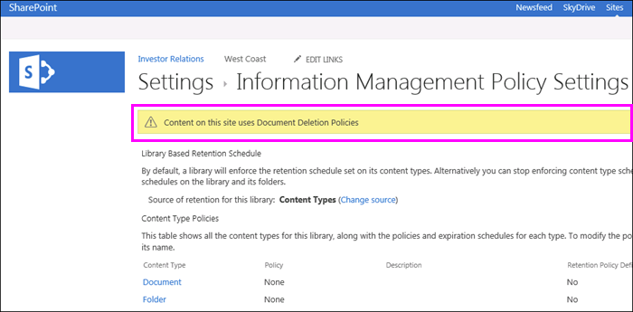

# Application ou suppression d’une stratégie de suppression de documents pour un site

Les organisations sont souvent soumises à des réglementations de conformité, juridiques ou autres qui les obligent à conserver des documents pendant une certaine période de temps. Toutefois, conserver des documents plus longtemps que nécessaire peut exposer l’organisation à un risque juridique. Pour cette raison, votre organisation peut avoir créé une stratégie de suppression de documents pour votre site (par exemple, il se pourrait que les documents commerciaux généraux doivent être supprimés cinq ans après leur création).
  
Selon votre organisation, une stratégie de suppression de documents peut être :
  
- **Obligatoire** Un propriétaire de site ne peut pas refuser une stratégie obligatoire, qui est automatiquement appliquée au site. 
    
- **Par défaut** Une stratégie par défaut est automatiquement appliquée à un site, mais un propriétaire de site peut : 
    
  - choisir une autre stratégie, le cas échéant ;
    
  - refuser complètement la stratégie si elle n’est pas pertinente pour le contenu du site.
    
- **Ni obligatoire ni par défaut** Dans ce cas, aucune stratégie n’est appliquée automatiquement au site, et le propriétaire du site doit prendre des mesures pour en appliquer une. 
    
Une stratégie de suppression de documents peut contenir plusieurs règles (par exemple, une règle peut exiger la suppression des documents un an après leur création, mais une autre règle peut exiger la suppression des documents un an après leur dernière modification). Si une stratégie contient plusieurs règles, vous pouvez sélectionner la règle qui s’applique le mieux à votre site. La règle de suppression s’appliquera à toutes les bibliothèques du site. Une seule stratégie et une seule règle peuvent être actives simultanément dans un site. À l’instar d’une stratégie, une règle peut être définie comme règle par défaut, afin d’être appliquée automatiquement lorsque la stratégie est appliquée.
  
Enfin, les stratégies de suppression de documents sont héritées. Lorsque vous sélectionnez une stratégie ou une règle pour votre site, cette sélection est héritée par tous les sous-sites, bien que le propriétaire d’un sous-site puisse annuler l’héritage en sélectionnant une stratégie ou une règle différente. Lorsque vous sélectionnez une stratégie ou une règle, tenez compte du contenu des sous-sites sous votre site.
  
## Affichage des stratégies de suppression de documents disponibles dans une collection de sites

Votre organisation peut affecter des stratégies différentes à des collections de sites différentes. Au niveau de la collection de sites, le propriétaire d’une collection de sites peut afficher toutes les stratégies de suppression de documents disponibles pour cette collection de sites. Les stratégies peuvent avoir été mises à la disposition du modèle de collection de sites (et donc de toutes les collections de sites créées à partir de ce modèle) ou de cette collection de sites spécifique.
  
1. Dans le site de niveau supérieur dans la collection de sites, dans le coin supérieur droit, choisissez **paramètres** [icône d’engrenage] \> **Paramètres du Site**.
    
2. Sous **Administration de la Collection Site** \> **stratégies de suppression de documents**.
    
    > [!NOTE]
    > Le lien **Stratégies de suppression de documents** n’apparaît pas, sauf si les stratégies ont été affectées à la collection de sites. En outre, le lien ne s’affiche pas immédiatement une fois que les stratégies ont été affectées au site, il peut prendre jusqu'à 24 heures à partir de lorsque les stratégies sont attribuées aux lorsque le lien **Stratégies de suppression de documents** apparaît. 
  
3. Cette page permet d’afficher :
    
  - les stratégies actuellement affectées et les règles associées. Sélectionnez une stratégie pour afficher les règles dans le volet de droite.
    
  - La stratégie par défaut, le cas échéant, affiche **Oui** dans la colonne **Par défaut**. 
    
  - Un message s’affiche sous la liste si la stratégie a été affectée comme **Obligatoire**.
    
Cette liste est en affichage uniquement, pour que le propriétaire de la collection de sites visualise toutes les stratégies et les règles disponibles. Pour appliquer une stratégie, consultez la section suivante.
  

  
## Application ou suppression d’une stratégie de suppression de documents pour un site

En tant que propriétaire de site ou propriétaire de collection de sites, votre organisation peut avoir créé des stratégies que vous pouvez appliquer à votre site ou refuser complètement.
  
1. Dans le coin supérieur droit, choisissez **paramètres** [icône d’engrenage] \> **Paramètres du Site**.
    
2. Sous **Administration du Site** \> **stratégies de suppression de documents**.
    
    > [!NOTE]
    > Le lien **Stratégies de suppression de documents** n’apparaît pas, sauf si les stratégies ont été affectées à la collection de sites. En outre, le lien ne s’affiche pas immédiatement une fois que les stratégies ont été affectées au site, il peut prendre jusqu'à 24 heures à partir de lorsque les stratégies sont attribuées aux lorsque le lien **Stratégies de suppression de documents** apparaît. 
  
3. Effectuez l’une des opérations suivantes :
    
  - **Pour appliquer une stratégie** Sélectionnez une stratégie \> sélectionnez une règle dans cette stratégie \> **Enregistrer**.
    
    Une seule stratégie et une seule règle peuvent être actives simultanément dans un site. Votre organisation peut fournir plusieurs stratégies et règles à choisir, ou une seule stratégie ou règle.
    
    
  
  - **Pour refuser une stratégie** Choisissez **annulations : Notez Delete** \> **Enregistrer**.
    
    En tant que propriétaire du site, vous pouvez refuser une stratégie de suppression de documents si vous déterminez que la stratégie ne s’applique pas au contenu de votre site. Toutefois, vous ne pouvez pas refuser une stratégie qui a été marquée comme **Obligatoire**.
    
    
  
## Les stratégies de suppression de documents remplacent les autres stratégies

Un site peut utiliser d’autres stratégies pour la conservation et la suppression du contenu :
  
- stratégies de type de contenu de la collection de sites ;
    
- stratégies de gestion des informations pour une liste ou une bibliothèque.
    
Si vous appliquez une stratégie de suppression de documents à un site qui utilise déjà des stratégies de type de contenu ou des stratégies de gestion des informations pour une liste ou une bibliothèque, ces stratégies sont ignorés lorsque la stratégie de suppression de document est en vigueur. Si les autres stratégies sont ignorés, vous verrez le message « Contenu sur ce site utilise les stratégies de suppression de Document ».
  
Cela signifie que vous devez planifier qu’un site n’utilise que des stratégies destinées à du contenu structuré (stratégies de gestion des informations et stratégies de type de contenu) ou à du contenu non structuré (stratégies de suppression de documents), et non les deux. Si vous refusez une stratégie de suppression de documents, l’avertissement ne s’affiche pas et d’autres types de stratégies continueront à fonctionner.
  
Les stratégies de site ne sont pas affectées par les stratégies de suppression de documents.
  
### Déterminer si les stratégies de type de contenu sont ignorées

Si votre site a été à l’aide de stratégies de type de contenu et vous maintenant voir ce message, ces stratégies ne sont plus en vigueur. Pour restaurer les stratégies de type de contenu, vous pouvez supprimer la stratégie de suppression de documents de votre site, comme décrit précédemment, si l’option exclure est disponible. S’il n’existe aucune option pour exclure, la stratégie de suppression de documents est obligatoire, et vous devez contacter le responsable de la conformité de votre organisation.
  
1. Dans le coin supérieur droit, choisissez **paramètres** [icône d’engrenage] \> **Paramètres du Site**.
    
2. Sous **Administration du Site** \> **les modèles de stratégie de Type de contenu**.
    
    
  
### Déterminer si les stratégies de gestion des informations sont ignorées

Si votre site a été à l’aide de stratégies de gestion des informations et vous maintenant voir ce message, ces stratégies ne sont plus en vigueur. Pour restaurer les stratégies de gestion d’informations, vous pouvez supprimer la stratégie de suppression de documents de votre site, comme décrit précédemment, si l’option exclure est disponible. S’il n’existe aucune option pour exclure, la stratégie de suppression de documents est obligatoire, et vous devez contacter le responsable de la conformité de votre organisation.
  
- Pour une liste ou une bibliothèque, dans le ruban \> onglet **bibliothèque** \> **Paramètres de la bibliothèque** \> sous **autorisations et gestion** \> **Paramètres de stratégie de gestion des informations**.
    
    
  
## Voir aussi

[Vue d’ensemble des stratégies de suppression de documents](document-deletion-policies.md)
  
[Création d’une stratégie de suppression de documents](create-a-document-deletion-policy.md)

