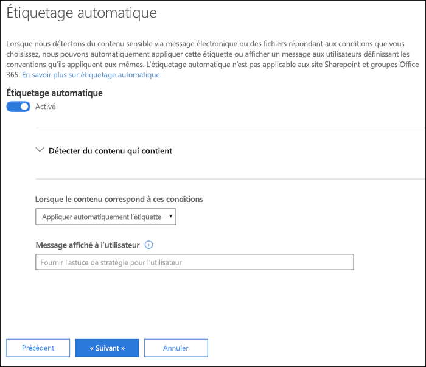
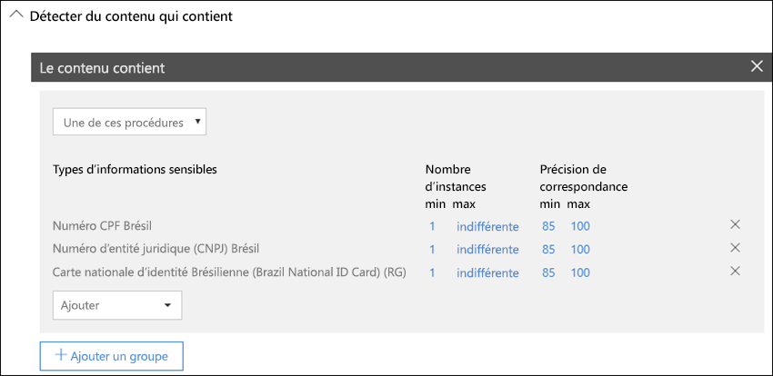
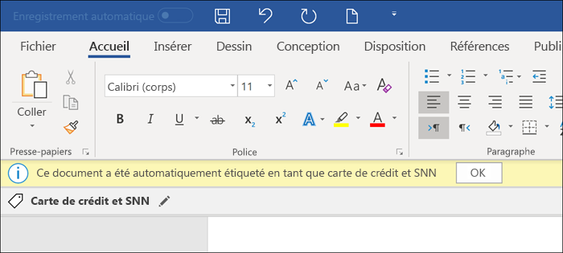
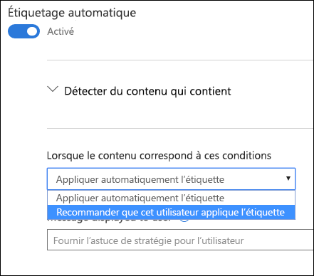

# Appliquer automatiquement une étiquette sensibilité au contenuApply a sensitivity label to content automatically

Lorsque vous créez une étiquette de sensibilité, vous pouvez affecter automatiquement une étiquette à un document ou message électronique ou vous pouvez inviter les utilisateurs pour sélectionner l’étiquette que vous recommandez.When you create a sensitivity label, you can automatically assign that label to content containing sensitive information, or you can prompt users to apply the label that you recommend.

La possibilité d’appliquer automatiquement des étiquettes à du contenu est importante pour les raisons suivantes :The ability to apply sensitivity labels to content automatically is important because:

- Vous n’avez pas besoin de former les utilisateurs concernant l’ensemble de vos classifications.You don't need to train your users on all of your classifications.

- Vous n’avez pas à dépendre des utilisateurs pour classer correctement tout le contenu.You don't need to rely on users to classify all content correctly.

- Les utilisateurs n’ont plus à connaître les stratégies de gouvernance des données : à la place, ils peuvent se concentrer sur leur travail.Users no longer need to know about your policies - they can instead focus on their work.

> [!NOTE]
> La capacité à appliquer automatiquement des étiquettes nécessite un abonnement Azure Information Protection P2. Pour utiliser cette fonctionnalité, vous devez [télécharger et installer le client Azure Information Protection unifié étiquetage](https://docs.microsoft.com/fr-FR/azure/information-protection/rms-client/install-unifiedlabelingclient-app). Nous travaillons à la prise en charge native pour cette fonctionnalité dans les applications Office, afin qu’elle n’exige pas que le client Azure Information Protection unifié création d’étiquettes. Par ailleurs, le client de création d’étiquettes unifié ne s’exécute que sur Windows, afin que cette fonctionnalité ne soit pas encore prise en charge sur Mac, iOS et Android.The capability to apply labels automatically requires an Azure Information Protection P2 subscription. To use this feature, you must [Download and install the Azure Information Protection unified labeling client](https://docs.microsoft.com/fr-FR/azure/information-protection/rms-client/install-unifiedlabelingclient-app). We're working on native support for this feature in Office apps, so that it won't require the Azure Information Protection unified labeling client. Also, the unified labeling client runs only on Windows, so this feature is not yet supported on Mac, iOS, and Android.

## Application d’une étiquette automatiquement en fonction des conditionsApply a sensitivity label automatically based on conditions

L’une des fonctionnalités les plus puissantes des étiquettes de sensibilité est la possibilité de les appliquer automatiquement au contenu qui remplit certaines conditions. Dans ce cas, les membres de votre organisation ne doivent pas appliquer ces étiquettes de sensibilité: Office 365 s’en charge à leur place.One of the most powerful features of sensitivity labels is the ability to apply them automatically to content that matches certain conditions. In this case, people in your organization don't need to apply the sensitivity labels - Office 365 does the work for them.
   
Vous pouvez choisir d’appliquer automatiquement des étiquettes de sensibilité au contenu quand celui-ci inclut des types spécifiques d’informations sensibles. Lorsque vous configurez une étiquette de sensibilité à être appliquée automatiquement, vous voyez la même liste de types d’informations sensibles comme lorsque vous créez une stratégie prévention contre la perte de données. Par conséquent vous pouvez, par exemple, appliquer automatiquement une étiquette hautement confidentielle à tout contenu qui contient des informations d’identification personnelle des clients (PII) telles que les numéros de sécurité sociale ou carte bancaire.You can choose to apply sensitivity labels to content automatically when that content contains specific types of sensitive information. When you configure a sensitivity label to be applied automatically, you see the same list of sensitive information types as when you create a data loss prevention (DLP) policy. So you can, for example, automatically apply a Highly Confidential label to any content that contains customers' personally identifiable information (PII), such as credit card numbers or social security numbers. 

Après avoir choisi vos types d’informations sensibles sections, vous pouvez affiner votre condition en modifiant le nombre d’instances ou précision de correspondance. Pour plus d’informations, voir [Optimisation des règles afin de les rendre plus facile ou plus difficile pour correspondre à](data-loss-prevention-policies.md#tuning-rules-to-make-them-easier-or-harder-to-match).After you choose your sensitive informaton types, you can refine your condition by changing the instance count or match accuracy. For more information, see [Tuning rules to make them easier or harder to match](data-loss-prevention-policies.md#tuning-rules-to-make-them-easier-or-harder-to-match).

De plus, vous pouvez choisir si une condition doit détecter les types sensibles relatifs ou simplement l’un d’eux. Et pour rendre vos conditions plus flexible ou complexes, vous pouvez ajouter des groupes et utiliser les opérateurs logiques entre les groupes. Pour plus d’informations, voir [Opérateurs logiques et regroupement](data-loss-prevention-policies.md#grouping-and-logical-operators).Further, you can choose whether a condition must detect all of the sensitive infromation types, or just one of them. And to make your conditions more flexible or complex, you can add groups and use logical operators between the groups. For more information, see [Grouping and logical operators](data-loss-prevention-policies.md#grouping-and-logical-operators).

Lorsqu’une étiquette de critère de diffusion est automatiquement appliquée, l’utilisateur voit une notification dans leur application Office. Ils peuvent choisir **OK**pour fermer la notification.When a sensitivity label is automatically applied, the user sees a notification in their Office app. They can choose **OK** to dismiss the notification.

## Recommandé que l’utilisateur applique une étiquette de critère de diffusionRecommend that the user apply a sensitivity label

Si vous préférez, au lieu d’appliquer une étiquette sensibilité automatiquement au contenu, vous pouvez recommander à vos utilisateurs qu’elles s’appliquent à l’étiquette. Cette option permet à vos utilisateurs d’accepter la classification et toute protection associée ou faire disparaitre la valeur recommandée si l’étiquette n’est pas appropriée à leur document ou message électronique.If you prefer, instead of applying a sensitivity label automatically to content, you can recommend to your users that they apply the label. This option provides your users the flexibility of accepting the classification and any associated protection, or dismissing the recommendation if the label is not suitable for their document or email.

Notez que les étiquettes recommandées sont prises en charge dans Word, PowerPoint et Excel (et requièrent que l’étiquette client Proteciton Informations Azure unifiée soit bien installée). Nous travaillons à la prise en charge pour les étiquettes recommandées dans Outlook.Note that recommended labels are supported in Word, PowerPoint, and Excel (and require that the Azure Information Proteciton unified labeling client is installed). We're working on support for recommended labels in Outlook.

Voici un exemple d’une invite de commandes lorsque vous configurez une condition à appliquer une étiquette comme action recommandée avec un Conseil de stratégie personnalisé. Vous pouvez choisir quel texte s’affiche dans le Conseil de stratégie.Here's an example of a prompt when you configure a condition to apply a label as a recommended action, with a custom policy tip. You can choose what text is displayed in the policy tip.

## Comment les étiquettes automatiques ou recommandées sont appliquéesHow automatic or recommended labels are applied

- L’étiquetage automatique s’applique à Word, Excel et PowerPoint lorsque les documents sont enregistrés et dans Outlook lorsque des messages électroniques sont envoyés. Ces conditions détectent les informations sensibles dans le corps de texte dans des documents et messages électroniques et aux en-têtes et pieds de page, mais pas dans la ligne d’objet ou des pièces jointes de message électronique.Automatic labeling applies to Word, Excel, and PowerPoint when documents are saved, and to Outlook when emails are sent. These conditions detect sensitive information in the body text in documents and emails, and to headers and footers -- but not in the subject line or attachments of email.

- Vous ne pouvez pas utiliser la classification automatique pour les documents et messages électroniques qui ont été précédemment intitulés manuellement ou précédemment automatiquement libellés avec une classification une version ultérieure. N’oubliez pas, un document ou un courrier électronique peut avoir uniquement une seul niveau de confidentialité étiquette (outre une étiquette unique rétention).You cannot use automatic classification for documents and emails that were previously manually labeled, or previously automatically labeled with a higher classification. Remember, a document or email can have only a single sensitivity label applied to it (in addition to a single retention label).

- La classification recommandée s’applique à Word, Excel et PowerPoint lorsque les documents sont enregistrés. Nous travaillons sur la prise en charge d’étiquetage recommandée dans Outlook.Recommended classification applies to Word, Excel, and PowerPoint when documents are saved. We're working on support for recommended labeling in Outlook.

- Vous ne pouvez pas utiliser la classification recommandée pour les documents qui ont été précédemment libellés avec une classification une version ultérieure. Dans ce cas, lorsque le contenu est déjà libellé avec une classification supérieure, l’utilisateur ne verra pas l’invite de commandes avec la recommandation et le conseil de stratégie.You cannot use recommended classification for documents that were previously labeled with a higher classification. In this case, when the content's already labeled with a higher classification, the user won't see the prompt with the recommendation and policy tip.

## Comment plusieurs conditions sont évaluées lorsqu’elles s’appliquent à plus d’une étiquetteHow multiple conditions are evaluated when they apply to more than one label

Les étiquettes sont classées pour évaluation en fonction de leur position que vous spécifiez dans la stratégie: l’étiquette positionné a tout d’abord la position la plus basse (au moins sensible) et l’étiquette positionnée a dernière position plus élevée (plus sensible). Pour plus d’informations sur la priorité, voir [Priorité étiquettes (ordre aspects importants)](sensitivity-labels.md#label-priority-order-matters).The labels are ordered for evaluation according to their position that you specify in the policy: The label positioned first has the lowest position (least sensitive) and the label positioned last has the highest position (most sensitive). For more information on priority, see [Label priority (order matters)](sensitivity-labels.md#label-priority-order-matters).