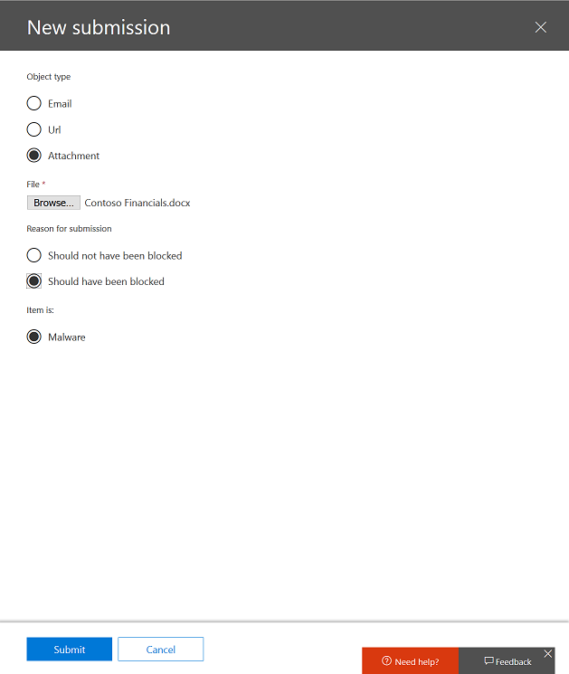

# Soumissions de l’administrateur dans Office 365 ATP

Les administrateurs peuvent désormais envoyer des courriers électroniques à l’aide de l’ID de message réseau, des URL et des fichiers pour l’analyse par Microsoft dans Office 365. La section soumissions mises à jour inclut toujours les messages signalés par l’utilisateur. 

Lorsque vous soumettez un message électronique, vous obtenez des informations sur les stratégies susceptibles d’avoir autorisé le courrier entrant dans votre client, ainsi que sur l’examen de toutes les URL et pièces jointes du courrier. Les stratégies pouvant avoir autorisé un courrier incluent la liste des expéditeurs approuvés d’un utilisateur individuel, ainsi que des stratégies au niveau du client telles que les règles ETR. 

## Envoi de contenu

Pour envoyer du contenu à Microsoft, cliquez sur le bouton **nouvelle soumission** dans la partie supérieure gauche de la page soumissions. Un menu volant sur le côté droit de la page apparaît avec la possibilité d’envoyer un message électronique, une URL ou un fichier. 

### E-mail

1. Pour envoyer un message électronique, sélectionnez **courrier électronique** et spécifiez l' **ID de message réseau** de messagerie ou téléchargez le fichier de courrier électronique. 

2. Spécifiez le ou les destinataires sur lesquels vous souhaitez exécuter la vérification de stratégie. La vérification de stratégie détermine si l’analyse du courrier électronique a contourné les messages en raison des stratégies de niveau utilisateur ou client. 

3. Indiquez si l’e-mail doit avoir été bloqué ou non. Si la messagerie doit avoir été bloquée, indiquez si elle doit être bloquée en tant que courrier indésirable, hameçonnage ou programme malveillant. Si vous n’êtes pas certain de son type, utilisez votre meilleure appréciation.  

* Si le filtre a été contourné en raison de stratégies lors de l’envoi, vous verrez des informations sur cette stratégie.

* Si le filtre n’a pas été contourné en raison d’une ou de plusieurs stratégies, l’analyse se terminera en quelques minutes. Vous verrez des informations supplémentaires sur l’envoi en cliquant sur le lien État. Cela inclut les résultats de la vérification de stratégie et le verdict de nouvelle analyse. Remarque cela n’exécute pas de nouveau le courrier électronique via la pile de filtrage complet DAV d’Office 365 mais exécute une nouvelle analyse partielle en fonction de certains attributs de l’e-mail, de l’URL ou du fichier. 

4. Cliquez sur le bouton **Envoyer** .

### URL

1. Pour soumettre une URL, sélectionnez **URL** dans le menu volant. Tapez l’URL complète, y compris le protocole (**https://**). 

* Si vous avez sélectionné **doit avoir été filtré**, spécifiez si l’URL est un hameçonnage ou un programme malveillant.

2. Cliquez sur le bouton **Envoyer** . 

### File

1. Pour soumettre un fichier, sélectionnez **fichier** dans le menu volant et téléchargez le fichier que vous souhaitez analyser. 

2. Cliquez sur le bouton **Envoyer** .

## Sujets associés

[Plan 2 de protection avancée contre les menaces Office 365](office-365-ti.md)
  
[Se protéger contre les menaces dans Office 365](protect-against-threats.md)
  
[Afficher les rapports pour Office 365 protection avancée contre les menaces](view-reports-for-atp.md)
  

