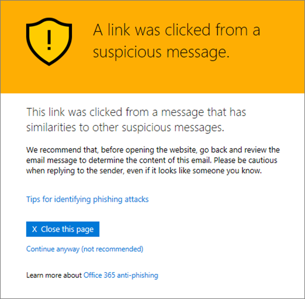

# Pages d’avertissement Office 365 liens fiables DAV

[Protection de Microsoft Office 365 menace avancées](office-365-atp.md) (DAV) vous aide à protéger votre organisation contre les tentatives de hameçonnage et les programmes malveillants par le biais de fonctionnalités, telles que [Des liens fiables DAV](atp-safe-links.md), [DAV fiables](atp-safe-attachments.md)de [protection anti - hameçonnage](anti-phishing-protection.md). Lors de la protection est en place, des liens (URL) dans les messages électroniques et des documents Office sont vérifiés. Si une URL est identifiée comme suspect ou malveillant, vous pouvez ne pas ouvrir l’URL lorsque vous cliquez dessus. Au lieu de passer directement au site, vous pouvez voir une page d’avertissement à la place. 
  
Lisez cet article pour afficher des [exemples de pages d’avertissement](atp-safe-links-warning-pages.md#examples) qui peuvent apparaître, ainsi que [récent met à jour pour les pages d’avertissement](atp-safe-links-warning-pages.md#updates).
  
## Exemples de pages d’avertissement

### Analyse le lien DAV

Une URL est analysée par des liaisons fiables DAV. Vous devrez peut-être patienter quelques instants avant d’essayer de nouveau le lien.

### Une URL est dans un message électronique suspect

L’URL est dans un message électronique qui semble similaire aux autres messages électroniques qui sont considérés comme suspects. Il est recommandé que vous vérifiez de nouveau le message électronique avant de procéder au site.

### Une URL est dans un message identifié comme une tentative de hameçonnage

L’URL est dans un message électronique qui a été identifié comme une attaque par hameçonnage. Par conséquent, toutes les URL dans le message électronique sont bloqués. Il est recommandé que vous ne poursuivez pas au site.

### Un site a été identifié comme malveillants

L’URL pointe vers un site qui a été identifié comme malveillants.    Il est recommandé que vous ne poursuivez pas au site.

### Un site est bloqué.

L’URL est bloquée pour votre organisation. Il existe plusieurs raisons pourquoi une URL peut-être être bloquée. Nous vous conseillons de contacter l’administrateur de votre organisation Office 365.

### Une erreur s’est produite

Un type d’erreur s’est produite, et l’URL ne peut pas être ouvert.

## Dernières mises à jour aux pages d’avertissement

Plusieurs pages d’avertissement ont été récemment mis à jour pour Office 365 DAV. Si vous ne voyez pas déjà les pages mises à jour, vous allez bientôt. Les mises à jour incluent un jeu de couleurs, plus de détails et la possibilité de passer à un site en dépit de l’avertissement donné et les recommandations.

### Analyse d’URL en cours

Page d’avertissement d’origine :

Page d’avertissement mis à jour :

### Avertissement de site malveillant

Page d’avertissement d’origine :

Page d’avertissement mis à jour :

### Bloqué avertissement d’URL

Page d’avertissement d’origine :

Page d’avertissement mis à jour :

### « Une erreur s’est produite » page d’avertissement

Page d’avertissement d’origine :

Page d’avertissement mis à jour :

   
## Voir aussi

[Comment Office vous aide à vous protéger contre les schémas de phishing](https://support.office.com/article/be0de46a-29cd-4c59-aaaf-136cf177d593)
  
[Liens sécurisés Office 365 DAV](atp-safe-links.md)
  
[Office 365 DAV approuvés en pièce jointe](atp-safe-attachments.md)
  
[Protection contre le courrier indésirable et les programmes malveillants dans Office 365](anti-spam-and-anti-malware-protection.md)
  

