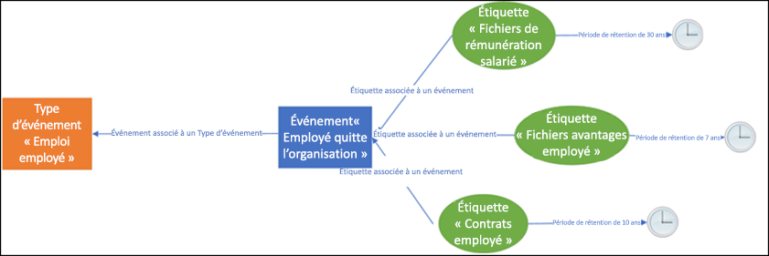
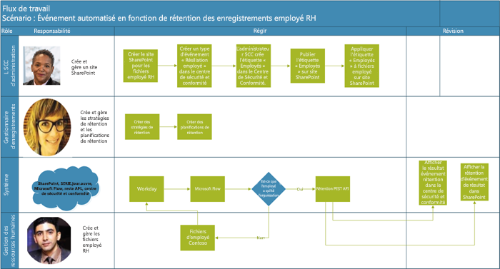
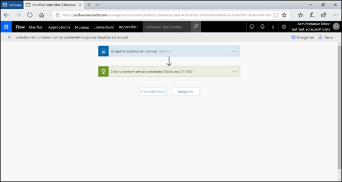
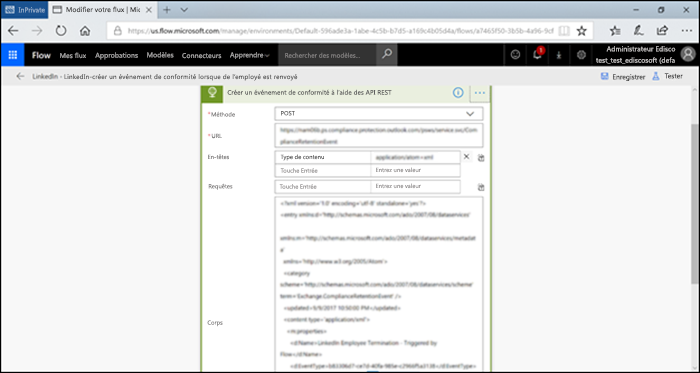
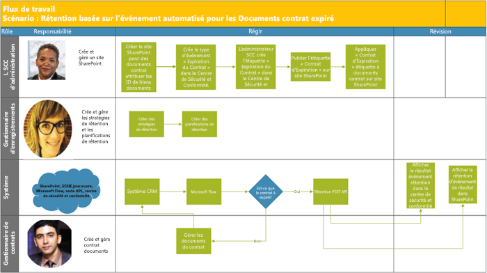
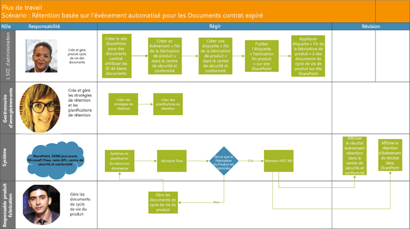

# Rétentions basées sur des événementsAutomate event-based retention

L’explosion de contenu dans les organisations et comment il peut devenir assistées (redondantes, obsolètes, triviale) est une affaire sérieuse. Pour continuer à répondre aux exigences légales, commerciales et défis liés à la conformité des réglementations, les entreprises doivent pouvoir conserver et protéger les informations importantes et trouver rapidement ce qui est pertinent. Conservant uniquement ce qui est important, les informations pertinentes sont la clé du succès d’une entreprise.The explosion of content in organizations and how it can become ROT (redundant, obsolete, trivial) is serious business. To continue to meet legal, business, and regulatory compliance challenges, businesses must be able to keep and protect important information and quickly find what’s relevant. Retaining only important, pertinent information is key to a business’s success.

Les organisations peuvent donc tirer parti des solutions de rétention dans le centre de conformité et sécurité Office 365. La rétention peut être déclenchée en utilisant les[étiquettes de rétention](labels.md). Une étiquette de rétention a la possibilité de [baser la période de rétention sur un événement spécifique](event-driven-retention.md). En règle générale, la période de rétention est basée sur une date connue, comme la date ou date de dernière modification pour le contenu création. Toutefois, les organisations ont également des exigences à dispose de contenu en fonction des occurrences d’un événement, par exemple 7 ans après qu’un employé quitte une organisation.Hence organizations can take advantage of retention solutions in the Office 365 Security & Compliance Center. Retention can be triggered by using [retention labels](labels.md). A retention label has the option to [base the retention period on a specific event](event-driven-retention.md). Typically, the retention period is based on a known date, such as the creation date or last modified date for the content. However, organizations also have requirements to dispose of content based on the occurrence of an event, such as 7 years after an employee leaves an organization.

Pour s’assurer de la conformité de la destruction de contenu, il est impératif de savoir quand un événement a lieu. Le volume du contenu en augmentant rapidement, il devient difficile à conserver et dispose du contenu d’une manière opportune et la conformité.In order to ensure compliant disposal of content, it is imperative to know when an event takes place. With the volume of content increasing rapidly, it is becoming challenging to retain and dispose content in a timely and compliant manner.

La rétention basée sur un événement résoud ce problème. Cette rubrique explique comment configurer votre flux de processus métier pour automatiser la rétention via des événements à l’aide de l’API REST de Microsoft 365.Event-based retention solves this problem. This topic explains how to set up your business process flows to automate retention through events by using the Microsoft 365 REST API.

## Rétentions basées sur des événementsAbout event-based retention

Une organisation peut être grande petite ou moyenne. Le nombre de documents professionnels, documents juridiques, fichiers employé, contrats et documents produit qui sont créés et gérés sur une base quotidienne augmentent considérablement.An organization can be small, medium, or large. The number of business documents, legal documents, employee files, contracts, and product documents that get created and managed on a day to day basis is increasing dramatically.

Par exemple, chaque jour, dizaines et des centaines d’employés rejoignent et quittent organisations. Le service ressources humaines continue de créer, mettre à jour ou supprimer des documents liés à l’employé en respectant les exigences professionnelles. Ce processus est susceptible d’être les stratégies de rétention différentes décrites pour l’entreprise :For example, each day, tens and hundreds of employees are joining and leaving organizations. The HR department continues to create, update, or delete employee-related documents as per business requirements. This process is subject to the different retention policies outlined for the business:

- **La période de rétention du contenu peut être une date connue** telles que la date que le contenu a été créé, la dernière modification ou étiqueté. Par exemple, vous pouvez conserver les documents pendant sept ans après que qu’ils aient été créés, puis les supprimer.**The period of retention for content can be a known date** such as the date the content was created, last modified or labeled. For example, you might retain documents for seven years after they're created and then delete them.

- **La période de rétention du contenu peut également être une date inconnue**. Par exemple, avec des étiquettes de rétention, vous pouvez également baser une période de rétention sur lorsqu’un type spécifique d’événement se produit, par exemple un employé quittant l’organisation.**The period of retention of content can also be an unknown date**. For example, with retention labels, you can also base a retention period on when a specific type of event occurs, such as an employee leaving the organization.

Le début de la période de rétention déclenche l’événement, et tout le contenu portant une étiquette pour ce type d’événement obtenez actions de rétention l’étiquette est appliquées dessus. Il s’agit rétention basée sur l’événement-pour plus d’informations, voir [vue d’ensemble de rétention basées sur les événements](event-driven-retention.md).The event triggers the start of the retention period, and all content with a label applied for that type of event get the label's retention actions enforced on them. This is called event-based retention - to learn more, see [Overview of event-driven retention](event-driven-retention.md).

## Définir la rétentions basées sur des événementsSet up event-based retention

Cette section décrit les activités devant être effectuées avant la conservation du contenu.This section describes what needs to be done prior to retaining content.

### Identifier les rôlesIdentify roles

Identifier les différents rôles d’une organisation qui effectuent des tâches de gestion d’enregistrement qui seraient responsables de la rétention efficace et de documents professionnels.Identify the different roles in an organization that perform Record Management tasks that would be responsible for effective and efficient retention of business documents.

  | **Persona****Persona**| **Rôle****Role**|
  | - | - |
  | Centre d’administration de Sécurité et Conformité
Security & Compliance Center admin | Crée des types d’Événement de Rétention, Étiquettes de Rétention et Référentiels d’Enregistrement dans SharePointCreates Retention Event types, Retention labels and Record repositories in SharePoint |
  | Gestionnaire d’enregistrementsRecords Manager                                  | Fournit des détails de recommandations et de conformité stratégies de rétention et des plannings de rétentionProvides Retention Policies and Retention Schedules guidance and compliance details   |
  | Administrateur système (entreprise)System Admin (business)                          | Configure et gère les systèmes externes pour fonctionner avec Microsoft 365Sets up and manages external systems to work with Microsoft 365                       |
  | Travailleur de l'informationInformation Worker                               | Gère le cycle de vie de leur processus métier (RH, Finance, etc. informatique)Manages the lifecycle of their business process (HR, Finance, IT etc)                 |

### Accéder au Centre de Conformité et de SécuritéSet up the Security & Compliance Center
  
1. L’administrateur de conformité crée un type d’événement-par exemple, la résiliation employé ou d’Expiration de contrat ou fin de fabrication de produit (reportez-vous aux processus étape par étape dans [article rétention événement](https://docs.microsoft.com/fr-FR/office365/securitycompliance/event-driven-retention)Compliance admin creates an event type – for example, Employee Termination or Contract Expiration or End of Product Manufacturing (Please refer to step by step process in [Event retention article](https://docs.microsoft.com/fr-FR/office365/securitycompliance/event-driven-retention)
    
1. Crée une étiquette en fonction d’un événement et l’associe à un type d’événementCompliance admin creates a retention label based on an event and associates the label with an event type
    
1. Il existe 4 types de déclencheurs pour les étiquettes de rétention :There are 4 types of triggers for retention labels:
            
    1. Date de créationCreate date
                
    1. Dernière modificationLast modified
                
    1. Date étiquette (lorsque le contenu a été étiqueté)Label date (when the content was labeled)
                
    1. Basé sur des événementsEvent-based
    
1. Administrateur de conformité publie l’étiquetteCompliance admin publishes the label

### Configurer SharePointSet up SharePoint
   
Pour créer un référentiel des enregistrements, l’administrateur de conformité :To create a records repository, the compliance admin:

1. Crée un site SharePoint.Creates a SharePoint site.

1. Effectue les opérations suivantes :Does one of the following:
        
    - Crée une bibliothèque SharePoint : définir l’étiquette en fonction des événement au niveau de la bibliothèque. Pour plus d’informations, voir [application d’une étiquette de rétention par défaut à tout le contenu dans une bibliothèque SharePoint, un dossier ou un ensemble de documents](labels.md#applying-a-default-retention-label-to-all-content-in-a-sharepoint-library-folder-or-document-set).Creates a SharePoint library: Set event-based label at the library level. For more information, see [Applying a default retention label to all content in a SharePoint library, folder, or document set](labels.md#applying-a-default-retention-label-to-all-content-in-a-sharepoint-library-folder-or-document-set).
          
    - Configure un Document ensemble dans SharePoint. Pour plus d’informations, voir [présentation des ensembles de documents](https://support.office.com/fr-FR/article/Introduction-to-Document-Sets-3DBCD93E-0BED-46B7-B1BA-B31DE2BCD234).Sets up a Document set in SharePoint. For more information, see [Introduction to document sets](https://support.office.com/fr-FR/article/Introduction-to-Document-Sets-3DBCD93E-0BED-46B7-B1BA-B31DE2BCD234).
      
1. Attribue des Id de l’élément (biens QU'ID est un nom de produit ou un code utilisé par l’organisation, par exemple, la matricule peut être un id de l’élément) à chaque document employé définir (en attribuant des biens QU'ID dans le dossier, tous les éléments dans ce dossier hérite automatiquement le même ID de biens. Cela signifie que tous les éléments peuvent avoir leur période de rétention déclenchée par le même événement.Assigns Asset Id (asset ID is a product name or code used by the organization, for example, Employee number can be an asset id) to each employee document set (By assigning the asset ID to the folder, every item in that folder automatically inherits the same asset ID. This means all the items can have their retention period triggered by the same event.

## Méthodes pour déclencher la lecture rétention basée sur l’événementWays to trigger event-based retention

Il existe deux façons avec lesquelles la rétention basée sur l’événement peut être déclenchée :There are two ways in which event-based retention can be triggered:

- **À l’aide de sécurité et l’interface utilisateur du centre de conformité** il s’agit d’un processus qui peut être utilisé pour conserver le contenu est inférieure à la fois ou la fréquence de déclencheur rétention n’est pas souvent, par exemple, mensuelle ou annuelle. Pour plus d’informations sur cette méthode, voir [vue d’ensemble de rétention basées sur les événements](event-driven-retention.md). Toutefois, cette méthode pour déclencher la lecture rétention peut prendre du temps et sujettes aux erreurs, par conséquent rabougrissement évolutivité. Par conséquent, une solution automatisée, transparente associer au déclenchement de rétention peut améliorer la sécurité et conformité des données.**Using Security & Compliance Center UI** This is a process that can be used to retain less content at a time or the frequency to trigger retention is not often, such as monthly or yearly. For more information on this method, see [Overview of event-driven retention](event-driven-retention.md). However, this way to trigger retention can be time-consuming and prone to error, thus stunting scalability. Therefore, an automated, seamless solution to trigger retention can enhance the security and compliance of data.

- **À l’aide d’une API REST M365** Ce processus peut être utilisé lorsque les grandes quantités de contenu sont conservées à un moment et/ou la fréquence de rétention déclencheur est récurrente telle que de manière quotidienne ou hebdomadaire. Le flux détecte quand un événement se produit dans votre système métier de, puis crée automatiquement un événement connexe dans le centre de sécurité et conformité. Vous n’avez pas besoin de créer manuellement un événement dans l’interface utilisateur chaque fois que ce qui se passer.**Using a M365 REST API** This process can be used when large amounts of content are to be retained at a time and/or the frequency to trigger retention is often such as daily or weekly. The flow detects when an event occurs in your line-of-business system, and then automatically creates a related event in the Security & Compliance Center. You don't need to manually create an event in the UI each time one occurs.

Il existe deux options d’utilisation de l’API REST :There are two options for using the REST API:

- **Microsoft Flow ou une application similaire** peut être utilisé(e )pour déclencher automatiquement l’occurrence d’un événement. Microsoft Flow est un orchestrateur pour la connexion à d’autres systèmes. À l’aide de Microsoft Flow ne requiert pas une solution personnalisée.**Microsoft Flow or a similar application** can be used to trigger the occurrence of an event automatically. Microsoft Flow is an orchestrator for connecting to other systems. Using Microsoft Flow does not require a custom solution.

- **PowerShell ou un HTTP client pour appeler des API REST** à l’aide de PowerShell (version 6 ou version ultérieure) pour appeler l’API REST Microsoft 365 pour créer des événements.**PowerShell or an HTTP client to call REST API** Using PowerShell (version 6 or higher) to call Microsoft 365 REST API to create events. 

L’API Rest est un point de terminaison de service qui prend en charge des ensembles d’opérations HTTP (méthodes), qui fournit créer/récupération/mise à jour/supprimer l’accès aux ressources de service- pour plus d’informations, voir [composants d’une demande de l’API REST/réponse](https://docs.microsoft.com/fr-FR/rest/api/gettingstarted/#components-of-a-rest-api-requestresponse) . Dans ce cas, les événements peuvent être créés en utilisant l’API REST de Microsoft 365 et récupérées à l’aide d’opérations (méthodes) POST et GET.A Rest API is a service endpoint that supports sets of HTTP operations (methods), which provide create/retrieve/update/delete access to the service's resources - for more information, see [Components of a REST API request/response](https://docs.microsoft.com/fr-FR/rest/api/gettingstarted/#components-of-a-rest-api-requestresponse). In this case, by using the Microsoft 365 REST API, events can be created and retrieved using operations (methods) POST and GET.

## Exemples de scénariosExample scenarios

Envisagez les scénarios suivants.Let’s consider the following scenarios.

### Scénario 1 : Employés quittant l’organisationScenario 1: Employees leaving the organization 

Une organisation crée et stocke plusieurs documents liés à l’employé par employé. Ces documents sont gérés et conservées pendant le recrutement de chaque employé. Toutefois, lorsque l’employé quitte l’organisation ou l’emploi terminé, l’organisation est obligée par les exigences juridiques et professionnelles de conserver les documents de cet employé pendant une période prévue.An organization creates and stores numerous employee related documents per employee. These documents are managed and retained during the employment of each employee. However, when the employee leaves the organization or the employment is terminated, the organization is obligated by legal and business requirements to retain the documents of that employee for a stipulated period.

Maintenant si plusieurs employés quittent l’organisation tous les jours, l’organisation doit déclencher la lecture l’horloge de rétention de centaines si ce n’est pas de milliers de documents chaque jour.Now if multiple employees leave the organization every day, the organization must trigger the retention clock of hundreds if not thousands of documents each day.

En plus de cela, la période de rétention doit être calculée pour chacun de ces employés comme date d’achèvement employé + nombre de jours, mois ou années en fonction du type de l’employé enregistrer. Par exemple, la rémunération du travailleur de le déclarations employés et les avantages de l’employé doivent avoir différentes rétentions.In addition to this, the retention period needs to be calculated for each of these employees as Employee termination date + number of days, months or years based on the type of the employee record. For example, worker’s compensation of the employee vs benefits filings of the same employee may need different retention.

Le diagramme ci-dessous montre comment vous pouvez avoir plusieurs étiquettes qui sont associées à un événement spécifique. Tous les fichiers sous étiquette de travailleur rémunération et tous les fichiers sous étiquette avantages employé sont associés à un événement unique qui est l’employé quittant l’organisation. Chacun de ces différents fichiers doit avoir une différente horloge de rétention. Par conséquent, lorsqu’un employé quitte l’organisation, ces fichiers dans chaque étiquette rencontrent une différente période de rétention. Pour déclencher la lecture toutes ces différentes horloges de rétention pour chaque type de fichier ou une étiquette pour chaque employé est une tâche très difficile. Imaginez effectuer cette action pour plusieurs employés.The diagram below shows how there can be multiple labels that are associated with a single event. Here all the files under Worker’s compensation label and all the files under Employee benefits label are both associated with a single event which is the employee leaving the organization. Each of these different files have different retention clocks. So, when an employee leaves the organization, these files within each label experience a different retention period. To trigger all these different retention clocks for each file type or label for each employee is a very challenging task. Imagine doing this for multiple employees.

Un processus automatisé associé au déclenchement de ces différentes horloges de rétention pour plusieurs employés sera donc un gagne-temps, exempte d’erreur et très efficace.Hence an automated process to trigger these different retention clocks for multiple employees will be time-saving, error-free and extremely efficient .

**Configuration automatisée de rétention basée sur des événements dans ce scénario :****Configuring Automated Event Based Retention for this scenario:**

  - L’administrateur crée des dossiers d’employé lié au Document, telles Cartier Marie, John Smith.Admin c reates employee folders to the Document set such as Jane Doe, John Smith.

  - L’administrateur ajoute des fichiers employé tels que les avantages, paie, rémunération de travailleur à chaque dossier employéAdmin adds employee files such as Benefits, Payroll, Worker’s Compensation to each employee folder

  - L’administrateur affecte des Id de l’élément à chaque dossier employé.Admin assigns Asset Id to each employee folder. 

  - L SCC d’administrationSCC Admin l

  - OGs dans le Centre de Conformité et de Sécuritéogs into the Security & Compliance Center

  - L’administrateur SCC crée des types d’événements liés à l’employé tels que « Résiliation employé », « Faire appel à employé »dans le Centre de Sécurité et Conformité.SCC Admin creates employee related events types such as “Employee Termination”, “Employee Hire” events in Security and Compliance Center.

  - L’administrateur SCC crée l’étiquette « Employés » dans le Centre de Sécurité et Conformité.SCC Admin creates “Employee Retention” label in Security and Compliance Center.

  - Cette étiquette « Employés » est publiée et appliquée manuellement ou automatiquement aux fichiers employé dans SharePointThis “Employee Retention” label is published and applied manually or automatically to the employee files in SharePoint

  - Le Système de Gestion des Ressources Humaines comme Workday peut fonctionner avec Microsoft Flow pour exécuter cette page régulièrement pour gérer les fichiers de l’employéHR Management System like Workday can work with Microsoft Flow to run periodically to manage employee files

  - Si un employé a quitté l’organisation, le flux déclenche l’événement M365 en fonction de la rétention l’API REST qui va commencer l’horloge de rétention sur des fichiers de l’employé.If an employee has left the organization, the Flow will trigger the M365 Event Based Retention REST API that will begin the retention clock on the specific employee’s files.

#### Utilisation Microsoft FlowUsing Microsoft Flow

Étape 1-créer un flux de créer un événement en utilisant l’API REST Microsoft 365Step 1- Create a flow to create an event using the Microsoft 365 REST API

##### Créer un événementCreate an event

Utilisation du code d’exemple pour appeler des API RESTSample code to call the REST API

<table>
<thead>
<tr class="header">
<th>MéthodeMethod</th>
<th>POSTPOST</th>
<th></th>
</tr>
</thead>
<tbody>
<tr class="odd">
<td>URLURL</td>
<td>https://ps.compliance.protection.outlook.com/psws/service.svc/ComplianceRetentionEvent)</td>
<td></td>
</tr>
<tr class="even">
<td>En-têtesHeaders</td>
<td>Content-TypeContent-Type</td>
<td>application/atom+xmlapplication/atom+xml</td>
</tr>
<tr class="odd">
<td>CorpsBody</td>
<td>
&lt;?xml version='1.0' encoding='utf-8' standalone='yes'?&gt;&lt;?xml version='1.0' encoding='utf-8' standalone='yes'?&gt;

&lt;entry xmlns:d='http://schemas.microsoft.com/ado/2007/08/dataservices'&lt;entry xmlns:d='http://schemas.microsoft.com/ado/2007/08/dataservices'

xmlns:m='http://schemas.microsoft.com/ado/2007/08/dataservices/metadata'xmlns:m='http://schemas.microsoft.com/ado/2007/08/dataservices/metadata'

xmlns='http://www.w3.org/2005/Atom'&gt;xmlns='http://www.w3.org/2005/Atom'&gt;

&lt;category scheme='http://schemas.microsoft.com/ado/2007/08/dataservices/scheme' term='Exchange.ComplianceRetentionEvent' /&gt;&lt;category scheme='http://schemas.microsoft.com/ado/2007/08/dataservices/scheme' term='Exchange.ComplianceRetentionEvent' /&gt;

&lt;mise à jour&gt;9/9/2017 22:50:00&lt;/ mis à jour&gt;&lt;updated&gt;9/9/2017 10:50:00 PM&lt;/updated&gt;

&lt;content type='application/xml'&gt;&lt;content type='application/xml'&gt;

&lt;m:properties&gt;&lt;m:properties&gt;

&lt;d:Name&gt;Licenciement employé&lt;/d:Name&gt;&lt;d:Name&gt;Employee Termination &lt;/d:Name&gt;

&lt;d:EventType&gt;99e0ae64-a4b8-40bb-82ed-645895610f56&lt;/d:EventType&gt;&lt;d:EventType&gt;99e0ae64-a4b8-40bb-82ed-645895610f56&lt;/d:EventType&gt;

&lt;d:SharePointAssetIdQuery&gt;1234&lt;/d:SharePointAssetIdQuery&gt;&lt;d:SharePointAssetIdQuery&gt;1234&lt;/d:SharePointAssetIdQuery&gt;

&lt;d:EventDateTime&gt;2018-12-01T00:00:00Z &lt;/d:EventDateTime&gt;&lt;d:EventDateTime&gt;2018-12-01T00:00:00Z &lt;/d:EventDateTime&gt;

&lt;/m:properties&gt;&lt;/m:properties&gt;

&lt;/contenu&gt;&lt;/content&gt;

&lt;/entrée&gt;&lt;/entry&gt;
</td>
<td></td>
</tr>
<tr class="even">
<td>AuthentificationAuthentication</td>
<td>De baseBasic</td>
<td></td>
</tr>
<tr class="odd">
<td>Nom d’utilisateurUsername</td>
<td>« Complianceuser »“Complianceuser”</td>
<td></td>
</tr>
<tr class="even">
<td>Mot de passePassword</td>
<td>« Compliancepassword »“Compliancepassword”</td>
<td></td>
</tr>
</tbody>
</table>

##### Paramètres disponiblesAvailable parameters

<table>
<thead>
<tr class="header">
<th><strong>Paramètres</strong><strong>Parameters</strong></th>
<th><strong>Description</strong><strong>Description</strong></th>
<th><strong>Notes</strong><strong>Notes</strong></th>
</tr>
</thead>
<tbody>
<tr class="odd">
<td>&lt;d:Name&gt;&lt;/d:Name&gt;&lt;d:Name&gt;&lt;/d:Name&gt;</td>
<td>Entrez un nom unique pour la base de données,Provide a unique name for the event,</td>
<td>Un nom ne peut pas contenir les espaces et les caractères suivants : % \* \ &amp; &lt; &gt; | # ? , : ;Cannot contain trailing spaces, and the following characters: % \* \ &amp; &lt; &gt; | # ? , : ;</td>
</tr>
<tr class="even">
<td>&lt;d:EventType&gt;&lt;/d:EventType&gt;&lt;d:EventType&gt;&lt;/d:EventType&gt;</td>
<td>Entrez le nom de l’événement (ou Guid),Enter event type name (or Guid),</td>
<td>Exemple : « employé licenciement anticipé ». Le type d’événement doit être associé à une étiquette de rétention.Example: “Employee termination”. Event type has to be associated with a retention label.</td>
</tr>
<tr class="odd">
<td>&lt;d:SharePointAssetIdQuery&gt;&lt;/d:SharePointAssetIdQuery&gt;&lt;d:SharePointAssetIdQuery&gt;&lt;/d:SharePointAssetIdQuery&gt;</td>
<td>Entrez « ComplianceAssetId : « + Id d’employéEnter “ComplianceAssetId:” + employee Id</td>
<td>Exemple :&quot;ComplianceAssetId:12345&quot;Example:&quot;ComplianceAssetId:12345&quot;</td>
</tr>
<tr class="even">
<td>&lt;d:EventDateTime&gt;&lt;/d:EventDateTime&gt;&lt;d:EventDateTime&gt;&lt;/d:EventDateTime&gt;</td>
<td>Date et heure de l’événement.Event Date and Time</td>
<td>
Format : AAAA-MM-JJThh, exemple :Format: yyyy-MM-ddTHH:mm:ssZ, Example:

2018-12-01T00:00:00Z2018-12-01T00:00:00Z
</td>
</tr>
</tbody>
</table>

##### Codes de réponseResponse codes

| **Code de réponse****Response Code** | **Description****Description**       |
| ----------------- | --------------------- |
| 302302               | RedirigerRedirect              |
| 201201               | CrééCreated               |
| 403403               | Autorisation échouéeAuthorization Failed  |
| 401401               | Message d’échec d’authentificationAuthentication Failed |

##### Obtenir des événements en fonction de l’intervalle de tempsGet Events based on time range

<table>
<thead>
<tr class="header">
<th>MéthodeMethod</th>
<th>GETGET</th>
<th></th>
</tr>
</thead>
<tbody>
<tr class="odd">
<td>URLURL</td>
<td><ol start="4" type="1">
<li>
https://ps.compliance.protection.outlook.com/psws/service.svc/ComplianceRetentionEvent?BeginDateTime=2019-01-11&amp;EndDateTime=2019-01-16https://ps.compliance.protection.outlook.com/psws/service.svc/ComplianceRetentionEvent?BeginDateTime=2019-01-11&amp;EndDateTime=2019-01-16
</li>
</ol></td>
<td></td>
</tr>
<tr class="even">
<td>En-têtesHeaders</td>
<td>Content-TypeContent-Type</td>
<td>application/atom+xmlapplication/atom+xml</td>
</tr>
<tr class="odd">
<td></td>
<td></td>
<td></td>
</tr>
<tr class="even">
<td>AuthentificationAuthentication</td>
<td>De baseBasic</td>
<td></td>
</tr>
<tr class="odd">
<td>Nom d’utilisateurUsername</td>
<td>« Complianceuser »“Complianceuser”</td>
<td></td>
</tr>
<tr class="even">
<td>Mot de passePassword</td>
<td>« Compliancepassword »“Compliancepassword”</td>
<td></td>
</tr>
</tbody>
</table>

##### Codes de réponseResponse codes

| **Code de réponse****Response Code** | **Description****Description**                   |
| ----------------- | --------------------------------- |
| 200200               | OK, une liste d’événements dans atome + xmlOK, A list of events in atom+ xml |
| 404404               | IntrouvableNot found                         |
| 302302               | RedirigerRedirect                          |
| 401401               | Autorisation échouéeAuthorization Failed              |
| 403403               | Message d’échec d’authentificationAuthentication Failed             |

##### Obtenir un événement par IDGet an event by ID

| MéthodeMethod         | GETGET   |                      |
| -------------- | ------------------------------------------------------------------------------------------------------------------------------------------------------------------------------------------------------------------------------------------------------------------ | -------------------- |
| URLURL            | [https://ps.compliance.protection.outlook.com/psws/service.svc/ComplianceRetentionEvent(‘174e9a86-74ff-4450-8666-7c11f7730f66’)](https://ps.compliance.protection.outlook.com/psws/service.svc/ComplianceRetentionEvent\('174e9a86-74ff-4450-8666-7c11f7730f66'\))[https://ps.compliance.protection.outlook.com/psws/service.svc/ComplianceRetentionEvent(‘174e9a86-74ff-4450-8666-7c11f7730f66’)](https://ps.compliance.protection.outlook.com/psws/service.svc/ComplianceRetentionEvent\('174e9a86-74ff-4450-8666-7c11f7730f66'\)) |                      |
| En-têteHeader         | Content-TypeContent-Type                                                                                                                                                                                                                                                       | application/atom+xmlapplication/atom+xml |
| AuthentificationAuthentication | De baseBasic                                                                                                                                                                                                                                                              |                      |
| Nom d’utilisateurUsername       | « Complianceuser »“Complianceuser”                                                                                                                                                                                                                                                   |                      |
| Mot de passePassword       | « Compliancepassword »“Compliancepassword”                                                                                                                                                                                                                                               |                      |

##### Codes de réponseResponse codes

| **Code de réponse****Response Code** | **Description****Description**                                      |
| ----------------- | ---------------------------------------------------- |
| 200200               | OK, le corps du message de réponse contient l’événement dans atome + xmlOK, The response body contains the event in atom+xml |
| 404404               | IntrouvableNot found                                            |
| 302302               | RedirigerRedirect                                             |
| 401401               | Autorisation échouéeAuthorization Failed                                 |
| 403403               | Message d’échec d’authentificationAuthentication Failed                                |

##### Obtenir un événement par le nomGet an event by name

| MéthodeMethod         | GETGET       |                      |
| -------------- | -------------------------------------------------------------------------------------------------------------------------------------------- | -------------------- |
| URLURL            | <https://ps.compliance.protection.outlook.com/psws/service.svc/ComplianceRetentionEvent('EventByRESTPost-2226bfebcc2841a8968ba71f9516b763')> |                      |
| En-têtesHeaders        | Content-TypeContent-Type                                                                                                                                 | application/atom+xmlapplication/atom+xml |
| AuthentificationAuthentication | De baseBasic                                                                                                                                        |                      |
| Nom d’utilisateurUsername       | « Complianceuser »“Complianceuser”                                                                                                                             |                      |
| Mot de passePassword       | « Compliancepassword »“Compliancepassword”                                                                                                                         |                      |

##### Codes de réponseResponse codes

| **Code de réponse****Response Code** | **Description****Description**                                      |
| ----------------- | ---------------------------------------------------- |
| 200200               | OK, le corps du message de réponse contient l’événement dans atome + xmlOK, The response body contains the event in atom+xml |
| 404404               | IntrouvableNot found                                            |
| 302302               | RedirigerRedirect                                             |
| 401401               | Autorisation échouéeAuthorization Failed                                 |
| 403403               | Message d’échec d’authentificationAuthentication Failed                                |

#### L’aide de PowerShell (ver.6 ou une version ultérieure) ou n’importe quel client HTTPUsing PowerShell (ver.6 or higher) or any HTTP client

Étape 1: Connectez-vous à PowerShell.Step 1: Connect to PowerShell.

Étape 2: Exécutez le script suivant.Step 2: Run the following script.

<table>
<tbody>
<tr class="odd">
<td>
param([string]$baseUri)param([string]$baseUri)

$userName = &quot;Nomd’utilisateur&quot;$userName = &quot;UserName&quot;

$password = &quot;Motdepasse&quot;$password = &quot;Password&quot;

$securePassword = ConvertTo-SecureString $password -AsPlainText -Force$securePassword = ConvertTo-SecureString $password -AsPlainText -Force

$credentials = New-Object System.Management.Automation.PSCredential($userName, $securePassword)$credentials = New-Object System.Management.Automation.PSCredential($userName, $securePassword)

$EventName=&quot;EventByRESTPost-$(([Guid]::NewGuid()).ToString('N'))&quot;$EventName=&quot;EventByRESTPost-$(([Guid]::NewGuid()).ToString('N'))&quot;

Écriture hôte &quot;Commencez à créer un événement avec nom : $EventName&quot;Write-Host &quot;Start to create an event with name: $EventName&quot;

$body = &quot;&lt;?xml version='1.0' encoding='utf-8' standalone='yes'?&gt;$body = &quot;&lt;?xml version='1.0' encoding='utf-8' standalone='yes'?&gt;

&lt;entry xmlns:d='http://schemas.microsoft.com/ado/2007/08/dataservices'&lt;entry xmlns:d='http://schemas.microsoft.com/ado/2007/08/dataservices'

xmlns:m='http://schemas.microsoft.com/ado/2007/08/dataservices/metadata'xmlns:m='http://schemas.microsoft.com/ado/2007/08/dataservices/metadata'

xmlns='http://www.w3.org/2005/Atom'&gt;xmlns='http://www.w3.org/2005/Atom'&gt;

&lt;category scheme='http://schemas.microsoft.com/ado/2007/08/dataservices/scheme' term='Exchange.ComplianceRetentionEvent' /&gt;&lt;category scheme='http://schemas.microsoft.com/ado/2007/08/dataservices/scheme' term='Exchange.ComplianceRetentionEvent' /&gt;

&lt;mise à jour&gt;14/7/2017 14:03:36&lt;/ mis à jour&gt;&lt;updated&gt;7/14/2017 2:03:36 PM&lt;/updated&gt;

&lt;content type='application/xml'&gt;&lt;content type='application/xml'&gt;

&lt;m:properties&gt;&lt;m:properties&gt;

&lt;d:Name&gt;$EventName&lt;/d:Name&gt;&lt;d:Name&gt;$EventName&lt;/d:Name&gt;

&lt;d:EventType&gt;e823b782-9a07-4e30-8091-034fc01f9347&lt;/d:EventType&gt;&lt;d:EventType&gt;e823b782-9a07-4e30-8091-034fc01f9347&lt;/d:EventType&gt;

&lt;d:SharePointAssetIdQuery&gt;'ComplianceAssetId:123'&lt;/d:SharePointAssetIdQuery&gt;&lt;d:SharePointAssetIdQuery&gt;'ComplianceAssetId:123'&lt;/d:SharePointAssetIdQuery&gt;

&lt;/m:properties&gt;&lt;/m:properties&gt;

&lt;/contenu&gt;&lt;/content&gt;

&lt;/entrée&gt;&quot;&lt;/entry&gt;&quot;

$event = $null$event = $null

Essayeztry

{{

$event = RestMethod Invoke-corps de texte $body-méthode 'POST'-Uri &quot;$baseUri/ComplianceRetentionEvent&quot;- ContentType &quot;application/atom + xml&quot;-l’authentification de base-Credential $credentials -MaximumRedirection 0$event = Invoke-RestMethod -Body $body -Method 'POST' -Uri &quot;$baseUri/ComplianceRetentionEvent&quot; -ContentType &quot;application/atom+xml&quot; -Authentication Basic -Credential $credentials -MaximumRedirection 0

}}

catchcatch

{{

$response = $_.Exception.Response$response = $_.Exception.Response

if($response.StatusCode -eq &quot;Redirect&quot;)if($response.StatusCode -eq &quot;Redirect&quot;)

{{

$url = $response.Headers.Location$url = $response.Headers.Location

Écriture hôte &quot;redirigés vers $url&quot;Write-Host &quot;redirected to $url&quot;

$event = RestMethod Invoke-corps de texte $body-méthode 'POST'-Url -ContentType &quot;application/atom + xml&quot; -l’Authentification de base-Credential $credentials -MaximumRedirection 0$event = Invoke-RestMethod -Body $body -Method 'POST' -Uri $url -ContentType &quot;application/atom+xml&quot; -Authentication Basic -Credential $credentials -MaximumRedirection 0

}}

}}

$event | fl \*$event | fl \*
</td>
</tr>
</tbody>
</table>

#### Vérifier le résultat dans les deux optionsVerify the outcome in both options

Étape 1: Accéder au Centre de Conformité et de SécuritéStep 1: Go to Security & Compliance Center

Étape 2 : Cliquez sur les événements sous gouvernance des donnéesStep 2: Click on Events under Data Governance

Étape 3 : Vérifier l’Événement a été créé.Step 3: Verify Event has been created.

De même, les options ci-dessus pour automatiser la rétention basée sur des événements peuvent être également utilisées pour les scénarios suivants.Similarly, the above options to automate event based retention can be used for the following scenarios as well.

### Scénario 2 : Contrats expirationScenario 2: Contracts Expiring

Une organisation peut avoir plusieurs enregistrements pour un contrat unique avec des clients, fournisseurs et partenaires. Ces documents peuvent résider dans une bibliothèque de documents tels que SharePoint. La fin d’un contrat détermine le début de la période de rétention des documents associé au contrat. Par exemple : tous les enregistrements liés au contrats doivent être conservés pour cinq ans de l’heure de l’expiration du contrat. L’événement qui déclenche la période de rétention de cinq ans est l’expiration du contrat.An organization can have multiple records for a single contract with customers, vendors and partners. These documents can reside in a document library like SharePoint. The ending of a contract determines the start of the retention period of the documents associated with the contract. For example: all records related to contracts need to be retained for five years from the time the contract expires. The event that triggers the five-year retention period is the expiration of the contract.

Un système de gestion de relation client (CRM) pouvez travailler avec Microsoft 365 et la rétention de déclencheur de documents de contratA Customer Relationship Management (CRM) system can work with Microsoft 365 and trigger retention of Contract documents

**Configuration Automatisée de Rétention Basée sur des événements pour ce scénario:****Configuring Automated Event Based Retention for this scenario:**

  - L’administrateur crée une bibliothèque SharePoint avec les différents dossiers pour chaque type de contrat.Admin creates a SharePoint library with various folders for each contract type.

  - L’administrateur ajoute des fichiers de contrat tels que des contrats de licence, les contrats de développement pour chaque dossier contratAdmin adds contract files such as License Contracts, Development Contracts to each contract folder

  - L’administrateur affecte des Id de l’élément à chaque dossier de contrat.Admin assigns Asset Id to each contract folder

  - L’administrateur SCG se connecte au Centre de Conformité et de SécuritéSCC Admin logs into the Security & Compliance Center

  - L’administrateur SCC crée un contrat lié aux types événements tels que « Création de contrat, » événements « Contrat d’Expiration » dans le Centre de Sécurité et Conformité.SCC Admin creates contract related events types such as “Contract Creation”, “Contract Expiration” events in Security and Compliance Center.

  - L’administrateur SCC crée l’étiquette « Expiration du Contrat » dans le Centre de Sécurité et Conformité.SCC Admin creates “Contract Expiration” label in Security and Compliance Center.

  - Cette étiquette « Expiration du Contrat » est publiée et appliquée manuellement ou automatiquement aux fichiers employé dans SharePointThis “ Contract Expiration” label is published and applied manually or automatically to the contract files in SharePoint

  - Le Système de Gestion de Contrat peut fonctionner avec Microsoft Flow ou une application similaire pour exécuter cette page régulièrement pour gérer les fichiers de contratContract Management System can work with Microsoft Flow or a similar application to run periodically to manage contract files

  - Si un employé a quitté l’organisation, Microsoft Flow déclenche l’événement M365 en fonction de la rétention l’API REST qui va commencer l’horloge de rétention sur des fichiers de l’employé.If a contract expires, Microsoft Flow will trigger the M365 Event Based Retention REST API that will begin the retention clock on the specific contract’s files.

### Scénario 3 : Fin de la fabrication de produitScenario 3: End of Product Manufacturing

Une entreprise de fabrication produisant différentes lignes de produits crée plusieurs caractéristiques de fabrication et les prix de documents. Lorsque le produit n’est plus fabriqué, toutes les spécifications et documents liée à ce besoin produit sont conservés pendant une période spécifique suivant la fin de la durée de vie du produit.A manufacturing company that produces different lines of products creates many manufacturing specifications and pricing documents. When the product is no longer manufactured, all specifications and documents linked to this product need to be retained for a specific period after the end of the lifetime of the product.

Un système de planification (ERP) peut fonctionner avec Microsoft 365 et Microsoft Flow pour la rétention de déclencheur.An Enterprise Resource Planning (ERP) system can work with Microsoft 365 and Microsoft Flow to trigger retention.

**Configuration Automatisée de Rétention Basée sur des événements pour ce scénario:****Configuring Automated Event Based Retention for this scenario:**

  - L’administrateur crée des dossiers du produit dans l’ensemble de Documents tel que produit 1, produit 2, etc..Admin creates product folders in the Document set such as Product 1, Product 2, etc.

  - L’administrateur ajoute des fichiers produit tels que les spécifications de fabrication, produit sur les tarifs, les licences produit pour chaque dossier du produitAdmin adds product files such as Manufacturing Specifications, Product Pricing, Product licensing to each product folder

  - L’administrateur affecte des Id de l’élément à chaque dossier produit.Admin assigns Asset Id to each productfolder.

  - L’administrateur SCG se connecte au Centre de Conformité et de SécuritéSCC Admin logs into the Security & Compliance Center

  - L’administrateur SCC crée des types d’événement lié à l’employé tels que « Commencer la fabrication de produit», « Fin de produit de fabrication » des événements dans le Centre de Sécurité et Conformité.SCC Admin creates employee related events types such as “Start of Product Manufacturing”, “End of Product Manufacturing” events in Security and Compliance Center.

  - L’administrateur SCC crée l’étiquette «Fin de la Fabrication du Produit» dans le Centre de Sécurité et Conformité.SCC Admin creates “End of Product Manufacturing” label in Security and Compliance Center.

  - Cette étiquette «Fin de la Fabrication du Produit» est publiée et appliquée manuellement ou automatiquement aux fichiers employé dans SharePointThis “ End of Product Manufacturing” label is published and applied manually or automatically to the product files in SharePoint

  - Le Système de Gestion de Contrat ERP peut fonctionner avec Microsoft Flow ou des applications similaires pour s’exécuter régulièrement pour gérer les fichiers de produitERP Systems can work with Microsoft Flow or similar applications to run periodically to manage product files

  - Si la fabrication d’un produit se termine, Microsoft Flow déclenche l’événement M365 en fonction de la rétention l’API REST qui va commencer l’horloge de rétention sur des fichiers de produit spécifiques.If the manufacturing of a product ends, Microsoft Flow will trigger the M365 Event Based Retention REST API that will begin the retention clock on the specific product’s files.

## AnnexeAppendix

### Utiliser les résultats de réponses 302 de redirection pour appeler des API RESTUsing Redirect 302 response results to call the REST API

1.  Appeler un appel d’événement de rétention POST à l’aide de l’URL API REST <https://ps.compliance.protection.outlook.com/psws/service.svc/ComplianceRetentionEvent> (les autorisations d’administrateur général sont obligatoires)Invoke a POST retention event call using the REST API URL <https://ps.compliance.protection.outlook.com/psws/service.svc/ComplianceRetentionEvent> (Global Admin permissions are required)

2.  Vérifiez le code de réponse. S’il s’agit 302, puis obtenez l’URL redirigé de propriété de l’emplacement de l’en-tête de réponseCheck the response code. If it’s 302, then get the redirected URL from Location property of the response header

3.  Appeler l’appel d’événement rétention POST à l’aide d’URL redirigé.Invoke the POST retention event call again using the redirected URL.

## CréditsCredits

Cette rubrique a été révisée par :This topic was reviewed by:

Antonio MaioAntonio Maio MVP Services et applications Microsoft OfficeMicrosoft Office Apps and Services MVP  Antonio.Maio@Protiviti.comAntonio.Maio@Protiviti.com
