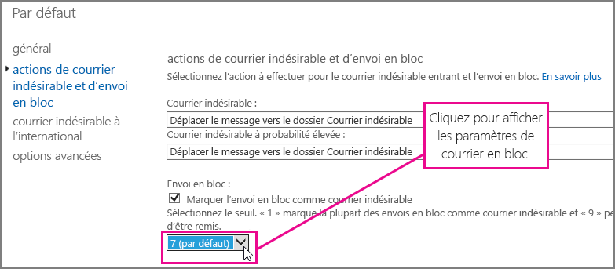
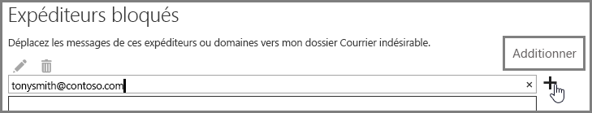

# <a name="block-email-spam-with-the-office-365-spam-filter-to-prevent-false-negative-issues"></a><span data-ttu-id="62242-103">Blocage du courrier indésirable avec le filtre Office 365 pour éviter les faux négatifs</span><span class="sxs-lookup"><span data-stu-id="62242-103">Block email spam with the Office 365 spam filter to prevent false negative issues</span></span>

<span data-ttu-id="62242-p101">Exchange Online Protection (EOP) est un service cloud de filtrage des e-mails qui vous permet de protéger votre organisation contre le courrier indésirable et les programmes malveillants. Si vous avez des boîtes aux lettres dans Office 365, elles sont protégées par défaut avec EOP.</span><span class="sxs-lookup"><span data-stu-id="62242-p101">Exchange Online Protection (EOP) is a cloud-based email filtering service that helps protect your organization against spam and malware. If you have mailboxes in Office 365, they are already protected by default with EOP.</span></span> 
  
<span data-ttu-id="62242-p102">Vous pouvez bloquer le courrier indésirable en ajustant votre filtre anti-courrier indésirable Office 365. Vous évitez ainsi les problèmes de faux négatifs, c’est-à-dire l’envoi de courrier indésirable dans la boîte de réception d’un utilisateur. Si vous êtes un administrateur Exchange Online ou Exchange Online Protection (EOP), suivez la procédure ci-dessous pour ajuster votre filtre anti-courrier indésirable Office 365 et empêcher l’envoi de courrier indésirable dans les boîtes de réception de vos utilisateurs.</span><span class="sxs-lookup"><span data-stu-id="62242-p102">You can help to ensure spam and junk messages are blocked by adjusting your Office 365 spam filter. This helps to prevent the false negative issue, where email spam is allowed through to a user inbox. As an Exchange Online or Exchange Online Protection (EOP) administrator, use the following steps to adjust your Office 365 anti-spam filter and help prevent spam from being delivered to your user's inboxes.</span></span>
  
## <a name="customize-the-office-365-anti-spam-filter-with-these-settings"></a><span data-ttu-id="62242-109">Paramètres pour personnaliser le filtre anti-courrier indésirable Office 365</span><span class="sxs-lookup"><span data-stu-id="62242-109">Customize the Office 365 anti-spam filter with these settings</span></span>

<span data-ttu-id="62242-p103">Un administrateur peut utiliser plusieurs paramètres du filtre anti-courrier indésirable Office 365 pour empêcher l’envoi de courrier indésirable dans la boîte de réception d’un utilisateur. Grâce aux options suivantes, le filtre anti-courrier indésirable Office 365 sera plus efficace pour bloquer le courrier indésirable et éviter les faux négatifs. Dans ce contexte, un faux négatif désigne un message indésirable envoyé dans une boîte de réception.</span><span class="sxs-lookup"><span data-stu-id="62242-p103">An Admin can use several Office 365 spam filter settings to help prevent email spam from being sent to a user inbox. The Office 365 spam filter will become better able to block email spam and prevent false negative messages if you use the options listed here. In this context, a false negative refers to email spam or junk messages that are getting sent to a user inbox.</span></span>
  
### <a name="block-ip-addresses-with-a-connection-filter"></a><span data-ttu-id="62242-113">Blocage des adresses IP avec un filtrage des connexions</span><span class="sxs-lookup"><span data-stu-id="62242-113">Block IP addresses with a connection filter</span></span>

<span data-ttu-id="62242-114">Personnalisez votre filtre anti-courrier indésirable Office 365 en ajoutant l’adresse IP de l’expéditeur à la liste d’adresses IP bloquées du filtrage des connexions :</span><span class="sxs-lookup"><span data-stu-id="62242-114">Setup your Office 365 spam filter by adding the sender IP address to the connection filter IP Block list:</span></span>
  
1. <span data-ttu-id="62242-115">Obtenez les en-têtes du message à bloquer dans votre client de messagerie, tel qu’Outlook ou Outlook Web App, comme décrit dans l’article [Analyseur d’en-têtes de message](https://go.microsoft.com/fwlink/p/?LinkId=306583).</span><span class="sxs-lookup"><span data-stu-id="62242-115">Obtain the headers for the message you want to block in your mail client such as Outlook or Outlook Web App, as described in [Message Header Analyzerhttp://go.microsoft.com/fwlink/p/?LinkId=306583](https://go.microsoft.com/fwlink/p/?LinkId=306583).</span></span>
    
2. <span data-ttu-id="62242-116">Recherchez l’adresse IP qui suit la balise CIP dans l’en-tête X-Forefront-Antispam-Report à l’aide de l’[analyseur d’en-têtes de message](https://testconnectivity.microsoft.com/?tabid=mha) ou manuellement.</span><span class="sxs-lookup"><span data-stu-id="62242-116">Search for the IP address following the CIP tag in the X-Forefront-Antispam-Report header using the [message header analyzerhttps://testconnectivity.microsoft.com/?tabid=mha](https://testconnectivity.microsoft.com/?tabid=mha) or manually.</span></span> 
    
3. <span data-ttu-id="62242-117">Ajoutez l’adresse IP à la liste d’adresses IP bloquées en suivant les étapes décrites dans la section « Utilisation du Centre d’administration Exchange (CAE) pour modifier la stratégie par défaut de filtrage des connexions », dans l’article [Configuration de la stratégie de filtrage des connexions](https://technet.microsoft.com/fr-FR/library/jj200718%28v=exchg.150%29.aspx).</span><span class="sxs-lookup"><span data-stu-id="62242-117">Add the IP address to the IP Block list by following the steps in “Use the EAC to edit the default connection filter policy” in [Configure the Connection Filter Policy](https://technet.microsoft.com/fr-FR/library/jj200718%28v=exchg.150%29.aspx).</span></span>
    
### <a name="block-bulk-mail-with-transport-rules-or-the-spam-filter"></a><span data-ttu-id="62242-118">Blocage du courrier en nombre à l’aide des règles de transport ou du filtre anti-courrier indésirable</span><span class="sxs-lookup"><span data-stu-id="62242-118">Block bulk mail with transport rules or the spam filter</span></span>

<span data-ttu-id="62242-p104">Le courrier indésirable que vous recevez comprend essentiellement du courrier en nombre, par exemple des bulletins d’informations ou des promotions ? Vous pouvez personnaliser le filtre anti-courrier indésirable dans Office 365 si vous [utilisez les règles de transport pour filtrer le courrier en nombre de façon restrictive](https://technet.microsoft.com/fr-FR/library/dn720438%28v=exchg.150%29.aspx) ou activez le paramètre **Courrier en nombre** dans les [options de filtrage avancé du courrier indésirable](https://technet.microsoft.com/fr-FR/library/jj200750%28v=exchg.150%29.aspx) de votre filtre anti-courrier indésirable. Dans le Centre d’administration Exchange, cliquez sur **Protection** \> **Filtrage du contenu**, puis double-cliquez sur la stratégie de filtrage à ajuster. Cliquez sur **Actions du courrier indésirable** pour ajuster les paramètres, comme illustré ci-dessous.</span><span class="sxs-lookup"><span data-stu-id="62242-p104">Is the spam primarily bulk mail, for example, newsletters or promotions? You can customize the spam filter in Office 365 if you [Use transport rules to aggressively filter bulk email messages](https://technet.microsoft.com/fr-FR/library/dn720438%28v=exchg.150%29.aspx) or turn on the **Bulk mail** setting in your spam filter's [Advanced Spam Filtering Options](https://technet.microsoft.com/fr-FR/library/jj200750%28v=exchg.150%29.aspx). In the Exchange Admin center, get started by clicking **Protection** \> **Content filter** and then double click the filter policy you want to adjust. Click **Spam and bulk mail actions** to adjust the settings, as shown here.</span></span> 
  

  
### <a name="block-email-spam-using-spam-filter-block-lists"></a><span data-ttu-id="62242-124">Blocage du courrier indésirable à l’aide des listes de blocage du filtre anti-courrier indésirable</span><span class="sxs-lookup"><span data-stu-id="62242-124">Block email spam using spam filter block lists</span></span>

<span data-ttu-id="62242-p105">[Configurez vos stratégies de filtrage du courrier indésirable](https://technet.microsoft.com/fr-FR/library/jj200684%28v=exchg.150%29.aspx) pour ajouter l’adresse de l’expéditeur à la liste des expéditeurs bloqués ou le domaine à la liste des domaines bloqués dans le filtre anti-courrier indésirable. Les e-mails provenant d’un expéditeur ou d’un domaine figurant dans l’une de ces listes seront marqués comme courrier indésirable.</span><span class="sxs-lookup"><span data-stu-id="62242-p105">[Configure your spam filter policies](https://technet.microsoft.com/fr-FR/library/jj200684%28v=exchg.150%29.aspx) to add the sender address to the sender block list or domain to the domain block list in the spam filter. Emails from a sender or domain on a spam filter block list will marked as spam.</span></span> 
  
### <a name="advanced-spam-filtering-options"></a><span data-ttu-id="62242-127">Options de filtrage avancé du courrier indésirable</span><span class="sxs-lookup"><span data-stu-id="62242-127">Advanced Spam Filtering Options</span></span>

<span data-ttu-id="62242-128">[Configurez vos stratégies de filtrage du courrier indésirable](https://technet.microsoft.com/fr-FR/library/jj200684%28v=exchg.150%29.aspx) et activez d’autres [options de filtrage avancé du courrier indésirable](https://technet.microsoft.com/fr-FR/library/jj200750%28v=exchg.150%29.aspx).</span><span class="sxs-lookup"><span data-stu-id="62242-128">[Configure your content filter policies](https://technet.microsoft.com/fr-FR/library/jj200684%28v=exchg.150%29.aspx) and turn on additional [Advanced Spam Filtering Options](https://technet.microsoft.com/fr-FR/library/jj200750%28v=exchg.150%29.aspx).</span></span>
  
<span data-ttu-id="62242-p106">Pour en savoir plus sur les autres paramètres de courrier indésirable applicables à l’ensemble de l’organisation, consultez cet article pour [éviter de marquer des faux positifs comme courrier indésirable en utilisant une liste fiable ou d’autres techniques](prevent-email-from-being-marked-as-spam-0.md). Ces paramètres vous seront utiles pour éviter les faux positifs si vous bénéficiez des autorisations de contrôle de niveau administrateur.</span><span class="sxs-lookup"><span data-stu-id="62242-p106">You can enable advanced spam filtering options if you want to pursue an aggressive approach to spam filtering. For general spam settings that apply to the whole organization, take a look at [Prevent false positive email marked as spam with a safelist or other techniques](prevent-email-from-being-marked-as-spam-0.md) or Block email spam with the Office 365 spam filter to prevent false negative issues. These are helpful if you have administrator-level control and you want to prevent false positives or false negatives.</span></span>
  
## <a name="email-users-can-also-help-ensure-that-false-negative-and-email-spam-is-blocked-with-office-365-spam-filter"></a><span data-ttu-id="62242-131">Blocage des faux négatifs et du courrier indésirable par les utilisateurs eux-mêmes avec le filtre anti-courrier indésirable Office 365</span><span class="sxs-lookup"><span data-stu-id="62242-131">Email users can also help ensure that false negative and email spam is blocked with Office 365 spam filter</span></span>

<span data-ttu-id="62242-p107">Pour vous aider à bloquer les faux négatifs et le courrier indésirable dans Office 365, nous vous recommandons d’inviter vos utilisateurs à ajouter l’adresse de l’expéditeur du courrier indésirable à leur liste d’expéditeurs bloqués dans [Outlook](https://go.microsoft.com/fwlink/p/?LinkId=270065) ou [Outlook Web App](https://go.microsoft.com/fwlink/p/?LinkId=294862). Dans Outlook Web App, cliquez sur **Paramètres** \> **Options** \> **Bloquer ou autoriser**, puis ajoutez l’adresse à la liste des **Expéditeurs bloqués**, comme illustré ci-dessous.</span><span class="sxs-lookup"><span data-stu-id="62242-p107">It will help your Office 365 anti-spam efforts to prevent false negatives and junk mail if you tell your users to add the spam sender address to their blocked sender list in [Outlook](https://go.microsoft.com/fwlink/p/?LinkId=270065) or [Outlook Web App](https://go.microsoft.com/fwlink/p/?LinkId=294862). In Outlook Web App, get started by clicking **Settings** \> **Options** \> **Block or allow**, and then adding the address to the **Blocked senders** list, as shown here.</span></span> 
  

  
> [!NOTE]
> <span data-ttu-id="62242-135">Pour en savoir plus sur les listes d’expéditeurs autorisés, consultez la [FAQ sur les listes des expéditeurs autorisés et des expéditeurs bloqués](https://technet.microsoft.com/fr-FR/library/dn133608%28v=exchg.150%29.aspx).</span><span class="sxs-lookup"><span data-stu-id="62242-135">For more detailed information about safe sender lists, see [Safe Sender and Blocked Sender Lists FAQ](https://technet.microsoft.com/fr-FR/library/dn133608%28v=exchg.150%29.aspx).</span></span> 
  
<span data-ttu-id="62242-p108">Les paragraphes précédents de cette sous-section concernent uniquement les clients qui utilisent le service EOP pour protéger leurs systèmes de messagerie locale ou dans le cadre d’un déploiement de messagerie hybride. Pour en savoir plus sur EOP, visitez la [page d’accueil d’Exchange Online Protection](https://products.office.com/fr-FR/exchange/exchange-email-security-spam-protection).</span><span class="sxs-lookup"><span data-stu-id="62242-p108">The previous paragraphs in this subsection applies only to customers who use EOP as service to protect on-premises email systems or as part of a hybrid email deployment. Learn more about EOP at the [Exchange Online Protection home page](https://products.office.com/fr-FR/exchange/exchange-email-security-spam-protection).</span></span>
  
## <a name="eop-only-customers-set-up-the-office-365-spam-filter-to-block-email-spam"></a><span data-ttu-id="62242-138">Clients d’EOP : configuration du filtre anti-courrier indésirable Office 365 pour bloquer le courrier indésirable</span><span class="sxs-lookup"><span data-stu-id="62242-138">EOP-only customers: Set up the Office 365 spam filter to block email spam</span></span>

<span data-ttu-id="62242-p109">Pour les clients qui utilisent uniquement EOP et possèdent des boîtes aux lettres locales : si vous utilisez l’action par défaut du filtre anti-courrier indésirable (Déplacer le message vers le dossier Courrier indésirable), suivez les étapes requises décrites dans la section « Vérification de l’acheminement du courrier indésirable vers le dossier Courrier indésirable de chaque utilisateur ». Nous avons essayé de simplifier cette procédure en fournissant les commandes de l’environnement de ligne de commande Exchange Management Shell dans une autre rubrique, ainsi qu’un lien contenant des informations plus générales sur la prise en main de Shell.</span><span class="sxs-lookup"><span data-stu-id="62242-p109">For EOP-only customers with on-premises mailboxes: If you setup a spam filter for the default action, Move message to Junk Email folder, follow the required steps provided in Ensure that spam is routed to each user's Junk Email folder. We've tried to make this easy by providing the Exchange Management Shell commands in a separate topic, as well as a link to more general information about how to get started with the shell.</span></span>
  
<span data-ttu-id="62242-p110">Pour éviter les faux négatifs, nous vous recommandons de synchroniser les paramètres utilisateur avec le service via la synchronisation d’annuaires pour que la liste des expéditeurs bloqués soit respectée. Pour en savoir plus, consultez la section « Utilisation de la synchronisation d’annuaires pour gérer les utilisateurs de messagerie », dans l’article « Gestion des utilisateurs de messagerie dans EOP ».</span><span class="sxs-lookup"><span data-stu-id="62242-p110">It will help you to avoid false negative email spam if you sync user settings with the service via directory synchronization to ensure that your blocked senders are respected. For more information, see "Use directory synchronization to manage mail users" in Manage mail users in EOP.</span></span>
  
## <a name="eop-only-customers-who-are-not-using-directory-synchronization"></a><span data-ttu-id="62242-143">Clients d’EOP qui n’utilisent pas la synchronisation d’annuaires</span><span class="sxs-lookup"><span data-stu-id="62242-143">EOP-only customers who are not using directory synchronization</span></span>

<span data-ttu-id="62242-p111">Le service EOP prend en compte les listes des expéditeurs autorisés et bloqués définies par l’utilisateur, si ces informations ont été transmises au service. Si vous êtes un client d’EOP qui utilise Outlook, et que la synchronisation d’annuaires n’est pas configurée pour synchroniser vos utilisateurs avec Office 365, vous pouvez quand même empêcher l’envoi de messages dans la boîte de réception de vos utilisateurs en utilisant la liste d’expéditeurs bloqués. En revanche, vous devrez peut-être configurer certaines règles de flux de messagerie Exchange dans les cas suivants :</span><span class="sxs-lookup"><span data-stu-id="62242-p111">The EOP service is designed to honor the user's safe and blocked senders, if the information has been shared with the service. If you are an EOP customer using Outlook, but do not have Directory Synchronization configured to sync your users to Office 365, you can still stop messages from being delivered to your users' inbox using blocked senders. However, you may have to set up some Exchange mail flow rules in the following situations:</span></span>
  
- <span data-ttu-id="62242-147">Si un message passe à travers le filtrage anti-courrier indésirable normal via EOP puis est remis dans un serveur Exchange local, et si EOP attribue un verdict SCL 1-4 (non indésirable), la liste des expéditeurs bloqués locale de vos utilisateurs remplace le verdict du filtre anti-courrier indésirable d’EOP et envoie le message dans leur dossier Courrier indésirable.</span><span class="sxs-lookup"><span data-stu-id="62242-147">If a message goes through regular spam filtering through EOP and then is delivered to a local on-premises Exchange server, and EOP assigns a spam verdict of SCL 1-4 (non-spam), then your users' local blocked senders list will override the EOP spam filter verdict and deliver it to their junk email folder.</span></span>
    
- <span data-ttu-id="62242-p112">Si le verdict SCL -1 est attribué à un message dans EOP par une règle de flux de messagerie Exchange ou parce que l’adresse IP ou le domaine figure dans votre liste d’expéditeurs autorisés, la valeur SCL se propage au serveur Exchange local via les connecteurs. Dans ce cas, la liste d’expéditeurs bloqués de votre utilisateur n’est pas prise en compte. Pour modifier ce paramètre, vous pouvez créer une règle de flux de messagerie locale qui définit la valeur SCL sur 0. Ainsi, Outlook sera obligé de prendre en compte la liste d’expéditeurs bloqués locale de votre utilisateur.</span><span class="sxs-lookup"><span data-stu-id="62242-p112">If a message in EOP is assigned SCL -1 by an Exchange mail flow rule or because the IP address or domain is in your allow list, the SCL is propagated to the on-premise Exchange server using connectors. In this case, your user's blocked senders list will not be enforced. To change this, you can create a local mail flow rule that sets the SCL to 0. This will cause Outlook to enforce your user's local blocked senders list.</span></span>
    
<span data-ttu-id="62242-152">**Configuration d’une règle de flux de messagerie qui empêche l’envoi de messages dans la boîte de réception de vos utilisateurs à l’aide de la liste des expéditeurs bloqués**</span><span class="sxs-lookup"><span data-stu-id="62242-152">**To set up a mail flow rule to stop messages from being delivered to your users' inbox by using the blocked senders list**</span></span>
  
1. <span data-ttu-id="62242-p113">Ouvrez l’Environnement de ligne de commande Exchange Management Shell de votre serveur local. Pour savoir comment ouvrir l’environnement de ligne de commande Exchange Management Shell dans votre organisation Exchange locale, consultez l’article [Ouverture de l’environnement de ligne de commande Exchange Management Shell](https://technet.microsoft.com/library/dd638134%28v=exchg.160%29.aspx).</span><span class="sxs-lookup"><span data-stu-id="62242-p113">Access the Exchange Management Shell for your on-premises Exchange server. To learn how to open the Exchange Management Shell in your on-premises Exchange organization, see [Open the Shell](https://technet.microsoft.com/library/dd638134%28v=exchg.160%29.aspx).</span></span>
    
2. <span data-ttu-id="62242-155">Exécutez la commande suivante pour déplacer les messages indésirables dont le contenu a été filtré vers le dossier Courrier indésirable et attribuer la valeur SCL -1 à tous les messages :</span><span class="sxs-lookup"><span data-stu-id="62242-155">Run the following command to route content-filtered spam messages to the Junk Email folder in order to update the SCL on every message that was marked with SCL -1:</span></span>
    
  ```
  New-TransportRule "NameForRule" -HeaderContainsMessageHeader "X-Forefront-Antispam-Report" -HeaderContainsWords "SCL:-1" -SetSCL 0
  ```

    <span data-ttu-id="62242-p114">Dans la mesure où la valeur SCL est égale à 0 dans votre serveur Exchange local, les messages non indésirables sont remis aux boîtes aux lettres de vos utilisateurs même si la liste des expéditeurs bloqués locale des utilisateurs peut toujours les envoyer dans le dossier Courrier indésirable. Si vous utilisez la mise en quarantaine du courrier indésirable dans EOP, il se peut que les expéditeurs figurant dans la liste fiable de vos utilisateurs soient identifiés comme courrier indésirable et mis en quarantaine. Néanmoins, si vous utilisez le dossier Courrier indésirable dans votre boîte aux lettres locale, les messages des expéditeurs autorisés parviendront jusqu’à la boîte de réception.</span><span class="sxs-lookup"><span data-stu-id="62242-p114">Because the SCL is 0 in your on-premises Exchange server, non-spam will be delivered to your users' inboxes but still allow for users' local blocked senders list to send them to junk email. If you are using spam quarantine in EOP, it is still possible that senders who are on your user's safe list will be identified as spam and sent to quarantine. If you are using the Junk Mail Folder in your local mailbox, however, this will allow delivery to the Inbox for safe senders.</span></span>

> [!WARNING]
> <span data-ttu-id="62242-p115">Si vous utilisez une règle de flux de messagerie pour attribuer la valeur SCL 0 (ou une valeur autre que -1), toutes les options de courrier indésirable d’Outlook sont appliquées au message. En d’autres termes, les listes des expéditeurs bloqués et autorisés sont prises en compte. De même, les messages qui ne proviennent pas d’adresses figurant dans les listes d’expéditeurs bloqués ou autorisés peuvent être marqués comme courrier indésirable par le filtre anti-courrier indésirable côté client. Pour qu’Outlook tienne compte des listes d’expéditeurs bloqués et autorisés sans utiliser le filtre anti-courrier indésirable côté client, définissez l’option sur « Aucun filtrage automatique » dans les options de courrier indésirable d’Outlook. Il s’agit de l’option par défaut dans les dernières versions d’Outlook. Vérifiez quand même que ce paramètre est bien défini pour interdire l’application du filtre anti-courrier indésirable côté client. Si vous êtes un administrateur, vous pouvez désactiver le filtre anti-courrier indésirable d’Outlook en suivant les instructions fournies dans l’article [Outlook : Paramètre de stratégie pour désactiver l’interface utilisateur de courrier électronique indésirable et le mécanisme de filtrage](https://support.microsoft.com/fr-FR/kb/2180568).</span><span class="sxs-lookup"><span data-stu-id="62242-p115">If you use a mail flow rule to change the SCL value to 0 (or any value other than -1), then all of the Outlook junk mail options will apply to the message. This means that blocked and safe lists will be honored, but also means that messages that do not have addresses from the blocked or safe lists will potentially be marked as junk by the client side junk mail filter processing. If you want to have Outlook process the blocked and safe lists, but not use the client side junk mail filter, you must set the option to "No Automatic Filtering" in Outlook Junk Mail Options. "No Automatic Filtering" is the default option in the latest versions of Outlook, but you should confirm that the this setting is in place to ensure the client side junk mail filter is not applied to the messages. As an administrator, you can enforce disabling the Outlook Junk Email filtering by following the instructions in [Outlook: Policy setting to disable the Junk E-mail UI and filtering mechanism](https://support.microsoft.com/fr-FR/kb/2180568).</span></span>
  
## <a name="see-also"></a><span data-ttu-id="62242-164">Voir aussi</span><span class="sxs-lookup"><span data-stu-id="62242-164">See Also</span></span>
<span data-ttu-id="62242-165"><a name="BKMK_please_comment"> </a></span><span class="sxs-lookup"><span data-stu-id="62242-165"></span></span>

[<span data-ttu-id="62242-166">Protection contre le courrier indésirable pour Office 365</span><span class="sxs-lookup"><span data-stu-id="62242-166">Office 365 Email Anti-Spam Protection</span></span>](anti-spam-protection.md)
  
[<span data-ttu-id="62242-167">Empêcher le marquage des faux positifs comme courrier indésirable à l’aide d’une liste fiable ou d’autres techniques</span><span class="sxs-lookup"><span data-stu-id="62242-167">Prevent false positive email marked as spam with a safelist or other techniques</span></span>](prevent-email-from-being-marked-as-spam-0.md)
  

