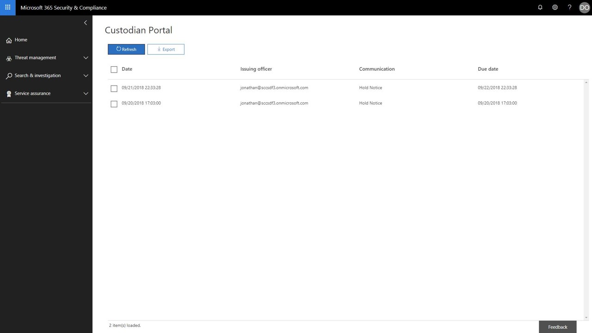

# Reconnaitre une notification de conservation 
Lors de la réponse à une demande réglementaire ou à une enquête, il se peut que vous deviez informer les dépositaires de leur obligation de conserver les informations stockées électroniquement (ESI), ainsi que tout matériel pouvant être pertinent pour une question juridique active ou imminente. Une fois envoyés, les équipes juridiques doivent savoir que chaque dépositaire a reçu, lu et compris, et qu'il est convenu de respecter les instructions données.

Pour vous aider à réduire le temps, les coûts et les efforts à suivre pour le suivi de vos dépositaires, Advanced eDiscovery (aperçu) vous permet d'envoyer et de suivre les notifications de conservation légale par courrier électronique. Outre les notifications par courrier électronique, chaque dépositaire aura également accès à un portail de conformité individualisé, ce qui permettra aux dépositaires d'être informés des modifications apportées à leur statut d'obligation.

## Notifications par courrier électronique
Une fois qu'une notification de conservation légale a été émise, chaque dépositaire reçoit un message électronique unique et personnalisé contenant votre notification de mise en attente légale définie et vous avez ajouté des instructions. 

> [!Tip] 
> Découvrez comment vous pouvez utiliser l' [éditeur de communication](using-communications-editor.md) intégré pour permettre à vos dépositaires de reconnaître leur notification ou d'accéder à leur portail de conformité directement à partir de leur courrier électronique.

En fonction de la configuration de votre notification de conservation légale, vos dépositaires peuvent recevoir les notifications suivantes: 

- **Notice d'émission** -il s'agit de la première notification envoyée à votre dépositaire. Cela contiendra vos instructions d'émission, ainsi que la notification de suspension ajoutée à la fin de votre message.

- **Notice de rappel** : si cette option est activée, un avis de rappel est envoyé à vos dépositaires en fonction de la fréquence et de l'intervalle spécifiés. Les rappels continueront d'être envoyés jusqu'à ce que le dépositaire ait accusé réception de leur avis ou jusqu'à ce que le nombre de rappels soit épuisé.

- **Notification d'escalade** : si cette option est activée, une notification d'escalade est envoyée à votre dépositaire et à son responsable une fois que les notifications de rappel ont été épuisées. Le système enverra automatiquement des notifications d'escalade jusqu'à ce que les escalades affectées soient terminées ou jusqu'à ce que le dépositaire confirme sa notification de suspension.

- **Relancer l'avis** : pendant une enquête, si le contenu de la notification de mise en attente est mis à jour, l'avis mis à jour est automatiquement envoyé au dépositaire.

- **Avertissement de publication** : lorsqu'un dépositaire est publié à partir de l'incident, il reçoit l'avis de publication. 

## Portail de conformité
En plus des notifications par courrier électronique, chaque dépositaire aura également accès à un portail de conformité unique. Par le biais du portail, chaque dépositaire pourra consulter les notifications de blocage actives, y accéder et les reconnaître.

