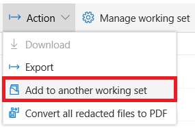
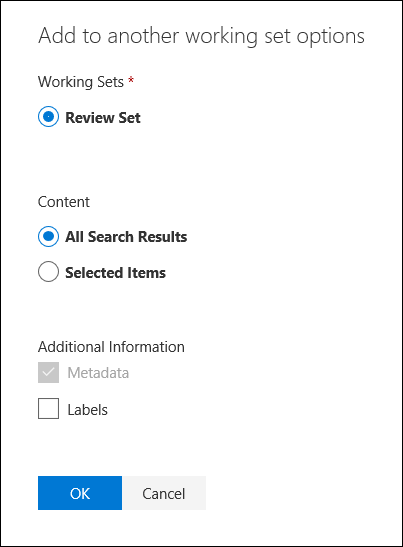

# Ajouter des données à un jeu de travail à partir d'une autre plage de travailAdd data to a working set from another working set
Dans certains cas, il peut s'avérer nécessaire de détourer une partie des documents d'une plage de travail et de les manipuler individuellement dans un autre jeu de travail.In some cases, it may be necessary to carve out a portion of documents from one working set and work with them individually in another working set.  Ceci est particulièrement utile si vous avez fait des sélections de contenu dans un jeu de travail et que vous souhaitez exécuter des analyses sur le sous-ensemble de données.This is especially useful if you've culled content in a working set and want to run analytics on the subset of data.

Utilisez le flux de travail suivant pour ajouter du contenu d'un jeu de travail à un autre.Use the following workflow to add content from one working set to another.

## Avant de commencerBefore you start
Avant de commencer, vous devez créer une nouvelle plage de travail.Before you start, you'll need to create a new working set.  Vous pouvez ajouter une nouvelle plage de travail par le biais de l'onglet *jeux de travail* [pour en savoir plus](https://docs.microsoft.com/en-us/office365/securitycompliance/compliance20/managing-working-sets).A new working set can be added through the *Working sets* tab [Learn more](https://docs.microsoft.com/en-us/office365/securitycompliance/compliance20/managing-working-sets).

## Étape 1: identifier le contenu à ajouter à un autre jeu de travailStep 1: Identify content to add to another working set
Vous pouvez ajouter du contenu à une plage de travail en sélectionnant e-mails et documents dans la grille du document ou tous les éléments d'un résultat de recherche.You can add content to a working set by selecting emails and documents in the document grid or all items in a search result.  Si vous choisissez d'ajouter des éléments sélectionnés, sélectionnez les éléments, puis cliquez sur le menu déroulant *action* , puis *Ajouter à un autre jeu de travail*.If choosing to add selected items, select the items and click the *Action* drop down then *Add to another working set*.

## Étape 2: spécification des options d'ajout à un autre ensemble de tâchesStep 2: Specify options for adding to another workings set
Dans le menu démenu *Ajouter à un autre jeu de travail* , sélectionnez d'abord le jeu de travail auquel vous souhaitez ajouter les éléments.In the *Add to another working set options* flyout, first choose the working set you want to add the items to.  Indiquez si vous souhaitez ajouter tous les résultats de recherche ou les éléments sélectionnés.Choose whether to add All search results or Selected items.  Informations supplémentaires fournit des options pour inclure toutes les métadonnées des éléments et pour finir si les balises de document doivent être incluses dans la nouvelle plage de travail.Additional information provides options to include all metadata from the items and finally whether or not the document tags should be included in the new working set.  Une fois que vous avez cliqué sur *OK* , un nouveau travail est créé pour ajouter le contenu à un jeu de travail, vous pouvez surveiller la progression de ce  . ajouter à une autre plage de travail](../media/6440ee44-68fd-44d7-b43a-3a477345525c.png)After clicking *OK* a new job will be created to add the content to a working set, you can monitor the progress of that job in the [Jobs](https://docs.microsoft.com/en-us/office365/securitycompliance/compliance20/managing-jobs-ediscovery20) tab. 
