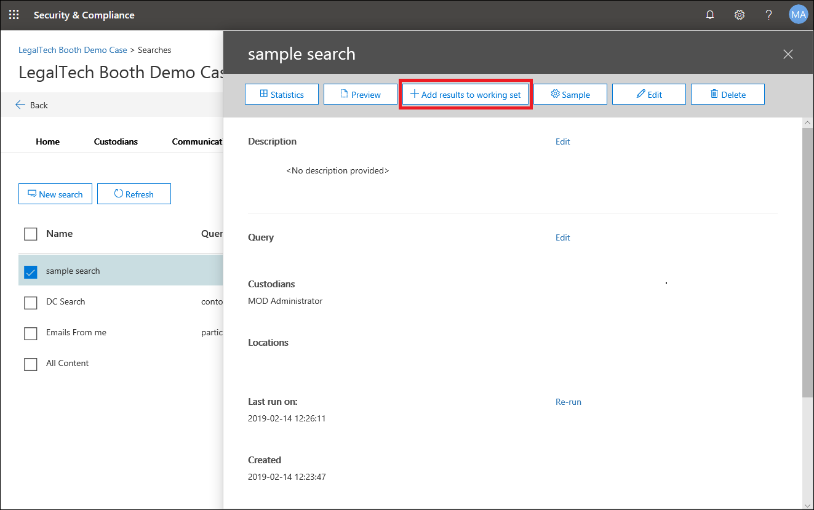
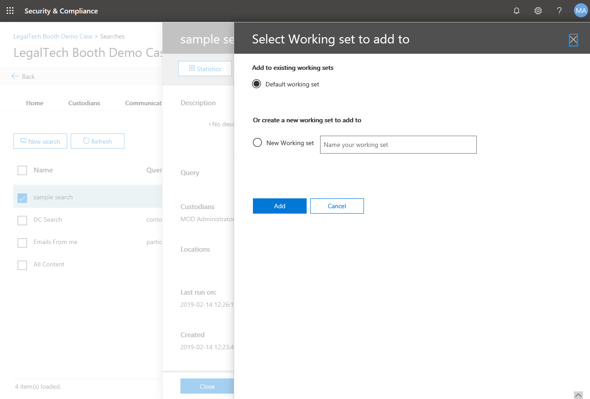

# Ajouter des résultats de recherche à un ensemble de travail

Une fois que vous avez identifié et sélectionné des recherches sur Exchange, SharePoint et OneDrive entreprise, vous pouvez ajouter les résultats à un jeu de travail. Les jeux de travail représentent un ensemble statique de documents que nous allons indexer pour les résultats de la recherche rapide Lightning, analyser pour l'identification des threads de messagerie, à proximité de la détection et des thèmes en double.  Vous pouvez également ajouter des données provenant de sources de données autres que Office 365 à Live en parallèle avec les données que vous collectez à partir d'Office 365.

Pour ajouter des données à une plage de travail, commencez par sélectionner une recherche, dans les résultats de la recherche, cliquez sur le bouton *+ Ajouter les résultats au jeu de travail* .

Vous pouvez ensuite choisir de l'ajouter à un jeu de travail existant ou à un *nouveau jeu de travail*.  Si vous ajoutez à un nouveau jeu de travail, spécifiez le nom, puis cliquez sur le bouton *Ajouter* .

L'ajout de données à un jeu de travail est un processus long, vous pouvez suivre l'avancement sous l'onglet travaux ou dans la colonne État de la plage de *travail* de l'onglet *recherches* .  Le processus inclut la collecte d'éléments à partir d'Office 365 et l'indexation & de l'ingestion.  Une fois le traitement des jeux de travail terminé, vous pouvez accéder à la plage de travail en cliquant sur l'onglet *jeux de travail* , puis sur le jeu de travail.  Vous pouvez ensuite passer à la recherche, à la révision, au balisage et à l'exportation de toutes les données pertinentes.

## Ajout d'un exemple à un jeu de travail

Si vous souhaitez valider vos résultats de recherche plus thorougly avant de collecter tous les documents qui ont été récupérés par votre recherche, vous pouvez ajouter un échantillon aléatoire des résultats de la recherche à un jeu de travail au lieu d'ajouter tout.

Pour ajouter un exemple à une plage de travail, commencez par sélectionner une recherche dans la fenêtre mobile des résultats de recherche, puis cliquez sur le bouton *exemple* .

Vous pouvez ensuite choisir le paramètre de votre échantillonnage. Il existe deux options :
- Niveau de confiance et intervalle: la taille de l'échantillon sera choisie pour répondre aux paramètres statistiques fournis.
- Pourcentage: la taille de l'échantillon sera déterminée en fonction du nombre d'éléments renvoyés par la recherche et du paramètre choisi.

Enfin, choisissez le jeu de travail auquel ajouter l'exemple. À partir de là, vous pouvez vérifier l'état du processus comme vous le feriez pour ajouter une recherche entière dans un jeu de travail. 