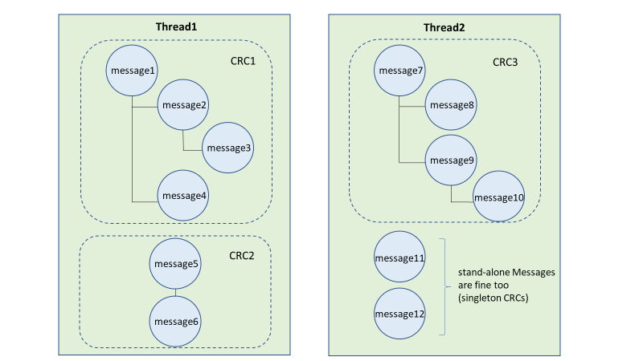

# Examiner les conversations dans Advanced eDiscovery 

La messagerie instantanée constitue un moyen pratique de poser des questions, de partager des idées ou de communiquer rapidement entre les grands publics. Comme les plateformes de messagerie instantanée, telles que Microsoft Teams, deviennent essentielles à la collaboration d’entreprise, les organisations doivent évaluer la façon dont leur flux de travail eDiscovery répond à ces nouveaux types de communication et de collaboration. 

La fonctionnalité de reconstruction de conversation dans Advanced eDiscovery est conçue pour vous aider à identifier le contenu contextuel et à générer des affichages de conversation distincts. Cette fonctionnalité vous permet d’examiner efficacement et rapidement les conversations de messagerie instantanée complètes (également appelées « *conversations thématiques*») qui sont générées sur des plateformes telles que Microsoft Teams.

Avec la reconstruction des conversations, vous pouvez utiliser les fonctionnalités intégrées pour reconstruire, examiner et exporter les conversations thématiques. Utilisez la reconstruction avancée de conversation eDiscovery pour:

- Conserver des métadonnées de niveau de message uniques pour tous les messages au sein d’une conversation.

- Collectez des messages contextuels dans vos résultats de recherche.

- Vérifier, annoter et biffer les conversations thématiques.

- Exporter des messages individuels ou des conversations thématiques

## Terminologie

Voici quelques définitions pour vous aider à commencer à utiliser la reconstruction des conversations.

- **Messages:** Représente la plus petite unité d’une conversation. Les messages peuvent varier en taille, en structure et en métadonnées. 

- **Conversation:** Représente un regroupement d’un ou plusieurs messages. Dans différentes applications, les conversations peuvent être représentées de différentes manières. Dans certaines applications, il existe une action explicite qui résulte de la réponse à un message existant. Les conversations sont formées de manière explicite à la suite de cette action de l’utilisateur. Par exemple, voici une capture d’écran d’une conversation de canal dans Microsoft Teams.

   

   Dans d’autres applications (telles que les messages de conversation 1xN dans Teams), il n’y a pas de chaîne de réponse formelle et les messages s’affichent en tant que «plates-messages» dans un seul thread. Dans ces types d’applications, les conversations sont déduites à partir d’un groupe de messages qui se produisent au cours d’une période donnée. Ce «regroupement conditionnel» de messages (par opposition à une chaîne de réponse) représente la conversation «en arrière» sur un sujet spécifique. 

## Étape 1: exécution d’une recherche

Une fois que vous avez identifié les dépositaires pertinents et les emplacements de contenu, vous pouvez créer une recherche pour rechercher du contenu potentiellement pertinent. Sous l’onglet **recherches** du cas Advanced eDiscovery, vous pouvez créer une recherche en cliquant sur **nouvelle recherche** et en suivant l’Assistant. Pour plus d’informations sur la création d’une recherche, la création d’une requête de recherche et l’affichage des résultats de la recherche, reportez-vous à la rubrique [collecte de données pour un cas](create-search-to-collect-data.md).

## Étape 2: créer un ensemble de révision de conversation

Dans un jeu de vérification, vous pouvez rechercher, marquer, annoter et biffer des documents, des messages électroniques et des conversations de conversation. Dans Advanced eDiscovery, vous pouvez personnaliser votre révision des conversations, basée sur des messages individuels ou sur des conversations thématiques. Cela est déterminé par le type d’ensemble de révision que vous ajoutez les résultats de la recherche créée à l’étape 1 à. Il existe deux types différents de jeux de révision: 
  
  - **Ensembles de révision standard:** Les messages dans les conversations sont traités et affichés en tant qu’éléments individuels. 
  
  -  **Ensembles de révision de conversation:** Les messages dans les conversations sont traités individuellement, mais affichés en mode conversation. Dans un ensemble de révision de conversation, vous pouvez annoter, Baliser et biffer des messages dans un affichage de conversation de thème. 

Pour plus d’informations sur la révision et la gestion du contenu d’un jeu de révision, voir [Manage Review sets](managing-review-sets.md). 

## Étape 3: activer les options de récupération de conversation

Une fois que vous avez vérifié et finalisé votre requête de recherche, vous pouvez ajouter les résultats de la recherche à un jeu de révision. Lorsque vous ajoutez vos résultats de recherche dans un jeu de révision, les données d’origine sont copiées dans une zone de stockage Azure pour faciliter le processus de révision et d’analyse. Pour plus d’informations sur l’ajout de résultats de recherche à un jeu de révision, voir [Ajouter des résultats de recherche à un jeu de révision](add-data-to-review-set.md). 

Lorsque vous ajoutez des données de conversations à un ensemble de vérification, vous pouvez utiliser les options de récupération de conversation pour étendre votre recherche et inclure des messages contextuels. Une fois que vous avez défini les options de récupération de conversation, les opérations suivantes peuvent se produire:

  
  
1. À l’aide d’une requête de mot clé et de plage de dates, la recherche a renvoyé une correspondance sur le *message 3*. Ce message faisait partie d’une conversation plus large, illustrée par *CRC1*. 
  
2. Lorsque vous ajoutez les données à un jeu de révision et activez les options de récupération de conversation, Advanced eDiscovery reviendra et collectera d’autres éléments dans *CRC1*. 
  
3. Une fois que les éléments ont été ajoutés à l’ensemble de vérification, vous pouvez passer en revue tous les messages individuels de *CRC1*. 

Pour activer la récupération de conversation:
  
1. Sous l’onglet **recherches** dans le cas avancé eDiscovery, sélectionnez une recherche, puis cliquez sur **Ajouter pour examiner le jeu** sur la page de menu volant.
  
2. Sélectionnez un ensemble de révision existant ou créez un jeu de révision. Vous pouvez configurer les options de récupération lors de l’ajout de résultats de recherche à un jeu de révision de conversation ou standard.
  
3. Sous **options de collection**, configurez les options de récupération de conversation pour les sources de contenu que vous souhaitez développer dans votre recherche, puis cliquez sur **Ajouter** pour démarrer le processus.  
  
4. Une fois que le travail **Ajouter au jeu de révision** sous l’onglet **travaux** a terminé, vous pouvez commencer à examiner les conversations.

## Étape 4: examiner les conversations dans l’ensemble de révision

Une fois que le contenu a été traité et ajouté à l’ensemble de vérifications, vous pouvez commencer à examiner les données dans l’ensemble de révision. Les fonctionnalités de révision sont différentes selon que le contenu a été ajouté à un jeu de révision standard ou à un ensemble de révision de conversation. 

### Examen des conversations dans un jeu de révision standard

Dans un ensemble de révision standard, les messages sont traités et affichés en tant qu’éléments individuels, de la même manière qu’ils sont stockés dans un dossier de boîte aux lettres. Dans ce flux de travail, chaque message est traité comme un élément distinct. Par conséquent, le résumé lié et les options d’exportation ne sont pas disponibles dans un jeu de révision standard. 

  

### Examen des conversations dans un jeu de révision de conversation

Dans un ensemble de révision de conversation, les messages individuels sont regroupés et présentés sous forme de conversations. Cela vous permet de passer en revue et d’exporter des conversations contextuelles. 

  

Les sections suivantes décrivent la révision et l’exportation de conversations dans un jeu de révision de conversation.

#### Examen des conversations

Dans un ensemble de révision de conversation, vous pouvez utiliser les options suivantes pour faciliter le processus de révision.

- **Regrouper par conversation:** Regroupe les messages au sein d’une même conversation pour aider les utilisateurs à simplifier et accélérer leur processus de révision. 

- **Affichage de Résumé:** Affiche la conversation de threads. Dans cet affichage, vous pouvez voir l’intégralité de la conversation et accéder aux métadonnées de chaque message individuel.  
  
   - Afficher les métadonnées des messages individuels
   
   - Télécharger des messages individuels

- **Affichage de texte:** Fournit le texte extrait pour l’intégralité de la conversation. 

- **Annoter:** Vous permet de baliser une vue thématique de la conversation. Tous les messages de la conversation partagent le même document annoté.

- **Balisage:** Lors de l’affichage des conversations dans un jeu de vérification, vous pouvez afficher et appliquer des balises en cliquant sur **panneau de marquage** dans le panneau codage.

- **Réexécuter la conversion de conversation:** Lorsque des messages sont ajoutés à un jeu de révision de conversation, une tâche de conversion est automatiquement exécutée pour créer le résumé lié aux threads et annoter les vues. Si le travail de reconstruction des conversations échoue, vous pouvez réexécuter ce travail en cliquant sur **Action > créer un fichier PDF de conversation** dans l’ensemble de révision.

#### Exportation de conversations

Dans un ensemble de révision de conversation, vous pouvez définir les options suivantes pour exporter des conversations:

a. Options de métadonnées

   - **Charger un fichier:** Les métadonnées sont incluses pour chaque message, courrier électronique et document. Il y a une ligne pour chaque message dans une conversation. 

   - **Balises:** Les balises de votre processus de révision sont incluses dans le fichier de métadonnées. Les messages d’une conversation partagent les mêmes balises. 

b. Options de conversation
  
   - **Fichiers de conversation:** Lorsque vous exportez des fichiers de conversation, l’affichage annoté est converti en fichier PDF et téléchargé dans le dossier d’exportation. Les messages d’un fichier de conversation pointent vers la version PDF du même fichier de conversation.  
  
   - **Messages de conversation individuels:** Lorsque vous exportez des messages individuels, chaque message unique de la conversation est exporté en tant qu’élément autonome. Le fichier est exporté dans le même format que celui dans lequel il a été enregistré dans la boîte aux lettres. Pour une conversation spécifique, vous recevez plusieurs fichiers. msg. 

     >[!NOTE]
     > Si vous avez appliqué des annotations au fichier de conversation, ces annotations ne seront pas transférées vers les messages individuels. 

c. Autres options

   - **Générer des fichiers texte pour tout le contenu exporté:** Génère un fichier texte pour chaque conversation exportée à partir de l’ensemble de révision. 

   - **Remplacer le contenu exporté par des fichiers PDF biffés:** Si des fichiers de conversation biffée sont générés pendant le processus de révision, ces fichiers sont disponibles pendant l’exportation. Vous pouvez décider s’il faut exporter uniquement les fichiers natifs (sans sélectionner cette option) ou remplacer les fichiers natifs par les versions biffées des fichiers natifs (en sélectionnant cette option), qui sont exportées en tant que fichiers PDF.

## Plus d’informations

Pour en savoir plus sur l’examen des données de cas dans Advanced eDiscovery, consultez les articles suivants:

- [Afficher les données d’un incident](view-documents-in-review-set.md) 

- [Analyser les données de cas](analyzing-data-in-review-set.md)

- [Exporter les données de cas](exporting-data-ediscover20.md)
