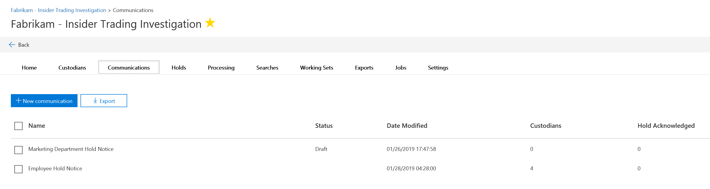
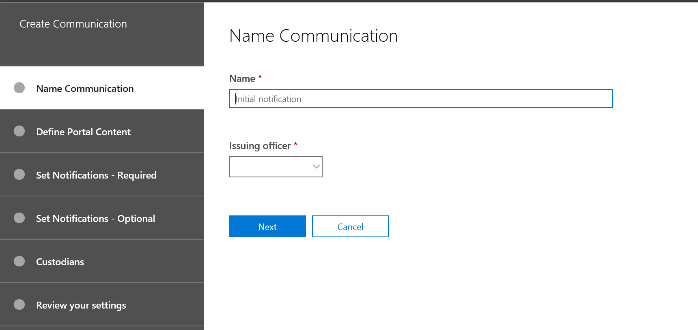
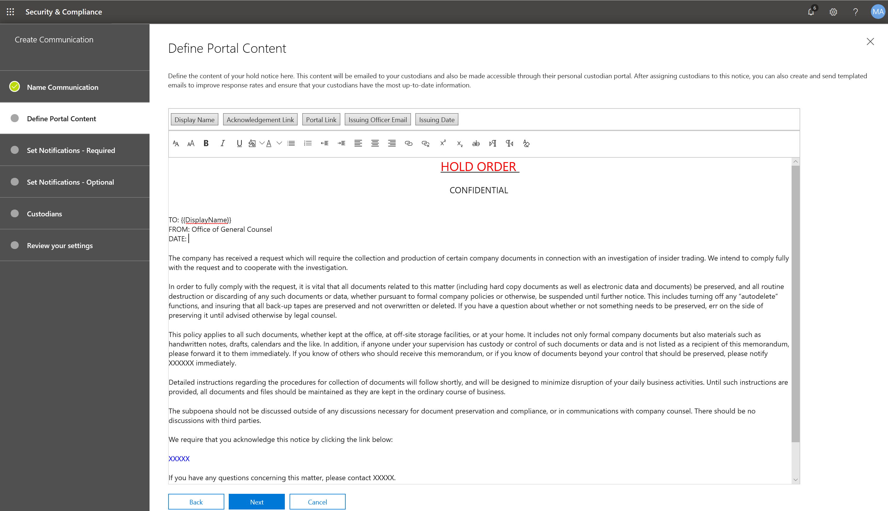
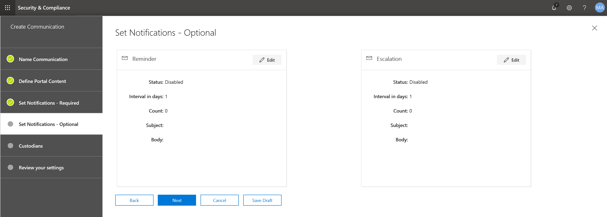
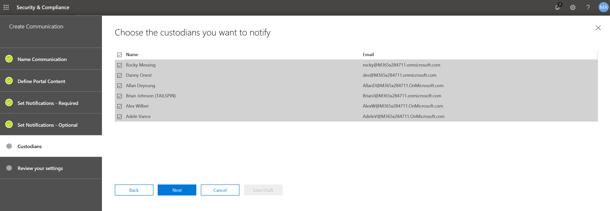

# Créer une notice de suspension légaleCreate a legal hold notice

À l'aide des communications des dépositaires avancés (aperçu), les organisations peuvent gérer leur flux de travail pour communiquer avec des dépositaires.Using Advanced eDiscovery (Preview) custodian communications, organizations can manage their workflow around communicating with custodians. Grâce à l'outil de communication, les équipes juridiques peuvent envoyer, collecter et suivre systématiquement les notifications de conservation légale.Through the Communications tool, legal teams can systematically send, collect, and track legal hold notifications. Le processus de création flexible permet également à teams de personnaliser le flux de travail de notification de blocage et le contenu des notifications envoyées aux dépositaires.The flexible creation process also allows teams to customize the hold notification workflow and the content in the notices sent to custodians. 

L'article décrit les étapes du flux de travail de notification de blocage.The article outlines the steps in the hold notification workflow.

## Étape 1: spécifier les détails de communicationStep 1: Specify communication details

La première étape consiste à spécifier les détails appropriés pour les notifications de suspension légale ou autres communications de dépositaire.The first step is to specify the appropriate details for legal hold notices or other custodian communications. 

1. Dans le centre de sécurité & Compliance Center, accédez à **eDiscovery _GT_ Advanced eDiscovery (Preview)** pour afficher la liste des incidents de votre organisation.In the Security & Compliance Center, go to **eDiscovery > Advanced eDiscovery (Preview)** to display the list of cases in your organization.
   
2. Cliquez sur l'onglet **communications** , puis sur **nouvelle communication**.Click the **Communications** tab, and then click **New communication**.
   
3. Sur la page **communication de nom** , spécifiez les détails de communication (obligatoires) suivants.On the **Name communication** page, specify the following (required) communication details.

    - **Name**: il s'agit du nom de la communication.**Name**: This is the name for the communication.
    
    - **Officier émetteur**: la liste déroulante affiche la liste des membres d'un cas.**Issuing officer**: The dropdown list displays a list of a case members. Chaque notification envoyée aux dépositaires est envoyée au nom de l'officier émetteur spécifié.Each notice sent to custodians will be sent on behalf of the specified issuing officer.

4. Cliquez sur **Suivant**.Click **Next**.

## Étape 2: définir le contenu du portailStep 2: Define the portal content

Ensuite, vous pouvez créer et ajouter le contenu de la notification de suspension.Next, you can create and add the content of the hold notice. Dans la page **définir le contenu du portail** , dans l'assistant créer une **communication** , spécifiez le contenu de la notification de suspension.On the **Define portal content** page in the **Create communication** wizard, specify the contents of the hold notice. Ce contenu sera automatiquement ajouté aux notifications d'émission, de réÉmission, de rappel et de signalisation.This content will be automatically appended to the Issuance, Re-Issue, Reminder, and Escalation notices. De plus, ce contenu s'affichera dans le portail de conformité du dépositaire.Additionally, this content will appear in the custodian's Compliance Portal. 

Pour créer le contenu du portail:To create the portal content:

1. Tapez (ou coupez et collez à partir d'un autre document) votre notification de blocage dans la zone de texte du contenu du portail.Type (or cut and paste from another document) your hold notice in the textbox for the portal content. 

2. Insérez des variables de fusion dans votre notification pour personnaliser l'avis et partager le portail de conformité des dépositaires.Insert merge variables into your notice to customize the notice and share the Custodian Compliance Portal.

3. Cliquez sur **Suivant**.Click **Next**.

  >[!Tip]
  >Pour en savoir plus sur la personnalisation du contenu et du format du contenu du portail, consultez [la rubrique utiliser l'éditeur de communications](using-communications-editor.md).To learn more about how to can customize the content and format of the portal content, see [Use the Communications Editor](using-communications-editor.md).

## Étape 3: définir les notifications requisesStep 3: Set the required notifications

Une fois que vous avez défini le contenu de la notification de mise en attente, vous pouvez configurer les flux de travail pour l'envoi et la gestion du processus de notification.After you've defined the contents of the hold notice, you can set up the workflows around sending and managing the notification process. Les notifications sont des messages électroniques qui sont envoyés pour informer et suivre les dépositaires.Notifications are email messages that are sent to notify and follow-up with custodians. Chaque dépositaire ajouté à la communication reçoit la même notification.Every custodian added to the communication will receive the same notification. 

Pour configurer et envoyer une notification de mise en attente, vous devez inclure les notifications d'émission, de ré-émission et de publication.To set up and send a hold notice, you must include Issuance, Re-Issuance, and Release notifications.

### Notification d'émissionIssuance notification 

Une fois la communication créée, la **notification d'émission** est initiée par le responsable émetteur spécifié.After the communication is created, the **Issuance Notification** is initiated by the specified Issuing Officer. La notification d'émission est la première communication envoyée au dépositaire pour l'informer de ses obligations de conservation.The Issuance notification is the first communication sent to the custodian to inform them about their preservation obligations. 

Pour créer une notification d'émission:To create an issuance notification:

1. Dans la vignette **émission** , cliquez sur **modifier**.In the **Issuance** tile, click **Edit**.
   
2. Si nécessaire, ajoutez des membres de cas supplémentaires ou du personnel dans les champs **CC** et **CCI** .If necessary, add additional case members or staff to the **Cc** and **Bcc** fields. Pour ajouter plusieurs utilisateurs à ces champs, séparez les adresses de messagerie par un point-virgule.To add multiple users to these fields, separate email addresses with a semi-colon.
   
3. Spécifiez l' **objet** de l'avis (obligatoire).Specify the **Subject** for the notice (required).
   
4. Spécifiez le contenu ou les instructions supplémentaires que vous souhaitez fournir au dépositaire (obligatoire).Specify the contents or additional instructions that you would like to provide to the custodian (required). Notez que le contenu du portail que vous avez défini à l'étape 2 est ajouté à la fin de l'avis d'émission.Note that the portal content you defined in Step 2 is added to the end of the issuance notice. 
   
5. Cliquez sur **Enregistrer**Click **Save** 

### Notification de nouvelle émissionRe-Issuance notification 

En cas de progression, les dépositaires peuvent être tenus de conserver des données supplémentaires ou moins que celles précédemment demandées.As the case progresses, custodians may be required to preserve additional or less data than was previously instructed. Une fois que vous avez mis à jour le contenu de la notification d'attente, la notification de nouvelle émission alerte les dépositaires des modifications apportées à leurs obligations de conservation.After you update the contents of the hold notice, the re-issuance notification alerts the  custodians about the changes to their preservation obligations.

Pour créer une notification de ré-émission:To create a re-issuance notification: 

1. Dans la \*\*\*\* vignette de réémission, cliquez sur **modifier**.In the **Reissue** tile, click **Edit**.
   
2. Si nécessaire, ajoutez des membres de cas supplémentaires ou du personnel dans les champs **CC** et **CCI** .If necessary, add additional case members or staff to the **Cc** and **Bcc** fields. Pour ajouter plusieurs utilisateurs à ces champs, séparez les adresses de messagerie par un point-virgule.To add multiple users to these fields, separate email addresses with a semi-colon.
   
3. Spécifiez l' **objet** de l'avis (obligatoire).Specify the **Subject** for the notice (required).
   
4. Spécifiez le contenu ou les instructions supplémentaires que vous souhaitez fournir au dépositaire (obligatoire).Specify the contents or additional instructions that you would like to provide to the custodian (required). Notez que le contenu du portail que vous avez défini à l'étape 2 est ajouté à la fin de l'avis de ré-émission.Note that the portal content you defined in Step 2 is added to the end of the re-issuance notice.
   
5. Cliquez sur **Enregistrer**.Click **Save**.

>[!Note]
>Si une notification de mise en attente est modifiée, la notification de nouvelle émission est automatiquement envoyée à tous les dépositaires affectés à l'avis.If a hold notification is modified, the re-issuance notification will be automatically sent to all custodians assigned to the notice. Après l'envoi de la notification, les dépositaires seront invités à relancer leur avis de mise en attente.After the notification is sent, custodians will be asked to re-acknowledge their hold notice. Si vous avez configuré des flux de travail de rappel ou de remontée, ceux-ci redémarrent également.If you have set up any reminder or escalation workflows, these will also re-start. 

### Notification de publicationRelease notification

Une fois qu'un problème est résolu ou qu'un dépositaire n'est plus soumis à la conservation du contenu, vous pouvez libérer le dépositaire à partir d'un cas.After a matter is resolved or if a custodian is no longer subject to preserve content, you can release the custodian from a case. Si le dépositaire a déjà émis une notification de mise en attente, la notification de publication peut être utilisée pour informer les dépositaires qu'ils ont été libérés de leur obligation.If the custodian was previously issued a hold notice, the release notification can be used to alert custodians that they have been released from their obligation.

Pour créer une notification de publication:To create a release notification: 

1. Dans la vignette de **publication** , cliquez sur **modifier**.In the **Release** tile, click **Edit**.
   
2. Si nécessaire, ajoutez des membres de cas supplémentaires ou du personnel dans les champs **CC** et **CCI** .If necessary, add additional case members or staff to the **Cc** and **Bcc** fields. Pour ajouter plusieurs utilisateurs à ces champs, séparez les adresses de messagerie par un point-virgule.To add multiple users to these fields, separate email addresses with a semi-colon.
   
3. Spécifiez l' **objet** de l'avis (obligatoire).Specify the **Subject** for the notice (required).
   
4. Spécifiez le contenu ou les instructions supplémentaires que vous souhaitez fournir au dépositaire (obligatoire).Specify the contents or additional instructions that you would like to provide to the custodian (required).
   
5. Cliquez sur **Enregistrer** et passez à l'étape suivante.Click **Save** and go to the next step. 

## Module Étape 4: définir les notifications facultatives(Optional) Step 4: Set the optional notifications

Si vous le souhaitez, vous pouvez simplifier le flux de travail pour le suivi des dépositaires qui ne répondent pas en créant et en planifiant des notifications automatiques de rappel et de remontée.Optionally, you can simplify the workflow for following up with unresponsive custodians by creating and scheduling automated reminder and escalation notifications.

### RemindersReminders

Une fois que vous avez envoyé une notification de mise en attente, vous pouvez suivre l'absence de remise des dépositaires en définissant un flux de travail de rappel.After you have sent a hold notification, you can follow-up with unresponsive custodians by defining a reminder workflow. 

Pour planifier les rappels:To schedule reminders:

1. Dans la vignette **rappel** , cliquez sur **modifier**.In the **Reminder** tile, click **Edit**.
   
2. Activer le flux de travail de **rappel** en activant le bouton bascule d' **État** (obligatoire).Enable the **Reminder** workflow by turning on the **Status** toggle (required).
   
3. Spécifier l' **intervalle de rappel (en jours)** (requis).Specify the **Reminder interval (in days)** (required). Il s'agit du nombre de jours d'attente avant l'envoi des premières notifications de rappel de suivi.This is the number of days to wait before sending the first and follow-up reminder notifications. Par exemple, si vous définissez l'intervalle de rappel sur 7 jours, le premier rappel sera envoyé 7 jours après l'émission initiale de la notification de blocage.For example, if you set the reminder interval to 7 days, then the first reminder would be sent 7 days after the hold notification was initially issued. Tous les rappels suivants seront également envoyés tous les 7 jours.All subsequent reminders would also be sent every 7 days.
   
4. Spécifier le **nombre de rappels** (obligatoire).Specify the **Number of reminders** (required). Ce champ indique le nombre de rappels à envoyer aux dépositaires non réactifs.This field specifies how many reminders to send to un-responsive custodians. Par exemple, si vous définissez le nombre de rappels sur 3, un dépositaire recevra un maximum de 3 rappels.For example, if you set the number of reminders to 3, then a custodian would receive a maximum of 3 reminders. Lorsqu'un dépositaire accuse réception de la notification de mise en attente, les rappels ne sont plus envoyés à cet utilisateur.After a custodian acknowledges the hold notification, reminders will no longer be sent to that user.
   
5. Spécifiez l' **objet** de l'avis (obligatoire).Specify the **Subject** for the notice (required). 
   
6. Spécifiez le contenu ou les instructions supplémentaires que vous souhaitez fournir au dépositaire (obligatoire).Specify the contents or additional instructions that you would like to provide to the custodian (required). Notez que le contenu du portail que vous avez défini à l'étape 2 est ajouté à la fin de l'avis de rappel.Note that the portal content you defined in Step 2 is added to the end of the reminder notice.
   
7. Cliquez sur **Enregistrer** et passez à l'étape suivante.Click **Save** and go the the next step.

### EscaladesEscalations 

Dans certains cas, vous aurez peut-être besoin de moyens supplémentaires pour assurer le suivi des conservateurs qui ne répondent plus.In some situations, you may need additional ways to follow-up with unresponsive custodians. Si un dépositaire n'accuse aucune notification de blocage après réception du nombre spécifié de rappels, l'équipe juridique peut spécifier un flux de travail pour envoyer automatiquement une notification d'escalade au dépositaire et à son responsable.If a custodian doesn't acknowledge a hold notification after receiving the specified number of reminders, the legal team can specify a workflow to automatically send an escalation notice to the custodian and their manager.

Pour planifier les escalades:To schedule escalations:

1. Dans la vignette **escalade** , cliquez sur **modifier**.In the **Escalation** tile, click **Edit**.
   
2. Activez le flux de travail d' **escalade** en activant le bouton bascule d' **État** .Enable the **Escalation** workflow by turning on the **Status** toggle.
   
3. Spécifiez l' **intervalle de réaffectation (en jours)** (requis).Specify the **Escalation interval (in days)** (required). 
   
4. Spécifiez le **nombre de** remontées (obligatoire).Specify the **Number of escalations** (required). Ce champ indique le nombre de demandes d'envoi aux dépositaires non réactifs.This field specifies how many escalations to send to un-responsive custodians. Par exemple, si vous définissez le nombre de demandes d'escalade sur 3, une notification d'escalade est envoyée au dépositaire et à son responsable un maximum de 3 fois.For example, if you set the number of escalations to 3, then an escalation notice would be sent to the custodian and their manager a maximum of 3 times. Lorsqu'un dépositaire accuse réception de la notification de mise en attente, les escalades ne seront plus envoyées.After a custodian acknowledges the hold notification, escalations will no longer be sent. 
   
5. Spécifiez l' **objet** de l'avis (obligatoire).Specify the **Subject** for the notice (required). 
   
6. Spécifiez le contenu ou les instructions supplémentaires que vous souhaitez fournir au dépositaire (obligatoire).Specify the contents or additional instructions that you would like to provide to the custodian (required). Notez que le contenu du portail que vous avez défini à l'étape 2 est ajouté à la fin de l'avis de remontée.Note that the portal content you defined in Step 2 is added to the end of the escalation notice.
   
7. Cliquez sur **Enregistrer** et passez à l'étape suivante.Click **Save** and go the the next step.
   
## Étape 5: affecter des dépositairesStep 5: Assign custodians 

Une fois que vous avez finalisé le contenu des notifications, sélectionnez les dépositaires que vous souhaitez envoyer.After you have finalized the content for notifications, select the custodians that you would like to send the notifications. 

Pour ajouter des dépositaires:To add custodians:

1. Attribuer des dépositaires à la communication en cliquant sur la case à cocher en regard de leur nom.Assign custodians to the communication by clicking the checkbox next to their name.

    Une fois la communication créée, le flux de travail de notification s'applique automatiquement aux dépositaires sélectionnés.After the communication is created, the notification workflow will automatically apply to the selected custodians.
   
2. Cliquez sur **suivant** pour passer en revue les paramètres et les détails de communication.Click **Next** to review the communication settings and details.
 
>[!NOTE]
>Vous pouvez uniquement ajouter des dépositaires qui ont été ajoutés à l'incident et qui n'ont pas reçu d'autre notification dans le cas.You can only add custodians who have been added to the case and haven't been sent another notification within the case.

## Étape 6: passez en revue les paramètresStep 6: Review settings

Une fois que vous avez vérifié les paramètres et cliqué sur **Envoyer** pour terminer la communication, le système démarrera automatiquement le flux de travail de communication en envoyant l'avis d'émission.After you review the settings and click **Send** to complete the communication, the system will automatically start the communication workflow by sending the issuance notice.
