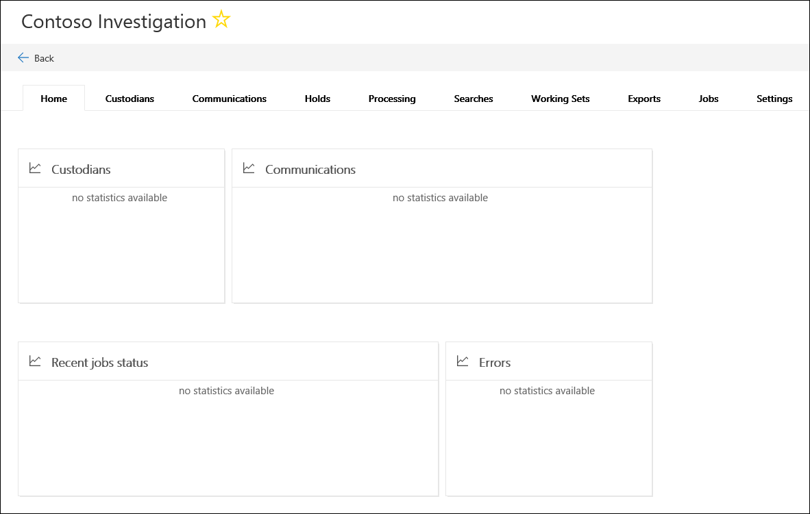

# Créer un cas dans Advanced eDiscovery (aperçu)    

1. Accédez à la page [https://protection.office.com](https://protection.office.com).
    
2. Connectez-vous à Office 365 à l'aide de votre compte scolaire ou professionnel.
    
3. Dans le centre de sécurité & Compliance Center, cliquez sur **eDiscovery _GT_ Advanced eDiscovery**.
 
4. Dans la page **Advanced eDiscovery (Preview)** , cliquez sur **créer un cas**.
    
5. Sur la page de la nouvelle boîte de réception de **cas eDiscovery** , attribuez un nom (obligatoire) à la demande, puis tapez un numéro de cas et une description facultatifs. Notez que le nom du cas doit être unique dans votre organisation.

6. Sous **voulez-vous configurer d'autres paramètres après avoir créé ce cas?**, effectuez l'une des opérations suivantes:

    - Cliquez sur **Oui** pour créer le cas, puis affichez la page **paramètres** dans le nouvel incident. Cela vous permet d'ajouter des membres au cas.
    
    - Cliquez sur **non** pour créer le cas et l'afficher dans la liste des incidents sur la page **Advanced eDiscovery (Preview)** . Si vous choisissez cette option, vous serez ajouté en tant que membre du cas et les paramètres de recherche et d'analyse par défaut seront utilisés. Vous pouvez ajouter des membres ou modifier des paramètres à tout moment après la création de l'incident.

7. Cliquez sur **Enregistrer** pour créer le cas.

    Le nouvel incident est affiché dans la liste des incidents sur la page **Advanced eDiscovery (Preview)** . 

8. Pour ouvrir un cas, cliquez sur son nom. 

    L'onglet **Accueil** de la demande de devis s'affiche. Par exemple, voici un nouveau cas nommé « *contoso investigation*».

    
