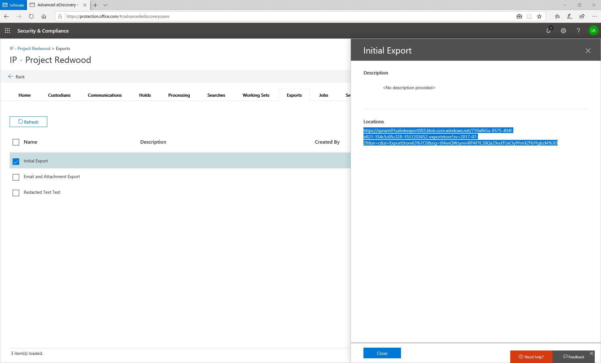
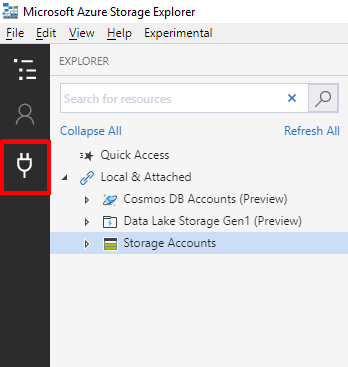
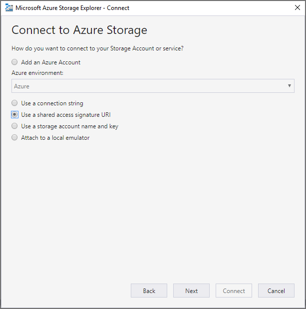
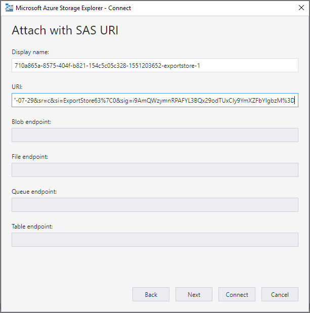
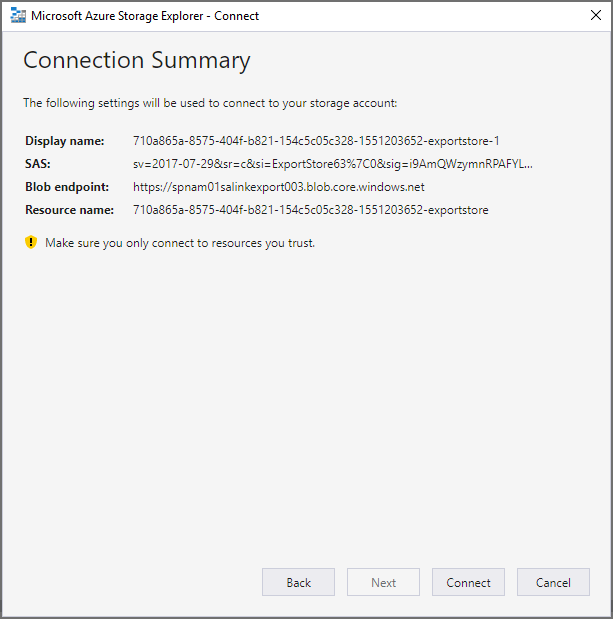
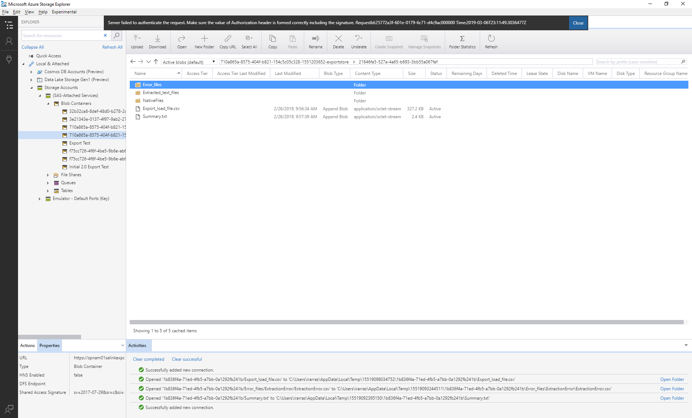

# Télécharger l’exportation des travaux

Toutes les données exportées sont ajoutées à un objet BLOB Microsoft Azure. Cela fournit plusieurs options pour gérer les données en aval. Il existe plusieurs façons d’accéder à un objet BLOB Azure. L’une des méthodes consiste à utiliser l’Explorateur de stockage Azure. Cette méthode prend en charge la connexion, la navigation et le téléchargement simples. Pour plus d’informations, reportez-vous à<https://docs.microsoft.com/en-us/azure/storage/blobs/storage-quickstart-blobs-storage-explorer>

1.  Pour télécharger du contenu à la fin d’une opération d’exportation, accédez à l’onglet exportations et sélectionnez un travail d’exportation.

2.  Copiez le texte dans la section «emplacements» de la fenêtre mobile.

3.  Ouvrez l’Explorateur de stockage Azure et cliquez sur le bouton «se connecter»

4.  Sélectionnez «utiliser un URI de signature d’accès partagé», puis cliquez sur suivant.

5.  Collez le texte de l’emplacement dans la zone de texte URI, puis cliquez sur suivant.

6.  Cliquez sur se connecter.

Cette opération ajoute l’exportation en tant qu’objet dans les comptes de stockage/services SAS/conteneurs d’objets BLOB. Vous serez en mesure d’explorer l’exportation et de télécharger l’ensemble ou des parties de l’exportation.

