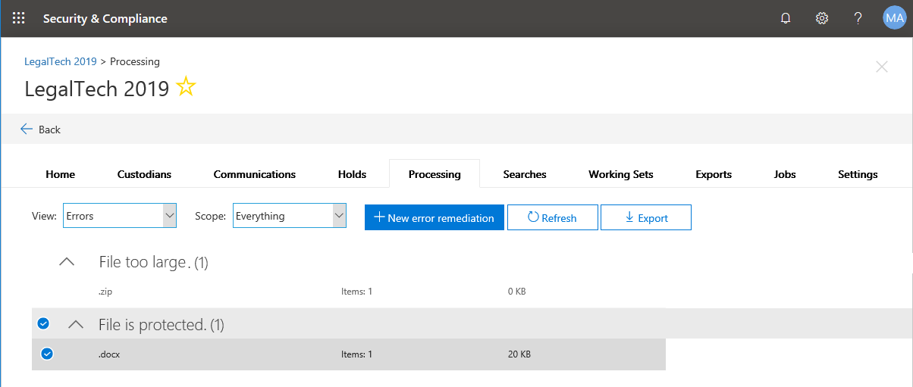
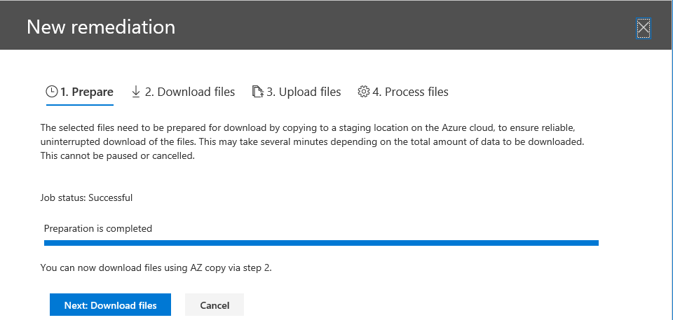
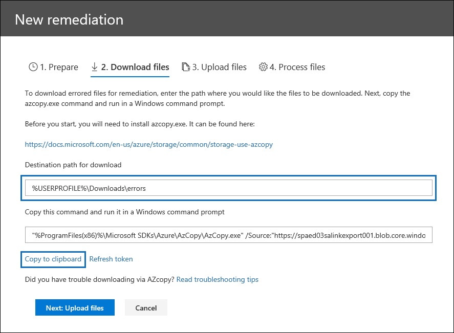
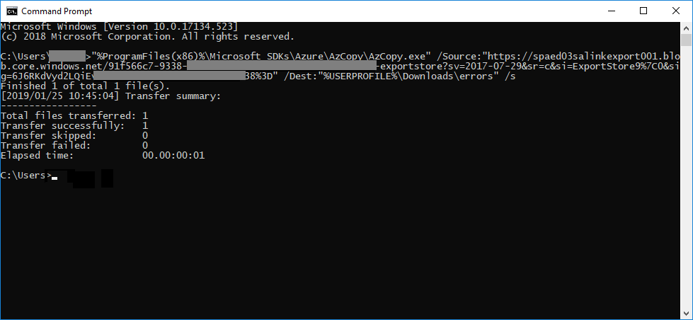
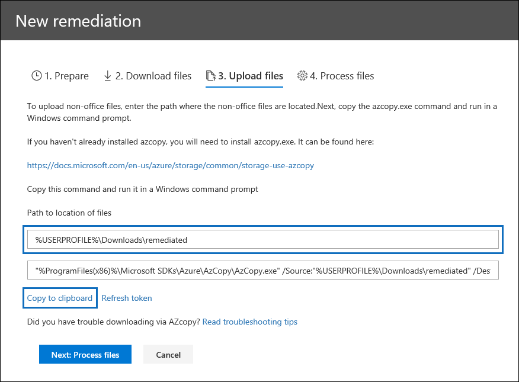
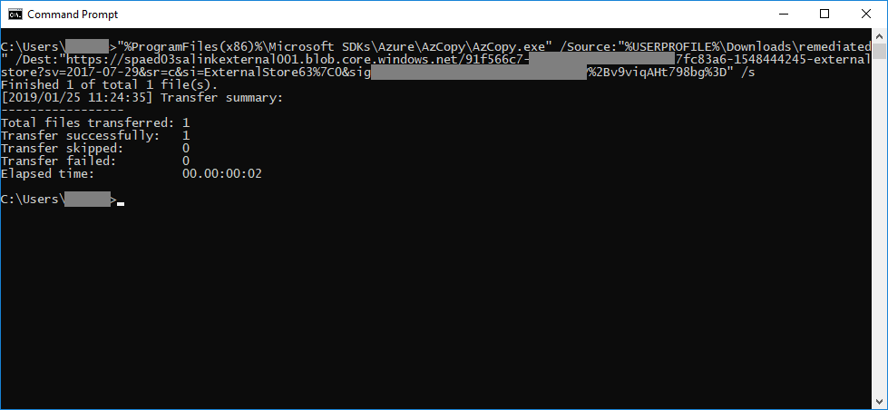

# Correction d’erreur lors du traitement des donnéesError remediation when processing data

La correction des erreurs permet aux administrateurs eDiscovery de rectifier les problèmes de données qui empêchent la découverte électronique avancée de traiter correctement le contenu.Error remediation allows eDiscovery administrators the ability to rectify data issues which prevent Advanced eDiscovery from properly processing the content. Par exemple, les fichiers protégés par mot de passe ne peuvent pas être traités car les fichiers sont verrouillés ou chiffrés.For example, files that are password protected cannot be processed since the files are locked or encrypted. À l’aide de la correction des erreurs, les administrateurs eDiscovery peuvent télécharger des fichiers avec de telles erreurs, supprimer la protection par mot de passe et télécharger les fichiers corrigés.Using error remediation, eDiscovery administrators can download files with such errors, remove the password protection and upload the remediated files.

Utilisez le flux de travail suivant pour corriger les fichiers avec des erreurs dans les cas avancés de découverte électronique.Use the following workflow to remediate files with errors in Advanced eDiscovery cases.

## Création d’une session de correction d’erreur pour corriger les fichiers avec des erreurs de traitementCreating an error remediation session to remediate files with processing errors

>[!NOTE]
>Si l’Assistant de correction d’erreur est fermé à tout moment au cours de la procédure suivante, vous pouvez revenir à la session d’erreur de correction à partir de l’onglet **traitement** en sélectionnant **erreur correction** dans le menu déroulant **vue** .If the the error remediation wizard is closed at any time during the following procedure, you can return to the error remediation session from the **Processing** tab by selecting **Error remediations** in the **View** drop down menu.

1. Sous l’onglet **traitement** dans un cas avancé eDiscovery, sélectionnez **Erreurs** dans le menu déroulant **affichage** .On the **Processing** tab in an Advanced eDiscovery case, select **Errors** in the **View** drop down menu.

2. Sélectionnez les erreurs que vous souhaitez corriger en cliquant sur la case d’option en regard du type d’erreur ou du type de fichier.Select the errors you want to remediate by clicking the radio button next to either the error type or file type.  Dans l’exemple suivant, nous effectuons la correction d’un fichier protégé par mot de passe.In the following example, we're remediating a password protected file.

3. Cliquez sur **+ nouvelle erreur de correction**.Click **+ New error remediation**.

    

    La session de correction d’erreur commence, en commençant par une étape de préparation dans laquelle les fichiers qui ont été erronés sont déplacés vers un emplacement Azure sécurisé à télécharger.The error remediation session will begin, starting with a preparation stage where the files that errored are moved to a secure Azure location to be downloaded.

    

4. Une fois la préparation terminée, cliquez sur **suivant: Télécharger les fichiers** pour continuer le téléchargement.After the preparation is completed, click **Next: Download files** to proceed with download.

    

5. Pour télécharger des fichiers, spécifiez le **chemin de destination pour le téléchargement**; Il s’agit d’un chemin d’accès sur votre ordinateur local où le fichier doit être téléchargé.To download files, specify the **Destination path for download**; this is a path on your local computer where the file should be downloaded.  Le chemin d’accès par défaut,%USERPROFILE%\Downloads\errors, pointe vers le dossier downloads de l’utilisateur connecté; Cela peut être modifié selon vos besoins.The default path, %USERPROFILE%\Downloads\errors, points to the logged-in user's downloads folder; this can be changed as needed.

    >[!NOTE]
    >Nous vous recommandons d’utiliser un chemin d’accès local au lieu d’un chemin d’accès réseau distant pour des performances optimales.We recommend that you use a local file path instead of a remote network path for optimal performance.

    > [!NOTE]
    > Si vous n’avez pas installé AzCopy, vous pouvez l’installer à partir de cet emplacement:https://docs.microsoft.com/en-us/azure/storage/common/storage-use-azcopyIf you haven't installed AzCopy, you can install it from here: https://docs.microsoft.com/en-us/azure/storage/common/storage-use-azcopy

6. Copiez la commande prédéfinie en cliquant sur **copier dans le presse-papiers**.Copy the predefined command by clicking **Copy to clipboard**. Démarrez une invite de commandes Windows, collez la commande, puis appuyez sur **entrée**.Start a windows command prompt, paste the command, and then press **Enter**.  

    Les fichiers sont téléchargés.The files will be downloaded.

    

    > [!NOTE]
    > Si la commande AzCopy fournie échoue, consultez la rubrique pour [résoudre les problèmes de AzCopy dans Advanced eDiscovery](troubleshooting-azcopy.md)If the supplied AzCopy command fails, see to [Troubleshoot AzCopy in Advanced eDiscovery](troubleshooting-azcopy.md)

7. Après avoir téléchargé les fichiers, vous pouvez les corriger à l’aide d’un outil approprié.After downloading the files, you can remediate them with an appropriate tool. Pour les fichiers protégés par mot de passe, il existe un certain nombre d’outils de craquage de mot de passe que vous pouvez utiliser.For password protected files, there are a number of password cracking tools you can use. Si vous connaissiez les mots de passe des fichiers, vous pouvez les ouvrir et supprimer la protection par mot de passe.If you know the passwords for the files, you can open them and remove the password protection.
    > [!NOTE]
    > Il est important de conserver la structure de répertoire et les noms de fichier des fichiers corrigés dans l’élément tact.IT is important that you retain the directory structure and file names of the remediated files in tact.  Toutes les conventions d’affectation de noms utilisées dans les fichiers et les dossiers téléchargés permettent d’associer à nouveau les fichiers remdiated à l’original.All naming conventions used in the downloaded files and folders make it possible to associate the remdiated files back to the original.

8. À présent, revenez à Advanced eDiscovery et cliquez sur **suivant: upload files**.Now, return to Advanced eDiscovery and click **Next: Upload files**.  Cette opération passe à l’étape suivante, dans laquelle vous pouvez à présent télécharger les fichiers.This will move to the next step where you can now upload the files.

    

9. Spécifiez l’emplacement des fichiers corrigés dans la zone **de texte chemin d’accès à l’emplacement des fichiers** , puis cliquez sur **copier dans clibpboard**.Specifiy the location of the remediated files in the **Path to location of files** text box, then click **Copy to clibpboard**.

10. Collez la commande dans une invite de commande Windows et appuyez sur **entrée** pour charger les fichiers.Paste the command into a Windows Command Prompt and press **Enter** to upload the files.

    

11. Enfin, revenez à Advanced eDiscovery et cliquez sur **Next: process files**.Finally, return to Advanced eDiscovery and click **Next: Process files**.

12. Une fois le traitement terminé.When processing is complete.  Vous pouvez revenir à l’ensemble de révision et voir le fichier corrigé.You can return to the review set and see the remediated file.

## Que se passe-t-il lorsque les fichiers sont convertis?What happens when files are remediated

Lorsque les fichiers résolus sont téléchargés, les métadonnées d’origine sont conservées à l’exception des champs suivants:When remediated files are uploaded, the original metadata is preserved with the exception of the following fields: 

- DocumentExtractedUrlDocumentExtractedUrl
- ExtractedTextSizeExtractedTextSize
- HasTextHasText
- IsErrorRemediateIsErrorRemediate
- IsParentExtractedUrlIsParentExtractedUrl
- ItemExtractedUrlItemExtractedUrl
- LoadIdLoadId
- ProcessingErrorMessageProcessingErrorMessage
- ProcessingStatusProcessingStatus
- TextText
- WordCountWordCount
- WorkingsetIdWorkingsetId

Pour obtenir une définition de tous les champs de métadonnées de document dans Advanced eDiscovery, consultez la rubrique [document Metadata Fields](document-metadata-fields.md).For a definition of all document metadata fields in Advanced eDiscovery, see [Document metadata fields](document-metadata-fields.md).