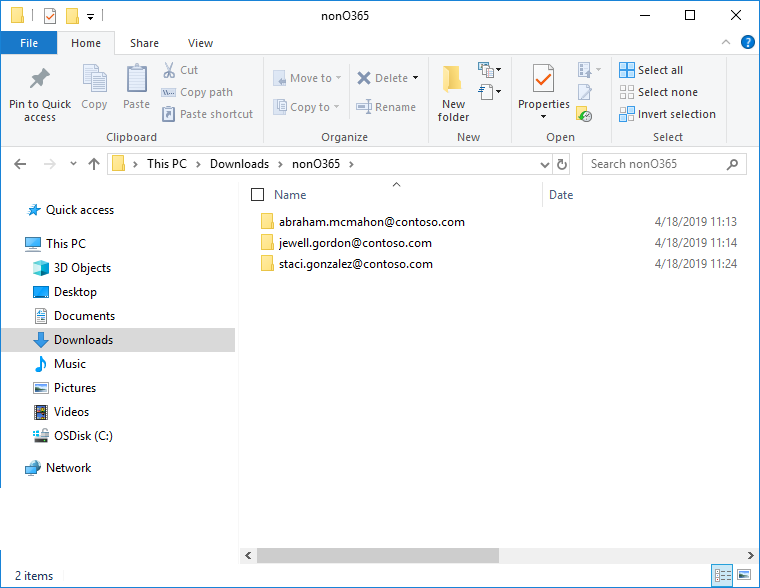
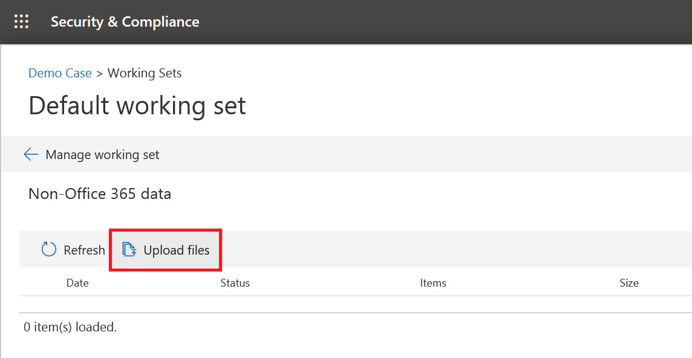
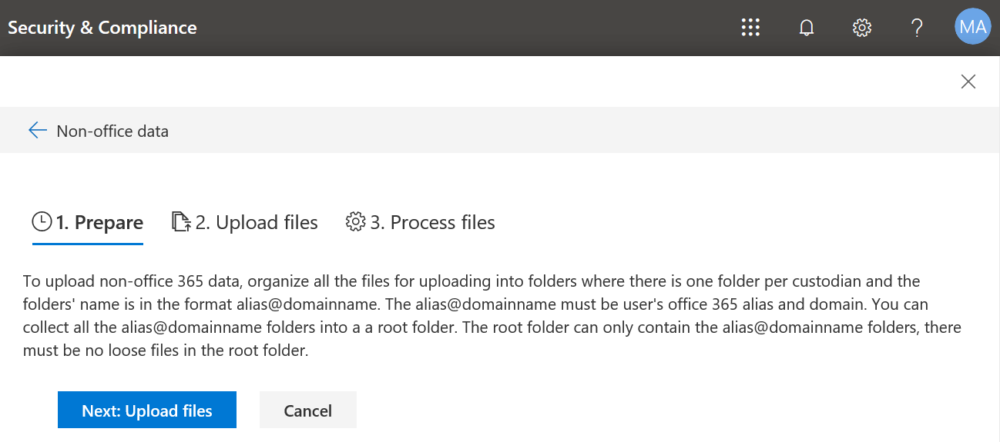
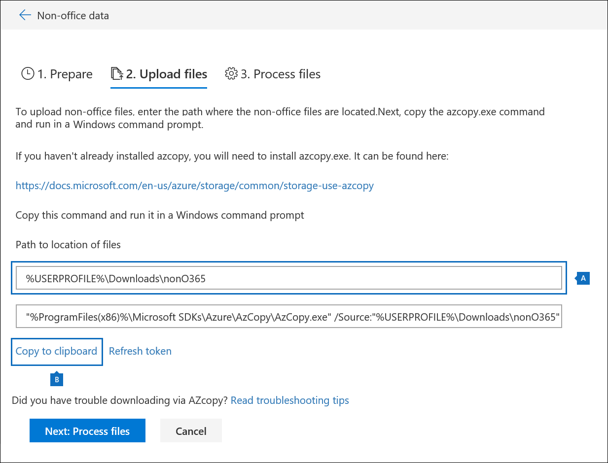
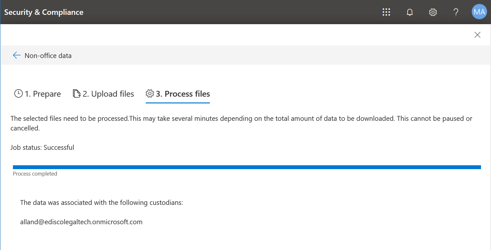

# Charger des données autres qu’Office 365 dans un jeu à réviser

Tous les documents que vous devez analyser dans Advanced eDiscovery sont situés dans Office 365. Avec la fonctionnalité d’importation de données non-Office 365 dans Advanced eDiscovery, vous pouvez télécharger des documents qui ne se trouvent pas dans Office 365 vers un jeu de révision. Cet article vous explique comment mettre vos documents autres que Office 365 dans Advanced eDiscovery pour analyse.

>[!Note]
>Advanced eDiscovery nécessite un abonnement Microsoft 365 ou Office 365 E5 pour votre organisation ou un abonnement E3 avec l’abonnement de complément de conformité avancé. Si vous ne disposez pas de ce plan et que vous souhaitez essayer Advanced eDiscovery, vous pouvez vous inscrire pour obtenir une version d’évaluation d’Office 365 entreprise E5.

## Avant de commencer

L’utilisation de la fonctionnalité de téléchargement non-Office 365 décrite dans cet article requiert les éléments suivants:

- Tous les dépositaires auxquels vous souhaitez associer un contenu non-Office 365 doivent se voir attribuer une licence E5 ou une licence E3 avec une licence de module complémentaire de conformité avancée.

- Un cas de découverte électronique avancé existant.

- Les dépositaires doivent être ajoutés à l’incident avant de pouvoir télécharger et d’associer les données non Office 365.

- Les données non-Office 365 doivent être un type de fichier pris en charge par Advanced eDiscovery. Pour plus d’informations, consultez la rubrique [types de fichiers pris en charge dans Advanced eDiscovery](supported-filetypes-ediscovery20.md).

- Tous les fichiers téléchargés vers un jeu de révision doivent se trouver dans des dossiers, où chaque dossier est associé à un dépositaire spécifique. Les noms de ces dossiers doivent utiliser le format d’affectation de noms suivant: *alias @ NomDomaine*. L' *alias @ DomainName* doit être l’alias et le domaine Office 365 de l’utilisateur. Vous pouvez collecter tous les dossiers *alias @ NomDomaine* dans un dossier racine. Le dossier racine ne peut contenir que les dossiers *alias @ NomDomaine* . Les fichiers libres dans le dossier racine ne sont pas pris en charge.

   La structure de dossiers pour les données non-Office 365 que vous souhaitez télécharger serait semblable à l’exemple suivant:

   - c:\nonO365\abraham.mcmahon@contoso.com
   - c:\nonO365\jewell.gordon@contoso.com
   - c:\nonO365\staci.gonzalez@contoso.com

   Où abraham.mcmahon@contoso.com, jewell.gordon@contoso.com et staci.gonzalez@contoso.com sont les adresses SMTP des dépositaires dans le cas.

   

- Un compte qui est affecté au groupe de rôles gestionnaire eDiscovery (et ajouté en tant qu’administrateur eDiscovery).

- Outils de stockage Microsoft Azure installés sur un ordinateur ayant accès à la structure de dossiers de contenu non Office 365. Pour installer AzCopy, consultez la rubrique [prise en main de AzCopy](https://docs.microsoft.com/azure/storage/common/storage-use-azcopy). Veillez à installer AzCopy à l’emplacement par défaut, à savoir **% ProgramFiles (x86)% \ Microsoft SDKs\Azure\AzCopy**.

## Chargement de contenu non-Office 365 dans Advanced eDiscovery

1. En tant que gestionnaire eDiscovery ou administrateur eDiscovery, ouvrez Advanced eDiscovery, puis le cas où les données non Office 365 seront téléchargées vers.  

2. Cliquez sur réviser les **ensembles**, puis sélectionnez le jeu de révision pour lequel télécharger les données non Office 365.  Si vous n’avez pas d’ensemble de révision, vous pouvez en créer un. 
 
3. Dans l’ensemble de révision, cliquez sur **gérer l’ensemble**de révisions, puis sur **afficher les téléchargements** dans la vignette **données autres que Office 365** .

4. Cliquez sur **Télécharger les fichiers** pour démarrer l’Assistant importation de données autres que Office 365.

   

   La première étape de l’Assistant prépare un emplacement de stockage Azure sécurisé fourni par Microsoft pour télécharger les fichiers.  Une fois la préparation terminée, le bouton **suivant: charger les fichiers** devient actif.

   
 
5. Cliquez sur **suivant: charger les fichiers**.

6. Sur la page **Télécharger les fichiers** , procédez comme suit:

   

   a. Dans la zone **chemin d’accès à l’emplacement des fichiers** , vérifiez ou tapez l’emplacement du dossier racine dans lequel vous avez stocké les données non Office 365 que vous souhaitez télécharger. Par exemple, pour l’emplacement des fichiers d’exemple présentés dans la **section avant de commencer**, vous devez taper **%USERPROFILE\Downloads\nonO365**. La fourniture de l’emplacement correct garantit que la commande AzCopy affichée dans la zone sous le chemin est correctement mise à jour.

   b. Cliquez sur **copier dans le presse-papiers** pour copier la commande affichée dans la zone. Démarrez une invite de commandes Windows, collez la commande et appuyez sur entrée.  Les fichiers sont téléchargés vers le stockage BLOB Azure sécurisé pour l’étape suivante.

7. Démarrez une invite de commandes Windows, collez la commande que vous avez copiée à l’étape précédente, puis appuyez sur **entrée** pour démarrer la commande AzCopy.  Une fois que vous avez démarré la commande, les fichiers non-Office 365 sont téléchargés vers l’emplacement de stockage Azure préparé à l’étape 4.

   

   > [!NOTE]
   > Si la commande AzCopy fournie échoue, reportez-vous à la rubrique [Troubleshoot AzCopy in Advanced eDiscovery](troubleshooting-azcopy.md)

8. Revenez dans le centre de sécurité & conformité, puis cliquez sur **suivant: traiter les fichiers** dans l’Assistant.  Cela lance le traitement, l’extraction de texte et l’indexation des fichiers non-Office 365 qui ont été téléchargés vers l’emplacement de stockage Azure.  

9. Effectuez le suivi de la progression du traitement des fichiers non-Office 365 sur la page des **fichiers de processus** ou sur l’onglet **travaux** en affichant un travail nommé **ajout de données non Office 365 à un jeu de révision**.  Une fois le travail terminé, les nouveaux fichiers seront disponibles dans l’ensemble de révision.

   

10. Une fois le traitement terminé, vous pouvez fermer l’Assistant.