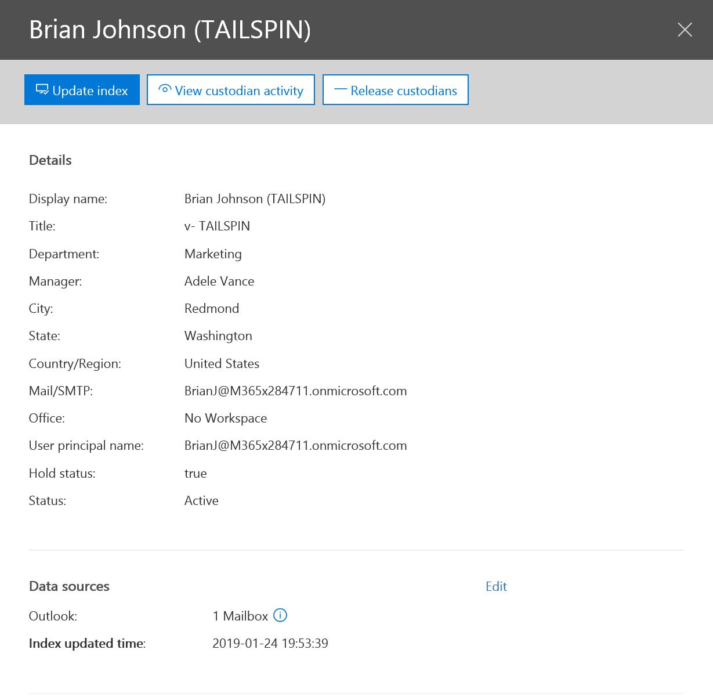
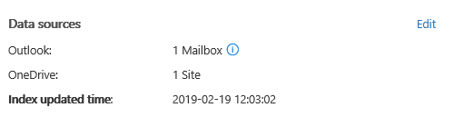
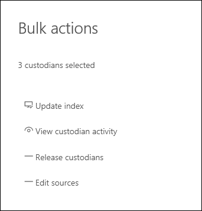

# Gestion des dépositaires dans un cas avancé eDiscoveryManage custodians in an Advanced eDiscovery case

L’onglet dépositaires dans Advanced eDiscovery contient la liste de tous les dépositaires qui ont été ajoutés à l’incident.The Custodians tab in Advanced eDiscovery contains a list of all custodians that have been added to the case. Une fois que vous avez ajouté des dépositaires à un cas, les détails de chaque dépositaire sont automatiquement collectés à partir d’Azure Active Directory et peuvent être consultés dans Advanced eDiscovery.After you add custodians to a case, details about each custodian are automatically collected from Azure Active Directory and are viewable in Advanced eDiscovery.

## Afficher les détails du dépositaireView custodian details

Pour afficher les détails relatifs à un dépositaire, cliquez sur celui-ci dans la \*\*\*\* liste sous l’onglet dépositaires. Une page de menu volant s’affiche et contient les informations suivantes sur le dépositaire:To view the details about a custodian, click the custodian from the list on the **Custodians** tab. A flyout page is displayed and contains the following information about the custodian:

- Informations de contactContact information

  - **Nom d’affichage** : nom affiché dans le carnet d’adresses pour le dépositaire.**Display Name** - The name displayed in the address book for the custodian. Il s’agit généralement de la combinaison du prénom du dépositaire, de l’initiale du deuxième prénom et du nom de famille.This is usually the combination of the custodian’s first name, middle initial, and last name.
  
   - **Mail/SMTP** : adresse SMTP principale pour le dépositaire, par exemple, brianj@contoso.onmicrosoft.com.**Mail/SMTP** - The primary SMTP address for the custodian, for example, brianj@contoso.onmicrosoft.com. Notez que le nom d’utilisateur principal (UPN) du dépositaire est également indiqué.Note that the custodian's user principal name (UPN) is also listed.

  - **Title** -fonction du dépositaire.**Title** - The custodian’s job title.

  - **Department** : nom du service dans lequel le dépositaire travaille.**Department** - The name for the department in which the custodian works.

  - **Responsable** : le responsable du dépositaire.**Manager** - The custodian’s manager. Le responsable désigné recevra toutes les communications d’escalade de ce dépositaire.The designated manager will receive any escalation communications for this custodian.
  
- Informations d’emplacementLocation information

  - **Ville** -ville où se trouve le dépositaire.**City** - The city in which the custodian is located.

  - **Département** : État ou province dans l’adresse du dépositaire.**State** - The state or province in the custodian’s address.

  - **Pays/région** : pays/région où se trouve le dépositaire.**Country/Region** - The country/region where the custodian’s is located.

  - **Office** : l’emplacement de l’Office dans le lieu d’activité du dépositaire.**Office** - The office location in the custodian’s place of business.

- Informations sur les casCase information

  - **Hold Status** : indique si le dépositaire a été mis en attente.**Hold status** - Indicates if the custodian has been placed on hold. 

  - **Statut**de la communication: indique si un avis de mise en attente a été émis pour le dépositaire.**Communication status**: Indicates if the custodian has been issued a hold notice. Si le dépositaire a reçu une notification, la valeur de cette propriété est **publiée**.If the custodian has been issued a notice, this value of this property is **Published**. Si le dépositaire n’a pas reçu de notification, son statut est non **publié**.If the custodian has not been issued a notice, the status is **Un-published**. 

  - **Status** : état du dépositaire dans le cas.**Status** - The status of the custodian within the case. L’état **actif** indique que le dépositaire fait partie de l’affaire.A status of **Active** indicates that the custodian is part of the case. Si un dépositaire est émis à partir d’un incident, le statut passe à **lancé**.If a custodian is released from a case, the status is changed to **Released**. 

- Sources de données et informations d’indexationData sources and indexing information

    - **Sources de données** : affiche le nombre et le type de sources de données (boîtes aux lettres, sites et équipes) qui sont associées au dépositaire et font partie de la demande.**Data sources** - Shows the count and type of data sources (mailboxes, sites, and Teams) that are associated with the custodian and are part of the case.

    - Date et heure de **mise à jour** de l’index: indique l’heure et la date de la dernière déclenchement du travail d’indexation avancé.**Index updated time** - Indicates the time and date for when the advanced indexing job was last triggered. Cette propriété indique également quand le processus d’indexation avancé est en cours.This property will also indicate when the advanced indexing process is currently in progress.

## Modifier un dépositaireEdit a custodian

Lors de l’évolution de votre cas, vous pouvez découvrir qu’il peut y avoir des sources de données supplémentaires pertinentes pour un dépositaire spécifique & votre cas.As your case progresses, you may discover that there may be additional data sources relevant to a specific custodian & your case. Dans d’autres scénarios, vous souhaiterez peut-être supprimer certaines sources de données qui ont été vérifiées et considérées comme non pertinentes.In other scenarios, you may want to remove certain data sources that have been reviewed and deemed as not relevant.

Pour mettre à jour les sources de données associées à un dépositaire, procédez comme suit:To update the data sources that are associated with a custodian:

1. Accédez à **eDiscovery _GT_ Advanced eDiscovery** et ouvrez le cas.Go to  **eDiscovery > Advanced eDiscovery** and open the case.
  
2. Cliquez sur \*\*\*\* l’onglet dépositaires.Click the **Custodians** tab.
  
3. Sélectionnez un dépositaire dans la liste, puis cliquez sur **modifier** sur la page de menu volant.Select a custodian from the list and click **Edit** on the flyout page.

    
  
4. Cliquez sur l’onglet **choisir les sources de données** pour modifier les paramètres de la boîte aux lettres Exchange du dépositaire et du compte OneDrive, puis cliquez sur choisir les sources de **données**.Click **Choose data sources** tab to change the settings for the custodian's Exchange mailbox and OneDrive account, click **Choose data sources**.
  
5. Cliquez sur l’onglet **Sélectionner des sources de données supplémentaires** pour ajouter ou supprimer des équipes, des groupes SharePoint ou des boîtes aux lettres Exchange associées au dépositaire.Click the **Select additional data sources** tab to add or remove Teams, SharePoint, or Exchange mailboxes associated with the custodian. 

    Pour plus d’informations sur les sources de données associées à un dépositaire, voir «étape 3: associer des sources de données supplémentaires à un dépositaire» dans [Ajouter des dépositaires à un cas](add-custodians-to-case.md#step-3-associate-additional-data-sources-to-a-custodian).For more information about data sources associated with a custodian, see "Step 3: Associate additional data sources to a custodian" in [Add custodians to a case](add-custodians-to-case.md#step-3-associate-additional-data-sources-to-a-custodian). 
  
6. Cliquez sur **Placer** des conservations privatives pour activer ou désactiver la conservation pour le dépositaire.Click **Place custodial holds** to enable or disable the hold for the custodian.

## Résoudre les erreurs de traitement des dépositairesResolve custodian processing errors

Dans la plupart des flux de travail eDiscovery pour les enquêtes juridiques, un sous-ensemble des données d’un dépositaire est recherché une fois que le dépositaire est ajouté à un cas juridique.In most eDiscovery workflows for legal investigations, a subset of a custodian's data is searched after the custodian is added to a legal case. En raison de la taille des fichiers très volumineux ou d’une éventuelle altération des données, certains éléments des sources de données associées à un dépositaire peuvent être partiellement indexés.Because of very large file sizes or possible data corruption, some items in the data sources associated with a custodian may be partially indexed. À l’aide de la fonctionnalité d' [indexation avancée](indexing-custodian-data.md) dans la découverte électronique avancée, la plupart des éléments indexés partiellement peuvent être automatiquement corrigés en réindexant ces éléments à la demande.Using the [advanced indexing](indexing-custodian-data.md) capability in the Advanced eDiscovery, most partially indexed items can be automatically remediated by re-indexing these items on demand.

Lorsqu’un dépositaire est ajouté à un cas, les données situées dans les sources de données associées au dépositaire sont automatiquement réindexées (par le processus d’indexation avancé).When a custodian is added to a case, the data located in the data sources associated with the custodian is automatically re-indexed (by the advanced indexing process). Cela signifie que vous pouvez laisser les données sur place au lieu de devoir les télécharger et les corriger, puis les Rechercher hors connexion).This means you can leave the data in-place instead of having to download and remediate it and then search it offline). Toutefois, pendant le cycle de vie d’un cas juridique, de nouvelles sources de données peuvent être associées à un dépositaire.However, during the lifecycle of a legal case new data sources might be associated to a custodian. Dans ce cas, vous réindexez les données du dépositaire en réexécutant le processus d’indexation avancé afin de corriger les éléments partiellement indexés et de mettre à jour l’index des données du dépositaire.In this case, you re-index the custodian's data by re-running the advanced indexing process to remediate any partially indexed items and update the index for the custodian's data.

Pour déclencher le processus de réindexation afin d’adresser des éléments partiellement indexés:To trigger the re-indexing process to address partially indexed items:

1. Accédez à **eDiscovery _GT_ Advanced eDiscovery** et ouvrez le cas.Go to  **eDiscovery > Advanced eDiscovery** and open the case.

2. Cliquez sur l' **onglet dépositaires**, puis sélectionnez un dépositaire dont les données doivent être réindexées.Click to **Custodians tab**, and then select a custodian whose data must be reindexed. 

3. Sur la page de la fenêtre volante, cliquez sur **mettre à jour l’index**.On the flyout page, click **Update index**.

   Une boîte de dialogue s’affiche, indiquant que le travail d’index a été créé.A dialog is displayed saying the index job has been created.

La réindexation des données du dépositaire est un processus long; le travail correspondant créé est nommé réindexation des **données des dépositaires**.Re-indexing custodian data is a long-running process; the corresponding job that's created is named **Re-indexing custodian data**. Vous pouvez suivre l’avancement sous l’onglet **travaux** ou sous l’onglet **dépositaires** en surveillant le statut dans la colonne État du travail d' **indexation** .You can track the progress on the **Jobs** tab or on the **Custodians** tab by monitoring the status in the **Indexing job status** column.

Pour plus d’informations, reportez-vous aux rubriques suivantes :For more information, see:

- [Utiliser les erreurs de traitementWork with processing errors](processing-data-for-case.md)

- [Gérer les tâchesManage jobs](managing-jobs-ediscovery20.md)

## Publication d’un dépositaire à partir d’un casRelease a custodian from a case

Un dépositaire est publié dans les situations où un cas est fermé, le dépositaire n’est plus tenu de conserver le contenu d’un cas ou lorsque le dépositaire est considéré comme n’étant plus pertinent pour le cas.A custodian is released in situations where a case is closed, the custodian is no longer under obligation to preserve content for a case, or when the custodian is deemed to no longer be relevant to the case. 

Si vous libérez un dépositaire après la publication d’une notification de mise en attente, un avis de publication est envoyé au dépositaire.If you release a custodian after a hold notice was published, a release notice will be sent to the custodian. De plus, toutes les suspensions placées sur les sources de données qui ont été associées au dépositaire sont supprimées.Additionally, any holds placed on data sources that were associated with the custodian are removed. Si le dépositaire a été placé sur un *blocage silencieux*, où il n’a pas reçu de notifications de mise en attente légale, un avis de publication ne sera pas envoyé, mais les blocages placés sur les sources de données associées à ce dépositaire sont supprimés.If the custodian was placed on a *silent hold*, where they weren't issued any legal hold notifications, a release notice will not be sent but any holds placed on data sources that were associated with that custodian are removed.

Pour libérer un dépositaire:To release a custodian: 

1. Accédez à **eDiscovery _GT_ Advanced eDiscovery** et ouvrez le cas.Go to  **eDiscovery > Advanced eDiscovery** and open the case.

2.  Accédez à l' \*\*\*\* onglet dépositaires.Go to the **Custodians** tab.

3.  Cliquez sur l' **onglet dépositaires**, puis sélectionnez le dépositaire qui est lancé à partir du cas.Click to **Custodians tab**, and then select the custodian who is being released from the case.

4. Sur la page flyout, cliquez sur **libérer le dépositaire**.On the flyout page, click **Release custodian**.

   Une page d’avertissement s’affiche pour expliquer que si une conservation est placée sur une source de données associée au dépositaire, la conservation sera supprimée et les autres conservations associées à un autre cas de découverte électronique avancée continueront à s’appliquer.A warning page is displayed explaining that if a hold is placed on a data source associated with the custodian, the hold will be removed, and that any other hold associated with a different Advanced eDiscovery case will still apply. Cela inclut d’autres types de fonctionnalités de conservation et de rétention dans Office 365 (par exemple, une stratégie de rétention Office 365).That includes other types of preservation and retention features in Office 365 (such as an Office 365 retention policy).

5. Cliquez sur **Oui** pour confirmer le lancement du dépositaire.Click **Yes** to confirm that you want to release the custodian. 

    Notez que l’état de cet utilisateur dans \*\*\*\* l’onglet dépositaires est défini \*\*\*\* sur Released et que le **statut de blocage** sur la page flyout est modifié sur **false**.Note that status for this user on the **Custodians** tab is set to **Released** and the **Hold status** on the flyout page is changed to **False**. 

> [!NOTE]
> Un dépositaire peut être impliqué simultanément dans plusieurs cas juridiques.A custodian might be simultaneously involved in several legal cases. Lorsqu’un dépositaire est émis à partir d’un cas, les conservations et notifications dans les autres matières ne seront pas affectées.When a custodian is released from a case, the holds and notifications across other matters won't be impacted.

## Modifier en bloc des dépositairesBulk-edit custodians

Vous pouvez utiliser l’éditeur en bloc pour modifier plusieurs dépositaires en même temps.You can use the bulk editor to edit multiple custodians as the same time. Pour ce faire, sélectionnez au moins deux dépositaires dans l’onglet **dépositaires** pour afficher l’éditeur en bloc, puis cliquez sur l’une des tâches.To do this, just select two or more custodians on the **Custodians** tab to display the bulk editor and then click one of tasks.

