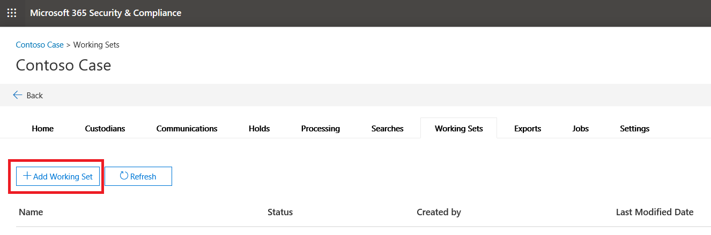
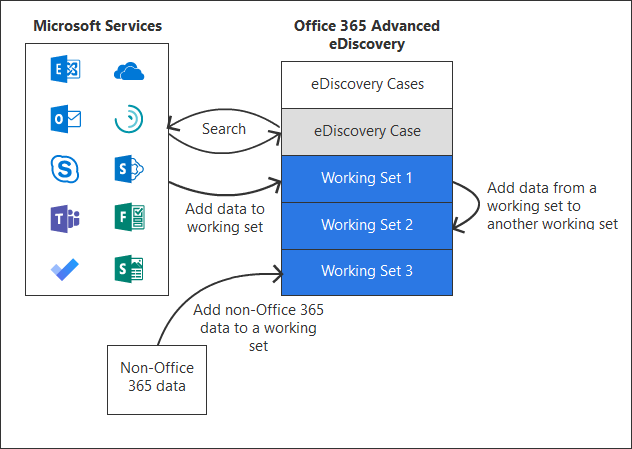

# Gérer les ensembles de révision dans Advanced eDiscoveryManage review sets in Advanced eDiscovery

Les ensembles de validation sont un ensemble statique de documents où vous pouvez analyser, interroger, afficher, marquer et exporter des données dans un cas.Review sets are a static set of documents where you can analyze, query, view, tag, and export data in a case. Pour plus d’informations sur l’exécution de ces tâches, voir:For more information about performing these tasks, see:

- [Analyser les données d’un ensemble de révisionAnalyze data in a review set](analyzing-data-in-review-set.md)

- [Interroger les données d’un jeu à réviserQuery the data in a review set](review-set-search.md)

- [Afficher les documents d’un jeu à réviserView documents in a review set](view-documents-in-review-set.md)

- [Étiqueter les documents d’un jeu à réviserTag documents in a review set](tagging-documents.md)

- [Exporter les données de casExport case data](exporting-data-ediscover20.md)

## Créer un jeu de révisionCreate a review set

Vous pouvez créer des ensembles de réviseurs sous l’onglet réviser les **ensembles** en cliquant sur **+ Ajouter un jeu de révision**.Review sets can be created on the **Review sets** tab by clicking **+ Add review set**.

Sur la page **Ajouter un jeu** de réexamen, entrez un nom pour l’ensemble de vérification, puis cliquez sur **Enregistrer**.On the **Add review set** flyout page, type a name for the review set and then click **Save**. Le nouvel ensemble de révision est affiché dans la liste sous l’onglet réviser les **ensembles** .The new review set is displayed in the list on the **Review sets** tab.

Il existe trois manières différentes d’ajouter des données à un jeu de réexamen dans un cas avancé de découverte électronique.There are three different ways to add data to a review set in an Advanced eDiscovery case.

1. [Ajouter des résultats de recherche à un jeu à réviserAdd search results to a review set](add-data-to-review-set.md)

2. [Charger des données autres qu’Office 365 dans un jeu à réviserLoad non-Office 365 data into a review set](load-non-office365-data.md)

3. [Ajouter des données à un jeu de révision à partir d’un autre ensemble de révisionAdd data to a review set from another review set](add-data-to-review-set-from-another-review-set.md)
