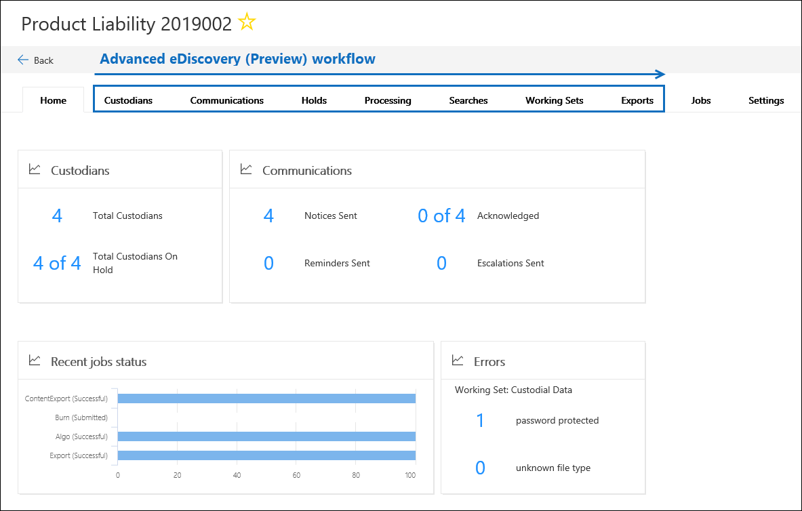

# Vue d’ensemble de la solution avancée eDiscovery dans Microsoft 365Overview of the Advanced eDiscovery solution in Microsoft 365

La solution eDiscovery avancée de Microsoft 365 repose sur les fonctionnalités d’analyse et de découverte électronique existantes dans Office 365.The Advanced eDiscovery solution in Microsoft 365 builds on the existing eDiscovery and analytics capabilities in Office 365. Cette nouvelle solution, appelée *Advanced eDiscovery*, fournit un flux de travail de bout en bout pour conserver, collecter, examiner, analyser et exporter du contenu réactif aux investigations internes et externes de votre organisation.This new solution, called *Advanced eDiscovery*, provides an end-to-end workflow to preserve, collect, review, analyze, and export content that's responsive to your organization's internal and external investigations. Il permet également aux équipes juridiques de gérer l’ensemble du flux de travail de notification de suspension légale pour communiquer avec les dépositaires impliqués dans un cas.It also lets legal teams manage the entire legal hold notification workflow to communicate with custodians involved in a case. 

## Alignement avec EDRMAlignment with EDRM

Le flux de travail intégré de Advanced eDiscovery s’aligne sur le processus eDiscovery décrit par le modèle de référence de découverte électronique (EDRM).The built-in workflow of Advanced eDiscovery aligns with the eDiscovery process outlined by the Electronic Discovery Reference Model (EDRM). 

(Image source courtoisie de edrm.net.(Image source courtesy of edrm.net. L’image source a été mise à disposition sous la licence non à l’attribution 3,0 Creative.The source image was made available under Creative Commons Attribution 3.0 Unported License.)

À un niveau élevé, voici comment Advanced eDiscovery prend en charge le flux de travail EDRM:At a high level, here's how Advanced eDiscovery supports the EDRM workflow:

- **Identification** : une fois que vous avez identifié les personnes intéressantes pour une enquête, vous pouvez les ajouter en tant que dépositaires (également appelés dépositaires de *données*, car ils peuvent posséder des informations pertinentes pour l’enquête) vers une avancée cas de découverte électronique.**Identification** – After you identify potential persons of interest in an investigation, you can add them as custodians (also called *data custodians*, because they may possess information that's relevant to the investigation) to an Advanced eDiscovery case. Une fois que les utilisateurs sont ajoutés en tant que dépositaires, il est facile de conserver, de collecter et de consulter les documents des dépositaires.After users are added as custodians, it's easy to preserve, collect, and review custodian documents.

- **Préservation** : pour conserver et protéger les données relatives à une enquête, la fonctionnalité eDiscovery avancée vous permet de placer une suspension légale sur les sources de données associées aux dépositaires dans un cas.**Preservation** – To preserve and protect data that's relevant to an investigation, Advanced eDiscovery lets you place a legal hold on the data sources associated with the custodians in a case. Vous pouvez également placer des données non privatives de place en conservation.You can also place non-custodial data on hold. Advanced eDiscovery comprend également un flux de travail de communication intégré qui vous permet d’envoyer des notifications de conservation légale aux dépositaires et d’effectuer le suivi de leurs remerciements.Advanced eDiscovery also has a built-in communications workflow so you can send legal hold notifications to custodians and track their acknowledgments.

- **Collection** : une fois que vous avez identifié (et préservé) les sources de données pertinentes pour l’enquête, vous pouvez utiliser l’outil de recherche intégré dans Advanced eDiscovery Search for and Collect Live Data from the privatives Data sources (et les sources de données non privatives de cœur). , le cas échéant) susceptibles de concerner le cas.**Collection** – After you identified (and preserved) the data sources relevant to the investigation, you can use the built-in search tool in Advanced eDiscovery search for and collect live data from the custodial data sources (and non-custodial data sources, if applicable) that may be relevant to the case.

- **Traitement** : une fois que vous avez collecté toutes les données pertinentes pour le cas, l’étape suivante consiste à le traiter à des fins de révision et d’analyse.**Processing** – After you've collected all data relevant to the case, the next step is process it for further review and analysis. Dans Advanced eDiscovery, les données sur place que vous avez identifiées dans la phase de collecte sont copiées vers un emplacement de stockage Azure (appelé un *ensemble de révision*), ce qui vous fournit une vue statique des données de cas.In Advanced eDiscovery, the in-place data that you identified in the collection phase is copied to an Azure Storage location (called a *review set*), which provides you with a static view of the case data. 
 
- **Révision** : une fois que des données ont été ajoutées à un jeu de révisions, vous pouvez afficher des documents spécifiques et exécuter une autre requête pour réduire les données à celles qui sont les plus pertinentes pour le cas.**Review** – After data has been added to a review set, you can view specific documents and run another queries to reduce the data to what is most relevant to the case. Peut également annoter et baliser des documents spécifiques.Also, can annotate and tag specific documents.
 
- **Analysis** : Advanced eDiscovery fournit un outil d’analyse intégré qui vous aide à approfondir les données de l’ensemble de révision que vous déterminez n’est pas pertinent pour l’enquête.**Analysis** – Advanced eDiscovery provides integrated analytics tool that helps you further cull data from the review set that you determine isn't relevant to the investigation. En plus de réduire le volume des données pertinentes, la découverte électronique avancée vous permet également d’enregistrer les coûts de la révision légale en vous permettant d’organiser le contenu pour faciliter et améliorer l’efficacité du processus de révision.In addition to reducing the volume of relevant data, Advance eDiscovery also helps you save legal review costs by letting you organize content to make the review process easier and more efficient.

- **Production** et **Présentation** : lorsque vous êtes prêt, vous pouvez exporter des documents à partir d’un jeu de vérification pour révision légale.**Production** and **Presentation** – When you're ready, you can export documents from a review set for legal review. Vous pouvez exporter des documents dans leur format d’origine ou dans un format spécifié par EDRM afin qu’ils puissent être importés dans des applications tierces.You can export documents in their native format or in an EDRM-specified format so they can be imported into third-party review applications.

## Flux de travail eDiscovery avancéAdvanced eDiscovery workflow

Les sections suivantes décrivent chaque étape du flux de travail intégré dans Advanced eDiscovery.The following sections describe each step in the built-in workflow in Advanced eDiscovery. La capture d’écran suivante montre l’onglet **Accueil** d’un cas nommé *responsabilité du produit 2019002*.The following screenshot shows the **Home** tab of a case named *Product Liability 2019002*. Remarque les onglets de flux de travail en haut de la page sont séquencés pour s’aligner avec le processus EDRM.Note the workflow tabs at the top of the page are sequenced to align with the EDRM process. 

Pour plus d’informations sur le flux de travail de bout en bout dans Advanced eDiscovery, reportez-vous à cette [vidéo de mécanique Microsoft](https://go.microsoft.com/fwlink/?linkid=2066133).For more information about the end-to-end workflow in Advanced eDiscovery, see this [Microsoft Mechanics video](https://go.microsoft.com/fwlink/?linkid=2066133). 

## Gestion des dépositairesManaging custodians

Utilisez l' \*\*\*\* onglet dépositaires pour ajouter et gérer les personnes que vous avez identifiées comme des personnes intéressantes dans le cas.Use the **Custodians** tab to add and manage the people that you've identified as persons of interest in the case. Lorsque vous ajoutez des dépositaires, vous pouvez effectuer rapidement des opérations liées aux dépositaires, telles que le placement d’une conservation légale sur les sources de données des dépositaires, la communication avec des dépositaires et la recherche de sources de données de dépositaire pour collecter du contenu pertinent pour le cas.When you add custodians, you can quickly perform custodian-related actions like placing a legal hold on custodian data sources, communicating with custodians, and searching custodian data sources to collect content that's relevant to the case. À mesure que le cas progresse, il est facile d’ajouter de nouveaux dépositaires ou de libérer des dépositaires à partir du cas.As the case progresses, it's easy to add new custodians or release custodians from the case. Pour plus d’informations, consultez la rubrique [utiliser des dépositaires dans Advanced eDiscovery](managing-custodians.md).For more information, see [Work with custodians in Advanced eDiscovery](managing-custodians.md).

## Gestion des notifications de conservation légaleManaging legal hold notifications

Utilisez l’onglet **communications** pour gérer le processus de communication avec les dépositaires dans le cas.Use the **Communications** tab to manage the process of communicating with the custodians in the case. Une notice légale indique aux dépositaires de conserver tout contenu pertinent pour le cas.A legal hold notice instructs custodians to preserve any content that's relevant to the case. Les équipes juridiques doivent être en mesure de suivre les notifications reçues, lues et reconnues par les dépositaires.Legal teams must be able to track the notices that have been received, read, and acknowledged by custodians. Le flux de travail de communication dans Advanced eDiscovery vous permet de créer et d’envoyer des notifications initiales, des rappels, des notifications de publication et des escalades si les dépositaires ne reconnaissent pas une notification de blocage.The communications workflow in Advanced eDiscovery allows you to create and send initial notifications, reminders, release notices, and escalations if custodians fail to acknowledge a hold notification. Pour plus d’informations, consultez la rubrique [utilisation des communications dans Advanced eDiscovery](managing-custodian-communications.md).For more information, see [Work with communications in Advanced eDiscovery](managing-custodian-communications.md).

## Gestion de la conservation du contenuManaging content preservation

Lorsque vous ajoutez un dépositaire à un cas, vous pouvez placer un blocage sur des données privatives.When you add a custodian to a case, you can place a hold on custodial data. Utilisez l' \*\*\*\* onglet suspensions pour gérer le blocage créé lorsque vous ajoutez des dépositaires, et pour gérer les autres conservations légales associées au cas; par exemple, vous pouvez identifier et placer une conservation sur des sources de données non privatives de cœur.Use the **Holds** tab to manage the hold created when you add custodians, and to manage other legal holds associated with the case; for example, you can identify and place a hold on non-custodial data sources. Vous pouvez également modifier n’importe quelle conservation dans le cas et en faire une conservation basée sur une requête pour conserver uniquement le contenu qui correspond à la requête.You can also edit any hold in the case and make it a query-based hold to preserve only the content that matches the query. Par exemple, vous pouvez ajouter une plage de dates à la suspension afin que seul le contenu créé dans une date spécifique soit dans l’intervalle préservé.For example, you could add a date range to the hold so that only content created within a specific date ranged in preserved. Vous pouvez également obtenir des statistiques sur le contenu en attente, supprimer la conservation une fois qu’elle n’est plus pertinente pour le cas ou la supprimer.You can also get statistics on content that's on hold, remove the hold after it's no longer relevant to the case, or delete it. Pour plus d’informations, consultez la rubrique Manage holds [in Advanced eDiscovery](managing-holds.md).For more information, see [Manage holds in Advanced eDiscovery](managing-holds.md).

## Indexation des données des dépositairesIndexing custodian data

Lorsque vous ajoutez un dépositaire et les sources de données privatives de Troie correspondantes à un cas, tout élément partiellement indexé d’une source de données de dépositaire est réindexé par un processus appelé *indexation avancée*.When you add a custodian and the corresponding custodial data sources to a case, any partially indexed item from a custodian data source is re-indexed by a process called *Advanced indexing*. Cela permet à un contenu privative de formes, comme des images, des types de fichiers non pris en charge et d’autres contenus potentiellement non indexés, d’être entièrement consultable lorsque vous exécutez des recherches pour collecter des données pour le cas.This allows custodial content such as images, unsupported file types, and other potentially unindexed content to be fully searchable when you run searches to collect data for the case. Utilisez l’onglet **traitement** pour surveiller l’état des erreurs d’indexation et de traitement avancées à l’aide d’un processus appelé correction des *Erreurs*.Use the **Processing** tab to monitor the status of Advanced indexing and fix processing errors by using a process called *error remediation*. Pour plus d’informations, voir [corriger les erreurs de traitement dans Advanced eDiscovery](processing-data-for-case.md).For more information, see [Fix processing errors in Advanced eDiscovery](processing-data-for-case.md).

## Collecte des données d’un casCollecting case data

L’onglet **recherches** permet de créer des recherches pour rechercher des sources de données privatives de Troie et non-privatives de place dans Office 365 pour le contenu pertinent pour le cas.Use the **Searches** tab to create searches to search the in-place custodial and non-custodial data sources in Office 365 for content relevant to the case. Vous pouvez créer et exécuter des recherches basées sur des requêtes (à l’aide de mots clés et de conditions) pour identifier un ensemble de messages électroniques et de documents pertinents pour le cas et que vous souhaitez examiner et analyser dans les étapes suivantes dans le flux de travail de découverte électronique.You can create and run query-based searches (using keywords and conditions) to identify a set of email messages and documents that are relevant to the case and that you want to further review and analyze in subsequent steps in the eDiscovery workflow. Vous pouvez créer une ou plusieurs recherches associées au cas.You can create one or more searches associated with the case. Vous pouvez également utiliser l’outil de recherche pour afficher un aperçu des exemples de documents et afficher des statistiques de recherche pour vous aider à affiner et à améliorer les résultats de la recherche.You can also use the search tool to preview sample documents and view search statistics to help you refine and improve the search results. Une fois que vous êtes satisfait, les résultats de la recherche contiennent toutes les données pertinentes pour le cas, vous ajoutez les résultats de la recherche à un jeu de révision pour une révision, une analyse et une élimination ultérieures.After you're satisfied the search results contain the all data relevant to the case, you add the search results to a review set for further review, analysis, and culling. Pour plus d’informations, reportez-vous à [la rubrique collecte de données pour un cas dans Advanced eDiscovery](collecting-data-for-ediscovery.md).For more information, see [Collect data for a case in Advanced eDiscovery](collecting-data-for-ediscovery.md).

## Révision et analyse des données de casReviewing and analyzing case data

Utilisez l’onglet **examiner les ensembles** pour examiner et analyser le contenu que vous avez collecté à partir du système réel et ajouté à un jeu de révision.Use the **Review sets** tab to review and analyze the content that you've collected from the live system and added to a review set. Un *ensemble de révision* est une collection statique de ces données (en d’autres termes, une copie hors connexion) de données privatives de temps (et, le cas échéant, de données non privatives) que vous avez collectées au cours de la phase précédente du flux de travail de découverte électronique.A *review set* is a static collection of that data (in other words, an offline copy of data) of custodial data (and if applicable, non-custodial data) that you collected in the previous phase of the eDiscovery workflow. Lorsque vous ajoutez des résultats de recherche à un ensemble de révision, un processus est déclenché qui extrait les fichiers des conteneurs, extrait les métadonnées et extrait le texte.When you add search results to a review set, a process is triggered that extracts files from containers, extracts metadata, and extracts text. Une fois le processus terminé, le système génère un nouvel index de toutes les données collectées auprès des dépositaires et les ajoute à l’ensemble de révision.When this process is complete, the system builds a new index of all the data collected from custodians and adds it to the review set. Une fois que les données sont ajoutées à l’ensemble de vérification, vous pouvez exécuter davantage de requêtes pour affiner les données de cas, afficher les données au format texte ou au format de fichier natif, et annoter, biffer et baliser les documents dans l’ensemble de révision.After the data is added to the review set, you can run more queries to narrow the case data, view data as text or in the native file format, and annotate, redact, and tag documents in the review set. Vous pouvez également effectuer des analyses avancées, telles que l’identification de la duplication de documents, le Threading de courrier électronique et les thèmes.You can also perform advanced analytics such as identify document duplication, email threading, and themes. Une fois que vous avez consulté les données uniquement sur ce qui est pertinent pour le cas, vous pouvez télécharger les documents directement ou les exporter, ainsi que les métadonnées de fichier, les annotations et les balises.After you've culled the data to only what is relevant to the case, you can either download documents directly or export them along with file metadata, annotations, and any tags. Pour plus d’informations, reportez-vous aux rubriques suivantes :For more information, see:

 –[Consulter les données de cas dans Advanced eDiscovery](reviewing-data-in-review-set.md) –[analyser les données dans un jeu de vérification dans Advanced eDiscovery](analyzing-data-in-review-set.md)–[Review case data in Advanced eDiscovery](reviewing-data-in-review-set.md) –[Analyze data in a review set in Advanced eDiscovery](analyzing-data-in-review-set.md)

## Exportation de données à des fins de révision et de présentationExporting data for review and presentation

Une fois que vous avez exporté les données à partir d’un jeu de révision, utilisez l’onglet **exportations** pour gérer une tâche d’exportation et télécharger des données à partir d’un jeu de révision.After you export the data from a review set, use the **Exports** tab to manage an export job and download data from a review set. Lorsque vous exportez un jeu de révision, les données sont téléchargées vers un emplacement de stockage Azure, puis peuvent être téléchargées sur un ordinateur local.When you export a review set, the data is uploaded to an Azure storage location and then is available to download to a local computer. Vous pouvez obtenir la clé d’évaluation du stockage nécessaire pour télécharger les données exportées dans l’onglet **exportations** . Pour plus d’informations, consultez la rubrique [Export case Data in Advanced eDiscovery](exporting-data-ediscover20.md).You can obtain the storage assess key necessary to download the exported data on the **Exports** tab. For more information, see [Export case data in Advanced eDiscovery](exporting-data-ediscover20.md).

## Gestion des travauxManaging jobs

Utilisez l’onglet **travaux** pour surveiller les processus de longue durée pour les tâches liées à la casse que vous avez lancées.Use the **Jobs** tab to monitor long-running processes for case-related tasks that you've initiated. Exemples de travaux: ceux liés à la réindexation, à la recherche et à l’exportation des données de cas.Examples of jobs include ones related to reindexing, searching, and exporting case data. Par exemple, si vous créez une recherche dans l’onglet **recherches** qui inclut de nombreuses sources de données, l’état de ce processus de recherche s’affiche sous l’onglet **travaux** . Pour plus d’informations, consultez la rubrique [gestion des travaux dans Advanced eDiscovery](managing-jobs-ediscovery20.md).For example, if you create a search on the **Searches** tab that includes many data sources, the status of this search process will be displayed on the **Jobs** tab. For more information, see [Manage jobs in Advanced eDiscovery](managing-jobs-ediscovery20.md).

## Configuration des paramètres de casConfiguring case settings

Utilisez l’onglet **paramètres** pour configurer les paramètres à l’échelle de l’incident.Use the **Settings** tab to configure case-wide settings. Cela inclut l’ajout de membres à un cas, la fermeture ou la suppression d’un cas et la configuration des paramètres de recherche et d’analyse.This includes adding members to a case, closing or deleting a case, and configuring search and analytics settings. Pour plus d’informations, consultez la rubrique [configure case Settings in Advanced eDiscovery](configuring-case-settings-ediscovery20.md).For more information, see [Configure case settings in Advanced eDiscovery](configuring-case-settings-ediscovery20.md).
