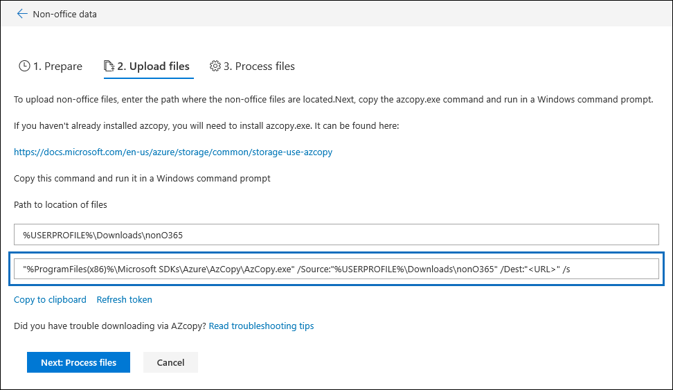

# Résolution des problèmes liés à AzCopy dans Advanced eDiscovery (aperçu)

Lors du chargement de données ou de documents autres que Office 365 pour la correction d'erreur dans Advanced eDiscovery (aperçu), l'interface utilisateur fournit une commande AzCopy Azure qui contient les paramètres de l'emplacement où les fichiers que vous souhaitez télécharger sont stockés et le dossier Azure emplacement de stockage vers lequel les fichiers seront téléchargés. Pour télécharger vos documents, copiez cette commande, puis exécutez-la dans une invite de commandes sur votre ordinateur local.  La capture d'écran suivante illustre un exemple de commande AzCopy:

Dans la plupart des cas, la commande fournie fonctionne lorsque vous l'exécutez. Toutefois, il peut arriver que la commande affichée ne s'exécute pas correctement. Voici quelques raisons possibles.

## AzCopy n'est pas installé sur l'ordinateur local ou il n'est pas installé à l'emplacement par défaut

Si AzCopy n'est pas installé ou s'il est installé à un emplacement autre que l'emplacement d'installation `%ProgramFiles(x86)%`par défaut (c'est-à-dire), il se peut que vous receviez le message d'erreur suivant lorsque vous exécutez la commande AzCopy:

    The system cannot find the path specified.

Si AzCopy n'est pas installé sur l'ordinateur local, vous pouvez procéder à l'installation à partir de là (en veillant à l' [https://docs.microsoft.com/azure/storage/common/storage-use-azcopy](https://docs.microsoft.com/azure/storage/common/storage-use-azcopy)installer à l'emplacement par défaut):.

Si AzCopy est installé, mais qu'il est installé à un emplacement différent de l'emplacement par défaut, vous pouvez copier la commande, la coller dans un fichier texte, puis modifier le chemin d'accès à l'emplacement où AzCopy est réellement installé. Par exemple, si Azcopy se trouve dans `%ProgramFiles%`, vous pouvez remplacer la première partie de la commande `%ProgramFiles(x86)%\Microsoft SDKs\Azure\AzCopy.exe` par. `%ProgramFiles%\Microsoft SDKs\Azure\AzCopy` Une fois que vous avez effectué cette modification, copiez-la à partir du fichier texte, puis exécutez-la dans une invite de commandes.

> [!TIP]
> Si AzCopy est installé à un emplacement autre que l'emplacement d'installation par défaut, envisagez de le désinstaller, puis de le réinstaller à l'emplacement par défaut. Cela vous permettra d'éviter ce problème à l'avenir.