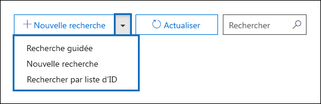
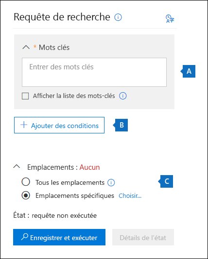
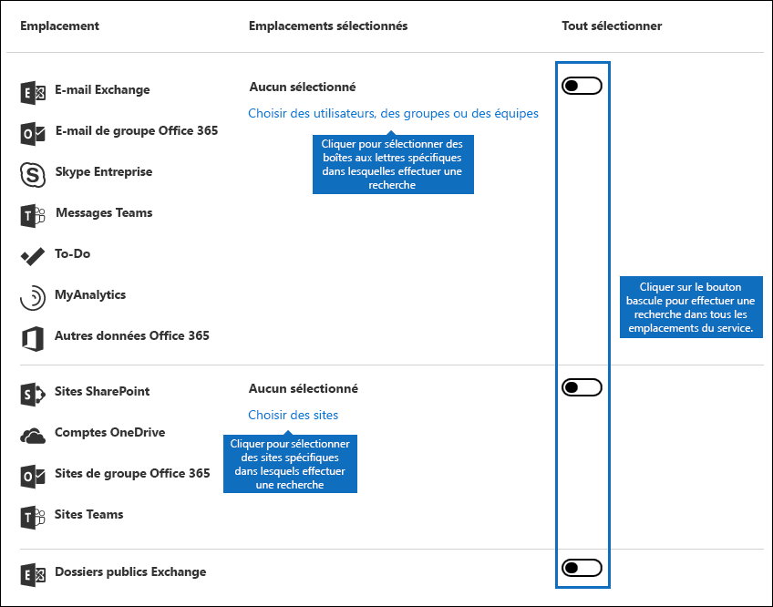
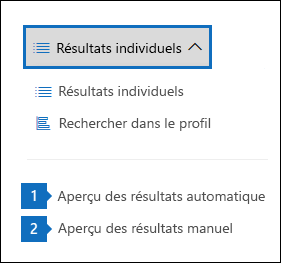
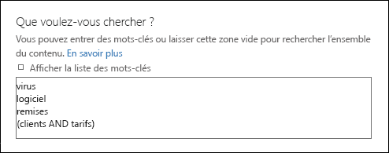
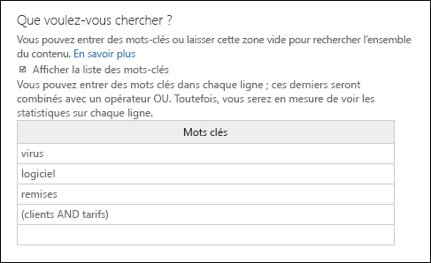
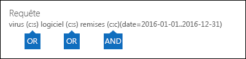
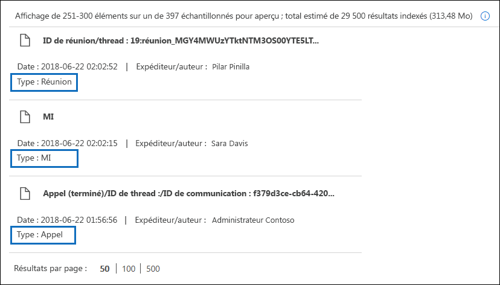
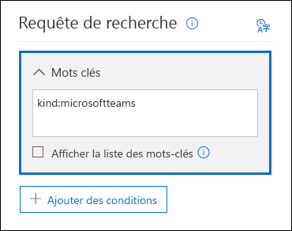
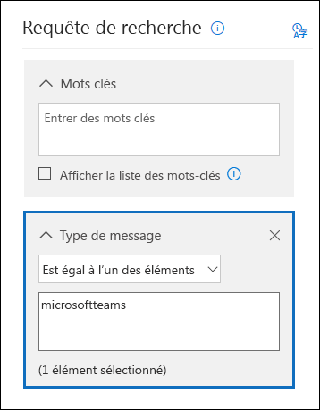

# <a name="content-search-in-office-365"></a>Recherche de contenu dans Office 365

Vous pouvez utiliser l'outil eDiscovery de recherche de contenu dans le centre &amp; de sécurité conformité Office 365 pour rechercher des éléments tels que des courriers électroniques, des documents et des conversations de messagerie instantanée dans votre organisation Office 365. Utilisez cet outil pour rechercher des éléments dans ces services Office 365:
  
- Boîtes aux lettres et dossiers publics Exchange Online
    
- Sites SharePoint Online et comptes OneDrive entreprise
    
- Conversations Skype entreprise
    
- Microsoft Teams 
    
- Groupes Office 365
    
Une fois que vous avez exécuté une recherche de contenu, le nombre d'emplacements de contenu et un nombre estimé de résultats de recherche sont affichés dans le profil de recherche. Vous pouvez également afficher rapidement des statistiques, telles que les emplacements de contenu qui contiennent le plus d'éléments qui correspondent à la requête de recherche. Après avoir exécuté une recherche, vous pouvez prévisualiser les résultats ou les exporter vers un ordinateur local.


## <a name="create-a-new-search"></a>Créer une recherche

Pour accéder à la page de **recherche de contenu** afin d'exécuter des recherches et d'afficher un aperçu et d'exporter les résultats de la recherche, un administrateur, un responsable de la mise en conformité ou un &amp; gestionnaire eDiscovery doit être membre du groupe de rôles gestionnaire eDiscovery dans le centre de sécurité conformité. Pour plus d'informations, consultez [la rubrique attribution d'autorisations eDiscovery dans &amp; le centre de sécurité conformité Office 365](assign-ediscovery-permissions.md).
  
1. Accédez à [https://protection.office.com](https://protection.office.com).
    
2. Connectez-vous à l'aide de votre adresse de messagerie et de votre mot de passe Office 365. 
    
3. Dans le centre &amp; de sécurité conformité, cliquez sur recherche de \> **contenu**d' **enquête de recherche &amp; ** .
    
4. Sur la page **recherche** , cliquez sur la flèche en  ajouter une icône **nouvelle recherche**. 
    
    
  
    Vous pouvez choisir l’une des options suivantes :
    
  - **Recherche guidée** -cette option démarre un assistant qui vous guide tout au long de la procédure de création de la recherche. L'interface utilisateur permettant de sélectionner des emplacements de contenu et de créer la requête de recherche est identique à la nouvelle option de **recherche** . 
    
  - **Nouvelle recherche** : cette option affiche une interface utilisateur mise à jour pour créer une recherche. Il s'agit de l'option par défaut si vous cliquez sur **nouvelle recherche**.
    
  - **Recherche par liste d'ID** : cette option vous permet de rechercher des messages électroniques spécifiques et d'autres éléments de boîte aux lettres à l'aide d'une liste d'ID Exchange. Pour créer une recherche de liste d'ID (anciennement appelée recherche ciblée), vous devez soumettre un fichier de valeurs séparées par des virgules (CSV) qui identifie les éléments de boîte aux lettres spécifiques à rechercher. Pour obtenir des instructions, voir [préparer un fichier CSV pour une recherche de contenu de liste d'ID dans Office 365](csv-file-for-an-id-list-content-search.md).
    
    Le reste des étapes de cette procédure suivra le nouveau flux de travail de recherche par défaut.
    
5. Cliquez sur **nouvelle recherche** dans la liste déroulante. 
    
6. Sous **requête de recherche**, spécifiez les éléments suivants.
    
    
  
- **Mots clés de recherche** : tapez une requête de recherche dans la zone **Mots clés** . Vous pouvez spécifier des mots clés, des propriétés de message, telles que des dates d'envoi et de réception, ou des propriétés de document, telles que des noms de fichiers ou la date de la dernière modification d'un document. Vous pouvez utiliser des requêtes plus complexes qui utilisent un opérateur booléen, comme **and**, **or**, **not**et **near**. Vous pouvez également rechercher des informations sensibles (telles que des numéros de sécurité sociale) dans des documents ou Rechercher des documents qui ont été partagés en externe. Si vous laissez la zone mot clé vide, tout le contenu situé dans les emplacements de contenu spécifiés sera inclus dans les résultats de la recherche.
    
    Vous pouvez également cliquer sur la case à cocher **afficher la liste de mots clés** et sur tapez un mot clé dans chaque ligne. Dans ce cas, les mots clés de chaque ligne sont connectés par un opérateur logique ( **c:s**) qui est similaire à la fonctionnalité de l'opérateur **or** de la requête de recherche créée. 
    
    Pourquoi utiliser la liste de mots clés? Vous pouvez obtenir des statistiques qui indiquent le nombre d'éléments qui correspondent à chaque mot clé. Cela peut vous aider à identifier rapidement les mots clés les plus efficaces (et les moins). Vous pouvez également utiliser une phrase de mots clés (entourée de parenthèses) dans une ligne. Pour plus d'informations sur les statistiques de recherche, voir [afficher les statistiques sur les mots clés pour les résultats de la recherche de contenu](view-keyword-statistics-for-content-search.md).

    [!NOTE] Pour réduire les problèmes causés par des listes de mots clés volumineuses, vous êtes désormais limité à un maximum de 20 lignes dans la liste de mots clés.
    
- **Conditions** : vous pouvez ajouter des conditions de recherche pour affiner une recherche et renvoyer un ensemble de résultats plus raffiné. Chaque condition ajoute une clause à la requête de recherche créée et exécutée lors du démarrage de la recherche. Une condition est logiquement liée à la requête de mot-clé (spécifiée dans la zone de mot clé) par un opérateur logique ( **c:c**) qui est similaire à la fonctionnalité de l'opérateur **and** . Cela signifie que les éléments doivent répondre à la fois à la requête de mot clé et à une ou plusieurs conditions à inclure dans les résultats. Voici comment les conditions vous aident à affiner vos résultats. Pour obtenir la liste et la description des conditions que vous pouvez utiliser dans une requête de recherche, consultez la section «conditions de recherche» dans [requêtes de mots clés et conditions de recherche pour la recherche de contenu](keyword-queries-and-search-conditions.md#search-conditions).
    
- **Locations** : choisissez les emplacements de contenu à rechercher.
    
  - **Tous les emplacements** : utilisez cette option pour rechercher tous les emplacements de contenu de votre organisation. Cela inclut le courrier électronique dans toutes les boîtes aux lettres Exchange (y compris toutes les boîtes aux lettres inactives, toutes les boîtes aux lettres pour tous les groupes Office 365, toutes les boîtes aux lettres pour toutes les équipes Microsoft Teams), toutes les conversations Skype entreprise, tous les sites SharePoint et OneDrive entreprise (y compris les sites pour tous les groupes Office 365 et Microsoft Teams) et les éléments de tous les dossiers publics Exchange.
    
  - **Emplacements spécifiques** : utilisez cette option pour rechercher des emplacements de contenu spécifiques. Vous pouvez rechercher tous les emplacements de contenu pour un service Office 365 spécifique (par exemple, la recherche dans toutes les boîtes aux lettres Exchange ou la recherche sur tous les sites SharePoint) ou vous pouvez rechercher des emplacements spécifiques dans n'importe quel service 365 Office affiché. 
    
    
  
    Notez que vous pouvez également ajouter des groupes de distribution à la liste des boîtes aux lettres Exchange à rechercher. Pour les groupes de distribution, les boîtes aux lettres des membres du groupe sont recherchées. Notez que les groupes de distribution dynamique ne sont pas pris en charge.
    
    **Important:** Lorsque vous recherchez tous les emplacements de boîte aux lettres ou seulement des boîtes aux lettres spécifiques, des données de MyAnalytics et d'autres applications Office 365 enregistrées dans des boîtes aux lettres utilisateur sont incluses lorsque vous exportez les résultats d'une recherche de contenu. Ces données ne seront pas incluses dans les résultats de recherche estimés et ne seront pas disponibles pour l'aperçu. Elle sera incluse uniquement lorsque vous exporterez et téléchargerez les résultats de la recherche; consultez la rubrique [exportation de données à partir d'MyAnalytics et d'autres applications Office 365](#exporting-data-from-myanalytics-and-other-office-365-applications) dans la section «plus d'informations sur la recherche de contenu». 
    
7. Une fois que vous avez configuré votre requête de recherche, cliquez sur **Enregistrer &amp; **.
    
8. Sur la page **enregistrer la recherche** , tapez le nom de la recherche, ainsi qu'une description facultative qui permet d'identifier la recherche. Notez que le nom de la recherche doit être unique dans votre organisation. 
    
9. Cliquez sur **Enregistrer** pour démarrer la recherche. 
    
    Une fois que vous avez enregistré et exécuté la recherche, tous les résultats renvoyés par la recherche sont affichés dans le volet résultats. En fonction de la configuration du paramètre aperçu configuré, les résultats de la recherche sont affichés ou vous devez cliquer sur afficher **un aperçu des résultats** pour les afficher. Pour plus d'informations, consultez la section suivante. 
    
Pour accéder à de nouveau à cette recherche de contenu ou accéder aux autres recherches de contenu indiquées dans la page **recherche de contenu** , sélectionnez la recherche, puis cliquez sur **ouvrir**. 
  
Pour effacer les résultats ou créer une recherche, cliquez sur  icône **nouvelle recherche**. 

  
## <a name="preview-search-results"></a>Aperçu des résultats de la recherche

Il existe deux paramètres de configuration pour afficher un aperçu des résultats de la recherche. Après avoir exécuté une nouvelle recherche ou ouvert une recherche existante, cliquez sur * * résultats individuels * * pour afficher les paramètres d'aperçu suivants: 
  

  
1. **Aperçu automatique des résultats** : ce paramètre affiche les résultats de la recherche après exécution d'une recherche.
    
2. **Aperçu des résultats manuellement** : ce paramètre affiche les espaces réservés dans le volet des résultats de la recherche et affiche le bouton **aperçu des résultats** sur lequel vous devez cliquer pour afficher les résultats de la recherche. Il s'agit du paramètre par défaut; Cela permet d'améliorer les performances de recherche en ne affichant pas automatiquement les résultats de la recherche lorsque vous ouvrez une recherche existante. 
    
Il existe des limites liées au nombre d'éléments disponibles pour être prévisualisés. Pour plus d'informations, consultez [la rubrique Limits for Search in &amp; the Office 365 Security Compliance Center](limits-for-content-search.md). 
  
Pour obtenir la liste des types de fichiers pris en charge pouvant être prévisualisés, consultez [aperçu des résultats de recherche](#previewing-search-results) dans la section «plus d'informations sur la recherche de contenu». Si un type de fichier n'est pas pris en charge pour l'aperçu ou pour télécharger une copie d'un document, vous pouvez cliquer sur **Télécharger le fichier d'origine** pour le télécharger sur votre ordinateur local. Pour les pages Web. aspx, l'URL de la page est incluse si vous ne disposez pas des autorisations nécessaires pour accéder à la page. 
  
Notez également que les éléments non indexés ne sont pas disponibles pour l'aperçu.
  
## <a name="view-information-and-statistics-about-a-search"></a>Afficher des informations et des statistiques sur une recherche

Une fois que vous avez créé et exécuté une recherche de contenu, vous pouvez afficher des statistiques sur les résultats de recherche estimés. Cela inclut un résumé des résultats de la recherche, les statistiques de requête telles que le nombre d'emplacements de contenu avec des éléments qui correspondent à la requête de recherche et le nom des emplacements de contenu qui ont le plus grand nombre d'éléments correspondants. Vous pouvez afficher des statistiques pour une ou plusieurs recherches de contenu. Cela vous permet de comparer rapidement les résultats de plusieurs recherches et de prendre des décisions sur l'efficacité de vos requêtes de recherche.
  
Vous pouvez également télécharger les statistiques de recherche et les statistiques sur les mots clés dans un fichier CSV. Cela vous permet d'utiliser les fonctionnalités de filtrage et de tri dans Excel pour comparer les résultats et préparer des rapports pour les résultats de la recherche.
  
Pour afficher les statistiques de recherche:
  
1. Sur la page **recherche de contenu** dans le &amp; Centre de sécurité conformité, cliquez sur **ouvrir** , puis sur la recherche pour laquelle vous souhaitez afficher les statistiques. 
    
2. Sur la page vers la sortie, cliquez sur **ouvrir une requête**. 
    
3. Dans la liste déroulante **résultats individuels** , cliquez sur **profil de recherche**.
    
4. Dans la liste déroulante **type** , cliquez sur l'une des options suivantes en fonction des statistiques de recherche que vous souhaitez afficher. 
    
  - **Résumé** : affiche les statistiques de chaque type d'emplacement de contenu recherché. Ce contenu nombre d'emplacements de contenu contenant des éléments qui correspondent à la requête de recherche, ainsi que le nombre total et la taille des éléments de résultats de recherche. Il s'agit du paramètre par défaut.
    
  - **Requêtes** : affiche les statistiques relatives à la requête de recherche. Cela inclut le type d'emplacement de contenu auquel s'appliquent les statistiques de requête, qui font partie de la requête de recherche à laquelle les statistiques sont applicables (Notez que **Primary** indique l'ensemble de la requête de recherche), le nombre d'emplacements de contenu contenant des éléments qui correspond à la requête de recherche, au nombre total et à la taille, ainsi qu'aux éléments trouvés (dans l'emplacement de contenu spécifié) qui correspondent à la requête de recherche. Notez que les statistiques pour les éléments non indexés (également appelés éléments partiellement indexés) sont également affichées. Toutefois, seuls les éléments partiellement indexés des boîtes aux lettres sont inclus dans les statistiques. Les éléments partiellement indexés à partir de SharePoint et OneDrive ne sont pas inclus dans les statistiques.
    
  - **Principaux emplacements** : affiche des statistiques sur le nombre d'éléments qui correspondent à la requête de recherche dans chaque emplacement de contenu recherché. Les 1 000 premiers emplacements sont affichés.
    
Pour plus d'informations sur les statistiques de recherche, voir [View Keyword Statistics for Content Search Results](view-keyword-statistics-for-content-search.md).
  
  
## <a name="export-search-results"></a>Exporter les résultats de la recherche

Une fois que la recherche est exécutée correctement, vous pouvez exporter les résultats de la recherche vers un ordinateur local. Lorsque vous exportez les résultats de la messagerie, ceux-ci peuvent être téléchargés sur votre ordinateur en tant que fichiers PST ou en tant que messages individuels (fichiers. MSG). Lorsque vous exportez du contenu à partir de sites SharePoint et OneDrive, les copies des documents Office natifs sont exportées. Des documents et des rapports supplémentaires sont également inclus dans les résultats de recherche exportés. Vous pouvez également exporter simplement le rapport des résultats de la recherche et non les éléments réels.
  
Pour exporter les résultats de la recherche:
  
1. Sur la page **recherche de contenu** dans le &amp; Centre de sécurité conformité, cliquez sur **ouvrir** , puis sur la recherche pour laquelle vous souhaitez exporter les résultats de la recherche. 
    
2. Sur la page vers la sortie,  résultats de recherche **plus en plus**, puis cliquez sur **Exporter les résultats**. Notez que vous pouvez également exporter un rapport de résultats de recherche.
    
3. Complétez les sections sur la page volante **Exporter les résultats**. Veillez à utiliser la barre de défilement pour afficher toutes les options d’exportation. 
    
Pour obtenir des instructions et des conseils de dépannage plus détaillés, voir:
  
- [Exporter les résultats de la recherche à partir &amp; du centre de sécurité conformité Office 365](export-search-results.md)
    
- [Exporter un rapport de recherche de contenu](export-a-content-search-report.md)
    

  
## <a name="more-information-about-content-search"></a>Plus d'informations sur la recherche de contenu

Consultez les sections suivantes pour plus d'informations sur les recherches de contenu.
  
[Limites de la recherche de contenu](#content-search-limits)
  
[Création d'une requête de recherche](#building-a-search-query)
  
[Recherche de comptes OneDrive](#searching-onedrive-accounts)
  
[Recherche de groupes Microsoft teams et Office 365](#searching-microsoft-teams-and-office-365-groups)
  
[Recherche de boîtes aux lettres inactives](#searching-inactive-mailboxes)
  
[Aperçu des résultats de la recherche](#previewing-search-results)
  
[Éléments partiellement indexés](#partially-indexed-items)
  
[Exportation de données à partir d'MyAnalytics et d'autres applications Office 365](#exporting-data-from-myanalytics-and-other-office-365-applications)
  
### <a name="content-search-limits"></a>Limites de la recherche de contenu

- Pour obtenir une description des limites appliquées à la fonctionnalité de recherche de contenu, reportez-vous à la rubrique [Limits for Search in the Office 365 Security &amp; Compliance Center](limits-for-content-search.md).
    
- Microsoft collecte des informations sur les performances des recherches de contenu exécutées par toutes les organisations Office 365. Bien que la complexité de la requête de recherche puisse avoir un impact sur les temps de recherche, le facteur le plus important qui affecte la durée de recherche est le nombre de boîtes aux lettres recherchées. Bien que Microsoft ne fournisse pas de contrat de niveau de service pour les temps de recherche, le tableau suivant répertorie les temps de recherche moyens pour une recherche de contenu sur la base du nombre de boîtes aux lettres incluses dans la recherche.
    
|**Nombre de boîtes aux lettres**|**Durée moyenne de recherche**|
|:-----|:-----|
|100  <br/> |30 secondes  <br/> |
|1,000  <br/> |45 secondes  <br/> |
|10 000  <br/> |4 minutes  <br/> |
|25 000  <br/> |10 minutes  <br/> |
|50 000  <br/> |20 minutes  <br/> |
|100 000  <br/> |25 minutes  <br/> |
  
### <a name="building-a-search-query"></a>Création d'une requête de recherche

Pour obtenir des informations détaillées sur la création d'une requête de recherche, l'utilisation d'opérateurs de recherche booléens et de conditions de recherche et la recherche de types d'informations sensibles et de contenu partagé avec des utilisateurs externes à votre organisation, consultez la rubrique [requêtes par Mots clés et conditions de recherche pour la recherche de contenu ](keyword-queries-and-search-conditions.md).
  
Gardez les points suivants à l'esprit lors de l'utilisation de la liste de mots clés pour créer une requête de recherche.
  
- Vous devez activer la case à cocher **afficher la liste des mots** clés, puis taper chaque mot clé dans une ligne distincte pour créer une requête de recherche où les mots clés (ou les expressions de mots clés) de chaque ligne sont reliés par l'opérateur **ou** . Si vous collez simplement une liste de mots clés dans la zone de mot clé ou si vous appuyez sur la touche **entrée** après avoir tapé un mot clé, ils ne seront pas reliés par l'opérateur **or** . Voici un exemple incorrect et approprié pour l'ajout d'une liste de mots clés. 
    
    **Inapproprié**
    
    
  
    **Rectification**
    
    
  
- Vous pouvez également préparer une liste de mots clés ou d'expressions de mots clés dans un fichier Excel ou un fichier de texte brut, puis copier et coller votre liste dans la liste des mots clés. Pour ce faire, vous devez activer la case à cocher **afficher la liste de mots clés** . Ensuite, cliquez sur la première ligne de la liste de mots clés et collez votre liste. Chaque ligne du fichier Excel ou texte est collée sur une ligne distincte dans la liste de mots clés. 
    
- Une fois que vous avez créé une requête à l'aide de la liste de mots clés, il est judicieux de vérifier la syntaxe de requête de recherche pour faire en sorte que la requête de recherche soit celle que vous souhaitiez. Dans la requête de recherche affichée sous **requête** dans le volet d'informations, les mots clés sont séparés par du texte **(c:s)**. cela indique que les mots-clés sont connectés par un opérateur logique semblable à la fonctionnalité à l'opérateur **or** . De même, si votre requête de recherche inclut des conditions, les mots clés et les conditions sont séparés par le texte **(c:c)**. cela indique que les mots clés sont connectés aux conditions avec un opérateur logique similaire à la fonctionnalité de **et** is. Voici un exemple de la requête de recherche (affichée dans le volet d'informations) résultant de l'utilisation de la liste de mots clés et d'une condition. 
    
    
  
- Lorsque vous exécutez une recherche de contenu, Office 365 vérifie automatiquement si votre requête de recherche comporte des caractères non pris en charge et des opérateurs booléens qui ne peuvent pas être capitalisés. Les caractères non pris en charge sont souvent masqués et provoquent généralement une erreur de recherche ou renvoient des résultats inattendus. Pour plus d'informations sur les caractères non pris en charge qui sont vérifiés, consultez la rubrique [vérifier votre requête de recherche de contenu pour les erreurs](check-your-content-search-query-for-errors.md).
    
- Si vous avez une requête de recherche qui contient des mots clés pour des caractères non anglais (tels que des caractères chinois), vous pouvez cliquer sur l'icône langue de requête **-pays/** /région dans recherche de contenu et sélectionner un langue-valeur de code de culture de pays pour la recherche. Notez que la langue/région par défaut est neutre. Comment savoir si vous devez modifier le paramètre de langue pour une recherche de contenu? Si vous êtes certain que des emplacements de contenu contiennent des caractères non anglais que vous recherchez, mais que la recherche ne renvoie aucun résultat, le paramètre de langue peut en être la cause. 
  
### <a name="searching-onedrive-accounts"></a>Recherche de comptes OneDrive

- Pour collecter une liste des URL pour les sites OneDrive de votre organisation, reportez-vous à la rubrique [créer une liste de tous les emplacements onedrive de votre organisation](https://support.office.com/article/8e200cb2-c768-49cb-88ec-53493e8ad80a). Ce script dans cet article crée un fichier texte qui contient une liste de tous les sites OneDrive. Pour exécuter ce script, vous devez installer et utiliser SharePoint Online Management Shell. Veillez à ajouter l'URL du domaine mon site de votre organisation à chaque site OneDrive que vous souhaitez rechercher. Il s'agit du domaine qui contient tous vos OneDrive; par exemple, `https://contoso-my.sharepoint.com`. Voici un exemple d'URL pour le site OneDrive d'un utilisateur: `https://contoso-my.sharepoint.com/personal/sarad_contoso_onmicrosoft.com`.
    
    Dans les rares cas où le nom d'utilisateur principal (UPN) d'une personne est modifié, l'URL de son emplacement OneDrive est également modifiée pour intégrer le nouvel UPN. Dans ce cas, vous devrez modifier une recherche de contenu en ajoutant la nouvelle URL OneDrive de l'utilisateur et en supprimant l'ancienne.
  
### <a name="searching-microsoft-teams-and-office-365-groups"></a>Recherche de groupes Microsoft teams et Office 365

Vous pouvez effectuer une recherche dans la boîte aux lettres associée à un groupe Office 365 ou une équipe Microsoft. Étant donné que Microsoft teams est basé sur les groupes Office 365, les recherches sont très similaires. Dans les deux cas, seule la boîte aux lettres de groupe ou d'équipe est recherchée; les boîtes aux lettres du groupe ou des membres de l'équipe ne sont pas recherchées. Pour les Rechercher, vous devez les ajouter spécifiquement à la recherche.
  
Gardez les points suivants à l'esprit lors de la recherche de contenu dans les groupes Microsoft teams et Office 365.
  
- Pour rechercher du contenu se trouvant dans des groupes Microsoft teams et Office 365, vous devez spécifier la boîte aux lettres et le site SharePoint qui sont associés à une équipe ou un groupe.
    
- Exécutez la cmdlet **Get-UnifiedGroup** dans Exchange Online pour afficher les propriétés d'une équipe Microsoft ou d'un groupe Office 365. Il s'agit d'un moyen efficace pour obtenir l'URL du site associé à une équipe ou à un groupe. Par exemple, la commande suivante affiche les propriétés sélectionnées pour un groupe Office 365 nommé équipe leadership senior: 
    
  ```
  Get-UnifiedGroup "Senior Leadership Team" | FL DisplayName,Alias,PrimarySmtpAddress,SharePointSiteUrl
  DisplayName            : Senior Leadership Team
  Alias                  : seniorleadershipteam
  PrimarySmtpAddress     : seniorleadershipteam@contoso.onmicrosoft.com
  SharePointSiteUrl      : https://contoso.sharepoint.com/sites/seniorleadershipteam
  
  ```

    > [!NOTE]
    > Pour exécuter la cmdlet **Get-UnifiedGroup** , vous devez disposer du rôle destinataires en affichage seul dans Exchange Online ou être membre d'un groupe de rôles auquel est affecté le rôle destinataires en affichage seul. 
  
- Lors de la recherche dans la boîte aux lettres d'un utilisateur, un groupe Microsoft Team ou Office 365 dont l'utilisateur est membre ne sera pas recherché. De même, lorsque vous effectuez une recherche dans une équipe Microsoft ou un groupe Office 365, seule la boîte aux lettres de groupe et le site de groupe que vous spécifiez sont recherchés; les boîtes aux lettres et les comptes OneDrive entreprise des membres du groupe ne sont pas recherchés sauf si vous les ajoutez explicitement à la recherche.
    
- Pour obtenir la liste des membres d'une équipe Microsoft ou d'un groupe Office 365, vous pouvez afficher les propriétés sur la **page \> groupes d'accueil** dans le centre d'administration Office 365. Vous pouvez également exécuter la commande suivante dans Exchange Online PowerShell: 
    
  ```
  Get-UnifiedGroupLinks <group or team name> -LinkType Members | FL DisplayName,PrimarySmtpAddress 
  ```

    > [!NOTE]
    > Pour exécuter la cmdlet **Get-UnifiedGroupLinks** , vous devez disposer du rôle destinataires en affichage seul dans Exchange Online ou être membre d'un groupe de rôles auquel est affecté le rôle destinataires en affichage seul. 
  
- Les conversations qui font partie d'un canal Microsoft teams sont stockées dans la boîte aux lettres associée à l'équipe Microsoft. De même, les fichiers que les membres de l'équipe partagent dans un canal sont stockés sur le site SharePoint de l'équipe. Par conséquent, vous devez ajouter la boîte aux lettres d'équipe et le site SharePoint de Microsoft comme emplacement de contenu pour rechercher des conversations et des fichiers dans un canal.
    
- En guise d'alternative, les conversations qui font partie de la liste de conversation de Microsoft teams sont stockées dans la boîte aux lettres Exchange Online des utilisateurs qui participent à la conversation. Et les fichiers qu'un utilisateur partage dans les conversations de conversation sont stockés dans le compte OneDrive entreprise de l'utilisateur qui partage le fichier. Par conséquent, vous devez ajouter les boîtes aux lettres des utilisateurs individuels et les comptes OneDrive entreprise en tant qu'emplacements de contenu pour rechercher des conversations et des fichiers dans la liste des conversations.
    
    > [!NOTE]
    > Dans un déploiement hybride Exchange, les utilisateurs disposant d'une boîte aux lettres locale peuvent participer à des conversations qui font partie de la liste des conversations de Microsoft Teams. Dans ce cas, le contenu de ces conversations est également consultable, car il est enregistré dans une zone de stockage informatique (appelée *boîte aux lettres en nuage pour les utilisateurs locaux*) pour les utilisateurs qui disposent d'une boîte aux lettres locale. Pour plus d'informations, reportez-vous à la rubrique [recherche de boîtes aux lettres en nuage pour les utilisateurs locaux dans Office 365](search-cloud-based-mailboxes-for-on-premises-users.md).
  
- Chaque canal d'équipe ou d'équipe Microsoft contient un wiki pour la prise de notes et la collaboration. Le contenu wiki est automatiquement enregistré dans un fichier au format. mht. Ce fichier est stocké dans la bibliothèque de documents de données wiki teams sur le site SharePoint de l'équipe. Vous pouvez utiliser l'outil de recherche de contenu pour effectuer des recherches dans le wiki en spécifiant le site SharePoint de l'équipe comme emplacement de contenu à rechercher. 
    
    > [!NOTE]
    > La possibilité de rechercher un wiki pour une équipe ou un canal Microsoft (lors de la recherche sur le site SharePoint de l'équipe) a été publiée le 22 juin 2017. Les pages wiki qui ont été enregistrées ou mises à jour à cette date ou après sont disponibles pour être recherchées. Les pages de wiki enregistrées ou mises à jour avant cette date ne sont pas disponibles pour la recherche. 
 
- Les informations de synthèse pour les réunions et les appels dans un canal Microsoft teams sont également stockées dans les boîtes aux lettres des utilisateurs qui composent la réunion ou l'appel. Cela signifie que vous pouvez utiliser la recherche de contenu pour rechercher ces enregistrements de synthèse. Les informations récapitulatives comprennent: 
  - Date, heure de début, heure de fin et durée d'une réunion ou d'un appel

  - Date et heure auxquelles chaque participant a rejoint ou a quitté la réunion ou l'appel

  - Appels envoyés à la messagerie vocale

  - Appels manqués ou sans réponse

  - Transferts d'appels, représentés par deux appels distincts

  Notez qu'il peut falloir jusqu'à 8 heures pour que les enregistrements de synthèse des réunions et des appels soient disponibles pour être recherchés.

  Dans les résultats de la recherche, les résumés de réunion sont identifiés comme étant des **réunions** dans le **champ type**; les résumés des appels sont identifiés en tant qu' **appel**. De plus, les conversations qui font partie d'un canal teams et de conversations 1xN sont identifiées en tant que **messages instantanés** dans le champ **type** .
  
  

- Vous pouvez utiliser la propriété **Kind** email ou la condition de recherche **message Kind** pour rechercher spécifiquement du contenu dans Microsoft Teams. 
  - Pour utiliser la propriété **Kind** dans le cadre de la requête de recherche par mot clé, dans la zone **Mots clés** d' `kind:microsoftteams`une requête de recherche, tapez.

    
  
  - Pour utiliser une condition de recherche, ajoutez la condition **type de message** et utilisez `microsoftteams`la valeur. 

    

Notez que les conditions sont logiquement connectées à la requête par mot clé par l'opérateur **and** . Cela signifie qu'un élément doit correspondre à la fois à la requête de mot clé et à la condition de recherche à renvoyer dans les résultats de la recherche. Pour plus d'informations, reportez-vous à la section «Instructions pour l'utilisation de conditions» dans [requêtes de mots clés et conditions de recherche pour la recherche de contenu.](keyword-queries-and-search-conditions.md#guidelines-for-using-conditions)

  
### <a name="searching-inactive-mailboxes"></a>Recherche de boîtes aux lettres inactives

Vous pouvez rechercher des boîtes aux lettres inactives dans une recherche de contenu. Pour obtenir la liste des boîtes aux lettres inactives dans votre organisation, exécutez la `Get-Mailbox -InactiveMailboxOnly` commande dans Exchange Online PowerShell. Vous pouvez également accéder à la rétention de **gouvernance** \> **** des données &amp; dans le centre de sécurité conformité, puis cliquer sur **autres** \> de barre de navigation pour les **boîtes aux lettres**inactives.
  
Voici quelques éléments à garder à l'esprit lors de la recherche de boîtes aux lettres inactives.
  
- Si une recherche de contenu inclut une boîte aux lettres utilisateur et que celle-ci est devenue inactive, la recherche de contenu continue à rechercher dans la boîte aux lettres inactive lorsque vous relancez la recherche après qu'elle a été inactive.
    
- Dans certains cas, un utilisateur peut avoir une boîte aux lettres active et une boîte aux lettres inactive possédant la même adresse SMTP. Dans ce cas, seule la boîte aux lettres spécifique que vous sélectionnez comme emplacement pour une recherche de contenu fera l'objet d'une recherche. En d'autres termes, si vous ajoutez la boîte aux lettres d'un utilisateur à une recherche, vous ne pouvez pas supposer que leurs boîtes aux lettres actives et inactives seront recherchées; seule la boîte aux lettres que vous ajoutez explicitement à la recherche sera recherchée.
    
- Nous vous recommandons vivement d'éviter d'avoir une boîte aux lettres active et une boîte aux lettres inactive avec la même adresse SMTP. Si vous devez réutiliser l'adresse SMTP actuellement attribuée à une boîte aux lettres inactive, nous vous recommandons de récupérer la boîte aux lettres inactive ou de restaurer le contenu d'une boîte aux lettres inactive vers une boîte aux lettres active (ou l'archive d'une boîte aux lettres active), puis de supprimer le boîte aux lettres inactive. Pour plus d'informations, consultez l'une des rubriques suivantes:
    
  - [Récupérer une boîte aux lettres inactive dans Office 365](recover-an-inactive-mailbox.md)
    
  - [Restaurer une boîte aux lettres inactive dans Office 365](restore-an-inactive-mailbox.md)
    
  - [Supprimer une boîte aux lettres inactive dans Office 365](delete-an-inactive-mailbox.md)

  
### <a name="previewing-search-results"></a>Aperçu des résultats de la recherche

Vous pouvez afficher un aperçu des types de fichiers pris en charge dans le volet de visualisation. Si un type de fichier n'est pas pris en charge, vous devez télécharger une copie du fichier sur votre ordinateur local pour l'afficher. Les types de fichiers suivants sont pris en charge et peuvent être prévisualisés dans le volet des résultats de la recherche.
  
- . txt,. html,. mhtml
    
- . eml
    
- . doc,. docx,. docm
    
- . pptm,. pptx
    
- .pdf
    
En outre, les types de conteneurs de fichiers suivants sont pris en charge. Vous pouvez afficher la liste des fichiers dans le conteneur dans le volet de visualisation.
  
- .zip
    
- . gzip
    
### <a name="partially-indexed-items"></a>Éléments partiellement indexés

- Comme expliqué précédemment, les éléments partiellement indexés dans les boîtes aux lettres sont inclus dans les résultats de recherche estimés; les éléments partiellement indexés à partir de SharePoint et OneDrive ne sont pas inclus dans les résultats de recherche estimés. 
    
- Si un élément partiel correspond à la requête de recherche (étant donné que les autres propriétés du message ou du document répondent aux critères de recherche), il ne sera pas inclus dans la estimation du nombre d'éléments non indexés. Si un élément partiellement est exclu par les critères de recherche, il n'est pas inclus dans le nombre estimé d'éléments partiellement indexés. Pour plus d'informations, consultez la rubrique [éléments partiellement indexés dans la recherche de contenu dans Office 365](partially-indexed-items-in-content-search.md).
    
### <a name="exporting-data-from-myanalytics-and-other-office-365-applications"></a>Exportation de données à partir d'MyAnalytics et d'autres applications Office 365

- Les données de MyAnalytics (telles que les informations sur la façon dont les utilisateurs consacrent leur temps en fonction des données de messagerie et de calendrier dans leur boîte aux lettres) et les données d'autres applications Office 365 sont enregistrées dans un emplacement masqué (dans une sous-arborescence non-IPM) dans la boîte aux lettres en nuage de l'utilisateur. Une fois que vous avez exécuté une recherche de contenu, ces données ne sont pas incluses dans les résultats de recherche estimés, les statistiques de requête et il n'est pas disponible pour l'aperçu. Toutefois, ces données seront exportées lorsque vous exporterez les résultats d'une recherche.
    
- Les données MyAnalytics et les données d'autres applications Office 365 sont exportées dans un dossier nommé «autres données Office 365». Ce dossier inclut des sous-dossiers pour chaque utilisateur.
  
