# <a name="create-a-custom-sensitive-information-type-in-security--compliance-center-powershell"></a><span data-ttu-id="3b347-103">Créer un type d’informations sensibles personnalisé dans l’interface PowerShell du Centre de sécurité et conformité</span><span class="sxs-lookup"><span data-stu-id="3b347-103">Create a custom sensitive information type in Office 365 Security & Compliance Center PowerShell</span></span>

<span data-ttu-id="3b347-p101">La protection contre la perte de données (DLP) dans Office 365 inclut de nombreux [types d’informations sensibles](what-the-sensitive-information-types-look-for.md) intégrés qui sont prêts à l’emploi dans vos stratégies DLP. Ces types intégrés permettent d’identifier et de protéger les numéros de carte de crédit, les numéros de compte bancaire, les numéros de passeport, et bien plus encore.</span><span class="sxs-lookup"><span data-stu-id="3b347-p101">Data loss prevention (DLP) in Office 365 includes many built-in [sensitive information types](what-the-sensitive-information-types-look-for.md) that are ready for you to use in your DLP policies. These built-in types can help identify and protect credit card numbers, bank account numbers, passport numbers, and more.</span></span> 
  
<span data-ttu-id="3b347-p102">Cependant, si vous devez identifier et protéger un autre type d’informations sensibles (par exemple, l’ID d’un employé qui utilise un format spécifique de votre organisation), vous pouvez créer un type personnalisé d’informations sensibles. Un type d’informations sensibles est défini dans un fichier XML appelé _package de règles_.</span><span class="sxs-lookup"><span data-stu-id="3b347-p102">But if you need to identify and protect a different type of sensitive information (for example, an employee ID that uses a format specific to your organization) you can create a custom sensitive information type. A sensitive information type is defined in an XML file called a _rule package_.</span></span>
  
<span data-ttu-id="3b347-p103">Cette rubrique vous explique comment créer un fichier XML qui définit votre propre type d’informations sensibles personnalisé. Vous devez savoir comment créer une expression régulière. Par exemple, cette rubrique permet de créer un type d’informations sensibles personnalisé qui identifie un ID d’employé. Vous pouvez utiliser cet exemple de code XML comme point de départ pour votre propre fichier XML.</span><span class="sxs-lookup"><span data-stu-id="3b347-p103">This topic shows you how to create an XML file that defines your own custom sensitive information type. You need to know how to create a regular expression. As an example, this topic creates a custom sensitive information type that identifies an employee ID. You can use this example XML as a starting point for your own XML file.</span></span>
  
<span data-ttu-id="3b347-p104">Après avoir créé un fichier XML correct, vous pouvez le charger sur Office 365 à l’aide de Office 365 PowerShell. Ensuite, vous êtes prêt à utiliser votre type d’informations sensibles personnalisé dans vos stratégies DLP et à vérifier qu’il détecte bien les informations sensibles comme prévu.</span><span class="sxs-lookup"><span data-stu-id="3b347-p104">After you've created a well-formed XML file, you can upload it to Office 365 by using Office 365 PowerShell. Then you're ready to use your custom sensitive information type in your DLP policies and test that it's detecting the sensitive information as you intended.</span></span>

> [!NOTE]
> <span data-ttu-id="3b347-p105">Vous pouvez également créer des types d’informations sensibles personnalisés moins complexes dans le Centre de Conformité de  l’interface utilisateur et de Sécurité. Pour plus d’informations, voir[Créer un type d’informations sensibles personnalisé](create-a-custom-sensitive-information-type.md).</span><span class="sxs-lookup"><span data-stu-id="3b347-p105">You can also create less complex custom sensitive information types in the Security & Compliance Center UI. For more information, see [Create a custom sensitive information type](create-a-custom-sensitive-information-type.md).</span></span>

## <a name="important-disclaimer"></a><span data-ttu-id="3b347-116">Clause d’exclusion de responsabilité importante</span><span class="sxs-lookup"><span data-stu-id="3b347-116">Important disclaimer</span></span>

<span data-ttu-id="3b347-p106">En raison des différences dans les environnements client et les exigences de correspondance de contenu, le support Microsoft ne peut pas fournir de définitions de correspondance de contenu personnalisée, par exemple, en définissant des classifications personnalisées ou des modèles d’expressions régulières (« RegEx »). Pour le développement, le test et le débogage liés à la correspondance de contenu personnalisée, les clients Office 365 doivent s’appuyer sur leurs ressources informatiques internes ou recourir à une ressource de conseil externe telle que Microsoft Consulting Services (MCS). Les ingénieurs du support peuvent fournir une assistance limitée pour la fonctionnalité, mais ils ne peuvent pas fournir de garanties en matière d’adéquation entre les obligations ou exigences d’un client et le développement de correspondances de contenu personnalisées. Dans le cadre de l’assistance susceptible d’être fournie, des exemples de modèles d’expression régulière peuvent être donnés à des fins de test. Le support peut également aider à résoudre un problème de modèle RegEx existant dont le déclenchement ne fonctionne pas comme prévu avec un exemple de contenu spécifique unique.</span><span class="sxs-lookup"><span data-stu-id="3b347-p106">Due to the variances in customer environments and content match requirements, Microsoft Support cannot assist in providing custom content-matching definitions; e.g., defining custom classifications or regular expression (also known as RegEx) patterns. For custom content-matching development, testing, and debugging, Office 365 customers will need to rely upon internal IT resources, or use an external consulting resource such as Microsoft Consulting Services (MCS). Support engineers can provide limited support for the feature, but cannot provide assurances that any custom content-matching development will fulfill the customer's requirements or obligations.  As an example of the type of support that can be provided, sample regular expression patterns may be provided for testing purposes. Or, support can assist with troubleshooting an existing RegEx pattern which is not triggering as expected with a single specific content example.</span></span>

 <span data-ttu-id="3b347-122">Pour plus d’informations sur le moteur Boost.RegEx (anciennement RegEx ++) utilisé pour traiter le texte, consultez [Boost.Regex 5.1.3](https://www.boost.org/doc/libs/1_68_0/libs/regex/doc/html/).</span><span class="sxs-lookup"><span data-stu-id="3b347-122">For more information about the Boost.RegEx (formerly known as RegEx++) engine that's used for processing the text, see [Boost.Regex 5.1.3](https://www.boost.org/doc/libs/1_68_0/libs/regex/doc/html/).</span></span>
    
## <a name="sample-xml-of-a-rule-package"></a><span data-ttu-id="3b347-123">Exemple de code XML d’un package de règles</span><span class="sxs-lookup"><span data-stu-id="3b347-123">Sample XML of a rule package</span></span>

<span data-ttu-id="3b347-p107">Voici l’exemple de code XML du package de règles que nous allons créer dans cette rubrique. Les éléments et les attributs sont expliqués dans les sections ci-après.</span><span class="sxs-lookup"><span data-stu-id="3b347-p107">Here's the sample XML of the rule package that we'll create in this topic. Elements and attributes are explained in the sections below.</span></span>
  
```
<?xml version="1.0" encoding="UTF-16"?>
<RulePackage xmlns="http://schemas.microsoft.com/office/2011/mce">
<RulePack id="DAD86A92-AB18-43BB-AB35-96F7C594ADAA">
    <Version build="0" major="1" minor="0" revision="0"/>
    <Publisher id="619DD8C3-7B80-4998-A312-4DF0402BAC04"/>
    <Details defaultLangCode="en-us">
        <LocalizedDetails langcode="en-us">
            <PublisherName>Contoso</PublisherName>
            <Name>Employee ID Custom Rule Pack</Name>
            <Description>
            This rule package contains the custom Employee ID entity.
            </Description>
        </LocalizedDetails>
    </Details>
</RulePack>
<Rules>
<!-- Employee ID -->
    <Entity id="E1CC861E-3FE9-4A58-82DF-4BD259EAB378" patternsProximity="300" recommendedConfidence="70">
        <Pattern confidenceLevel="60">
            <IdMatch idRef="Regex_employee_id"/>
        </Pattern>
        <Pattern confidenceLevel="70">
            <IdMatch idRef="Regex_employee_id"/>
            <Match idRef="Func_us_date"/>
        </Pattern>
        <Pattern confidenceLevel="80">
            <IdMatch idRef="Regex_employee_id"/>
            <Match idRef="Func_us_date"/>
            <Any minMatches="1">
                <Match idRef="Keyword_badge" minCount="2"/>
                <Match idRef="Keyword_employee"/>
            </Any>
            <Any minMatches="0" maxMatches="0">
                <Match idRef="Keyword_false_positives_local"/>
                <Match idRef="Keyword_false_positives_intl"/>
            </Any>
        </Pattern>
    </Entity>
    <Regex id="Regex_employee_id">(\s)(\d{9})(\s)</Regex>
    <Keyword id="Keyword_employee">
        <Group matchStyle="word">
            <Term>Identification</Term>
            <Term>Contoso Employee</Term>
        </Group>
    </Keyword>
    <Keyword id="Keyword_badge">
        <Group matchStyle="string">
            <Term>card</Term>
            <Term>badge</Term>
            <Term caseSensitive="true">ID</Term>
        </Group>
    </Keyword>
    <Keyword id="Keyword_false_positives_local">
        <Group matchStyle="word">
            <Term>credit card</Term>
            <Term>national ID</Term>
        </Group>
    </Keyword>
    <Keyword id="Keyword_false_positives_intl">
        <Group matchStyle="word">
            <Term>identity card</Term>
            <Term>national ID</Term>
            <Term>EU debit card</Term>
        </Group>
    </Keyword>
    <LocalizedStrings>
        <Resource idRef="E1CC861E-3FE9-4A58-82DF-4BD259EAB378">
            <Name default="true" langcode="en-us">Employee ID</Name>
            <Description default="true" langcode="en-us">
            A custom classification for detecting Employee IDs.
            </Description>
            <Name default="true" langcode="de-de">Name for German locale</Name>
            <Description default="true" langcode="de-de">
            Description for German locale.
            </Description>
        </Resource>
    </LocalizedStrings>
</Rules>
</RulePackage>
```

## <a name="what-are-your-key-requirements-rule-entity-pattern-elements"></a><span data-ttu-id="3b347-p108">Quelles sont vos principales exigences ? [éléments Rule, Entity et Pattern]</span><span class="sxs-lookup"><span data-stu-id="3b347-p108">What are your key requirements? [Rule, Entity, Pattern elements]</span></span>

<span data-ttu-id="3b347-128">Avant de commencer, il est utile de comprendre la structure de base du schéma XML d’une règle et comment utiliser cette structure pour définir votre type d’informations sensibles personnalisé afin qu’il identifie le contenu approprié.</span><span class="sxs-lookup"><span data-stu-id="3b347-128">Before you get started, it's helpful to understand the basic structure of the XML schema for a rule, and how you can use this structure to define your custom sensitive information type so that it will identify the right content.</span></span>
  
<span data-ttu-id="3b347-p109">Une règle (Rule) définit une ou plusieurs entités (Entity ; types d’informations sensibles), et chaque entité définit un ou plusieurs modèles (Pattern). Un modèle est l’élément recherché par la stratégie DLP lorsqu’elle évalue du contenu tel que les e-mails et les documents.</span><span class="sxs-lookup"><span data-stu-id="3b347-p109">A rule defines one or more entities (sensitive information types), and each entity defines one or more patterns. A pattern is what DLP looks for when it evaluates content such as email and documents.</span></span>
  
<span data-ttu-id="3b347-p110">Note rapide sur la terminologie : si vous connaissez bien les stratégies DLP, vous savez qu’une stratégie contient une ou plusieurs règles composées de conditions et d’actions. Cependant, dans cette rubrique, le balisage XML utilise l’élément Rule pour désigner les modèles qui définissent une entité, également appelé type d’informations sensibles. Par conséquent, dans cette rubrique, lorsque vous voyez l’élément Rule, pensez entité ou type d’informations sensibles, mais pas conditions et actions.</span><span class="sxs-lookup"><span data-stu-id="3b347-p110">(A quick note on terminology - if you're familiar with DLP policies, you know that a policy contains one or more rules comprised of conditions and actions. However, in this topic, the XML markup uses rule to mean the patterns that define an entity, also known as a sensitive information type. So in this topic, when you see rule, think entity or sensitive information type, not conditions and actions.)</span></span>
  
### <a name="simplest-scenario-entity-with-one-pattern"></a><span data-ttu-id="3b347-134">Scénario le plus simple : entité avec un modèle</span><span class="sxs-lookup"><span data-stu-id="3b347-134">Simplest scenario: entity with one pattern</span></span>

<span data-ttu-id="3b347-p111">Voici le scénario le plus simple : vous souhaitez que votre stratégie DLP identifie le contenu qui contient les ID d’employé de votre organisation mis au format d’un nombre à neuf chiffres. Le modèle fait donc référence à une expression régulière contenue dans la règle qui identifie le nombre à neuf chiffres. Tout contenu comprenant un nombre à neuf chiffres satisfait le modèle.</span><span class="sxs-lookup"><span data-stu-id="3b347-p111">Here's the simplest scenario. You want your DLP policy to identify content that contains your organization's employee ID, which is formatted as a nine-digit number. So the pattern refers to a regular expression contained in the rule that identifies nine-digit numbers. Any content containing a nine-digit number satisfies the pattern.</span></span>
  
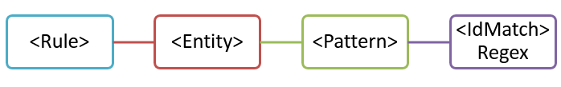
  
<span data-ttu-id="3b347-140">Même s’il est simple, ce modèle peut identifier de nombreux faux positifs en faisant correspondre du contenu comprenant un nombre à neuf chiffres qui n’est pas nécessairement un ID d’employé.</span><span class="sxs-lookup"><span data-stu-id="3b347-140">However, while simple, this pattern may identify many false positives by matching content that contains any nine-digit number that is not necessarily an employee ID.</span></span>
  
### <a name="more-common-scenario-entity-with-multiple-patterns"></a><span data-ttu-id="3b347-141">Scénario le plus courant : entité avec plusieurs modèles</span><span class="sxs-lookup"><span data-stu-id="3b347-141">More common scenario: entity with multiple patterns</span></span>

<span data-ttu-id="3b347-142">Pour cette raison, il est plus courant de définir une entité à l’aide de plusieurs modèles, où ces derniers identifient la preuve à l’appui (par exemple, un mot clé ou une date) en plus de l’entité (par exemple, un nombre à neuf chiffres).</span><span class="sxs-lookup"><span data-stu-id="3b347-142">For this reason, it's more common to define an entity by using more than one pattern, where the patterns identify supporting evidence (such as a keyword or date) in addition to the entity (such as a nine-digit number).</span></span>
  
<span data-ttu-id="3b347-143">Par exemple, pour augmenter la probabilité d’identifier le contenu qui contient un ID d’employé, vous pouvez définir un autre modèle qui identifie également une date d’embauche, et définir un autre modèle qui identifie une date d’embauche et un mot clé (par exemple, « ID d’employé ») en plus du nombre à neuf chiffres.</span><span class="sxs-lookup"><span data-stu-id="3b347-143">For example, to increase the likelihood of identifying content that contains an employee ID, you can define another pattern that also identifies a hire date, and define yet another pattern that identifies both a hire date and a keyword (such as "employee ID"), in addition to the nine-digit number.</span></span>
  
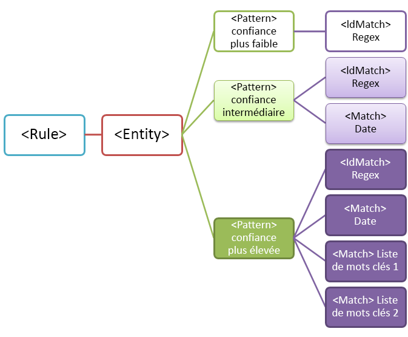
  
<span data-ttu-id="3b347-145">Voici quelques aspects importants de cette structure à prendre en compte :</span><span class="sxs-lookup"><span data-stu-id="3b347-145">Note a couple of important aspects of this structure:</span></span>
  
- <span data-ttu-id="3b347-p112">Les modèles qui nécessitent davantage de preuves ont un niveau de confiance supérieur. Ceci est utile, car lorsque vous utilisez ultérieurement ce type d’informations sensibles dans une stratégie DLP, vous pouvez utiliser des actions plus restrictives (par exemple, le blocage de contenu) avec uniquement les correspondances de confiance les plus élevées, et vous pouvez utiliser les actions moins restrictives (par exemple, envoyer une notification) avec les correspondances de confiance inférieures.</span><span class="sxs-lookup"><span data-stu-id="3b347-p112">Patterns that require more evidence have a higher confidence level. This is useful because when you later use this sensitive information type in a DLP policy, you can use more restrictive actions (such as block content) with only the higher-confidence matches, and you can use less restrictive actions (such as send notification) with the lower-confidence matches.</span></span>
    
- <span data-ttu-id="3b347-p113">Les éléments de soutien IdMatch et Match font référence à des regex (expressions régulières) et à des mots clés qui sont des enfants de l’élément Rule, pas de l’élément Pattern. Ces éléments de soutien sont référencés par le modèle, mais inclus dans la règle. Cela signifie qu’une seule définition d’un élément de soutien, par exemple, une expression régulière ou une liste de mots clés, peut être référencée par plusieurs entités et modèles.</span><span class="sxs-lookup"><span data-stu-id="3b347-p113">The supporting IdMatch and Match elements reference regexes and keywords that are actually children of the Rule element, not the Pattern. These supporting elements are referenced by the Pattern but included in the Rule. This means that a single definition of a supporting element, like a regular expression or a keyword list, can be referenced by multiple entities and patterns.</span></span>
    
## <a name="what-entity-do-you-need-to-identify-entity-element-id-attribute"></a><span data-ttu-id="3b347-p114">Quelle entité devez-vous identifier ? [élément Entity, attribut id]</span><span class="sxs-lookup"><span data-stu-id="3b347-p114">What entity do you need to identify? [Entity element, id attribute]</span></span>

<span data-ttu-id="3b347-p115">Une entité est un type d’informations sensibles, tel qu’un numéro de carte de crédit, associé à un modèle bien défini. Chaque entité possède un GUID unique en tant qu’ID.</span><span class="sxs-lookup"><span data-stu-id="3b347-p115">An entity is a sensitive information type, such as a credit card number, that has a well-defined pattern. Each entity has a unique GUID as its ID.</span></span>
  
### <a name="name-the-entity-and-generate-its-guid"></a><span data-ttu-id="3b347-155">Nommer l’entité et générer son GUID</span><span class="sxs-lookup"><span data-stu-id="3b347-155">Name the entity and generate its GUID</span></span>

<span data-ttu-id="3b347-p116">Ajoutez les éléments Rules et Entity. Ensuite, ajoutez un commentaire qui contient le nom de votre entité personnalisée, dans cet exemple, « Employee ID » (ID d’employé). Plus tard, vous allez ajouter le nom de l’entité à la section de chaînes localisées et ce nom est celui qui apparaît dans l’interface utilisateur lorsque vous créez une stratégie DLP.</span><span class="sxs-lookup"><span data-stu-id="3b347-p116">Add the Rules and Entity elements. Then add a comment that contains the name of your custom entity - in this example, Employee ID. Later, you'll add the entity name to the localized strings section, and that name is what appears in the UI when you create a DLP policy.</span></span>
  
<span data-ttu-id="3b347-p117">Ensuite, générez un GUID pour votre entité. Il existe plusieurs méthodes pour générer des GUID, mais vous pouvez le faire facilement dans PowerShell en saisissant [guid]::NewGuid(). Plus tard, vous ajouterez également le GUID de l’entité à la section de chaînes localisées.</span><span class="sxs-lookup"><span data-stu-id="3b347-p117">Next, generate a GUID for your entity. There are several ways to generate GUIDs, but you can do it easily in PowerShell by typing [guid]::NewGuid(). Later, you'll also add the entity GUID to the localized strings section.</span></span>
  
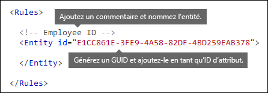
  
## <a name="what-pattern-do-you-want-to-match-pattern-element-idmatch-element-regex-element"></a><span data-ttu-id="3b347-p118">Quel modèle voulez-vous faire correspondre [élément Pattern, élément IdMatch et élément Regex]</span><span class="sxs-lookup"><span data-stu-id="3b347-p118">What pattern do you want to match? [Pattern element, IdMatch element, Regex element]</span></span>

<span data-ttu-id="3b347-p119">Le modèle contient la liste des éléments recherchés par le type d’informations sensibles. Cela peut inclure des regex, des mots clés et des fonctions intégrées (qui effectuent des tâches telles que l’exécution des expressions régulières pour rechercher des dates ou des adresses). Ces types d’informations sensibles peuvent avoir plusieurs modèles avec des niveaux de confiance uniques.</span><span class="sxs-lookup"><span data-stu-id="3b347-p119">The pattern contains the list of what the sensitive information type is looking for. This can include regexes, keywords, and built-in functions (which perform tasks like running regexes to find dates or addresses). Sensitive information types can have multiple patterns with unique confidences.</span></span>
  
<span data-ttu-id="3b347-p120">Le point commun de tous les modèles suivants est qu’ils référencent tous la même expression régulière, qui recherche un nombre à neuf chiffres (\d{9}) entre espaces (\s) … (\s). Cette expression régulière est référencée par l’élément IdMatch et est la condition requise commune à tous les modèles qui recherchent l’entité Employee ID. IdMatch est l’identificateur que le modèle cherche à faire correspondre, par exemple, comme ID d’employé, numéro de carte de crédit ou numéro de sécurité sociale. Un élément Pattern doit avoir exactement un élément IdMatch.</span><span class="sxs-lookup"><span data-stu-id="3b347-p120">What all of the below patterns have in common is that they all reference the same regular expression, which looks for a nine-digit number (\d{9}) surrounded by white space (\s) … (\s). This regular expression is referenced by the IdMatch element and is the common requirement for all patterns that look for the Employee ID entity. IdMatch is the identifier that the pattern is to trying to match, such as Employee ID or credit card number or social security number. A Pattern element must have exactly one IdMatch element.</span></span>
  
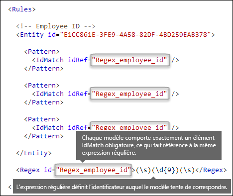
  
<span data-ttu-id="3b347-p121">Lorsqu’il est satisfait, un modèle renvoie un nombre et un niveau de confiance, que vous pouvez utiliser dans les conditions dans votre stratégie DLP. Lorsque vous ajoutez une condition de détection d’un type d’informations sensibles à une stratégie DLP, vous pouvez modifier le nombre et le niveau de confiance comme illustré ici. Le niveau de confiance (également appelée précision de correspondance) est expliqué plus loin dans cette rubrique.</span><span class="sxs-lookup"><span data-stu-id="3b347-p121">When satisfied, a pattern returns a count and confidence level, which you can use in the conditions in your DLP policy. When you add a condition for detecting a sensitive information type to a DLP policy, you can edit the count and confidence level as shown here. Confidence level (also called match accuracy) is explained later in this topic.</span></span>
  
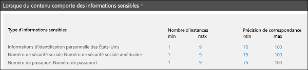
  
<span data-ttu-id="3b347-p122">Lorsque vous créez une expression régulière, n’oubliez pas que des problèmes peuvent survenir. Par exemple, si vous écrivez et chargez une regex qui identifie trop de contenu, cela peut nuire aux performances. Pour en savoir plus sur ces problèmes potentiels, consultez la section ultérieure [Problèmes de validation éventuels à prendre en compte](#potential-validation-issues-to-be-aware-of).</span><span class="sxs-lookup"><span data-stu-id="3b347-p122">When you create your regular expression, keep in mind that there are potential issues to be aware of. For example, if you write and upload a regex that identifies too much content, this can impact performance. To learn more about these potential issues, see the later section [Potential validation issues to be aware of](#potential-validation-issues-to-be-aware-of).</span></span>
  
## <a name="do-you-want-to-require-additional-evidence-match-element-mincount-attribute"></a><span data-ttu-id="3b347-p123">Voulez-vous demander des preuves supplémentaires ? [élément Match, attribut minCount]</span><span class="sxs-lookup"><span data-stu-id="3b347-p123">Do you want to require additional evidence? [Match element, minCount attribute]</span></span>

<span data-ttu-id="3b347-183">En plus de l’élément IdMatch, un modèle peut utiliser l’élément Match pour demander des preuves à l’appui supplémentaires, telles qu’un mot clé, une regex, une date ou une adresse.</span><span class="sxs-lookup"><span data-stu-id="3b347-183">In addition to the IdMatch, a pattern can use the Match element to require additional supporting evidence, such as a keyword, regex, date, or address.</span></span>
  
<span data-ttu-id="3b347-p124">Un élément Pattern peut comporter plusieurs éléments Match ; ces éléments sont inclus directement dans l’élément Pattern ou combinés à l’aide de l’élément Any. Les éléments Match sont joints par un opérateur implicite AND ; tous les éléments Match doivent être satisfaits pour que le modèle corresponde. Vous pouvez utiliser l’élément Any pour introduire les opérateurs AND ou OR (plus d’informations dans une section ultérieure).</span><span class="sxs-lookup"><span data-stu-id="3b347-p124">A Pattern can include multiple Match elements; they can be included directly in the Pattern element or combined by using the Any element. Match elements are joined by an implicit AND operator; all Match elements must be satisfied for the pattern to be matched. You can use the Any element to introduce AND or OR operators (more on that in a later section).</span></span>
  
<span data-ttu-id="3b347-p125">Vous pouvez utiliser l’attribut facultatif minCount pour spécifier le nombre d’instances d’une correspondance qui doivent être trouvées pour chaque élément Match. Par exemple, vous pouvez spécifier qu’un modèle est satisfait uniquement lorsqu’au moins deux mots clés d’une liste de mots clés sont trouvés.</span><span class="sxs-lookup"><span data-stu-id="3b347-p125">You can use the optional minCount attribute to specify how many instances of a match need to be found for each of the Match elements. For example, you can specify that a pattern is satisfied only when at least two keywords from a keyword list are found.</span></span>
  
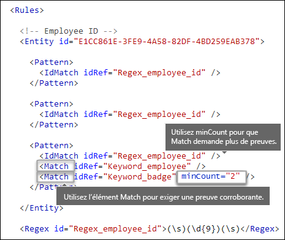
  
### <a name="keywords-keyword-group-and-term-elements-matchstyle-and-casesensitive-attributes"></a><span data-ttu-id="3b347-190">Mots clés [éléments Keyword, Group et Term, attributs matchStyle et caseSensitive]</span><span class="sxs-lookup"><span data-stu-id="3b347-190">Keywords [Keyword, Group, and Term elements, matchStyle and caseSensitive attributes]</span></span>

<span data-ttu-id="3b347-p126">Lorsque vous identifiez les informations sensibles, telles qu’un ID d’employé, vous pouvez demander des mots clés comme preuve probante. Par exemple, en plus de faire correspondre un nombre à neuf chiffres, vous souhaiterez peut-être rechercher des mots tels que « carte », « badge » ou « ID ». Pour ce faire, utilisez l’élément Keyword. L’élément Keyword possède l’attribut id qui peut être référencé par plusieurs éléments Match dans plusieurs modèles ou entités.</span><span class="sxs-lookup"><span data-stu-id="3b347-p126">When you identify sensitive information, like an employee ID, you often want to require keywords as corroborative evidence. For example, in addition to matching a nine-digit number, you may want to look for words like "card", "badge", or "ID". To do this, you use the Keyword element. The Keyword element has an id attribute that can be referenced by multiple Match elements in multiple patterns or entities.</span></span>
  
<span data-ttu-id="3b347-p127">Les mots clés sont inclus sous forme de liste d’éléments Term dans un élément Group. L’élément Group possède un attribut matchStyle avec deux valeurs possibles :</span><span class="sxs-lookup"><span data-stu-id="3b347-p127">Keywords are included as a list of Term elements in a Group element. The Group element has a matchStyle attribute with two possible values:</span></span>
  
- <span data-ttu-id="3b347-p128">**matchStyle="word"** La correspondance de mots identifie des mots entiers entourés par des espaces ou d’autres séparateurs. Vous devez toujours utiliser « word », sauf si vous devez faire correspondre des parties de mots ou des mots dans des langues asiatiques.</span><span class="sxs-lookup"><span data-stu-id="3b347-p128">**matchStyle="word"** Word match identifies whole words surrounded by white space or other delimiters. You should always use word unless you need to match parts of words or match words in Asian languages.</span></span> 
    
- <span data-ttu-id="3b347-p129">**matchStyle="string"** La correspondance de chaînes identifie les chaînes, peu importe ce qui les entoure. Par exemple, « id » correspondra à « bid» et à « idea ». Utilisez « string » uniquement lorsque vous recherchez des mots asiatiques ou si votre mot clé est inclus dans d’autres chaînes.</span><span class="sxs-lookup"><span data-stu-id="3b347-p129">**matchStyle="string"** String match identifies strings no matter what they're surrounded by. For example, "id" will match "bid" and "idea". Use string only when you need to match Asian words or if your keyword may be included as part of other strings.</span></span> 
    
<span data-ttu-id="3b347-202">Enfin, vous pouvez utiliser l’attribut caseSensitive de l’élément Term pour préciser que le contenu doit correspondre exactement au mot clé, notamment les lettres minuscules et majuscules.</span><span class="sxs-lookup"><span data-stu-id="3b347-202">Finally, you can use the caseSensitive attribute of the Term element to specify that the content must match the keyword exactly, including lower- and upper-case letters.</span></span>
  
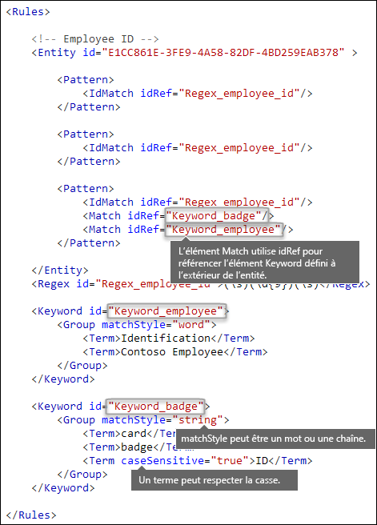
  
### <a name="regular-expressions-regex-element"></a><span data-ttu-id="3b347-204">Expressions régulières [élément Regex]</span><span class="sxs-lookup"><span data-stu-id="3b347-204">Regular expressions [Regex element]</span></span>

<span data-ttu-id="3b347-p130">Dans cet exemple, l’entité d’ID d’employé utilise déjà l’élément IdMatch pour référencer une regex pour le modèle (un nombre à neuf chiffres entouré d’espaces). De plus, un modèle peut utiliser un élément Match pour référencer un élément Regex supplémentaire afin d’identifier la preuve probante, par exemple un nombre de cinq ou neuf chiffres sous la forme d’un code postal des États-Unis.</span><span class="sxs-lookup"><span data-stu-id="3b347-p130">In this example, the employee ID entity already uses the IdMatch element to reference a regex for the pattern - a nine-digit number surrounded by whitespace. In addition, a pattern can use a Match element to reference an additional Regex element to identify corroborative evidence, such as a five- or nine-digit number in the format of a US zip code.</span></span>
  
### <a name="additional-patterns-such-as-dates-or-addresses-built-in-functions"></a><span data-ttu-id="3b347-207">Autres modèles tels que des dates ou des adresses [fonctions intégrées]</span><span class="sxs-lookup"><span data-stu-id="3b347-207">Additional patterns such as dates or addresses [built-in functions]</span></span>

<span data-ttu-id="3b347-p131">En plus des types d’informations sensibles intégrés, la DLP inclut également des fonctions intégrées qui peuvent identifier une preuve probante telle qu’une date américaine, une date européenne, une date d’expiration ou une adresse des États-Unis. La DLP ne prend pas en charge le chargement de fonctions personnalisées, mais lorsque vous créez un type d’informations sensibles personnalisé, votre entité peut référencer les fonctions intégrées.</span><span class="sxs-lookup"><span data-stu-id="3b347-p131">In addition to the built-in sensitive information types, DLP also includes built-in functions that can identify corroborative evidence such as a US date, EU date, expiration date, or US address. DLP does not support uploading your own custom functions, but when you create a custom sensitive information type, your entity can reference the built-in functions.</span></span>
  
<span data-ttu-id="3b347-210">Par exemple, une date figure sur les badges d’ID d’employé. Cette entité personnalisée peut donc utiliser la fonction intégrée `Func_us_date` pour identifier une date au format utilisé aux États-Unis.</span><span class="sxs-lookup"><span data-stu-id="3b347-210">For example, an employee ID badge has a hire date on it, so this custom entity can use the built-in function  `Func_us_date` to identify a date in the format commonly used in the US.</span></span> 
  
<span data-ttu-id="3b347-211">Pour obtenir plus d’informations, consultez l’article [Éléments recherchés par les fonctions DLP](what-the-dlp-functions-look-for.md).</span><span class="sxs-lookup"><span data-stu-id="3b347-211">For more information, see [What the DLP functions look for](what-the-dlp-functions-look-for.md).</span></span>
  
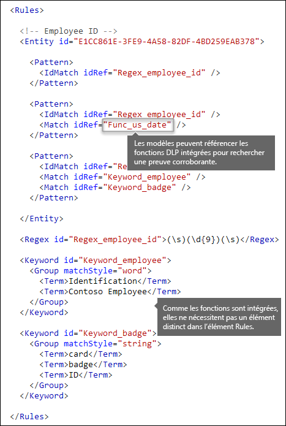
  
## <a name="different-combinations-of-evidence-any-element-minmatches-and-maxmatches-attributes"></a><span data-ttu-id="3b347-213">Différentes combinaisons de preuves [élément Any, attributs minMatches et maxMatches]</span><span class="sxs-lookup"><span data-stu-id="3b347-213">Different combinations of evidence [Any element, minMatches and maxMatches attributes]</span></span>

<span data-ttu-id="3b347-p132">Dans un élément Pattern, tous les éléments IdMatch et Match sont joints par un opérateur implicite AND : toutes les correspondances doivent être satisfaites pour que le modèle soit satisfait. Cependant, vous pouvez créer une logique de correspondance plus flexible en utilisant l’élément Any afin de regrouper des éléments Match. Par exemple, vous pouvez utiliser l’élément Any pour faire correspondre tous les sous-ensembles, aucun sous-ensemble ou un sous-ensemble exact de ses éléments Match enfants.</span><span class="sxs-lookup"><span data-stu-id="3b347-p132">In a Pattern element, all IdMatch and Match elements are joined by an implicit AND operator - all of the matches must be satisfied before the pattern can be satisfied. However, you can create more flexible matching logic by using the Any element to group Match elements. For example, you can use the Any element to match all, none, or an exact subset of its children Match elements.</span></span>
  
<span data-ttu-id="3b347-p133">L’élément Any a des attributs minMatches et maxMatches facultatifs que vous pouvez utiliser pour définir le nombre d’éléments Match enfants qui doivent être satisfaits pour que le modèle corresponde. Notez que ces attributs définissent le nombre d’éléments Match qui doivent être satisfaits, pas le nombre d’instances de preuves trouvées pour les correspondances. Pour définir un nombre minimal d’instances pour une correspondance spécifique, par exemple, deux mots clés d’une liste, utilisez l’attribut minCount d’un élément Match (voir ci-dessus).</span><span class="sxs-lookup"><span data-stu-id="3b347-p133">The Any element has optional minMatches and maxMatches attributes that you can use to define how many of the children Match elements must be satisfied before the pattern is matched. Note that these attributes define the number of Match elements that must be satisfied, not the number of instances of evidence found for the matches. To define a minimum number of instances for a specific match, such as two keywords from a list, use the minCount attribute for a Match element (see above).</span></span>
  
### <a name="match-at-least-one-child-match-element"></a><span data-ttu-id="3b347-220">Faire correspondre au moins un élément Match enfant</span><span class="sxs-lookup"><span data-stu-id="3b347-220">Match at least one child Match element</span></span>

<span data-ttu-id="3b347-p134">Si vous voulez exiger qu’au moins un nombre minimal d’éléments Match corresponde, vous pouvez utiliser l’attribut minMatches. En effet, ces éléments Match sont joints par un opérateur implicite OR. Cet élément Any est satisfait si une date au format américain ou un mot clé d’une liste est trouvé.</span><span class="sxs-lookup"><span data-stu-id="3b347-p134">If you want to require that only a minimum number of Match elements must be met, you can use the minMatches attribute. In effect, these Match elements are joined by an implicit OR operator. This Any element is satisfied if a US-formatted date or a keyword from either list is found.</span></span>
  
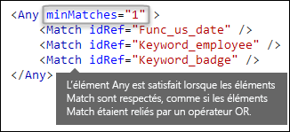
  
### <a name="match-an-exact-subset-of-any-children-match-elements"></a><span data-ttu-id="3b347-225">Faire correspondre un sous-ensemble exact d’éléments Match enfants</span><span class="sxs-lookup"><span data-stu-id="3b347-225">Match an exact subset of any children Match elements</span></span>

<span data-ttu-id="3b347-p135">Si vous voulez exiger qu’un nombre exact d’éléments Match corresponde, vous pouvez définir les attributs minMatches et maxMatches sur la même valeur. Cet élément Any est satisfait uniquement si une seule date ou un seul mot clé est trouvé (si plusieurs dates ou mots clés sont trouvés, le modèle ne correspond pas).</span><span class="sxs-lookup"><span data-stu-id="3b347-p135">If you want to require that an exact number of Match elements must be met, you can set minMatches and maxMatches to the same value. This Any element is satisfied only if exactly one date or keyword is found - any more than that, and the pattern won't be matched.</span></span>
  
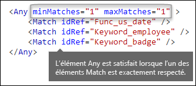
  
### <a name="match-none-of-children-match-elements"></a><span data-ttu-id="3b347-229">Faire correspondre tous les enfants Match enfants</span><span class="sxs-lookup"><span data-stu-id="3b347-229">Match none of children Match elements</span></span>

<span data-ttu-id="3b347-p136">Si vous voulez exiger l’absence de preuve spécifique pour qu’un modèle soit satisfait, vous pouvez définir les attributs minMatches et maxMatches sur 0. Cela est utile si vous avez une liste de mots clés ou d’autres preuves susceptibles d’indiquer de faux positifs.</span><span class="sxs-lookup"><span data-stu-id="3b347-p136">If you want to require the absence of specific evidence for a pattern to be satisfied, you can set both minMatches and maxMatches to 0. This can be useful if you have a keyword list or other evidence that are likely to indicate a false positive.</span></span>
  
<span data-ttu-id="3b347-p137">Par exemple, l’entité d’ID d’employé recherche le mot clé « carte », car il peut désigner une « carte d’identité ». Toutefois, si « carte » apparaît uniquement dans l’expression « carte de crédit », il est peu probable que « carte » dans ce contenu signifie « carte d’identité ». Par conséquent, vous pouvez ajouter « carte de crédit » comme mot clé à une liste de termes que vous voulez exclure de la satisfaction du modèle.</span><span class="sxs-lookup"><span data-stu-id="3b347-p137">For example, the employee ID entity looks for the keyword "card" because it might refer to an "ID card". However, if card appears only in the phrase "credit card", "card" in this content is unlikely to mean "ID card". So you can add "credit card" as a keyword to a list of terms that you want to exclude from satisfying the pattern.</span></span>
  
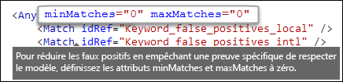
  
## <a name="how-close-to-the-entity-must-the-other-evidence-be-patternsproximity-attribute"></a><span data-ttu-id="3b347-p138">Quel doit être le degré de proximité de l’entité par rapport à l’autre preuve ? [attribut patternsProximity]</span><span class="sxs-lookup"><span data-stu-id="3b347-p138">How close to the entity must the other evidence be? [patternsProximity attribute]</span></span>

<span data-ttu-id="3b347-p139">Votre type d’informations sensibles recherche un modèle qui représente un ID d’employé et dans le cadre de ce modèle, il recherche également comme preuve probante un mot clé tel que « ID ». Il est logique que plus la proximité de cette preuve est élevée, plus le modèle est susceptible d’être un ID d’employé. Vous pouvez déterminer le degré de proximité d’autres preuves par rapport à l’entité dans le modèle à l’aide de l’attribut obligatoire patternsProximity de l’élément Entity.</span><span class="sxs-lookup"><span data-stu-id="3b347-p139">Your sensitive information type is looking for a pattern that represents an employee ID, and as part of that pattern it's also looking for corroborative evidence like a keyword such as "ID". It makes sense that the closer together this evidence is, the more likely the pattern is to be an actual employee ID. You can determine how close other evidence in the pattern must be to the entity by using the required patternsProximity attribute of the Entity element.</span></span>
  
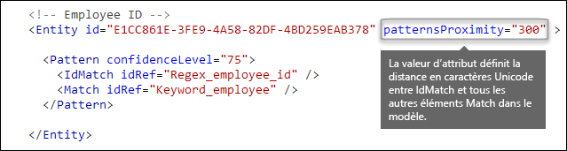
  
<span data-ttu-id="3b347-p140">Pour chaque modèle de l’entité, la valeur de l’attribut patternsProximity définit la distance (en caractères Unicode) à partir de l’emplacement IdMatch pour toutes les autres correspondances spécifiées pour ce modèle. La fenêtre de proximité est ancrée par l’emplacement IdMatch. La fenêtre s’étend à gauche et à droite de l’IdMatch.</span><span class="sxs-lookup"><span data-stu-id="3b347-p140">For each pattern in the entity, the patternsProximity attribute value defines the distance (in Unicode characters) from the IdMatch location for all other Matches specified for that Pattern. The proximity window is anchored by the IdMatch location, with the window extending to the left and right of the IdMatch.</span></span>
  
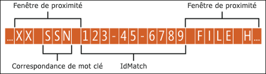
  
<span data-ttu-id="3b347-p141">L’exemple indiqué ci-après illustre comment la fenêtre de proximité affecte la correspondance du modèle là où l’élément IdMatch requiert au moins une correspondance probante de mot clé ou de date pour l’entité personnalisée d’ID d’employé. Seul ID1 correspond, car pour ID2 et ID3, seule une preuve probante partielle (voire aucune preuve probante) a été détectée au sein de la fenêtre de proximité.</span><span class="sxs-lookup"><span data-stu-id="3b347-p141">The example below illustrates how the proximity window affects the pattern matching where IdMatch element for the employee ID custom entity requires at least one corroborating match of keyword or date. Only ID1 matches because for ID2 and ID3, either no or only partial corroborating evidence is found within the proximity window.</span></span>
  
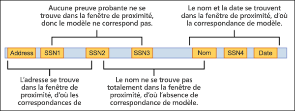
  
<span data-ttu-id="3b347-p142">Notez que pour la messagerie, le corps du message et chaque pièce jointe sont traités comme des éléments distincts. Cela signifie que la fenêtre de proximité ne s’étend pas au-delà de chacun de ces éléments. Pour chaque élément (pièce jointe ou corps), l’attribut idMatch et la preuve probante doivent résider dans cet élément.</span><span class="sxs-lookup"><span data-stu-id="3b347-p142">Note that for email, the message body and each attachment are treated as separate items. This means that the proximity window does not extend beyond the end of each of these items. For each item (attachment or body), both the idMatch and corroborative evidence needs to reside in that item.</span></span>
  
## <a name="what-are-the-right-confidence-levels-for-different-patterns-confidencelevel-attribute-recommendedconfidence-attribute"></a><span data-ttu-id="3b347-p143">Quels sont les niveaux de confiance appropriés pour les différents modèles ? [attributs confidenceLevel et recommendedConfidence]</span><span class="sxs-lookup"><span data-stu-id="3b347-p143">What are the right confidence levels for different patterns? [confidenceLevel attribute, recommendedConfidence attribute]</span></span>

<span data-ttu-id="3b347-p144">Plus un modèle nécessite de preuves, plus vous pouvez être certain qu’une entité (par exemple, l’ID d’employé) a effectivement été identifiée lorsque le modèle a été mis en correspondance. Par exemple, vous pouvez davantage compter sur un modèle qui nécessite un numéro d’identification à neuf chiffres, une date d’embauche et un mot clé situés à proximité immédiate les uns des autres, que sur un modèle qui nécessite uniquement un numéro d’identification à neuf chiffres.</span><span class="sxs-lookup"><span data-stu-id="3b347-p144">The more evidence that a pattern requires, the more confidence you have that an actual entity (such as employee ID) has been identified when the pattern is matched. For example, you have more confidence in a pattern that requires a nine-digit ID number, hire date, and keyword in close proximity, than you do in a pattern that requires only a nine-digit ID number.</span></span>
  
<span data-ttu-id="3b347-p145">L’élément Pattern possède un attribut confidenceLevel obligatoire. Vous pouvez considérer la valeur confidenceLevel (un nombre entier compris entre 1 et 100) comme un ID unique pour chaque modèle d’une entité (les modèles d’une entité doivent avoir des niveaux de confiance distincts que vous attribuez). La valeur précise de l’entier n’a pas d’importance : sélectionnez simplement un nombre ayant du sens pour votre équipe de conformité. Une fois que vous chargez votre type d’informations sensibles personnalisé et créez une stratégie DLP, vous pouvez référencer ces niveaux de confiance dans les conditions des règles que vous créez.</span><span class="sxs-lookup"><span data-stu-id="3b347-p145">The Pattern element has a required confidenceLevel attribute. You can think of the value of confidenceLevel (an integer between 1 and 100) as a unique ID for each pattern in an entity - the patterns in an entity must have different confidence levels that you assign. The precise value of the integer doesn't matter - simply pick numbers that make sense to your compliance team. After you upload your custom sensitive information type and then create a DLP policy, you can reference these confidence levels in the conditions of the rules that you create.</span></span>
  
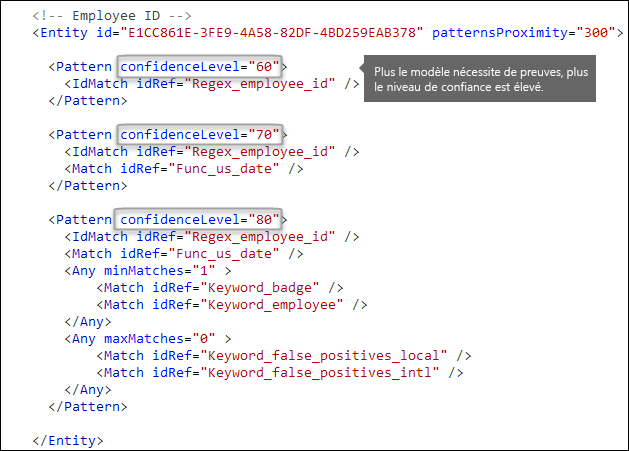
  
<span data-ttu-id="3b347-p146">En plus de l’attribut confidenceLevel de chaque modèle, l’entité possède un attribut recommendedConfidence. L’attribut de confiance recommandé est assimilable au niveau de confiance par défaut de la règle. Lorsque vous créez une règle dans une stratégie DLP, si vous ne spécifiez aucun niveau de confiance pour la règle à utiliser, cette règle correspondra en fonction du niveau de confiance recommandé pour l’entité.</span><span class="sxs-lookup"><span data-stu-id="3b347-p146">In addition to confidenceLevel for each Pattern, the Entity has a recommendedConfidence attribute. The recommended confidence attribute can be thought of as the default confidence level for the rule. When you create a rule in a DLP policy, if you don't specify a confidence level for the rule to use, that rule will match based on the recommended confidence level for the entity.</span></span>
  
## <a name="do-you-want-to-support-other-languages-in-the-ui-of-the-security-amp-compliance-center-localizedstrings-element"></a><span data-ttu-id="3b347-p147">Voulez-vous prendre en charge d’autres langues dans l’interface utilisateur du Centre de sécurité &amp; conformité ? [élément LocalizedStrings]</span><span class="sxs-lookup"><span data-stu-id="3b347-p147">Do you want to support other languages in the UI of the Security &amp; Compliance Center? [LocalizedStrings element]</span></span>

<span data-ttu-id="3b347-p148">Si votre équipe de conformité utilise le Centre de sécurité &amp; conformité Office 365 pour créer des stratégies DLP avec différents paramètres régionaux et dans différentes langues, vous pouvez fournir des versions localisées du nom et de la description de votre type d’informations sensibles personnalisé. Lorsque votre équipe de conformité utilise Office 365 dans une langue prise en charge, le nom localisé s’affiche dans l’interface utilisateur.</span><span class="sxs-lookup"><span data-stu-id="3b347-p148">If your compliance team uses the Office 365 Security &amp; Compliance Center to create DLP policies in different locales and in different languages, you can provide localized versions of the name and description of your custom sensitive information type. When your compliance team uses Office 365 in a language that you support, they'll see the localized name in the UI.</span></span>
  

  
<span data-ttu-id="3b347-p149">L’élément Rules doit contenir un élément LocalizedStrings, qui contient un élément Resource référençant le GUID de votre entité personnalisée. À son tour, chaque élément Resource contient un ou plusieurs éléments Name et Description qui utilisent l’attribut langcode afin de fournir une chaîne localisée pour une langue spécifique.</span><span class="sxs-lookup"><span data-stu-id="3b347-p149">The Rules element must contain a LocalizedStrings element, which contains a Resource element that references the GUID of your custom entity. In turn, each Resource element contains one or more Name and Description elements that each use the langcode attribute to provide a localized string for a specific language.</span></span>
  
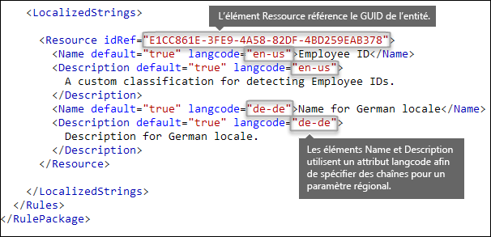
  
<span data-ttu-id="3b347-p150">Notez que vous utilisez des chaînes localisées uniquement pour la manière dont le type d’informations sensibles personnalisé apparaît dans l’interface utilisateur du Centre de sécurité &amp; conformité. Vous ne pouvez pas utiliser des chaînes localisées pour fournir différentes versions localisées d’une liste de mots clés ou une expression régulière.</span><span class="sxs-lookup"><span data-stu-id="3b347-p150">Note that you use localized strings only for how your custom sensitive information type appears in the UI of the Security &amp; Compliance Center. You can't use localized strings to provide different localized versions of a keyword list or regular expression.</span></span>
  
## <a name="other-rule-package-markup-rulepack-guid"></a><span data-ttu-id="3b347-273">Autre balisage de package de règles [GUID RulePack]</span><span class="sxs-lookup"><span data-stu-id="3b347-273">Other rule package markup [RulePack GUID]</span></span>

<span data-ttu-id="3b347-p151">Enfin, le début de chaque RulePackage contient des informations générales que vous avez besoin de compléter. Vous pouvez utiliser le balisage suivant comme modèle et remplacer les espaces réservés « ... » avec vos propres informations.</span><span class="sxs-lookup"><span data-stu-id="3b347-p151">Finally, the beginning of each RulePackage contains some general information that you need to fill in. You can use the following markup as a template and replace the ". . ." placeholders with your own info.</span></span>
  
<span data-ttu-id="3b347-p152">Vous devez surtout générer un GUID pour le RulePack. Ci-dessus, vous avez généré un GUID pour l’entité ; il s’agit d’un second GUID pour le RulePack. Il existe plusieurs méthodes pour générer des GUID, mais vous pouvez le faire facilement dans PowerShell en saisissant [guid]::NewGuid().</span><span class="sxs-lookup"><span data-stu-id="3b347-p152">Most importantly, you'll need to generate a GUID for the RulePack. Above, you generated a GUID for the entity; this is a second GUID for the RulePack. There are several ways to generate GUIDs, but you can do it easily in PowerShell by typing [guid]::NewGuid().</span></span>
  
<span data-ttu-id="3b347-p153">L’élément Version est également important. Lorsque vous chargez votre package de règles pour la première fois, Office 365 prend note du numéro de version. Si vous mettez à jour le package de règles ultérieurement et téléchargez une nouvelle version, veillez à mettre à jour le numéro de version, sinon Office 365 ne déploiera pas le package de règles.</span><span class="sxs-lookup"><span data-stu-id="3b347-p153">The Version element is also important. When you upload your rule package for the first time, Office 365 notes the version number. Later, if you update the rule package and upload a new version, make sure to update the version number or Office 365 won't deploy the rule package.</span></span>
  
```
<?xml version="1.0" encoding="utf-16"?>
<RulePackage xmlns="http://schemas.microsoft.com/office/2011/mce">
  <RulePack id=". . .">
    <Version major="1" minor="0" build="0" revision="0" />
    <Publisher id=". . ." /> 
    <Details defaultLangCode=". . .">
      <LocalizedDetails langcode=" . . . ">
         <PublisherName>. . .</PublisherName>
         <Name>. . .</Name>
         <Description>. . .</Description>
      </LocalizedDetails>
    </Details>
  </RulePack>
  
 <Rules>
    . . .
 </Rules>
</RulePackage>

```

<span data-ttu-id="3b347-285">Lorsque vous avez terminé, votre élément RulePack doit ressembler à ce qui suit :</span><span class="sxs-lookup"><span data-stu-id="3b347-285">When complete, your RulePack element should look like this.</span></span>
  
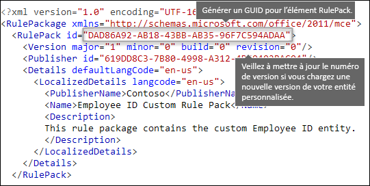
  
## <a name="changes-for-exchange-online"></a><span data-ttu-id="3b347-287">Modifications pour Exchange Online</span><span class="sxs-lookup"><span data-stu-id="3b347-287">Changes for Exchange Online</span></span>

<span data-ttu-id="3b347-p154">Auparavant, vous utilisiez peut-être Exchange Online PowerShell pour importer vos types d’informations sensibles personnalisés pour DLP. Désormais, vos types d’informations sensibles personnalisés peuvent être utilisés dans le Centre d’administration Exchange et le Centre de sécurité et de conformité. Dans le cadre de cette amélioration, vous devez utiliser le Centre de sécurité et de conformité PowerShell pour importer vos types d’informations sensibles personnalisés (vous ne pouvez plus les importer à partir d’Exchange PowerShell). Vos types d’informations sensibles personnalisés continueront de fonctionner comme avant. Cependant, l’affichage des modifications apportées aux types d’informations sensibles personnalisés dans le Centre de sécurité et de conformité dans le Centre d’administration Exchange peut prendre jusqu’à une heure.</span><span class="sxs-lookup"><span data-stu-id="3b347-p154">Previously, you might have used Exchange Online PowerShell to import your custom sensitive information types for DLP. Now your custom sensitive information types can be used in both the Exchange admin center and the Security &amp; Compliance Center. As part of this improvement, you should use Security &amp; Compliance Center PowerShell to import your custom sensitive information types - you can't import them from the Exchange PowerShell anymore. Your custom sensitive information types will continue to work just like before; however, it may take up to one hour for changes made to custom sensitive information types in the Security &amp; Compliance Center to appear in the Exchange admin center.</span></span>
  
<span data-ttu-id="3b347-p155">Dans le Centre de sécurité et de conformité, vous pouvez utiliser la cmdlet `DlpSensitiveInformationTypeRulePackage` pour charger un package de règles. Auparavant, dans le Centre d’administration Exchange, vous utilisiez la cmdlet `ClassificationRuleCollection`.</span><span class="sxs-lookup"><span data-stu-id="3b347-p155">Note that in the Security &amp; Compliance Center, you use the  `DlpSensitiveInformationTypeRulePackage` cmdlet to upload a rule package. Previously, in the Exchange admin center, you used the  `ClassificationRuleCollection` cmdlet.</span></span> 
  
## <a name="upload-your-rule-package"></a><span data-ttu-id="3b347-294">Télécharger votre package de règles</span><span class="sxs-lookup"><span data-stu-id="3b347-294">Upload your rule package</span></span>

<span data-ttu-id="3b347-295">Pour télécharger votre package de règles, procédez comme suit :</span><span class="sxs-lookup"><span data-stu-id="3b347-295">To upload your rule package, do the following steps:</span></span>
  
1. <span data-ttu-id="3b347-296">Enregistrez-le en tant que fichier .xml avec le codage Unicode.</span><span class="sxs-lookup"><span data-stu-id="3b347-296">Save it as an .xml file with Unicode encoding.</span></span>
    
2. [<span data-ttu-id="3b347-297">Se connecter à l’interface PowerShell du Centre de sécurité et conformité</span><span class="sxs-lookup"><span data-stu-id="3b347-297">Connect to Office 365 Security & Compliance Center PowerShell</span></span>](http://go.microsoft.com/fwlink/p/?LinkID=799771)
    
3. <span data-ttu-id="3b347-298">Utilisez la syntaxe suivante :</span><span class="sxs-lookup"><span data-stu-id="3b347-298">Use the following syntax:</span></span>

    ```
    New-DlpSensitiveInformationTypeRulePackage -FileData (Get-Content -Path "PathToUnicodeXMLFile" -Encoding Byte)
    ```

    <span data-ttu-id="3b347-299">Cet exemple télécharge le fichier XML Unicode nommé MyNewRulePack.xml à partir de C:\My Documents.</span><span class="sxs-lookup"><span data-stu-id="3b347-299">This example uploads the Unicode XML file named MyNewRulePack.xml from C:\My Documents.</span></span>

    ```
    New-DlpSensitiveInformationTypeRulePackage -FileData (Get-Content -Path "C:\My Documents\MyNewRulePack.xml" -Encoding Byte)
    ```

    <span data-ttu-id="3b347-300">Pour une syntaxe détaillée et des informations de paramètrage, voir [New-DlpSensitiveInformationTypeRulePackage](https://docs.microsoft.com/powershell/module/exchange/policy-and-compliance-dlp/new-dlpsensitiveinformationtyperulepackage).</span><span class="sxs-lookup"><span data-stu-id="3b347-300">For detailed syntax and parameter information, see [New-DlpSensitiveInformationTypeRulePackage](https://docs.microsoft.com/powershell/module/exchange/policy-and-compliance-dlp/new-dlpsensitiveinformationtyperulepackage).</span></span>

5. <span data-ttu-id="3b347-301">Pour vérifier que vous avez correctement créé un nouveau type d’informations sensibles, effectuez l’une des opérations suivantes :</span><span class="sxs-lookup"><span data-stu-id="3b347-301">To verify that you've successfully created a new sensitive information type, do any of the following steps:</span></span>

  - <span data-ttu-id="3b347-302">Exécutez la commande suivante et vérifiez que le package de règles est répertorié:</span><span class="sxs-lookup"><span data-stu-id="3b347-302">Run the following command and verify the new rule package is listed:</span></span>

    ```
    Get-DlpSensitiveInformationTypeRulePackage
    ``` 

  - <span data-ttu-id="3b347-303">Exécutez la commande suivante et vérifiez que le package d’informations est répertorié:</span><span class="sxs-lookup"><span data-stu-id="3b347-303">Run the following command and verify the sensitive information type is listed:</span></span>

    ```
    Get-DlpSensitiveInformationType
    ``` 

    <span data-ttu-id="3b347-304">Pour les types d’informations sensibles personnalisés, la valeur de propriété Publisher sera un numéro autre que Microsoft Corporation.</span><span class="sxs-lookup"><span data-stu-id="3b347-304">For custom sensitive information types, the Publisher property value will be something other than Microsoft Corporation.</span></span>

  - <span data-ttu-id="3b347-305">Remplacez\<Nom\> avec la valeur Nom du type d’informations sensibles (par exemple, ID d’employé) et exécutez la commande suivante :</span><span class="sxs-lookup"><span data-stu-id="3b347-305">Replace \<Name\> with the Name value of the sensitive information type (for example, Employee ID) and run the following command:</span></span>

    ```
    Get-DlpSensitiveInformationType -Identity "<Name>"
    ```
    
## <a name="potential-validation-issues-to-be-aware-of"></a><span data-ttu-id="3b347-306">Problèmes de validation éventuels à prendre en compte</span><span class="sxs-lookup"><span data-stu-id="3b347-306">Potential validation issues to be aware of</span></span>

<span data-ttu-id="3b347-p156">Lorsque vous chargez votre fichier XML de package de règles, le système valide le fichier XML et recherche des modèles incorrects connus et des problèmes de performance évidents. Voici quelques-uns des problèmes connus que la validation contrôle. Une expression régulière :</span><span class="sxs-lookup"><span data-stu-id="3b347-p156">When you upload your rule package XML file, the system validates the XML and checks for known bad patterns and obvious performance issues. Here are some known issues that the validation checks for — a regular expression:</span></span>
  
- <span data-ttu-id="3b347-309">ne peut pas commencer ou se terminer par l’alternateur « | », qui correspond à tous les éléments, car il est considéré comme une correspondance vide ;</span><span class="sxs-lookup"><span data-stu-id="3b347-309">Cannot begin or end with alternator "|", which matches everything because it's considered an empty match.</span></span>
    
    <span data-ttu-id="3b347-310">Par exemple, « |a » ou « b| » échoue à la validation.</span><span class="sxs-lookup"><span data-stu-id="3b347-310">For example, "|a" or "b|" will not pass validation.</span></span>
    
- <span data-ttu-id="3b347-311">ne peut pas commencer ou se terminer par un modèle « .{0,m} » qui n’a aucune fonction et nuit uniquement aux performances ;</span><span class="sxs-lookup"><span data-stu-id="3b347-311">Cannot begin or end with a ".{0,m}" pattern, which has no functional purpose and only impairs performance.</span></span>
    
    <span data-ttu-id="3b347-312">Par exemple, « .{0,50}ASDF » ou « ASDF.{0,50} » échoue à la validation.</span><span class="sxs-lookup"><span data-stu-id="3b347-312">For example, ".{0,50}ASDF" or "ASDF.{0,50}" will not pass validation.</span></span>
    
- <span data-ttu-id="3b347-313">ne peut pas contenir « .{0,m} » ou « .{1,m} » dans des groupes, et ne peut pas contenir « .\* » ou « .+ » dans des groupes ;</span><span class="sxs-lookup"><span data-stu-id="3b347-313">Cannot have ".{0,m}" or ".{1,m}" in groups, and cannot have ".\*" or ".+" in groups.</span></span>
    
    <span data-ttu-id="3b347-314">Par exemple, « (.{0,50000}) » échoue à la validation.</span><span class="sxs-lookup"><span data-stu-id="3b347-314">For example, "(.{0,50000})" will not pass validation.</span></span>
    
- <span data-ttu-id="3b347-315">ne peut pas contenir de caractère avec les répéteurs « {0,m} » ou « {1, m} » dans des groupes ;</span><span class="sxs-lookup"><span data-stu-id="3b347-315">Cannot have any character with "{0,m}" or "{1,m}" repeaters in groups.</span></span>
    
    <span data-ttu-id="3b347-316">Par exemple, « (a\*) » échoue à la validation.</span><span class="sxs-lookup"><span data-stu-id="3b347-316">For example, "(a\*)" will not pass validation.</span></span>
    
- <span data-ttu-id="3b347-317">ne peut pas commencer ou se terminer par « .{1,m} » ; utilisez simplement « . » ;</span><span class="sxs-lookup"><span data-stu-id="3b347-317">Cannot begin or end with ".{1,m}"; instead, use just "."</span></span>
    
    <span data-ttu-id="3b347-318">Par exemple, « .{1,m}asdf » échoue à la validation ; utilisez simplement « .asdf ».</span><span class="sxs-lookup"><span data-stu-id="3b347-318">For example, ".{1,m}asdf" will not pass validation; instead, use just ".asdf".</span></span>
    
- <span data-ttu-id="3b347-319">ne peut pas contenir de répéteur illimité (tel que « \* » ou « + ») dans un groupe.</span><span class="sxs-lookup"><span data-stu-id="3b347-319">Cannot have an unbounded repeater (such as "\*" or "+") on a group.</span></span>
    
    <span data-ttu-id="3b347-320">Par exemple, « (xx)\* » et « (xx)+ » échouent à la validation.</span><span class="sxs-lookup"><span data-stu-id="3b347-320">For example, "(xx)\*" and "(xx)+" will not pass validation.</span></span>
    
<span data-ttu-id="3b347-321">Si un type d’informations sensibles personnalisé contient un problème qui peut affecter les performances, il n’est pas chargé et l’un des messages d’erreur suivants s’affichent :</span><span class="sxs-lookup"><span data-stu-id="3b347-321">If a custom sensitive information type contains an issue that may affect performance, it won't be uploaded and you may see one of these error messages:</span></span>
  
- <span data-ttu-id="3b347-322">**Quantificateurs génériques correspondant à plus de contenu que prévu (par exemple, « + » et « \* »)**</span><span class="sxs-lookup"><span data-stu-id="3b347-322">**Generic quantifiers which match more content than expected (e.g., '+', '\*')**</span></span>
    
- <span data-ttu-id="3b347-323">**Assertions d’inspection**</span><span class="sxs-lookup"><span data-stu-id="3b347-323">**Lookaround assertions**</span></span>
    
- <span data-ttu-id="3b347-324">**Regroupement complexe conjointement avec des quantificateurs généraux**</span><span class="sxs-lookup"><span data-stu-id="3b347-324">**Complex grouping in conjunction with general quantifiers**</span></span>
    
## <a name="recrawl-your-content-to-identify-the-sensitive-information"></a><span data-ttu-id="3b347-325">Analyser de nouveau le contenu pour identifier les informations sensibles</span><span class="sxs-lookup"><span data-stu-id="3b347-325">Recrawl your content to identify the sensitive information</span></span>

<span data-ttu-id="3b347-p157">DLP utilise le robot de recherche pour identifier et classer les informations sensibles du contenu de site. Le contenu des sites SharePoint Online et OneDrive Entreprise est analysé automatiquement à chaque fois que celui-ci est mis à jour. Cependant, pour identifier votre nouveau type d’informations sensibles personnalisé dans l’ensemble du contenu existant, ce contenu doit être à nouveau analysé.</span><span class="sxs-lookup"><span data-stu-id="3b347-p157">DLP uses the search crawler to identify and classify sensitive information in site content. Content in SharePoint Online and OneDrive for Business sites is recrawled automatically whenever it's updated. But to identify your new custom type of sensitive information in all existing content, that content must be recrawled.</span></span>
  
<span data-ttu-id="3b347-329">Dans Office 365, vous ne pouvez pas demander manuellement une nouvelle analyse de l’ensemble d’un client, mais vous pouvez le faire pour une collection de sites, une liste ou une bibliothèque (consultez l’article [Demander manuellement l’analyse et la réindexation d’un site, d’une bibliothèque ou d’une liste](https://support.office.com/article/9afa977d-39de-4321-b4ca-8c7c7e6d264e)).</span><span class="sxs-lookup"><span data-stu-id="3b347-329">In Office 365, you can't manually request a recrawl of an entire tenant, but you can do this for a site collection, list, or library - see [Manually request crawling and re-indexing of a site, a library or a list](https://support.office.com/article/9afa977d-39de-4321-b4ca-8c7c7e6d264e).</span></span>
  
## <a name="remove-a-custom-sensitive-information-type"></a><span data-ttu-id="3b347-330">Supprimer un type d’informations sensibles personnalisé</span><span class="sxs-lookup"><span data-stu-id="3b347-330">Remove a custom sensitive information type</span></span>

<span data-ttu-id="3b347-331">**Remarque**: avant de supprimer un type d’informations sensibles personnalisé, vérifiez qu’aucune stratégie DLP ou règles de flux de courrier Exchange (également appelées règles de transport) ne référence toujours le type d’informations sensibles.</span><span class="sxs-lookup"><span data-stu-id="3b347-331">**Note**: Before your remove a custom sensitive information type, verify that no DLP policies or Exchange mail flow rules (also known as transport rules) still reference the sensitive information type.</span></span>

<span data-ttu-id="3b347-332">Dans le Centre de Conformité et de sécurité PowerShell, il existe deux méthodes pour supprimer des types d’informations sensibles personnalisés :</span><span class="sxs-lookup"><span data-stu-id="3b347-332">In Security & Compliance Center PowerShell, there are two methods to remove custom sensitive information types:</span></span>

- <span data-ttu-id="3b347-p158">**Supprimer des types d’informations sensibles personnalisés individuels**: utiliser la méthode décrite dans [Modifier un type d’informations sensibles personnalisé](#modify-a-custom-sensitive-information-type). Vous exportez le package de règles personnalisé qui contient le type d’informations sensibles personnalisé, supprimez le type d’informations sensibles du fichier XML et importerez le fichier XML mis à jour dans le package de règles personnalisé existant.</span><span class="sxs-lookup"><span data-stu-id="3b347-p158">**Remove individual custom sensitive information types**: Use the method documented in [Modify a custom sensitive information type](#modify-a-custom-sensitive-information-type). You export the custom rule package that contains the custom sensitive information type, remove the sensitive information type from the XML file, and import the updated XML file back into the existing custom rule package.</span></span>

- <span data-ttu-id="3b347-335">**Supprimer un package de règles personnalisé et tous les types d’informations sensibles personnalisés qu’il contient**: cette méthode est présentée dans cette section.</span><span class="sxs-lookup"><span data-stu-id="3b347-335">**Remove a custom rule package and all custom sensitive information types that it contains**: This method is documented in this section.</span></span>

1. [<span data-ttu-id="3b347-336">Se connecter à l’interface PowerShell du Centre de sécurité et conformité</span><span class="sxs-lookup"><span data-stu-id="3b347-336">Connect to Office 365 Security & Compliance Center PowerShell</span></span>](http://go.microsoft.com/fwlink/p/?LinkID=799771)

2. <span data-ttu-id="3b347-337">Pour supprimer un package de règles personnalisé, utilisez la syntaxe suivante :</span><span class="sxs-lookup"><span data-stu-id="3b347-337">To remove a custom rule package, use the following syntax:</span></span>

    ```
    Remove-DlpSensitiveInformationTypeRulePackage -Identity "RulePackageIdentity"
    ```

    <span data-ttu-id="3b347-338">Vous pouvez utiliser la valeur Nom (pour n’importe quelle langue) ou la`RulePack id` valeur (GUID) pour identifier le package de règles.</span><span class="sxs-lookup"><span data-stu-id="3b347-338">You can use the Name value (for any language) or the `RulePack id` (GUID) value to identify the rule package.</span></span>

    <span data-ttu-id="3b347-339">Cet exemple supprime le package de règles nommé « Package règle personnalisé employé ID ».</span><span class="sxs-lookup"><span data-stu-id="3b347-339">This example removes the rule package named "Employee ID Custom Rule Pack".</span></span>

    ```
       Remove-DlpSensitiveInformationTypeRulePackage -Identity "Employee ID Custom Rule Pack"
    ```

    <span data-ttu-id="3b347-340">Pour une syntaxe détaillée et des informations de paramétrage, voir [Remove-DlpSensitiveInformationTypeRulePackage](https://docs.microsoft.com/powershell/module/exchange/policy-and-compliance-dlp/remove-dlpsensitiveinformationtyperulepackage).</span><span class="sxs-lookup"><span data-stu-id="3b347-340">For detailed syntax and parameter information, see [Remove-DlpSensitiveInformationTypeRulePackage](https://docs.microsoft.com/powershell/module/exchange/policy-and-compliance-dlp/remove-dlpsensitiveinformationtyperulepackage).</span></span>

3. <span data-ttu-id="3b347-341">Afin de vérifier que vous avez correctement retiré un nouveau type d’informations sensibles, effectuez l’une des opérations suivantes :</span><span class="sxs-lookup"><span data-stu-id="3b347-341">To verify that you've successfully removed a custom sensitive information type, do any of the following steps:</span></span>

  - <span data-ttu-id="3b347-342">Exécutez la commande suivante et vérifiez que le package de règles n’est plus répertorié:</span><span class="sxs-lookup"><span data-stu-id="3b347-342">Run the following command and verify the rule package is no longer listed:</span></span>

    ```
    Get-DlpSensitiveInformationTypeRulePackage
    ``` 

  - <span data-ttu-id="3b347-343">Exécutez la commande suivante et vérifiez que les types d’informations sensibles dans le package de règles supprimés n’est plus répertorié :</span><span class="sxs-lookup"><span data-stu-id="3b347-343">Run the following command and verify the sensitive information types in the removed rule package are no longer listed:</span></span>

    ```
    Get-DlpSensitiveInformationType
    ``` 

    <span data-ttu-id="3b347-344">Pour les types d’informations sensibles personnalisés, la valeur de propriété Publisher sera un numéro autre que Microsoft Corporation.</span><span class="sxs-lookup"><span data-stu-id="3b347-344">For custom sensitive information types, the Publisher property value will be something other than Microsoft Corporation.</span></span>

  - <span data-ttu-id="3b347-345">Remplacez\<Nom\> avec la valeur Nom du type d’informations sensibles (par exemple, ID d’employé) et exécutez la commande suivante afin de vérifier que le type d’informations sensible n’est plus répertorié:</span><span class="sxs-lookup"><span data-stu-id="3b347-345">Replace \<Name\> with the Name value of the sensitive information type (for example, Employee ID) and run the following command to verify the sensitive information type is no longer listed:</span></span>

    ```
    Get-DlpSensitiveInformationType -Identity "<Name>"
    ```

## <a name="modify-a-custom-sensitive-information-type"></a><span data-ttu-id="3b347-346">Modifier un type d’informations sensibles personnalisé</span><span class="sxs-lookup"><span data-stu-id="3b347-346">Modify a custom sensitive information type</span></span>

<span data-ttu-id="3b347-347">Dans le Centre de Conformité et sécurité PowerShell ,modifier un type d’informations sensibles personnalisé vous oblige à:</span><span class="sxs-lookup"><span data-stu-id="3b347-347">In Security & Compliance Center PowerShell, modifying a custom sensitive information type requires you to:</span></span>

1. <span data-ttu-id="3b347-348">Exportez le package de règles existant qui contient le type d’informations sensibles personnalisé dans un fichier XML (ou utilisez le fichier XML existant si vous avez un).</span><span class="sxs-lookup"><span data-stu-id="3b347-348">Export the existing rule package that contains the custom sensitive information type to an XML file (or use the existing XML file if you have it).</span></span> 

2. <span data-ttu-id="3b347-349">Modifier le type d’informations sensibles personnalisé dans un fichier exporté XML.</span><span class="sxs-lookup"><span data-stu-id="3b347-349">Modify the custom sensitive information type in the exported XML file.</span></span>

3. <span data-ttu-id="3b347-350">Importer le fichier XML mis à jour vers le package de règles existant.</span><span class="sxs-lookup"><span data-stu-id="3b347-350">Import the updated XML file back into the existing rule package.</span></span>

<span data-ttu-id="3b347-351">Pour vous connecter à l’interface PowerShell du Centre de sécurité et conformité, consultez [Se connecter à l’interface PowerShell du Centre de sécurité et conformité](http://go.microsoft.com/fwlink/p/?LinkID=799771).</span><span class="sxs-lookup"><span data-stu-id="3b347-351">To connect to Security & Compliance Center PowerShell, see [Connect to Office 365 Security & Compliance Center PowerShell](http://go.microsoft.com/fwlink/p/?LinkID=799771).</span></span>

#### <a name="step-1-export-the-existing-rule-package-to-an-xml-file"></a><span data-ttu-id="3b347-352">Étape 1 : Exporter le package de règles existant vers un fichier XML</span><span class="sxs-lookup"><span data-stu-id="3b347-352">Step 1: Export the existing rule package to an XML file</span></span>

<span data-ttu-id="3b347-353">**Remarque**: Si vous avez une copie du fichier XML (par exemple, vous venez de créer et d’importer), vous pouvez passer directement à l’étape suivante pour modifier le fichier XML.</span><span class="sxs-lookup"><span data-stu-id="3b347-353">**Note**: If you have a copy of the XML file (for example, you just created and imported it), you can skip to the next step to modify the XML file.</span></span>

1. <span data-ttu-id="3b347-354">Si vous ne le connaissez pas encore, exécutez la commande suivante pour trouver le nom du package de règles personnalisé :</span><span class="sxs-lookup"><span data-stu-id="3b347-354">If you don't already know it, run the following command to find the name of the custom rule package:</span></span>

    ```
    Get-DlpSensitiveInformationTypeRulePackage
    ```

    <span data-ttu-id="3b347-p159">**Remarque**: le package de règles intégré qui contient les types d’informations sensibles intégrés est nommé Package de règles Microsoft. Le package de règles qui contient les types d’informations sensibles personnalisés que vous avez créés dans le Centre de Conformité de sécurité de l’interface utilisateur et est nommé Microsoft.SCCManaged.CustomRulePack.</span><span class="sxs-lookup"><span data-stu-id="3b347-p159">**Note**: The built-in rule package that contains the built-in sensitive information types is named Microsoft Rule Package. The rule package that contains the custom sensitive information types that you created in the Security & Compliance Center UI is named Microsoft.SCCManaged.CustomRulePack.</span></span>

2. <span data-ttu-id="3b347-357">Utilisez la syntaxe suivante afin de stocker le package de règles personnalisé vers une variable :</span><span class="sxs-lookup"><span data-stu-id="3b347-357">Use the following syntax to store the custom rule package to a variable:</span></span>

    ```
    $rulepak = Get-DlpSensitiveInformationTypeRulePackage -Identity "RulePackageName"
    ```

   <span data-ttu-id="3b347-358">Par exemple, si le nom du package de règles est « Pack règle personnalisée employé ID », exécutez la commande suivante :</span><span class="sxs-lookup"><span data-stu-id="3b347-358">For example, if the name of the rule package is "Employee ID Custom Rule Pack", run the following command:</span></span>

    ```
    $rulepak = Get-DlpSensitiveInformationTypeRulePackage -Identity "Employee ID Custom Rule Pack"
    ```

3. <span data-ttu-id="3b347-359">Utilisez la syntaxe suivante afin d’exporter le package de règles personnalisé vers un fichier XML:</span><span class="sxs-lookup"><span data-stu-id="3b347-359">Use the following syntax to export the custom rule package to an XML file:</span></span>

    ```
    Set-Content -Path "XMLFileAndPath" -Encoding Byte -Value $rulepak.SerializedClassificationRuleCollection
    ```

    <span data-ttu-id="3b347-360">Cet exemple exporte le package de règles dans le fichier nommé ExportedRulePackage.xml dans le dossier Documents C:\My Documents folder.</span><span class="sxs-lookup"><span data-stu-id="3b347-360">This example export the rule package to the file named ExportedRulePackage.xml in the C:\My Documents folder.</span></span>

    ```
    Set-Content -Path "C:\My Documents\ExportedRulePackage.xml" -Encoding Byte -Value $rulepak.SerializedClassificationRuleCollection
    ```

#### <a name="step-2-modify-the-sensitive-information-type-in-the-exported-xml-file"></a><span data-ttu-id="3b347-361">Étape 2: Modifier le type d’informations sensibles personnalisé dans un fichier exporté XML.</span><span class="sxs-lookup"><span data-stu-id="3b347-361">Step 2: Modify the sensitive information type in the exported XML file</span></span>

<span data-ttu-id="3b347-362">Les types d’informations sensibles dans le fichier XML et d’autres éléments dans le fichier sont décrits précédemment dans cette rubrique.</span><span class="sxs-lookup"><span data-stu-id="3b347-362">Sensitive information types in the XML file and other elements in the file are described earlier in this topic.</span></span>

#### <a name="step-3-import-the-updated-xml-file-back-into-the-existing-rule-package"></a><span data-ttu-id="3b347-363">Étape 3: Importer de nouveau le fichier XML mis à jour vers le package de règles existant.</span><span class="sxs-lookup"><span data-stu-id="3b347-363">Step 3: Import the updated XML file back into the existing rule package</span></span>

<span data-ttu-id="3b347-364">Afin d’importer de nouveau le fichier XML mis à jour vers le package de règles existant, utilisez la syntaxe suivante:</span><span class="sxs-lookup"><span data-stu-id="3b347-364">To import the updated XML back into the existing rule package, use the following syntax:</span></span>

```
Set-DlpSensitiveInformationTypeRulePackage -Identity "RulePackageIdentity" -FileData (Get-Content -Path "PathToUnicodeXMLFile" -Encoding Byte)
```

<span data-ttu-id="3b347-365">Vous pouvez utiliser la valeur Nom ou la`RulePack id` valeur (GUID) afin d’identifier le package de règles.</span><span class="sxs-lookup"><span data-stu-id="3b347-365">You can use the Name value or the `RulePack id` (GUID) value to identify the rule package.</span></span>

<span data-ttu-id="3b347-366">Cet exemple télécharge le fichier XML Unicode mis à jour nommé MyUpdatedRulePack.xml à partir de C:\My Documents dans le package de règles existant nommé « Package règle personnalisé employé ID ».</span><span class="sxs-lookup"><span data-stu-id="3b347-366">This example uploads the updated Unicode XML file named MyUpdatedRulePack.xml from C:\My Documents into the existing rule package named "Employee ID Custom Rule Pack".</span></span>

```
Set-DlpSensitiveInformationTypeRulePackage -Identity "Employee ID Custom Rule Pack" -FileData (Get-Content -Path "C:\My Documents\MyUpdatedRulePack.xml" -Encoding Byte)
```

<span data-ttu-id="3b347-367">Pour une syntaxe détaillée et des informations de paramétrage, voir [Set-DlpSensitiveInformationTypeRulePackage](https://docs.microsoft.com/powershell/module/exchange/policy-and-compliance-dlp/set-dlpsensitiveinformationtyperulepackage).</span><span class="sxs-lookup"><span data-stu-id="3b347-367">For detailed syntax and parameter information, see [Set-DlpSensitiveInformationTypeRulePackage](https://docs.microsoft.com/powershell/module/exchange/policy-and-compliance-dlp/set-dlpsensitiveinformationtyperulepackage).</span></span>

## <a name="reference-rule-package-xml-schema-definition"></a><span data-ttu-id="3b347-368">Référence : Définition du schéma XML du package de règles</span><span class="sxs-lookup"><span data-stu-id="3b347-368">Reference: Rule package XML schema definition</span></span>

<span data-ttu-id="3b347-369">Vous pouvez copier ce balisage, l’enregistrer sous la forme d’un fichier XSD et l’utiliser pour valider le fichier XML de votre package de règles.</span><span class="sxs-lookup"><span data-stu-id="3b347-369">You can copy this markup, save it as an XSD file, and use it to validate your rule package XML file.</span></span>
  
```
<?xml version="1.0" encoding="utf-8"?>
<xs:schema xmlns:mce="http://schemas.microsoft.com/office/2011/mce"
           targetNamespace="http://schemas.microsoft.com/office/2011/mce" 
           xmlns:xs="http://www.w3.org/2001/XMLSchema"
           elementFormDefault="qualified"
           attributeFormDefault="unqualified"
           id="RulePackageSchema">
  <!-- Use include if this schema has the same target namespace as the schema being referenced, otherwise use import -->
  <xs:element name="RulePackage" type="mce:RulePackageType"/>
  <xs:simpleType name="LangType">
    <xs:union memberTypes="xs:language">
      <xs:simpleType>
        <xs:restriction base="xs:string">
          <xs:enumeration value=""/>
        </xs:restriction>
      </xs:simpleType>
    </xs:union>
  </xs:simpleType>
  <xs:simpleType name="GuidType" final="#all">
    <xs:restriction base="xs:token">
      <xs:pattern value="[0-9a-fA-F]{8}\-([0-9a-fA-F]{4}\-){3}[0-9a-fA-F]{12}"/>
    </xs:restriction>
  </xs:simpleType>
  <xs:complexType name="RulePackageType">
    <xs:sequence>
      <xs:element name="RulePack" type="mce:RulePackType"/>
      <xs:element name="Rules" type="mce:RulesType">
        <xs:key name="UniqueRuleId">
          <xs:selector xpath="mce:Entity|mce:Affinity|mce:Version/mce:Entity|mce:Version/mce:Affinity"/>
          <xs:field xpath="@id"/>
        </xs:key>
        <xs:key name="UniqueProcessorId">
          <xs:selector xpath="mce:Regex|mce:Keyword|mce:Fingerprint"></xs:selector>
          <xs:field xpath="@id"/>
        </xs:key>
        <xs:key name="UniqueResourceIdRef">
          <xs:selector xpath="mce:LocalizedStrings/mce:Resource"/>
          <xs:field xpath="@idRef"/>
        </xs:key>        
        <xs:keyref name="ReferencedRuleMustExist" refer="mce:UniqueRuleId">
          <xs:selector xpath="mce:LocalizedStrings/mce:Resource"/>
          <xs:field xpath="@idRef"/>
        </xs:keyref>
        <xs:keyref name="RuleMustHaveResource" refer="mce:UniqueResourceIdRef">
          <xs:selector xpath="mce:Entity|mce:Affinity|mce:Version/mce:Entity|mce:Version/mce:Affinity"/>
          <xs:field xpath="@id"/>
        </xs:keyref>
      </xs:element>
    </xs:sequence>
  </xs:complexType>
  <xs:complexType name="RulePackType">
    <xs:sequence>
      <xs:element name="Version" type="mce:VersionType"/>
      <xs:element name="Publisher" type="mce:PublisherType"/>
      <xs:element name="Details" type="mce:DetailsType">
        <xs:key name="UniqueLangCodeInLocalizedDetails">
          <xs:selector xpath="mce:LocalizedDetails"/>
          <xs:field xpath="@langcode"/>
        </xs:key>
        <xs:keyref name="DefaultLangCodeMustExist" refer="mce:UniqueLangCodeInLocalizedDetails">
          <xs:selector xpath="."/>
          <xs:field xpath="@defaultLangCode"/>
        </xs:keyref>
      </xs:element>
      <xs:element name="Encryption" type="mce:EncryptionType" minOccurs="0" maxOccurs="1"/>
    </xs:sequence>
    <xs:attribute name="id" type="mce:GuidType" use="required"/>
  </xs:complexType>
  <xs:complexType name="VersionType">
    <xs:attribute name="major" type="xs:unsignedShort" use="required"/>
    <xs:attribute name="minor" type="xs:unsignedShort" use="required"/>
    <xs:attribute name="build" type="xs:unsignedShort" use="required"/>
    <xs:attribute name="revision" type="xs:unsignedShort" use="required"/>
  </xs:complexType>
  <xs:complexType name="PublisherType">
    <xs:attribute name="id" type="mce:GuidType" use="required"/>
  </xs:complexType>
  <xs:complexType name="LocalizedDetailsType">
    <xs:sequence>
      <xs:element name="PublisherName" type="mce:NameType"/>
      <xs:element name="Name" type="mce:RulePackNameType"/>
      <xs:element name="Description" type="mce:OptionalNameType"/>
    </xs:sequence>
    <xs:attribute name="langcode" type="mce:LangType" use="required"/>
  </xs:complexType>
  <xs:complexType name="DetailsType">
    <xs:sequence>
      <xs:element name="LocalizedDetails" type="mce:LocalizedDetailsType" maxOccurs="unbounded"/>
    </xs:sequence>
    <xs:attribute name="defaultLangCode" type="mce:LangType" use="required"/>
  </xs:complexType>
  <xs:complexType name="EncryptionType">
    <xs:sequence>
      <xs:element name="Key" type="xs:normalizedString"/>
      <xs:element name="IV" type="xs:normalizedString"/>
    </xs:sequence>
  </xs:complexType>
  <xs:simpleType name="RulePackNameType">
    <xs:restriction base="xs:token">
      <xs:minLength value="1"/>
      <xs:maxLength value="64"/>
    </xs:restriction>
  </xs:simpleType>
  <xs:simpleType name="NameType">
    <xs:restriction base="xs:normalizedString">
      <xs:minLength value="1"/>
      <xs:maxLength value="256"/>
    </xs:restriction>
  </xs:simpleType>
  <xs:simpleType name="OptionalNameType">
    <xs:restriction base="xs:normalizedString">
      <xs:minLength value="0"/>
      <xs:maxLength value="256"/>
    </xs:restriction>
  </xs:simpleType>
  <xs:simpleType name="RestrictedTermType">
    <xs:restriction base="xs:string">
      <xs:minLength value="1"/>
      <xs:maxLength value="100"/>
    </xs:restriction>
  </xs:simpleType>
  <xs:complexType name="RulesType">
    <xs:sequence>
      <xs:choice maxOccurs="unbounded">
        <xs:element name="Entity" type="mce:EntityType"/>
        <xs:element name="Affinity" type="mce:AffinityType"/>
        <xs:element name="Version" type="mce:VersionedRuleType"/>
      </xs:choice>
      <xs:choice minOccurs="0" maxOccurs="unbounded">
        <xs:element name="Regex" type="mce:RegexType"/>
        <xs:element name="Keyword" type="mce:KeywordType"/>
        <xs:element name="Fingerprint" type="mce:FingerprintType"/>
        <xs:element name="ExtendedKeyword" type="mce:ExtendedKeywordType"/>
      </xs:choice>
      <xs:element name="LocalizedStrings" type="mce:LocalizedStringsType"/>
    </xs:sequence>
  </xs:complexType>
  <xs:complexType name="EntityType">
    <xs:sequence>
      <xs:element name="Pattern" type="mce:PatternType" maxOccurs="unbounded"/>
      <xs:element name="Version" type="mce:VersionedPatternType" minOccurs="0" maxOccurs="unbounded" />
    </xs:sequence>
    <xs:attribute name="id" type="mce:GuidType" use="required"/>
    <xs:attribute name="patternsProximity" type="mce:ProximityType" use="required"/>
    <xs:attribute name="recommendedConfidence" type="mce:ProbabilityType"/>
    <xs:attribute name="workload" type="mce:WorkloadType"/>
  </xs:complexType>
  <xs:complexType name="PatternType">
    <xs:sequence>
      <xs:element name="IdMatch" type="mce:IdMatchType"/>
      <xs:choice minOccurs="0" maxOccurs="unbounded">
        <xs:element name="Match" type="mce:MatchType"/>
        <xs:element name="Any" type="mce:AnyType"/>
      </xs:choice>
    </xs:sequence>
    <xs:attribute name="confidenceLevel" type="mce:ProbabilityType" use="required"/>
  </xs:complexType>
  <xs:complexType name="AffinityType">
    <xs:sequence>
      <xs:element name="Evidence" type="mce:EvidenceType" maxOccurs="unbounded"/>
      <xs:element name="Version" type="mce:VersionedEvidenceType" minOccurs="0" maxOccurs="unbounded" />
    </xs:sequence>
    <xs:attribute name="id" type="mce:GuidType" use="required"/>
    <xs:attribute name="evidencesProximity" type="mce:ProximityType" use="required"/>
    <xs:attribute name="thresholdConfidenceLevel" type="mce:ProbabilityType" use="required"/>
    <xs:attribute name="workload" type="mce:WorkloadType"/>
  </xs:complexType>
  <xs:complexType name="EvidenceType">
    <xs:sequence>
      <xs:choice maxOccurs="unbounded">
        <xs:element name="Match" type="mce:MatchType"/>
        <xs:element name="Any" type="mce:AnyType"/>
      </xs:choice>
    </xs:sequence>
    <xs:attribute name="confidenceLevel" type="mce:ProbabilityType" use="required"/>
  </xs:complexType>
  <xs:complexType name="IdMatchType">
    <xs:attribute name="idRef" type="xs:string" use="required"/>
  </xs:complexType>
  <xs:complexType name="MatchType">
    <xs:attribute name="idRef" type="xs:string" use="required"/>
    <xs:attribute name="minCount" type="xs:positiveInteger" use="optional"/>
    <xs:attribute name="uniqueResults" type="xs:boolean" use="optional"/>
  </xs:complexType>
  <xs:complexType name="AnyType">
    <xs:sequence>
      <xs:choice maxOccurs="unbounded">
        <xs:element name="Match" type="mce:MatchType"/>
        <xs:element name="Any" type="mce:AnyType"/>
      </xs:choice>
    </xs:sequence>
    <xs:attribute name="minMatches" type="xs:nonNegativeInteger" default="1"/>
    <xs:attribute name="maxMatches" type="xs:nonNegativeInteger" use="optional"/>
  </xs:complexType>
  <xs:simpleType name="ProximityType">
    <xs:union>
      <xs:simpleType>
        <xs:restriction base='xs:string'>
          <xs:enumeration value="unlimited"/>
        </xs:restriction>
      </xs:simpleType>
      <xs:simpleType>
        <xs:restriction base="xs:positiveInteger">
          <xs:minInclusive value="1"/>
        </xs:restriction>
      </xs:simpleType>
    </xs:union>
  </xs:simpleType>
  <xs:simpleType name="ProbabilityType">
    <xs:restriction base="xs:integer">
      <xs:minInclusive value="1"/>
      <xs:maxInclusive value="100"/>
    </xs:restriction>
  </xs:simpleType>
  <xs:simpleType name="WorkloadType">
    <xs:restriction base="xs:string">
      <xs:enumeration value="Exchange"/>
      <xs:enumeration value="Outlook"/>
    </xs:restriction>
  </xs:simpleType>
  <xs:simpleType name="EngineVersionType">
    <xs:restriction base="xs:token">
      <xs:pattern value="^\d{2}\.01?\.\d{3,4}\.\d{1,3}$"/>
    </xs:restriction>
  </xs:simpleType>
  <xs:complexType name="VersionedRuleType">
    <xs:choice maxOccurs="unbounded">
      <xs:element name="Entity" type="mce:EntityType"/>
      <xs:element name="Affinity" type="mce:AffinityType"/>
    </xs:choice>
    <xs:attribute name="minEngineVersion" type="mce:EngineVersionType" use="required" />
  </xs:complexType>
  <xs:complexType name="VersionedPatternType">
    <xs:sequence>
      <xs:element name="Pattern" type="mce:PatternType" maxOccurs="unbounded"/>
    </xs:sequence>
    <xs:attribute name="minEngineVersion" type="mce:EngineVersionType" use="required" />
  </xs:complexType>
  <xs:complexType name="VersionedEvidenceType">
    <xs:sequence>
      <xs:element name="Evidence" type="mce:EvidenceType" maxOccurs="unbounded"/>
    </xs:sequence>
    <xs:attribute name="minEngineVersion" type="mce:EngineVersionType" use="required" />
  </xs:complexType>
  <xs:simpleType name="FingerprintValueType">
    <xs:restriction base="xs:string">
      <xs:minLength value="2732"/>
      <xs:maxLength value="2732"/>
    </xs:restriction>
  </xs:simpleType>
  <xs:complexType name="FingerprintType">
    <xs:simpleContent>
      <xs:extension base="mce:FingerprintValueType">
        <xs:attribute name="id" type="xs:token" use="required"/>
        <xs:attribute name="threshold" type="mce:ProbabilityType" use="required"/>
        <xs:attribute name="shingleCount" type="xs:positiveInteger" use="required"/>
        <xs:attribute name="description" type="xs:string" use="optional"/>
      </xs:extension>
    </xs:simpleContent>
  </xs:complexType>
  <xs:complexType name="RegexType">
    <xs:simpleContent>
      <xs:extension base="xs:string">
        <xs:attribute name="id" type="xs:token" use="required"/>
      </xs:extension>
    </xs:simpleContent>
  </xs:complexType>
  <xs:complexType name="KeywordType">
    <xs:sequence>
      <xs:element name="Group" type="mce:GroupType" maxOccurs="unbounded"/>
    </xs:sequence>
    <xs:attribute name="id" type="xs:token" use="required"/>
  </xs:complexType>
  <xs:complexType name="GroupType">
    <xs:sequence>
      <xs:choice>
        <xs:element name="Term" type="mce:TermType" maxOccurs="unbounded"/>
      </xs:choice>
    </xs:sequence>
    <xs:attribute name="matchStyle" default="word">
      <xs:simpleType>
        <xs:restriction base="xs:NMTOKEN">
          <xs:enumeration value="word"/>
          <xs:enumeration value="string"/>
        </xs:restriction>
      </xs:simpleType>
    </xs:attribute>
  </xs:complexType>
  <xs:complexType name="TermType">
    <xs:simpleContent>
      <xs:extension base="mce:RestrictedTermType">
        <xs:attribute name="caseSensitive" type="xs:boolean" default="false"/>
      </xs:extension>
    </xs:simpleContent>
  </xs:complexType>
  <xs:complexType name="ExtendedKeywordType">
    <xs:simpleContent>
      <xs:extension base="xs:string">
        <xs:attribute name="id" type="xs:token" use="required"/>
      </xs:extension>
    </xs:simpleContent>
  </xs:complexType>
  <xs:complexType name="LocalizedStringsType">
    <xs:sequence>
      <xs:element name="Resource" type="mce:ResourceType" maxOccurs="unbounded">
      <xs:key name="UniqueLangCodeUsedInNamePerResource">
        <xs:selector xpath="mce:Name"/>
        <xs:field xpath="@langcode"/>
      </xs:key>
      <xs:key name="UniqueLangCodeUsedInDescriptionPerResource">
        <xs:selector xpath="mce:Description"/>
        <xs:field xpath="@langcode"/>
      </xs:key>
    </xs:element>
    </xs:sequence>
  </xs:complexType>
  <xs:complexType name="ResourceType">
    <xs:sequence>
      <xs:element name="Name" type="mce:ResourceNameType" maxOccurs="unbounded"/>
      <xs:element name="Description" type="mce:DescriptionType" minOccurs="0" maxOccurs="unbounded"/>
    </xs:sequence>
    <xs:attribute name="idRef" type="mce:GuidType" use="required"/>
  </xs:complexType>
  <xs:complexType name="ResourceNameType">
    <xs:simpleContent>
      <xs:extension base="xs:string">
        <xs:attribute name="default" type="xs:boolean" default="false"/>
        <xs:attribute name="langcode" type="mce:LangType" use="required"/>
      </xs:extension>
    </xs:simpleContent>
  </xs:complexType>
  <xs:complexType name="DescriptionType">
    <xs:simpleContent>
      <xs:extension base="xs:string">
        <xs:attribute name="default" type="xs:boolean" default="false"/>
        <xs:attribute name="langcode" type="mce:LangType" use="required"/>
      </xs:extension>
    </xs:simpleContent>
  </xs:complexType>
</xs:schema>

```

## <a name="more-information"></a><span data-ttu-id="3b347-370">Plus d’informations</span><span class="sxs-lookup"><span data-stu-id="3b347-370">More information</span></span>

- [<span data-ttu-id="3b347-371">Vue d’ensemble des stratégies de protection contre la perte de données</span><span class="sxs-lookup"><span data-stu-id="3b347-371">Overview of data loss prevention policies</span></span>](data-loss-prevention-policies.md)
    
- [<span data-ttu-id="3b347-372">Éléments recherchés par les types d’informations sensibles</span><span class="sxs-lookup"><span data-stu-id="3b347-372">What the sensitive information types look for</span></span>](what-the-sensitive-information-types-look-for.md)
    
- [<span data-ttu-id="3b347-373">Éléments recherchés par les fonctions DLP</span><span class="sxs-lookup"><span data-stu-id="3b347-373">What the DLP functions look for</span></span>](what-the-dlp-functions-look-for.md)
    

