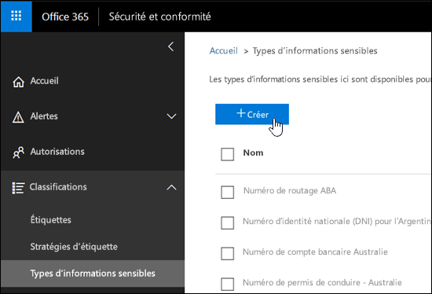
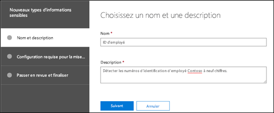
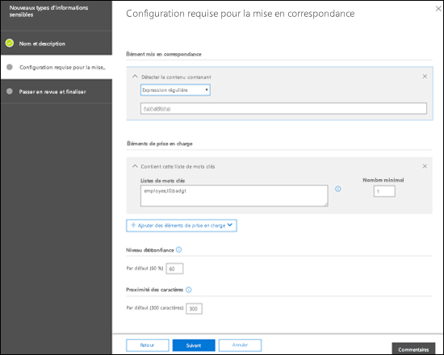
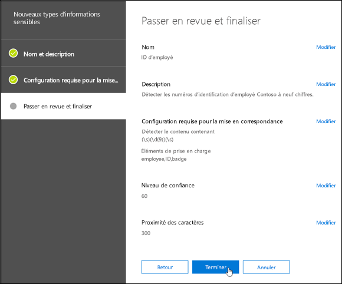
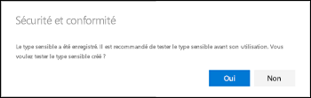
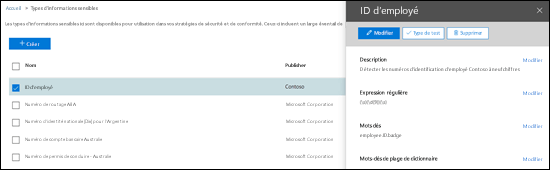
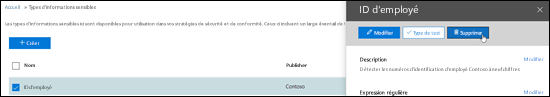
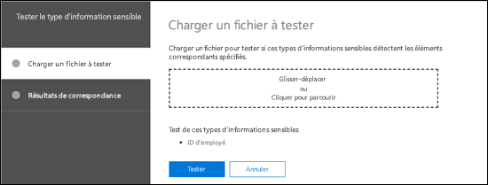
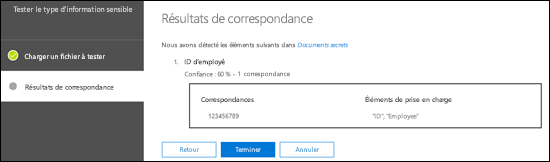

# Créer un type d’informations sensibles personnalisé dans le Centre de Conformité et Sécurité

## Résumé

Lisez cet article pour [créer un type d’informations sensibles personnalisé](custom-sensitive-info-types.md) dans le Centre de Conformité et Sécurité ([https://protection.office.com](https://protection.office.com)). Les types d’informations sensibles personnalisés que vous créez en utilisant cette méthode sont ajoutés au package de règles nommé `Microsoft.SCCManaged.CustomRulePack`.

Vous pouvez également créer des types d’informations sensibles personnalisés à l’aide de PowerShell et de fonctionnalités de correspondance exacte des données. Pour en savoir plus sur ces méthodes, consultez :
- [Créer un type d’informations sensibles personnalisé dans l’interface PowerShell du Centre de sécurité et conformité](create-a-custom-sensitive-information-type-in-scc-powershell.md)
- [Créer un type d’informations sensibles personnalisé pour DLP à l’aide d’une correspondance exacte des données](create-custom-sensitive-info-type-edm.md)

## Avant de commencer...

- Votre organisation doit disposer d’un abonnement, par exemple, Office 365 Entreprise, qui inclut la protection contre la perte de données (DLP). Voir [Description du service Stratégie et conformité de messagerie](https://docs.microsoft.com/office365/servicedescriptions/exchange-online-protection-service-description/messaging-policy-and-compliance-servicedesc). 

- Les types d’informations sensibles personnalisés exigent des connaissances relatives aux expressions régulières (RegEx). Pour plus d’informations sur le moteur Boost.RegEx (anciennement appelé RegEx++) utilisé pour le traitement du texte, consultez l’article [Boost.Regex 5.1.3](https://www.boost.org/doc/libs/1_68_0/libs/regex/doc/html/).

  Le Support technique et Service clientèle Microsoft ne peut pas aider à fournir des définitions de recherche de contenu personnalisées (création de classifications personnalisées ou de modèles d’expressions régulières). Les ingénieurs du support technique peuvent fournir un support limité pour la fonctionnalité (en fournissant, par exemple, des exemples de modèles d’expressions régulières à des fins de test, ou en aidant à résoudre des problèmes avec un modèle d’expression régulière existant ne se déclenchant pas comme prévu), mais ne peuvent pas garantir que le développement de correspondance de contenu personnalisé satisfera vos exigences ou obligations.

- DLP utilise le robot de recherche pour identifier et classer les informations sensibles dans les sites SharePoint Online et OneDrive Entreprise. Pour identifier votre nouveau type d’informations sensibles personnalisé dans le contenu existant, le contenu doit être de nouveau analysé. La nouvelle analyse du contenu est planifiée mais vous pouvez réanalyser manuellement le contenu pour une collection de sites, une liste ou une bibliothèque. Pour plus d’informations, consultez la rubrique relative à la façon de [demander manuellement l’analyse et la réindexation d’un site, d’une bibliothèque ou d’une liste](https://docs.microsoft.com/sharepoint/crawl-site-content).

## Créer un type d’informations sensibles personnalisé dans le Centre de Conformité et Sécurité

Dans le Centre de Conformité et Sécurité, accédez à **Classifications** \> **Types d’informations sensibles** et cliquez sur **Créer**.

Les paramètres sont relativement évidents. Ils sont décrits sur la page associée de l’Assistant :

- **Nom**

- **Description**

- **Proximité**

- **Niveau de confiance**

- **Élément de modèle principal** (mots clés, expression régulière ou dictionnaire)

- Facultatif **Éléments de modèle pris en charge** (mots clés, expression régulière ou dictionnaire) et une valeur de **Coût minimum** correspondante.

Voici un scénario : vous souhaitez créer un type d’informations sensibles personnalisé qui détecte les numéros d’identification d’employé à 9 chiffres dans un contenu, ainsi que les mots clés « employé », « ID » et « badge ». Pour créer ce type d’informations sensibles personnalisé, procédez comme suit :

1. Dans le Centre de conformité et sécurité, accédez à **Classifications** \> **Types d’informations sensibles** et cliquez sur **Créer**.

    

2. Sur la page **Choisir un nom et une description** qui s’ouvre, entrez les valeurs suivantes :

  - **Nom** : ID d’employé.

  - **Description** : détecte les numéros d’identification d’employé Contoso à neuf chiffres.

    

    Lorsque vous avez terminé, cliquez sur **Suivant**.

3. Sur la page **Conditions requises pour la correspondance** qui s’ouvre, cliquez sur **Ajouter un élément** et configurez les paramètres suivants :

    - **Détecter le contenu contenant** :
 
      a. Cliquez sur **L’un de ces éléments** et sélectionnez **Expression régulière**.

      b. Dans la zone de l’expression régulière, entrez `(\s)(\d{9})(\s)` (numéros à neuf chiffres encadrés d’un espace blanc)
  
    - **Éléments de prise en charge** : cliquez sur **Ajouter des éléments de prise en charge** et sélectionnez **Contient cette liste de mots clés**.

    - Dans la zone **Contient cette liste de mots clés** qui s’affiche, configurez les paramètres suivants :

      - **Liste de mots clés** : saisissez la valeur suivante : employé, ID, badge.

      - **Nombre minimal** : conservez la valeur par défaut 1.

    - Conservez la valeur par défaut **Niveau de confiance** 60. 

    - Conservez la valeur par défaut **Caractère de proximité** 300.

    

    Lorsque vous avez terminé, cliquez sur **Suivant**.

4. Sur la page **Revoir et finaliser** qui s’affiche, passez en revue les paramètres, puis cliquez sur **Terminer**.

    

5. La page suivante vous encourage à tester le nouveau type d’informations sensibles personnalisés en cliquant sur **Oui**. Pour plus d’informations, reportez-vous à l’article [Tester des types d’informations sensibles personnalisés dans le Centre de conformité et sécurité](#test-custom-sensitive-information-types-in-the-security--compliance-center). Sinon, cliquez sur **Non**.

    

### Comment savoir si cela a fonctionné ?

Pour vérifier que vous avez correctement créé un nouveau type d’informations sensibles, effectuez l’une des opérations suivantes :

  - Accédez à **Classifications** \> **Types d’informations sensibles** et vérifiez que le nouveau type d’informations sensibles personnalisé apparaît.

  - Testez le nouveau type d’informations sensibles personnalisés. Pour plus d’informations, reportez-vous à la rubrique [Tester des types d’informations sensibles personnalisés dans le Centre de Conformité et Sécurité](#test-custom-sensitive-information-types-in-the-security--compliance-center).

## Modifier des types d’informations sensibles personnalisés dans le Centre de conformité et sécurité

**Remarques** :

- Vous pouvez modifier uniquement les types d’informations sensibles personnalisés ; vous ne pouvez pas modifier les types d’informations sensibles intégrés. Cependant, vous pouvez utiliser PowerShell pour exporter des types d’informations sensibles personnalisés intégrés, les personnaliser et les importer comme types d’informations sensibles personnalisés. Pour plus d’informations, consultez la rubrique [Personnaliser un type d’informations sensibles intégré](customize-a-built-in-sensitive-information-type.md).

- Vous pouvez uniquement modifier les types d’informations sensibles personnalisés que vous avez créés dans l’interface utilisateur. Si vous avez utilisé la [procédure PowerShell](create-a-custom-sensitive-information-type-in-scc-powershell.md) pour importer un package de règles pour les types d’informations sensibles personnalisés, vous recevrez une erreur.

Dans le Centre de conformité et sécurité, accédez à **Classifications** \> **Types d’informations sensibles**, sélectionnez le type d’informations sensibles personnalisé à modifier, puis cliquez sur **Modifier**.

  

Les mêmes options sont disponibles ici comme lorsque vous avez créé le type d’informations sensibles personnalisé dans le Centre de Conformité et Sécurité. Pour plus d’informations, consultez la rubrique [Créer un type d’informations sensibles personnalisé dans le Centre de Conformité et Sécurité](#create-custom-sensitive-information-types-in-the-security--compliance-center).

### Comment savoir si cela a fonctionné ?

Pour vérifier que vous avez correctement modifié un type d’informations sensibles, effectuez l’une des opérations suivantes :

  - Accédez à **Classifications** \> **Types d’informations sensibles** pour vérifier les propriétés du type d’informations sensibles personnalisé modifié. 

  - Testez le type d’informations sensibles personnalisés modifié. Pour plus d’informations, reportez-vous à la rubrique [Tester des types d’informations sensibles personnalisés dans le Centre de Conformité et Sécurité](#test-custom-sensitive-information-types-in-the-security--compliance-center).

## Supprimer des types d’informations sensibles personnalisés dans le Centre de Conformité et Sécurité 

**Remarques** :

- Vous pouvez uniquement supprimer des types d’informations sensibles personnalisés ; vous ne pouvez pas supprimer des types d’informations sensibles intégrés.

- Avant de supprimer un type d’informations sensibles personnalisé, vérifiez qu’aucune stratégie DLP ou règle de flux de courrier Exchange (également appelées règles de transport) ne référence toujours le type d’informations sensibles.

1. Dans le Centre de Conformité et Sécurité, accédez à **Classifications** \> **Types d’informations sensibles** et sélectionnez un ou plusieurs types d’informations sensibles personnalisés à supprimer.

2. Dans la boîte de dialogue qui s’ouvre, cliquez sur **Supprimer** (ou **Supprimer des types d’informations sensibles** si vous en avez sélectionnés plusieurs).

    

3. Cliquez sur **Oui** lorsque le message d’avertissement s’affiche.

### Comment savoir si cela a fonctionné ?

Pour vérifier que vous avez supprimé correctement un type d’informations sensibles personnalisé, accédez à **Classifications** \> **Types d’informations sensibles** pour vérifier que le type d’informations sensibles personnalisé n’est plus répertorié.

## Tester des types d’informations sensibles personnalisés dans le Centre de Conformité et Sécurité

1. Dans le Centre de Conformité et Sécurité, accédez à **Classifications** \> **Types d’informations sensibles**.

2. Sélectionnez un ou plusieurs types d’informations sensibles personnalisés à tester. Dans la boîte de dialogue qui s’ouvre, cliquez sur **Type de test** (ou **Tester des types d’informations sensibles** si vous en avez sélectionnés plusieurs).

    

3. Dans la page **Télécharger le fichier à tester** qui s’ouvre, chargez un document à tester en faisant glisser un fichier ou en cliquant sur **Parcourir** et en sélectionnant un fichier.

    

4. Cliquez sur le bouton **Tester** pour rechercher des modèles dans le fichier.

5. Sur la page **Mettre en correspondance les résultats**, cliquez sur **Terminer**.

    