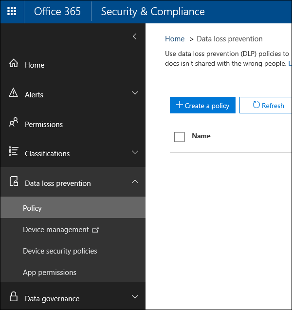
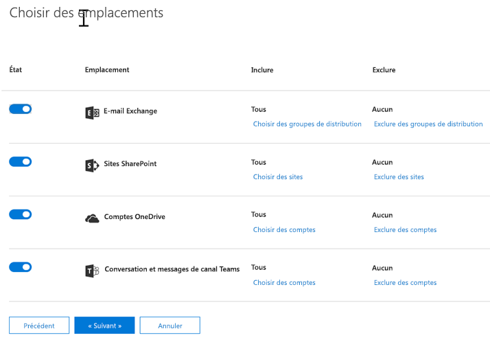
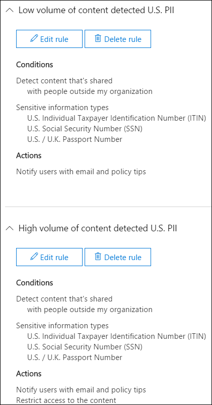
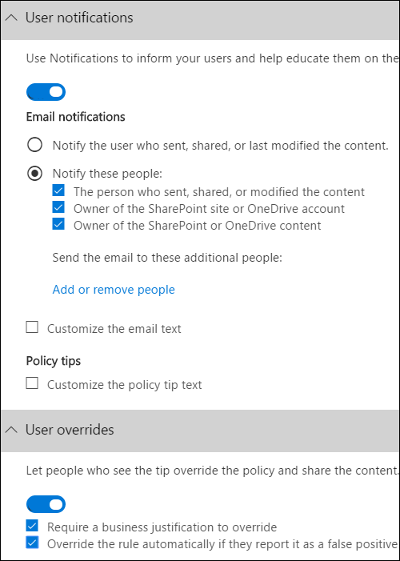
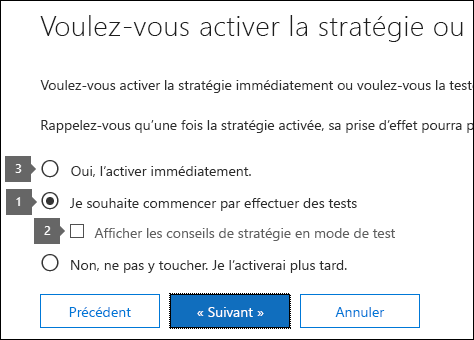

# Création d'une stratégie DLP à partir d'un modèle

La façon la plus simple et la plus courante de démarrer avec les stratégies DLP consiste à utiliser l’un des modèles inclus dans Office 365. Vous pouvez utiliser l'un de ces modèles tel quel, ou personnaliser les règles pour répondre aux exigences de conformité spécifiques de votre organisation.
  
Office 365 comprend plus de 40 modèles prêts à l’emploi qui peuvent vous aider à répondre à toute une variété de besoins réglementaires et professionnels courants en matière de stratégies. Par exemple, il existe des modèles de stratégie DLP pour :
  
- La loi Gramm-Leach-Bliley Act (GLBA)
    
- La norme Payment Card Industry Data Security Standard (PCI-DSS)
    
- Les informations d’identification personnelle aux États-Unis (U.S. PII)
    
- La loi Health Insurance Act (HIPAA) aux États-Unis
    
Vous pouvez affiner un modèle en modifiant les règles existantes ou en ajoutant de nouvelles règles. Par exemple, vous pouvez ajouter de nouveaux types d’informations sensibles à une règle, modifier les décomptes dans une règle pour rendre son déclenchement plus facile ou plus difficile, permettre aux utilisateurs de remplacer les actions d’une règle en fournissant une justification ou modifier les destinataires des notifications et des rapports d’incident. Un modèle de stratégie DLP est un point de départ flexible pour de nombreux scénarios de conformité courants.
  
Vous pouvez également choisir le modèle personnalisé, sans règle par défaut, et configurer votre stratégie DLP de A à Z, pour répondre aux exigences de conformité spécifiques de votre organisation.
  
## Exemple: identifier les informations sensibles sur tous les sites OneDrive entreprise et restreindre l'accès pour les personnes extérieures à votre organisation

Les comptes OneDrive entreprise permettent aux personnes de votre organisation de collaborer et de partager facilement des documents. Toutefois, une préoccupation commune pour les responsables de la mise en conformité est que les informations sensibles stockées dans des comptes OneDrive entreprise peuvent être partagées par inadvertance avec des personnes extérieures à votre organisation. Une stratégie DLP peut aider à réduire ce risque.
  
Dans cet exemple, vous allez créer une stratégie DLP qui identifie les données personnelles américaines, notamment les numéros d'identification des conTribuables (ITIN), les numéros de sécurité sociale et les numéros de passeport des États-Unis. Vous commencerez par utiliser un modèle, puis vous modifierez le modèle pour répondre aux exigences de conformité de votre organisation, notamment:
  
- Ajoutez deux types d'informations sensibles, les numéros de compte bancaire U. S et les numéros de permis de conduire américains, de sorte que la stratégie DLP protège encore davantage vos données sensibles.
    
- Rendez la stratégie plus sensible, afin qu'une seule occurrence d'informations sensibles soit suffisante pour limiter l'accès pour les utilisateurs externes.
    
- Autorisez les utilisateurs à remplacer les actions en fournissant une justification professionnelle ou en signalant un faux positif. De cette manière, votre stratégie DLP n'empêchera pas les personnes de votre organisation de faire leur travail, à condition qu'elles aient une raison commerciale valide pour partager les informations sensibles.
    
### Création d'une stratégie DLP à partir d'un modèle

1. Accédez à la page [https://protection.office.com](https://protection.office.com).
    
2. Connectez-vous à Office 365 à l'aide de votre compte scolaire ou professionnel. Vous êtes maintenant dans le centre de sécurité &amp; conformité Office 365.
    
3. Dans le centre &amp; \> de sécurité conformité, \> **stratégie** \> de **protection contre** \> la perte de données gauche **+ créer une stratégie**.
    
    
  
4. Choisissez le modèle de stratégie DLP qui protège les types d'informations sensibles dont vous \> **** avez besoin.
    
    Dans cet exemple, vous sélectionnerez les données personnelles américaines de **confidentialité** \> **(PII)** car elle inclut déjà la plupart des types d'informations sensibles que vous souhaitez protéger; vous ajouterez un peu plus tard. 
    
    Lorsque vous sélectionnez un modèle, vous pouvez lire la description à droite pour savoir quels types d'informations sensibles le modèle protège.
    
    
  
5. Nommez la \> stratégie **suivante**.
    
6. Pour choisir les emplacements que la stratégie DLP doit protéger, effectuez l'une des opérations suivantes:
    
  - choisissez **tous les emplacements dans Office 365** \> ****.
    
  - Choisissez **me laisser choisir des emplacements** \> **** spécifiques. Pour cet exemple, choisissez ceci.
    
    Pour inclure ou exclure un emplacement entier, tel que tous les messages électroniques Exchange ou tous les comptes OneDrive, activez ou désactivez l' **État** de cet emplacement. 
    
    Pour inclure uniquement des sites SharePoint spécifiques ou des comptes OneDrive entreprise, changez l' **État** en activé, puis cliquez sur les liens sous **inclure** pour choisir des sites ou des comptes spécifiques. Lorsque vous appliquez une stratégie à un site, les règles configurées dans cette stratégie sont automatiquement appliquées à tous les sous-sites de ce site. 
    
    
  
    Dans cet exemple, pour protéger les informations sensibles stockées dans tous les comptes OneDrive entreprise, désactivez l' **État** de la **messagerie Exchange** et des **sites SharePoint**, et conservez l' **État** pour les **comptes onedrive**.
    
7. Sélectionnez **utiliser les paramètres** \> avancés **suivant**.
    
8. Un modèle de stratégie DLP contient des règles prédéfinies avec les conditions et actions qui détectent et agissent sur des types spécifiques d’informations sensibles. Vous pouvez modifier, supprimer ou désactiver les règles existantes, ou en ajouter de nouvelles. Lorsque vous avez fini, cliquez sur **suivant**.
    
    
  
    Dans cet exemple, le modèle de données PII américain comprend deux règles prédéfinies:
    
  - **Faible volume de contenu détecté par les données personnelles américaines** Cette règle recherche les fichiers qui contiennent entre 1 et 10 occurrences de chacun des trois types d'informations sensibles (ITIN, SSN et les numéros de passeport américain), où les fichiers sont partagés avec des personnes extérieures à l'organisation. Si elle est trouvée, la règle envoie une notification par courrier électronique à l'administrateur principal de la collection de sites, au propriétaire du document et à la personne qui a modifié le document pour la dernière fois. 
    
  - **Volume élevé de contenu détecté par les données personnelles américaines** Cette règle recherche des fichiers contenant 10 ou plusieurs occurrences de chacun des trois mêmes types d'informations sensibles, où les fichiers sont partagés avec des personnes extérieures à l'organisation. Si cette action est trouvée, elle envoie également une notification par courrier électronique, plus limite l'accès au fichier. Pour le contenu d'un compte OneDrive entreprise, cela signifie que les autorisations pour le document sont restreintes pour tout le monde sauf pour l'administrateur principal de la collection de sites, le propriétaire du document et la dernière personne qui a modifié le document. 
    
    Pour répondre aux besoins spécifiques de votre organisation, vous pouvez faire en sorte que les règles soient déclenchées de manière plus facile, afin qu'une seule occurrence d'informations sensibles soit suffisante pour bloquer l'accès pour les utilisateurs externes. Après avoir examiné ces règles, vous comprenez que vous n'avez pas besoin de règles de comptage faibles et élevés: vous n'avez besoin que d'une seule règle qui bloque l'accès si une occurrence d'informations sensibles est trouvée.
    
    Vous développez la règle nommée **low volume of content detected U.S.** \> **delete rule**.
    
    
  
9. À présent, dans cet exemple, vous devez ajouter deux types d'informations sensibles (numéros de compte bancaire américain et numéro de permis de conduire américain), autoriser les utilisateurs à remplacer une règle et modifier le compte par une occurrence quelconque. Pour ce faire, vous pouvez modifier une règle, ainsi, sélectionnez **volume élevé de contenu détecté** \> ****.
    
    
  
10. Pour ajouter un type d'informations sensibles, dans **** la section \> conditions, **ajoutez ou modifiez des types**. Ensuite, sous **Ajouter ou modifier des types** \> , choisissez **Ajouter** \> **** \> **** sélectionnez le **numéro de compte bancaire américain** et le **numéro** \> de permis de conduire du pilote américain.
    
    
  
    
  
11. Pour modifier le nombre (le nombre d'instances d'informations sensibles requises pour déclencher la règle), sous **nombre** \> d'instances, choisissez la valeur **minimale** pour \> chaque type entrez 1. Le nombre minimal ne peut pas être vide. Le nombre maximal peut être vide; une valeur **maximale** vide est convertie en **any**.
    
    Lorsque vous avez terminé, le nombre minimal pour tous les types d'informations sensibles doit être **1** et le nombre maximal doit être **any**. En d'autres termes, toutes les occurrences de ce type d'informations sensibles satisfont à cette condition.
    
    
  
12. Pour la personnalisation finale, vous ne souhaitez pas que vos stratégies DLP empêchent les personnes d'effectuer leur travail lorsqu'elles ont une justification professionnelle valide ou rencontrent un faux positif, de sorte que vous souhaitez que la notification utilisateur inclue les options permettant de remplacer l'action de blocage.
    
    Dans la section notifications de l' **utilisateur** , vous pouvez voir que les notifications par courrier électronique et les conseils de stratégie sont activés par défaut pour cette règle dans le modèle. 
    
    Dans la section substitutions de l' **utilisateur** , vous pouvez voir que les substitutions pour une justification professionnelle sont activées, mais les remplacements pour signaler des faux positifs ne le sont pas. Choisissez **remplacer automatiquement la règle si elle la signale comme faux positif**.
    
    
  
13. En haut de l'éditeur de règles, modifiez le nom de cette règle à partir du **volume élevé par défaut de contenu détecté** par les informations personnelles américaines vers le **contenu détecté avec les données personnelles américaines** , car il est désormais déclenché par une occurrence de ses types d'informations sensibles. 
    
14. En bas de l'éditeur \> de règle, **Enregistrez**.
    
15. Passez en revue les conditions et les actions \> **** de cette règle.
    
    À droite, notez le commutateur d' **État** de la règle. Si vous désactivez une stratégie entière, toutes les règles contenues dans la stratégie sont également désactivées. Toutefois, vous pouvez désactiver une règle spécifique sans désactiver toute la stratégie. Cela peut être utile lorsque vous avez besoin d’examiner une règle qui génère un grand nombre de faux positifs. 
    
16. Sur la page suivante, lisez et comprenez les éléments suivants, puis choisissez s'il \> **** faut activer la règle ou la tester.
    
     Avant de créer vos stratégies DLP, vous devez envisager de les déployer progressivement pour évaluer leur impact et tester leur efficacité avant de les appliquer pleinement. Par exemple, vous ne souhaitez pas qu'une nouvelle stratégie DLP bloque involontairement l'accès à des milliers de documents dont les utilisateurs ont besoin pour effectuer leur travail. 
    
    Si vous créez des stratégies DLP avec un impact potentiel important, nous vous recommandons de suivre cette séquence:
    
17. Démarrez en mode test sans conseil de stratégie, puis utilisez les rapports DLP pour évaluer l’impact. Vous pouvez utiliser les rapports DLP pour connaître le nombre, l’emplacement, le type et la gravité des correspondances de stratégie. En fonction des résultats, vous pouvez affiner les règles, si nécessaire. En mode test, les stratégies DLP n’auront aucun impact sur la productivité des personnes qui travaillent dans votre organisation. 
    
18. Passez en mode test avec notifications et conseils de stratégie pour commencer à faire découvrir vos stratégies de conformité aux utilisateurs et les préparer pour les règles qui vont être appliquées. À ce stade, vous pouvez également demander aux utilisateurs de signaler les faux positifs afin d’affiner les règles.
    
19. Activez les stratégies de manière à ce que les règles soient appliquées et que le contenu soit protégé. Continuez à surveiller les rapports DLP et tous les rapports d’incident ou notifications pour vous assurer que les résultats correspondent à vos attentes. 
    
    
  
20. Vérifiez vos paramètres pour cette stratégie \> choisissez **créer**.
    
Une fois que vous avez créé et activé une stratégie DLP, elle est déployée sur les sources de contenu qu'elle comprend, telles que les sites SharePoint Online ou OneDrive entreprise, où la stratégie commence à appliquer automatiquement ses règles sur ce contenu.
  
## Affichage de l’état d’une stratégie DLP

À tout moment, vous pouvez afficher l'état de vos stratégies DLP dans la page **stratégie** de la section **protection contre la perte de données** du centre de sécurité &amp; et de conformité. Vous y trouverez des informations importantes vous indiquant, par exemple, si une stratégie a bien été activée ou désactivée, et si elle est en mode test. 
  
Voici les différents états et leur signification.
  
|**Status**|**Explication**|
|:-----|:-----|
|**Activation en cours...**   |La stratégie est déployée pour les sources de contenu qu’elle contient. La stratégie n’est pas encore appliquée sur toutes les sources.    |
|**Test en cours, avec notifications**   |La stratégie est en mode test. Les actions dans une règle ne sont pas appliquées, mais les correspondances de stratégie sont collectées et peuvent être consultées à l’aide des rapports DLP. Les notifications sur les correspondances de stratégie sont envoyées aux destinataires spécifiés.    |
|**Test en cours, sans notifications**   |La stratégie est en mode test. Les actions dans une règle ne sont pas appliquées, mais les correspondances de stratégie sont collectées et peuvent être consultées à l’aide des rapports DLP. Les notifications sur les correspondances de stratégie ne sont pas envoyées aux destinataires spécifiés.    |
|**On**   |La stratégie est appliquée et active. La stratégie a été correctement déployée sur toutes ses sources de contenu.    |
|**Désactivation en cours...**   |La stratégie est supprimée des sources de contenu qu’elle contient. La stratégie peut être toujours active et appliquée sur certaines sources. La désactivation d’une stratégie peut prendre jusqu’à 45 minutes.    |
|**Off**   |La stratégie n’est pas active et n’est pas appliquée. Les paramètres de la stratégie (sources, mots clés, durée, etc.) sont enregistrés.    |
|**Suppression...**   |La stratégie est en cours de suppression. La stratégie n’est pas active et n’est pas appliquée.    |
   
## Désactivation d’une stratégie DLP

Vous pouvez modifier ou désactiver une stratégie DLP à tout moment. La désactivation d'une stratégie désactive toutes les règles de la stratégie.
  
Pour modifier ou désactiver une stratégie DLP, dans la page **** \> stratégie, sélectionnez la \> **stratégie modifier**la stratégie.
  

  
En outre, vous pouvez désactiver chaque règle individuellement en modifiant la stratégie, puis en désactivant l' **État** de cette règle, comme décrit ci-dessus. 
  
## Plus d’informations

- [Vue d’ensemble des stratégies de protection contre la perte de données](data-loss-prevention-policies.md)
    
- [Envoi des notifications et affichage des conseils de stratégie pour les stratégies DLP](use-notifications-and-policy-tips.md)
    
- [Créer une stratégie DLP pour protéger les documents avec l’ICF ou d’autres propriétés](protect-documents-that-have-fci-or-other-properties.md)
    
- [Contenu des modèles de stratégie DLP](what-the-dlp-policy-templates-include.md)
    
- [Inventaire des types d'informations sensibles](what-the-sensitive-information-types-look-for.md)
    

