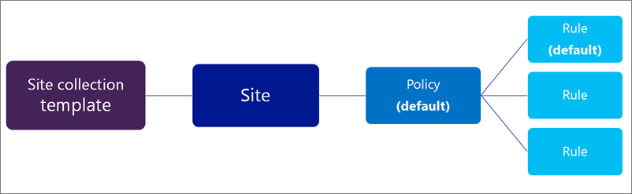
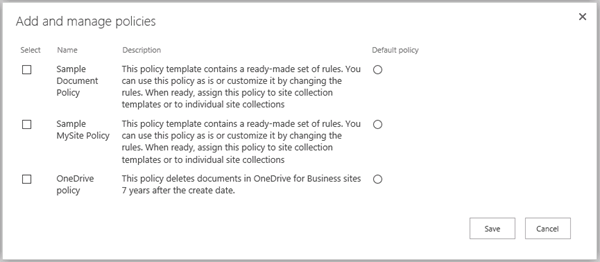
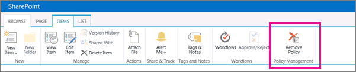

# Création d’une stratégie de suppression de documentsCreate a document deletion policy

> [!IMPORTANT]
> Pour aller plus loin, nous vous recommandons d’utiliser une stratégie de rétention ou des étiquettes de rétention créées dans le centre de conformité Microsoft 365 &amp; , le centre de sécurité Microsoft 365 ou le centre de sécurité conformité Office 365 au lieu d’une stratégie de suppression de documents.Moving forward, we recommend that you use a retention policy or retention labels created in the Microsoft 365 compliance center, Microsoft 365 security center, or Office 365 Security &amp; Compliance Center instead of a document deletion policy. Les stratégies de suppression de documents continueront à fonctionner côte à côte avec des stratégies de rétention, mais si vous devez conserver ou supprimer du contenu n’importe où dans Office 365, nous vous recommandons d’utiliser une stratégie de rétention.Document deletion policies will continue to work side by side with retention policies, but if you need to retain or delete content anywhere in Office 365, we recommend that you use a retention policy. Pour plus d’informations, consultez [la rubrique utiliser une stratégie de rétention au lieu de ces fonctionnalités](retention-policies.md#use-a-retention-policy-instead-of-these-features).For more information, see [Use a retention policy instead of these features](retention-policies.md#use-a-retention-policy-instead-of-these-features). 
  
Les organisations doivent souvent conserver des documents pendant une certaine période de temps en raison des réglementations de conformité, juridiques, ou autres. Toutefois, conserver des documents plus longtemps que nécessaire peut exposer l’organisation à un risque juridique.Organizations are often required to retain documents for a certain period of time due to compliance, legal, or other regulations. However, retaining documents for longer than required can expose the organization to legal risk.
  
Avec une stratégie de suppression de documents, vous pouvez réduire de manière proactive les risques en supprimant des documents dans un site après une période de temps spécifique (par exemple, vous pouvez supprimer des documents dans les sites OneDrive entreprise de l’utilisateur cinq ans après la création des documents).With a document deletion policy, you can proactively reduce risk by deleting documents in a site after a specific period of time—for example, you can delete documents in users' OneDrive for Business sites five years after the documents were created. 
  
Après avoir créé une stratégie de suppression de documents, vous pouvez l’affecter à un modèle de collection de sites, pour que la stratégie soit disponible pour toutes les collections de sites créées à partir de ce modèle. Vous pouvez également affecter une stratégie à une collection de sites spécifique, qui remplace toutes les stratégies qui ont pu être affectées au modèle pour cette collection de sites.After you create a document deletion policy, you can assign it to a site collection template, so that the policy is available to all site collections created from that template. You can also assign a policy to a specific a site collection, which overrides any policies that may have been assigned to the template for that site collection.
  

  
## Modèles de stratégiePolicy templates

Vous pouvez créer une stratégie de suppression de document de A à Z ou vous pouvez utiliser l’un des exemples de stratégie. Le Centre des stratégies de conformité inclut des exemples de stratégie que vous pouvez utiliser en l’état ou que vous pouvez utiliser comme point de départ, pour ensuite les renommer ou les modifier.You can create a document deletion policy from scratch, or you can use one of the sample policies. The Compliance Policy Center includes sample policies that you can use as is, or you can use them as a starting point and then rename or modify them.
  

  
## ExemplesExamples of how to use document deletion policies

Une collection de sites ou un modèle de collection de sites peut avoir plusieurs stratégies qui lui sont affectées, et chacune de ces stratégies peut avoir une ou plusieurs règles.A site collection or a site collection template can have one more policies assigned to it, and each of those policies can have one or more rules. Toutefois, il ne peut y avoir qu’une seule stratégie active par site, et il ne peut y avoir qu’une seule règle de suppression active à tout moment pour les bibliothèques au sein du site.However, there can be only one policy that's active per site, and there can be only one deletion rule that's active at any time for the libraries within the site.
  

  
En outre, vous pouvez sélectionner une stratégie comme stratégie obligatoire ou par défaut, et vous pouvez sélectionner une règle de suppression comme règle par défaut :In addition, you can select a policy as mandatory or default, and you can select a deletion rule as a default rule: 
  
- **Stratégie obligatoire** Lorsqu’une stratégie est marquée comme obligatoire, une seule stratégie peut être affectée à la collection de sites ou au modèle.**Mandatory policy**When a policy is marked as mandatory, only one policy can be assigned to the site collection or template. La stratégie doit être marquée comme valeur par défaut et sera appliquée à tous les sites.The policy must be marked as default and will be applied to all sites. Les propriétaires de sites ne peuvent pas refuser la stratégie.Site owners cannot opt out of the policy.
    
- **Stratégie par défaut** Lorsqu’une stratégie est définie par défaut, la stratégie est automatiquement active dans tous les sites auxquels elle est affectée sans action requise par le propriétaire du site.**Default policy**When a policy is set as default, the policy is automatically active in all sites that it's assigned to with no action required by site owner.
    
- **Règle par défaut** Lorsqu’une règle de suppression est définie par défaut, elle est automatiquement appliquée à toutes les bibliothèques dans les sites qui utilisent la stratégie.**Default rule**When a deletion rule is set as default, it is automatically applied to all libraries in the sites that use the policy.
    
Les exemples suivants expliquent quand vous pouvez utiliser une stratégie obligatoire ou des stratégies et règles par défaut.The following examples explain when you might want to use a mandatory policy or default policies and rules.
  
### Exemple 1 : Appliquer une stratégie unique avec une règle unique à un modèle de collection de sitesExample 1: Apply a single policy with a single rule to a site collection template

Vous pouvez appliquer une stratégie de suppression de documents à un large éventail de contenus non structurés (tous les sites OneDrive Entreprise ou tous les sites d’équipe, par exemple). Si vous souhaitez vous assurer qu’une stratégie de suppression de documents unique est active dans tous les sites créés à partir d’un modèle de collection de sites, vous pouvez :You may want to enforce a document deletion policy across a broad range of unstructured content, such as all OneDrive for Business sites or all team sites. If you want to ensure that a single document deletion policy is active in all sites created from a site collection template, you can:
  
1. créer une stratégie unique avec une règle de suppression par défaut unique ;Create a single policy with a single default deletion rule.
    
2. définir la stratégie comme étant obligatoire et par défaut ;Set the policy as mandatory and default.
    
3. affecter la stratégie à un modèle de collection de sites.Assign the policy to a site collection template.
    
Dans cet exemple, la règle de suppression par défaut sera appliquée à toutes les bibliothèques dans toutes les collections de sites créées à partir du modèle, et les propriétaires de sites ne peuvent pas refuser la stratégie. Il s’agit de la façon la plus simple d’appliquer de façon large et rigide une stratégie de suppression de documents.In this example, the default deletion rule will be applied to all libraries in all site collections created from the template, and site owners cannot opt out of the policy. This is the simplest way to broadly and rigidly enforce a document deletion policy.
  

  
### Exemple 2: appliquer une stratégie unique avec plusieurs règles à un modèle de collection de sitesExample 2: Apply a single policy with several rules to a site collection template

Les propriétaires de sites sont souvent les mieux placés pour savoir quel type de contenu leur site contient, donc vous pouvez choisir de les autoriser à sélectionner la règle de suppression qui s’applique le mieux à leur site. Vous pouvez également autoriser les propriétaires de sites à refuser une stratégie entièrement.Site owners often know best what type of content their site contains, so you may choose to allow site owners to select the deletion rule that best applies to their site. You may also want to allow site owners to opt out of a policy entirely.
  
Simultanément, vous pouvez toujours créer et gérer centralement les stratégies. Vous pouvez également sélectionner une stratégie et une règle comme stratégie et règle par défaut, pour que la stratégie soit toujours active tant que le propriétaire du site n’en choisit pas une autre ou la refuse. Si vous souhaitez offrir une telle flexibilité aux propriétaires de sites, vous pouvez :At the same time, you can still centrally create and manage the policies. You can also select one policy and rule as the default, so that a policy is always in effect until the site owner chooses a different one or opts out. If you want to provide such flexibility to site owners, you can:
  
1. créer une stratégie unique avec plusieurs règles de suppression et définir une règle par défaut ;Create a single policy with several deletion rules, and set one rule as the default.
    
2. définir la stratégie comme stratégie par défaut ;Set the policy as the default policy.
    
3. affecter la stratégie à un modèle de collection de sites.Assign the policy to a site collection template.
    
Les propriétaires de sites peuvent choisir l’une des règles de suppression alternatives, refuser la stratégie, ou ne rien faire et être soumis à la stratégie et à la règle par défaut.Site owners can select one of the alternate deletion rules, opt out of the policy, or do nothing and be subject to the default policy and rule.
  

  
### Exemple 3 : Appliquer plusieurs stratégies avec une ou plusieurs règles à une collection de sitesExample 3: Apply several policies with one or more rules to a site collection

Cet exemple fournit le maximum de flexibilité pour les propriétaires de sites car ils peuvent choisir parmi plusieurs stratégies, et après avoir sélectionné une règle, ils peuvent souvent effectuer un choix parmi plusieurs règles. Une stratégie et une règle sont définies comme stratégie et règle par défaut, pour que la stratégie soit toujours active tant que le propriétaire du site n’en choisit pas une autre ou la refuse. Notez que si vous ne définissez pas une stratégie et une règle par défaut, aucune stratégie ou aucune règle ne sera active pour les bibliothèques de documents dans le site tant que le propriétaire du site ne prendra pas des mesures pour les sélectionner et les appliquer.This example provides the maximum flexibility to site owners because they can choose from several policies, and after selecting a policy they can often choose from several rules. One policy and rule are set as default, so that a policy is always in effect until the site owner chooses a different one or opts out. Note that if you do not set a policy and rule as the default, then no policies or rules will be active for the document libraries in the site until the site owner takes action to select and apply them.
  
Contrairement aux deux exemples précédents, ces stratégies sont affectées à une collection de sites spécifique, et non au modèle de collection de sites. Cela signifie que les stratégies peuvent être adaptées plus spécifiquement au contenu dans une collection de sites donnée.Unlike the previous two examples, these policies are assigned to a specific site collection — not the site collection template. This means the policies can be more specifically tailored for the content in a specific site collection.
  
Les stratégies et les règles sont héritées. Les propriétaires de sites peuvent sélectionner une stratégie et une règle pour leur site, et tous les sous-sites héritent de la stratégie du parent. Toutefois, le propriétaire d’un sous-site peut annuler l’héritage en sélectionnant une stratégie et une règle différentes, qui s’appliquent à leur tour à tous les sous-sites tant que l’héritage n’est pas de nouveau annulé.Policies and rules are inherited. Site owners can select a policy and rule for their site, and all subsites inherit the policy from the parent. However, an owner of a subsite can break inheritance by selecting a different policy and rule, which in turn applies to all subsites until inheritance is broken again.
  
Pour configurer ce scénario, vous pouvez :To set up this scenario, you can:
  
1. créer plusieurs stratégies contenant chacune une ou plusieurs règles ;Create several policies that each contains one or more rules.
    
2. définir une stratégie et une règle par défaut ;Set a policy and rule as the default.
    
3. affecter les stratégies à une collection de sites spécifique.Assign the policies to a specific site collection.
    
En outre, les stratégies et les règles sont adaptées à une collection de sites spécifique, où les propriétaires de sites peuvent annuler l’héritage en sélectionnant la stratégie et la règle qui s’appliquent le mieux à leur site.In addition, the policies and rules are tailored to a specific site collection, where site owners can break inheritance by selecting the policy and rule that best applies to their site.
  

  
## Création d’une stratégie de suppression de documentsCreate a document deletion policy

1. Dans le centre de &amp; conformité Office 365Security, accédez à **conservation**de la **gestion** \> des données.In the Office 365Security &amp; Compliance Center, navigate to **Data management** \> **Retention**. Sous **supprimer**, cliquez sur **gérer les stratégies de suppression de documents pour SharePoint Online et OneDrive entreprise**.Under **Delete**, click **Manage document deletion policies for SharePoint Online and OneDrive for Business**. Le centre de stratégies de suppression de documents s’ouvre dans un nouvel onglet du navigateur.The Document Deletion Policy Center opens in a new browser tab.
    
    La première fois que vous naviguez depuis &amp; le centre de sécurité conformité vers le centre de stratégie de suppression de documents, le centre de stratégies est automatiquement créé pour vous.The first time you navigate from the Security &amp; Compliance Center to the Document Deletion Policy Center, the policy center is automatically created for you. Vous pouvez également créer manuellement le centre de stratégies en [créant la collection de sites](http://go.microsoft.com/fwlink/p/?LinkID=404342) et en choisissant **Centre de stratégies de conformité** sous l’onglet **entreprise** .Alternatively, you can manually create the policy center by [creating the site collection](http://go.microsoft.com/fwlink/p/?LinkID=404342) and choosing **Compliance Policy Center** on the **Enterprise** tab. 
    
2. Choisissez **stratégies de suppression**.Choose **Deletion Policies**.
    
    
  
3. Choisissez **Suivant**.Choose **new item**.
    
4. Entrez un nom de stratégie et une description. Il se peut que les propriétaires de sites choisissent une stratégie pour leur site en fonction de ce nom et de cette description. Par conséquent, donnez suffisamment d’informations pour qu’ils choisissent la stratégie correcte.Enter a policy name and description. Site owners may be selecting a policy for their site based on this name and description, so include enough information for them to choose the correct policy.
    
5. Pour créer une règle, choisissez **Nouveau**.To create a rule, choose **New**.
    
6. Entrez un nom et choisissez les options suivantes :Enter a name and choose the following options:
    
  - Indiquez si la règle supprimera définitivement les documents ou les placera dans la Corbeille.Choose whether the rule will permanently delete documents or delete them to the Recycle Bin. La Corbeille fournit un filet de sécurité de deuxième niveau avant la suppression définitive d’un élément d’un site.The Recycle Bin provides a second-stage safety net before an item is permanently deleted from a site. Pour plus d’informations sur la corbeille, reportez-vous à [la section vidage de la Corbeille ou restauration de vos fichiers](http://go.microsoft.com/fwlink/p/?LinkID=404348).For more information about the Recycle Bin, see [Empty the Recycle Bin or restore your files](http://go.microsoft.com/fwlink/p/?LinkID=404348).
    
  - Indiquez si la date de suppression est calculée à partir de la date de création d’un document ou de la date de dernière modification.Choose whether the deletion date is calculated from the date when a document was created or last modified.
    
  - Entrez un nombre de jours, de mois ou d’années comme période de temps au bout de laquelle un document sera supprimé.Enter a number of days, months, or years as the time period after which a document will be deleted.
    
  - Indiquez si la règle est une règle par défaut. La première règle que vous créez est automatiquement définie comme règle par défaut. Une règle par défaut est appliquée automatiquement à toutes les bibliothèques dans les sites qui utilisent la stratégie.Choose whether the rule is a default rule. The first rule that you create is automatically set as the default rule. A default rule is automatically applied to all libraries in the sites that use the policy.
    

  
7. Cliquez sur **Enregistrer**.Click **Save**.
    
8. Créez des règles supplémentaires si vous souhaitez que les propriétaires de sites puissent choisir différentes règles à appliquer à leur site. La règle par défaut, le cas échéant, s’appliquera si le propriétaire du site n’effectue aucune action.Create additional rules if you want site owners to be able to choose different rules to apply to their site. The default rule, if any, will be applied if the site owner takes no action.
    
9. Pour supprimer une règle d’une stratégie, sélectionnez-la, cliquez sur **supprimer**, puis cliquez sur **OK**.To remove a rule from a policy, select the rule, click **Delete**, and then click **OK**.
    
    > [!NOTE]
    > Si vous supprimez une règle et que la stratégie ne contient pas de règle par défaut, aucune règle n’est appliquée à cette stratégie (en d’autres termes, aucun document n’est supprimé).If you delete a rule, and the policy does not contain a default rule, then no rule will be in effect for that policy—in other words, no documents will be deleted. 
  

  
## Affectation de la stratégie de suppression de documents à un modèle de collection de sitesAssign the document deletion policy to a site collection template

En affectant une stratégie à un modèle de collection de sites, vous mettez la stratégie à la disposition de toutes les collections de sites créées à partir de ce modèle, y compris les collections de sites existantes et les collections de sites créées à l’avenir.By assigning a policy to a site collection template, you make the policy available to all site collections created from that template, including both existing site collections and site collections created in the future.
  
Il est important de comprendre que la période spécifiée pour une stratégie de suppression de documents signifie le temps écoulé depuis que le document a été créé ou modifié, et non le moment où la stratégie a été affectée.It's important to understand that the time period specified for a document deletion policy means the time since the document was created or modified, not the time since the policy was assigned. Lorsque vous affectez la stratégie pour la première fois, tous les documents du site sont évalués et supprimés s’ils répondent aux critères.When you assign the policy for the first time, all documents in the site are evaluated and, if they meet the criteria, they will be deleted. Cela s’applique à tous les documents existants, et non simplement aux documents créés depuis l’affectation de la stratégie.This applies to all existing documents, not just new documents created since the policy was assigned.
  
1. Dans le centre &amp; de sécurité conformité, accédez à **conservation**de **gestion** \> des données.In the Security &amp; Compliance Center, navigate to **Data management** \> **Retention**. Sous **supprimer**, cliquez sur **gérer les stratégies de suppression de documents pour SharePoint Online et OneDrive entreprise**.Under **Delete**, click **Manage document deletion policies for SharePoint Online and OneDrive for Business**. Le centre de stratégies de suppression de documents s’ouvre dans un nouvel onglet du navigateur.The Document Deletion Policy Center opens in a new browser tab.
    
2. Choisissez **Attributions de stratégies pour les modèles**.Choose **Policy Assignments for Templates**.
    
    
  
3. Choisissez **Suivant**.Choose **new item**.
    
4. Effectuez l’une des opérations suivantes :Do one of the following:
    
  - Pour affecter la stratégie à un modèle de collection de sites tel que le modèle de site d’équipe, sélectionnez **Affecter au modèle de collection de sites**, puis sélectionnez le modèle de collection de sites.To assign the policy to a site collection template such as the Team Site template, select **Assign to site collection template**, and then select the site collection template.
    
  - Pour affecter la stratégie à un seul lecteur pour les entreprises, choisissez **affecter au modèle OneDrive entreprise**, mis en surbrillance ci-dessous.To assign the policy to users' One Drive for Business, choose **Assign to OneDrive for Business Template**, highlighted below.
    
    > [!NOTE]
    > Lorsque vous affectez une stratégie à un modèle de collection de sites, cette stratégie est disponible à la fois pour les collections de sites existantes créées à partir de ce modèle et pour les collections de sites créées à l’avenir.When you assign a policy to a site collection template, that policy will be available both to existing site collections created from that template and to site collections created in the future. 
  

  
5. Cliquez sur **Enregistrer**.Click **Save**.
    
    > [!NOTE]
    > Chaque modèle ne peut avoir qu’un seul ensemble de règles qui lui est affecté.Each template can have only one set of policies assigned to it. Si vous voyez une erreur indiquant que ce modèle a déjà des stratégies qui lui sont attribuées, sélectionnez **Annuler** \> l' **affectation à la collection de sites** dans le volet de navigation \> de gauche sélectionnez une collection de sites pour afficher et gérer l’ensemble des stratégies déjà présentes attribuée.If you see an error saying that this template already has policies assigned to it, choose **Cancel** \> **Assign to Site Collection** in the left navigation \> select a site collection to view and manage the set of policies that are already assigned. 
  
6. Choisissez **Gérer les stratégies affectées**, sélectionnez les stratégies à affecter, puis indiquez si une stratégie est la stratégie par défaut.Choose **Manage Assigned Policies**, select the policies that you want to assign, and then choose whether one policy is the default policy. Lorsque vous définissez une stratégie par défaut, tous les sites affectés à la stratégie ont automatiquement la stratégie active sans action requise par le propriétaire du site.When you set a default policy, all sites assigned to the policy automatically have the policy active with no action required by site owner.
    
    
  
7. Cliquez sur **Enregistrer**.Click **Save**.
    
8. Si vous souhaitez appliquer la stratégie sur tous les sites sans autoriser les propriétaires de sites à la refuser, choisissez **Marquer la stratégie comme obligatoire**. Lorsque vous définissez une stratégie comme obligatoire, seule cette stratégie unique peut être affectée au modèle de collection de sites. La stratégie doit également être marquée comme stratégie par défaut.If you want to enforce the policy on all sites without allowing site owners to opt out, choose **Mark Policy as Mandatory**. When you make a policy mandatory, only that single policy can be assigned to the site collection template. The policy must also be marked as default.
    
    Si cette option est grisée, choisissez **Gérer les stratégies affectées** et assurez-vous qu’au moins une stratégie est affectée et définie comme stratégie par défaut.If this option is grayed out, choose **Manage Assigned Policies** and make sure that at least one policy is assigned and set as default. 
    
9. Cliquez sur **Enregistrer**.Click **Save**.
    
## Affectation de la stratégie de suppression de documents à une collection de sitesAssign the document deletion policy to a site collection

En affectant une stratégie à une collection de sites spécifique, vous mettez la stratégie à disposition uniquement de cette collection de sites spécifique. Cela signifie que vous pouvez adapter des stratégies plus étroitement au contenu dans la collection de sites. En outre, les stratégies affectées à une collection de sites spécifique remplacent toutes les stratégies qui sont affectées au modèle pour cette collection de sites. Par exemple, une stratégie affectée à la collection de sites du département des ventes (créée à partir du modèle du site d’équipe) remplace toutes les stratégies affectées au modèle de site d’équipe.By assigning a policy to a specific site collection, you make the policy available only to that specific site collection. This means you can tailor policies more closely to the content in the site collection. Also, policies assigned to a specific site collection will override any policies that are assigned to the template for that site collection. For example, a policy assigned to the Sales Department site collection (created from the Team Site template) will override any policies assigned to the Team Site template.
  
Il est important de comprendre que la période spécifiée pour une stratégie de suppression de documents signifie le temps écoulé depuis que le document a été créé ou modifié, et non le moment où la stratégie a été affectée.It's important to understand that the time period specified for a document deletion policy means the time since the document was created or modified, not the time since the policy was assigned. Lorsque vous affectez la stratégie pour la première fois, tous les documents du site sont évalués et supprimés s’ils répondent aux critères.When you assign the policy for the first time, all documents in the site are evaluated and, if they meet the criteria, they will be deleted. Cela s’applique à tous les documents existants, et non simplement aux documents créés depuis l’affectation de la stratégie.This applies to all existing documents, not just new documents created since the policy was assigned.
  
1. Dans le centre &amp; de sécurité conformité, accédez à **conservation**de **gestion** \> des données.In the Security &amp; Compliance Center, navigate to **Data management** \> **Retention**. Sous **supprimer**, choisissez **gérer les stratégies de suppression de documents pour SharePoint Online et OneDrive entreprise**.Under **Delete**, choose **Manage document deletion policies for SharePoint Online and OneDrive for Business**. Le centre de stratégies de suppression de documents s’ouvre dans un nouvel onglet du navigateur.The Document Deletion Policy Center opens in a new browser tab.
    
2. Choisissez **Attributions de stratégies pour les collections de sites**.Choose **Policy Assignments for Site Collections**.
    
    
  
3. Choisissez **Suivant**.Choose **new item**.
    
4. Choisissez **choisir une collection de sites**.Choose **Choose a site collection**. Recherchez la collection de sites par nom ou URL, sélectionnez la collection de sites, puis cliquez sur **Enregistrer**.Search for the site collection by name or URL, select the site collection and click **Save**.
    
    > [!NOTE]
    > Chaque collection de sites ne peut avoir qu’un seul ensemble de règles qui lui est affecté.Each site collection can have only one set of policies assigned to it. Si vous voyez une erreur indiquant que des stratégies ont déjà été affectées à cette collection de sites, choisissez **Annuler** \> l' **affectation à la collection de sites** et sélectionnez une collection de sites pour afficher et gérer l’ensemble des stratégies déjà affectées.If you see an error saying that this site collection already has policies assigned to it, choose **Cancel** \> **Assign to Site Collection** and select a site collection to view and manage the set of policies that are already assigned. 
  

  
5. Choisissez **Gérer les stratégies affectées**, sélectionnez les stratégies à affecter, puis indiquez si une stratégie est la stratégie par défaut.Choose **Manage Assigned Policies**, select the policies that you want to assign, and then choose whether one policy is the default policy. Lorsque vous définissez une stratégie par défaut, tous les sites affectés à la stratégie ont automatiquement la stratégie active sans action requise par le propriétaire du site.When you set a default policy, all sites assigned to the policy automatically have the policy active with no action required by site owner.
    
    
  
6. Cliquez sur **Enregistrer**.Click **Save**.
    
7. Si vous souhaitez appliquer la stratégie sur tous les sites sans autoriser les propriétaires de sites à refuser, choisissez **Marquer la stratégie comme obligatoire**. Lorsque vous définissez une stratégie comme obligatoire, seule cette stratégie unique peut être affectée à la collection de sites. La stratégie doit également être marquée comme stratégie par défaut.If you want to enforce the policy on all sites without allowing site owners to opt out, choose **Mark Policy as Mandatory**. When you make a policy mandatory, only that single policy can be assigned to the site collection. The policy must also be marked as default.
    
    Si cette option est grisée, choisissez **Gérer les stratégies affectées** et assurez-vous qu’au moins une stratégie est affectée et définie comme stratégie par défaut.If this option is grayed out, choose **Manage Assigned Policies** and make sure that at least one policy is assigned and set as default. 
    
8. Cliquez sur **Enregistrer**.Click **Save**.
    
## Suppression d’une affectation de stratégieDelete a policy assignment

Lorsque vous supprimez une affectation, les stratégies affectées ne s’appliquent plus à aucun site dans la collection de sites ou le modèle de collection de sites.When you delete an assignment, the assigned policies will no longer apply to any sites in the site collection or site collection template.
  
1. Dans le centre &amp; de sécurité conformité, accédez à **conservation**de **gestion** \> des données.In the Security &amp; Compliance Center, navigate to **Data management** \> **Retention**. Sous **supprimer**, choisissez **gérer les stratégies de suppression de documents pour SharePoint Online et OneDrive entreprise**.Under **Delete**, choose **Manage document deletion policies for SharePoint Online and OneDrive for Business**. Le centre de stratégies de suppression de documents s’ouvre dans un nouvel onglet du navigateur.The Document Deletion Policy Center opens in a new browser tab.
    
2. Choisissez **Attributions de stratégies pour les modèles** ou **Attributions de stratégies pour les collections de sites**.Choose either **Policy Assignments for Templates** or **Policy Assignments for Site Collections**.
    
3. Sélectionnez l’élément d’affectation, puis cliquez sur **Supprimer l’élément**.Select the assignment item and click **Delete Item**.
    
    
  
## Suppression d’une stratégieDelete a policy

Vous ne pouvez pas supprimer une stratégie en cours d’utilisation.You can't delete a policy that's in use. Avant de pouvoir supprimer une stratégie, vous devez d’abord supprimer toutes les affectations aux collections de sites et aux modèles de collection de sites qui incluent cette stratégie — consultez la section précédente.Before you can delete a policy, you first need to delete all assignments to site collections and site collection templates that include that policy—see the previous section.
  
1. Dans le centre &amp; \> de sécurité conformité, choisissez **conservation** de la **gestion** \> des \> données dans le volet de navigation de gauche sous **supprimer** \> **gérer les stratégies de suppression de documents pour SharePoint Online et OneDrive pour les entreprises**.In the Security &amp; Compliance Center \> choose **Data management** \> **Retention** in the left navigation \> under **Delete** \> **Manage document deletion policies for SharePoint Online and OneDrive for Business**. Le centre de stratégies de suppression de documents s’ouvre dans un nouvel onglet du navigateur.The Document Deletion Policy Center opens in a new browser tab.
    
2. Choisissez \* \* stratégies de suppression \* \*.Choose \*\* Deletion Policies \*\*.
    
    
  
3. Sélectionnez la stratégie.Select the policy.
    
4. Dans l’onglet \> \*\*\*\* \> éléments du ruban, supprimez la **stratégie**.On the Ribbon \> **Items** tab \> **Remove Policy**.
    
    
  
5. Si la stratégie est en cours d’utilisation, un message vous demande si vous souhaitez supprimer la stratégie de toutes les collections de sites où elle est utilisée.If the policy is in use, you'll be asked if you want to remove the policy from all of the site collections where it's being used. Si vous êtes sûr, choisissez **OK**.If you're sure, choose **OK**.
    
    
  
## Voir égalementSee also

  [Vue d’ensemble des stratégies de suppression de documents](document-deletion-policies.md)[Overview of document deletion policies](document-deletion-policies.md)

[Application ou suppression d’une stratégie de suppression de documents pour un siteApply or remove a document deletion policy for a site](apply-or-remove-a-document-deletion-policy-for-a-site.md)
 

