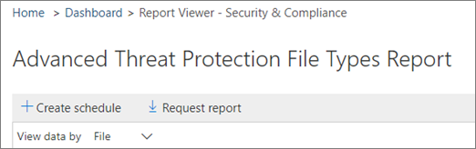

# Créer une planification pour un rapport dans le centre &amp; de sécurité conformité

Dans le centre &amp; de sécurité conformité, plusieurs [rapports et](reports-and-insights-in-security-and-compliance.md) informations sont disponibles pour aider l’équipe de sécurité de votre organisation à réduire et à résoudre les menaces pesant sur votre organisation. Si vous êtes membre de l’équipe de sécurité de votre organisation, vous pouvez créer une planification pour un rapport. La planification que vous créez peut inclure une plage de dates personnalisée pour répondre à votre organisation. 
  
## Créer une planification pour un rapport

> [!IMPORTANT]
> Assurez-vous que vous disposez des autorisations nécessaires pour effectuer cette tâche. En règle générale, les administrateurs globaux Office 365, les administrateurs de la sécurité et les lecteurs de &amp; sécurité peuvent accéder aux rapports dans le centre de sécurité conformité. Pour en savoir plus sur les autorisations, consultez [la rubrique autorisations dans &amp; le centre de sécurité conformité Office 365](permissions-in-the-security-and-compliance-center.md).
  
1. Dans le [Centre &amp; de sécurité conformité](https://protection.office.com), accédez à **rapports** \> de **tableau de bord**.
    
2. Choisissez l’un des rapports suivants: 

    - Correspondances de stratégie DLP
    - Règle de transport Exchange
    - Les faux positifs et les remplacements DLP
    - Types de fichiers ATP Office 365
    - Disposition des messages ATP Office 365
    - Programmes malveillants détectés dans le courrier électronique
    - Principaux programmes malveillants
    - Principaux expéditeurs et destinataires
    - Détections d’usurpation d’identité
    - Détections de courrier indésirable
    - Courrier électronique envoyé et reçu
    - Incidents DLP
    - Rapport de chiffrement

    Pour cet exemple, nous allons choisir le rapport types de fichiers de protection avancée contre les menaces.
    
3. Dans le coin supérieur gauche de l’État, choisissez **+ créer une planification**. 
    
    

    (Remarque: tous les rapports ne disposent pas du bouton **+ créer une planification** .)
  
    La boîte de dialogue **créer une planification** s’ouvre. 
    
4. Conservez les paramètres par défaut et choisissez **créer une planification**, ou choisissez **personnaliser la planification**.
    
    
  
    Si vous choisissez de personnaliser votre planification de rapport, vous pouvez spécifier la fréquence du rapport, l’adresse de messagerie de l’expéditeur et l’adresse de messagerie d’un destinataire. 
    
Une fois que vous avez créé une planification pour un rapport, ce rapport est remis automatiquement par courrier électronique aux adresses de messagerie des destinataires. 
  
## Sujets associés

[Rapports et informations dans le centre de sécurité &amp; conformité Office 365](reports-and-insights-in-security-and-compliance.md)
  
[Gérer les planifications des rapports dans &amp; le centre de sécurité conformité](manage-schedules-for-multiple-reports.md)
  
[Télécharger des rapports existants dans le &amp; Centre de sécurité conformité](download-existing-reports.md)
  
[Télécharger un rapport personnalisé dans le centre &amp; de sécurité conformité](set-up-and-download-a-custom-report.md)
  

