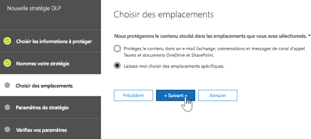
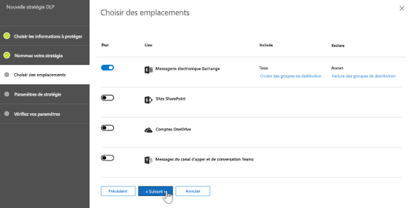
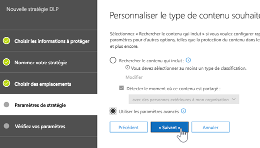
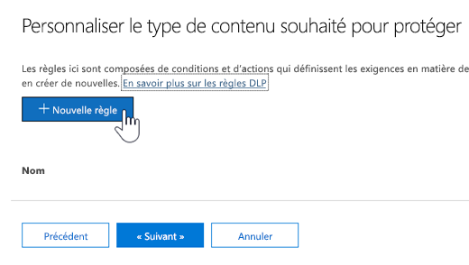
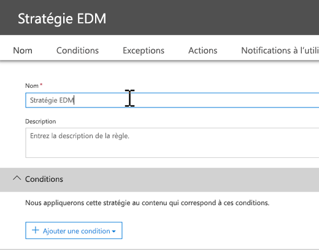
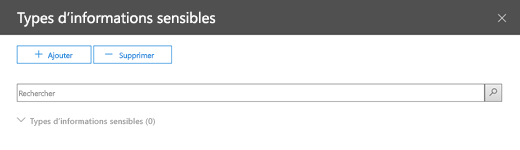

# <a name="create-custom-sensitive-information-types-with-exact-data-match-based-classification-preview"></a>Créer un type d’informations sensibles personnalisé à l’aide d’une correspondance exacte des données (préversion)

## <a name="overview"></a>Vue d’ensemble

[Les types d’informations sensibles personnalisés](custom-sensitive-info-types.md) sont utilisés pour empêcher le partage involontaire ou inapproprié d’informations sensibles. En tant qu’administrateur, vous pouvez utiliser [le centre de sécurité & conformité ](create-a-custom-sensitive-information-type.md)ou[PowerShell](create-a-custom-sensitive-information-type-in-scc-powershell.md) pour définir un type d’informations sensibles personnalisé basé sur des modèles, des preuves (Mots clés tels que *employé*, *badge*,*ID*,etc.),proximité des caractères(comment les preuves sont proches des caractères dans un modèle particulier) et des niveaux de confiance. De tels types d’informations sensibles personnalisés répondent aux besoins professionnels de nombreuses organisations.

Mais que se passe-t-il si vous voulez utiliser un type d’informations sensibles personnalisé qui utilise des valeurs de données exactes au lieu de modèles et de proximité? Avec une classification de correspondance de données exacte (EDM), vous pouvez créer un type d’informations sensibles personnalisé conçu pour:
- être dynamique et actualisable ;
- être plus évolutif ;
- entraîner moins de faux positifs ;
- utiliser des données sensibles structurées ;
- gérer les informations sensibles de façon plus sécurisée, et
- être utilisé avec plusieurs services de cloud computing de Microsoft.


La classification basée sur EDM vous permet de créer des types d’informations sensibles personnalisés qui font référence à des valeurs exactes dans une base de données d’informations sensibles. La base de données peut être actualisée quotidiennement ou hebdomadairement, et peut contenir jusqu’à 10 millions lignes de données. À mesure que les employés, patients ou clients arrivent et changent, et que les enregistrements changent, vos types d’informations sensibles personnalisés restent à jour et applicables. Vous pouvez également utiliser la classification basée sur EDM avec des stratégies, telles [que les stratégies de protection contre la perte de données](data-loss-prevention-policies.md) (DLP) ou [les stratégies de fichier de Microsoft Cloud App Security](https://docs.microsoft.com/cloud-app-security/data-protection-policies).

## <a name="required-licenses-and-permissions"></a>Licences et autorisations requises

- Vous devez être un administrateur général, un administrateur de conformité ou un administrateur Exchange Online pour effectuer les tâches décrites dans cet article. Pour en avoir plus sur les autorisations DLP, consultez la section[Autorisations](data-loss-prevention-policies.md#permissions).

- Lorsque la classification basée sur EDM est généralement disponible, elle est incluse dans les abonnements suivants :
    - Office 365 E5
    - Microsoft 365 E5
    - Conformité et protection des informations Microsoft 365
    - Conformité avancée Office 365

> [!NOTE]
> **La classification basée sur EDM est actuellement en préversion** pour [DLP dans Office 365](data-loss-prevention-policies.md) (avec Exchange Online et Microsoft Teams) et la [sécurité des applications Cloud](https://docs.microsoft.com/cloud-app-security). Si votre organisation dispose [de fonctionnalités DLP](https://docs.microsoft.com/office365/servicedescriptions/exchange-online-protection-service-description/messaging-policy-and-compliance-servicedesc#data-loss-prevention-dlp), vous pouvez essayer la classification basée sur EDM. Si vous ne participez pas déjà à la préversion[, contactez Microsoft](https://resources.office.com/us-landing-spe-contactus.html?LCID=EN-US) pour commencer. 

## <a name="the-work-flow-at-a-glance"></a>Flux de travail en un clin d’œil

|Phase  |De quoi ai-je besoin ?  |
|---------|---------|
|[Partie 1: configurer la classification basée sur EDM](#part-1-set-up-edm-based-classification)<br/><br/>(selon vos besoins)<br/>- [Modifier le schéma de base de données](#editing-the-schema-for-edm-based-classification) <br/>- [Supprimer le schéma](#removing-the-schema-for-edm-based-classification) |-Accès en lecture aux données sensibles<br/>-Schéma de base de données au format. XML (fourni en exemple)<br/>-Package de règles au format. XML (fourni en exemple)<br/>-Autorisations d’administrateur sur le centre de sécurité & conformité (à l’aide de PowerShell) |
|[Partie 2: indexer et télécharger les données sensibles](#part-2-index-and-upload-the-sensitive-data)<br/><br/>(selon vos besoins)<br/>[Actualiser les données](#refreshing-your-sensitive-information-database) |-Groupe de sécurité personnalisé et compte d’utilisateur<br/>-Accès administrateur local à l’ordinateur à l’aide de l’agent de téléchargement EDM<br/>-Accès en lecture aux données sensibles<br/>-Processus et planification pour l’actualisation des données|
|[Partie 3: utiliser la classification basée sur EDM avec vos services Cloud Microsoft](#part-3-use-edm-based-classification-with-your-microsoft-cloud-services) |-Abonnement Office 365 avec DLP<br/>-Fonctionnalité de classification basée sur EDM activée (en préversion) |

## <a name="part-1-set-up-edm-based-classification"></a>Partie 1: configurer la classification basée sur EDM

La préparation et la configuration de la classification basée sur EDM impliquent d’enregistrer des données sensibles au format. csv, de définir un schéma pour votre base de données d’informations sensibles, de créer un package de règles, puis de télécharger le schéma et le package de règles.

### <a name="define-the-schema-for-your-database-of-sensitive-information"></a>Définir le schéma de votre base de données d’informations sensibles

1. Identifier les informations sensibles que vous voulez utiliser. Exporter les données vers une application, telle que Microsoft Excel, et enregistrez le fichier au format. csv. Le fichier de données peut inclure les éléments suivants :

    - Jusqu’à 10 millions de lignes de données sensibles
    - Jusqu’à 32 colonnes (champs) par source de données

2. Structurer les données sensibles dans le fichier. csv de telle sorte que la première ligne inclut les noms des champs utilisés pour la classification basée sur EDM. Votre fichier. csv contient peut-être des noms de champs, tels que «SSN», «BirthDate», «FirstName», «LastName», etc. Par exemple, le fichier. csv est appelé PatientRecords.csvet ses colonnes incluent PatientID, MRN, LastName, FirstName,*SSN*, etc.

3. Définissez le schéma pour la base de données d’informations sensibles au format. XML (comme dans l’exemple ci-dessous). Nommez ce fichier de schéma`edm.xml` et configurez-le de telle sorte que pour chaque colonne de la base de données, une ligne utilise la syntaxe`<Field name="" unique="" searchable=""/>`. 

    - Utilisez les noms de colonne pour les valeurs de *nom de champ*.
    - Utilisez *unique = "true"* pour les champs qui contiennent des valeurs uniques (numéros d’identification de sécurité sociale, numéros d’identification, etc. ). sinon, utilisez*unique = "false"*.
    - Utilisez *searchable="true"* pour les champs que vous voulez rechercher. Ne précisez pas plus de cinq champs par base de données à rechercher. Tout le reste doit avoir *searchable="false"*.  

    Par exemple, le fichier. xml suivant définit le schéma d’une base de données de dossiers de patients, avec cinq champs pouvant faire l’objet d’une recherche : *PatientID*, *MRN*, *SSN*, *Phone*, and *DOB*. 
    
    (Vous pouvez copier, modifier et utiliser notre exemple.)
    
    ```<?xml version="1.0" encoding="utf-8"?> <EdmSchema xmlns="http://schemas.microsoft.com/office/2018/edm">
        <DataStore name="PatientRecords" description="Schéma pour les dossiers des patients" version="1">
            <Field name="PatientID" unique="false" searchable="true" /> <Field name="MRN" unique="false" searchable="true" />
            <Field name="FirstName" unique="false" searchable="false" />
            <Field name="LastName" unique="false" searchable="false" />
            <Field name="SSN" unique="false" searchable="true" />
            <Field name="Phone" unique="false" searchable="true" />
            <Field name="DOB" unique="false" searchable="true" />
            <Field name="Gender" unique="false" searchable="false" />
            <Field name="Address" unique="false" searchable="false" />
        </DataStore>
    </EdmSchema>
    ```

4. [Connect to Office 365 Security & Compliance Center PowerShell](https://docs.microsoft.com/powershell/exchange/office-365-scc/connect-to-scc-powershell/connect-to-scc-powershell?view=exchange-ps).

5. To upload the database schema, run the following cmdlets, one at a time:

    `$edmSchemaXml=Get-Content .\edm.xml -Encoding Byte -ReadCount 0`

    `New-DlpEdmSchema -FileData $edmSchemaXml -Confirm:$true`

    You will be prompted to confirm, as follows:

       Confirm
       Are you sure you want to perform this action?
       New EDM Schema for the data store 'patientrecords' will be imported.
       [Y] Yes  [A] Yes to All  [N] No  [L] No to All  [?] Help (default is "Y"):

    > [!TIP]
    > If you want your changes to occur without confirmation, in Step 5, use this cmdlet instead: `New-DlpEdmSchema -FileData $edmSchemaXml`
    
Now that the schema for your database of sensitive information is defined, the next step is to set up a rule package. Proceed to the section [Set up a rule package](#set-up-a-rule-package).

#### Editing the schema for EDM-based classification 

(As needed) If you want to make changes to your edm.xml file, such as changing which fields are used for EDM-based classification, follow these steps:

1. Edit your edm.mxl file (this is the file discussed in the [Define the schema](#define-the-schema-for-your-database-of-sensitive-information) section of this article).

2. [Connect to Office 365 Security & Compliance Center PowerShell](https://docs.microsoft.com/powershell/exchange/office-365-scc/connect-to-scc-powershell/connect-to-scc-powershell?view=exchange-ps).

3. To update your database schema, run the following cmdlets, one at a time:

    `$edmSchemaXml=Get-Content .\edm.xml -Encoding Byte -ReadCount 0`

    `Set-DlpEdmSchema -FileData $edmSchemaXml -Confirm:$true`

    You will be prompted to confirm, as follows:

       Confirm
       Are you sure you want to perform this action?
       EDM Schema for the data store 'patientrecords' will be updated.
       [Y] Yes  [A] Yes to All  [N] No  [L] No to All  [?] Help (default is "Y"):

    > [!TIP]
    > If you want your changes to occur without confirmation, in Step 3, use this cmdlet instead: `Set-DlpEdmSchema -FileData $edmSchemaXml`

#### Removing the schema for EDM-based classification

(As needed) If you want to remove the schema you're using for EDM-based classification, follow these steps:

1. [Connect to Office 365 Security & Compliance Center PowerShell](https://docs.microsoft.com/powershell/exchange/office-365-scc/connect-to-scc-powershell/connect-to-scc-powershell?view=exchange-ps).

2. Run the following PowerShell cmdlet, substituting the data store name of "patientrecords" with the one you want to remove:

    `Remove-DlpEdmSchema -Identity patientrecords`

     You will be prompted to confirm, as follows:
    
       Confirm
       Are you sure you want to perform this action?
       EDM Schema for the data store 'patientrecords' will be removed.
       [Y] Yes  [A] Yes to All  [N] No  [L] No to All  [?] Help (default is "Y"):
    
    > [!TIP]
    > If you want your changes to occur without confirmation, in Step 2, use this cmdlet instead: `Remove-DlpEdmSchema -Identity patientrecords -Confirm:$false`

### Set up a rule package

1. Create a rule package in .xml format (with Unicode encoding), similar to the following example. (You can copy, modify, and use our example.) 

   Recall from the previous procedure that our PatientRecords schema defines five fields as searchable: *PatientID*, *MRN*, *SSN*, *Phone*, and *DOB*. Our example rule package includes those fields and references the database schema file (edm.xml), with one *ExactMatch* items per searchable field. Consider the following ExactMatch item:

   ```
    <ExactMatch id = "E1CC861E-3FE9-4A58-82DF-4BD259EAB371" patternsProximity = "300" dataStore ="PatientRecords" recommendedConfidence = "65" > <Pattern confidenceLevel="65"> <idMatch matches = "SSN" classification = "U.S. Social Security Number (SSN)" /> </Pattern> </ExactMatch>
   ```

    In this example, note the following:

    - The dataStore name references the .csv file we created earlier: **dataStore = "PatientRecords"**.
    - The idMatch value references a searchable field that is listed in the database schema file: **idMatch matches = "SSN"**.
    - The classification value references an existing or custom sensitive information type: **classification = "U.S. Social Security Number (SSN)"**. (In this case, we use the existing sensitive information type of U.S. Social Security Number.)

    When you set up your rule package, make sure to correctly reference your .csv file and edm.xml file. (You can copy, modify, and use our example.) 

    ```<?xml version="1.0" encoding="utf-8"?>
    <RulePackage xmlns="http://schemas.microsoft.com/office/2018/edm">
      <RulePack id="fd098e03-1796-41a5-8ab6-198c93c62b11">
        <Version build="0" major="2" minor="0" revision="0" />
        <Publisher id="eb553734-8306-44b4-9ad5-c388ad970528" />
        <Details defaultLangCode="en-us">
          <LocalizedDetails langcode="en-us">
            <PublisherName>IP DLP</PublisherName>
            <Name>Health Care EDM Rulepack</Name>
            <Description>This rule package contains the EDM sensitive type for health care sensitive types.</Description>
          </LocalizedDetails>
        </Details>
      </RulePack>
      <Rules>
        <ExactMatch id = "E1CC861E-3FE9-4A58-82DF-4BD259EAB371" patternsProximity = "300" dataStore ="PatientRecords" recommendedConfidence = "65" >
          <Pattern confidenceLevel="65">
            <idMatch matches = "SSN" classification = "U.S. Social Security Number (SSN)" />
          </Pattern>
          <Pattern confidenceLevel="75">
            <idMatch matches = "SSN" classification = "U.S. Social Security Number (SSN)" />
            <Any minMatches ="3" maxMatches ="100">
              <match matches="PatientID" />
              <match matches="MRN"/>
              <match matches="FirstName"/>
              <match matches="LastName"/>
              <match matches="Phone"/>
              <match matches="DOB"/>
            </Any>
          </Pattern>
        </ExactMatch>
        <LocalizedStrings>
          <Resource idRef="E1CC861E-3FE9-4A58-82DF-4BD259EAB371">
            <Name default="true" langcode="en-us">Patient SSN Exact Match.</Name>
            <Description default="true" langcode="en-us">EDM Sensitive type for detecting Patient SSN.</Description>
          </Resource>
        </LocalizedStrings>
      </Rules>
    </RulePackage>
    ```
    
2. Téléchargez le package de règles en exécutant les applets de commande PowerShell suivantes, l’une après l’autre :

    `$rulepack=Get-Content .\rulepack.xml -Encoding Byte -ReadCount 0`

    `New-DlpSensitiveInformationTypeRulePackage -FileData $rulepack`

À ce stade, vous avez configuré la classification basée sur EDM. L’étape suivante consiste à indexer les données sensibles, puis à télécharger les données indexées. 

## <a name="part-2-index-and-upload-the-sensitive-data"></a>Partie 2: indexer et télécharger les données sensibles

Au cours de cette phase, vous configurez un groupe de sécurité personnalisé et un compte d’utilisateur, et configurez l’outil de chargement de l’agent EDM. Utilisez ensuite l’outil pour indexer les données sensibles, puis à télécharger les données indexées.

### <a name="set-up-the-security-group-and-user-account"></a>Configurer le groupe de sécurité personnalisé et compte d’utilisateur

1. En tant qu’administrateur général, accédez au centre d’administration ([https://admin.microsoft.com](https://admin.microsoft.com)) et [créez un groupe de sécurité appelé`EDM_DataUploaders`. 

2. Ajoutez un ou plusieurs utilisateurs au groupe de sécurité*EDM_DataUploaders*. (Ces utilisateurs peuvent gérer la base de données d’informations sensibles.)

3. Assurez-vous que tous les utilisateurs qui gèrent les données sensibles sont un administrateur local sur l’ordinateur utilisé pour l’agent de téléchargement EDM.

### <a name="set-up-the-edm-upload-agent"></a>Configurer l’agent de téléchargement EDM

> [!NOTE]
> Avant de commencer cette procédure, assurez-vous que vous êtes membre du groupe de sécurité *EDM_DataUploaders* et administrateur local sur votre ordinateur.

1. Téléchargez et installez l’agent EDM de chargement sur [https://go.microsoft.com/fwlink/?linkid=2088639](https://go.microsoft.com/fwlink/?linkid=2088639). Par défaut, l’emplacement d’installation doit être`C:\Program Files\Microsoft\EdmUploadAgent`. 

2. Pour autoriser l’agent de téléchargement EDM, ouvrez l’invite de commandes Windows (en tant qu’administrateur), puis exécutez la commande suivante :

    `EdmUploadAgent.exe /Authorize`

3. Connectez-vous à Office 365 à l'aide de votre compte professionnel ou scolaire.

L’étape suivante consiste à utiliser l’agent de téléchargement EDM pour indexer les données sensibles, puis à télécharger les données indexées.

### <a name="index-and-upload-the-sensitive-data"></a>Indexer et télécharger les données sensibles

1. Enregistrez le fichier de données sensibles (notre exemple est *PatientRecords. csv*) sur le disque local sur l’ordinateur. (Nous avons enregistré notre exemple de fichier*PatientRecords.csv dans.)

2. Pour indexer les données sensibles, exécutez la commande suivante dans l’invite de commandes Windows :

    `EdmUploadAgent.exe /CreateHash /DataStoreName <DataStoreName> /DataFile <DataFilePath> /HashLocation <HashedFileLocation>`

    Example: **EdmUploadAgent.exe /CreateHash /DataStoreName PatientRecords /DataFile C:\Edm\Data\PatientRecords.csv /HashLocation C:\Edm\Hash** 

3. Pour charger les données indexées, exécutez la commande suivante dans l’invite de commandes Windows :

    `EdmUploadAgent.exe /UploadHash /DataStoreName <DataStoreName> /HashFile <HashedSourceFilePath>`

    Example: **EdmUploadAgent.exe /UploadHash /DataStoreName PatientRecords /HashFile C:\Edm\Hash\PatientRecords.EdmHash** 

4. Pour vérifier que vos données sensibles ont été téléchargées, exécutez la commande suivante dans l’invite de commandes Windows :

    `EdmUploadAgent.exe /GetDataStore`

    La liste des magasins de données apparaît, ainsi que la date de la dernière mise à jour, comme suit : <br/>

5. Poursuivez la configuration de votre processus et planifiez l’[actualisation de votre base de données d'informations sensibles](#refreshing-your-sensitive-information-database).

À ce stade, vous êtes prêt à utiliser la classification basée sur EDM avec vos services de Cloud Computing Microsoft. Par exemple, vous pouvez [configurer une stratégie DLP à l’aide d’une classification basée sur EDM](#to-create-a-dlp-policy-with-edm). 

### <a name="refreshing-your-sensitive-information-database"></a>Actualisation de votre base de données d’informations sensibles

Vous pouvez actualiser quotidiennement ou hebdomadairement votre base de données d’informations sensibles, et l’outil de chargement EDM peut réindexer les données sensibles, puis recharger les données indexées. 

1. Déterminez vos processus et leur fréquence (quotidien ou hebdomadaire) pour actualiser la base de données d’informations sensibles.

2. Exporter de nouveau les données vers une application, telle que Microsoft Excel, et enregistrez le fichier au format. csv. Conservez le même nom de fichier et l’emplacement que vous avez utilisé lorsque vous avez suivi les étapes décrites dans[indexez et téléchargez les données sensibles](#index-and-upload-the-sensitive-data).

    > [!NOTE]
    > S’il n’y a pas de modifications apportées à la structure (noms de champs) du fichier. csv, vous n’avez pas besoin d’apporter des modifications à votre fichier de schéma de base de données lorsque vous actualisez les données. Si vous devez apporter des modifications, assurez-vous de modifier le[schéma de base de données](#editing-the-schema-for-edm-based-classification) et votre [package de règles](#set-up-a-rule-package)en conséquence.        

3. Utilisez [le planificateur de tâches](https://docs.microsoft.com/windows/desktop/TaskSchd/task-scheduler-start-page) pour automatiser les étapes 2 et 3 dans la procédure[indexer et télécharger les données sensibles](#index-and-upload-the-sensitive-data). Vous pouvez planifier des tâches à l’aide de plusieurs méthodes :
    
    |Méthode  |Procédure  |
    |---------|---------|
    |Windows PowerShell     |Consultez la documentation[ScheduledTasks](https://docs.microsoft.com/powershell/module/scheduledtasks/?view=win10-ps) et l’[exemple de script PowerShell](#example-powershell-script-for-task-scheduler) dans cet article|
    |API planificateur de tâches |Consultez la documentation relative au [planificateur de tâches](https://docs.microsoft.com/windows/desktop/TaskSchd/using-the-task-scheduler) |
    |Interface utilisateur Windows     |Dans Windows, cliquez sur **Démarrer**, puis tapez`Task Scheduler`. Dans la liste des résultats, cliquez avec le bouton droit sur**planificateur de tâches**, puis sélectionnez**exécuter en tant qu’administrateur**.          |

#### <a name="example-powershell-script-for-task-scheduler"></a>Exemple de script PowerShell pour le planificateur de tâches

Cette section inclut un exemple de script PowerShell que vous pouvez utiliser pour planifier vos tâches d’indexation et de chargement des données indexées :

```powershell
param([string]$dataStoreName,[string]$fileLocation)
# Assuming current user is also the user context to run the task
$user = "$env:USERDOMAIN\$env:USERNAME"
$edminstallpath = 'C:\Program Files\Microsoft\EdmUploadAgent\'
$edmuploader = $edminstallpath + 'EdmUploadAgent.exe'
$csvext = '.csv'
$edmext = '.EdmHash'
# Assuming CSV file name is same as data store name
$dataFile = "$fileLocation\$dataStoreName$csvext"
$hashFile = "$fileLocation\$dataStoreName$edmext"
# Assuming location to store hash file is same as the location of csv file
$hashLocation = $fileLocation
$createHashArgs = '/CreateHash /DataStoreName ' + $dataStoreName + ' /DataFile ' + $dataFile + ' /HashLocation ' + $hashLocation
$uploadHashArgs = '/UploadHash /DataStoreName ' + $dataStoreName + ' /HashFile ' + $hashFile
# Set up actions associated with the task
$actions = @()
$actions += New-ScheduledTaskAction -Execute $edmuploader -Argument $createHashArgs -WorkingDirectory $edminstallpath
$actions += New-ScheduledTaskAction -Execute $edmuploader -Argument $uploadHashArgs -WorkingDirectory $edminstallpath
# Set up trigger for the task
$trigger = New-ScheduledTaskTrigger -Weekly -DaysOfWeek Sunday -At 2am
# Set up task settings
$principal = New-ScheduledTaskPrincipal -UserId $user -LogonType S4U -RunLevel Highest
$settings = New-ScheduledTaskSettingsSet -RunOnlyIfNetworkAvailable -StartWhenAvailable -WakeToRun
# Create the scheduled task
$scheduledTask = New-ScheduledTask -Action $actions -Principal $principal -Trigger $trigger -Settings $settings
# Get credentials to run the task
$creds = Get-Credential -UserName $user -Message "Enter credentials to run the task"
$password=[Runtime.InteropServices.Marshal]::PtrToStringAuto([Runtime.InteropServices.Marshal]::SecureStringToBSTR($creds.Password))
# Register the scheduled task
$taskName = 'EDMUpload_' + $dataStoreName
Register-ScheduledTask -TaskName $taskName -InputObject $scheduledTask -User $user -Password $password
```
## <a name="part-3-use-edm-based-classification-with-your-microsoft-cloud-services"></a>Partie 3: utiliser la classification basée sur EDM avec vos services de cloud computing Microsoft

Vous pouvez également utiliser la classification basée sur EDM avec des fonctionnalités de protection d’informations, telles que les [stratégies Office 365 DLP](data-loss-prevention-policies.md) ou [les stratégies de fichier Microsoft Cloud App Security](https://docs.microsoft.com/cloud-app-security/data-protection-policies). La procédure suivante explique comment utiliser EDM avec une stratégie DLP créée dans le centre de sécurité & conformité Office 365.

### <a name="to-create-a-dlp-policy-with-edm"></a>Pour créer une stratégie DLP avec EDM

1. Accédez au centre de sécurité & conformité ([https://protection.office.com](https://protection.office.com)).

2. Cliquez sur **Protection contre la perte de données** > **(Stratégie)**.

3. Sélectionnez créer une stratégie** > **personnaliser** > **suivant.

4. Sous l'onglet**Nommez votre stratégie**, spécifiez un nom et une description, puis sélectionnez**suivant**.

5. Dans le volet **Choisir des emplacements**, cliquez sur **Me laisser choisir des emplacements spécifiques**, puis cliquez sur **Suivant**.<br/><br/>

6. Dans la colonne**État**, sélectionnez **courrier Exchange** uniquement, puis**suivant**. <br/><br/>

7. Sous l'onglet**paramètres de stratégie**, sélectionnez**utiliser les paramètres avancés**, puis **suivant**.<br/><br/>

8. Sélectionnez **+ Nouvelle règle**.<br/><br/>

9. Dans la section**Nom**, spécifiez un nom et une description pour la règle.<br/><br/>

10. Dans la section**conditions**, dans la liste **+ ajouter une condition**, sélectionnez **le contenu contient un type de contenu sensible**.<br/><br/>

11. Recherchez le type d’informations sensibles que vous avez créé lorsque vous avez configuré votre package de règles, puis sélectionnez **+ ajouter**.<br/><br/>Sélectionnez **Terminer**.

12. Terminez de sélectionner les options de votre règle, telles que**notifications d’utilisateur**,**remplacements d’utilisateur**, **rapports d’incident**, puis sélectionnez** Enregistrer**.

13. Sous l'onglet **paramètres de stratégie**, passez en revue vos règles, puis sélectionnez**suivant**.

14. Indiquez si vous voulez activer la stratégie immédiatement, tester celle-ci ou la maintenir désactivée. Sélectionnez **Suivant**.

15. Sous l'onglet **Vérifier vos paramètres**, passez en revue votre stratégie. Apportez les modifications nécessaires. Lorsque vous avez terminé, sélectionnez **Créer**.

    > [!NOTE]
    > Laissez environ une heure pour que votre nouvelle stratégie DLP fonctionne de la même manière dans votre centre de données.

## <a name="related-articles"></a>Articles connexes

[Obtenir la liste des types d’informations sensibles intégrés et ce qu’ils recherchent](what-the-sensitive-information-types-look-for.md)

[Types d’informations sensibles personnalisés](custom-sensitive-info-types.md)

[Vue d’ensemble des stratégies DLP](data-loss-prevention-policies.md)

[Microsoft Cloud App Security](https://docs.microsoft.com/cloud-app-security)
