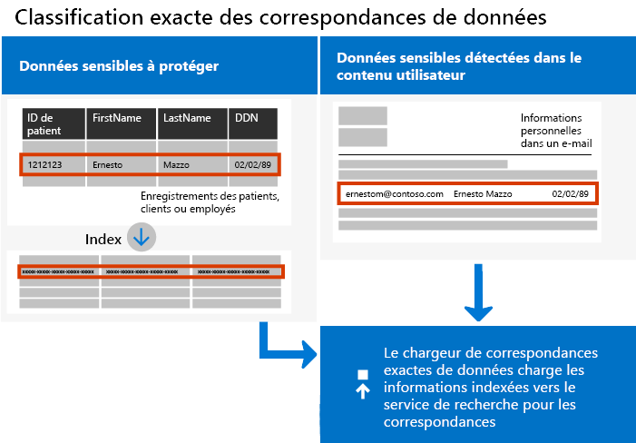
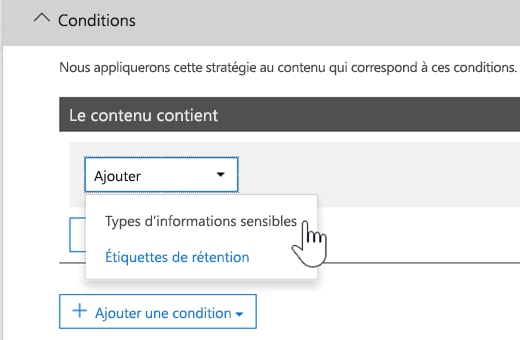

# <a name="create-custom-sensitive-information-types-with-exact-data-match-based-classification"></a><span data-ttu-id="9437d-103">Créez des types d’informations sensibles personnalisés à l’aide d’une classification Exact Data Match.</span><span class="sxs-lookup"><span data-stu-id="9437d-103">See Create a custom sensitive information type with Exact Data Match based classification (Preview).</span></span>

## <a name="overview"></a><span data-ttu-id="9437d-104">Vue d’ensemble</span><span class="sxs-lookup"><span data-stu-id="9437d-104">Overview</span></span>

<span data-ttu-id="9437d-105">Les [types d’informations sensibles personnalisés](https://docs.microsoft.com/fr-FR/office365/securitycompliance/custom-sensitive-info-types)  vous aident à empêcher le partage involontaire ou inapproprié d’informations sensibles.</span><span class="sxs-lookup"><span data-stu-id="9437d-105">[Custom sensitive information types](https://docs.microsoft.com/fr-FR/office365/securitycompliance/custom-sensitive-info-types) are used to help prevent inadvertent or inappropriate sharing of sensitive information.</span></span> <span data-ttu-id="9437d-106">En tant qu’administrateur, vous pouvez utiliser le  [Centre de sécurité et conformité](https://docs.microsoft.com/fr-FR/office365/securitycompliance/create-a-custom-sensitive-information-type)  ou  [PowerShell](https://docs.microsoft.com/fr-FR/office365/securitycompliance/create-a-custom-sensitive-information-type-in-scc-powershell)  pour définir un type d’informations sensibles personnalisé basé sur des modèles, des preuves (mots clés tels que  *employé*,  *badge*,  *ID*, etc.), la proximité de caractère (dans un modèle particulier) et des niveaux de confiance.</span><span class="sxs-lookup"><span data-stu-id="9437d-106">As an administrator, you can use the [Security & Compliance Center](https://docs.microsoft.com/fr-FR/office365/securitycompliance/create-a-custom-sensitive-information-type) or [PowerShell](https://docs.microsoft.com/fr-FR/office365/securitycompliance/create-a-custom-sensitive-information-type-in-scc-powershell) to define a custom sensitive information type based on patterns, evidence (keywords such as *employee*, *badge*, *ID*, and so on), character proximity (how close evidence is to characters in a particular pattern), and confidence levels.</span></span> <span data-ttu-id="9437d-107">De tels types d’informations sensibles personnalisés répondent aux besoins métier de nombreuses organisations.</span><span class="sxs-lookup"><span data-stu-id="9437d-107">Such custom sensitive information types meet business needs for many organizations.</span></span>

<span data-ttu-id="9437d-108">Mais que se passe-t-il si vous voulez utiliser un type d’informations sensibles personnalisé qui utilise des valeurs de données exactes au lieu d’établir une concordance avec des modèles génériques ?</span><span class="sxs-lookup"><span data-stu-id="9437d-108">But what if you wanted a custom sensitive information type that uses exact data values, instead of matching only with generic patterns?</span></span> <span data-ttu-id="9437d-109">Une classification Exact Data Match (EDM) vous permet de créer un type d’informations sensibles personnalisé conçu pour :</span><span class="sxs-lookup"><span data-stu-id="9437d-109">With Exact Data Match (EDM)-based classification, you can create a custom sensitive information type that is designed to:</span></span>

- <span data-ttu-id="9437d-110">être dynamique et actualisable ;</span><span class="sxs-lookup"><span data-stu-id="9437d-110">be dynamic and refreshable;</span></span>
- <span data-ttu-id="9437d-111">être plus évolutif ;</span><span class="sxs-lookup"><span data-stu-id="9437d-111">be more scalable;</span></span>
- <span data-ttu-id="9437d-112">entraîner moins de faux positifs ;</span><span class="sxs-lookup"><span data-stu-id="9437d-112">result in fewer false-positives;</span></span>
- <span data-ttu-id="9437d-113">utiliser des données sensibles structurées ;</span><span class="sxs-lookup"><span data-stu-id="9437d-113">work with structured sensitive data;</span></span>
- <span data-ttu-id="9437d-114">gérer les informations sensibles de façon plus sécurisée, et</span><span class="sxs-lookup"><span data-stu-id="9437d-114">handle sensitive information more securely; and</span></span>
- <span data-ttu-id="9437d-115">être utilisé avec plusieurs services de cloud computing de Microsoft.</span><span class="sxs-lookup"><span data-stu-id="9437d-115">be used with several Microsoft cloud services.</span></span>



<span data-ttu-id="9437d-117">La classification EDM vous permet de créer des types d’informations sensibles personnalisés qui font référence à des valeurs exactes dans une base de données d’informations sensibles.</span><span class="sxs-lookup"><span data-stu-id="9437d-117">EDM-based classification enables you to create custom sensitive information types that refer to exact values in a database of sensitive information.</span></span> <span data-ttu-id="9437d-118">La base de données peut être actualisée quotidiennement ou hebdomadairement, et peut contenir jusqu’à 10 millions lignes de données.</span><span class="sxs-lookup"><span data-stu-id="9437d-118">The database can be refreshed daily or weekly, and it can contain up to 10 million rows of data.</span></span> <span data-ttu-id="9437d-119">À mesure que des employés, patients ou clients vont et viennent, et que les enregistrements changent, vos types d’informations sensibles personnalisés restent à jour et valides.</span><span class="sxs-lookup"><span data-stu-id="9437d-119">So as employees, patients, or clients come and go, and records change, your custom sensitive information types remain current and applicable.</span></span> <span data-ttu-id="9437d-120">Vous pouvez également utiliser une classification EDM avec des stratégies, par exemple, de  [protection contre la perte de données](https://docs.microsoft.com/fr-FR/office365/securitycompliance/data-loss-prevention-policies)  (DLP) ou les stratégies de fichier de  [Microsoft Cloud App Security](https://docs.microsoft.com/cloud-app-security/data-protection-policies).</span><span class="sxs-lookup"><span data-stu-id="9437d-120">And, you can use EDM-based classification with policies, such as [data loss prevention policies](https://docs.microsoft.com/fr-FR/office365/securitycompliance/data-loss-prevention-policies) (DLP) or [Microsoft Cloud App Security file policies](https://docs.microsoft.com/cloud-app-security/data-protection-policies).</span></span>

## <a name="required-licenses-and-permissions"></a><span data-ttu-id="9437d-121">Licences et autorisations requises</span><span class="sxs-lookup"><span data-stu-id="9437d-121">Required licenses and permissions</span></span>

<span data-ttu-id="9437d-122">Pour effectuer les tâches décrites dans cet article, vous devez être un administrateur général, un administrateur de conformité ou un administrateur Exchange Online.</span><span class="sxs-lookup"><span data-stu-id="9437d-122">You must be a global admin, compliance administrator, or Exchange Online administrator to perform the tasks described in this article.</span></span> <span data-ttu-id="9437d-123">Pour en avoir plus sur les autorisations DLP, voir  [Autorisations](https://docs.microsoft.com/fr-FR/office365/securitycompliance/data-loss-prevention-policies#permissions).</span><span class="sxs-lookup"><span data-stu-id="9437d-123">To learn more about DLP permissions, see [Permissions](https://docs.microsoft.com/fr-FR/office365/securitycompliance/data-loss-prevention-policies#permissions).</span></span>

<span data-ttu-id="9437d-124">Dès qu’elle généralement disponible, la classification EDM sera incluse dans les abonnements suivants</span><span class="sxs-lookup"><span data-stu-id="9437d-124">When generally available, EDM-based classification will be included in these subscriptions</span></span>

- <span data-ttu-id="9437d-125">Office 365 E5</span><span class="sxs-lookup"><span data-stu-id="9437d-125">Office 365 Enterprise E5</span></span>
- <span data-ttu-id="9437d-126">Microsoft 365 E5</span><span class="sxs-lookup"><span data-stu-id="9437d-126">Microsoft 365 E5</span></span>
- <span data-ttu-id="9437d-127">Conformité et protection des informations Microsoft 365</span><span class="sxs-lookup"><span data-stu-id="9437d-127">Microsoft 365 Information Protection and Compliance</span></span>
- <span data-ttu-id="9437d-128">Conformité avancée Office 365</span><span class="sxs-lookup"><span data-stu-id="9437d-128">Office 365 Advanced Compliance</span></span>

## <a name="the-work-flow-at-a-glance"></a><span data-ttu-id="9437d-129">Flux de travail en un clin d’œil</span><span class="sxs-lookup"><span data-stu-id="9437d-129">The work flow at a glance</span></span>

|<span data-ttu-id="9437d-130">Phase</span><span class="sxs-lookup"><span data-stu-id="9437d-130">Phase</span></span>  |<span data-ttu-id="9437d-131">De quoi ai-je besoin ?</span><span class="sxs-lookup"><span data-stu-id="9437d-131">What's needed</span></span>  |
|---------|---------|
|[<span data-ttu-id="9437d-132">Partie 1: configurer la classification EDM</span><span class="sxs-lookup"><span data-stu-id="9437d-132">Part 1: Set up EDM-based classification</span></span>](#part-1-set-up-edm-based-classification)<br/><br/><span data-ttu-id="9437d-133">(selon vos besoins)</span><span class="sxs-lookup"><span data-stu-id="9437d-133">(As needed)</span></span><br/><span data-ttu-id="9437d-134">- [Modifier le schéma de base de données](#editing-the-schema-for-edm-based-classification)</span><span class="sxs-lookup"><span data-stu-id="9437d-134">- [Edit the database schema](#editing-the-schema-for-edm-based-classification)</span></span> <br/><span data-ttu-id="9437d-135">- [Supprimer le schéma](#removing-the-schema-for-edm-based-classification)</span><span class="sxs-lookup"><span data-stu-id="9437d-135">- [Remove the schema](#removing-the-schema-for-edm-based-classification)</span></span> |<span data-ttu-id="9437d-136">-Accès en lecture aux données sensibles</span><span class="sxs-lookup"><span data-stu-id="9437d-136">- Read access to the sensitive data</span></span><br/><span data-ttu-id="9437d-137">-Schéma de base de données au format. XML (fourni en exemple)</span><span class="sxs-lookup"><span data-stu-id="9437d-137">- Database schema in .xml format (example provided)</span></span><br/><span data-ttu-id="9437d-138">-Package de règles au format. XML (fourni en exemple)</span><span class="sxs-lookup"><span data-stu-id="9437d-138">- Rule package in .xml format (example provided)</span></span><br/><span data-ttu-id="9437d-139">-Autorisations d’administrateur sur le centre de sécurité & conformité (à l’aide de PowerShell)</span><span class="sxs-lookup"><span data-stu-id="9437d-139">- Admin permissions to the Security & Compliance Center (using PowerShell)</span></span> |
|[<span data-ttu-id="9437d-140">Partie 2: indexer et télécharger les données sensibles</span><span class="sxs-lookup"><span data-stu-id="9437d-140">Part 2: Index and upload the sensitive data</span></span>](#part-2-index-and-upload-the-sensitive-data)<br/><br/><span data-ttu-id="9437d-141">(selon vos besoins)</span><span class="sxs-lookup"><span data-stu-id="9437d-141">(As needed)</span></span><br/>[<span data-ttu-id="9437d-142">Actualiser les données</span><span class="sxs-lookup"><span data-stu-id="9437d-142">Refresh the data</span></span>](#refreshing-your-sensitive-information-database) |<span data-ttu-id="9437d-143">-Groupe de sécurité personnalisé et compte d’utilisateur</span><span class="sxs-lookup"><span data-stu-id="9437d-143">- Custom security group and user account</span></span><br/><span data-ttu-id="9437d-144">-Accès administrateur local à l’ordinateur à l’aide de l’agent de téléchargement EDM</span><span class="sxs-lookup"><span data-stu-id="9437d-144">- Local admin access to machine with EDM Upload Agent</span></span><br/><span data-ttu-id="9437d-145">-Accès en lecture aux données sensibles</span><span class="sxs-lookup"><span data-stu-id="9437d-145">- Read access to the sensitive data</span></span><br/><span data-ttu-id="9437d-146">-Processus et planification pour l’actualisation des données</span><span class="sxs-lookup"><span data-stu-id="9437d-146">- Process and schedule for refreshing the data</span></span>|
|[<span data-ttu-id="9437d-147">Partie 3: utiliser la classification EDM avec vos services Cloud Microsoft</span><span class="sxs-lookup"><span data-stu-id="9437d-147">Part 3: Use EDM-based classification with your Microsoft cloud services</span></span>](#part-3-use-edm-based-classification-with-your-microsoft-cloud-services) |<span data-ttu-id="9437d-148">- Abonnement Office 365 avec DLP</span><span class="sxs-lookup"><span data-stu-id="9437d-148">- Office 365 subscription with DLP</span></span><br/><span data-ttu-id="9437d-149">- Fonctionnalité de classification EDM activée</span><span class="sxs-lookup"><span data-stu-id="9437d-149">- EDM-based classification feature enabled</span></span> |

### <a name="part-1-set-up-edm-based-classification"></a><span data-ttu-id="9437d-150">Partie 1 : configurer la classification EDM</span><span class="sxs-lookup"><span data-stu-id="9437d-150">Part 1: Set up EDM-based classification</span></span>

<span data-ttu-id="9437d-151">La préparation et la configuration de la classification EDM impliquent d’enregistrer des données sensibles au format. csv, de définir un schéma pour votre base de données d’informations sensibles, de créer un package de règles, puis de télécharger le schéma et le package de règles.</span><span class="sxs-lookup"><span data-stu-id="9437d-151">Setting up and configuring EDM-based classification involves saving sensitive data in .csv format, defining a schema for your database of sensitive information, creating a rule package, and then uploading the schema and rule package.</span></span>

#### <a name="define-the-schema-for-your-database-of-sensitive-information"></a><span data-ttu-id="9437d-152">Définir le schéma de votre base de données d’informations sensibles</span><span class="sxs-lookup"><span data-stu-id="9437d-152">Define the schema for your database of sensitive information</span></span>

1. <span data-ttu-id="9437d-153">Identifiez les informations sensibles que vous voulez utiliser.</span><span class="sxs-lookup"><span data-stu-id="9437d-153">Identify the KPIs that you want to use.</span></span> <span data-ttu-id="9437d-154">Exportez les données vers une application, telle que Microsoft Excel, puis enregistrez le fichier au format. csv.</span><span class="sxs-lookup"><span data-stu-id="9437d-154">Export the data to an app, such as Microsoft Excel, and save the file in .csv format.</span></span> <span data-ttu-id="9437d-155">Le fichier de données peut inclure au maximum :</span><span class="sxs-lookup"><span data-stu-id="9437d-155">The data file can include a maximum of:</span></span>
      - <span data-ttu-id="9437d-156">10 millions de lignes de données sensibles</span><span class="sxs-lookup"><span data-stu-id="9437d-156">Up to 10 million rows of sensitive data</span></span>
      - <span data-ttu-id="9437d-157">32 colonnes (champs) par source de données</span><span class="sxs-lookup"><span data-stu-id="9437d-157">Up to 32 columns (fields) per data source</span></span>
      - <span data-ttu-id="9437d-158">5 colonnes (champs) marquées comme pouvant faire l’objet d’une recherche</span><span class="sxs-lookup"><span data-stu-id="9437d-158">Up to 5 columns (fields) marked as searchable</span></span>

2. <span data-ttu-id="9437d-159">Structurez les données sensibles dans le fichier .csv de telle sorte que la première ligne contienne les noms des champs utilisés pour la classification EDM.</span><span class="sxs-lookup"><span data-stu-id="9437d-159">Structure the sensitive data in the .csv file such that the first row includes the names of the fields used for EDM-based classification.</span></span> <span data-ttu-id="9437d-160">Votre fichier .csv contient peut-être des noms de champs, tels que « ssn », « birthdate », « firstname », « lastname », etc.</span><span class="sxs-lookup"><span data-stu-id="9437d-160">In your .csv file, you might have field names, such as "ssn", "birthdate", "firstname", "lastname", and so on.</span></span> <span data-ttu-id="9437d-161">Par exemple, le fichier .csv est appelé  *PatientRecords.csv* et ses colonnes incluent  *PatientID*,  *MRN*,  *LastName*,  *FirstName*,  *SSN* , etc.</span><span class="sxs-lookup"><span data-stu-id="9437d-161">As an example, our .csv file is called *PatientRecords.csv*, and its columns include *PatientID*, *MRN*, *LastName*, *FirstName*, *SSN* and more.</span></span>

3. <span data-ttu-id="9437d-162">Définissez le schéma pour la base de données d’informations sensibles dans un fichier XML (comme dans l’exemple ci-dessous).</span><span class="sxs-lookup"><span data-stu-id="9437d-162">Define the schema for the database of sensitive information in .xml format (similar to our example below).</span></span> <span data-ttu-id="9437d-163">Nommez ce fichier de schéma edm.xml, puis configurez-le de telle sorte que, pour chaque colonne dans la base de données, une ligne utilise la syntaxe \<Field name="" searchable=""/\>.</span><span class="sxs-lookup"><span data-stu-id="9437d-163">Name this schema file edm.xml, and configure it such that for each column in the database, there is a line that uses the syntax \<Field name="" searchable=""/\>.</span></span>

      - <span data-ttu-id="9437d-164">Utilisez des noms de colonne pour les valeurs  *Nom de champ* .</span><span class="sxs-lookup"><span data-stu-id="9437d-164">Use column names for *Field name* values.</span></span>
      - <span data-ttu-id="9437d-165">Utilisez  *searchable="true"*  pour jusqu’à 5 champs dont vous voulez qu’il puissent faire l’objet d’une recherche.</span><span class="sxs-lookup"><span data-stu-id="9437d-165">Use *searchable="true"* for the fields that you want to be searchable up to a maximum of 5 fields.</span></span> <span data-ttu-id="9437d-166">Vous devez spécifier au moins un champ comme pouvant faire l’objet d’une recherche.</span><span class="sxs-lookup"><span data-stu-id="9437d-166">You must designate a minimum of one field as searchable.</span></span>

<span data-ttu-id="9437d-167">Par exemple, le fichier. xml suivant définit le schéma d’une base de données de dossiers de patients, avec cinq champs pouvant faire l’objet d’une recherche :  *PatientID*,  *MRN*,  *SSN*,  *Phone* et  *DOB*</span><span class="sxs-lookup"><span data-stu-id="9437d-167">As an example, the following .xml file defines the schema for a patient records database, with five fields specified as searchable: *PatientID*, *MRN*, *SSN*, *Phone*, and *DOB*.</span></span>

<span data-ttu-id="9437d-168">(vous pouvez copier, modifier et utiliser notre exemple).</span><span class="sxs-lookup"><span data-stu-id="9437d-168">(You can copy, modify, and use our example.)</span></span>

 ```xml
<EdmSchema xmlns="http://schemas.microsoft.com/office/2018/edm">
      <DataStore name="PatientRecords" description="Schema for patient records" version="1">
            <Field name="PatientID" searchable="true" />
            <Field name="MRN" searchable="true" />
            <Field name="FirstName" />
            <Field name="LastName" />
            <Field name="SSN" searchable="true" />
            <Field name="Phone" searchable="true" />
            <Field name="DOB" searchable="true" />
            <Field name="Gender" />
            <Field name="Address" />
      </DataStore>
</EdmSchema>
```

4. <span data-ttu-id="9437d-169">[Connectez-vous au Centre de sécurité et conformité Office 365 PowerShell](https://docs.microsoft.com/powershell/exchange/office-365-scc/connect-to-scc-powershell/connect-to-scc-powershell?view=exchange-ps).</span><span class="sxs-lookup"><span data-stu-id="9437d-169">[Connect to Office 365 Security & Compliance Center PowerShell](https://docs.microsoft.com/powershell/exchange/office-365-scc/connect-to-scc-powershell/connect-to-scc-powershell?view=exchange-ps)</span></span>

5. <span data-ttu-id="9437d-170">Pour charger le schéma de base de données, exécutez les cmdlets suivantes, l’une après l’autre :</span><span class="sxs-lookup"><span data-stu-id="9437d-170">To upload the database schema, run the following cmdlets, one at a time:</span></span>

```powershell
$edmSchemaXml=Get-Content .\\edm.xml -Encoding Byte -ReadCount 0
New-DlpEdmSchema -FileData $edmSchemaXml -Confirm:$true
```

<span data-ttu-id="9437d-171">Vous êtes invité à confirmer comme suit :</span><span class="sxs-lookup"><span data-stu-id="9437d-171">You will be prompted to confirm, as follows:</span></span>

> <span data-ttu-id="9437d-172">Confirmer</span><span class="sxs-lookup"><span data-stu-id="9437d-172">Confirm</span></span>
>
> <span data-ttu-id="9437d-173">Êtes-vous sûr de vouloir effectuer cette action ?</span><span class="sxs-lookup"><span data-stu-id="9437d-173">ConfirmAre you sure you want to perform this action?</span></span>
>
> <span data-ttu-id="9437d-174">Un nouveau schéma EDM pour le magasin de données « patientrecords » va être importé.</span><span class="sxs-lookup"><span data-stu-id="9437d-174">New EDM Schema for the data store 'patientrecords' will be imported.</span></span>
>
> <span data-ttu-id="9437d-175">\[Y\] Oui \[A\] Oui pour tout \[N\] Non \[L\] Non pour tout \[?\] Aide (par défaut « Y ») :</span><span class="sxs-lookup"><span data-stu-id="9437d-175">\[Y\] Yes \[A\] Yes to All \[N\] No \[L\] No to All \[?\] Help (default is "Y"):</span></span>

> [!TIP]
> <span data-ttu-id="9437d-176">Si vous souhaitez que vos modifications se produisent sans confirmation, à l’étape 5, utilisez plutôt la cmdlet New-DlpEdmSchema -FileData $edmSchemaXml</span><span class="sxs-lookup"><span data-stu-id="9437d-176">If you want your changes to occur without confirmation, in Step 5, use this cmdlet instead: New-DlpEdmSchema -FileData $edmSchemaXml</span></span>

> [!NOTE]
> <span data-ttu-id="9437d-177">La mise à jour du schéma EDMS avec les ajouts peut prendre de 10 à 60 minutes.</span><span class="sxs-lookup"><span data-stu-id="9437d-177">It can take between 10-60 minutes to update the EDMSchema with additions.</span></span> <span data-ttu-id="9437d-178">Vous devez l’effectuer avant d’exécuter les étapes qui utilisent les ajouts.</span><span class="sxs-lookup"><span data-stu-id="9437d-178">The update must complete before you execute steps that use the additions.</span></span>

<span data-ttu-id="9437d-179">À présent que le schéma de votre base de données d’informations sensibles est défini, l’étape suivante consiste à configurer un package de règles.</span><span class="sxs-lookup"><span data-stu-id="9437d-179">Now that the schema for your database of sensitive information is defined, the next step is to set up a rule package.</span></span> <span data-ttu-id="9437d-180">Passez à la section  [Configurer un package de règles](#set-up-a-rule-package).</span><span class="sxs-lookup"><span data-stu-id="9437d-180">Proceed to the section [Set up a rule package](#set-up-a-rule-package).</span></span>

#### <a name="editing-the-schema-for-edm-based-classification"></a><span data-ttu-id="9437d-181">Modification du schéma pour la classification EDM</span><span class="sxs-lookup"><span data-stu-id="9437d-181">Editing the schema for EDM-based classification</span></span>

<span data-ttu-id="9437d-182">Si vous souhaitez modifier votre fichier edm.xml, par exemple pour changer les champs utilisés pour la classification EDM, procédez comme suit :</span><span class="sxs-lookup"><span data-stu-id="9437d-182">If you want to make changes to your edm.xml file, such as changing which fields are used for EDM-based classification, follow these steps:</span></span>

1. <span data-ttu-id="9437d-183">Modifiez votre fichier edm.xml (présenté dans la section  [Définir le schéma](#define-the-schema-for-your-database-of-sensitive-information)  de cet article).</span><span class="sxs-lookup"><span data-stu-id="9437d-183">Edit your edm.xml file (this is the file discussed in the [Define the schema](#define-the-schema-for-your-database-of-sensitive-information) section of this article).</span></span>

2. <span data-ttu-id="9437d-184">[Connectez-vous au Centre de sécurité et conformité Office 365 PowerShell](https://docs.microsoft.com/powershell/exchange/office-365-scc/connect-to-scc-powershell/connect-to-scc-powershell?view=exchange-ps).</span><span class="sxs-lookup"><span data-stu-id="9437d-184">[Connect to Office 365 Security & Compliance Center PowerShell](https://docs.microsoft.com/powershell/exchange/office-365-scc/connect-to-scc-powershell/connect-to-scc-powershell?view=exchange-ps)</span></span>

3. <span data-ttu-id="9437d-185">Pour mettre à jour votre schéma de base de données, exécutez les cmdlets suivantes, l’une après l’autre :</span><span class="sxs-lookup"><span data-stu-id="9437d-185">To update your database schema, run the following cmdlets, one at a time:</span></span>

```powershell
$edmSchemaXml=Get-Content .\\edm.xml -Encoding Byte -ReadCount 0
Set-DlpEdmSchema -FileData $edmSchemaXml -Confirm:$true
```

<span data-ttu-id="9437d-186">Vous êtes invité à confirmer comme suit :</span><span class="sxs-lookup"><span data-stu-id="9437d-186">You will be prompted to confirm, as follows:</span></span>

> <span data-ttu-id="9437d-187">Confirmer</span><span class="sxs-lookup"><span data-stu-id="9437d-187">Confirm</span></span>
>
> <span data-ttu-id="9437d-188">Êtes-vous sûr de vouloir effectuer cette action ?</span><span class="sxs-lookup"><span data-stu-id="9437d-188">ConfirmAre you sure you want to perform this action?</span></span>
>
> <span data-ttu-id="9437d-189">Le schéma EDM pour le magasin de données « patientrecords » va être mis à jour.</span><span class="sxs-lookup"><span data-stu-id="9437d-189">EDM Schema for the data store 'patientrecords' will be updated.</span></span>
>
> <span data-ttu-id="9437d-190">\[Y\] Oui \[A\] Oui pour tout \[N\] Non \[L\] Non pour tout \[?\] Aide (par défaut « Y ») :</span><span class="sxs-lookup"><span data-stu-id="9437d-190">\[Y\] Yes \[A\] Yes to All \[N\] No \[L\] No to All \[?\] Help (default is "Y"):</span></span>

> [!TIP]
> <span data-ttu-id="9437d-191">Si vous souhaitez que vos modifications se produisent sans confirmation, à l’étape 3, utilisez plutôt la cmdlet Set-DlpEdmSchema -FileData $edmSchemaXml</span><span class="sxs-lookup"><span data-stu-id="9437d-191">If you want your changes to occur without confirmation, in Step 3, use this cmdlet instead: Set-DlpEdmSchema -FileData $edmSchemaXml</span></span>

> [!NOTE]
> <span data-ttu-id="9437d-192">La mise à jour du schéma EDMS avec les ajouts peut prendre de 10 à 60 minutes.</span><span class="sxs-lookup"><span data-stu-id="9437d-192">It can take between 10-60 minutes to update the EDMSchema with additions.</span></span> <span data-ttu-id="9437d-193">Vous devez l’effectuer avant d’exécuter les étapes qui utilisent les ajouts.</span><span class="sxs-lookup"><span data-stu-id="9437d-193">The update must complete before you execute steps that use the additions.</span></span>

## <a name="removing-the-schema-for-edm-based-classification"></a><span data-ttu-id="9437d-194">Suppression du schéma pour la classification EDM</span><span class="sxs-lookup"><span data-stu-id="9437d-194">Removing the schema for EDM-based classification</span></span>

<span data-ttu-id="9437d-195">(Le cas échéant) Si vous voulez supprimer le schéma que vous utilisez pour la classification EDM, procédez comme suit :</span><span class="sxs-lookup"><span data-stu-id="9437d-195">(As needed) If you want to remove the schema you're using for EDM-based classification, follow these steps:</span></span>

1. <span data-ttu-id="9437d-196">[Connectez-vous au Centre de sécurité et conformité Office 365 PowerShell](https://docs.microsoft.com/powershell/exchange/office-365-scc/connect-to-scc-powershell/connect-to-scc-powershell?view=exchange-ps).</span><span class="sxs-lookup"><span data-stu-id="9437d-196">[Connect to Office 365 Security & Compliance Center PowerShell](https://docs.microsoft.com/powershell/exchange/office-365-scc/connect-to-scc-powershell/connect-to-scc-powershell?view=exchange-ps)</span></span>

2. <span data-ttu-id="9437d-197">Exécutez les cmdlets PowerShell suivantes, en remplaçant le nom de magasin de données « patientrecords » par celui que vous voulez supprimer :</span><span class="sxs-lookup"><span data-stu-id="9437d-197">Run the following PowerShell cmdlets, substituting the data store name of "patientrecords" with the one you want to remove:</span></span>

```powershell
Remove-DlpEdmSchema -Identity patientrecords
```

<span data-ttu-id="9437d-198">Vous êtes invité à confirmer comme suit :</span><span class="sxs-lookup"><span data-stu-id="9437d-198">You will be prompted to confirm, as follows:</span></span>

> <span data-ttu-id="9437d-199">Confirmer</span><span class="sxs-lookup"><span data-stu-id="9437d-199">Confirm</span></span>
>
> <span data-ttu-id="9437d-200">Êtes-vous sûr de vouloir effectuer cette action ?</span><span class="sxs-lookup"><span data-stu-id="9437d-200">ConfirmAre you sure you want to perform this action?</span></span>
>
> <span data-ttu-id="9437d-201">Le schéma EDM pour le magasin de données « patientrecords » va être supprimé.</span><span class="sxs-lookup"><span data-stu-id="9437d-201">EDM Schema for the data store 'patientrecords' will be removed.</span></span>
>
> <span data-ttu-id="9437d-202">\[Y\] Oui \[A\] Oui pour tout \[N\] Non \[L\] Non pour tout \[?\] Aide (par défaut « Y ») :</span><span class="sxs-lookup"><span data-stu-id="9437d-202">\[Y\] Yes \[A\] Yes to All \[N\] No \[L\] No to All \[?\] Help (default is "Y"):</span></span>

> [!TIP]
>  <span data-ttu-id="9437d-203">Si vous souhaitez que vos modifications se produisent sans confirmation, à l’étape 2, utilisez plutôt la cmdlet Remove-DlpEdmSchema -Identity patientrecords -Confirm:$false</span><span class="sxs-lookup"><span data-stu-id="9437d-203">If you want your changes to occur without confirmation, in Step 2, use this cmdlet instead: Remove-DlpEdmSchema -Identity patientrecords -Confirm:$false</span></span>

### <a name="set-up-a-rule-package"></a><span data-ttu-id="9437d-204">Configurer un package de règles</span><span class="sxs-lookup"><span data-stu-id="9437d-204">Set up a rule package</span></span>

1. <span data-ttu-id="9437d-205">Créez un package de règles dans un fichier .xml (avec codage Unicode) similaire à l’exemple suivant</span><span class="sxs-lookup"><span data-stu-id="9437d-205">Create a rule package in .xml format (with Unicode encoding), similar to the following example.</span></span> <span data-ttu-id="9437d-206">(vous pouvez copier, modifier et utiliser notre exemple).</span><span class="sxs-lookup"><span data-stu-id="9437d-206">(You can copy, modify, and use our example.)</span></span>

<span data-ttu-id="9437d-207">Lorsque vous configurez votre package de règles, veillez à référencer correctement vos fichier .csv et edm.xml.</span><span class="sxs-lookup"><span data-stu-id="9437d-207">When you set up your rule package, make sure to correctly reference your .csv file and edm.xml file.</span></span> <span data-ttu-id="9437d-208">Vous pouvez copier, modifier et utiliser notre exemple.</span><span class="sxs-lookup"><span data-stu-id="9437d-208">You can copy, modify, and use our example.</span></span> <span data-ttu-id="9437d-209">Dans cet exemple de fichier xml, les champs suivants doivent être personnalisés pour créer votre type sensible d’EDM :</span><span class="sxs-lookup"><span data-stu-id="9437d-209">In this sample xml the following fields needs to be customized to create your EDM sensitive type:</span></span>

- <span data-ttu-id="9437d-210">**RulePack id & ExactMatch id** : utilisez  [New-GUID](https://docs.microsoft.com/fr-FR/powershell/module/microsoft.powershell.utility/new-guid?view=powershell-6)  pour générer un GUID.</span><span class="sxs-lookup"><span data-stu-id="9437d-210">**RulePack id & ExactMatch id**: Use [New-GUID](https://docs.microsoft.com/en-us/powershell/module/microsoft.powershell.utility/new-guid?view=powershell-6) to generate a GUID.</span></span>

- <span data-ttu-id="9437d-211">**Datastore** : ce champ spécifie le magasin de données de recherche EDM à utiliser.</span><span class="sxs-lookup"><span data-stu-id="9437d-211">**Datastore**: This field specifies EDM lookup data store to be used.</span></span> <span data-ttu-id="9437d-212">Vous indiquez un nom de source de données ou un schéma EDM configuré.</span><span class="sxs-lookup"><span data-stu-id="9437d-212">You provide a data source name of a configured EDM Schema.</span></span>

- <span data-ttu-id="9437d-213">**idMatch** : ce champ pointe vers l’élément principal pour EDM.</span><span class="sxs-lookup"><span data-stu-id="9437d-213">**idMatch**: This field points to the primary element for EDM.</span></span>
  - <span data-ttu-id="9437d-214">Matches : spécifie le champ à utiliser dans la recherche exacte.</span><span class="sxs-lookup"><span data-stu-id="9437d-214">Matches: Specifies the field to be used in exact lookup.</span></span> <span data-ttu-id="9437d-215">Vous fournissez un nom de champ pouvant faire l’objet d’une recherche dans le schéma EDM pour le magasin de données.</span><span class="sxs-lookup"><span data-stu-id="9437d-215">You provide a searchable field name in EDM Schema for the DataStore.</span></span>
  - <span data-ttu-id="9437d-216">Classification : ce champ spécifie la correspondance de type sensible qui déclenche la recherche EDM.</span><span class="sxs-lookup"><span data-stu-id="9437d-216">Classification: This field specifies the sensitive type match that triggers EDM lookup.</span></span> <span data-ttu-id="9437d-217">Vous pouvez fournir le nom ou le GUID d’une classification personnalisée ou prédéfinie existante.</span><span class="sxs-lookup"><span data-stu-id="9437d-217">You can provide Name or GUID of an existing built-in or custom classification.</span></span>

- <span data-ttu-id="9437d-218">**Match :** ce champ pointe vers d’autres preuves à proximité d’idMatch.</span><span class="sxs-lookup"><span data-stu-id="9437d-218">**Match:** This field points to additional evidence found in proximity of idMatch.</span></span>
  - <span data-ttu-id="9437d-219">Matches : vous indiquez un nom de champ dans le schéma EDM pour DataStore.</span><span class="sxs-lookup"><span data-stu-id="9437d-219">Matches: You provide any field name in EDM Schema for DataStore.</span></span>
- <span data-ttu-id="9437d-220">**Resource :** cette section spécifie le nom et la description du type sensible dans plusieurs paramètres régionaux.</span><span class="sxs-lookup"><span data-stu-id="9437d-220">**Resource:** This section specifies the name and description for sensitive type in multiple locales.</span></span>
  - <span data-ttu-id="9437d-221">idRef : fournissez un GUID pour ExactMatch id.</span><span class="sxs-lookup"><span data-stu-id="9437d-221">idRef: You provide GUID for ExactMatch id.</span></span>
  - <span data-ttu-id="9437d-222">Name & Editing the schema descriptions : personnalisez en fonction des besoins.</span><span class="sxs-lookup"><span data-stu-id="9437d-222">Name & des Editing the schema criptions: customize as required.</span></span>

```xml
<RulePackage xmlns="http://schemas.microsoft.com/office/2018/edm">
  <RulePack id="fd098e03-1796-41a5-8ab6-198c93c62b11">
    <Version build="0" major="2" minor="0" revision="0" />
    <Publisher id="eb553734-8306-44b4-9ad5-c388ad970528" />
    <Details defaultLangCode="en-us">
      <LocalizedDetails langcode="en-us">
        <PublisherName>IP DLP</PublisherName>
        <Name>Health Care EDM Rulepack</Name>
        <Description>This rule package contains the EDM sensitive type for health care sensitive types.</Description>
      </LocalizedDetails>
    </Details>
  </RulePack>
  <Rules>
    <ExactMatch id = "E1CC861E-3FE9-4A58-82DF-4BD259EAB371" patternsProximity = "300" dataStore ="PatientRecords" recommendedConfidence = "65" >
      <Pattern confidenceLevel="65">
        <idMatch matches = "SSN" classification = "U.S. Social Security Number (SSN)" />
      </Pattern>
      <Pattern confidenceLevel="75">
        <idMatch matches = "SSN" classification = "U.S. Social Security Number (SSN)" />
        <Any minMatches ="3" maxMatches ="100">
          <match matches="PatientID" />
          <match matches="MRN"/>
          <match matches="FirstName"/>
          <match matches="LastName"/>
          <match matches="Phone"/>
          <match matches="DOB"/>
        </Any>
      </Pattern>
    </ExactMatch>
    <LocalizedStrings>
      <Resource idRef="E1CC861E-3FE9-4A58-82DF-4BD259EAB371">
        <Name default="true" langcode="en-us">Patient SSN Exact Match.</Name>
        <Description default="true" langcode="en-us">EDM Sensitive type for detecting Patient SSN.</Description>
      </Resource>
    </LocalizedStrings>
  </Rules>
</RulePackage>
```

1. <span data-ttu-id="9437d-223">Téléchargez le package de règles en exécutant les cmdlets PowerShell suivantes, l’une après l’autre :</span><span class="sxs-lookup"><span data-stu-id="9437d-223">Upload the rule package by running the following PowerShell cmdlets, one at a time:</span></span>

```powershell
$rulepack=Get-Content .\\rulepack.xml -Encoding Byte -ReadCount 0
New-DlpSensitiveInformationTypeRulePackage -FileData $rulepack
```

<span data-ttu-id="9437d-224">À ce stade, vous avez configuré la classification EDM.</span><span class="sxs-lookup"><span data-stu-id="9437d-224">At this point, you have set up EDM-based classification.</span></span> <span data-ttu-id="9437d-225">L’étape suivante consiste à indexer les données sensibles, puis à charger les données indexées.</span><span class="sxs-lookup"><span data-stu-id="9437d-225">The next step is to index the sensitive data, and then upload the indexed data.</span></span>

<span data-ttu-id="9437d-226">Rappelez-vous que la procédure précédente de notre schéma PatientRecords définit cinq champs pouvant faire l’objet d’une recherche :  *PatientID*, *MRN*,  *SSN*,  *Phone* et  *DOB*.</span><span class="sxs-lookup"><span data-stu-id="9437d-226">Recall from the previous procedure that our PatientRecords schema defines five fields as searchable: *PatientID*, *MRN*, *SSN*, *Phone*, and *DOB*.</span></span> <span data-ttu-id="9437d-227">Notre exemple de package de règles inclut ces champs et référence le fichier de schéma de base de données (edm.xml), avec un seul élément  *ExactMatch*  par champ pouvant faire l’objet d’une recherche.</span><span class="sxs-lookup"><span data-stu-id="9437d-227">Our example rule package includes those fields and references the database schema file (edm.xml), with one *ExactMatch* items per searchable field.</span></span> <span data-ttu-id="9437d-228">Prenons l’élément ExactMatch suivant :</span><span class="sxs-lookup"><span data-stu-id="9437d-228">Consider the following ExactMatch item:</span></span>

```xml
<ExactMatch id = "E1CC861E-3FE9-4A58-82DF-4BD259EAB371" patternsProximity = "300" dataStore ="PatientRecords" recommendedConfidence = "65" >
      <Pattern confidenceLevel="65">
        <idMatch matches = "SSN" classification = "U.S. Social Security Number (SSN)" />
      </Pattern>
      <Pattern confidenceLevel="75">
        <idMatch matches = "SSN" classification = "U.S. Social Security Number (SSN)" />
        <Any minMatches ="3" maxMatches ="100">
          <match matches="PatientID" />
          <match matches="MRN"/>
          <match matches="FirstName"/>
          <match matches="LastName"/>
          <match matches="Phone"/>
          <match matches="DOB"/>
        </Any>
      </Pattern>
    </ExactMatch>
```

<span data-ttu-id="9437d-229">À partir de cet exemple, notez les points suivants :</span><span class="sxs-lookup"><span data-stu-id="9437d-229">In connection with this point, note the following:</span></span>

- <span data-ttu-id="9437d-230">Le nom du magasin de données fait référence au fichier .csv que nous avons créé précédemment :  **dataStore = "PatientRecords"**.</span><span class="sxs-lookup"><span data-stu-id="9437d-230">The dataStore name references the .csv file we created earlier: **dataStore = "PatientRecords"**.</span></span>

- <span data-ttu-id="9437d-231">La valeur idMatch fait référence à un champ pouvant faire l’objet d’une recherche figurant dans le fichier de schéma de base de données:  **idMatch matches = "SSN"**.</span><span class="sxs-lookup"><span data-stu-id="9437d-231">The idMatch value references a searchable field that is listed in the database schema file: **idMatch matches = "SSN"**.</span></span>

- <span data-ttu-id="9437d-232">La valeur de classification fait référence à un type d’informations sensibles existant ou personnalisé :  **classification = "U.S. Social Security Number (SSN)"**</span><span class="sxs-lookup"><span data-stu-id="9437d-232">The classification value references an existing or custom sensitive information type: **classification = "U.S. Social Security Number (SSN)"**.</span></span> <span data-ttu-id="9437d-233">(en l’occurrence, nous utilisons le type d’informations sensibles existant pour le numéro de sécurité sociale aux États-Unis).</span><span class="sxs-lookup"><span data-stu-id="9437d-233">(In this case, we use the existing sensitive information type of U.S. Social Security Number.)</span></span>

> [!NOTE]
> <span data-ttu-id="9437d-234">La mise à jour du schéma EDMS avec les ajouts peut prendre de 10 à 60 minutes.</span><span class="sxs-lookup"><span data-stu-id="9437d-234">It can take between 10-60 minutes to update the EDMSchema with additions.</span></span> <span data-ttu-id="9437d-235">Vous devez l’effectuer avant d’exécuter les étapes qui utilisent les ajouts.</span><span class="sxs-lookup"><span data-stu-id="9437d-235">The update must complete before you execute steps that use the additions.</span></span>

### <a name="part-2-index-and-upload-the-sensitive-data"></a><span data-ttu-id="9437d-236">Partie 2 : indexer et télécharger les données sensibles</span><span class="sxs-lookup"><span data-stu-id="9437d-236">Part 2: Index and upload the sensitive data</span></span>

<span data-ttu-id="9437d-237">Au cours de cette phase, vous configurez un groupe de sécurité personnalisé et un compte d’utilisateur, et configurez l’outil de chargement de l’agent EDM.</span><span class="sxs-lookup"><span data-stu-id="9437d-237">During this phase, you set up a custom security group and user account, and set up the EDM Upload Agent tool.</span></span> <span data-ttu-id="9437d-238">Utilisez ensuite l’outil pour indexer les données sensibles, puis à télécharger les données indexées.</span><span class="sxs-lookup"><span data-stu-id="9437d-238">Then, you use the tool to index the sensitive data, and upload the indexed data.</span></span>

#### <a name="set-up-the-security-group-and-user-account"></a><span data-ttu-id="9437d-239">Configurer les groupe de sécurité personnalisé et compte d’utilisateur</span><span class="sxs-lookup"><span data-stu-id="9437d-239">Set up the security group and user account</span></span>

1. <span data-ttu-id="9437d-240">En tant qu’administrateur général, accédez au centre d’administration ([https://admin.microsoft.com](https://admin.microsoft.com/)) et  [créez un groupe de sécurité](https://docs.microsoft.com/office365/admin/email/create-edit-or-delete-a-security-group?view=o365-worldwide) nommé\_DataUploaders.</span><span class="sxs-lookup"><span data-stu-id="9437d-240">As a global administrator, go to the admin center ([https://admin.microsoft.com](https://admin.microsoft.com/)) and [create a security group](https://docs.microsoft.com/office365/admin/email/create-edit-or-delete-a-security-group?view=o365-worldwide) called EDM\_DataUploaders.</span></span>

2. <span data-ttu-id="9437d-241">Ajoutez un ou plusieurs utilisateurs au groupe de sécurité  *EDM\_DataUploaders* </span><span class="sxs-lookup"><span data-stu-id="9437d-241">Add one or more users to the *EDM\_DataUploaders* security group.</span></span> <span data-ttu-id="9437d-242">(ces utilisateurs peuvent gérer la base de données d’informations sensibles).</span><span class="sxs-lookup"><span data-stu-id="9437d-242">(These users will manage the database of sensitive information.)</span></span>

3. <span data-ttu-id="9437d-243">Assurez-vous que tous les utilisateurs qui gèrent les données sensibles sont un administrateur local sur l’ordinateur utilisé pour l’agent de téléchargement EDM.</span><span class="sxs-lookup"><span data-stu-id="9437d-243">Make sure each user who is managing the sensitive data is a local admin on the machine used for the EDM Upload Agent.</span></span>

#### <a name="set-up-the-edm-upload-agent"></a><span data-ttu-id="9437d-244">Configurer l’agent de chargement EDM</span><span class="sxs-lookup"><span data-stu-id="9437d-244">Set up the EDM Upload Agent</span></span>

>[!NOTE]
> <span data-ttu-id="9437d-245">Avant de commencer cette procédure, assurez-vous que vous êtes membre du groupe de sécurité  *EDM\_DataUploaders*  et administrateur local sur votre ordinateur.</span><span class="sxs-lookup"><span data-stu-id="9437d-245">Before you begin this procedure, make sure that you are a member of the *EDM\_DataUploaders* security group and a local admin on your machine.</span></span>

1. <span data-ttu-id="9437d-246">Téléchargez et installez l’[agent EDM de chargement](https://go.microsoft.com/fwlink/?linkid=2088639).</span><span class="sxs-lookup"><span data-stu-id="9437d-246">Download and install the [EDM Upload Agent](https://go.microsoft.com/fwlink/?linkid=2088639).</span></span> <span data-ttu-id="9437d-247">Par défaut, l’emplacement d’installation doit être C:\\Program Files\\Microsoft\\EdmUploadAgent.</span><span class="sxs-lookup"><span data-stu-id="9437d-247">By default, the installation location should be C:\\Program Files\\Microsoft\\EdmUploadAgent.</span></span>

2. <span data-ttu-id="9437d-248">Pour autoriser l’agent de téléchargement EDM, ouvrez l’invite de commandes Windows (en tant qu’administrateur), puis exécutez la commande suivante :</span><span class="sxs-lookup"><span data-stu-id="9437d-248">To authorize the EDM Upload Agent, open Windows Command Prompt (as an administrator), and then run the following command:</span></span>

    `EdmUploadAgent.exe /Authorize`

3. <span data-ttu-id="9437d-249">Connectez-vous à Office 365 à l'aide de votre compte professionnel ou scolaire.</span><span class="sxs-lookup"><span data-stu-id="9437d-249">Sign in to Office 365 for business with your work or school account.</span></span>

<span data-ttu-id="9437d-250">L’étape suivante consiste à utiliser l’agent de téléchargement EDM pour indexer les données sensibles, puis à télécharger les données indexées.</span><span class="sxs-lookup"><span data-stu-id="9437d-250">The next step is to use the EDM Upload Agent to index the sensitive data, and then upload the indexed data.</span></span>

#### <a name="index-and-upload-the-sensitive-data"></a><span data-ttu-id="9437d-251">Indexer et charger les données sensibles</span><span class="sxs-lookup"><span data-stu-id="9437d-251">Index and upload the sensitive data</span></span>

<span data-ttu-id="9437d-252">Enregistrez le fichier de données sensibles (notre exemple est  *PatientRecords. csv*) sur le disque local de l’ordinateur</span><span class="sxs-lookup"><span data-stu-id="9437d-252">Save the sensitive data file (recall our example is *PatientRecords.csv*) to the local drive on the machine.</span></span> <span data-ttu-id="9437d-253">(nous avons enregistré notre exemple de fichier  *PatientRecords.csv*  dans C:\\Edm\\Data).</span><span class="sxs-lookup"><span data-stu-id="9437d-253">(We saved our example *PatientRecords.csv* file to C:\\Edm\\Data.)</span></span>

<span data-ttu-id="9437d-254">Pour indexer et charger les données sensibles, exécutez la commande suivante dans l’invite de commandes Windows :</span><span class="sxs-lookup"><span data-stu-id="9437d-254">To index and upload the sensitive data, run the following command in Windows Command Prompt:</span></span>

`EdmUploadAgent.exe /UploadData /DataStoreName \<DataStoreName\> /DataFile \<DataFilePath\> /HashLocation \<HashedFileLocation\>`

<span data-ttu-id="9437d-255">Exemple : **EdmUploadAgent.exe /UploadData /DataStoreName PatientRecords /DataFile C:\\Edm\\Hash\\PatientRecords.csv /HashLocation C:\\Edm\\Hash**</span><span class="sxs-lookup"><span data-stu-id="9437d-255">Example: **EdmUploadAgent.exe /UploadData /DataStoreName PatientRecords /DataFile C:\\Edm\\Hash\\PatientRecords.csv /HashLocation C:\\Edm\\Hash**</span></span>

<span data-ttu-id="9437d-256">Pour séparer et exécuter un index de données sensibles dans un environnement isolé, exécutez les étapes d’indexation et de téléchargement séparément.</span><span class="sxs-lookup"><span data-stu-id="9437d-256">To separate and execute index of sensitive data in an isolated environment, execute index and upload steps separately.</span></span>

<span data-ttu-id="9437d-257">Pour indexer les données sensibles, exécutez la commande suivante dans l’invite de commandes Windows :</span><span class="sxs-lookup"><span data-stu-id="9437d-257">To index the sensitive data, run the following command in Windows Command Prompt:</span></span>

`EdmUploadAgent.exe /CreateHash /DataFile \<DataFilePath\> /HashLocation \<HashedFileLocation\>`

<span data-ttu-id="9437d-258">Exemple : **EdmUploadAgent.exe /CreateHash /DataFile C:\\Edm\\Data\\PatientRecords.csv /HashLocation C:\\Edm\\Hash**</span><span class="sxs-lookup"><span data-stu-id="9437d-258">Example: **EdmUploadAgent.exe /CreateHash /DataFile C:\\Edm\\Data\\PatientRecords.csv /HashLocation C:\\Edm\\Hash**</span></span>

<span data-ttu-id="9437d-259">Pour charger les données indexées, exécutez la commande suivante dans l’invite de commandes Windows :</span><span class="sxs-lookup"><span data-stu-id="9437d-259">To upload the indexed data, run the following command in Windows Command Prompt:</span></span>

`EdmUploadAgent.exe /UploadHash /DataStoreName \<DataStoreName\> /HashFile \<HashedSourceFilePath\>`

<span data-ttu-id="9437d-260">Exemple : **EdmUploadAgent.exe /UploadHash /DataStoreName PatientRecords /HashFile C:\\Edm\\Hash\\PatientRecords.EdmHash**</span><span class="sxs-lookup"><span data-stu-id="9437d-260">Example: **EdmUploadAgent.exe /UploadHash /DataStoreName PatientRecords /HashFile C:\\Edm\\Hash\\PatientRecords.EdmHash**</span></span>

<span data-ttu-id="9437d-261">Pour vérifier que vos données sensibles ont été téléchargées, exécutez la commande suivante dans l’invite de commandes Windows :</span><span class="sxs-lookup"><span data-stu-id="9437d-261">To verify your sensitive data has been uploaded, run the following command in Windows Command Prompt:</span></span>

`EdmUploadAgent.exe /GetDataStore`

<span data-ttu-id="9437d-262">La liste des magasins de données apparaît, ainsi que la date de la dernière mise à jour.</span><span class="sxs-lookup"><span data-stu-id="9437d-262">You'll see a list of data stores and when they were last updated.</span></span>

<span data-ttu-id="9437d-263">Poursuivez la configuration de votre processus et planifiez l’ [actualisation de votre base de données d’informations sensibles](#refreshing-your-sensitive-information-database).</span><span class="sxs-lookup"><span data-stu-id="9437d-263">Proceed to set up your process and schedule for [Refreshing your sensitive information database](#refreshing-your-sensitive-information-database).</span></span>

<span data-ttu-id="9437d-264">À ce stade, vous êtes prêt à utiliser la classification EDM avec vos services de Cloud Computing Microsoft.</span><span class="sxs-lookup"><span data-stu-id="9437d-264">At this point, you are ready to use EDM-based classification with your Microsoft cloud services.</span></span> <span data-ttu-id="9437d-265">Par exemple, vous pouvez  [configurer une stratégie DLP à l’aide d’une classification EDM](#to-create-a-dlp-policy-with-edm).</span><span class="sxs-lookup"><span data-stu-id="9437d-265">For example, you can [set up a DLP policy using EDM-based classification](#to-create-a-dlp-policy-with-edm).</span></span>

#### <a name="refreshing-your-sensitive-information-database"></a><span data-ttu-id="9437d-266">Actualisation de votre base de données d’informations sensibles</span><span class="sxs-lookup"><span data-stu-id="9437d-266">Refreshing your sensitive information database</span></span>

<span data-ttu-id="9437d-267">Vous pouvez actualiser quotidiennement ou hebdomadairement votre base de données d’informations sensibles, et l’outil de chargement EDM peut réindexer les données sensibles, puis recharger les données indexées.</span><span class="sxs-lookup"><span data-stu-id="9437d-267">You can refresh your sensitive information database daily or weekly, and the EDM Upload Tool can reindex the sensitive data and then reupload the indexed data.</span></span>

1. <span data-ttu-id="9437d-268">Déterminez vos processus et leur fréquence (quotidien ou hebdomadaire) pour actualiser la base de données d’informations sensibles.</span><span class="sxs-lookup"><span data-stu-id="9437d-268">Determine your process and frequency (daily or weekly) for refreshing the database of sensitive information.</span></span>

2. <span data-ttu-id="9437d-269">Exportez de nouveau les données vers une application, telle que Microsoft Excel, et enregistrez le fichier au format. csv.</span><span class="sxs-lookup"><span data-stu-id="9437d-269">Re-export the sensitive data to an app, such as Microsoft Excel, and save the file in .csv format.</span></span> <span data-ttu-id="9437d-270">Conservez le même nom de fichier et l’emplacement que vous avez utilisé lorsque vous avez suivi les étapes décrites dans  [Indexer et charger les données sensibles](#index-and-upload-the-sensitive-data).</span><span class="sxs-lookup"><span data-stu-id="9437d-270">Keep the same file name and location you used when you followed the steps described in [Index and upload the sensitive data](#index-and-upload-the-sensitive-data).</span></span>

> [!NOTE]
> <span data-ttu-id="9437d-271">S’il n’y a pas de modifications apportées à la structure (noms de champs) du fichier .csv, vous n’avez pas besoin d’apporter des modifications à votre fichier de schéma de base de données lorsque vous actualisez les données.</span><span class="sxs-lookup"><span data-stu-id="9437d-271">If there are no changes to the structure (field names) of the .csv file, you won't need to make any changes to your database schema file when you refresh the data.</span></span> <span data-ttu-id="9437d-272">Si vous devez apporter des modifications, assurez-vous de modifier le schéma de base de données et votre package de règles en conséquence.</span><span class="sxs-lookup"><span data-stu-id="9437d-272">But if you must make changes, make sure to edit the database schema and your rule package accordingly.</span></span>

3. <span data-ttu-id="9437d-273">Utilisez le  [Planificateur de tâches](https://docs.microsoft.com/windows/desktop/TaskSchd/task-scheduler-start-page)  pour automatiser les étapes 2 et 3 dans la procédure  [Indexer et charger les données sensibles](#index-and-upload-the-sensitive-data) .</span><span class="sxs-lookup"><span data-stu-id="9437d-273">Use [Task Scheduler](https://docs.microsoft.com/windows/desktop/TaskSchd/task-scheduler-start-page) to automate steps 2 and 3 in the [Index and upload the sensitive data](#index-and-upload-the-sensitive-data) procedure.</span></span> <span data-ttu-id="9437d-274">Vous pouvez planifier des tâches à l’aide de plusieurs méthodes :</span><span class="sxs-lookup"><span data-stu-id="9437d-274">You can schedule tasks using several methods:</span></span>

| <span data-ttu-id="9437d-275">**Méthode**</span><span class="sxs-lookup"><span data-stu-id="9437d-275">**Method**</span></span>             | <span data-ttu-id="9437d-276">**Procédure**</span><span class="sxs-lookup"><span data-stu-id="9437d-276">**What to do**</span></span>                                                                                                                                                                                                                                                                                                                                                                                                                     |
| ---------------------- | ---------------------------------------------------------------------------------------------------------------------------------------------------------------------------------------------------------------------------------------------------------------------------------------------------------------------------------------------------------------------------------------------------------------------------------- |
| <span data-ttu-id="9437d-277">Windows PowerShell</span><span class="sxs-lookup"><span data-stu-id="9437d-277">Windows PowerShell</span></span>     | <span data-ttu-id="9437d-278">Voir la documentation  [ScheduledTasks](https://docs.microsoft.com/powershell/module/scheduledtasks/?view=win10-ps)  et l’ [exemple de script PowerShell](#example-powershell-script-for-task-scheduler)  dans cet article</span><span class="sxs-lookup"><span data-stu-id="9437d-278">See the [ScheduledTasks](https://docs.microsoft.com/powershell/module/scheduledtasks/?view=win10-ps) documentation and the [example PowerShell script](#example-powershell-script-for-task-scheduler) in this article</span></span> |
| <span data-ttu-id="9437d-279">API Planificateur de tâches</span><span class="sxs-lookup"><span data-stu-id="9437d-279">Task Scheduler API</span></span>     | <span data-ttu-id="9437d-280">Consultez la documentation relative au  [Planificateur de tâches](https://docs.microsoft.com/windows/desktop/TaskSchd/using-the-task-scheduler) </span><span class="sxs-lookup"><span data-stu-id="9437d-280">See the [Task Scheduler](https://docs.microsoft.com/windows/desktop/TaskSchd/using-the-task-scheduler) documentation</span></span>                                                                                                                                                                                                                                                                                |
| <span data-ttu-id="9437d-281">Interface utilisateur Windows</span><span class="sxs-lookup"><span data-stu-id="9437d-281">Windows user interface</span></span> | <span data-ttu-id="9437d-282">Dans Windows, cliquez sur  **Démarrer**, puis tapez Planificateur de tâches.</span><span class="sxs-lookup"><span data-stu-id="9437d-282">In Windows, click **Start**, and type Task Scheduler.</span></span> <span data-ttu-id="9437d-283">Dans la liste des résultats, cliquez avec le bouton droit sur  **Planificateur de tâches**, puis sélectionnez  **Exécuter en tant qu’administrateur**.</span><span class="sxs-lookup"><span data-stu-id="9437d-283">Then, in the list of results, right-click **Task Scheduler**, and choose **Run as administrator**.</span></span>                                                                                                                                                                                                                                                                           |

#### <a name="example-powershell-script-for-task-scheduler"></a><span data-ttu-id="9437d-284">Exemple de script PowerShell pour le planificateur de tâches</span><span class="sxs-lookup"><span data-stu-id="9437d-284">Example PowerShell script for Task Scheduler</span></span>

<span data-ttu-id="9437d-285">Cette section inclut un exemple de script PowerShell que vous pouvez utiliser pour planifier vos tâches d’indexation et de chargement des données indexées :</span><span class="sxs-lookup"><span data-stu-id="9437d-285">This section includes an example PowerShell script you can use to schedule your tasks for indexing data and uploading the indexed data:</span></span>

##### <a name="to-schedule-index-and-upload-in-a-combined-step"></a><span data-ttu-id="9437d-286">Pour planifier un index et le charger dans une étape combinée</span><span class="sxs-lookup"><span data-stu-id="9437d-286">To schedule index and upload in a combined step</span></span>

```powershell
param(\[string\]$dataStoreName,\[string\]$fileLocation)
\# Assuming current user is also the user context to run the task
$user = "$env:USERDOMAIN\\$env:USERNAME"
$edminstallpath = 'C:\\Program Files\\Microsoft\\EdmUploadAgent\\'
$edmuploader = $edminstallpath + 'EdmUploadAgent.exe'
$csvext = '.csv'
\# Assuming CSV file name is same as data store name
$dataFile = "$fileLocation\\$dataStoreName$csvext"
\# Assuming location to store hash file is same as the location of csv file
$hashLocation = $fileLocation
$uploadDataArgs = '/UploadData /DataStoreName ' + $dataStoreName + ' /DataFile ' + $dataFile + ‘ /HashLocation’ + $hashLocation
\# Set up actions associated with the task
$actions = @()
$actions += New-ScheduledTaskAction -Execute $edmuploader -Argument $uploadDataArgs -WorkingDirectory $edminstallpath
\# Set up trigger for the task
$trigger = New-ScheduledTaskTrigger -Weekly -DaysOfWeek Sunday -At 2am
\# Set up task settings
$principal = New-ScheduledTaskPrincipal -UserId $user -LogonType S4U -RunLevel Highest
$settings = New-ScheduledTaskSettingsSet -RunOnlyIfNetworkAvailable -StartWhenAvailable -WakeToRun
\# Create the scheduled task
$scheduledTask = New-ScheduledTask -Action $actions -Principal $principal -Trigger $trigger -Settings $settings
\# Get credentials to run the task
$creds = Get-Credential -UserName $user -Message "Enter credentials to run the task"
$password=\[Runtime.InteropServices.Marshal\]::PtrToStringAuto(\[Runtime.InteropServices.Marshal\]::SecureStringToBSTR($creds.Password))
\# Register the scheduled task
$taskName = 'EDMUpload\_' + $dataStoreName
Register-ScheduledTask -TaskName $taskName -InputObject $scheduledTask -User $user -Password $password
```

#### <a name="to-schedule-index-and-upload-as-separate-steps"></a><span data-ttu-id="9437d-287">Pour planifier un index et le charger en tant qu’étapes distinctes</span><span class="sxs-lookup"><span data-stu-id="9437d-287">To schedule index and upload as separate steps</span></span>

```powershell
param(\[string\]$dataStoreName,\[string\]$fileLocation)
\# Assuming current user is also the user context to run the task
$user = "$env:USERDOMAIN\\$env:USERNAME"
$edminstallpath = 'C:\\Program Files\\Microsoft\\EdmUploadAgent\\'
$edmuploader = $edminstallpath + 'EdmUploadAgent.exe'
$csvext = '.csv'
$edmext = '.EdmHash'
\# Assuming CSV file name is same as data store name
$dataFile = "$fileLocation\\$dataStoreName$csvext"
$hashFile = "$fileLocation\\$dataStoreName$edmext"
\# Assuming location to store hash file is same as the location of csv file
$hashLocation = $fileLocation
$createHashArgs = '/CreateHash' + ' /DataFile ' + $dataFile + ' /HashLocation ' + $hashLocation
$uploadHashArgs = '/UploadHash /DataStoreName ' + $dataStoreName + ' /HashFile ' + $hashFile
\# Set up actions associated with the task
$actions = @()
$actions += New-ScheduledTaskAction -Execute $edmuploader -Argument $createHashArgs -WorkingDirectory $edminstallpath
$actions += New-ScheduledTaskAction -Execute $edmuploader -Argument $uploadHashArgs -WorkingDirectory $edminstallpath
\# Set up trigger for the task
$trigger = New-ScheduledTaskTrigger -Weekly -DaysOfWeek Sunday -At 2am
\# Set up task settings
$principal = New-ScheduledTaskPrincipal -UserId $user -LogonType S4U -RunLevel Highest
$settings = New-ScheduledTaskSettingsSet -RunOnlyIfNetworkAvailable -StartWhenAvailable -WakeToRun
\# Create the scheduled task
$scheduledTask = New-ScheduledTask -Action $actions -Principal $principal -Trigger $trigger -Settings $settings
\# Get credentials to run the task
$creds = Get-Credential -UserName $user -Message "Enter credentials to run the task"
$password=\[Runtime.InteropServices.Marshal\]::PtrToStringAuto(\[Runtime.InteropServices.Marshal\]::SecureStringToBSTR($creds.Password))
\# Register the scheduled task
$taskName = 'EDMUpload\_' + $dataStoreName
Register-ScheduledTask -TaskName $taskName -InputObject $scheduledTask -User $user -Password $password
```

### <a name="part-3-use-edm-based-classification-with-your-microsoft-cloud-services"></a><span data-ttu-id="9437d-288">Partie 3 : utiliser la classification EDM avec vos services de cloud computing Microsoft</span><span class="sxs-lookup"><span data-stu-id="9437d-288">Part 3: Use EDM-based classification with your Microsoft cloud services</span></span>

<span data-ttu-id="9437d-289">Les stratégies DLP Office 365 pour Exchange Online (e-mail), OneDrive Entreprise (fichiers), Microsoft Teams (conversations) et DLP Microsoft Cloud App Security prendront en charge les types d’informations sensibles EDM.</span><span class="sxs-lookup"><span data-stu-id="9437d-289">Office 365 DLP for Exchange Online (email), OneDrive for Business (files), Microsoft Teams (conversations) and Microsoft Cloud App Security DLP policies will support EDM sensitive information types.</span></span>

<span data-ttu-id="9437d-290">Les types d’informations sensibles EDM pour les scénarios suivants sont en cours de développement, mais pas encore disponibles :</span><span class="sxs-lookup"><span data-stu-id="9437d-290">EDM sensitive information types for following scenarios are currently in development, but not yet available:</span></span>

- <span data-ttu-id="9437d-291">DLP Office 365 pour SharePoint (fichiers)</span><span class="sxs-lookup"><span data-stu-id="9437d-291">Office 365 DLP for SharePoint (files)</span></span>
- <span data-ttu-id="9437d-292">Classification automatique des étiquettes de confidentialité et étiquettes de rétention</span><span class="sxs-lookup"><span data-stu-id="9437d-292">Auto-classification of sensitivity labels and retention labels</span></span>

#### <a name="to-create-a-dlp-policy-with-edm"></a><span data-ttu-id="9437d-293">Pour créer une stratégie DLP avec EDM</span><span class="sxs-lookup"><span data-stu-id="9437d-293">To create a DLP policy with EDM</span></span>

1. <span data-ttu-id="9437d-294">Accédez au Centre de sécurité et conformité ([https://protection.office.com](https://protection.office.com/)).</span><span class="sxs-lookup"><span data-stu-id="9437d-294">Go to the Security & Compliance Center</span></span>

2. <span data-ttu-id="9437d-295">Cliquez sur  **Protection contre la perte de données** \> **Stratégie**.</span><span class="sxs-lookup"><span data-stu-id="9437d-295">Choose **Data loss prevention** \> **Policy**.</span></span>

3. <span data-ttu-id="9437d-296">Sélectionnez  **Créer une stratégie** \> **Personnaliser** \> **Suivant**.</span><span class="sxs-lookup"><span data-stu-id="9437d-296">Choose **Create a policy** \> **Custom** \> **Next**.</span></span>

4. <span data-ttu-id="9437d-297">Sous l’onglet  **Nommez votre stratégie** , spécifiez un nom et une description, puis sélectionnez  **Suivant**.</span><span class="sxs-lookup"><span data-stu-id="9437d-297">On the **Name your policy** tab, specify a name and description, and then choose **Next**.</span></span>

5. <span data-ttu-id="9437d-298">Dans le volet  **Choisir des emplacements** , sélectionnez  **Me laisser choisir des emplacements spécifiques**, puis cliquez sur  **Suivant**.</span><span class="sxs-lookup"><span data-stu-id="9437d-298">On the **Choose locations** tab, select **Let me choose specific locations**, and then choose **Next**.</span></span>

6. <span data-ttu-id="9437d-299">Dans la colonne  **État** , sélectionnez  **courrier Exchange, Comptes OneDrive, Messages de conversation et de canal de Teams** , puis  **Suivant**</span><span class="sxs-lookup"><span data-stu-id="9437d-299">In the **Status** column, select **Exchange email, OneDrive accounts, Teams chat and channel message** , and then choose **Next**.</span></span> <span data-ttu-id="9437d-300">(EDM n’est actuellement pas pris en charge dans les sites SharePoint et la stratégie DLP ne détecte pas les fichiers dans SharePoint pour EDM).</span><span class="sxs-lookup"><span data-stu-id="9437d-300">(Note: EDM is currently not supported in SharePoint sites and DLP policy will not detect files in Sharepoint for EDM)</span></span>

7. <span data-ttu-id="9437d-301">Sous l’onglet  **Paramètres de stratégie** , sélectionnez  **Utiliser les paramètres avancés**, puis  **Suivant**.</span><span class="sxs-lookup"><span data-stu-id="9437d-301">On the **Policy settings** tab, choose **Use advanced settings**, and then choose **Next**.</span></span>

8. <span data-ttu-id="9437d-302">Sélectionnez  **+ Nouvelle règle**.</span><span class="sxs-lookup"><span data-stu-id="9437d-302">Choose **+ New rule**.</span></span>

9. <span data-ttu-id="9437d-303">Dans la section **Nom** , spécifiez un nom et une description pour la règle.</span><span class="sxs-lookup"><span data-stu-id="9437d-303">In the **Name** section, specify a name and description for the rule.</span></span>

10. <span data-ttu-id="9437d-304">Dans la section  **Conditions** , dans la liste  **+ Ajouter une condition** , sélectionnez  **Le contenu contient un type sensible**.</span><span class="sxs-lookup"><span data-stu-id="9437d-304">In the **Conditions** section, in the **+ Add a condition** list, choose **Content contains sensitive type**.</span></span><br/><span data-ttu-id="9437d-305"></span><span class="sxs-lookup"><span data-stu-id="9437d-305"></span></span><br/>

11. <span data-ttu-id="9437d-306">Recherchez le type d’informations sensibles que vous avez créé lorsque vous avez configuré votre package de règles, puis sélectionnez  **+ Ajouter**.</span><span class="sxs-lookup"><span data-stu-id="9437d-306">Search for the sensitive information type you created when you set up your rule package, and then choose **+ Add**.</span></span>  
    <span data-ttu-id="9437d-307">Ensuite, sélectionnez  **Terminé**.</span><span class="sxs-lookup"><span data-stu-id="9437d-307">Then choose **Done**.</span></span>

12. <span data-ttu-id="9437d-308">Achevez de sélectionner les options applicables à votre règle, telles que  **Notifications à l’utilisateur**, **Remplacements par l’utilisateur**,  **Rapports d’incident** et autres, puis sélectionnez **Enregistrer**.</span><span class="sxs-lookup"><span data-stu-id="9437d-308">Finish selecting options for your rule, such as **User notifications**, **User overrides**, **Incident reports**, and so on, and then choose **Save**.</span></span>

13. <span data-ttu-id="9437d-309">Sous l’onglet  **Paramètres de stratégie** , examinez vos règles, puis sélectionnez  **Suivant**.</span><span class="sxs-lookup"><span data-stu-id="9437d-309">On the **Policy settings** tab, review your rules, and then choose **Next**.</span></span>

14. <span data-ttu-id="9437d-310">Indiquez si vous voulez activer la stratégie immédiatement, la tester ou la maintenir désactivée.</span><span class="sxs-lookup"><span data-stu-id="9437d-310">Specify whether to turn on the policy right away, test it out, or keep it turned off.</span></span> <span data-ttu-id="9437d-311">Ensuite, choisissez  **Suivant**.</span><span class="sxs-lookup"><span data-stu-id="9437d-311">Then choose **Next**.</span></span>

15. <span data-ttu-id="9437d-312">Sous l’onglet  **Examiner vos paramètres** , révisez votre stratégie.</span><span class="sxs-lookup"><span data-stu-id="9437d-312">On the **Review your settings** tab, review your policy.</span></span> <span data-ttu-id="9437d-313">Apportez les modifications nécessaires.</span><span class="sxs-lookup"><span data-stu-id="9437d-313">Make any needed changes.</span></span> <span data-ttu-id="9437d-314">Lorsque vous avez terminé, sélectionnez  **Créer**.</span><span class="sxs-lookup"><span data-stu-id="9437d-314">When you're ready, choose **Create**.</span></span>

> [!NOTE]
> <span data-ttu-id="9437d-315">Comptez environ une heure avant que votre nouvelle stratégie DLP soit appliquée à l’ensemble de votre centre de données.</span><span class="sxs-lookup"><span data-stu-id="9437d-315">Allow approximately one hour for your new DLP policy to work its way through your data center.</span></span>

## <a name="related-articles"></a><span data-ttu-id="9437d-316">Articles connexes</span><span class="sxs-lookup"><span data-stu-id="9437d-316">Related articles</span></span>

[<span data-ttu-id="9437d-317">Obtenir la liste des types d’informations sensibles intégrés et ce qu’ils recherchent</span><span class="sxs-lookup"><span data-stu-id="9437d-317">Built-in sensitive information types and what they look for</span></span>](https://docs.microsoft.com/fr-FR/office365/securitycompliance/what-the-sensitive-information-types-look-for)

[<span data-ttu-id="9437d-318">Types d’informations sensibles personnalisés</span><span class="sxs-lookup"><span data-stu-id="9437d-318">Custom sensitive information types</span></span>](https://docs.microsoft.com/fr-FR/office365/securitycompliance/custom-sensitive-info-types)

[<span data-ttu-id="9437d-319">Vue d’ensemble des stratégies DLP</span><span class="sxs-lookup"><span data-stu-id="9437d-319">Overview of DLP policies</span></span>](https://docs.microsoft.com/fr-FR/office365/securitycompliance/data-loss-prevention-policies)

[<span data-ttu-id="9437d-320">Microsoft Cloud App Security</span><span class="sxs-lookup"><span data-stu-id="9437d-320">Microsoft Cloud App Security</span></span>](https://docs.microsoft.com/cloud-app-security)

[<span data-ttu-id="9437d-321">New-DlpEdmSchema</span><span class="sxs-lookup"><span data-stu-id="9437d-321">New-DlpEdmSchema</span></span>](https://docs.microsoft.com/fr-FR/powershell/module/exchange/policy-and-compliance-dlp/new-dlpedmschema?view=exchange-ps)

## <a name="feedback"></a><span data-ttu-id="9437d-322">Commentaires</span><span class="sxs-lookup"><span data-stu-id="9437d-322">Feedback</span></span>
<span data-ttu-id="9437d-323">Les commentaires sur GitHub sont activés, mais l’ajout de problèmes n’est possible que sur le site public.</span><span class="sxs-lookup"><span data-stu-id="9437d-323">GitHub feedback is enabled, but adding issues is only available on the public site.</span></span>
