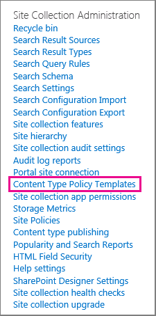

# Créer et appliquer des stratégies de gestion des informationsCreate and apply information management policies

Les stratégies de gestion des informations permettent à votre organisation de contrôler la durée de conservation du contenu, d'auditer les opérations effectuées par les utilisateurs et d'ajouter des codes-barres ou des étiquettes aux documents.Information management policies enable your organization to control how long to retain content, to audit what people do with content, and to add barcodes or labels to documents. Une stratégie peut contribuer à renforcer la conformité aux réglementations juridiques et gouvernementales ou aux processus d'entreprise internes.A policy can help enforce compliance with legal and governmental regulations or internal business processes. En tant qu'administrateur, vous pouvez configurer une stratégie pour contrôler le suivi des documents et la durée de conservation des documents.As an administrator, you can set up a policy to control how to track documents and how long to retain documents.
  
Vous pouvez créer une stratégie de gestion des informations sur trois emplacements différents dans la hiérarchie du site, du plus large au plus étroit:You can create an information management policy can at three different locations in the site hierarchy, from the broadest to the narrowest:
  
- Créer une stratégie à utiliser sur plusieurs types de contenu au sein d'une collection de sites.Create a policy to use on multiple content types within a site collection.
    
- Créer une stratégie pour un type de contenu de site.Create a policy for a site content type.
    
- Créer une stratégie pour une liste ou une bibliothèque.Create a policy for a list or library.
    
Pour plus d'informations, consultez la rubrique [Présentation des stratégies de gestion des informations](intro-to-info-mgmt-policies.md).For more information, see [Introduction to information management policies](intro-to-info-mgmt-policies.md).
  
## Créer une stratégie pour plusieurs types de contenu au sein d'une collection de sitesCreate a policy for multiple content types within a site collection

Pour vous assurer qu'une stratégie d'informations est appliquée à tous les documents d'un certain type au sein d'une collection de sites, envisagez de créer la stratégie au niveau de la collection de sites, puis appliquez la stratégie aux types de contenu.To ensure that an information policy is applied to all documents of a certain type within a site collection, consider creating the policy at the site collection level and then later apply the policy to content types. Il s'agit des stratégies de collection de sites.These are referred to as site collection policies. 
  
1. dans le bouton paramètres de la \> \*\*\*\*On the site collection home page \> **Settings** \>**Paramètres de site**.\> **Site Settings**.
    
    Dans un site connecté à un groupe SharePoint, cliquez sur **paramètres**, sur **contenu du site**, puis sur **paramètres du site**.In a SharePoint group-connected site, click **Settings**, click **Site Contents**, and then click **Site Settings**. 
    
2. Sur la page Paramètres du site, sous **modèles de stratégies de type de contenu**administration \> de la collection de **sites** .On the Site Settings page, under **Site Collection Administration** \> **Content Type Policy Templates**. 
  

  
3. Sur la page \> stratégies, **créez**.On the Policies page \> **Create**. 
    
4. Entrez un nom et une description pour la stratégie, puis rédigez une brève déclaration de stratégie qui explique aux utilisateurs ce à quoi la stratégie est destinée.Enter a name and description for the policy, and then write a brief policy statement that explains to users what the policy is for.
    
5. Consultez la section suivante sur la création de stratégies pour un type de contenu de site pour découvrir comment configurer les fonctionnalités que vous souhaitez associer à la stratégie.See the next section on creating policies for a site content type to learn how to set up the features you want to associate with the policy. 
    
6. Sélectionnez **OK**.Choose **OK**.
    
## Créer une stratégie pour un type de contenu de siteCreate a policy for a site content type

L'ajout d'une stratégie de gestion des informations à un type de contenu facilite l'Association de fonctionnalités de stratégie à plusieurs listes ou bibliothèques.Adding an information management policy to a content type makes it easy to associate policy features with multiple lists or libraries. Vous pouvez choisir d'ajouter une stratégie de gestion des informations existante à un type de contenu ou de créer une stratégie unique spécifique à un type de contenu individuel.You can choose to add an existing information management policy to a content type or create a unique policy specific to an individual content type.
  
 Vous pouvez également ajouter une stratégie de gestion des informations à un type de contenu spécifique à des listes.You can also add an information management policy to a content type that is specific to lists. Cela a pour effet d'appliquer la stratégie uniquement aux éléments de cette liste qui utilisent le type de contenu.This has the effect of applying the policy only to items in that list that are using the content type. 
  
1. dans le bouton paramètres de la \> \*\*\*\*On the site collection home page \> **Settings** \>**Paramètres de site**.\> **Site Settings**.
    
    Dans un site connecté à un groupe SharePoint, cliquez sur **paramètres**, sur **contenu du site**, puis sur **paramètres du site**.In a SharePoint group-connected site, click **Settings**, click **Site Contents**, and then click **Site Settings**. 
    
2. Sur la page Paramètres du site, sous **types de contenu de site**des galeries \> du **Concepteur Web** .On the Site Settings page, under **Web Designer Galleries** \> **Site content types**.
  

  
3. Sur la page Paramètres de type de contenu de site, sélectionnez le type de contenu auquel vous souhaitez ajouter une stratégie.On the Site Content Type Settings page, select the content type that you want to add a policy to.
    
4. Sur la page type de contenu de site \*\*\*\* \> , sous paramètres de la **stratégie de gestion des informations**.On the Site Content Type page, under **Settings** \> **Information management policy settings**.
    
5. Sur la page modifier la stratégie, entrez un nom et une description pour la stratégie, puis rédigez une brève description expliquant aux utilisateurs ce à quoi la stratégie est destinée.On the Edit Policy page, enter a name and description for the policy, and then write a brief description that explains to users what the policy is for.
    
6. Dans les sections suivantes, sélectionnez les fonctionnalités de stratégie individuelles que vous souhaitez ajouter à votre stratégie de gestion des informations.In the next sections, select the individual policy features that you want to add to your information management policy. 
  

  
7. Pour spécifier une période de rétention pour les documents et les éléments qui sont soumis à cette stratégie, choisissez **activer**la rétention, puis spécifiez la période de rétention et les actions que vous souhaitez voir se produire à l'expiration des éléments.To specify a retention period for documents and items that are subject to this policy, choose **Enable Retention**, and then specify the retention period and the actions that you want to occur when the items expire.
    
    Pour spécifier une période de rétentionTo specify a retention period
    
||||||**1.****1.**|\* \* Sélectionnez \* \* Ajouter une étape de rétention pour les enregistrements... \* \* \* \*\*\*Choose \*\*Add a retention stage for records…\*\*\*\*|
|:-----|:-----|:-----|:-----|:-----|:-----|:-----|
||||||2.2.    | Sélectionnez une option de période de rétention pour spécifier quand des documents ou des éléments sont configurés pour expirer.Select a retention period option to specify when documents or items are set to expire. Effectuez l’une des opérations suivantes :Do one of the following:     Pour définir la date d'expiration sur la base d'une propriété de date, sous **événement** \> **cette étape est basée sur une propriété de date sur l'élément**, puis sélectionnez l'action de document ou d'élément (par exemple, créé ou modifié) et l'incrément du temps après cette action ( par exemple, le nombre de jours, de mois ou d'années, lorsque vous souhaitez que l'élément expire.To set the expiration date based on a date property, under **Event** \> **This stage is based off a date property on the item**, and then select the document or item action (for example, Created or Modified) and the increment of time after this action (for example, the number of days, months, or years) when you want the item to expire.     Pour utiliser une formule de rétention personnalisée afin de déterminer l'expiration, choisissez **définir par une formule de rétention personnalisée installée sur ce serveur**.To use a custom retention formula to determine expiration, choose **Set by a custom retention formula installed on this server**.    > [!NOTE]> cette option n'est disponible que si une formule personnalisée a été configurée par votre administrateur.> [!NOTE]>  This option is only available if a custom formula has been set up by your administrator.           |
||||||3.3.    |L'option **Démarrer un flux de travail** est disponible uniquement si vous définissez une stratégie pour une liste, une bibliothèque ou un type de contenu auquel un flux de travail est déjà associé.The **Start a workflow** option is available only if you are defining a policy for a list, library, or content type that already has a workflow associated with it. Vous aurez alors un choix de flux de travail parmi lesquels choisir.You will then be given a choice of workflows to choose from.    |
||||||4.4.    |Dans la section **périodicité** , sélectionnez **répéter l'action de cette étape...** et entrez la fréquence à laquelle vous souhaitez que l'action se produise.In the **Recurrence** section, select **Repeat this stage's action…** and enter how often you want the action to reoccur.    > [!NOTE]> cette option n'est disponible que si l'action que vous avez sélectionnée peut être répétée.> [!NOTE]>  This option is only available if the action you selected can be repeated. Par exemple, vous ne pouvez pas définir la récurrence de l'action **Supprimer définitivement**.For example, you cannot set recurrence for the action **Permanently Delete**.           |
||||||5.5.    |Choisissez **OK**.Chose **OK**.    |
   
1. Pour activer l'audit pour les documents et les éléments qui sont soumis à cette stratégie, sélectionnez **activer l'audit**, puis spécifiez les événements que vous souhaitez auditer.To enable auditing for the documents and items that are subject to this policy, choose **Enable Auditing**, and then specify the events you want to audit.
    
    Pour activer l'auditTo enable auditing
    
||||||1. \* \* \* \*\*\*\*\*1.\*\*\*\*|Sur la page modifier la stratégie, \* \* **sous** **Auditing** **\>** **activer l'audit** \* \*, puis activez les cases à cocher en regard des événements pour lesquels vous souhaitez conserver une trace d'audit. \* \* \* \*\*\*\*\*On the Edit Policy page,\*\* **under** **Auditing** **\>** **Enable auditing** \*\*, and then select the check boxes next to the events you want to keep an audit trail for.\*\*\*\*|
|:-----|:-----|:-----|:-----|:-----|:-----|:-----|
||||||**2.****2.**   |**Pour inviter les utilisateurs à insérer ces codes-barres dans des documents,** **Sélectionnez** **Inviter les utilisateurs à insérer un code-barres avant l'enregistrement ou l'impression** **.****To prompt users to insert these barcodes into documents,** **choose** **Prompt users to insert a barcode before saving or printing** **.**   |
||||||**3.****3.**   |**Sélectionnez** **OK** \* \* pour appliquer la fonctionnalité d'audit à la stratégie.**Choose** **OK** \*\* to apply the auditing feature to the policy. **   |
|||||||La fonctionnalité de stratégie d'audit permet aux organisations de créer et d'analyser des suivis d'audit pour des documents et de répertorier des éléments tels que des listes de tâches, des listes de problèmes, des groupes de discussion et des calendriers.The Auditing Policy feature enables organizations to create and analyze audit trails for documents and to list items such as task lists, issues lists, discussion groups, and calendars. Cette fonctionnalité de stratégie fournit un journal d'audit qui enregistre les événements, par exemple lors de l'affichage, de la modification ou de la suppression du contenu.This policy feature provides an audit log that records events, such as when content is viewed, edited, or deleted.    |
|||||||Lorsque l'audit est activé dans le cadre d'une stratégie de gestion des informations, les administrateurs peuvent afficher les données d'audit dans des rapports d'utilisation des stratégies basés dans Microsoft Excel et qui résument l'utilisation actuelle.When auditing is enabled as part of an information management policy, administrators can view the audit data in policy usage reports that are based in Microsoft Excel and that summarize current usage. Les administrateurs peuvent se servir de ces rapports pour déterminer comment l'information est utilisée dans l'organisation.Administrators can use these reports to determine how information is being used within the organization. Ces rapports peuvent également aider les organisations à vérifier et à documenter leur conformité réglementaire ou à étudier les préoccupations potentielles.These reports can also help organizations to verify and document their regulatory compliance or to investigate potential concerns.    |
|||||||Le journal d'audit enregistre les informations suivantes: nom de l'événement, date et heure de l'événement et nom du système de l'utilisateur qui a effectué l'action.The audit log records the following information: event name, date and time of the event, and system name of the user who performed the action.    |
   
1. Lorsque des codes-barres sont activés dans le cadre d'une stratégie, ils sont ajoutés aux propriétés du document et s'affichent dans la zone d'en-tête du document auquel le code-barres est appliqué.When barcodes are enabled as part of a policy, they are added to document properties and displayed in the header area of the document to which the barcode is applied. Comme les étiquettes, les codes-barres peuvent également être supprimés manuellement d'un document.Like labels, barcodes can also be manually removed from a document. Vous pouvez spécifier si les utilisateurs doivent être invités à inclure le code-barres lors de l'impression ou de l'enregistrement d'un élément ou si le code-barres doit être inséré manuellement à l'aide de l'onglet **Insérer** dans les programmes de version Office 2010.You can specify whether users should be prompted to include the barcode when printing or saving an item or if the barcode should be inserted manually using the **Insert** tab in 2010 Office release programs. 
    
    Pour activer les codes-barresTo enable barcodes
    
||||||1. \* \* \* \*\*\*\*\*1.\*\*\*\*|**Sur la page modifier la stratégie, sous **codes-barres** \> , **activez les codes-barres**.****On the Edit Policy page, under **Barcodes**\> **Enable Barcodes**.**|
|:-----|:-----|:-----|:-----|:-----|:-----|:-----|
||||||**2.****2.**   |Pour inviter les utilisateurs à insérer ces codes-barres dans les documents, choisissez **inviter les utilisateurs à insérer un code-barres avant l'enregistrement ou l'impression**.To prompt users to insert these barcodes into documents, choose **Prompt users to insert a barcode before saving or printing**.    |
||||||**3.****3.**   |Choisissez **OK** pour appliquer la fonctionnalité de code-barres à la stratégie.Choose **OK** to apply the barcode feature to the policy.    |
|||||||
 La stratégie code-barres génère le code 39 codes-barres standard.The barcode policy generates Code 39 standard barcodes. Chaque image de code-barres inclut le texte sous le symbole de code-barres qui représente la valeur de code-barres.Each barcode image includes text below the barcode symbol that represents the barcode value. Cela permet d'utiliser les données de code-barres même lorsque le matériel d'analyse n'est pas disponible.This enables the barcode data to be used even when scanning hardware is not available. Les utilisateurs peuvent taper manuellement le numéro de code-barres dans la zone de recherche pour Rechercher l'élément sur un site.Users can manually type the barcode number into the search box to locate the item on a site.    |
   
1. Pour exiger que les documents soumis à cette stratégie aient des étiquettes, choisissez **activer les étiquettes**, puis spécifiez les paramètres souhaités pour les étiquettes.To require that documents that are subject to this policy have labels, choose **Enable Labels**, and then specify the settings that you want for the labels.
    
    Pour activer les étiquettesTo enable labels
    
||||||**1.****1.**|\* \* Pour obliger les utilisateurs à ajouter une étiquette à un document, choisissez **inviter les utilisateurs à insérer une étiquette avant l'enregistrement ou l'impression**.\*\*To require users to add a label to a document, choose **Prompt users to insert a label before saving or printing**.    > [!NOTE]> si vous souhaitez que les étiquettes soient facultatives, n'activez pas cette case à cocher.> [!NOTE]>  If you want labels to be optional, do not select this check box.        **|
|:-----|:-----|:-----|:-----|:-----|:-----|:-----|
||||||2.2.    |Pour verrouiller une étiquette de sorte qu'elle ne puisse pas être modifiée une fois qu'elle a été insérée, choisissez **empêcher les modifications apportées aux étiquettes une fois qu'elles**ont été ajoutées.To lock a label so that it cannot be changed after it has been inserted, choose **Prevent changes to labels after they are added**.     Ce paramètre empêche la mise à jour du texte de l'étiquette une fois que l'étiquette a été insérée dans un élément au sein d'une application cliente telle que Word, Excel ou PowerPoint.This setting prevents the label text from updating once the label has been inserted into an item within a client application such as Word, Excel, or PowerPoint. Si vous souhaitez que l'étiquette soit mise à jour lorsque les propriétés de ce document ou de cet élément sont mises à jour, n'activez pas cette case à cocher.If you want the label to be updated when the properties for this document or item are updated, do not select this check box.    |
||||||3.3.    |Dans la zone format d'étiquette, entrez le texte de l'étiquette tel qu'il doit s'afficher.In the Label format box, enter the text for the label as you want it to be displayed. Les étiquettes peuvent contenir jusqu'à 10 références de colonnes, chacune pouvant comporter jusqu'à 255 caractères.Labels can contain up to 10 column references, each of which can be up to 255 characters long. Pour créer le format de votre étiquette, procédez comme suit:To create the format for your label, do the following:    Tapez les noms des colonnes que vous souhaitez inclure dans l'étiquette dans l'ordre dans lequel vous souhaitez les voir apparaître.Type the names of the columns that you want to include in the label in the order in which you want them to appear. Placez les noms de colonne entre accolades ({}), comme indiqué dans l'exemple de la page modifier la stratégie.Enclose the column names in curly brackets ({}), as shown in the example on the Edit Policy page.    Tapez des mots pour identifier les colonnes en dehors des crochets, comme indiqué dans l'exemple de la page modifier la stratégie.Type words to identify the columns outside the brackets, as shown in the example on the Edit Policy page.    |
||||||4.4.    |Pour ajouter un saut de ligne, entrez **\n** à l'endroit où vous souhaitez que le saut de ligne apparaisse.To add a line break, enter **\n** where you want the line break to appear.    |
||||||5.5.    |Sélectionnez la taille et le style de police de votre choix, puis indiquez si vous souhaitez que l'étiquette se trouve à gauche, au centre ou à droite dans le document.Select the font size and style that you want, and specify whether you want the label positioned left, center, or right within the document.     Sélectionnez une police et un style qui sont disponibles sur les ordinateurs des utilisateurs.Select a font and style that are available on the users' computers. La taille de la police influe sur l'affichage du texte sur l'étiquette.The size of the font affects how much text can be displayed on the label.    |
||||||6.6.    |Entrez la hauteur et la largeur de l'étiquette.Enter the height and width of the label. La hauteur de l'étiquette peut être comprise entre 0,25 pouce et 20 pouces, et la largeur de l'étiquette peut être comprise entre 0,25 pouce et 20 pouces.Label height can range from .25 inches to 20 inches, and label width can range from .25 inches to 20 inches. Le texte de l'étiquette est toujours centré verticalement dans l'image de l'étiquette.Label text is always vertically centered within the label image.    |
||||||7.7.    |Choisissez **Actualiser** pour afficher un aperçu du contenu de l'étiquette.Choose **Refresh** to preview the label content.    |
   
1. Sélectionnez **OK**.Choose **OK**.
    
## Créer une stratégie pour une liste, une bibliothèque ou un dossier (stratégie de rétention basée sur l’emplacement)Create a policy for a list, library or folder (location-based retention policy)

Vous pouvez définir une stratégie de rétention qui s'applique uniquement à une liste, une bibliothèque ou un dossier spécifique.You can define a retention policy that applies only to a specific list, library or folder. Toutefois, si vous créez une stratégie de rétention de cette façon, vous ne pouvez pas réutiliser cette stratégie sur d'autres listes, bibliothèques, dossiers ou sites, et vous ne pouvez pas appliquer une stratégie de collection de sites à une stratégie basée sur l'emplacement.However, if you create a retention policy this way, you cannot reuse this policy on other lists, libraries, folders or sites, and you cannot apply a site collection policy to a location based policy.
  
Si vous souhaitez appliquer une seule stratégie de rétention à tous les types de contenu dans un seul emplacement, vous souhaiterez probablement utiliser la rétention basée sur l'emplacement.If you want to apply a single retention policy to all types of content in a single location, you will most likely want to use location-based retention. Dans la plupart des autres cas, vous voudrez vérifier qu'une stratégie de rétention est spécifiée pour tous les types de contenu.In most other cases, you will want to verify that a retention policy is specified for all content types.
  
 Chaque sous-dossier hérite de la stratégie de rétention de son parent, sauf si vous choisissez de bloquer l'héritage et de définir une nouvelle stratégie de rétention au niveau de l'enfant.Each subfolder inherits the retention policy of its parent, unless you choose to break inheritance and define a new retention policy at the child level. 
  
Si vous souhaitez définir une stratégie de gestion des informations autre que la rétention à une liste ou une bibliothèque, vous devez définir une stratégie de gestion des informations pour chaque type de contenu de liste individuel associé à cette liste ou bibliothèque.If you want to define an information management policy other than retention to a list or library, you need to define an information management policy for each individual list content type associated with that list or library.
  
 Si, à tout moment, vous décidez de passer du type de contenu aux stratégies basées sur l'emplacement pour une liste ou une bibliothèque, seule la stratégie de rétention sera utilisée comme stratégie basée sur l'emplacement.If at any point you decide to switch from content type to location-based policies for a list or library, only the retention policy will be used as the location-based policy. Toutes les autres stratégies de gestion (audits, codes-barres et codes-barres) sont héritées des types de contenu associés.All other management policies (audits, barcodes, and barcodes) will be inherited from the associated content types. 
  
 Les stratégies basées sur l'emplacement peuvent être désactivées pour une collection de sites en désactivant la fonctionnalité de réTention basée sur les dossiers et les bibliothèques.Location based policies can be disabled for a site collection by deactivating the Library and Folder Based Retention feature. Cela permet aux administrateurs de collections de sites de s'assurer que leurs stratégies de type de contenu ne sont pas remplacées par les stratégies d'emplacement d'un administrateur de liste.This enables site collection administrators to ensure that their content type policies are not overridden by a list administrator's location based policies. 
  
Vous avez besoin au minimum de l'autorisation gérer les listes pour modifier les paramètres de la stratégie de gestion des informations d'une liste ou d'une bibliothèque.You need at least the Manage Lists permission to change the information management policy settings for a list or library.
  
1. Accédez à la liste ou à la bibliothèque pour laquelle vous souhaitez spécifier une stratégie de gestion des informations.Navigate to the list or library for which you want to specify an information management policy. 
    
2. Dans le ruban, sélectionnez les paramètres de **bibliothèque** ou \> de **liste**de l'onglet **bibliothèque** ou **liste** .On the ribbon, choose the **Library** or **List** tab \> **Library Settings** or **List Settings**.
    
    Dans SharePoint Online, cliquez sur **paramètres** , puis sur paramètres de la **liste** ou paramètres de la **bibliothèque**.In SharePoint Online, click **Settings** and then click **List settings** or **Library settings**. 
    
3. Sous **autorisations et paramètres de stratégie de gestion des informations de gestion** \> \*\*\*\*.Under **Permissions and Management**\> **Information management policy settings**.
  

  
4. Sur la page Paramètres de la stratégie de gestion des informations, vérifiez que la source de rétention de la liste ou de la bibliothèque est définie sur Bibliothèque et dossiers.On the Information Management Policy Settings page, make sure that the source of retention for the list or library is set to Library and Folders. 
  
Si le **type de contenu** apparaît en tant que source, cliquez sur modifier la **source**, puis sur **bibliothèque et dossiers**.If **Content Type** appears as the source, click **Change Source**, and then click **Library and Folders**. Vous êtes alerté que les stratégies de rétention de type de contenu seront ignorées.You are alerted that content type retention policies will be ignored. Sélectionnez **OK**.Choose **OK**. 
    
5. Sur la page modifier la stratégie, sous planification de la réTention **basée sur une bibliothèque**, entrez une brève description de la stratégie que vous créez.On the Edit Policy page, under **Library Based Retention Schedule**, enter a brief description for the policy you are creating. 
    
6. Sélectionnez **Ajouter un stade de rétention...**Choose **Add a retention stage…**
    
     Notez que sous enregistrements, vous pouvez choisir de définir différentes stratégies de rétention pour les enregistrements en sélectionnant l'option définir différentes étapes de rétention pour les enregistrements.Note that under Records, you can choose to define different retention policies for records by selecting the Define different retention stages for records option. 
    
7. Dans la boîte de dialogue Propriétés de la scène, sélectionnez une option de période de rétention pour spécifier la date d'expiration des documents ou des éléments.In the Stage properties dialog, select a retention period option to specify when documents or items are set to expire. Effectuez l’une des opérations suivantes :Do one of the following:
    
  - Pour définir la date d'expiration sur la base d'une propriété de date, sous **événement** \> **cette étape est basée sur une propriété de date sur l'élément**, puis sélectionnez l'action de document ou d'élément (par exemple, créé ou modifié) et l'incrément du temps après cette action ( par exemple, le nombre de jours, de mois ou d'années, lorsque vous souhaitez que l'élément expire.To set the expiration date based on a date property, under **Event** \> **This stage is based off a date property on the item**, and then select the document or item action (for example, Created or Modified) and the increment of time after this action (for example, the number of days, months, or years) when you want the item to expire. 
    
  - Pour utiliser une formule de rétention personnalisée afin de déterminer l'expiration, choisissez **définir par une formule de rétention personnalisée installée sur ce serveur**.To use a custom retention formula to determine expiration, choose **Set by a custom retention formula installed on this server**. 
    
    > [!NOTE]
    >  Cette option est disponible uniquement si votre administrateur a défini une formule personnalisée.This option is only available if a custom formula has been set up by your administrator. 
  
  - Sous **action**, spécifiez ce qui doit se produire lorsque le document ou l'élément expire.Under **Action**, specify what you want to happen when the document or item expires. Pour activer une action spécifique dans le document ou l'élément (par exemple, la suppression), sélectionnez une action dans la liste.To enable a specific action to happen to the document or item (such as deletion), select an action from the list. 
    
8. L'option **Démarrer un flux de travail** est disponible uniquement si vous définissez une stratégie pour une liste, une bibliothèque ou un type de contenu auquel un flux de travail est déjà associé.The **Start a workflow** option is available only if you are defining a policy for a list, library, or content type that already has a workflow associated with it. Vous aurez alors un choix de flux de travail parmi lesquels choisir.You will then be given a choice of workflows to choose from. 
    
9. Sous **périodicité**, sélectionnez **répéter l'action de cette étape...** et entrez la fréquence à laquelle vous souhaitez que l'action se produise.Under **Recurrence**, choose **Repeat this stage's action…** and enter how often you want the action to reoccur. 
    
    > [!NOTE]
    >  Cette option n'est disponible que si l'action que vous avez sélectionnée peut être répétée.This option is only available if the action you selected can be repeated. Par exemple, vous ne pouvez pas définir la récurrence de l'action **Supprimer définitivement**.For example, you cannot set recurrence for the action **Permanently Delete**. 
  
10. Sélectionnez **OK**.Choose **OK**.
    
## Appliquer une stratégie de collection de sites à un type de contenuApply a site collection policy to a content type

Si des stratégies de gestion des informations ont déjà été créées pour votre site en tant que stratégies de collection de sites, vous pouvez appliquer l'une des stratégies à un type de contenu.If information management policies have already been created for your site as site collection policies, you can apply one of the policies to a content type. En procédant ainsi, vous pouvez appliquer la même stratégie à plusieurs types de contenu dans une collection de sites qui ne partagent pas le même type de contenu parent.By doing this, you can apply the same policy to multiple content types in a site collection that do not share the same parent content type.
  
 Si vous souhaitez appliquer des stratégies à plusieurs types de contenu dans une collection de sites et que vous disposez d'un service de métadonnées gérées configuré, vous pouvez utiliser la publication de type de contenu pour publier des stratégies de gestion des informations sur plusieurs collections de sites.If you want to apply policies to multiple content types in a site collection, and you have a Managed Metadata Service configured, you can use Content Type Publishing to publish out information management polices to multiple site collections. Pour plus d'informations, consultez la section [appliquer une stratégie sur plusieurs collections de sites](#apply-a-policy-across-site-collections) .See the section [Apply a policy across site collections](#apply-a-policy-across-site-collections) for more information. 
  
1. Accédez à la liste ou à la bibliothèque qui contient le type de contenu auquel vous souhaitez appliquer une stratégie.Navigate to the list or library that contains the content type to which you want to apply a policy.
    
2. Dans le ruban, sélectionnez les paramètres de **bibliothèque** ou \> de **liste**de l'onglet **bibliothèque** ou **liste** .On the ribbon, choose the **Library** or **List** tab \> **Library Settings** or **List Settings**.
    
    Dans SharePoint Online, cliquez sur **paramètres** , puis sur paramètres de la **liste** ou paramètres de la **bibliothèque**.In SharePoint Online, click **Settings** and then click **List settings** or **Library settings**. 
    
3. Sous **autorisations et paramètres de stratégie de gestion des informations de gestion** \> \*\*\*\*.Under **Permissions and Management** \> **Information management policy settings**.
  

  
4. Vérifiez que la source de la stratégie est définie sur **types de contenu**, puis, sous stratégies de **type de contenu** , sélectionnez le type de contenu auquel vous souhaitez appliquer la stratégie.Verify that the policy source is set to **Content Types**, and under **Content Type Policies** select the content type you want to apply the policy to. 
    
5. Sous **spécifier la stratégie** \> **utiliser une stratégie de collection de sites**, puis sélectionnez la stratégie que vous souhaitez appliquer à partir de la liste.Under **Specify the Policy** \> **Use a site collection policy**, and then select the policy that you want to apply from the list. 
    
    > [!NOTE]
    >  Si l'option **utiliser une stratégie de collection de sites** n'est pas disponible, aucune stratégie de collection de sites n'a été définie pour la collection de sites.If the **Use a site collection policy** option is not available, no site collection policies have been defined for the site collection. 
  
6. Sélectionnez **OK**.Choose **OK**.
    
     Si la liste ou la bibliothèque que vous utilisez prend en charge la gestion de plusieurs types de contenu, sous **types de contenu** , vous pouvez choisir le type de contenu pour lequel vous souhaitez spécifier une stratégie de gestion des informations.If the list or library you are working with supports the management of multiple content types, under **Content Types** you can choose the content type for which you want to specify an information management policy. Cela vous fera passer directement à l'étape 5 ci-dessus.This will take you directly to Step 5 above. 
    
## Appliquer une stratégie à travers des collections de sitesApply a policy across site collections

Partager des types de contenu entre des collections de sites à l'aide d'une application de service de métadonnées gérées pour configurer la publication de type de contenu.Share content types across site collections by using a Managed Metadata service application to set up content type publishing. La publication de type de contenu vous permet de gérer le contenu et les métadonnées de manière cohérente sur vos sites, car les types de contenu peuvent être créés et mis à jour de façon centralisée, et les mises à jour peuvent être publiées vers plusieurs collections de sites ou applications Web.Content type publishing helps you manage content and metadata consistently across your sites because content types can be created and updated centrally, and updates can be published out to multiple subscribing site collections or Web applications.
  
## Créer un modèle à partir d'une stratégie existante à utiliser dans les collections de sitesCreate a template from an existing policy to use across site collections

Vous pouvez définir une stratégie de gestion des informations, puis créer un modèle à partir de celle-ci afin de l'utiliser selon vos besoins sur plusieurs collections de sites.You can define an information management policy and then create a template from it to use as needed across multiple site collections. Vous pouvez utiliser cette méthode si vous souhaitez disposer d'une sauvegarde de vos stratégies d'informations, ou si elle peut également être utilisée comme une autre méthode pour utiliser la publication de type de contenu pour l'application d'une stratégie à travers des collections de sites.This method can be used if you want to have a backup of your information policies, or it can also be used as an alternate method to using content type publishing for applying one policy across site collections. Pour créer un modèle ou une sauvegarde de la stratégie, exportez la stratégie à partir d'une collection de sites, puis importez-la dans un emplacement enregistré ou dans une autre collection de sites.You create a template or backup of the policy by exporting the policy from one site collection and then importing it to a saved location or to another site collection.
  
> [!IMPORTANT]
>  Si vous utilisez la fonctionnalité d'exportation/importation pour créer un ensemble de modèles de stratégie, gardez à l'esprit qu'il existe un identificateur unique dans le fichier Policy. Xml.If you using the export/import feature as a way to make a set of policy templates, keep in mind that a unique identifier exists in the policy .xml file. Pour cette raison, vous ne pouvez pas importer cette stratégie sur un site plus d'une fois sans modifier cet identificateur unique.Because of this, you cannot import that policy into a site more than once without changing this unique identifier. 
  
### Exporter une stratégieExport a policy

1. Sur la page d'accueil de la collection de sites, sélectionnez **paramètres** **site.** \>On the site collection home page, choose **Settings**\> **Site Settings**.
    
    Dans un site connecté à un groupe SharePoint, cliquez sur **paramètres**, sur **contenu du site**, puis sur **paramètres du site**.In a SharePoint group-connected site, click **Settings**, click **Site Contents**, and then click **Site Settings**. 
    
2. Sur la page Paramètres du site, sous **modèles de stratégies de type de contenu**administration \> de la collection de **sites** .On the Site Settings page, under **Site Collection Administration** \> **Content Type Policy Templates**. 
  

  
3. Sélectionnez la stratégie que vous souhaitez exporter \> vers l' \> **exportation**la plus basse.Choose the policy you want to export \> scroll to the bottom \> **Export**.
    
4. Lorsque vous êtes invité à enregistrer ou ouvrir le fichier, sélectionnez **Enregistrer**, puis sélectionnez l'emplacement auquel vous souhaitez enregistrer le fichier.At the prompt to save or open the file, choose **Save**, and then select a location to save the file to. Veillez à sélectionner un emplacement disponible pour les collections de sites qui importent la stratégie.Be sure to select a location that is available to the site collections that are importing the policy.
    
5. Lorsque la boîte de dialogue Téléchargement terminé s'affiche, cliquez sur **Fermer**.When the Download Complete dialog is displayed, choose **Close**.
    
### Importer une stratégie dans une autre collection de sitesImport a policy to a different site collection

L'importation d'une stratégie de gestion des informations vous permet de l'appliquer à plusieurs types de contenu au niveau du site ou de la liste dans une collection de sites donnée.Importing an information management policy enables you to apply it to multiple content types at the site or list level within any given site collection. Les avantages de cette opération sont les suivants: vous n'avez pas besoin de redéfinir et d'appliquer la stratégie sur chaque type de contenu, et vous pouvez plus facilement gérer les modifications de stratégie en apportant des modifications à la stratégie dans un seul emplacement.The benefits of doing this are twofold: you don't have to re-define and apply the policy on each content type, and you can more easily manage policy modifications by making changes to the policy in just one place.
  
1. Sur la page d'accueil de la collection de sites à laquelle vous souhaitez appliquer la stratégie, sélectionnez **paramètres** **site.** \>On the home page of the site collection to which you want to apply the policy, choose **Settings**\> **Site Settings**.
    
    Dans un site connecté à un groupe SharePoint, cliquez sur **paramètres**, sur **contenu du site**, puis sur **paramètres du site**.In a SharePoint group-connected site, click **Settings**, click **Site Contents**, and then click **Site Settings**. 
    
2. Sur la page Paramètres du site, sous **modèles de stratégies de type de contenu**administration \> de la collection de **sites** .On the Site Settings page, under **Site Collection Administration** \> **Content Type Policy Templates**.
    
3. Sur la page \> stratégies, importez \*\*\*\* \> \*\*\*\* le fichier XML pour la stratégie.On the Policies page \> **Import** \> **Browse** to find the XML file for the policy. 
    
4. Sélectionnez le fichier XML dans lequel la stratégie a été enregistrée \> \*\*\*\*.Select the XML file in which the policy has been saved \> **Open**. 
    
5. Dans la page \> importer une stratégie de collection de sites, importez-la pour ajouter la stratégie à la collection de sites. \*\*\*\*On the Import a Site Collection Policy page \> **Import** to add the policy to the site collection. 
    
Votre stratégie importée peut désormais être appliquée à un ou plusieurs types de contenu au niveau du site ou de la liste.Your imported policy can now be applied to one or many content types at the site or list level. 
  
Les stratégies de gestion des informations permettent à votre organisation de contrôler la durée de conservation du contenu, d'auditer les opérations effectuées par les utilisateurs et d'ajouter des codes-barres ou des étiquettes aux documents.Information management policies enable your organization to control how long to retain content, to audit what people do with content, and to add barcodes or labels to documents. Une stratégie peut contribuer à renforcer la conformité aux réglementations juridiques et gouvernementales ou aux processus d'entreprise internes.A policy can help enforce compliance with legal and governmental regulations or internal business processes. En tant qu'administrateur, vous pouvez configurer une stratégie pour contrôler le suivi des documents et la durée de conservation des documents.As an administrator, you can set up a policy to control how to track documents and how long to retain documents.

Vous pouvez créer une stratégie de gestion des informations sur trois emplacements différents dans la hiérarchie du site, du plus large au plus étroit:You can create an information management policy can at three different locations in the site hierarchy, from the broadest to the narrowest:
- Créer une stratégie à utiliser sur plusieurs types de contenu au sein d'une collection de sites.Create a policy to use on multiple content types within a site collection.
- Créer une stratégie pour un type de contenu de site.Create a policy for a site content type.
- Créer une stratégie pour une liste ou une bibliothèque.Create a policy for a list or library.

Pour plus d'informations, consultez la rubrique [Présentation des stratégies de gestion des informations](intro-to-info-mgmt-policies.md).For more information, see [Introduction to information management policies](intro-to-info-mgmt-policies.md).
  

