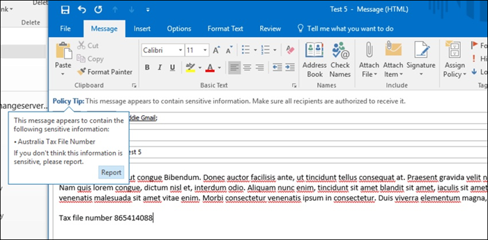
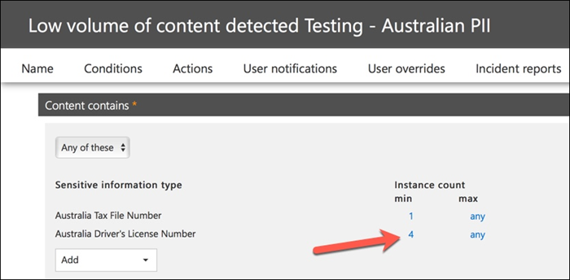

# Création, test et réglage d’une stratégie DLP

**Auteur principal**  
Paul Cunningham, MVP Microsoft  
[Pratique 365](https://practical365.com/)  
[@Practical365](https://twitter.com/practical365) 
__________________________________________________

La protection contre la perte de données est une fonctionnalité de conformité d'Office 365 conçue pour aider votre organisation à empêcher l'exposition intentionnelle ou accidentelle d'informations sensibles à des parties indésirables. DLP a ses racines dans Exchange Server et Exchange Online, et est également applicable dans SharePoint Online et OneDrive entreprise.

DLP utilise un moteur d'analyse de contenu pour examiner le contenu des messages électroniques et des fichiers, en recherchant des informations sensibles telles que des numéros de carte de crédit et des informations d'identification personnelle. Les informations sensibles ne doivent généralement pas être envoyées par courrier électronique, ni être incluses dans des documents, sans effectuer d'étapes supplémentaires, telles que le chiffrement des messages électroniques ou des fichiers. À l'aide de DLP, vous pouvez détecter des informations sensibles et effectuer les actions suivantes:

- ConSigner l'événement à des fins d'audit
- Afficher un avertissement à l'utilisateur final qui envoie le courrier électronique ou partage le fichier
- Bloquer activement le courrier électronique ou le partage de fichiers

Parfois, les clients font disparaître DLP car ils ne tiennent pas compte du type de données à protéger. Il est supposé que les données sensibles, telles que les enregistrements médicaux ou les informations financières, existent uniquement pour les industries comme les soins de santé ou pour les entreprises qui exécutent des magasins en ligne. Toutefois, toute entreprise peut gérer les informations sensibles de manière régulière, même si elles ne le savent pas. Une feuille de calcul des noms d'employés et des dates de naissance est aussi sensible qu'une feuille de calcul des noms des clients et des informations de carte de crédit. En d'autres termes, ce type d'informations a tendance à flotter plus que prévu, car les employés se déplacent en silence sur leurs tâches quotidiennes, ne pensent rien de l'exportation d'un fichier CSV à partir d'un système et de son envoi à une personne. Vous pouvez également être surpris de savoir si les employés envoient des courriers électroniques contenant des informations sur la carte bancaire ou bancaire sans prendre en compte les conséquences.

## Détection des informations sensibles par DLP

Les informations sensibles sont identifiées par une correspondance de modèle d'expression régulière (RegEx), en combinaison avec d'autres indicateurs, tels que la proximité de certains mots clés aux modèles de correspondance. Par exemple, il s'agit de numéros de carte de crédit. Un numéro de carte de crédit VISA comporte 16 chiffres. Toutefois, ces chiffres peuvent être écrits de différentes manières, par exemple 1111-1111-1111-1111, 1111 1111 1111 1111 ou 1111111111111111.

N'importe quelle chaîne de 16 chiffres n'est pas nécessairement un numéro de carte de crédit, il peut s'agir d'un numéro de ticket provenant d'un système de support technique ou d'un numéro de série d'une partie de matériel. Pour connaître la différence entre le numéro de carte de crédit et une chaîne inoffensive de 16 chiffres, un calcul est effectué (checksum) pour confirmer que les numéros correspondent à un modèle connu des différentes marques de carte de crédit.

Par ailleurs, la proximité des mots-clés tels que «VISA» ou «AMEX», ainsi que la proximité des valeurs de date qui peuvent correspondre à la date d'expiration de la carte de crédit, est également considérée comme une décision concernant le numéro de carte de crédit ou non.

En d'autres termes, DLP est généralement assez intelligent pour reconnaître la différence entre ces deux textes dans un e-mail:

- «Pouvez-vous commander un nouvel ordinateur portable. Utilisez mon numéro de VISA 1111-1111-1111-1111, expiration 11/22, et m'envoyer la date de livraison estimée lorsque vous l'avez. "
- «Mon numéro de série d'ordinateur portable est 2222-2222-2222-2222 et il a été acheté le 11/2010. À propos, est-ce que mon visa de voyage est encore approuvé?»

Cette rubrique présente les types d'informations [sensibles](what-the-sensitive-information-types-look-for.md) qui expliquent le mode de détection de chaque type d'informations.

## Où commencer avec la protection contre la perte de données

Lorsque les risques de fuites de données ne sont pas totalement évidents, il est difficile de déterminer exactement où commencer à mettre en œuvre DLP. Heureusement, les stratégies DLP peuvent être exécutées en «mode test», ce qui vous permet d'évaluer leur efficacité et leur exactitude avant de les activer.

Les stratégies DLP pour Exchange Online peuvent être gérées via le centre d'administration Exchange. Toutefois, vous pouvez configurer des stratégies DLP pour toutes les charges de travail via le centre de sécurité & Compliance Center, ce que nous allons utiliser pour les démonstrations de cet article. Dans le centre de conformité Security &, vous trouverez les stratégies DLP sous**stratégie**de **protection contre** > la perte de données. Cliquez sur **créer une stratégie** à démarrer.

Office 365 fournit une gamme de [modèles de stratégie DLP](what-the-dlp-policy-templates-include.md) que vous pouvez utiliser pour créer des stratégies DLP. Imaginons que vous êtes une entreprise australienne. Vous pouvez filtrer les modèles de stratégie pour n'afficher que ceux qui sont pertinents pour l'Australie, qui entrent dans les catégories générales de finances, médecine et santé, ainsi que la confidentialité.

Pour cette démonstration, je vais choisir les données d'informations d'identification personnelle (PII) australiennes, qui incluent les types d'informations de numéro de fichier fiscal australien (TFN) et le numéro de permis de conduire.

Donnez un nom à votre nouvelle stratégie DLP. Le nom par défaut correspond au modèle de stratégie DLP, mais vous devez choisir un nom plus descriptif, car plusieurs stratégies peuvent être créées à partir du même modèle.

Choisissez les emplacements auxquels la stratégie s'applique. Les stratégies DLP peuvent s'appliquer à Exchange Online, SharePoint Online et OneDrive entreprise. Je vais laisser cette stratégie configurée pour s'appliquer à tous les emplacements.

À la première étape des **paramètres de stratégie** , acceptez les valeurs par défaut pour le moment. Il existe un grand nombre de personnalisations que vous pouvez effectuer dans les stratégies DLP, mais les valeurs par défaut sont un bon point de départ.

Après avoir cliqué sur **suivant** , une page Paramètres de **stratégie** supplémentaires s'affiche avec davantage d'options de personnalisation. Pour une stratégie que vous venez de tester, c'est ici que vous pouvez commencer à effectuer quelques ajustements.

- J'ai désactivé les conseils de stratégie pour l'instant, ce qui est une étape raisonnable à effectuer si vous testez les éléments et que vous ne souhaitez pas encore afficher quoi que ce soit pour les utilisateurs. Les conseils de stratégie indiquent aux utilisateurs qu'ils sont sur le point de violer une stratégie DLP. Par exemple, un utilisateur Outlook verra un avertissement indiquant que le fichier auquel il est attaché contient des numéros de carte de crédit et que son courrier sera rejeté. L'objectif des conseils de stratégie est d'arrêter le comportement non conforme avant qu'il ne se produise.
- J'ai également réduit le nombre d'instances de 10 à 1, de sorte que cette stratégie détecte le partage des données PII australiennes, et pas simplement le partage des données en bloc.
- J'ai également ajouté un autre destinataire à l'e-mail du rapport d'incident.

Enfin, j'ai configuré cette stratégie pour s'exécuter initialement en mode test. Notez qu'il existe également une option permettant de désactiver les conseils de stratégie en mode test. Vous avez ainsi la possibilité d'activer les conseils de stratégie dans la stratégie, mais de décider de les afficher ou de les supprimer pendant les tests.

Dans l'écran révision finale, cliquez sur **créer** pour terminer la création de la stratégie.

## Tester une stratégie DLP

Votre nouvelle stratégie DLP commencera à prendre effet dans environ 1 heure. Vous pouvez vous asseoir et attendre qu'elle soit déclenchée par une activité utilisateur normale, ou vous pouvez essayer de la déclencher vous-même. Précédemment, j'ai lié à cette [rubrique sur les types d'informations sensibles](what-the-sensitive-information-types-look-for.md), qui vous fournissent des informations sur la façon de déclencher des correspondances DLP.

Par exemple, la stratégie DLP que j'ai créée pour cet article détectera les numéros de fichiers fiscaux australiens (TFN). Conformément à la documentation, la correspondance est basée sur les critères suivants.

 
Pour illustrer la détection d'TFN de manière assez rationnelle, un message électronique avec les mots «numéro de fichier de la taxe» et une chaîne de 9 chiffres à proximité ne s'afficheront pas. La raison pour laquelle elle ne déclenche pas la stratégie DLP est que la chaîne à 9 chiffres doit transmettre la somme de contrôle qui indique qu'il s'agit d'un TFN valide et non d'une chaîne de nombres inoffensive.

Par comparaison, un message électronique avec les mots «numéro de fichier de la taxe» et un TFN valide qui réussit la somme de contrôle déclencheront la stratégie. Pour l'enregistrement ici, le TFN que j'utilise a été extrait d'un site Web qui génère des TFNs valides, mais pas authentiques. Il existe des sites similaires générant des [numéros de carte de crédit valides, mais factices](http://www.fakecreditcardgenerator.net/). Ces sites sont très utiles, car l'une des erreurs les plus courantes lors du test d'une stratégie DLP utilise un faux nombre qui n'est pas valide et qui ne réussit pas la somme de contrôle (et par conséquent ne déclenche pas la stratégie).

L'e-mail du rapport d'incident inclut le type d'informations sensibles détectées, le nombre d'instances détectées et le niveau de confiance de la détection.

Si vous laissez votre stratégie DLP en mode test et que vous analysez les messages électroniques des rapports d'incident, vous pouvez commencer à vous faire une idée de la précision de la stratégie DLP et de son efficacité lors de son application. Outre les rapports d'incident, vous pouvez [utiliser les rapports DLP](view-the-dlp-reports.md) pour afficher une vue agrégée des correspondances de stratégie au sein de votre client.

## Optimisation d'une stratégie DLP

Lors de l'analyse de vos accès aux stratégies, il se peut que vous souhaitiez apporter quelques ajustements à la façon dont les stratégies se comportent. En guise d'exemple simple, vous pouvez déterminer qu'un TFN dans le courrier électronique n'est pas un problème (je pense qu'il est toujours, mais nous allons l'utiliser pour les besoins de la démonstration), mais deux ou plusieurs instances constituent un problème. Plusieurs instances peuvent être un scénario risqué, tel qu'un employé à envoyer par courrier électronique une exportation CSV de la base de données RH vers une partie externe, par exemple un service de comptabilité externe. Nous vous recommandons de détecter et de bloquer.

Dans le centre de sécurité & Compliance Center, vous pouvez modifier une stratégie existante pour ajuster le comportement.

 
Vous pouvez ajuster les paramètres d'emplacement de sorte que la stratégie s'applique uniquement à des charges de travail spécifiques ou à des sites et comptes spécifiques.

Vous pouvez également ajuster les paramètres de stratégie et modifier les règles pour mieux répondre à vos besoins.

Lorsque vous modifiez une règle dans une stratégie DLP, vous pouvez modifier les éléments suivants:

- Les conditions, y compris le type et le nombre d'instances de données sensibles qui déclencheront la règle.
- Les actions entreprises, telles que la restriction de l'accès au contenu.
- Les notifications utilisateur, qui sont des conseils de stratégie qui sont affichés à l'utilisateur dans leur client de messagerie ou dans leur navigateur Web.
- Substitutions de l'utilisateur, qui déterminent si les utilisateurs peuvent choisir de continuer à utiliser leur messagerie ou leur partage de fichiers.
- Rapports d'incidents, pour avertir les administrateurs.

Pour cette démonstration, j'ai ajouté des notifications aux utilisateurs à la stratégie (veillez à le faire sans formation de sensibilisation de l'utilisateur) et les utilisateurs autorisés à remplacer la stratégie par une justification professionnelle ou à la marquer comme faux positif. Notez que vous pouvez également personnaliser le texte du message et du Conseil de stratégie si vous souhaitez inclure des informations supplémentaires sur les stratégies de votre organisation ou inviter les utilisateurs à contacter le support technique s'ils ont des questions.

La stratégie contient deux règles de gestion de volume élevé et de volume faible, donc veillez à modifier les deux avec les actions de votre choix. Il s'agit d'une opportunité de traiter les incidents différemment en fonction de leurs caractéristiques. Par exemple, vous pouvez autoriser les remplacements pour les violations de volume faibles, mais pas autoriser les remplacements pour les violations de volume élevées.

Par ailleurs, si vous souhaitez bloquer ou restreindre effectivement l'accès au contenu en violation de stratégie, vous devez configurer une action sur la règle pour le faire.

Après avoir enregistré ces modifications aux paramètres de stratégie, je dois également revenir à la page des paramètres principaux de la stratégie et activer l'option d'affichage des conseils de stratégie pour les utilisateurs pendant que la stratégie est en mode test. Il s'agit d'un moyen efficace d'introduire des stratégies DLP auprès de vos utilisateurs finaux, ainsi que d'effectuer des formations de sensibilisation des utilisateurs, sans menacer trop de faux positifs ayant un impact sur leur productivité.

Côté serveur (ou côté Cloud si vous préférez), la modification peut ne pas prendre effet immédiatement, en raison de différents intervalles de traitement. Si vous effectuez une modification de stratégie DLP qui affiche de nouveaux conseils de stratégie à un utilisateur, l'utilisateur peut ne pas voir les modifications prendre effet immédiatement dans son client Outlook, qui recherche les modifications de stratégie toutes les 24 heures. Si vous souhaitez accélérer les tests, vous pouvez utiliser ce correctif de Registre pour [effacer le datage du dernier transfert à partir de la clé PolicyNudges](https://support.microsoft.com/en-au/help/2823261/changes-to-a-data-loss-prevention-policy-don-t-take-effect-in-outlook?__hstc=18650278.46377037dc0a82baa8a30f0ef07a7b2f.1538687978676.1538693509953.1540315763430.3&__hssc=18650278.1.1540315763430&__hsfp=3446956451). Outlook télécharge les informations de stratégie les plus récentes la prochaine fois que vous le redémarrez et commencez à composer un message électronique.

Si des conseils de stratégie sont activés, l'utilisateur commence à voir les conseils dans Outlook et peut signaler les faux positifs lorsqu'ils se produisent.

## Examiner les faux positifs

Les modèles de stratégie DLP ne sont pas parfaitement adaptés. Il est probable que vous trouviez des faux positifs dans votre environnement, c'est pourquoi il est si important de faciliter le déploiement de la solution DLP, en prenant le temps de tester et de régler correctement vos stratégies.

Voici un exemple de faux positif. Ce courrier électronique est relativement inoffensif. L'utilisateur fournit son numéro de téléphone mobile à quelqu'un et inclut sa signature électronique.

 
Toutefois, l'utilisateur voit un Conseil de stratégie les avertissant que le courrier électronique contient des informations sensibles, en particulier, un numéro de permis de conduire australien.

L'utilisateur peut signaler le faux positif, et l'administrateur peut examiner pourquoi il s'est produit. Dans le message de rapport d'incident, le message électronique est marqué comme faux positif.

Le cas de la licence de ce pilote est un parfait exemple pour explorer. La raison de ce faux positif est que le type «permis de conduire australien» est déclenché par une chaîne de 9 chiffres (même une partie d'une chaîne de 10 chiffres), entre 300 caractères, à proximité des mots-clés «Sydney NSW» (ne respectant pas la casse). Il est donc déclenché par le numéro de téléphone et la signature électronique, uniquement parce que l'utilisateur se trouve dans Sydney.

Il est intéressant de faire attention, si «Sydney, NSW» a une virgule, la stratégie DLP n'est pas déclenchée. Je n'ai aucune idée de la raison pour laquelle une virgule fait une différence, et pourquoi les autres villes et États en Australie ne sont pas inclus dans les mots clés du type d'informations de licence du pilote australien, mais vous y trouverez. Comment pouvons-nous le faire? Il existe deux options.

Une possibilité consiste à supprimer du type d'informations de licence du pilote australien de la stratégie. Il est dans cet emplacement, car il fait partie du modèle de stratégie DLP, mais nous ne sommes pas obligés de l'utiliser. Si vous êtes intéressé uniquement par les numéros de fichier des taxes et non par des licences de pilotes, vous pouvez simplement le supprimer. Par exemple, vous pouvez le supprimer de la règle de volume faible de la stratégie, mais le laisser dans la règle de volume élevée afin que les listes de licences de plusieurs pilotes soient toujours détectées.

 
Une autre solution consiste à augmenter simplement le nombre d'instances, de sorte qu'un faible volume de licences de pilotes soit détecté uniquement lorsqu'il y a plusieurs instances.

En plus de modifier le nombre d'instances, vous pouvez également ajuster la précision de la correspondance (ou le niveau de confiance). Si votre type d'informations sensibles comporte plusieurs modèles, vous pouvez ajuster la précision des correspondances dans votre règle, afin que votre règle corresponde uniquement à des modèles spécifiques. Par exemple, pour réduire les faux positifs, vous pouvez définir la précision de la règle de sorte qu'elle corresponde uniquement au modèle ayant le niveau de confiance le plus élevé. Comprendre comment le niveau de confiance est calculé est un peu délicat (et au-delà de l'étendue de cette publication), mais voici une bonne explication de [l'utilisation du niveau de confiance pour régler vos règles](https://docs.microsoft.com/en-us/office365/securitycompliance/data-loss-prevention-policies#match-accuracy).

Enfin, si vous souhaitez obtenir un peu plus de détails, vous pouvez personnaliser tout type d'informations sensibles, par exemple, vous pouvez supprimer «Sydney NSW» de la liste des mots-clés de la [licence australienne](https://docs.microsoft.com/en-us/office365/securitycompliance/what-the-sensitive-information-types-look-for#australia-drivers-license-number)pour éliminer le faux positif déclenché ci-dessus. Pour savoir comment effectuer cette opération à l'aide de XML et de PowerShell, consultez cette rubrique relative à la [Personnalisation d'un type d'informations sensibles intégré](customize-a-built-in-sensitive-information-type.md).

## Désactivation d’une stratégie DLP

Lorsque vous êtes satisfait que votre stratégie DLP détecte des types d'informations sensibles de manière précise et efficace, et que vos utilisateurs finals sont prêts à gérer les stratégies en place, vous pouvez activer la stratégie.

 
Si vous attendez que la stratégie prenne effet, [Connectez-vous à Office 365 Security _AMP_ Compliance Center PowerShell](https://docs.microsoft.com/en-us/powershell/exchange/office-365-scc/connect-to-scc-powershell/connect-to-scc-powershell?view=exchange-ps) et exécutez la [cmdlet Get-dlpcompliancepolicy permet](https://docs.microsoft.com/en-us/powershell/module/exchange/policy-and-compliance-dlp/get-dlpcompliancepolicy?view=exchange-ps) pour afficher l'DistributionStatus.

Après avoir activé la stratégie DLP, vous devez exécuter certains tests finaux pour vous assurer que les actions de stratégie attendues se produisent. Si vous essayez de tester des éléments tels que des données de carte de crédit, il existe des sites Web en ligne avec des informations sur la façon de générer un exemple de carte de crédit ou d'autres informations personnelles qui transmettent des sommes de contrôle et déclenchent vos stratégies.

Les stratégies qui autorisent les substitutions de l'utilisateur présenteront cette option à l'utilisateur dans le cadre du Conseil de stratégie.

Les stratégies qui restreignent le contenu présentent l'avertissement à l'utilisateur dans le cadre du Conseil de stratégie et l'empêchent d'envoyer le courrier électronique.

## Résumé

Les stratégies de protection contre la perte de données sont utiles pour les organisations de tous types. Le test de certaines stratégies DLP est un exercice à risque faible en raison du contrôle dont vous disposez sur les éléments tels que les conseils de stratégie, les remplacements des utilisateurs finaux et les rapports d'incident. Vous pouvez tester silencieusement certaines stratégies DLP afin de déterminer le type de violations qui se produisent dans votre organisation, puis de concevoir des stratégies avec des taux de faux positifs faibles, informer vos utilisateurs de ce qui est autorisé et non autorisé, puis déployer vos stratégies DLP sur le Département.
