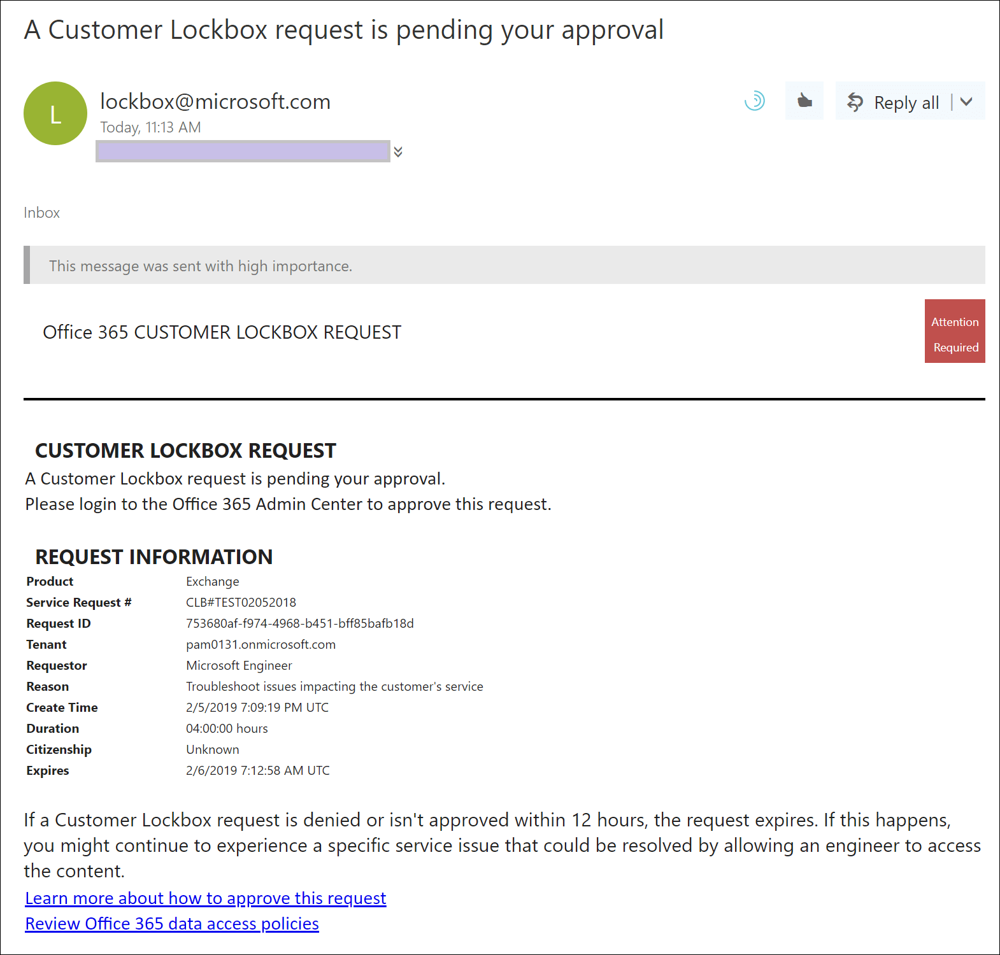
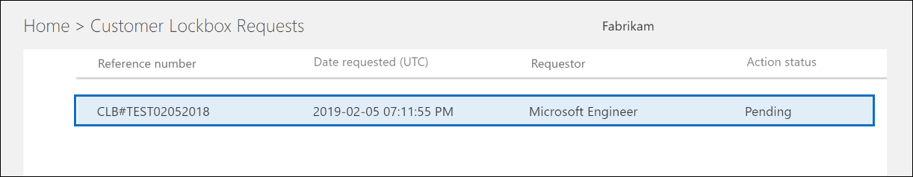
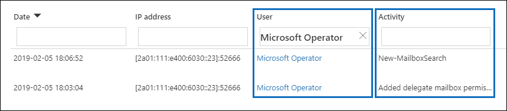
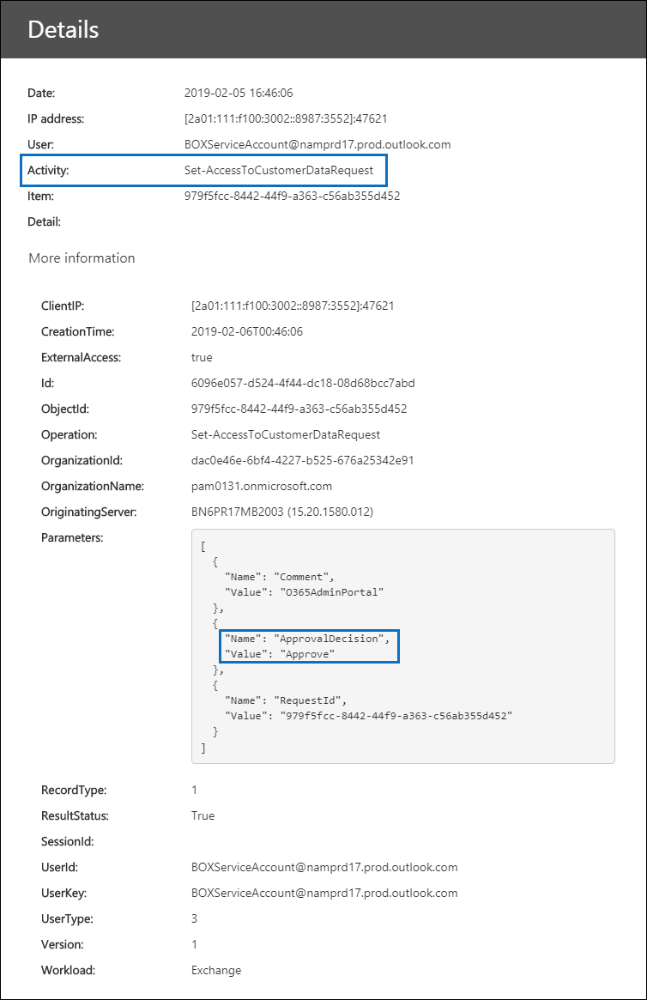

# Référentiel sécurisé du client dans Office 365

> [!NOTE]
> Cet article fournit des conseils de déploiement et de configuration pour une fonctionnalité actuellement disponible uniquement pour les organisations qui ont un abonnement Microsoft 365 E5, Office 365 E5, protection et conformité des informations ou un abonnement de complément de conformité avancé.

Le référentiel sécurisé du client garantit que Microsoft ne peut pas accéder à votre contenu pour effectuer une opération de service sans votre approbation explicite. Le référentiel sécurisé du client vous fournit le flux de travail d’approbation pour les demandes d’accès à votre contenu.

Parfois, les ingénieurs Microsoft aident à résoudre et résoudre les problèmes signalés par les clients dans le processus de support technique. En règle générale, les problèmes sont résolus par des outils de télémétrie et de débogage étendus que Microsoft a en place pour ses services. Toutefois, dans certains cas, un technicien Microsoft doit accéder au contenu client pour déterminer la cause première et résoudre le problème. Le référentiel sécurisé du client exige que l’ingénieur demande l’accès au client en tant que dernière étape du flux de travail approbation. Cela permet aux organisations d’approuver ou de refuser ces demandes et de fournir un contrôle d’accès direct au client.

### Vidéo de présentation du référentiel sécurisé du client

> [!VIDEO https://www.microsoft.com/videoplayer/embed/8fecf10b-1f03-4849-8b67-76d3d2a43f26?autoplay=false]

> [!NOTE]
> Customer Lockbox prend en charge les demandes d’accès aux données dans Exchange Online, SharePoint Online et OneDrive entreprise. Pour recommander la prise en charge d’autres services Office 365, envoyez une demande auprès d' [office 365 UserVoice](https://office365.uservoice.com/).

## Flux de travail bte post.

Les étapes suivantes décrivent le flux de travail standard lorsqu’une demande de référentiel sécurisé client est lancée par un ingénieur Microsoft:

1. Une personne au sein d’une organisation a rencontré un problème avec sa boîte aux lettres Office 365.

2. Une fois que l’utilisateur a résolu le problème, mais qu’il ne peut pas le corriger, il ouvre une demande de support technique auprès du support Microsoft.

3. Un ingénieur du support technique examine la demande de service et détermine qu’il faut accéder au contenu Exchange Online du client pour résoudre le problème.

4. L’ingénieur du support technique se connecte à l’outil de demande de référentiel sécurisé du client et effectue une demande d’accès aux données en spécifiant le nom du client, le numéro de demande de service du client et la durée estimée pour laquelle l’accès aux données est nécessaire.

5. Une fois que le gestionnaire de support Microsoft approuve la demande, le référentiel sécurisé du client envoie à l’organisation du client une notification par courrier électronique relative à la demande d’accès en attente de la part de Microsoft.

    

   > [!NOTE]
   > Toute personne disposant du rôle d’administrateur d' [approbation d’accès au client Lockbox](https://docs.microsoft.com/office365/admin/add-users/about-admin-roles) dans le centre d’administration Microsoft 365 peut approuver les demandes du client Lockbox.

7. L’approbateur se connecte au centre d’administration Microsoft 365 et approuve la demande. Cette étape déclenche la création d’un enregistrement d’audit disponible en recherchant dans le journal d’audit Office 365. Pour plus d’informations, reportez-vous à la section [audit du client Lockbox](#auditing-customer-lockbox-requests) .

   Si le client rejette la demande ou si la demande n’est pas approuvée dans les 12 heures, la demande expire et aucun accès n’est accordé à l’ingénieur Microsoft.

   > [!IMPORTANT]
   > Microsoft n’inclut aucun lien dans les notifications de courrier électronique postal du client qui vous obligent à vous connecter à Office 365.

8. Une fois que le client a approuvé la demande, l’ingénieur Microsoft reçoit le message d’approbation, se connecte à Exchange Online et corrige le problème du client. Les ingénieurs Microsoft ont la durée demandée pour résoudre le problème après lequel l’accès est automatiquement révoqué.

> [!NOTE]
> Toutes les actions effectuées par un ingénieur Microsoft sont consignées dans le journal d’audit Office 365. Vous pouvez rechercher et consulter ces enregistrements d’audit et les Rechercher et les examiner.

## Activer ou désactiver les demandes de référentiel sécurisé du client

Un administrateur Office 365 peut activer les contrôles de référentiel sécurisé du client dans le centre d’administration de Microsoft 365. Lorsque le référentiel sécurisé est activé, Microsoft est tenu d’obtenir l’approbation d’une organisation avant d’accéder à son contenu.

> [!NOTE]
> Pour effectuer la procédure suivante, vous devez être un administrateur général dans votre organisation Microsoft 365 ou Office 365, ou vous devez disposer du rôle d’administrateur de l’approbateur de l' **approbation du client** .

1. Accédez à [https://admin.microsoft.com](https://admin.microsoft.com) et connectez-vous avec votre compte professionnel ou scolaire.

2. Cliquez sur **paramètres > sécurité & confidentialité**.

    

3. Dans la **vignette client-référentiel sécurisé** , cliquez sur **modifier**, puis déplacez le bouton **** bascule sur activé ou **désactivé** pour activer ou désactiver la fonctionnalité.

    

## Approuver ou refuser une demande de référentiel sécurisé d’un client

> [!NOTE]
> Pour effectuer la procédure suivante, vous devez être un administrateur général dans votre organisation Microsoft 365 ou Office 365, ou vous devez disposer du rôle d’administrateur de l’approbateur de l' **approbation du client** .

1. Accédez à [https://admin.microsoft.com](https://admin.microsoft.com) et connectez-vous avec votre compte professionnel ou scolaire.

2. Cliquez sur **Support > demandes de référentiel sécurisé du client**.

    

    Une liste des demandes du client Lockbox s’affiche.

    

3. Sélectionnez une demande de référentiel sécurisé du client, puis cliquez sur **approuver** ou **refuser**.

    

    Un message de confirmation concernant l’approbation de la demande de référentiel sécurisé du client s’affiche.

    

## Audit des demandes de référentiel sécurisé du client 

Les enregistrements d’audit qui correspondent aux demandes de référentiel sécurisé du client sont consignés dans le journal d’audit Office 365 et sont accessibles à l’aide de l' [outil de recherche de journal d’audit](https://docs.microsoft.com/office365/securitycompliance/search-the-audit-log-in-security-and-compliance) dans le centre de conformité & Office 365 Security. Les actions liées à un client qui accepte ou refusent une demande de référentiel sécurisé client et les actions effectuées par des ingénieurs Microsoft (lorsque les demandes d’accès sont approuvées) sont consignées dans le journal d’audit Office 365. Vous pouvez rechercher et consulter ces enregistrements d’audit.

> [!NOTE]
> Vous devez disposer du rôle journaux d’audit en affichage seul ou journaux d’audit dans Exchange Online pour effectuer des recherches dans le journal d’audit Office 365. Pour en savoir plus, reportez-vous à l’article [Effectuer des recherches dans le journal d’audit dans le Centre de sécurité et de conformité Office 365](https://docs.microsoft.com/en-us/office365/securitycompliance/search-the-audit-log-in-security-and-compliance#before-you-begin).

### Rechercher les activités liées aux demandes de référentiel sécurisé du client dans le journal d’audit

Voici comment créer une requête de recherche de journal d’audit pour renvoyer des enregistrements d’audit liés au référentiel sécurisé du client:

1. Accédez à la page [https://protection.office.com](https://protection.office.com).
  
2. Connectez-vous à Office 365 à l'aide de votre compte scolaire ou professionnel.

3. Dans le volet gauche du centre de sécurité & conformité, cliquez sur recherche **&** > **Journal d’audit**de l’enquête Search.

    La page **recherche du journal d’audit** s’affiche.

    
  
4. Configurez les critères de recherche suivants:

    a. **Activités** : laissez ce champ vide afin que la recherche renvoie les enregistrements d’audit pour toutes les activités. Cette opération est nécessaire pour renvoyer les enregistrements d’audit relatifs aux demandes de référentiel sécurisé du client et l’activité correspondante effectuée par les ingénieurs Microsoft.

    b. **Date de début** et **Date de fin** : sélectionnez une date et une plage horaire pour afficher les événements qui se sont produits au cours de cette période.

    c. **Users** : laissez ce champ vide.

    d. **Fichier, dossier ou site** : laissez ce champ vide.

5. Cliquez sur **Rechercher** pour exécuter la recherche à l’aide de vos critères de recherche. 

    Les résultats de la recherche sont chargés et, après quelques instants, s’affichent sous **résultats** dans la page **recherche du journal d’audit** .

6. Cliquez sur **Filtrer les résultats** sur la page des résultats de la recherche, puis effectuez l’une des opérations suivantes:

   - Pour afficher les enregistrements d’audit liés à un approbateur de votre organisation approuvant ou refusant une demande de référentiel sécurisé client: dans la zone sous la colonne **activité** , tapez **Set-AccessToCustomerDataRequest**.

   - Pour afficher les enregistrements d’audit liés à un ingénieur Microsoft qui exécutent des actions en réponse à une demande approuvée de client: dans la zone située sous la colonne **utilisateur** , tapez **opérateur Microsoft**. Notez que l’action effectuée par l’ingénieur est affichée dans la colonne **activité** .

      

7. Dans la liste des résultats, cliquez sur un enregistrement d’audit pour l’afficher.

### Enregistrement d’audit pour une demande d’accès bte post.

Lorsqu’une personne de votre organisation approuve ou refuse une demande de référentiel sécurisé d’un client, un enregistrement d’audit est consigné dans le journal d’audit Office 365. Cet enregistrement contient les informations suivantes. 

| Propriété record d’audit| Description|
|:---------- |:----------|
| Date       | Date et heure d’approbation ou de refus de la demande de référentiel sécurisé du client.
| Adresse IP | Adresse IP de la machine que l’approbateur a utilisé pour approuver ou refuser une demande. |
| Utilisateur       | Le compte de service BOXServiceAccount\[@\]customerforest. prod.Outlook.com.            |
| Activité   | Set-AccessToCustomerDataRequest; Il s’agit de l’activité d’audit qui est enregistrée lorsque vous approuvez ou refusez une demande de référentiel sécurisé d’un client.                                |
| Option       | GUID de la demande de référentiel sécurisé du client                             |

La capture d’écran suivante montre un exemple d’enregistrement de journal d’audit correspondant à une demande approuvée de client Lockbox. Si une demande de référentiel sécurisé du client a été refusée, la valeur du paramètre **ApprovalDecision** serait **Deny**.

> [!TIP]
> Pour afficher des informations plus détaillées dans un enregistrement d’audit, cliquez sur **informations supplémentaires**.

### Enregistrement d’audit pour une action effectuée par un ingénieur Microsoft

Comme expliqué précédemment, les actions effectuées par un ingénieur Microsoft après l’approbation d’une demande de référentiel sécurisé du client (et pouvant entraîner l’accès au contenu du client) sont consignées dans le journal d’audit. Ces enregistrements contiennent les informations suivantes.

| Propriété record d’audit| Description|
|:---------- |:----------|
| Date       | Date et heure d’exécution de l’action. Notez que l’heure à laquelle cette action a été effectuée sera de 4 heures après l’approbation de la demande de référentiel sécurisé du client.              |
| Adresse IP | Adresse IP de l’ordinateur utilisé par Microsoft Engineer. |
| Utilisateur       | Opérateur Microsoft; Cette valeur indique que cet enregistrement est lié à une demande de référentiel sécurisé du client.                                  |
| Activité   | Nom de l’activité effectuée par l’ingénieur Microsoft.|
| Option       | \<éliminer\>                                             |

## Questions fréquemment posées

#### Quels sont les services Office 365 auxquels s’applique le référentiel client?

Le référentiel sécurisé du client est actuellement pris en charge dans Exchange Online, SharePoint Online et OneDrive entreprise.

#### Le référentiel sécurisé du client est-il disponible pour tous les clients Office 365?

Customer Lockbox est inclus avec les abonnements Microsoft 365 ou Office 365 E5 et peut être ajouté à d’autres plans avec une protection des informations et une conformité ou un abonnement de complément de conformité avancé. Pour plus d’informations, reportez-vous à la rubrique [offres et tarifs](https://products.office.com/business/office-365-enterprise-e5-business-software) .

#### Qu’est-ce que le contenu client?

Le contenu client est les données créées par les utilisateurs des services et applications Office 365. Voici des exemples de contenu client:

- Corps ou pièces jointes de courrier électronique

- Contenu du site SharePoint

- Informations dans le corps d’un fichier SharePoint

- Corps du fichier de présentation Skype entreprise

- Messages instantanés ou conversations vocales

- BLOB généré par le client ou données de stockage structuré (par exemple, conteneurs SQL)

- Informations de sécurité appartenant au client (par exemple, certificats, clés de chiffrement et mots de passe)

- Inférences, et toutes les inférences ultérieures, si le contenu du client reste

Pour plus d’informations sur le contenu client dans Office 365, voir le centre de gestion de la [confidentialité office 365](https://products.office.com/en-US/business/office-365-trust-center-privacy/).

#### Qui est averti lorsqu’une demande d’accès à mon contenu est envoyée?

Les administrateurs globaux et tout utilisateur qui a attribué le rôle d’administrateur d’approbation d’accès au client sont avertis. Il s’agit également des mêmes utilisateurs qui peuvent approuver les demandes de référentiel sécurisé du client.

#### Qui peut approuver ou rejeter ces demandes dans mon organisation?

Les administrateurs globaux et quiconque disposant du rôle d’administrateur d’approbation d’accès au client peuvent approuver les demandes du client Lockbox. Les clients contrôlent ces attributions de rôles dans leur organisation.

#### Comment puis-je choisir de cliquer sur le référentiel sécurisé du client?

Un administrateur général peut activer et configurer le référentiel sécurisé du client dans le centre d’administration Microsoft 365 ou Microsoft 365.

#### Si j’approuve une demande de référentiel sécurisé de client, qu’est-ce que l’ingénieur peut faire et comment puis-je savoir ce qu’a fait l’ingénieur Microsoft?

Une fois que vous avez approuvé une demande de référentiel sécurisé de client, l’ingénieur Microsoft a accordé ces privilèges nécessaires pour accéder au contenu du client à l’aide d’applets de commande pré-approuvées. Les actions prises par les ingénieurs Microsoft en réponse aux demandes de référentiel sécurisé du client sont consignées dans le journal d’audit du centre de sécurité & Office 365 Security.

#### Comment savoir que Microsoft suit le processus d’approbation?

Vous pouvez référencer les notifications d’approbation par courrier électronique envoyées aux administrateurs et approbateurs de votre organisation à l’aide de l’historique des demandes du référentiel sécurisé du client dans le centre d’administration 365 de Microsoft.

Le référentiel sécurisé du client est inclus dans le rapport d’audit le plus récent du [SOC 1 SSAE 16](https://servicetrust.microsoft.com/ViewPage/MSComplianceGuide?command=Download&downloadType=Document&downloadId=91592749-e86a-43ac-801e-121382614681&docTab=4ce99610-c9c0-11e7-8c2c-f908a777fa4d_SOC%20%2F%20SSAE%2016%20Reports). Pour plus d’informations, consultez les rapports les plus récents dans le [portail d’approbation de service Microsoft](https://servicetrust.microsoft.com/ViewPage/MSComplianceGuide?command=Download&downloadType=Document&downloadId=91592749-e86a-43ac-801e-121382614681&docTab=4ce99610-c9c0-11e7-8c2c-f908a777fa4d_SOC%20%2F%20SSAE%2016%20Reports).

#### Microsoft peut-il modifier la liste des approbateurs de mon client? Si ce n’est pas le cas, comment est-il empêché?

Seul un administrateur général de votre organisation peut spécifier qui peut approuver les demandes du client Lockbox. Cela signifie que seuls les membres du groupe d’administrateurs général dans Azure Active Directory peuvent spécifier qui peut approuver la demande. L’appartenance au groupe d’administrateurs globaux dans Azure Active Directory est gérée uniquement par votre organisation.

#### Qu’en est-il si j’ai besoin d’informations supplémentaires sur une demande d’accès au contenu pour l’approuver?

Chaque demande de référentiel sécurisé de client contient un numéro de demande de service Office 365. Vous pouvez contacter le support Microsoft et référencer ce numéro de service pour obtenir plus d’informations sur la demande.

#### Lorsqu’une demande de référentiel sécurisé client est approuvée, combien de temps les autorisations sont-elles valides?

Actuellement, la période maximale pour les autorisations d’accès accordées à l’ingénieur Microsoft est de 4 heures. L’ingénieur Microsoft peut également demander une période plus courte.

#### Comment puis-je obtenir un historique de toutes les demandes de référentiel sécurisé du client?

Toutes les demandes de référentiel sécurisé du client sont affichées dans le centre d’administration 365 de Microsoft.

#### Comment établir une corrélation entre les demandes d’accès au contenu et les journaux d’audit associés?

Le flux d’activité du centre de conformité contient les activités de journal sécurisé du client. Les clients peuvent référencer les activités du journal de la boîte postale scellée du client depuis le flux d’activités par rapport à la demande de courrier électronique qu’ils reçoivent.

#### Que se passe-t-il lorsqu’un client ne répond pas à une demande de référentiel sécurisé client?

Les demandes de référentiel sécurisé du client ont une durée par défaut de 12 heures. Si vous ne répondez pas à une demande dans un délai de 12 heures, la demande expire.

#### Qu’est-ce que Microsoft fait lorsqu’un client rejette une demande de référentiel sécurisé client?

Si un client rejette une demande de référentiel sécurisé client, aucun accès au contenu du client n’est effectué. Si un utilisateur de votre organisation continue de présenter un problème de service exigeant que Microsoft accède au contenu client pour résoudre le problème, le problème de service peut persister et Microsoft informe l’utilisateur à ce sujet.

#### Est-ce que le référentiel sécurisé des clients protège contre les demandes de données des services d’application juridique ou d’autres tiers?

Non. Microsoft prend des demandes tierces pour les données client sérieusement. En tant que fournisseur de services Cloud, Microsoft préconise toujours la confidentialité des données client. Dans le cas où nous obtenons une demande, Microsoft tente toujours de rediriger le tiers vers le client pour obtenir les informations. (Lisez le blog de Brad Smith: [protection des données client de l’espionnage public](https://blogs.microsoft.com/blog/2013/12/04/protecting-customer-data-from-government-snooping/)). Nous publions régulièrement des [informations détaillées](https://www.microsoft.com/en-us/corporate-responsibility/lerr) sur les demandes de loi que Microsoft reçoit.

Pour plus d’informations, consultez le centre de gestion de la [confidentialité de Microsoft](https://www.microsoft.com/en-us/trustcenter/default.aspx) concernant les demandes de données tierces et la section «Divulgation des données client» dans les [conditions des services en ligne](https://www.microsoft.com/Licensing/product-licensing/products.aspx) .

#### Comment Microsoft s’assure-t-il qu’un membre de son personnel ne dispose pas d’un accès permanent au contenu du client dans les applications Office 365?

Microsoft met en œuvre des mesures préventives étendues via les systèmes de contrôle d’accès et des mesures de détective pour identifier et résoudre les tentatives de contournement de ces systèmes de contrôle d’accès. Office 365 fonctionne avec les principes du privilège minimum et de l’accès juste-à-temps. Par conséquent, aucun personnel de Microsoft ne dispose de l’autorisation d’accéder au contenu du client de façon continue. Si l’autorisation est accordée, il s’agit d’une durée limitée. 

Office 365 utilise un système de contrôle d’accès appelé *Lockbox* pour traiter les demandes d’autorisations qui accordent la possibilité d’effectuer des fonctions opérationnelles et administratives au sein du service. Un opérateur doit demander l’accès au contenu du client à l’aide de la zone de gestion sécurisée, qui nécessite une deuxième personne pour agir sur la demande (par exemple, l’approuver) avant l’octroi de l’accès. Cette deuxième personne ne peut pas être demandeur et doit être désignée pour approuver l’accès au contenu du client. Uniquement si la demande est approuvée, l’opérateur obtient un accès temporaire au contenu client. Une fois la période d’élévation expirée, la zone de post-zone révoque l’accès.

Pour plus d’informations sur les pratiques de sécurité générale de Microsoft, reportez-vous aux [conditions des services en ligne](https://www.microsoft.com/licensing/product-licensing/products) .

#### Dans quelles circonstances les ingénieurs Microsoft doivent-ils accéder à mon contenu?

Le scénario le plus courant dans lequel les ingénieurs Microsoft ont besoin d’accéder au contenu client est lorsque le client effectue une demande de support nécessitant un accès pour la résolution des problèmes. Un principe de base d’Office 365 est que le service fonctionne sans Microsoft Access au contenu client. Presque toutes les opérations de service effectuées par Microsoft sont entièrement automatisées et l’implication humaine est hautement contrôlée et abstractionnelle du contenu du client. L’objectif pour Office 365 est l’accès au contenu du client pour prendre en charge le service n’est pas nécessaire tant que le client n’a pas approuvé une demande spécifique pour Microsoft Access.

#### J’ai déjà pensé que mes données étaient sécurisées avec Microsoft Cloud, alors pourquoi ai-je besoin du référentiel sécurisé du client?

Le référentiel sécurisé du client fournit une couche supplémentaire de contrôle en offrant aux clients la possibilité d’accorder une autorisation d’accès explicite pour les opérations de service. En démontrant que des procédures sont en place pour autoriser l’accès explicite aux données, le référentiel sécurisé du client aide les clients à respecter certaines obligations de conformité telles que HIPAA et FEDRAMP.
