# Vue d’ensemble des stratégies de protection contre la perte de données

Pour se conformer aux normes et aux réglementations sectorielles, les organisations doivent protéger les informations sensibles et empêcher toute divulgation involontaire. Des exemples d'informations sensibles dont vous pouvez empêcher la fuite en dehors de votre organisation incluent des données financières ou des informations d'identification personnelle, telles que des numéros de carte de crédit, des numéros de sécurité sociale ou des enregistrements d'intégrité. Avec une stratégie de protection contre la perte de données (DLP) dans &amp; le centre de sécurité conformité Office 365, vous pouvez identifier, surveiller et protéger automatiquement les informations sensibles dans Office 365.
  
Avec une stratégie DLP, vous pouvez :
  
- **Identifier les informations sensibles dans de nombreux emplacements, comme Exchange Online, SharePoint Online et OneDrive entreprise.**
    
    Par exemple, vous pouvez identifier tout document contenant un numéro de carte de crédit stocké dans un site OneDrive entreprise, ou vous pouvez surveiller uniquement les sites OneDrive de personnes spécifiques.
    
- **Empêcher le partage accidentel d’informations sensibles** 
    
    Par exemple, vous pouvez identifier tout document ou courrier électronique contenant un enregistrement d'intégrité partagé avec des personnes extérieures à votre organisation, puis bloquer automatiquement l'accès à ce document ou empêcher l'envoi du courrier électronique.
    
- **Surveiller et protéger les informations sensibles dans les versions de bureau d’Excel 2016, de PowerPoint 2016 et de Word 2016**
    
    Tout comme dans Exchange Online, SharePoint Online et OneDrive entreprise, ces programmes de bureau Office 2016 incluent les mêmes fonctionnalités pour identifier les informations sensibles et appliquer des stratégies DLP. DLP assure une surveillance continue lorsque des personnes partagent du contenu dans ces programmes Office 2016.
    
- **aider les utilisateurs à respecter les règles de conformité sans interrompre leur flux de travail ; et**
    
    Vous pouvez informer vos utilisateurs des stratégies DLP et les aider à rester conformes sans bloquer leur travail. Par exemple, si un utilisateur tente de partager un document contenant des informations sensibles, une stratégie DLP peut à la fois envoyer une notification par courrier électronique et lui montrer un Conseil de stratégie dans le contexte de la bibliothèque de documents qui lui permet de remplacer la stratégie si elle a une entreprise justifié. Les mêmes conseils de stratégie s'affichent également dans Outlook sur le Web, Outlook 2013 et versions ultérieures, Excel 2016, PowerPoint 2016 et Word 2016.
    
- **Afficher les rapports DLP présentant le contenu qui correspond aux stratégies DLP de votre organisation.**
    
    Pour évaluer la conformité de votre organisation à une stratégie DLP, vous pouvez voir le nombre de correspondances de chaque stratégie et règle dans le temps. Si une stratégie DLP permet aux utilisateurs de remplacer un Conseil de stratégie et de signaler un faux positif, vous pouvez également consulter ce que les utilisateurs ont signalés.
    
Vous créez et gérez des stratégies DLP sur la page protection contre la perte de données dans &amp; le centre de sécurité conformité Office 365.
  
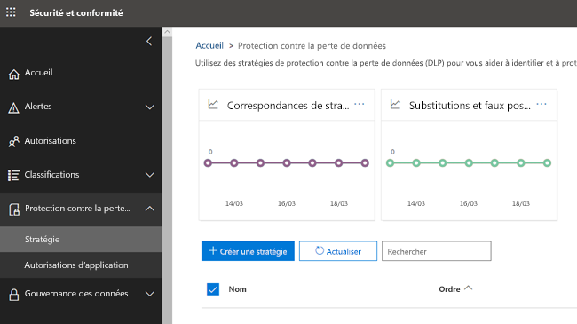
  
## Contenu d’une stratégie DLP

Une stratégie DLP contient quelques éléments de base :
  
- Emplacement de protection des **emplacements** de contenu, tels que les sites Exchange Online, SharePoint Online et OneDrive entreprise. 
    
- Circonstances de protection du contenu en appliquant des **règles** comprenant les éléments suivants : 
    
  - **Conditions auxquelles** le contenu doit répondre avant l'application de la règle, par exemple, recherchez uniquement le contenu contenant des numéros de sécurité sociale qui a été partagé avec des personnes extérieures à votre organisation. 
    
  - **Actions** que vous voulez que la règle exécute automatiquement lorsque du contenu répondant aux conditions est trouvé, par exemple, bloquer l’accès au document et envoyer à l’utilisateur et au responsable de la mise en conformité une notification par courrier électronique. 
    
Vous pouvez utiliser une règle pour répondre à une exigence de protection spécifique, puis utiliser une stratégie DLP pour regrouper des exigences courantes en matière de protection, telles que toutes les règles nécessaires pour se conformer à un règlement spécifique.
  
Par exemple, vous pouvez avoir une stratégie DLP qui vous permet de détecter la présence d'informations couvertes par la loi HIPAA (Health Insurance Portability and Accountability Act). Cette stratégie DLP pourrait aider à protéger les données HIPAA (ce que) sur tous les sites SharePoint Online et tous les sites OneDrive entreprise (le cas échéant) en recherchant tout document contenant ces informations sensibles qui est partagé avec des personnes extérieures à votre organisation (le conditions), puis bloque l'accès au document et l'envoi d'une notification (actions). Ces exigences sont stockées sous forme de règles individuelles et regroupées en tant que stratégie DLP pour simplifier la gestion et la création de rapports.
  
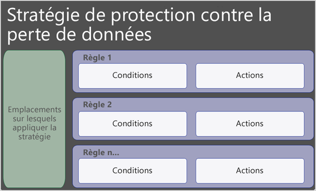
  
### Emplacements

Une stratégie DLP peut trouver et protéger des informations sensibles dans Office 365, que ces informations se trouvent dans Exchange Online, SharePoint Online ou OneDrive entreprise. Vous pouvez facilement choisir de protéger tous les sites SharePoint ou tous les comptes OneDrive, uniquement des sites ou des comptes spécifiques, ou toutes les boîtes aux lettres. Notez qu'il n'est pas encore possible de sélectionner uniquement les boîtes aux lettres d'utilisateurs spécifiques.
  

  
Notez que si vous choisissez d'inclure ou d'exclure des sites SharePoint spécifiques ou des comptes OneDrive, une stratégie DLP ne peut pas contenir plus de 100 ces inclusions et exclusions. Bien que cette limite existe, sachez que vous pouvez dépasser cette limite en appliquant une stratégie à l'échelle de l'organisation ou une stratégie qui s'applique à l'ensemble des emplacements.
  
### Règles

Les règles mettent en œuvre les exigences de votre entreprise sur le contenu de votre organisation. Une stratégie contient une ou plusieurs règles et chaque règle est constituée de conditions et d'actions. Pour chaque règle, lorsque les conditions sont remplies, les actions sont effectuées automatiquement. Les règles sont exécutées de manière séquentielle, en commençant par la règle de priorité la plus élevée de chaque stratégie.
  
Une règle fournit également des options pour informer les utilisateurs (avec les conseils de stratégie et les notifications par courrier électronique) et les administrateurs (avec les rapports d'incident de messagerie) que le contenu correspond à la règle.
  
Voici les composants d'une règle, chacun étant expliqué ci-dessous.
  
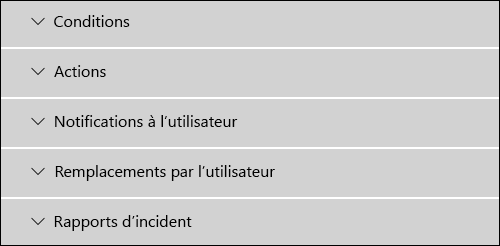
  
#### Conditions

Les conditions sont importantes car elles déterminent les types d'informations que vous recherchez et quand effectuer une action. Par exemple, vous pouvez choisir d'ignorer le contenu contenant des numéros de passeport, sauf si le contenu contient plus de dix chiffres et s'il est partagé avec des personnes extérieures à votre organisation.
  
Les conditions sont centrées sur le **contenu**, par exemple les types d'informations sensibles que vous recherchez, ainsi que sur le **contexte**, par exemple les personnes avec lesquelles le document est partagé. Vous pouvez utiliser des conditions pour attribuer différentes actions à différents niveaux de risque: par exemple, le contenu sensible partagé en interne peut être moins risqué et nécessiter moins d'actions que le contenu sensible partagé avec des personnes extérieures à l'organisation. 
  

  
Les conditions actuellement disponibles peuvent déterminer si :
  
- Le contenu contient un type d'informations sensibles.
    
- Le contenu contient une étiquette. Pour plus d'informations, consultez la section ci-dessous en [utilisant une étiquette comme condition dans une stratégie DLP](data-loss-prevention-policies.md#label).
    
- Le contenu est partagé avec des personnes extérieures ou internes à votre organisation.
    
#### Types d’informations sensibles

Une stratégie DLP peut aider à protéger les informations sensibles, qui est définie comme un **type d'informations sensibles**. Office 365 inclut des définitions pour de nombreux types d'informations sensibles courants dans différentes régions qui sont prêtes à l'emploi, telles que le numéro de carte de crédit, les numéros de compte bancaire, les numéros d'identification nationaux et les numéros de passeport. 
  
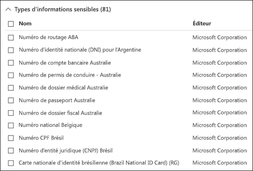
  
Lorsqu'une stratégie DLP recherche un type d'informations sensibles comme un numéro de carte de crédit, il ne recherche pas simplement un nombre à 16 chiffres. Chaque type d'informations sensibles est défini et détecté à l'aide d'une combinaison des éléments suivants:
  
- Mots clés
    
- Fonctions internes pour valider les sommes de contrôle ou la composition
    
- Évaluation d’expressions régulières pour rechercher des correspondances au modèle
    
- Autres examens de contenu
    
Cela permet à la détection de DLP d'atteindre un haut degré de précision tout en réduisant le nombre de faux positifs pouvant interrompre le travail des peuples.
  
#### Actions

Lorsque le contenu correspond à une condition dans une règle, vous pouvez appliquer des actions pour protéger automatiquement le contenu.
  
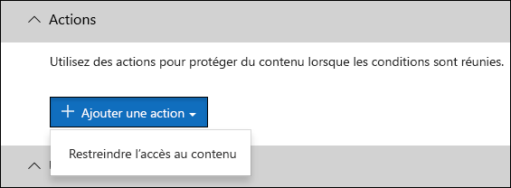
  
Une fois les actions désormais disponibles, vous pouvez:
  
- **Restreindre l'accès au contenu** Pour le contenu de site, cela signifie que les autorisations du document sont restreintes pour tout le monde sauf pour l'administrateur principal de la collection de sites, le propriétaire du document et la personne qui a modifié le document pour la dernière fois. Ces personnes peuvent supprimer les informations sensibles du document ou prendre d'autres mesures correctives. Lorsque le document est en conformité, les autorisations d'origine sont automatiquement restaurées. Lorsque l'accès à un document est bloqué, le document apparaît avec une icône de Conseil de stratégie spéciale dans la bibliothèque sur le site. 
    
    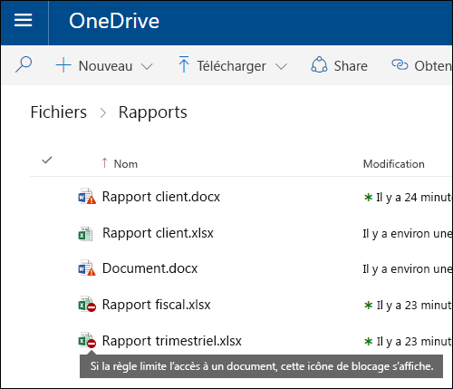
  
    Pour le contenu de messagerie, cette action bloque l'envoi du message. En fonction de la configuration de la règle DLP, l'expéditeur verra apparaître un rapport de non-remise ou (si la règle utilise une notification) un Conseil de stratégie et/ou une notification par courrier électronique.
    
    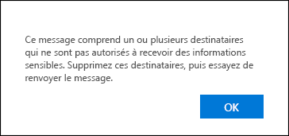
  
#### Notifications utilisateur et substitutions utilisateur

Vous pouvez utiliser des notifications et des remplacements pour informer vos utilisateurs des stratégies DLP et les aider à rester conformes sans bloquer leur travail. Par exemple, si un utilisateur tente de partager un document contenant des informations sensibles, une stratégie DLP peut à la fois envoyer une notification par courrier électronique et lui montrer un Conseil de stratégie dans le contexte de la bibliothèque de documents qui lui permet de remplacer la stratégie si elle a une entreprise justifié.
  
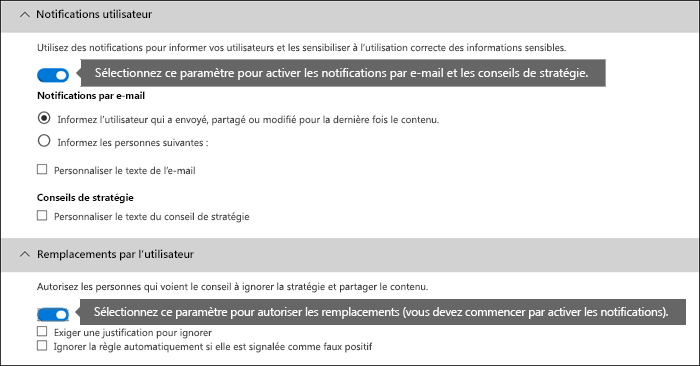
  
Le courrier électronique peut informer la personne qui a envoyé, partagé ou modifié la dernière fois le contenu et, pour le contenu du site, l'administrateur principal de la collection de sites et le propriétaire du document. En outre, vous pouvez ajouter ou supprimer le choix de votre choix dans la notification par courrier électronique.
  
En plus d'envoyer une notification par courrier électronique, une notification de l'utilisateur affiche un Conseil de stratégie:
  
- Dans Outlook 2013 et versions ultérieures et Outlook sur le Web.
    
- Pour le document sur un site SharePoint Online ou OneDrive entreprise.
    
- Dans Excel 2016, PowerPoint 2016 et Word 2016, lorsque le document est stocké sur un site inclus dans une stratégie DLP.
    
Les notifications par courrier électronique et le Conseil de stratégie expliquent pourquoi le contenu est en conflit avec une stratégie DLP. Si vous le souhaitez, les notifications par courrier électronique et le Conseil de stratégie peuvent permettre aux utilisateurs de remplacer une règle en signalant un faux positif ou en fournissant une justification professionnelle. Cela vous permet d'informer les utilisateurs de vos stratégies DLP et de les appliquer sans empêcher les utilisateurs d'effectuer leur travail. Les informations sur les remplacements et les faux positifs sont également consignés pour la création de rapports (voir ci-dessous sur les rapports DLP) et inclus dans la section rapports d'incident (section suivante), afin que l'officier de conformité puisse consulter régulièrement ces informations.
  
Voici à quoi ressemble un Conseil de stratégie dans un compte OneDrive entreprise.
  
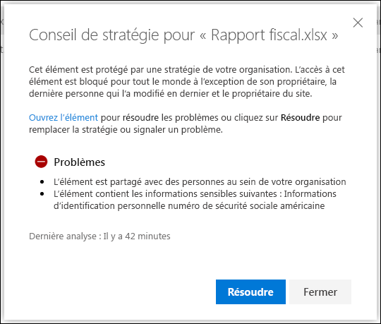
  
#### Rapports d’incident

Lorsqu'une règle est mise en correspondance, vous pouvez envoyer un rapport d'incident à votre responsable de la conformité (ou à toutes les personnes que vous choisissez) avec les détails de l'événement. Ce rapport inclut des informations sur l'élément qui a été mis en correspondance, le contenu réel correspondant à la règle et le nom de la personne qui a modifié le contenu en dernier. Pour les messages électroniques, le rapport inclut également comme pièce jointe le message d'origine correspondant à une stratégie DLP.
  
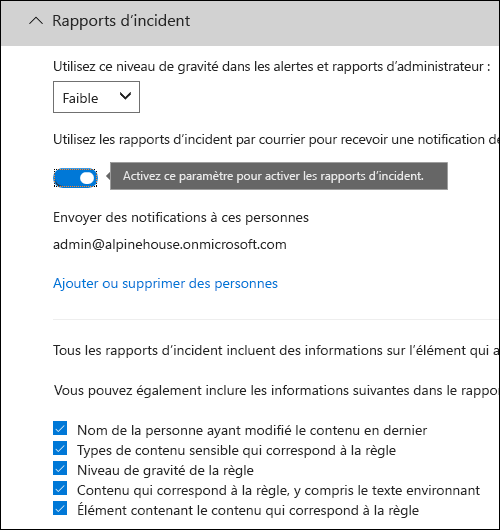
  
## Regroupement et opérateurs logiques

Souvent, votre stratégie DLP a une exigence simple, par exemple pour identifier tout le contenu qui contient un numéro de sécurité sociale américain. Toutefois, dans d'autres scénarios, votre stratégie DLP peut avoir besoin d'identifier des données plus vaguement définies.
  
Par exemple, pour identifier le contenu soumis à la loi américaine Health Insurance Act (HIPAA), vous devez rechercher:
  
- Contenu qui contient des types spécifiques d'informations sensibles, tels que le numéro de sécurité sociale ou le numéro de la Loi sur la mise en œuvre du médicament (DEA).
    
    AND
    
- Contenu plus difficile à identifier, par exemple les communications sur les soins d'un patient ou les descriptions des services médicaux fournis. L'identification de ce contenu nécessite des mots clés correspondants provenant de très grandes listes de mots-clés, tels que la classification internationale des maladies (ICD-9-CM ou ICD-10-CM).
    
Vous pouvez facilement identifier de telles données vaguement définies à l'aide de groupes et d'opérateurs logiques (AND, OR). Lorsque vous créez une stratégie DLP, vous pouvez:
  
- ReGroupez les types d'informations sensibles.
    
- Choisissez l'opérateur logique entre les types d'informations sensibles au sein d'un groupe et entre les groupes eux-mêmes.
    
### Choix de l'opérateur au sein d'un groupe

Au sein d'un groupe, vous pouvez choisir si une partie ou l'ensemble des conditions de ce groupe doivent être satisfaites pour que le contenu corresponde à la règle.
  
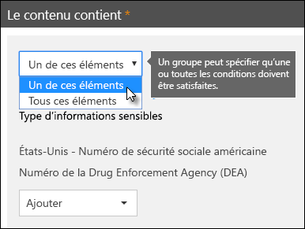
  
### Ajout d'un groupe

Vous pouvez rapidement ajouter un groupe, qui peut avoir ses propres conditions et opérateurs au sein de ce groupe.
  
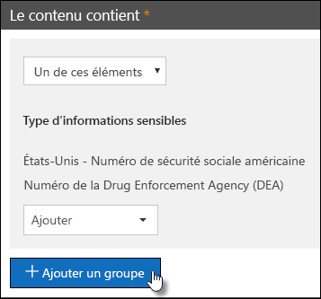
  
### Choix de l'opérateur entre les groupes

Entre les groupes, vous pouvez choisir si les conditions d'un seul groupe ou de tous les groupes doivent être satisfaites pour que le contenu corresponde à la règle.
  
Par exemple, la stratégie intégrée **HIPAA des États-Unis** a une règle qui utilise un opérateur **and** entre les groupes de sorte qu'elle identifie le contenu qui contient: 
  
- à partir des **identificateurs PII** du groupe (au moins un numéro SSN ou un numéro **de** DEA) 
    
    **LES**
    
- à partir du groupe **conditions médicales** (au moins un mot clé ICD-9-cm **ou** un mot clé ICD-10-cm) 
    
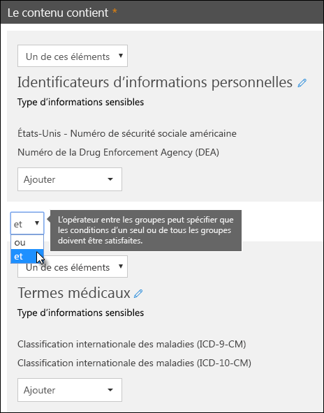
  
## Priorité par laquelle les règles sont traitées

Lorsque vous créez des règles dans une stratégie, une priorité est attribuée à chaque règle dans l'ordre dans lequel elles sont créées, c'est-à-dire que la règle créée en premier a la priorité, la règle créée en second a une deuxième priorité, et ainsi de suite. Une fois que vous avez créé une règle, sa priorité ne peut pas être modifiée, sauf si vous la supprimez et la recréez.
  
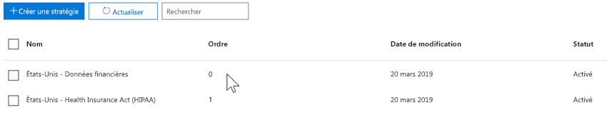
  
Lorsque le contenu est évalué par rapport à des règles, les règles sont traitées par ordre de priorité. Si le contenu correspond à plusieurs règles, les règles sont traitées par ordre de priorité et l'action la plus restrictive est appliquée. Par exemple, si le contenu correspond à toutes les règles suivantes, la règle 3 est appliquée car il s'agit de la plus haute priorité, règle la plus restrictive:
  
- Règle 1: ne notifie que les utilisateurs
    
- Règle 2: avertir les utilisateurs, limiter l'accès et autoriser les substitutions des utilisateurs
    
- Règle 3: avertit les utilisateurs, limite l'accès et n'autorise pas les substitutions de l'utilisateur
    
- Règle 4: avertir uniquement les utilisateurs
    
- Règle 5: limite l'accès
    
- Règle 6: avertit les utilisateurs, limite l'accès et n'autorise pas les substitutions de l'utilisateur
    
Dans cet exemple, Notez que les correspondances pour toutes les règles sont consignées dans les journaux d'audit et affichées dans les rapports DLP, même si seule la règle la plus restrictive est appliquée.
  
En ce qui concerne les conseils de stratégie, notez les éléments suivants:
  
- Uniquement le Conseil de stratégie de la priorité la plus élevée, la règle la plus restrictive s'affiche. Par exemple, un Conseil de stratégie provenant d'une règle qui bloque l'accès au contenu sera affiché sur un Conseil de stratégie à partir d'une règle qui envoie simplement une notification. Cela empêche les personnes de voir une cascade de conseils de stratégie.
    
- Si les conseils de stratégie de la règle la plus restrictive autorisent les utilisateurs à remplacer la règle, toute autre règle également mise en correspondance avec le contenu est aussi remplacée.
    
## Règles de réglage pour les rendre plus faciles ou plus difficiles à mettre en correspondance

Une fois que les utilisateurs ont créé et activé leurs stratégies DLP, ils peuvent parfois rencontrer les problèmes suivants:
  
- Trop de contenu qui **ne contient pas** d'informations sensibles correspond aux règles-en d'autres termes, un trop grand nombre de faux positifs. 
    
- Trop peu de contenu **** , car les informations sensibles correspondent aux règles-en d'autres termes, les actions de protection ne sont pas appliquées aux informations sensibles. 
    
Pour résoudre ces problèmes, vous pouvez régler vos règles en ajustant le nombre d'instances et en fonction de la précision afin de rendre le contenu plus difficile ou plus facile à respecter aux règles. Chaque type d'informations sensibles utilisé dans une règle a un nombre d'instances et correspond à la précision.
  
### Nombre d'instances

Le nombre d'instances signifie simplement le nombre d'occurrences d'un type spécifique d'informations sensibles qui doivent être présentes pour que le contenu corresponde à la règle. Par exemple, le contenu correspondra à la règle indiquée ci-dessous si entre 1 et 9 numéros de passeport uniques aux États-Unis ou au Royaume-Uni sont identifiés.
  
Notez que le nombre d'instances inclut uniquement des correspondances **uniques** pour les mots clés et les types d'informations sensibles. Par exemple, si un message électronique contient 10 occurrences du même numéro de carte de crédit, ces 10 occurrences comptent comme une seule instance d'un numéro de carte de crédit. 
  
Pour utiliser le nombre d'instances pour optimiser les règles, le guide est simple:
  
- Pour faciliter la correspondance de la règle, diminuez le nombre **minimal** et/ou augmentez le nombre **maximal** . Vous pouvez également définir **Max** sur **any** en supprimant la valeur numérique. 
    
- Pour rendre la règle plus difficile à mettre en correspondance, augmentez le nombre de **minutes** . 
    
En règle générale, vous utilisez des actions moins restrictives, telles que l'envoi de notifications d'utilisateur, dans une règle avec un nombre d'instances inférieur (par exemple, 1-9). Et vous utilisez des actions plus restrictives, telles que la restriction de l'accès au contenu sans autoriser les substitutions de l'utilisateur, dans une règle avec un nombre d'instances supérieur (par exemple, 10-any).
  
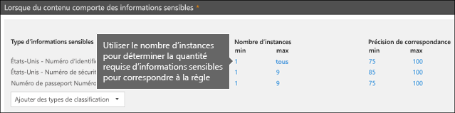
  
### Respecter la précision

Comme indiqué ci-dessus, un type d'informations sensibles est défini et détecté à l'aide d'une combinaison de différents types de preuves. En règle générale, un type d'informations sensibles est défini par plusieurs de ces combinaisons, appelées modèles. Un modèle nécessitant moins de preuves a une exactitude (ou un niveau de confiance) inférieur, tandis qu'un modèle nécessitant davantage de preuves a une précision plus élevée (ou un niveau de confiance). Pour en savoir plus sur les modèles réels et les niveaux de confiance utilisés par chaque type d'informations sensibles, voir [What the Sensitive information types look](what-the-sensitive-information-types-look-for.md).
  
Par exemple, le type d'informations sensibles appelé «numéro de carte de crédit» est défini par deux modèles:
  
- Un modèle avec un niveau de confiance de 65% qui requiert:
    
  - Nombre sous la forme d'un numéro de carte de crédit.
    
  - Nombre qui transmet le checksum.
    
- Un modèle avec un niveau de confiance de 85% qui requiert:
    
  - Nombre sous la forme d'un numéro de carte de crédit.
    
  - Nombre qui transmet le checksum.
    
  - Un mot clé ou une date d'expiration au format correct.
    
Vous pouvez utiliser ces niveaux de confiance (ou respecter la précision) dans vos règles. En règle générale, vous utilisez des actions moins restrictives, telles que l'envoi de notifications d'utilisateur, dans une règle dont la précision est faible. Et vous utilisez des actions plus restrictives, telles que la restriction de l'accès au contenu sans autoriser les remplacements de l'utilisateur, dans une règle de plus grande exactitude.
  
Il est important de comprendre que lorsqu'un type spécifique d'informations sensibles, comme un numéro de carte de crédit, est identifié dans le contenu, un seul niveau de confiance est renvoyé:
  
- Si toutes les correspondances sont pour un seul modèle, le niveau de confiance de ce modèle est renvoyé.
    
- S'il existe des correspondances pour plusieurs modèles (par exemple, il existe des correspondances avec deux niveaux de confiance différents), un niveau de confiance supérieur à celui des modèles uniques est renvoyé. Il s'agit de la partie délicate. Par exemple, pour une carte de crédit, si les modèles 65% et 85% sont mis en correspondance, le niveau de confiance renvoyé pour ce type d'informations sensibles est supérieur à 90%, car davantage de preuves signifient plus de confiance.
    
Par conséquent, si vous souhaitez créer deux règles mutuellement exclusives pour les cartes de crédit, l'une pour la précision de la correspondance de 65% et l'autre pour la précision de la correspondance 85%, les plages pour une précision de correspondance ressemblent à ce qui suit. La première règle sélectionne uniquement les correspondances du modèle 65%. La deuxième règle choisit des correspondances avec **au moins une** correspondance de 85% et **peut éventuellement avoir** d'autres correspondances à faible niveau de confiance. 
  
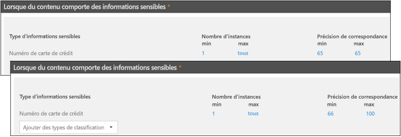
  
Pour ces raisons, les instructions de création de règles avec des précisions de correspondance différentes sont les suivantes:
  
- Le niveau de confiance le plus faible utilise généralement la même valeur pour **min** et **Max** (pas une plage). 
    
- Le niveau de confiance le plus élevé est généralement une plage située au-dessus du niveau de confiance inférieur à 100.
    
- Tous les niveaux de confiance entre le niveau de confiance est inférieur ou égal à juste au-dessous du seuil de confiance le plus élevé.
    
## Utilisation d’une étiquette comme condition dans une stratégie DLP

Vous pouvez créer une étiquette, puis:
  
- **Publiez** -le pour permettre aux utilisateurs finaux de voir et d'appliquer manuellement l'étiquette au contenu. 
    
- **Appliquez** -le automatiquement au contenu correspondant aux conditions que vous choisissez. 
    
Pour plus d'informations sur les étiquettes, consultez la rubrique [vue d'ensemble des étiquettes de](labels.md)rétention.
  
Une fois que vous avez créé une étiquette, vous pouvez utiliser cette étiquette comme condition dans vos stratégies DLP. Par exemple, vous pouvez être amené à effectuer cette opération pour les raisons suivantes:
  
- Vous avez publié une étiquette nommée **confidentiel**, afin que les membres de votre organisation puissent appliquer manuellement l'étiquette aux courriers électroniques et documents confidentiels. En utilisant cette étiquette comme condition dans votre stratégie DLP, vous pouvez limiter le partage du contenu **confidentiel** à des personnes extérieures à votre organisation. 
    
- Vous avez créé une étiquette nommée **Alpine House** pour un projet de ce nom, puis appliqué automatiquement cette étiquette au contenu contenant les mots clés «Alpine House». En utilisant cette étiquette comme condition dans votre stratégie DLP, vous pouvez afficher un Conseil de stratégie aux utilisateurs finals lorsqu'ils sont sur le point de partager ce contenu avec une personne extérieure à votre organisation. 
    
- Vous avez publié une étiquette nommée **enregistrement de taxe**afin que votre gestionnaire d'enregistrements puisse appliquer manuellement l'étiquette au contenu qui doit être classé comme un enregistrement. En utilisant cette étiquette comme condition dans votre stratégie DLP, vous pouvez rechercher du contenu avec cette étiquette en association avec d'autres types d'informations sensibles, telles que ITINs ou numéros; appliquer les actions de protection au contenu étiquette **enregistrement taxe**; et obtenez des rapports d'activité détaillés sur la stratégie DLP des rapports DLP et des données du journal d'audit. 
    
- Vous avez publié une étiquette nommée **Executive Leadership Team-sensible** aux boîtes aux lettres Exchange et aux comptes OneDrive d'un groupe de cadres. En utilisant cette étiquette comme condition dans votre stratégie DLP, vous pouvez appliquer des actions de rétention et de protection sur le même sous-ensemble de contenu et d'utilisateurs. 
    
En utilisant des étiquettes comme condition dans vos règles DLP, vous pouvez appliquer de manière sélective des actions de protection à un ensemble spécifique de contenu, d'emplacements ou d'utilisateurs.
  
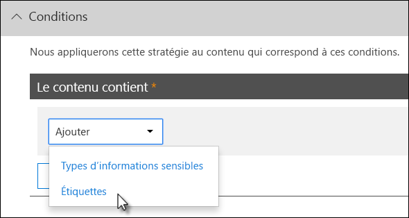

### Prise en charge des étiquettes de sensibilité

Notez que vous ne pouvez utiliser actuellement qu'une étiquette de rétention en tant que condition, et non une [étiquette de critère de diffusion](sensitivity-labels.md). Nous travaillons actuellement sur la prise en charge de l'utilisation d'une étiquette de sensibilité dans cette condition.
  
### Relation entre cette fonctionnalité et les autres fonctionnalités

Plusieurs fonctionnalités peuvent être appliquées au contenu contenant des informations sensibles:
  
- Une [étiquette](labels.md#applying-a-retention-label-automatically-based-on-conditions) de rétention et une [stratégie](retention-policies.md) de rétention peuvent appliquer des actions de rétention à ce contenu. **** 
    
- Une stratégie DLP peut appliquer des actions de **protection** à ce contenu. Avant d'appliquer ces actions, une stratégie DLP peut exiger que d'autres conditions soient satisfaites en plus du contenu contenant une étiquette. 
    
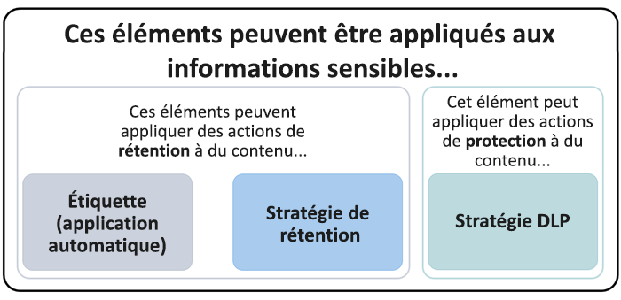
  
Notez qu'une stratégie DLP dispose d'une fonctionnalité de détection plus riche qu'une étiquette ou une stratégie de rétention appliquée à des informations sensibles. Une stratégie DLP peut appliquer des actions de protection au contenu contenant des informations sensibles et, si les informations sensibles sont supprimées du contenu, ces actions de protection seront annulées lors de la prochaine analyse du contenu. Toutefois, si une stratégie de rétention ou une étiquette est appliquée au contenu contenant des informations sensibles, il s'agit d'une action unique qui ne sera pas annulée même si les informations sensibles ont été supprimées.
  
En utilisant une étiquette comme condition dans une stratégie DLP, vous pouvez appliquer à la fois des actions de rétention et de protection sur le contenu avec cette étiquette. Vous pouvez considérer le contenu contenant une étiquette exactement comme du contenu qui contient des informations sensibles, à la fois une étiquette et un type d'informations sensibles sont des propriétés utilisées pour classer le contenu, afin que vous puissiez appliquer des actions à ce contenu.
  
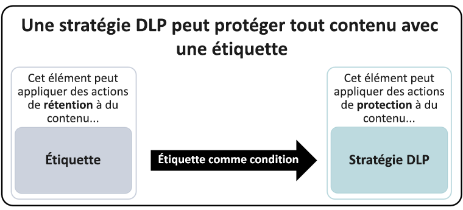
  
## Paramètres simples et paramètres avancés

Lorsque vous créez une stratégie DLP, vous devez choisir entre les paramètres simple et avancé:
  
- Les **paramètres simples** permettent de créer facilement le type de stratégie DLP le plus courant sans utiliser l'éditeur de règles pour créer ou modifier des règles. 
    
- Les **Paramètres avancés** utilisent l'éditeur de règles pour vous permettre de contrôler entièrement chaque paramètre de votre stratégie DLP. 
    
Ne vous inquiétez pas, sous les couvertures, des paramètres simples et des paramètres avancés fonctionnent exactement de la même manière, en appliquant des règles comprenant des conditions et des actions, uniquement avec des paramètres simples, vous ne voyez pas l'éditeur de règle. Il s'agit d'un moyen rapide de créer une stratégie DLP.
  
### Paramètres simples

Dans la mesure du possible, le scénario DLP le plus courant consiste à créer une stratégie permettant de protéger le contenu contenant des informations sensibles et de le partager avec des personnes extérieures à votre organisation, et de prendre des mesures correctives automatiques telles que le fait de restreindre l'accès au contenu. envoi des notifications de l'utilisateur final ou de l'administrateur, et audit de l'événement pour une enquête ultérieure. Les utilisateurs utilisent DLP pour empêcher la divulgation involontaire d'informations sensibles.
  
Pour simplifier la réalisation de cet objectif, lorsque vous créez une stratégie DLP, vous pouvez choisir **utiliser des paramètres simples**. Ces paramètres fournissent tout ce dont vous avez besoin pour implémenter la stratégie DLP la plus courante, sans avoir à passer par l'éditeur de règles.
  
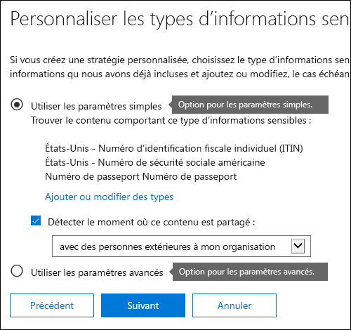
  
### Paramètres avancés

Si vous avez besoin de créer des stratégies DLP plus personnalisées, vous pouvez choisir **utiliser des paramètres avancés**.
  
Les paramètres avancés présentent l'éditeur de règles, qui vous permet de contrôler totalement toutes les options possibles, notamment le nombre d'instances et la précision (niveau de confiance) de chaque règle.
  
Pour accéder rapidement à une section, cliquez sur un élément dans la barre de navigation supérieure de l'éditeur de règles pour accéder à cette section ci-dessous.
  
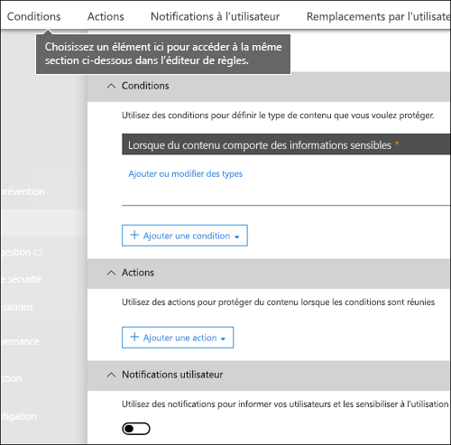
  
## Modèles de stratégie de protection contre la perte de données (DLP)

La première étape de la création d'une stratégie DLP consiste à choisir les informations à protéger. En commençant par un modèle DLP, vous enregistrez le travail de création d'un nouvel ensemble de règles à partir de zéro, et vous déterminez les types d'informations qui doivent être inclus par défaut. Vous pouvez ensuite ajouter ou modifier ces exigences pour affiner la règle afin de répondre aux besoins spécifiques de votre organisation.
  
Un modèle de stratégie DLP préconfiguré peut vous aider à détecter des types spécifiques d'informations sensibles, telles que les données HIPAA, les données PCI-DSS, les données Act-Leach-Bliley Act ou même des informations d'identification personnelle spécifiques aux paramètres régionaux (P.I.). Pour faciliter la recherche et la protection des types courants d'informations sensibles, les modèles de stratégie inclus dans Office 365 contiennent déjà les types d'informations sensibles les plus courants dont vous avez besoin pour commencer.
  
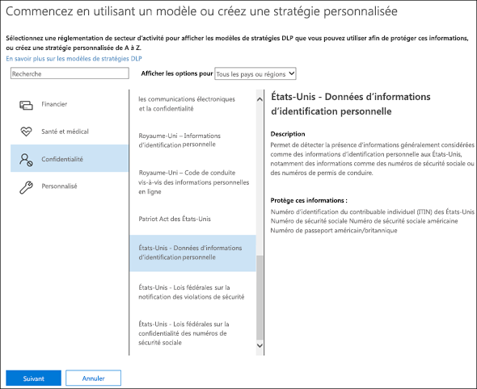
  
Votre organisation peut également avoir ses propres exigences spécifiques, auquel cas vous pouvez créer une stratégie DLP de a à z en choisissant l'option de **stratégie personnalisée** . Une stratégie personnalisée est vide et ne contient aucune règle prédéfinie. 
  
## Déployer progressivement des stratégies DLP avec le mode test

Lorsque vous créez vos stratégies DLP, vous devez envisager de les déployer graduellement pour évaluer leur impact et tester leur efficacité avant de les appliquer complètement. Par exemple, vous ne voulez pas qu'une nouvelle stratégie DLP bloque involontairement l'accès à des milliers de documents auxquels les utilisateurs ont besoin d'accéder pour effectuer leur travail.
  
Si vous créez des stratégies DLP avec un impact potentiel important, nous vous recommandons de suivre cette séquence:
  
1. **Commencez en mode test sans conseils de stratégie** , puis utilisez les rapports DLP et tous les rapports d'incident pour évaluer l'impact. Vous pouvez utiliser les rapports DLP pour afficher le nombre, l'emplacement, le type et la gravité des correspondances de stratégie. En fonction des résultats, vous pouvez affiner les règles selon vos besoins. En mode test, les stratégies DLP n'ont pas d'impact sur la productivité des personnes travaillant dans votre organisation. 
    
2. **Passez en mode test avec les notifications et les conseils de stratégie** pour pouvoir commencer à enseigner aux utilisateurs les stratégies de conformité et à les préparer pour les règles à appliquer. À ce stade, vous pouvez également demander aux utilisateurs de signaler les faux positifs afin que vous puissiez affiner les règles. 
    
3. **Démarrez la mise en œuvre complète sur les stratégies** afin que les actions des règles soient appliquées et que le contenu soit protégé. Continuez à surveiller les rapports DLP, ainsi que les rapports d'incident ou les notifications pour vous assurer que les résultats sont bien ceux que vous souhaitez. 
    

  
Vous pouvez désactiver une stratégie DLP à tout moment, ce qui affecte toutes les règles de la stratégie. Toutefois, chaque règle peut également être désactivée individuellement en basculant sur son état dans l'éditeur de règles.
  
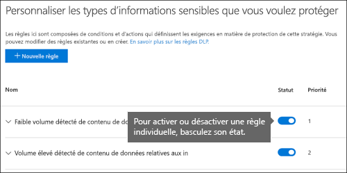
  
## Rapports DLP

Une fois que vous avez créé et activé vos stratégies DLP, vous devez vérifier qu'elles fonctionnent comme vous le souhaitez et vous aider à respecter les exigences de conformité. Avec les rapports DLP, vous pouvez rapidement afficher le nombre de correspondances de stratégie et de règle DLP dans le temps, ainsi que le nombre de faux positifs et de remplacements. Pour chaque rapport, vous pouvez filtrer ces correspondances par emplacement, période et même réduire à une stratégie, une règle ou une action spécifique.
  
Grâce aux rapports DLP, vous pouvez obtenir une vue d’ensemble des activités et :
  
- Vous concentrer sur des périodes spécifiques et comprendre les motifs des pics et des tendances
    
- Découvrez les processus d'entreprise qui enfreignent les stratégies de conformité de votre organisation.
    
- Comprendre l’impact professionnel des stratégies DLP
    
En outre, vous pouvez utiliser les rapports DLP pour affiner vos stratégies DLP lorsque vous les exécutez.
  
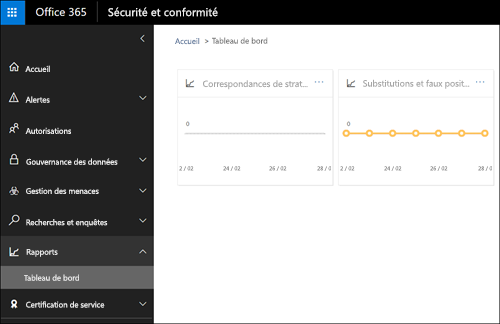
  
## Fonctionnement des stratégies DLP

DLP détecte les informations sensibles à l’aide d’une analyse approfondie du contenu (et pas d’une simple analyse de texte). Cette analyse approfondie utilise les correspondances de mots clés, les correspondances de dictionnaire, l’évaluation des expressions régulières, les fonctions internes et d’autres méthodes pour détecter le contenu qui correspond à vos stratégies DLP. Seul un petit pourcentage de vos données peut être considéré comme sensible. Une stratégie DLP peut identifier, surveiller et protéger automatiquement ces données uniquement, sans gêner ou affecter les personnes travaillant avec le reste de votre contenu.
  
### Synchronisation des stratégies

Une fois que vous avez créé une stratégie DLP &amp; dans le centre de sécurité conformité, elle est stockée dans un magasin de stratégies central, puis synchronisée avec les différentes sources de contenu, notamment:
  
- Exchange Online et à partir de là, Outlook sur le Web et Outlook 2013 et versions ultérieures
    
- Sites OneDrive Entreprise
    
- Sites SharePoint Online
    
- Programmes de bureau Office 2016 (Excel 2016, PowerPoint 2016 et Word 2016)
    
Une fois que la stratégie a été synchronisée aux emplacements corrects, elle commence à évaluer le contenu et à appliquer les actions.
  
### Évaluation des stratégies dans les sites OneDrive Entreprise et SharePoint Online

Sur tous vos sites SharePoint Online et OneDrive entreprise, les documents changent constamment: ils sont en permanence créés, modifiés, partagés, et ainsi de suite. Cela signifie que les documents peuvent entrer en conflit ou devenir conformes à une stratégie DLP à tout moment. Par exemple, une personne peut télécharger un document qui ne contient pas d'informations sensibles sur son site d'équipe, mais une autre personne peut modifier le même document et y ajouter des informations sensibles.
  
Pour cette raison, les stratégies DLP vérifient les correspondances de stratégie fréquemment dans les documents en arrière-plan. Vous pouvez considérer ceci comme une évaluation asynchrone des stratégies.
  
Voici comment cela fonctionne. Lorsque les utilisateurs ajoutent ou modifient des documents dans leurs sites, le moteur de recherche analyse le contenu, afin que vous puissiez le Rechercher plus tard. Pendant ce temps, le contenu analyse également les informations sensibles afin de vérifier s'il est partagé. Toutes les informations sensibles trouvées sont stockées de manière sécurisée dans l'index de recherche, afin que seule l'équipe de conformité puisse y accéder, mais pas les utilisateurs classiques. Chaque stratégie DLP que vous avez activée s'exécute en arrière-plan (de façon asynchrone), en vérifiant fréquemment la recherche de contenu correspondant à une stratégie et en appliquant des actions pour la protéger contre des fuites involontaires.
  
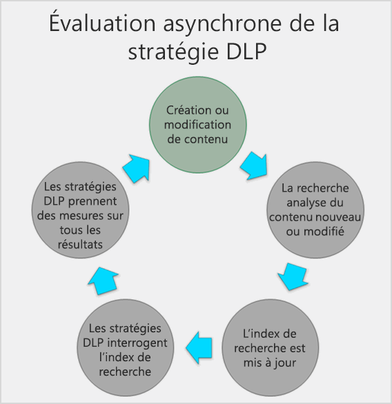
  
Enfin, les documents peuvent entrer en conflit avec une stratégie DLP, mais ils peuvent également y devenir conformes. Par exemple, si une personne ajoute des numéros de carte de crédit à un document, une stratégie DLP peut alors bloquer l’accès au document automatiquement. Toutefois, si cette personne supprime ensuite les informations sensibles, l’action (dans ce cas, le blocage) est annulée automatiquement à la prochaine évaluation du document par rapport à la stratégie.
  
DLP évalue tout contenu pouvant être indexé. Pour plus d'informations sur les types de fichiers analysés par défaut, reportez-vous aux [extensions de nom de fichier et aux types de fichiers analysés par défaut dans SharePoint Server 2013](https://go.microsoft.com/fwlink/p/?LinkID=627430).
  
### Évaluation de stratégie dans Exchange Online, Outlook 2013 et versions ultérieures, et Outlook sur le Web

Lorsque vous créez une stratégie DLP qui inclut Exchange Online en tant qu'emplacement, la stratégie est synchronisée à partir du centre &amp; de sécurité conformité d'Office 365 vers Exchange Online, puis d'Exchange Online vers Outlook sur le Web et Outlook 2013 et versions ultérieures.
  
Lorsqu'un message est composé dans Outlook, l'utilisateur peut voir les conseils de stratégie pendant que le contenu créé est évalué par rapport aux stratégies DLP. Et après l'envoi d'un message, il est évalué par rapport aux stratégies DLP dans le cadre d'un flux de messagerie, ainsi qu'avec les règles de transport et les stratégies DLP créées dans le centre d'administration Exchange (voir la section suivante pour plus d'informations). Les stratégies DLP analysent à la fois le message et les pièces jointes.
  
### Évaluation des stratégies dans les programmes de bureau Office 2016

Excel 2016, PowerPoint 2016 et Word 2016 permettent d'identifier les informations sensibles et d'appliquer des stratégies DLP en tant que SharePoint Online et OneDrive entreprise. Ces programmes Office 2016 synchronisent leurs stratégies DLP directement à partir du magasin de stratégies central, puis évaluent continuellement le contenu par rapport aux stratégies DLP lorsque les utilisateurs travaillent avec des documents ouverts à partir d'un site inclus dans une stratégie DLP.
  
L'évaluation de la stratégie DLP dans Office 2016 est conçue pour ne pas affecter les performances des programmes ou la productivité des personnes travaillant sur le contenu. S'ils travaillent sur un document volumineux ou si l'ordinateur de l'utilisateur est occupé, un Conseil de stratégie peut prendre quelques secondes.
  
## Autorisations

Les membres de votre équipe de conformité qui créeront des stratégies DLP doivent disposer &amp; d'autorisations sur le centre de sécurité conformité. Par défaut, votre administrateur client aura accès à cet emplacement et pourra donner aux responsables de la mise en conformité et d'autres &amp; personnes l'accès au centre de sécurité conformité, sans leur accorder toutes les autorisations d'un administrateur client. Pour ce faire, nous vous recommandons d'effectuer les opérations suivantes:
  
1. Créez un groupe dans Office 365 et ajoutez-y des responsables de la mise en conformité.
    
2. Créez un groupe de rôles sur la page **autorisations** du centre &amp; de sécurité et de conformité. 
    
3. Ajoutez le groupe Office 365 au groupe de rôles.
    
Pour plus d’informations, voir [Give users access to the Office 365 Compliance Center](grant-access-to-the-security-and-compliance-center.md).
  
Ces autorisations sont requises uniquement pour créer et appliquer une stratégie DLP. L’application d’une stratégie ne nécessite pas d’accès au contenu.
  
## Rechercher les applets de commande DLP

Pour utiliser la plupart des applets de commande pour &amp; le centre de sécurité conformité, vous devez:
  
1. [Se connecter au Centre de sécurité &amp; conformité Office 365 à l’aide de PowerShell à distance](http://go.microsoft.com/fwlink/?LinkID=799771&amp;clcid=0x409)
    
2. Utiliser l'une des applets de commande du [Centre de sécurité &amp; conformité Office 365](http://go.microsoft.com/fwlink/?LinkID=799772&amp;clcid=0x409)
    
Toutefois, les rapports DLP doivent extraire des données d'Office 365, y compris Exchange Online. Pour cette raison, les applets de commande pour les rapports DLP sont disponibles dans Exchange Online PowerShell--pas &amp; dans le centre de sécurité conformité PowerShell. Par conséquent, pour utiliser les applets de commande pour les rapports DLP, vous devez:
  
1. [Connexion à Exchange Online à l'aide de Remote PowerShell](http://go.microsoft.com/fwlink/?LinkID=799773&amp;clcid=0x409)
    
2. Utilisez l'une de ces applets de commande pour les rapports DLP:
    
  - [Get-DlpDetectionsReport](http://go.microsoft.com/fwlink/?LinkID=799774&amp;clcid=0x409)
    
  - [Get-DlpDetailReport](http://go.microsoft.com/fwlink/?LinkID=799775&amp;clcid=0x409)
    
## Plus d’informations

- [Création d’une stratégie DLP à partir d’un modèle](create-a-dlp-policy-from-a-template.md)
    
- [Envoi des notifications et affichage des conseils de stratégie pour les stratégies DLP](use-notifications-and-policy-tips.md)
    
- [Créer une stratégie DLP pour protéger les documents avec l’ICF ou d’autres propriétés](protect-documents-that-have-fci-or-other-properties.md)
    
- [Contenu des modèles de stratégie DLP](what-the-dlp-policy-templates-include.md)
    
- [Éléments recherchés par les types d’informations sensibles](what-the-sensitive-information-types-look-for.md)
    
- [Éléments recherchés par les fonctions DLP](what-the-dlp-functions-look-for.md)
    
- [Créer un type d’informations sensibles personnalisé](create-a-custom-sensitive-information-type.md)
    

