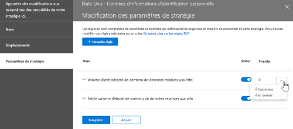

# Vue d’ensemble des stratégies de protection contre la perte de donnéesOverview of data loss prevention policies

Pour respecter les normes de l'entreprise et les réglementations du secteur, les organisations doivent protéger les informations sensibles et empêcher leur divulgation accidentelle.To comply with business standards and industry regulations, organizations need to protect sensitive information and prevent its inadvertent disclosure. Voici quelques exemples d’informations sensibles dont la communication à l’extérieur de votre organisation devrait être évitée : données financières, informations d’identification personnelle (PII) telles que les numéros de carte de crédit, les numéros de sécurité sociale ou les dossiers médicaux.Examples of sensitive information that you might want to prevent from leaking outside your organization include financial data or personally identifiable information (PII) such as credit card numbers, social security numbers, or health records. Avec une stratégie de protection contre la perte de données (DLP) dans &amp; le centre de sécurité conformité Office 365, vous pouvez identifier, surveiller et protéger automatiquement les informations sensibles dans Office 365.With a data loss prevention (DLP) policy in the Office 365 Security &amp; Compliance Center, you can identify, monitor, and automatically protect sensitive information across Office 365.
  
Avec une stratégie DLP, vous pouvez :With a DLP policy, you can:
  
- **Identifier les informations sensibles dans de nombreux emplacements, comme Exchange Online, SharePoint Online, OneDrive entreprise et Microsoft Teams.Identify sensitive information across many locations, such as Exchange Online, SharePoint Online, OneDrive for Business, and Microsoft Teams.**
    
    Par exemple, vous pouvez identifier tout document contenant un numéro de carte de crédit stocké dans un site OneDrive entreprise, ou vous pouvez surveiller uniquement les sites OneDrive de personnes spécifiques.For example, you can identify any document containing a credit card number that's stored in any OneDrive for Business site, or you can monitor just the OneDrive sites of specific people.
    
- **Empêcher le partage accidentel d’informations sensibles****Prevent the accidental sharing of sensitive information**. 
    
    Par exemple, vous pouvez identifier tout document ou courrier électronique contenant un enregistrement d'intégrité partagé avec des personnes extérieures à votre organisation, puis bloquer automatiquement l'accès à ce document ou empêcher l'envoi du courrier électronique.For example, you can identify any document or email containing a health record that's shared with people outside your organization, and then automatically block access to that document or block the email from being sent.
    
- **Surveiller et protéger les informations sensibles dans les versions de bureau d'Excel, PowerPoint et Word.Monitor and protect sensitive information in the desktop versions of Excel, PowerPoint, and Word.**
    
    Tout comme dans Exchange Online, SharePoint Online et OneDrive entreprise, ces programmes de bureau Office incluent les mêmes fonctionnalités pour identifier les informations sensibles et appliquer des stratégies DLP.Just like in Exchange Online, SharePoint Online, and OneDrive for Business, these Office desktop programs include the same capabilities to identify sensitive information and apply DLP policies. DLP assure une surveillance continue lorsque des personnes partagent du contenu dans ces programmes Office.DLP provides continuous monitoring when people share content in these Office programs.
    
- **Aider les utilisateurs à découvrir comment assurer la conformité sans interrompre leur flux de travailHelp users learn how to stay compliant without interrupting their workflow.**
    
    Vous pouvez informer vos utilisateurs sur les stratégies DLP et les aider à maintenir la conformité sans bloquer leur travail.You can educate your users about DLP policies and help them remain compliant without blocking their work. Par exemple, si un utilisateur tente de partager un document contenant des informations sensibles, une stratégie DLP peut lui envoyer une notification par courrier électronique et afficher un conseil de stratégie dans le contexte de la bibliothèque de documents, qui lui permet de remplacer la stratégie s’il a une raison professionnelle de le faire.For example, if a user tries to share a document containing sensitive information, a DLP policy can both send them an email notification and show them a policy tip in the context of the document library that allows them to override the policy if they have a business justification. Les mêmes conseils de stratégie s'affichent également dans Outlook sur le Web, Outlook, Excel, PowerPoint et Word.The same policy tips also appear in Outlook on the web, Outlook, Excel, PowerPoint, and Word.
    
- **Afficher les rapports DLP présentant le contenu qui correspond aux stratégies DLP de votre organisation.View DLP reports showing content that matches your organization's DLP policies.**
    
    Pour évaluer dans quelle mesure votre organisation se conforme à une stratégie DLP, vous pouvez savoir le nombre de correspondances à chaque stratégie et chaque règle au fil du temps.To assess how your organization is complying with a DLP policy, you can see how many matches each policy and rule has over time. Si une stratégie DLP permet aux utilisateurs de remplacer un Conseil de stratégie et de signaler un faux positif, vous pouvez également consulter ce que les utilisateurs ont signalés.If a DLP policy allows users to override a policy tip and report a false positive, you can also view what users have reported.
    
Vous créez et gérez des stratégies DLP sur la page protection contre la perte de données dans &amp; le centre de sécurité conformité Office 365.You create and manage DLP policies on the Data loss prevention page in the Office 365 Security &amp; Compliance Center.
  

  
## Contenu d’une stratégie DLPWhat a DLP policy contains

Une stratégie DLP contient quelques éléments de base :A DLP policy contains a few basic things:
  
- Emplacement de protection du contenu: des **emplacements** comme Exchange Online, SharePoint Online et OneDrive entreprise, ainsi que des conversations et canaux Microsoft Teams.Where to protect the content: **locations** such as Exchange Online, SharePoint Online, and OneDrive for Business sites, as well as Microsoft Teams chats and channels. 
    
- Circonstances de protection du contenu en appliquant des **règles** comprenant les éléments suivants :When and how to protect the content by enforcing **rules** comprised of: 
    
  - **Conditions auxquelles** le contenu doit répondre avant l'application de la règle.**Conditions** the content must match before the rule is enforced. Par exemple, une règle peut être configurée pour rechercher uniquement le contenu contenant des numéros de sécurité sociale qui a été partagé avec des personnes extérieures à votre organisation.For example, a rule might be configured to look only for content containing Social Security numbers that's been shared with people outside your organization. 
    
  - **Actions** que vous souhaitez que la règle effectue automatiquement lorsque le contenu correspondant aux conditions est trouvé.**Actions** that you want the rule to take automatically when content matching the conditions is found. Par exemple, une règle peut être configurée pour bloquer l'accès à un document et envoyer à l'utilisateur et au responsable de la mise en conformité une notification par courrier électronique.For example, a rule might be configured to block access to a document and send both the user and compliance officer an email notification. 
    
Vous pouvez utiliser une règle pour satisfaire une exigence de protection spécifique, puis une stratégie DLP pour regrouper les exigences de protection courantes, comme l’ensemble des règles nécessaires pour se conformer à une réglementation donnée.You can use a rule to meet a specific protection requirement, and then use a DLP policy to group together common protection requirements, such as all of the rules needed to comply with a specific regulation.
  
Par exemple, vous pouvez disposer d’une stratégie DLP qui vous permet de détecter la présence d’informations protégées par la loi Health Insurance Portability and Accountability Act (HIPAA).For example, you might have a DLP policy that helps you detect the presence of information subject to the Health Insurance Portability and Accountability Act (HIPAA). Cette stratégie DLP pourrait aider à protéger les données HIPAA (ce que) sur tous les sites SharePoint Online et tous les sites OneDrive entreprise (le cas échéant) en recherchant tout document contenant ces informations sensibles qui est partagé avec des personnes extérieures à votre organisation (le conditions), puis bloque l'accès au document et l'envoi d'une notification (actions).This DLP policy could help protect HIPAA data (the what) across all SharePoint Online sites and all OneDrive for Business sites (the where) by finding any document containing this sensitive information that's shared with people outside your organization (the conditions) and then blocking access to the document and sending a notification (the actions). Ces exigences sont stockées sous forme de règles individuelles et regroupées dans une stratégie DLP pour simplifier la gestion et la création de rapports.These requirements are stored as individual rules and grouped together as a DLP policy to simplify management and reporting.
  

  
### EmplacementsLocations

Une stratégie DLP peut trouver et protéger des informations sensibles dans Office 365, que ces informations se trouvent dans Exchange Online, SharePoint Online, OneDrive entreprise ou Microsoft Teams.A DLP policy can find and protect sensitive information across Office 365, whether that information is located in Exchange Online, SharePoint Online, OneDrive for Business, or Microsoft Teams. Vous pouvez choisir de protéger le contenu dans les courriers électroniques Exchange, les conversations et les canaux de Microsoft Teams, ainsi que toutes les bibliothèques SharePoint ou OneDrive, ou sélectionner des emplacements spécifiques pour une stratégie.You can choose to protect content in Exchange email, Microsoft Teams chats and channels, and all SharePoint or OneDrive libraries, or select specific locations for a policy.
  

  
Notez que si vous choisissez d'inclure ou d'exclure des sites SharePoint spécifiques ou des comptes OneDrive, une stratégie DLP ne peut pas contenir plus de 100 ces inclusions et exclusions.Note that if you choose to include or exclude specific SharePoint sites or OneDrive accounts, a DLP policy can contain no more than 100 such inclusions and exclusions. Bien que cette limite existe, sachez que vous pouvez dépasser cette limite en appliquant une stratégie à l'échelle de l'organisation ou une stratégie qui s'applique à l'ensemble des emplacements.Although this limit exists, understand that you can exceed this limit by applying either an org-wide policy or a policy that applies to entire locations.
  
### RèglesRules

Les règles mettent en œuvre les exigences de votre entreprise sur le contenu de votre organisation.Rules are what enforce your business requirements on your organization's content. Une stratégie contient une ou plusieurs règles, et chaque règle se compose de conditions et d’actions.A policy contains one or more rules, and each rule consists of conditions and actions. Pour chaque règle, lorsque les conditions sont remplies, les actions sont effectuées automatiquement.For each rule, when the conditions are met, the actions are taken automatically. Les règles sont exécutées de manière séquentielle, en commençant par la règle de priorité la plus élevée de chaque stratégie.Rules are executed sequentially, starting with the highest-priority rule in each policy.
  
Une règle fournit également des options pour informer les utilisateurs (avec les conseils de stratégie et les notifications par courrier électronique) et les administrateurs (avec les rapports d'incident de messagerie) que le contenu correspond à la règle.A rule also provides options to notify users (with policy tips and email notifications) and admins (with email incident reports) that content has matched the rule.
  
Voici les composants d'une règle, chacun étant expliqué ci-dessous.Here are the components of a rule, each explained below.
  

  
#### ConditionsConditions

Les conditions sont importantes car elles déterminent les types d'informations que vous recherchez et quand effectuer une action.Conditions are important because they determine what types of information you're looking for, and when to take an action. Par exemple, vous pouvez choisir d'ignorer le contenu contenant des numéros de passeport, sauf si le contenu contient plus de dix chiffres et s'il est partagé avec des personnes extérieures à votre organisation.For example, you might choose to ignore content containing passport numbers unless the content contains more than ten such numbers and is shared with people outside your organization.
  
Les conditions sont centrées sur le **contenu**, par exemple les types d'informations sensibles que vous recherchez, ainsi que sur le **contexte**, par exemple les personnes avec lesquelles le document est partagé.Conditions focus on the **content**, such as what types of sensitive information you're looking for, and also on the **context**, such as who the document is shared with. Vous pouvez utiliser des conditions pour attribuer différentes actions à différents niveaux de risque: par exemple, le contenu sensible partagé en interne peut être moins risqué et nécessiter moins d'actions que le contenu sensible partagé avec des personnes extérieures à l'organisation.You can use conditions to assign different actions to different risk levels -- for example, sensitive content shared internally might be lower risk and require fewer actions than sensitive content shared with people outside the organization. 
  

  
Les conditions actuellement disponibles peuvent déterminer si :The conditions now available can determine if:
  
- Le contenu contient un type d'informations sensibles.Content contains a type of sensitive information.
    
- Le contenu contient une étiquette.Content contains a label. Pour plus d'informations, consultez la section ci-dessous en [utilisant une étiquette comme condition dans une stratégie DLP](#using-a-label-as-a-condition-in-a-dlp-policy).For more information, see the below section [Using a label as a condition in a DLP policy](#using-a-label-as-a-condition-in-a-dlp-policy).
    
- Le contenu est partagé avec des personnes extérieures ou internes à votre organisation.Content is shared with people outside or inside your organization.
    
#### Types d’informations sensiblesTypes of sensitive information

Une stratégie DLP peut aider à protéger les informations sensibles, qui est définie comme un **type d'informations sensibles**.A DLP policy can help protect sensitive information, which is defined as a **sensitive information type**. Office 365 inclut les définitions de nombreux types d’informations sensibles courants dans diverses régions, prêtes pour utilisation, comme les numéros de carte de crédit, numéros de compte bancaire, numéros de carte d’identité et numéros de passeport.Office 365 includes definitions for many common sensitive information types across many different regions that are ready for you to use, such as a credit card number, bank account numbers, national ID numbers, and passport numbers. 
  

  
Lorsqu'une stratégie DLP recherche un type d'informations sensibles comme un numéro de carte de crédit, il ne recherche pas simplement un nombre à 16 chiffres.When a DLP policy looks for a sensitive information type such as a credit card number, it doesn't simply look for a 16-digit number. Chaque type d’informations sensibles est défini et détecté en utilisant une combinaison des éléments suivants :Each sensitive information type is defined and detected by using a combination of:
  
- Mots clésKeywords
    
- Fonctions internes pour valider les sommes de contrôle ou la compositionInternal functions to validate checksums or composition
    
- Évaluation d’expressions régulières pour rechercher des correspondances au modèleEvaluation of regular expressions to find pattern matches
    
- Autres examens de contenuOther content examination
    
Cela permet à la détection de DLP d'atteindre un haut degré de précision tout en réduisant le nombre de faux positifs pouvant interrompre le travail des peuples.This helps DLP detection achieve a high degree of accuracy while reducing the number of false positives that can interrupt peoples' work.
  
#### ActionsActions

Lorsque le contenu correspond à une condition dans une règle, vous pouvez appliquer des actions pour protéger automatiquement le contenu.When content matches a condition in a rule, you can apply actions to automatically protect the content.
  

  
Une fois les actions désormais disponibles, vous pouvez:With the actions now available, you can:
  
- **Restreindre l'accès au contenu** Pour le contenu de site, cela signifie que les autorisations du document sont restreintes pour tout le monde sauf pour l'administrateur principal de la collection de sites, le propriétaire du document et la personne qui a modifié le document pour la dernière fois.**Restrict access to the content** For site content, this means that permissions for the document are restricted for everyone except the primary site collection administrator, document owner, and person who last modified the document. Ces personnes peuvent supprimer les informations sensibles du document ou effectuer d’autres actions correctives.These people can remove the sensitive information from the document or take other remedial action. Lorsque le document est conforme, les autorisations d’origine sont automatiquement restaurées.When the document is in compliance, the original permissions will be automatically restored. Lorsque l’accès à un document est bloqué, le document apparaît avec une icône de conseil de stratégie spécifique dans la bibliothèque sur le site.When access to a document is blocked, the document appears with a special policy tip icon in the library on the site. 
    
    
  
    Pour le contenu de messagerie, cette action bloque l'envoi du message.For email content, this action blocks the message from being sent. En fonction de la configuration de la règle DLP, l'expéditeur verra apparaître un rapport de non-remise ou (si la règle utilise une notification) un Conseil de stratégie et/ou une notification par courrier électronique.Depending on how the DLP rule is configured, the sender will see an NDR or (if the rule uses a notification) a policy tip and/or email notification.
    
    
  
#### Notifications utilisateur et substitutions utilisateurUser notifications and user overrides

Vous pouvez utiliser des notifications et des remplacements pour informer vos utilisateurs des stratégies DLP et les aider à rester conformes sans bloquer leur travail.You can use notifications and overrides to educate your users about DLP policies and help them remain compliant without blocking their work. Par exemple, si un utilisateur tente de partager un document contenant des informations sensibles, une stratégie DLP peut lui envoyer une notification par courrier électronique et afficher un conseil de stratégie dans le contexte de la bibliothèque de documents, qui lui permet de remplacer la stratégie s’il a une raison professionnelle de le faire.For example, if a user tries to share a document containing sensitive information, a DLP policy can both send them an email notification and show them a policy tip in the context of the document library that allows them to override the policy if they have a business justification.
  

  
Le courrier électronique peut informer la personne qui a envoyé, partagé ou modifié la dernière fois le contenu et, pour le contenu du site, l'administrateur principal de la collection de sites et le propriétaire du document.The email can notify the person who sent, shared, or last modified the content and, for site content, the primary site collection administrator and document owner. En outre, vous pouvez ajouter ou supprimer le choix de votre choix dans la notification par courrier électronique.In addition, you can add or remove whomever you choose from the email notification.
  
En plus d'envoyer une notification par courrier électronique, une notification de l'utilisateur affiche un Conseil de stratégie:In addition to sending an email notification, a user notification displays a policy tip:
  
- Dans Outlook et Outlook sur le Web.In Outlook and Outlook on the web.
    
- Pour le document sur un site SharePoint Online ou OneDrive entreprise.For the document on a SharePoint Online or OneDrive for Business site.
    
- Dans Excel, PowerPoint et Word, lorsque le document est stocké sur un site inclus dans une stratégie DLP.In Excel, PowerPoint, and Word, when the document is stored on a site included in a DLP policy.
    
Les notifications par courrier électronique et le Conseil de stratégie expliquent pourquoi le contenu est en conflit avec une stratégie DLP.The email notification and policy tip explain why content conflicts with a DLP policy. Si vous le choisissez, la notification par courrier électronique et le conseil de stratégie peuvent permettre aux utilisateurs de remplacer une règle en signalant un faux positif ou en fournissant une justification professionnelle.If you choose, the email notification and policy tip can allow users to override a rule by reporting a false positive or providing a business justification. Cela peut vous aider à informer les utilisateurs de vos stratégies DLP et à les appliquer sans interrompre le travail.This can help you educate users about your DLP policies and enforce them without preventing people from doing their work. Les informations sur les remplacements et les faux positifs sont également enregistrées pour la création de rapports (consultez la rubrique ci-dessous sur les rapports DLP) et incluses dans les rapports d’incident (section suivante), afin que le responsable de la mise en conformité puisse les consulter régulièrement.Information about overrides and false positives is also logged for reporting (see below about the DLP reports) and included in the incident reports (next section), so that the compliance officer can regularly review this information.
  
Voici à quoi ressemble un Conseil de stratégie dans un compte OneDrive entreprise.Here's what a policy tip looks like in a OneDrive for Business account.
  

  
#### Rapports d’incidentIncident reports

Lorsqu'une règle est mise en correspondance, vous pouvez envoyer un rapport d'incident à votre responsable de la conformité (ou à toutes les personnes que vous choisissez) avec les détails de l'événement.When a rule is matched, you can send an incident report to your compliance officer (or any people you choose) with details of the event. Ce rapport inclut des informations sur l'élément qui a été mis en correspondance, le contenu réel correspondant à la règle et le nom de la personne qui a modifié le contenu en dernier.This report includes information about the item that was matched, the actual content that matched the rule, and the name of the person who last modified the content. Pour les messages électroniques, le rapport inclut également comme pièce jointe le message d'origine correspondant à une stratégie DLP.For email messages, the report also includes as an attachment the original message that matches a DLP policy.
  

  
## Regroupement et opérateurs logiquesGrouping and logical operators

Souvent, votre stratégie DLP a une exigence simple, par exemple pour identifier tout le contenu qui contient un numéro de sécurité sociale américain.Often your DLP policy has a straightforward requirement, such as to identify all content that contains a U.S. Social Security Number. Toutefois, dans d'autres scénarios, votre stratégie DLP peut avoir besoin d'identifier des données plus vaguement définies.However, in other scenarios, your DLP policy might need to identify more loosely defined data.
  
Par exemple, pour identifier le contenu soumis à la loi américaine Health Insurance Act (HIPAA), vous devez rechercher:For example, to identify content subject to the U.S. Health Insurance Act (HIPAA), you need to look for:
  
- Contenu qui contient des types spécifiques d'informations sensibles, tels que le numéro de sécurité sociale ou le numéro de la Loi sur la mise en œuvre du médicament (DEA).Content that contains specific types of sensitive information, such as a U.S. Social Security Number or Drug Enforcement Agency (DEA) Number.
    
    ANDAND
    
- Contenu plus difficile à identifier, par exemple les communications sur les soins d'un patient ou les descriptions des services médicaux fournis.Content that's more difficult to identify, such as communications about a patient's care or descriptions of medical services provided. L'identification de ce contenu nécessite des mots clés correspondants provenant de très grandes listes de mots-clés, tels que la classification internationale des maladies (ICD-9-CM ou ICD-10-CM).Identifying this content requires matching keywords from very large keyword lists, such as the International Classification of Diseases (ICD-9-CM or ICD-10-CM).
    
Vous pouvez facilement identifier de telles données vaguement définies à l'aide de groupes et d'opérateurs logiques (AND, OR).You can easily identify such loosely defined data by using grouping and logical operators (AND, OR). Lorsque vous créez une stratégie DLP, vous pouvez:When you create a DLP policy, you can:
  
- ReGroupez les types d'informations sensibles.Group sensitive information types.
    
- Choisissez l'opérateur logique entre les types d'informations sensibles au sein d'un groupe et entre les groupes eux-mêmes.Choose the logical operator between the sensitive information types within a group and between the groups themselves.
    
### Choix de l'opérateur au sein d'un groupeChoosing the operator within a group

Au sein d'un groupe, vous pouvez choisir si une partie ou l'ensemble des conditions de ce groupe doivent être satisfaites pour que le contenu corresponde à la règle.Within a group, you can choose whether any or all of the conditions in that group must be satisfied for the content to match the rule.
  

  
### Ajout d'un groupeAdding a group

Vous pouvez rapidement ajouter un groupe, qui peut avoir ses propres conditions et opérateurs au sein de ce groupe.You can quickly add a group, which can have its own conditions and operator within that group.
  

  
### Choix de l'opérateur entre les groupesChoosing the operator between groups

Entre les groupes, vous pouvez choisir si les conditions d'un seul groupe ou de tous les groupes doivent être satisfaites pour que le contenu corresponde à la règle.Between groups, you can choose whether the conditions in just one group or all of the groups must be satisfied for the content to match the rule.
  
Par exemple, la stratégie intégrée **HIPAA des États-Unis** a une règle qui utilise un opérateur **and** entre les groupes de sorte qu'elle identifie le contenu qui contient:For example, the built-in **U.S. HIPAA** policy has a rule that uses an **AND** operator between the groups so that it identifies content that contains: 
  
- à partir des **identificateurs PII** du groupe (au moins un numéro SSN ou un numéro **de** DEA)from the group **PII Identifiers** (at least one SSN number **OR** DEA number) 
    
    **ANDAND**
    
- à partir du groupe **conditions médicales** (au moins un mot clé ICD-9-cm **ou** un mot clé ICD-10-cm)from the group **Medical Terms** (at least one ICD-9-CM keyword **OR** ICD-10-CM keyword) 
    

  
## Priorité par laquelle les règles sont traitéesThe priority by which rules are processed

Lorsque vous créez des règles dans une stratégie, une priorité est attribuée à chaque règle dans l'ordre dans lequel elles sont créées, c'est-à-dire que la règle créée en premier a la priorité, la règle créée en second a une deuxième priorité, et ainsi de suite.When you create rules in a policy, each rule is assigned a priority in the order in which it's created - meaning, the rule created first has first priority, the rule created second has second priority, and so on. 
  

  
Une fois que vous avez configuré plusieurs stratégies DLP, vous pouvez modifier la priorité d'une ou de plusieurs stratégies.After you have set up more than one DLP policy, you can change the priority of one or more policies. Pour ce faire, sélectionnez une stratégie, choisissez **modifier la stratégie**, puis utilisez la liste **priorité** pour spécifier sa priorité.To do that, select a policy, choose **Edit policy**, and use the **Priority** list to specify its priority.

Lorsque le contenu est évalué par rapport à des règles, les règles sont traitées par ordre de priorité.When content is evaluated against rules, the rules are processed in priority order. Si le contenu correspond à plusieurs règles, les règles sont traitées par ordre de priorité et l'action la plus restrictive est appliquée.If content matches multiple rules, the rules are processed in priority order and the most restrictive action is enforced. Par exemple, si le contenu correspond à toutes les règles suivantes, la règle 3 est appliquée car il s'agit de la plus haute priorité, règle la plus restrictive:For example, if content matches all of the following rules, Rule 3 is enforced because it's the highest priority, most restrictive rule:
  
- Règle 1: ne notifie que les utilisateursRule 1: only notifies users
    
- Règle 2: avertir les utilisateurs, limiter l'accès et autoriser les substitutions des utilisateursRule 2: notifies users, restricts access, and allows user overrides
    
- Règle 3: avertit les utilisateurs, limite l'accès et n'autorise pas les substitutions de l'utilisateurRule 3: notifies users, restricts access, and does not allow user overrides
    
- Règle 4: avertir uniquement les utilisateursRule 4: only notifies users
    
- Règle 5: limite l'accèsRule 5: restricts access
    
- Règle 6: avertit les utilisateurs, limite l'accès et n'autorise pas les substitutions de l'utilisateurRule 6: notifies users, restricts access, and does not allow user overrides
    
Dans cet exemple, Notez que les correspondances pour toutes les règles sont consignées dans les journaux d'audit et affichées dans les rapports DLP, même si seule la règle la plus restrictive est appliquée.In this example, note that matches for all of the rules are recorded in the audit logs and shown in the DLP reports, even though only the most restrictive rule is enforced.
  
En ce qui concerne les conseils de stratégie, notez les éléments suivants:With respect to policy tips, note that:
  
- Uniquement le Conseil de stratégie de la priorité la plus élevée, la règle la plus restrictive s'affiche.Only the policy tip from the highest priority, most restrictive rule will be shown. Par exemple, un Conseil de stratégie provenant d'une règle qui bloque l'accès au contenu sera affiché sur un Conseil de stratégie à partir d'une règle qui envoie simplement une notification.For example, a policy tip from a rule that blocks access to content will be shown over a policy tip from a rule that simply sends a notification. Cela empêche les personnes de voir une cascade de conseils de stratégie.This prevents people from seeing a cascade of policy tips.
    
- Si les conseils de stratégie de la règle la plus restrictive permettent aux utilisateurs de remplacer la règle, la substitution de cette règle remplace également toutes les autres règles que le contenu correspond.If the policy tips in the most restrictive rule allow people to override the rule, then overriding this rule also overrides any other rules that the content matched.
    
## Règles de réglage pour les rendre plus faciles ou plus difficiles à mettre en correspondanceTuning rules to make them easier or harder to match

Une fois que les utilisateurs ont créé et activé leurs stratégies DLP, ils peuvent parfois rencontrer les problèmes suivants:After people create and turn on their DLP policies, they sometimes run into these issues:
  
- Trop de contenu qui **ne contient pas** d'informations sensibles correspond aux règles-en d'autres termes, un trop grand nombre de faux positifs.Too much content that **is not** sensitive information matches the rules - in other words, too many false positives. 
    
- Trop peu de contenu \*\*\*\* , les informations sensibles correspondent aux règles.Too little content that **is** sensitive information matches the rules. En d'autres termes, les actions de protection ne sont pas appliquées aux informations sensibles.In other words, the protective actions aren't being enforced on the sensitive information. 
    
Pour résoudre ces problèmes, vous pouvez régler vos règles en ajustant le nombre d'instances et en fonction de la précision afin de rendre le contenu plus difficile ou plus facile à respecter aux règles.To address these issues, you can tune your rules by adjusting the instance count and match accuracy to make it harder or easier for content to match the rules. Chaque type d'informations sensibles utilisé dans une règle a un nombre d'instances et correspond à la précision.Each sensitive information type used in a rule has both an instance count and match accuracy.
  
### Nombre d'instancesInstance count

Le nombre d'instances signifie simplement le nombre d'occurrences d'un type spécifique d'informations sensibles qui doivent être présentes pour que le contenu corresponde à la règle.Instance count means simply how many occurrences of a specific type of sensitive information must be present for content to match the rule. Par exemple, le contenu correspond à la règle ci-dessous si elle est comprise entre 1 et 9 (États-Unis ou Royaume-Uni).For example, content will match the rule shown below if between 1 and 9 unique U.S. or U.K. les numéros de passeport sont identifiés.passport numbers are identified.
  
Notez que le nombre d'instances inclut uniquement des correspondances **uniques** pour les mots clés et les types d'informations sensibles.Note that the instance count includes only **unique** matches for sensitive information types and keywords. Par exemple, si un message électronique contient 10 occurrences du même numéro de carte de crédit, ces 10 occurrences comptent comme une seule instance d'un numéro de carte de crédit.For example, if an email contains 10 occurrences of the same credit card number, those 10 occurrences count as a single instance of a credit card number. 
  
Pour utiliser le nombre d'instances pour optimiser les règles, le guide est simple:To use instance count to tune rules, the guidance is straightforward:
  
- Pour faciliter la correspondance de la règle, diminuez le nombre **minimal** et/ou augmentez le nombre **maximal** .To make the rule easier to match, decrease the **min** count and/or increase the **max** count. Vous pouvez également définir **Max** sur **any** en supprimant la valeur numérique.You can also set **max** to **any** by deleting the numerical value. 
    
- Pour rendre la règle plus difficile à mettre en correspondance, augmentez le nombre de **minutes** .To make the rule harder to match, increase the **min** count. 
    
En règle générale, vous utilisez des actions moins restrictives, telles que l'envoi de notifications d'utilisateur, dans une règle avec un nombre d'instances inférieur (par exemple, 1-9).Typically, you use less restrictive actions, such as sending user notifications, in a rule with a lower instance count (for example, 1-9). Et vous utilisez des actions plus restrictives, telles que la restriction de l'accès au contenu sans autoriser les substitutions de l'utilisateur, dans une règle avec un nombre d'instances supérieur (par exemple, 10-any).And you use more restrictive actions, such as restricting access to content without allowing user overrides, in a rule with a higher instance count (for example, 10-any).
  

  
### Respecter la précisionMatch accuracy

Comme indiqué ci-dessus, un type d'informations sensibles est défini et détecté à l'aide d'une combinaison de différents types de preuves.As described above, a sensitive information type is defined and detected by using a combination of different types of evidence. En règle générale, un type d'informations sensibles est défini par plusieurs de ces combinaisons, appelées modèles.Commonly, a sensitive information type is defined by multiple such combinations, called patterns. Un modèle nécessitant moins de preuves a une exactitude (ou un niveau de confiance) inférieur, tandis qu'un modèle nécessitant davantage de preuves a une précision plus élevée (ou un niveau de confiance).A pattern that requires less evidence has a lower match accuracy (or confidence level), while a pattern that requires more evidence has a higher match accuracy (or confidence level). Pour en savoir plus sur les modèles réels et les niveaux de confiance utilisés par chaque type d'informations sensibles, voir [What the Sensitive information types look](what-the-sensitive-information-types-look-for.md).To learn more about the actual patterns and confidence levels used by every sensitive information type, see [What the sensitive information types look for](what-the-sensitive-information-types-look-for.md).
  
Par exemple, le type d'informations sensibles appelé «numéro de carte de crédit» est défini par deux modèles:For example, the sensitive information type named Credit Card Number is defined by two patterns:
  
- Un modèle avec un niveau de confiance de 65% qui requiert:A pattern with 65% confidence that requires:
    
  - Nombre sous la forme d'un numéro de carte de crédit.A number in the format of a credit card number.
    
  - Nombre qui transmet le checksum.A number that passes the checksum.
    
- Un modèle avec un niveau de confiance de 85% qui requiert:A pattern with 85% confidence that requires:
    
  - Nombre sous la forme d'un numéro de carte de crédit.A number in the format of a credit card number.
    
  - Nombre qui transmet le checksum.A number that passes the checksum.
    
  - Un mot clé ou une date d'expiration au format correct.A keyword or an expiration date in the right format.
    
Vous pouvez utiliser ces niveaux de confiance (ou respecter la précision) dans vos règles.You can use these confidence levels (or match accuracy) in your rules. En règle générale, vous utilisez des actions moins restrictives, telles que l'envoi de notifications d'utilisateur, dans une règle dont la précision est faible.Typically, you use less restrictive actions, such as sending user notifications, in a rule with lower match accuracy. Et vous utilisez des actions plus restrictives, telles que la restriction de l'accès au contenu sans autoriser les remplacements de l'utilisateur, dans une règle de plus grande exactitude.And you use more restrictive actions, such as restricting access to content without allowing user overrides, in a rule with higher match accuracy.
  
Il est important de comprendre que lorsqu'un type spécifique d'informations sensibles, comme un numéro de carte de crédit, est identifié dans le contenu, un seul niveau de confiance est renvoyé:It's important to understand that when a specific type of sensitive information, such as a credit card number, is identified in content, only a single confidence level is returned:
  
- Si toutes les correspondances sont pour un seul modèle, le niveau de confiance de ce modèle est renvoyé.If all of the matches are for a single pattern, the confidence level for that pattern is returned.
    
- S'il existe des correspondances pour plusieurs modèles (par exemple, il existe des correspondances avec deux niveaux de confiance différents), un niveau de confiance supérieur à celui des modèles uniques est renvoyé.If there are matches for more than one pattern (i.e., there are matches with two different confidence levels), a confidence level higher than any of the single patterns alone is returned. Il s'agit de la partie délicate.This is the tricky part. Par exemple, pour une carte de crédit, si les modèles 65% et 85% sont mis en correspondance, le niveau de confiance renvoyé pour ce type d'informations sensibles est supérieur à 90%, car davantage de preuves signifient plus de confiance.For example, for a credit card, if both the 65% and 85% patterns are matched, the confidence level returned for that sensitive information type is greater than 90% because more evidence means more confidence.
    
Par conséquent, si vous souhaitez créer deux règles mutuellement exclusives pour les cartes de crédit, l'une pour la précision de la correspondance de 65% et l'autre pour la précision de la correspondance 85%, les plages pour une précision de correspondance ressemblent à ce qui suit.So if you want to create two mutually exclusive rules for credit cards, one for the 65% match accuracy and one for the 85% match accuracy, the ranges for match accuracy would look like this. La première règle sélectionne uniquement les correspondances du modèle 65%.The first rule picks up only matches of the 65% pattern. La deuxième règle choisit des correspondances avec **au moins une** correspondance de 85% et **peut éventuellement avoir** d'autres correspondances à faible niveau de confiance.The second rule picks up matches with **at least one** 85% match and **can potentially have** other lower-confidence matches. 
  

  
Pour ces raisons, les instructions de création de règles avec des précisions de correspondance différentes sont les suivantes:For these reasons, the guidance for creating rules with different match accuracies is:
  
- Le niveau de confiance le plus faible utilise généralement la même valeur pour **min** et **Max** (pas une plage).The lowest confidence level typically uses the same value for **min** and **max** (not a range). 
    
- Le niveau de confiance le plus élevé est généralement une plage située au-dessus du niveau de confiance inférieur à 100.The highest confidence level is typically a range from just above the lower confidence level to 100.
    
- Tous les niveaux de confiance entre le niveau de confiance est inférieur ou égal à juste au-dessous du seuil de confiance le plus élevé.Any in-between confidence levels typically range from just above the lower confidence level to just below the higher confidence level.
    
## Utilisation d'une étiquette comme condition dans une stratégie DLPUsing a label as a condition in a DLP policy

Vous pouvez créer une étiquette, puis:You can create a label and then:
  
- **Publiez** -le pour permettre aux utilisateurs finaux de voir et d'appliquer manuellement l'étiquette au contenu.**Publish** it, so that end users can see and manually apply the label to content. 
    
- **Appliquez** -le automatiquement au contenu correspondant aux conditions que vous choisissez.**Auto-apply** it to content that matches the conditions that you choose. 
    
Pour plus d'informations sur les étiquettes, consultez la rubrique [vue d'ensemble des étiquettes de](labels.md)rétention.For more information about labels, see [Overview of retention labels](labels.md).
  
Une fois que vous avez créé une étiquette, vous pouvez utiliser cette étiquette comme condition dans vos stratégies DLP.After you create a label, you can then use that label as a condition in your DLP policies. Par exemple, vous pouvez être amené à effectuer cette opération pour les raisons suivantes:For example, you might want to do this because:
  
- Vous avez publié une étiquette nommée **confidentiel**, afin que les membres de votre organisation puissent appliquer manuellement l'étiquette aux courriers électroniques et documents confidentiels.You published a label named **Confidential**, so that people in your organization can manually apply the label to confidential email and documents. En utilisant cette étiquette comme condition dans votre stratégie DLP, vous pouvez limiter le partage du contenu **confidentiel** à des personnes extérieures à votre organisation.By using this label as a condition in your DLP policy, you can restrict content labeled **Confidential** from being shared with people outside your organization. 
    
- Vous avez créé une étiquette nommée **Alpine House** pour un projet de ce nom, puis appliqué automatiquement cette étiquette au contenu contenant les mots clés «Alpine House».You created a label named **Alpine House** for a project of that name, and then applied that label automatically to content containing the keywords "Alpine House". En utilisant cette étiquette comme condition dans votre stratégie DLP, vous pouvez afficher un Conseil de stratégie aux utilisateurs finals lorsqu'ils sont sur le point de partager ce contenu avec une personne extérieure à votre organisation.By using this label as a condition in your DLP policy, you can show a policy tip to end users when they're about to share this content with someone outside your organization. 
    
- Vous avez publié une étiquette nommée **enregistrement de taxe**afin que votre gestionnaire d'enregistrements puisse appliquer manuellement l'étiquette au contenu qui doit être classé comme un enregistrement.You published a label named **Tax record**, so that your records manager can manually apply the label to content that needs to be classified as a record. En utilisant cette étiquette comme condition dans votre stratégie DLP, vous pouvez rechercher du contenu avec cette étiquette en association avec d'autres types d'informations sensibles, telles que ITINs ou numéros; appliquer les actions de protection au contenu étiquette **enregistrement taxe**; et obtenez des rapports d'activité détaillés sur la stratégie DLP des rapports DLP et des données du journal d'audit.By using this label as a condition in your DLP policy, you can look for content with this label in conjunction with other types of sensitive information such as ITINs or SSNs; apply protection actions to content labeled **Tax record**; and get detailed activity reports about the DLP policy from the DLP reports and audit log data. 
    
- Vous avez publié une étiquette nommée **Executive Leadership Team-sensible** aux boîtes aux lettres Exchange et aux comptes OneDrive d'un groupe de cadres.You published a label named **Executive Leadership Team - Sensitive** to the Exchange mailboxes and OneDrive accounts of a group of executives. En utilisant cette étiquette comme condition dans votre stratégie DLP, vous pouvez appliquer des actions de rétention et de protection sur le même sous-ensemble de contenu et d'utilisateurs.By using this label as a condition in your DLP policy, you can enforce both retention and protection actions on the same subset of content and users. 
    
En utilisant des étiquettes comme condition dans vos règles DLP, vous pouvez appliquer de manière sélective des actions de protection à un ensemble spécifique de contenu, d'emplacements ou d'utilisateurs.By using labels as a condition in your DLP rules, can you selectively enforce protection actions on a specific set of content, locations, or users.
  

### Prise en charge des étiquettes de sensibilitéSupport for sensitivity labels is coming

Notez que vous ne pouvez utiliser actuellement qu'une étiquette de rétention en tant que condition, et non une [étiquette de critère de diffusion](sensitivity-labels.md).Note that you can currently use only a retention label as a condition, not a [sensitivity label](sensitivity-labels.md). Nous travaillons actuellement sur la prise en charge de l'utilisation d'une étiquette de sensibilité dans cette condition.We're currently working on support for using a sensitivity label in this condition.
  
### Relation entre cette fonctionnalité et les autres fonctionnalitésHow this feature relates to other features

Plusieurs fonctionnalités peuvent être appliquées au contenu contenant des informations sensibles:Several features can be applied to content containing sensitive information:
  
- Une [étiquette](labels.md#applying-a-retention-label-automatically-based-on-conditions) de rétention et une [stratégie](retention-policies.md) de rétention peuvent appliquer des actions de rétention à ce contenu. \*\*\*\*A [retention label](labels.md#applying-a-retention-label-automatically-based-on-conditions) and a [retention policy](retention-policies.md) can both enforce **retention** actions on this content. 
    
- Une stratégie DLP peut appliquer des actions de **protection** à ce contenu.A DLP policy can enforce **protection** actions on this content. Avant d'appliquer ces actions, une stratégie DLP peut exiger que d'autres conditions soient satisfaites en plus du contenu contenant une étiquette.And before enforcing these actions, a DLP policy can require other conditions to be met in addition to the content containing a label. 
    

  
Notez qu'une stratégie DLP dispose d'une fonctionnalité de détection plus riche qu'une étiquette ou une stratégie de rétention appliquée à des informations sensibles.Note that a DLP policy has a richer detection capability than a label or retention policy applied to sensitive information. Une stratégie DLP peut appliquer des actions de protection au contenu contenant des informations sensibles et, si les informations sensibles sont supprimées du contenu, ces actions de protection seront annulées lors de la prochaine analyse du contenu.A DLP policy can enforce protective actions on content containing sensitive information, and if the sensitive information is removed from the content, those protective actions are undone the next time the content's scanned. Toutefois, si une stratégie de rétention ou une étiquette est appliquée au contenu contenant des informations sensibles, il s'agit d'une action unique qui ne sera pas annulée même si les informations sensibles ont été supprimées.But if a retention policy or label is applied to content containing sensitive information, that's a one-time action that won't be undone even if the sensitive information's removed.
  
En utilisant une étiquette comme condition dans une stratégie DLP, vous pouvez appliquer à la fois des actions de rétention et de protection sur le contenu avec cette étiquette.By using a label as a condition in a DLP policy, you can enforce both retention and protection actions on content with that label. Vous pouvez considérer le contenu contenant une étiquette exactement comme du contenu qui contient des informations sensibles, à la fois une étiquette et un type d'informations sensibles sont des propriétés utilisées pour classer le contenu, afin que vous puissiez appliquer des actions à ce contenu.You can think of content containing a label exactly like content containing sensitive information - both a label and a sensitive information type are properties used to classify content, so that you can enforce actions on that content.
  

  
## Paramètres simples et paramètres avancésSimple settings vs. advanced settings

Lorsque vous créez une stratégie DLP, vous devez choisir entre les paramètres simple et avancé:When you create a DLP policy, you'll choose between simple or advanced settings:
  
- Les **paramètres simples** permettent de créer facilement le type de stratégie DLP le plus courant sans utiliser l'éditeur de règles pour créer ou modifier des règles.**Simple settings** make it easy to create the most common type of DLP policy without using the rule editor to create or modify rules. 
    
- Les **Paramètres avancés** utilisent l'éditeur de règles pour vous permettre de contrôler entièrement chaque paramètre de votre stratégie DLP.**Advanced settings** use the rule editor to give you complete control over every setting for your DLP policy. 
    
Ne vous inquiétez pas, sous les couvertures, des paramètres simples et des paramètres avancés fonctionnent exactement de la même manière, en appliquant des règles comprenant des conditions et des actions, uniquement avec des paramètres simples, vous ne voyez pas l'éditeur de règle.Don't worry, under the covers, simple settings and advanced settings work exactly the same, by enforcing rules comprised of conditions and actions -- only with simple settings, you don't see the rule editor. Il s'agit d'un moyen rapide de créer une stratégie DLP.It's a quick way to create a DLP policy.
  
### Paramètres simplesSimple settings

Dans la mesure du possible, le scénario DLP le plus courant consiste à créer une stratégie permettant de protéger le contenu contenant des informations sensibles et de le partager avec des personnes extérieures à votre organisation, et de prendre des mesures correctives automatiques telles que le fait de restreindre l'accès au contenu. envoi des notifications de l'utilisateur final ou de l'administrateur, et audit de l'événement pour une enquête ultérieure.By far, the most common DLP scenario is creating a policy to help protect content containing sensitive information from being shared with people outside your organization, and taking an automatic remedial action such as restricting who can access the content, sending end-user or admin notifications, and auditing the event for later investigation. Les utilisateurs utilisent DLP pour empêcher la divulgation involontaire d'informations sensibles.People use DLP to help prevent the inadvertent disclosure of sensitive information.
  
Pour simplifier la réalisation de cet objectif, lorsque vous créez une stratégie DLP, vous pouvez choisir **utiliser des paramètres simples**.To simplify achieving this goal, when you create a DLP policy, you can choose **Use simple settings**. Ces paramètres fournissent tout ce dont vous avez besoin pour implémenter la stratégie DLP la plus courante, sans avoir à passer par l'éditeur de règles.These settings provide everything you need to implement the most common DLP policy, without having to go into the rule editor.
  

  
### Paramètres avancésAdvanced settings

Si vous avez besoin de créer des stratégies DLP plus personnalisées, vous pouvez choisir **utiliser des paramètres avancés**.If you need to create more customized DLP policies, you can choose **Use advanced settings**.
  
Les paramètres avancés présentent l'éditeur de règles, qui vous permet de contrôler totalement toutes les options possibles, notamment le nombre d'instances et la précision (niveau de confiance) de chaque règle.The advanced settings present you with the rule editor, where you have full control over every possible option, including the instance count and match accuracy (confidence level) for each rule.
  
Pour accéder rapidement à une section, cliquez sur un élément dans la barre de navigation supérieure de l'éditeur de règles pour accéder à cette section ci-dessous.To jump to a section quickly, click an item in the top navigation of the rule editor to go to that section below.
  

  
## Modèles de stratégie de protection contre la perte de données (DLP)DLP policy templates

La première étape de la création d'une stratégie DLP consiste à choisir les informations à protéger.The first step in creating a DLP policy is choosing what information to protect. En commençant par un modèle DLP, vous enregistrez le travail de création d'un nouvel ensemble de règles à partir de zéro, et vous déterminez les types d'informations qui doivent être inclus par défaut.By starting with a DLP template, you save the work of building a new set of rules from scratch, and figuring out which types of information should be included by default. Vous pouvez ensuite ajouter ou modifier ces exigences pour affiner la règle afin de répondre aux besoins spécifiques de votre organisation.You can then add to or modify these requirements to fine tune the rule to meet your organization's specific requirements.
  
Un modèle de stratégie DLP préconfiguré peut vous aider à détecter des types spécifiques d'informations sensibles, telles que les données HIPAA, les données PCI-DSS, les données Act-Leach-Bliley Act ou même des informations d'identification personnelle spécifiques aux paramètres régionaux (P.I.).A preconfigured DLP policy template can help you detect specific types of sensitive information, such as HIPAA data, PCI-DSS data, Gramm-Leach-Bliley Act data, or even locale-specific personally identifiable information (P.I.). Pour faciliter la recherche et la protection des types d’informations sensibles courants, les modèles de stratégie inclus dans Office 365 contiennent déjà les types d’informations sensibles les plus courants, nécessaires pour commencer.To make it easy for you to find and protect common types of sensitive information, the policy templates included in Office 365 already contain the most common sensitive information types necessary for you to get started.
  

  
Votre organisation peut également avoir ses propres exigences spécifiques, auquel cas vous pouvez créer une stratégie DLP de a à z en choisissant l'option de **stratégie personnalisée** .Your organization may also have its own specific requirements, in which case you can create a DLP policy from scratch by choosing the **Custom policy** option. Une stratégie personnalisée est vide et ne contient aucune règle prédéfinie.A custom policy is empty and contains no premade rules. 
  
## Déployer progressivement des stratégies DLP avec le mode testRoll out DLP policies gradually with test mode

Lorsque vous créez vos stratégies DLP, vous devez envisager de les déployer progressivement pour évaluer leur impact et tester leur efficacité avant de les appliquer pleinement.When you create your DLP policies, you should consider rolling them out gradually to assess their impact and test their effectiveness before fully enforcing them. Par exemple, vous ne voulez pas qu'une nouvelle stratégie DLP bloque involontairement l'accès à des milliers de documents auxquels les utilisateurs ont besoin d'accéder pour effectuer leur travail.For example, you don't want a new DLP policy to unintentionally block access to thousands of documents that people require access to in order to get their work done.
  
Si vous créez des stratégies DLP avec un impact potentiel important, nous vous recommandons de suivre cette séquence:If you're creating DLP policies with a large potential impact, we recommend following this sequence:
  
1. **Commencez en mode test sans conseils de stratégie** , puis utilisez les rapports DLP et tous les rapports d'incident pour évaluer l'impact.**Start in test mode without Policy Tips** and then use the DLP reports and any incident reports to assess the impact. Vous pouvez utiliser les rapports DLP pour connaître le nombre, l’emplacement, le type et la gravité des correspondances de stratégie.You can use DLP reports to view the number, location, type, and severity of policy matches. En fonction des résultats, vous pouvez affiner les règles, si nécessaire.Based on the results, you can fine tune the rules as needed. En mode test, les stratégies DLP n’auront aucun impact sur la productivité des personnes qui travaillent dans votre organisation.In test mode, DLP policies will not impact the productivity of people working in your organization. 
    
2. **Passez en mode test avec notifications et conseils de stratégie** pour commencer à faire découvrir vos stratégies de conformité aux utilisateurs et les préparer pour les règles qui vont être appliquées. À ce stade, vous pouvez également demander aux utilisateurs de signaler les faux positifs afin d’affiner les règles.**Move to Test mode with notifications and Policy Tips** so that you can begin to teach users about your compliance policies and prepare them for the rules that are going to be applied. At this stage, you can also ask users to report false positives so that you can further refine the rules. 
    
3. **Démarrez la mise en œuvre complète sur les stratégies** afin que les actions des règles soient appliquées et que le contenu soit protégé.**Start full enforcement on the policies** so that the actions in the rules are applied and the content's protected. Continuez à surveiller les rapports DLP et tous les rapports d’incident ou notifications pour vous assurer que les résultats correspondent à vos attentes.Continue to monitor the DLP reports and any incident reports or notifications to make sure that the results are what you intend. 
    

  
Vous pouvez désactiver une stratégie DLP à tout moment, ce qui a un impact sur toutes les règles de la stratégie.You can turn off a DLP policy at any time, which affects all rules in the policy. Toutefois, chaque règle peut également être désactivée individuellement en basculant sur son état dans l'éditeur de règles.However, each rule can also be turned off individually by toggling its status in the rule editor.
  

Vous pouvez également modifier la priorité de plusieurs règles dans une stratégie.You can also change the priority of multiple rules in a policy. Pour ce faire, ouvrez une stratégie de modification.To do that, open a policy for editing. Dans une ligne de règle, sélectionnez les points de suspension (**...**), puis choisissez une option, telle que **déplacer vers le bas** ou **mettre au dernier**.In a row for a rule, choose the ellipses (**...**), and then choose an option, such as **Move down** or **Bring to last**.

  
## Rapports DLPDLP reports

Une fois que vous avez créé et activé vos stratégies DLP, vous devez vérifier qu'elles fonctionnent comme vous le souhaitez et vous aider à respecter les exigences de conformité.After you create and turn on your DLP policies, you'll want to verify that they're working as you intended and helping you stay compliant. Avec les rapports DLP, vous pouvez rapidement consulter le nombre de correspondances de stratégie DLP et de règle dans le temps, ainsi que le nombre de faux positifs et de remplacements.With DLP reports, you can quickly view the number of DLP policy and rule matches over time, and the number of false positives and overrides. Pour chaque rapport, vous pouvez filtrer ces correspondances par emplacement, par période et même affiner le filtrage sur une stratégie, règle ou action spécifique.For each report, you can filter those matches by location, time frame, and even narrow it down to a specific policy, rule, or action.
  
Grâce aux rapports DLP, vous pouvez obtenir une vue d’ensemble des activités et :With the DLP reports, you can get business insights and:
  
- Vous concentrer sur des périodes spécifiques et comprendre les motifs des pics et des tendancesFocus on specific time periods and understand the reasons for spikes and trends.
    
- Découvrez les processus d'entreprise qui enfreignent les stratégies de conformité de votre organisation.Discover business processes that violate your organization's compliance policies.
    
- Comprendre l’impact professionnel des stratégies DLPUnderstand any business impact of the DLP policies.
    
En outre, vous pouvez utiliser les rapports DLP pour affiner vos stratégies DLP lorsque vous les exécutez.In addition, you can use the DLP reports to fine tune your DLP policies as you run them.
  

  
## Fonctionnement des stratégies DLPHow DLP policies work

DLP détecte les informations sensibles à l’aide d’une analyse approfondie du contenu (et pas d’une simple analyse de texte). Cette analyse approfondie utilise les correspondances de mots clés, les correspondances de dictionnaire, l’évaluation des expressions régulières, les fonctions internes et d’autres méthodes pour détecter le contenu qui correspond à vos stratégies DLP. Seul un petit pourcentage de vos données peut être considéré comme sensible. Une stratégie DLP peut identifier, surveiller et protéger automatiquement ces données uniquement, sans gêner ou affecter les personnes travaillant avec le reste de votre contenu.DLP detects sensitive information by using deep content analysis (not just a simple text scan). This deep content analysis uses keyword matches, dictionary matches, the evaluation of regular expressions, internal functions, and other methods to detect content that matches your DLP policies. Potentially only a small percentage of your data is considered sensitive. A DLP policy can identify, monitor, and automatically protect just that data, without impeding or affecting people who work with the rest of your content.
  
### Synchronisation des stratégiesPolicies are synced

Une fois que vous avez créé une stratégie DLP &amp; dans le centre de sécurité conformité, elle est stockée dans un magasin de stratégies central, puis synchronisée avec les différentes sources de contenu, notamment:After you create a DLP policy in the Security &amp; Compliance Center, it's stored in a central policy store, and then synced to the various content sources, including:
  
- Exchange Online et à partir de là, Outlook sur le Web et OutlookExchange Online, and from there to Outlook on the web and Outlook
    
- Sites OneDrive EntrepriseOneDrive for Business sites
    
- Sites SharePoint OnlineSharePoint Online sites
    
- Programmes de bureau Office (Excel, PowerPoint et Word)Office desktop programs (Excel, PowerPoint, and Word)

- Canaux et conversations Microsoft TeamsMicrosoft Teams channels and chats
    
Une fois que la stratégie a été synchronisée aux emplacements corrects, elle commence à évaluer le contenu et à appliquer les actions.After the policy's synced to the right locations, it starts to evaluate content and enforce actions.
  
### Évaluation des stratégies dans les sites OneDrive Entreprise et SharePoint OnlinePolicy evaluation in OneDrive for Business and SharePoint Online sites

Sur tous vos sites SharePoint Online et OneDrive entreprise, les documents changent constamment: ils sont en permanence créés, modifiés, partagés, et ainsi de suite.Across all of your SharePoint Online sites and OneDrive for Business sites, documents are constantly changing — they're continually being created, edited, shared, and so on. Cela signifie que les documents peuvent entrer en conflit ou devenir conformes à une stratégie DLP à tout moment.This means documents can conflict or become compliant with a DLP policy at any time. Par exemple, une personne peut télécharger un document qui ne contient pas d'informations sensibles sur son site d'équipe, mais une autre personne peut modifier le même document et y ajouter des informations sensibles.For example, a person can upload a document that contains no sensitive information to their team site, but later, a different person can edit the same document and add sensitive information to it.
  
Pour cette raison, les stratégies DLP vérifient les correspondances de stratégie fréquemment dans les documents en arrière-plan.For this reason, DLP policies check documents for policy matches frequently in the background. Vous pouvez considérer ceci comme une évaluation asynchrone des stratégies.You can think of this as asynchronous policy evaluation.
  
#### FonctionnementHow it works
 
Au fur et à mesure que les utilisateurs ajoutent ou modifient des documents dans leurs sites, le moteur de recherche analyse le contenu, afin que vous puissiez le rechercher ultérieurement.As people add or change documents in their sites, the search engine scans the content, so that you can search for it later. Pendant ce temps, le contenu analyse également les informations sensibles afin de vérifier s'il est partagé.While this is happening, the content's also scanned for sensitive information and to check if it's shared. Toutes les informations sensibles trouvées sont stockées de manière sécurisée dans l'index de recherche, afin que seule l'équipe de conformité puisse y accéder, mais pas les utilisateurs classiques.Any sensitive information that's found is stored securely in the search index, so that only the compliance team can access it, but not typical users. Chaque stratégie DLP que vous avez activée s'exécute en arrière-plan (de façon asynchrone), en vérifiant fréquemment la recherche de contenu correspondant à une stratégie et en appliquant des actions pour la protéger contre des fuites involontaires.Each DLP policy that you've turned on runs in the background (asynchronously), checking search frequently for any content that matches a policy, and applying actions to protect it from inadvertent leaks.
  

  
Enfin, les documents peuvent entrer en conflit avec une stratégie DLP, mais ils peuvent également y devenir conformes. Par exemple, si une personne ajoute des numéros de carte de crédit à un document, une stratégie DLP peut alors bloquer l’accès au document automatiquement. Toutefois, si cette personne supprime ensuite les informations sensibles, l’action (dans ce cas, le blocage) est annulée automatiquement à la prochaine évaluation du document par rapport à la stratégie.Finally, documents can conflict with a DLP policy, but they can also become compliant with a DLP policy. For example, if a person adds credit card numbers to a document, it might cause a DLP policy to block access to the document automatically. But if the person later removes the sensitive information, the action (in this case, blocking) is automatically undone the next time the document is evaluated against the policy.
  
DLP évalue le contenu pouvant être indexé.DLP evaluates any content that can be indexed. Pour plus d'informations sur les types de fichiers analysés par défaut, reportez-vous aux [extensions de nom de fichier et aux types de fichiers analysés par défaut dans SharePoint Server](https://docs.microsoft.com/SharePoint/technical-reference/default-crawled-file-name-extensions-and-parsed-file-types).For more information on what file types are crawled by default, see [Default crawled file name extensions and parsed file types in SharePoint Server](https://docs.microsoft.com/SharePoint/technical-reference/default-crawled-file-name-extensions-and-parsed-file-types).
  
### Évaluation de stratégie dans Exchange Online, Outlook et Outlook sur le WebPolicy evaluation in Exchange Online, Outlook, and Outlook on the web

Lorsque vous créez une stratégie DLP qui inclut Exchange Online en tant qu'emplacement, la stratégie est synchronisée à partir du centre &amp; de sécurité conformité d'Office 365 vers Exchange Online, puis d'Exchange Online vers Outlook sur le Web et Outlook.When you create a DLP policy that includes Exchange Online as a location, the policy's synced from the Office 365 Security &amp; Compliance Center to Exchange Online, and then from Exchange Online to Outlook on the web and Outlook.
  
Lorsqu'un message est composé dans Outlook, l'utilisateur peut voir les conseils de stratégie pendant que le contenu créé est évalué par rapport aux stratégies DLP.When a message is being composed in Outlook, the user can see policy tips as the content being created is evaluated against DLP policies. Et après l'envoi d'un message, il est évalué par rapport aux stratégies DLP dans le flux de messagerie, ainsi qu'avec les règles de flux de messagerie Exchange (également appelées règles de transport) et les stratégies DLP créées dans le centre d'administration Exchange.And after a message is sent, it's evaluated against DLP policies as a normal part of mail flow, along with Exchange mail flow rules (also known as transport rules) and DLP policies created in the Exchange admin center. Les stratégies DLP analysent à la fois le message et les pièces jointes.DLP policies scan both the message and any attachments.
  
### Évaluation de stratégie dans les programmes de bureau OfficePolicy evaluation in the Office desktop programs

Excel, PowerPoint et Word incluent la même capacité pour identifier les informations sensibles et appliquer des stratégies DLP en tant que SharePoint Online et OneDrive entreprise.Excel, PowerPoint, and Word include the same capability to identify sensitive information and apply DLP policies as SharePoint Online and OneDrive for Business. Ces programmes Office synchronisent leurs stratégies DLP directement à partir du magasin de stratégies central, puis évaluent continuellement le contenu par rapport aux stratégies DLP lorsque les utilisateurs travaillent avec des documents ouverts à partir d'un site inclus dans une stratégie DLP.These Office programs sync their DLP policies directly from the central policy store, and then continuously evaluate the content against the DLP policies when people work with documents opened from a site that's included in a DLP policy.
  
L'évaluation de la stratégie DLP dans Office est conçue pour ne pas affecter les performances des programmes ou la productivité des personnes travaillant sur le contenu.DLP policy evaluation in Office is designed not to affect the performance of the programs or the productivity of people working on content. S'ils travaillent sur un document volumineux ou si l'ordinateur de l'utilisateur est occupé, un Conseil de stratégie peut prendre quelques secondes.If they're working on a large document, or the user's computer is busy, it might take a few seconds for a policy tip to appear.

### Évaluation de stratégie dans Microsoft teamsPolicy evaluation in Microsoft Teams
 
Lorsque vous créez une stratégie DLP qui inclut Microsoft teams en tant qu'emplacement, la stratégie est synchronisée à partir du &amp; Centre de sécurité conformité Office 365 avec les comptes d'utilisateur et les canaux et conversations de Microsoft Teams.When you create a DLP policy that includes Microsoft Teams as a location, the policy's synced from the Office 365 Security &amp; Compliance Center to user accounts and Microsoft Teams channels and chats. En fonction de la configuration des stratégies DLP, lorsque quelqu'un tente de partager des informations sensibles dans une conversation ou un canal Microsoft Teams, le message peut être bloqué ou révoqué.Depending on how DLP policies are configured, when someone attempts to share sensitive information in a Microsoft Teams chat or channel, the message can be blocked or revoked. Les documents qui contiennent des informations sensibles et qui sont partagés avec des invités (utilisateurs externes) ne s'ouvrent pas pour ces utilisateurs.And, documents that contain sensitive information and that are shared with guests (external users) won't open for those users.

Par exemple, supposons qu'une personne tente de partager des informations sensibles dans une conversation ou un canal de teams avec des utilisateurs externes.For example, suppose that someone attempts to share sensitive information in a Teams chat or channel with external users. Supposons qu'une stratégie DLP est définie pour éviter cela.Suppose there's a DLP policy defined to prevent this. Avec la protection en place, les messages contenant des informations sensibles envoyées à des utilisateurs externes sont supprimés.With protection in place, messages containing sensitive information sent to external users are deleted. Cela se produit en quelques secondes et est exécuté automatiquement, en fonction de la configuration de la stratégie DLP.This happens within seconds, and it happens automatically, according to how the DLP policy is configured.

Les conseils de stratégie informent les expéditeurs de la raison pour laquelle leurs messages ont été bloqués ou révoqués.Policy tips notify senders about why their messages were blocked or revoked. Par exemple, un expéditeur peut indiquer que son message contient des informations d'identification personnelle qui ne sont pas autorisées à être partagé avec quiconque, ou qu'un document qui contient des données personnelles ne peut pas être partagé avec des personnes en dehors de son organisation.For example, a sender might be told that their message contains personally identifiable information (PII) that is not allowed to be shared with anyone, or that a document that contains PII cannot be shared with people outside their organization. L'expéditeur peut ensuite modifier son message afin qu'il soit conforme aux stratégies DLP.The sender can then edit their message to be compliant with DLP policies.
 
## AutorisationsPermissions

Les membres de votre équipe de conformité qui créeront des stratégies DLP doivent disposer &amp; d'autorisations sur le centre de sécurité conformité.Members of your compliance team who will create DLP policies need permissions to the Security &amp; Compliance Center. Par défaut, votre administrateur client aura accès à cet emplacement et pourra donner aux responsables de la mise en conformité et d'autres &amp; personnes l'accès au centre de sécurité conformité, sans leur accorder toutes les autorisations d'un administrateur client. Pour ce faire, nous vous recommandons d'effectuer les opérations suivantes:By default, your tenant admin will have access to this location and can give compliance officers and other people access to the Security &amp; Compliance Center, without giving them all of the permissions of a tenant admin. To do this, we recommend that you:
  
1. Créez un groupe dans Office 365 et ajoutez-y des responsables de la mise en conformité.Create a group in Office 365 and add compliance officers to it.
    
2. Créez un groupe de rôles sur la page **autorisations** du centre &amp; de sécurité et de conformité.Create a role group on the **Permissions** page of the Security &amp; Compliance Center. 
    
3. Ajoutez le groupe Office 365 au groupe de rôles.Add the Office 365 group to the role group.
    
Pour plus d’informations, voir [Give users access to the Office 365 Compliance Center](grant-access-to-the-security-and-compliance-center.md).For more information, see [Give users access to the Office 365 Compliance Center](grant-access-to-the-security-and-compliance-center.md).
  
Ces autorisations sont requises uniquement pour créer et appliquer une stratégie DLP.These permissions are required only to create and apply a DLP policy. L’application d’une stratégie ne nécessite pas d’accès au contenu.Policy enforcement does not require access to the content.
  
## Rechercher les applets de commande DLPFind the DLP cmdlets

Pour utiliser la plupart des applets de commande pour &amp; le centre de sécurité conformité, vous devez:To use most of the cmdlets for the Security &amp; Compliance Center, you need to:
  
1. [Se connecter au Centre de sécurité &amp; conformité Office 365 à l’aide de PowerShell à distanceConnect to the Office 365 Security &amp; Compliance Center using remote PowerShell](https://docs.microsoft.com/powershell/exchange/office-365-scc/connect-to-scc-powershell/connect-to-scc-powershell?view=exchange-ps)
    
2. Utiliser l'une des applets de commande [Policy-and-Compliance-DLP](https://docs.microsoft.com/powershell/module/exchange/policy-and-compliance-dlp/export-dlppolicycollection?view=exchange-ps)Use any of these [policy-and-compliance-dlp cmdlets](https://docs.microsoft.com/powershell/module/exchange/policy-and-compliance-dlp/export-dlppolicycollection?view=exchange-ps)
    
Toutefois, les rapports DLP doivent extraire des données d'Office 365, y compris Exchange Online.However, DLP reports need pull data from across Office 365, including Exchange Online. Pour cette raison, **les applets de commande pour les rapports DLP sont disponibles dans Exchange Online PowerShell--pas &amp; dans le centre de sécurité conformité PowerShell**.For this reason, **the cmdlets for the DLP reports are available in Exchange Online Powershell -- not in Security &amp; Compliance Center Powershell**. Par conséquent, pour utiliser les applets de commande pour les rapports DLP, vous devez:Therefore, to use the cmdlets for the DLP reports, you need to:
  
1. [Connect to Exchange Online using remote PowerShellConnect to Exchange Online using remote PowerShell](https://docs.microsoft.com/powershell/exchange/exchange-online/connect-to-exchange-online-powershell/connect-to-exchange-online-powershell?view=exchange-ps)
    
2. Utilisez l'une de ces applets de commande pour les rapports DLP:Use any of these cmdlets for the DLP reports:
    
  - [Get-DlpDetectionsReportGet-DlpDetectionsReport](https://docs.microsoft.com/powershell/module/exchange/policy-and-compliance-dlp/Get-DlpDetectionsReport?view=exchange-ps)
    
  - [Get-DlpDetailReportGet-DlpDetailReport](https://docs.microsoft.com/powershell/module/exchange/policy-and-compliance-dlp/Get-DlpDetailReport?view=exchange-ps)
    
## Plus d’informationsMore information

- [Création d’une stratégie DLP à partir d’un modèleCreate a DLP policy from a template](create-a-dlp-policy-from-a-template.md)
    
- [Envoi des notifications et affichage des conseils de stratégie pour les stratégies DLPSend notifications and show policy tips for DLP policies](use-notifications-and-policy-tips.md)
    
- [Création d’une stratégie DLP pour protéger les documents avec l’ICF ou d’autres propriétésCreate a DLP policy to protect documents with FCI or other properties](protect-documents-that-have-fci-or-other-properties.md)
    
- [Ce qu’incluent les modèles de stratégie DLPWhat the DLP policy templates include](what-the-dlp-policy-templates-include.md)
    
- [Éléments recherchés par les types d’informations sensiblesWhat the sensitive information types look for](what-the-sensitive-information-types-look-for.md)
    
- [Éléments recherchés par les fonctions DLPWhat the DLP functions look for](what-the-dlp-functions-look-for.md)
    
- [Créer un type d’informations sensibles personnaliséCreate a custom sensitive information type](create-a-custom-sensitive-information-type.md)
    

