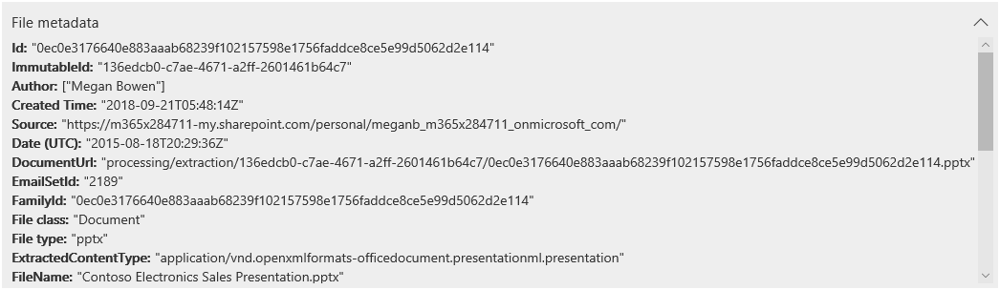

# Consulter les données dans des preuves

Les données d’un ensemble de preuves dans une enquête sur les données sont un instantané des résultats de la recherche que vous avez collectés et ajoutés à l’ensemble de preuves. Lorsque vous ajoutez des résultats de recherche à une preuve, un processus est déclenché pour extraire les fichiers, les métadonnées et le texte des éléments renvoyés par la recherche. Ensuite, l’outil enquêtes de données (aperçu) crée un nouvel index (par un processus appelé *indexation avancée*) de toutes les données et ajoute un ensemble de preuves sur l’onglet **preuve** . 

Pour les analyses urgentes, cela vous permet de contenir rapidement l’environnement en supprimant les données propagées ou involontaires dans la source de données d’origine, tout en vous permettant d’examiner les preuves recréées dans une environnement en quarantaine, qui est dans ce cas les données copiées dans l’ensemble de preuves). Une fois que la preuve a été collectée et ajoutée à l’ensemble de preuves, vous pouvez passer en revue des documents individuels au format natif, au format texte ou à un format quasi natif que vous pouvez utiliser pour annoter et biffer des documents. En outre, vous pouvez exécuter des requêtes pour affiner les données définies par plage de temps, types de fichiers, propriétaires de données, ainsi que de nombreuses autres propriétés et conditions de recherche. Par exemple, à l’aide des conditions auteur, expéditeur ou destinataire, vous pouvez identifier rapidement les personnes impliquées dans l’incident et si les données de votre organisation ont été partagées avec des utilisateurs externes. Pour plus d’informations sur la recherche dans les données d’un ensemble de preuves, voir [query the Data in Evidence](evidence-query.md).

Pour regrouper des documents et obtenir de l’aide supplémentaire pour votre révision, sélectionnez un ensemble de preuves sous l’onglet **preuve** , puis cliquez sur **gérer les preuves**. Dans la vignette **analyse** , cliquez sur **reconstruire l’analyse pour l’ensemble du jeu**. Cette opération exécute des analyses avancées, telles que la détection des doublons, le Threading de messagerie électronique et l’analyse de thème. Par la suite, vous pouvez voir les thèmes généraux des données, ainsi qu’organiser les documents par des threads de messagerie, des doublons et des doublons exacts pour faciliter votre examen. Pour plus d’informations, reportez-vous [à exécuter Analytics pour effectuer des recherches plus rapidement](run-analytics-to-investigate-faster.md).

## Afficher les documents dans les preuves

Les enquêtes de données (préversion) vous permettent d’afficher le contenu dans plusieurs visionneuses, chaque afficheur ayant un objectif différent. Ces utilisateurs sont les suivants:

- Métadonnées de fichier
- Affichage natif
- Affichage de texte
- Annoter l’affichage

Pour accéder à l’un de ces utilisateurs, il vous suffit de sélectionner un document dans un jeu de preuves.

## Métadonnées de fichier

Cette vue affiche diverses propriétés de métadonnées associées au document sélectionné. Vous pouvez activer ou désactiver cette vue en cliquant sur métadonnées de **fichier**. Lors de l’examen d’un document, vous pouvez afficher les métadonnées du fichier et continuer à modifier les différentes visionneuses.

Voici un exemple de métadonnées de fichier pour un document. Pour plus d’informations sur les champs de métadonnées, voir [document Metadata Fields in Data investigations (Preview)](document-metadata-fields.md).

## Affichage natif

La visionneuse Native affiche l’affichage le plus précis d’un document dans son format natif. L’affichage natif est pris en charge pour des centaines de types de fichiers et est destiné à afficher des documents dans l’expérience Native la plus réelle possible. Pour les fichiers Microsoft Office, la visionneuse Native utilise la version Web des applications Office. Cela vous permet d’afficher du contenu tel que des commentaires dans différents documents Office, formules et lignes/colonnes masquées dans Excel, ainsi que l’affichage notes dans PowerPoint.

## Affichage de texte

La visionneuse de texte fournit une vue du texte extrait d’un fichier. Elle ignore toutes les images incorporées et la mise en forme, mais cet affichage est très utile si vous essayez d’examiner et de comprendre rapidement le contenu d’un document. L’affichage de texte comprend également les fonctionnalités suivantes:

  - Un compteur de ligne, qui facilite la référence à des parties spécifiques d’un document.

  - Mise en surbrillance des résultats de recherche mettant en surbrillance les termes dans le document, ainsi que sur la barre de défilement

  - Une vue diff fournit un affichage de comparaison qui met en évidence les différences de texte lors de l’affichage des documents à l’aide du panneau **presque** des doublons.

**Exemple de mise en surbrillance des compteurs de ligne et de recherche dans le texte et la barre de défilement**

**Exemple de vue diff**

## Annoter l’affichage

L’affichage Annoted propose des fonctionnalités qui vous permettent d’appliquer un balisage à un document pendant le processus de révision; ces outils sont les suivants:

  - **Zone Redactions** : vous pouvez dessiner une zone opaque sur le document qui masque le contenu sensible.

  - **Crayon** : vous pouvez dessiner manuellement sur un document pour attirer l’attention sur certaines parties du contenu

  - **Sélectionner** des annotations: vous pouvez sélectionner et supprimer des annotations dans un document.

  - **Activer/désactiver la transparence** des annotations: vous pouvez activer/désactiver la transparence des annotations (entre opaque et semi-transparent) de sorte que vous puissiez visualiser le contenu derrière l’annotation. Cela inclut le basculement de la transparence des annotations et des annotations Redactions.

La vue Annoted fournit également les fonctionnalités de navigation suivantes:

  - **Page précédente**, **page suivante**et **accéder aux** contrôles de navigation de page à utiliser pour les documents de plusieurs pages.

  - **Zoom** : augmente ou réduit la taille des documents en mode annotation.

  - **Rotation** : rotation des documents dans le sens des aiguilles d’une montre.

  - **Search** : recherchez des mots clés dans un document, puis utilisez les contrôles Previous et Next pour afficher les résultats (qui sont mis en surbrillance) dans le document.

**Exemple d’affichage annoter**

> [!NOTE]
> Les annotations sont appliquées à une copie du document qui a été ajouté à l’ensemble de preuves. Les documents d’origine dans le service actif ne sont pas annotés.
