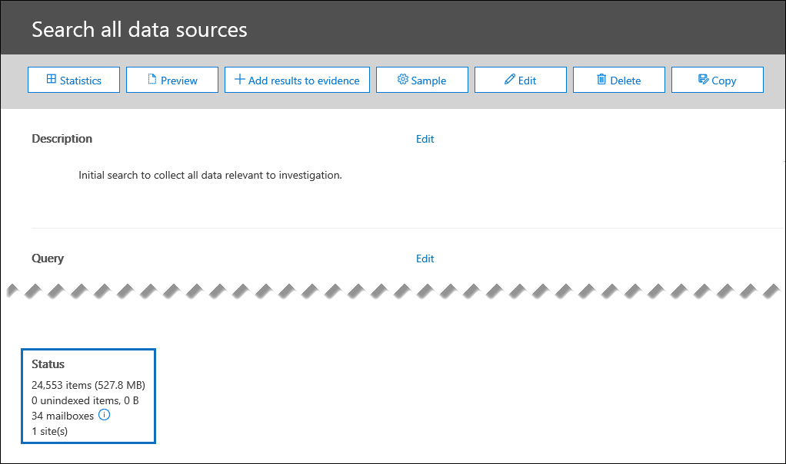
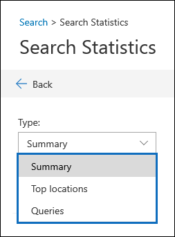

# Statistiques de rechercheSearch statistics

Un moyen efficace de valider les résultats de la recherche lors de l'examen d'un incident de données consiste à consulter les statistiques de vos résultats de recherche pour vous assurer qu'ils s'alignent sur vos attentes.An effective way to validate your search results when investigation a data incident is to view the statistics about your search results to make sure they align with your expectations. Une fois la recherche terminée, les statistiques de haut niveau suivantes s'affichent sous **État** sur la page de menu volant des détails de recherche:When a search as finished running, the following high-level statistics are displayed under **Status** on the search details flyout page:

- Nombre et taille estimés des éléments correspondant aux critères de recherche.The estimated number and size of items that matched the search criteria.

- Nombre et taille des éléments partiellement indexés (également appelés *éléments*non indexés) qui ne peuvent pas faire l'objet d'une recherche, mais qui ont été trouvés dans les emplacements de contenu qui ont été inclus dans la recherche.The number and size of partially indexed items (also called *unindexed items*) that aren't searchable but that were found in the content locations that were included in the search.

- Nombre de boîtes aux lettres et de sites ayant fait l'objet d'une recherche.The number of mailboxes and sites that were searched.

Pour afficher des statistiques plus détaillées, cliquez sur **statistiques** sur la page de menu volant détails de la recherche.To view more detailed statistics, click **Statistics** on the search details flyout page. Sur la page **statistiques de recherche** , vous pouvez afficher le résumé de la recherche, l'emplacement du niveau supérieur contenant les éléments qui correspondent aux résultats de la recherche, ainsi que des statistiques détaillées sur la requête de recherche.On the **Search statistics** page, you can view the search summary, the top location that contained items that matched the search results, and detailed statistics about the search query.

## RésuméSummary

Dans l'affichage de **synthèse** , vous pouvez voir les résultats de la recherche décomposés par type d'emplacement (par exemple, des emplacements de boîtes aux lettres Exchange et des sites SharePoint).In the **Summary** view, you can see the search results broken down by location type (for example, locations include Exchange mailboxes and SharePoint sites). Les informations suivantes s'affichent pour chaque type d'emplacement:The following information is displayed for each location type:

- Nombre d'emplacements qui ont des éléments correspondant aux critères de recherche.The number of locations that had items that matched the search criteria.

- Nombre total d'éléments de chaque type d'emplacement correspondant aux critères de recherche.The total number of items from each location type that matched the search criteria.

- Taille totale des éléments de chaque type d'emplacement correspondant aux critères de recherche.The total size of items from each location type that matched the search criteria.

## Emplacements les plus fréquentsTop locations

Dans l'affichage des **emplacements de niveau supérieur** , vous pouvez voir les emplacements de contenu individuels avec le plus grand nombre d'éléments correspondant aux critères de recherche.In the **Top locations** view, you see the individual content locations with the most items that matched the search criteria. Pour chaque emplacement de contenu, les informations suivantes sont affichées:For each content location, the following information is displayed:

- Nom de l'emplacement; l'adresse de messagerie des boîtes aux lettres et l'URL des sites SharePointThe name of the location; the email address for mailboxes and the URL for SharePoint sites

- Type d'emplacementThe location type

- Nombre d'éléments correspondant aux critères de rechercheNumber of items that matched the search criteria

- Taille totale de tous les éléments correspondant aux critères de recherche.The total size of all items that matched the search criteria.

## RequêtesQueries

Dans l'affichage **requêtes** , vous pouvez afficher des statistiques détaillées pour chaque composant de la requête de recherche.In the **Queries** view, you can see detailed statistics for each component of the search query. Si vous avez utilisé la liste de mots clés dans la requête de recherche, vous pouvez afficher les statistiques améliorées dans l'affichage **requêtes** qui indiquent le nombre d'éléments qui correspondent à chaque mot clé ou expression de mot clé.If you used the keyword list in the search query, you can view enhanced statistics in the **Queries** view  that show how many items match each keyword or keyword phrase. Cela peut vous aider à identifier rapidement les parties de la requête qui sont les plus efficaces (et les moins).This can help you quickly identify which parts of the query are the most (and least) effective. 

Les informations suivantes sont affichées dans l'affichage **requêtes** :The following information is displayed in the **Queries** view:

 - **Type d'emplacement** : type d'emplacement de contenu pour les statistiques affichées dans la ligne.**Location type** - The type of content location for the statistics displayed in the row.

- **Partie** : cette colonne affiche l'une des valeurs suivantes: **Primary** ou **Keyword**.**Part** - This column will display one of the following values: **Primary** or **Keyword**. **Principal** signifie que la ligne présente des statistiques sur l'ensemble de la requête; **Mot clé** signifie que les statistiques de la ligne sont pour l'un des composants de requête.**Primary** means the row presents statistics on the entire query; **Keyword** means the statistics in the row are for one of the query components.

- **Condition** : composant de requête réel de la requête de recherche à laquelle la ligne fait référence.**Condition** - The actual query component of the search query the row refers to. Si la valeur dans la colonne **composant** est **principale**, les statistiques de l'ensemble de la requête de recherche sont affichées; Si la valeur est **mot clé**, les statistiques du composant de la requête affichée dans la colonne **requête** sont affichées.If the value in the **Part** column is **Primary**, then the statistics for the entire search query are displayed; if the value is **Keyword**, then the statistics for the component of the query shown in the **Query** column are displayed. Par exemple, si la liste de mots-clés a été utilisée, les statistiques l'un des mots-clés sont affichés.For example, if the keyword list was used, then the statistics one of the keywords are displayed.

  Voici quelques autres éléments à connaître concernant les statistiques affichées dans la colonne **requêtes** :Here are some other things to know about the statistics displayed in the **Queries** column:
  
  - Lorsque vous recherchez tout le contenu dans des boîtes aux lettres (en ne spécifiant aucun mot-clé), la requête réelle est **(dimensionner > = 0)** de sorte que tous les éléments soient renvoyés.When you search for all content in mailboxes (by not specifying any keywords), the actual query is **(size >= 0)** so that all items are returned
  
  - Lorsque vous effectuez des recherches dans des sites SharePoint et OneDrive, les deux composants suivants sont ajoutés à la requête de recherche:When you search SharePoint and OneDrive sites, the two following components are added to the search query:
    
    **Non IsExternalContent: 1** -cela exclut le contenu d'une organisation SharePoint locale**NOT IsExternalContent:1** - This excludes any content from an on-premises SharePoint organization
    
    **Non isOneNotePage: 1** -cela exclut tous les fichiers OneNote, car il s'agit de doublons de tous les documents qui correspondent à la requête de recherche.**NOT isOneNotePage:1** - This excludes all OneNote files because these would be duplicates of any document that matches the search query.

- **Emplacements dans la recherche** Nombre d'emplacements de contenu contenant des éléments qui correspondent à la requête de recherche pour la partie ou la condition affichée dans la ligne.**Locations in search** The number of content locations that had items that matched the search query for the part/condition displayed in the row. Notez que les boîtes aux lettres d'archivage sont comptabilisées comme un emplacement distinct si elles contiennent des éléments qui correspondent aux critères de recherche.Note that archive mailboxes are counted as a separate location if they contain items that match the search criteria.

- **Items** : nombre total d'éléments correspondant aux critères de recherche pour le composant ou la condition affiché dans la ligne.**Items** - The total number of items that matched the search criteria for the part/condition displayed in the row.

- **Size** : nombre total d'éléments correspondant aux critères de recherche pour le composant ou la condition affiché dans la ligne.**Size** - The total number of items that matched the search criteria for the part/condition displayed in the row.