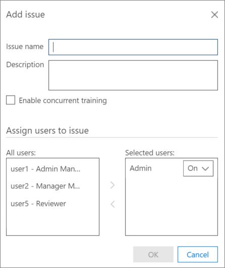

# Définir des problèmes et affecter des utilisateurs dans Office 365 avancée de découverte électronique

> [!NOTE]
> Découverte avancée nécessite un Office 365 E3 avec le module complémentaire de conformité avancée ou un abonnement E5 pour votre organisation. Si vous n’avez qu’un plan d’et essayer eDiscovery avancé, vous pouvez [inscrire à une version d’évaluation d’Office 365 entreprise E5](https://go.microsoft.com/fwlink/p/?LinkID=698279). 
  
Dans découverte avancée, un ou plusieurs problèmes peuvent être définies dans un cas. Définition des problèmes permet à davantage la catégorisation des rubriques. Lors de la connexion à un nouveau cas, un problème unique par défaut est fourni. Vous pouvez modifier le nom par défaut du problème et affecter des utilisateurs à ce problème. 
  
## Ajout ou modification d’un problème et affectation des utilisateurs

1. Dans la **la pertinence \> le programme d’installation de la pertinence** onglet \> sélectionnez **problèmes**.
    
    
  
2. Pour ajouter un problème, cliquez sur le ** + ** icône. La boîte de dialogue **Ajouter problème** s’affiche. 
    
    
  
    Pour modifier un problème, cliquez sur l’icône **Modifier** . 
    
3. Dans **nom du problème**, tapez un nom descriptif et significative à la casse. 
    
4. Dans **Description**, tapez les informations sur le problème.
    
5. Activez la case à cocher **Activer la formation simultanée** d’activer l’option. Ce paramètre permet à plusieurs relecteurs à travailler sur le même problème simultanément (en échantillons distincts). 
    
6. Dans **attribuer aux utilisateurs d’émettre**, dans la liste de **tous les utilisateurs** , sélectionnez un utilisateur à être affecté à ce problème, puis cliquez sur la flèche vers la droite pour ajouter l’utilisateur à la liste **utilisateurs sélectionnés** . Répétez si nécessaire. Dans la fenêtre ci-dessus, « Admin » est affiché en tant qu’un utilisateur sélectionné. 
    
    > [!NOTE]
    > Affectation d’utilisateur à des problèmes peut être modifiée avant ou après un cycle de formation de pertinence. 
  
7. Dans la liste **utilisateurs sélectionnés**dans la liste déroulante en regard du nom de l’utilisateur sélectionné, sélectionnez une des modes d’échantillonnage suivants : 
    
  - **Sur**: les fichiers peuvent être visualisés et marqués. Il s’agit du paramètre par défaut.
    
  - **Inactif**: les fichiers peuvent être affichés ; avec balise est facultative.
    
  - **Désactivé**: les fichiers ne peuvent pas être vus ou avec balise.
    
8. Lorsque vous avez terminé d’ajouter des problèmes, cliquez sur **OK**.
    
## Suppression des problèmes

Problèmes susceptibles d’être supprimés (c'est-à-dire, supprimé de la base de données) uniquement immédiatement après qu’ils ont été définis et aucun travail réel n’a été effectuée pour ce problème. 
  
1. Dans la **la pertinence \> le programme d’installation de la pertinence** , sélectionnez **problèmes**.
    
2. Sélectionnez le problème à supprimer de la base de données, puis cliquez sur **Supprimer**.
    
3. Un message de confirmation s’affiche. Cliquez sur **Oui** pour confirmer. 
    
4. Cliquez sur **OK**.
    
## Voir aussi

[eDiscovery avancée Office 365](office-365-advanced-ediscovery.md)
  
[La configuration de la charge pour ajouter les fichiers importés](set-up-loads-to-add-imported-files.md)
  
[Définition de mise en surbrillance des mots clés et avancées options](define-highlighted-keywords-and-advanced-options.md)

