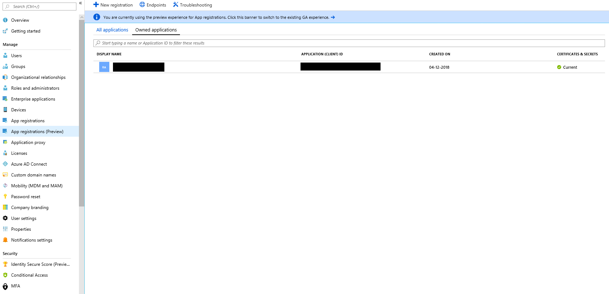
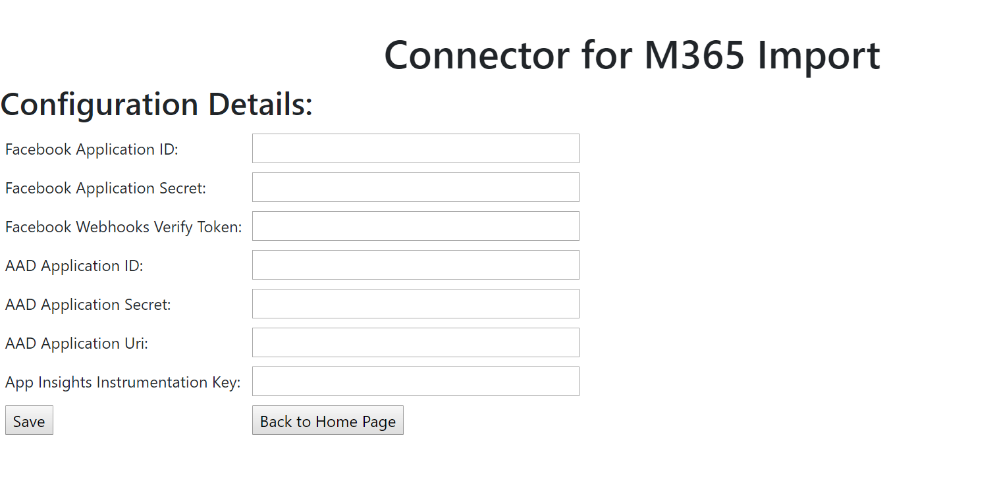
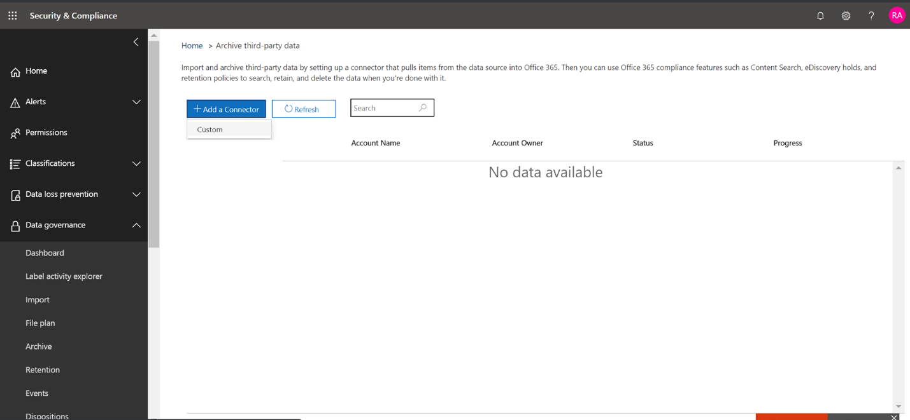
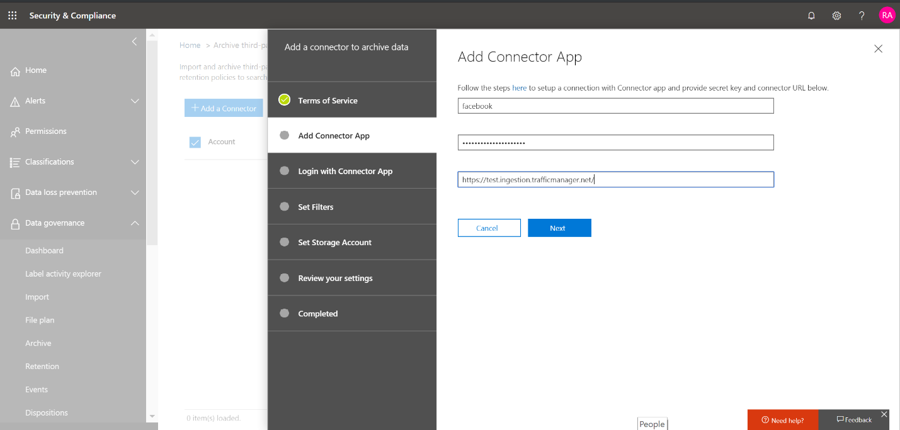

# Déployer un connecteur pour archiver des données Facebook dans Office 365Deploy a connector to archive Facebook data in Office 365

Cet article contient le processus étape par étape pour déployer un connecteur qui utilise le service d’importation Office 365 pour importer des données à partir de pages d’entreprise Facebook vers Office 365.This article contains the step-by-step process to deploy a connector that uses the Office 365 Import service to import data from Facebook Business pages to Office 365. Pour une vue d’ensemble de ce processus et une liste des conditions préalables requises pour déployer un connecteur Facebook, voir [utiliser un exemple de connecteur pour archiver des données Facebook dans Office 365 (version d’évaluation)](archive-facebook-data-with-sample-connector.md).For a high-level overview of this process and a list of prerequisites required to deploy a Facebook connector, see [Use a sample connector to archive Facebook data in Office 365 (Preview)](archive-facebook-data-with-sample-connector.md). 

## Étape 1: Télécharger le packageStep 1: Download the package

Téléchargez le package prédéfini à partir de la section Release dans le référentiel GitHub à l’adresse <https://github.com/Microsoft/m365-sample-connector-csharp-aspnet/releases>suivante:.Download the prebuilt package from the Release section in the GitHub repository at at <https://github.com/Microsoft/m365-sample-connector-csharp-aspnet/releases>. Sous la dernière version, téléchargez le fichier zip nommé **SampleConnector. zip**.Under the latest release, download the zip file named **SampleConnector.zip**. Vous allez télécharger ce fichier zip vers Azure à l’étape 4.You will upload this zip file to Azure in Step 4.

## Étape 2: créer une application dans Azure Active DirectoryStep 2: Create an app in Azure Active Directory

1. Accédez à <https://portal.azure.com> et connectez-vous à l’aide des informations d’identification d’un compte d’administrateur global Office 365.Go to <https://portal.azure.com> and sign in using the credentials of an Office 365 global admin account.

    

2. Dans le volet de navigation de gauche, cliquez sur **Azure Active Directory**.In the left navigation pane, click **Azure Active Directory**.

    

3. Dans le volet de navigation de gauche, cliquez sur **inscriptions des applications (aperçu)** , puis cliquez sur **nouvelle inscription**.In the left navigation pane, click **App registrations (Preview)** and then click **New registration**.

    

4. Inscrivez l’application.Register the application. Sous URI de redirection, sélectionnez Web dans la liste déroulante type d' <https://portal.azure.com> application, puis tapez dans la zone de l’URI.Under Redirect URI, select Web in the application type dropdown list and then type <https://portal.azure.com> in the box for the URI.

   

5. Copiez l’ID d' **application (client)** et l' **ID de répertoire (** client) et enregistrez-les dans un fichier texte ou un autre emplacement sûr.Copy the **Application (client) ID** and **Directory (tenant) ID** and save them to a text file or other safe location. Vous utiliserez ces ID dans les étapes ultérieures.You’ll use these IDs in later steps.

   

6. Accédez à **certificats & secrets de la nouvelle application.**Go to **Certificates & secrets for the new app.**

   

7. Cliquez sur **nouvelle clé secrète client**Click **New client secret**

   

8. Créer une nouvelle clé secrète.Create a new secret. Dans la zone Description, tapez le secret, puis choisissez une période d’expiration.In the description box, type the secret and then choose an expiration period. 

    

9. Copiez la valeur de la clé secrète et enregistrez-la dans un fichier texte ou dans un autre emplacement de stockage.Copy the value of the secret and save it to a text file or other storage location. Il s’agit de la clé secrète de l’application AAD que vous utiliserez plus tard.This is the AAD application secret that you will use in later steps.

   

10. Accédez au **manifeste** et copiez le identifierUris (également appelé URI de l’application AAD) en surbrillance dans la capture d’écran suivante.Go to **Manifest** and copy the identifierUris (which is also called the AAD application Uri) as highlighted in the following screenshot. Copiez l’URI de l’application AAD dans un fichier texte ou un autre emplacement de stockage.Copy the AAD application Uri to a text file or other storage location. Vous l’utiliserez à l’étape 6.You’ll use it in Step 6.

   

## Étape 3: créer un compte de stockage AzureStep 3: Create an Azure storage account

1. Accédez à la page d’accueil Azure de votre organisation.Go to the Azure home page for your organization.

    

2. Cliquez sur **créer une ressource** et tapez le **compte de stockage** dans la zone de recherche.Click **Create a resource** and they type **storage account** in the search box.

    

3. Cliquez sur **stockage**, puis sur **compte de stockage**.Click **Storage**, and then click **Storage account**.

    

4. Sur la page **créer un compte de stockage** , dans la zone abonnement, sélectionnez **paiement en cours** ou **version d’évaluation gratuite** en fonction du type d’abonnement Azure dont vous disposez.On the **Create storage account** page, in the Subscription box, select **Pay-As-You-Go** or **Free Trial** depending on which type of Azure subscription you have. Ensuite, sélectionnez ou créez un groupe de ressources.Then select or create a resource group.

    

5. Tapez un nom pour le compte de stockage.Type a name for the storage account.

    

6. Passez en revue, puis cliquez sur **créer** pour créer le compte de stockage.Review and then click **Create** to create the storage account.

    

7. Après quelques instants, cliquez \*\*\*\* sur Actualiser, puis sur **accéder à la ressource** pour accéder au compte de stockage.After a few moments, click **Refresh** and then click **Go to resource** to navigate to the storage account.

    

8. Cliquez sur **touches d’accès** dans le volet de navigation de gauche.Click **Access keys** in the left navigation pane.

    

9. Copiez une **chaîne de connexion** et enregistrez-la dans un fichier texte ou un autre emplacement de stockage.Copy a **Connection string** and save it to a text file or other storage location. Vous l’utiliserez lors de la création d’une ressource d’application Web.You’ll use this when creating a web app resource.

    

## Étape 4: créer une nouvelle ressource d’application Web dans AzureStep 4: Create a new web app resource in Azure

1. Sur la page d' **Accueil** du portail Azure, cliquez sur **créer une \> ressource \> tout le Web App**.On the **Home** page in the Azure portal, click **Create a resource \> Everything \> Web app**. Dans la page **application Web** , cliquez sur **créer**.On the **Web app** page, click **Create**. 

   

2. Renseignez les détails (comme indiqué ci-dessous), puis créez l’application Web.Fill in the details (as shown below) and then create the Web app. Notez que le nom que vous entrez dans la zone nom de l' **application** sera utilisé pour créer l’URL du service d’application Azure. par exemple fbconnector.azurewebsites.net.Note that the name that you enter in the **App name** box will be used to create the Azure app service URL; for example fbconnector.azurewebsites.net.

   

3. Accédez à la ressource d’application Web nouvellement créée, cliquez sur paramètres de l' **application** dans le volet de navigation de gauche.Go to the newly created web app resource, click **Application Settings** in the left navigation pane. Sous paramètres de l’application, cliquez sur Ajouter un nouveau paramètre, puis ajoutez les trois paramètres suivants.Under Application settings, click Add new setting and add the following three settings. Utilisez les valeurs (que vous avez copiées dans le fichier texte à partir des étapes précédentes):Use the values (that you copied to the text file from the previous steps): 

    - **APISecretKey** : vous pouvez taper n’importe quelle valeur comme clé secrète.**APISecretKey** – You can type any value as the secret. Il sera utilisé pour accéder à l’application Web de connecteur à l’étape 7.This will be used to access the connector web app in Step 7.

    - **StorageAccountConnectionString** – URI de chaîne de connexion que vous avez copiée après avoir créé le compte de stockage Azure à l’étape 3.**StorageAccountConnectionString** – The connection string Uri that you copied after creating the Azure storage account in Step 3.

    - **tenantId** : ID de client de votre organisation Office 365 que vous avez copié après avoir créé l’application de connecteur Facebook dans Azure Active Directory à l’étape 2.**tenantId** – The tenant ID of your Office 365 organization that you copied after creating the Facebook connector app in Azure Active Directory in Step 2.

    

4. Sous **paramètres généraux**, cliquez sur **en** regard de l’est **toujours activé**.Under **General settings**, click **On** next to the **Always On**. Cliquez sur **Enregistrer** en haut de la page pour enregistrer les paramètres de l’application.Click **Save** at the top of the page to save application settings.

   

5. La dernière étape consiste à télécharger le code source de l’application du connecteur vers Azure que vous avez téléchargé à l’étape 1.The final step is to upload the connector app source code to Azure that you downloaded in Step 1. Dans un navigateur Web, accédez à https://<AzureAppResourceName>. SCM.azurewebsites.net/ZipDeployUi.In a web browser, go to https://<AzureAppResourceName>.scm.azurewebsites.net/ZipDeployUi. Par exemple, si le nom de votre ressource d’application Azure (que vous avez nommée à l’étape 2 de cette section) est **fbconnector**, vous accédez https://fbconnector.scm.azurewebsites.net/ZipDeployUià.For example, if the name of your Azure app resource (which you named in step 2 in this section) is **fbconnector**, then you would go to https://fbconnector.scm.azurewebsites.net/ZipDeployUi. 

6. Faites glisser et déposez le SampleConnector. zip (que vous avez téléchargé à l’étape 1) sur cette page.Drag and drop the SampleConnector.zip (that you downloaded in Step 1) to this page. Une fois que les fichiers sont téléchargés et que le déploiement réussit, la page ressemblera à la capture d’écran suivante.After the files are uploaded and the deployment is successful, the page will look similar to the following screenshot.

   

## Étape 5: inscrire l’application FacebookStep 5: Register the Facebook app

1. Accédez à <https://developers.facebook.com> , connectez-vous à l’aide des informations d’identification du compte pour les pages d’entreprise Facebook de votre organisation, puis cliquez sur **Ajouter une nouvelle application**.Go to <https://developers.facebook.com> , log in using the credentials for the account for your organization’s Facebook Business pages, and then click **Add New App**.

   

2. Créer un ID d’application.Create a new app ID.

   

3. Dans le volet de navigation de gauche, cliquez sur **Ajouter des produits** , puis cliquez sur **configurer** dans la vignette de **connexion Facebook** .In the left navigation pane, click **Add Products** and then click **Set Up** in the **Facebook Login** tile.

   

4. Sur la page intégration de la connexion Facebook, cliquez sur **Web**.On the Integrate Facebook Login page, click **Web**.

   

5. Ajoutez l’URL du service d’application Azure; par exemple https://fbconnector.azurewebsites.net.Add the Azure app service URL; for example https://fbconnector.azurewebsites.net.

   

6. Complétez la section démarrage rapide de la configuration de connexion Facebook.Complete the QuickStart section of the Facebook Login setup.

   

7. Dans le volet de navigation de gauche sous **connexion Facebook**, cliquez sur **paramètres**, puis ajoutez l’URI de redirection OAuth dans la zone URI de **redirection OAuth valide** ; Utilisez le format \*\* \<connectorserviceuri>/views/FacebookOAuth\*\*, où la valeur de connectorserviceuri est l’URL de service d’application Azure pour votre organisation; par exemple https://fbconnector.azurewebsites.net.In the left navigation pane under **Facebook Login**, click **Settings**, and add the OAuth redirect URI in the **Valid OAuth Redirect URIs** box; use the format **\<connectorserviceuri>/Views/FacebookOAuth**, where the value for connectorserviceuri is the Azure app service URL for your organization; for example https://fbconnector.azurewebsites.net.

   

8. Dans le volet de navigation de gauche, cliquez sur **Ajouter des produits** , puis sur webhooks **.**In the left navigation pane, click **Add Products** and then click **Webhooks.** Dans le menu déroulant **page** , cliquez sur **page**.In the **Page** pull-down menu, click **Page**. 

   

9. Ajoutez l’URL de rappel des webhooks et ajoutez un jeton de vérification.Add Webhooks Callback URL and add a verify token. Le format de l’URL de rappel, utilisez le format \*\* <connectorserviceuri>/API/FbPageWebhook\*\*, où la valeur de connectorserviceuri est l’URL de service d’application Azure pour votre organisation; par exemple https://fbconnector.azurewebsites.net.The format of the callback URL, use the format **<connectorserviceuri>/api/FbPageWebhook**, where the value for connectorserviceuri is the Azure app service URL for your organization; for example https://fbconnector.azurewebsites.net. 

    Le jeton Verify doit ressembler à un mot de passe fort.The verify token should similar to a strong password. Copiez le jeton de vérification dans un fichier texte ou un autre emplacement de stockage.Copy the verify token to a text file or other storage location.

     

10. Testez et abonnez-vous au point de terminaison pour le flux.Test and subscribe to the endpoint for feed.

    

11. Ajoutez une URL de confidentialité, une icône d’application et une utilisation professionnelle.Add a privacy URL, app icon, and business use. Copiez également l’ID de l’application et la clé secrète de l’application dans un fichier texte ou un autre emplacement de stockage.Also, copy the app ID and app secret to a text file or other storage location.

    

12. Rendez l’application publique.Make the app public.

    

13. Ajouter un utilisateur au rôle administrateur ou testeur.Add user to the admin or tester role.

    

14. Ajoutez l’autorisation d' **accès au contenu public** de la page.Add the **Page Public Content Access** permission.

    

15. Ajouter l’autorisation gérer les pages.Add Manage Pages permission.

    

16. Obtenir l’application examinée par Facebook.Get the application reviewed by Facebook.

    

## Étape 6: configuration de l’application Web de connecteurStep 6: Configure the connector web app

1. Accédez à https://\<AzureAppResourceName>. azurewebsites. net (où AzureAppResourceName est le nom de votre ressource d’application Azure que vous avez nommée à l’étape 4) par exemple, si le nom est **fbconnector**, accédez à https://fbconnector.azurewebsites.net.Go to https://\<AzureAppResourceName>.azurewebsites.net (where AzureAppResourceName is the name of your Azure app resource that you named in Step 4) For example, if the name is **fbconnector**, go to https://fbconnector.azurewebsites.net. La page d’accueil de l’application ressemblera à la capture d’écran suivante.The home page of the app will look like the following screenshot.

   

2. Cliquez sur **configurer** pour afficher une page de connexion.Click **Configure** to display a sign in page.
 
   

3. Dans la zone ID de locataire, tapez ou collez l’ID de votre client (que vous avez obtenu à l’étape 2).In the Tenant Id box, type or paste your tenant Id (that you obtained in Step 2). Dans la zone mot de passe, tapez ou collez le APISecretKey (que vous avez obtenu à l’étape 2), puis cliquez sur **définir les paramètres de configuration** pour afficher la page Détails de la **configuration** .In the password box, type or paste the APISecretKey (that you obtained in Step 2), and then click **Set Configuration Settings** to display the **Configuration Details** page.

    

4. Sous **Détails**de la configuration, entrez les paramètres de configuration suivantsUnder **Configuration Details**, enter the following configuration settings 

   - **ID d’application Facebook** : ID d’application pour l’application Facebook que vous avez obtenue à l’étape 5.**Facebook application ID** - The app ID for the Facebook application that you obtained in Step 5.
   - **Clé d’application Facebook** : la clé secrète de l’application Facebook que vous avez obtenue à l’étape 5.**Facebook application secret** - The app secret for the Facebook application that you obtained in Step 5.
   - **Contrôle** des webhooks Facebook: le jeton de vérification que vous avez créé à l’étape 5.**Facebook webhooks verify token** - The verify token that you created in Step 5.
   - **ID d’application AAD** : ID d’application pour l’application Azure Active Directory que vous avez créée à l’étape 2.**AAD application ID** - The application ID for the Azure Active Directory app that you created in Step 2.
   - **Clé secrète de l’application AAD** : valeur de la clé secrète APISecretKey que vous avez créée à l’étape 4.**AAD application secret** - The value for the APISecretKey secret that you created in Step 4.
   - **URI de l’application AAD** : URI de l’application AAD obtenue à l’étape 2; par exemple, https://microsoft.onmicrosoft.com/2688yu6n-12q3-23we-e3ee-121111123213.**AAD application Uri** - The AAD application Uri obtained in Step 2; for example, https://microsoft.onmicrosoft.com/2688yu6n-12q3-23we-e3ee-121111123213.
   - **Clé d’instrumentation Insights** de l’application-laissez cette zone vide.**App insights instrumentation key** - Leave this box blank.

5. Cliquez sur **Enregistrer** pour enregistrer les paramètres du connecteur.Click **Save** to save the connector settings.

## Étape 7: configurer un connecteur personnalisé dans le centre de sécurité & Compliance CenterStep 7: Set up a custom connector in the Security & Compliance Center

1. Accédez à <https://protection.office.com> , puis cliquez sur importation de la **gouvernance \> des données \> importer des données**tierces.Go to <https://protection.office.com> and then click **Data governance \> Import \> Archive third-party data**.

   

2.  Cliquez sur **Ajouter un connecteur** , puis sur **pages Facebook**.Click **Add a connector** and then click **Facebook pages**.

    

3.  Dans la page **Ajouter une application connecteur** , entrez les informations suivantes, puis cliquez sur **valider le connecteur**.On the **Add Connector App** page, enter the following information and then click **Validate connector**.

    - Dans la première zone, tapez un nom pour le connecteur, tel que **Facebook**.In the first box, type a name for the connector, such as **Facebook**.
    - Dans la deuxième zone, tapez ou collez la valeur du APISecretKey que vous avez ajouté à l’étape 4.In the second box, type or paste the value of the APISecretKey that you added in Step 4.
    - Dans la troisième zone, tapez ou collez l’URL du service d’application Azure; par exemple **https://fbconnector.azurewebsites.net**.In the third box, type or paste the Azure app service URL; for example **https://fbconnector.azurewebsites.net**.
 
    Une fois le connecteur validé, cliquez sur **suivant**.After the connector is successfully validated, click **Next**.
    
    

4.  Cliquez sur **connexion avec application connecteur**.Click **Login with Connector App**.

    

5. Tapez ou collez à nouveau le APISecretKey, puis cliquez sur **connexion au service connecteur**.Type or paste the APISecretKey again and then click  **Login to Connector Service**.

   

6. Cliquez sur **connexion avec Facebook.**Click **Login with Facebook.**

   

7. Sur la page **se connecter à Facebook** , connectez-vous à l’aide des informations d’identification du compte pour les pages de l’entreprise Facebook de votre organisation.On the **Log in to Facebook** page, log in using the credentials for the account for your organization’s Facebook Business pages. Vérifiez que le compte Facebook auquel vous êtes connecté se voit attribuer le rôle d’administrateur pour les pages d’entreprise Facebook de votre organisation.Make sure the Facebook account you logged in to is assigned the admin role for your organization’s Facebook Business pages

   

8. Cliquez sur **Sélectionner les pages** pour choisir les pages professionnelles de votre organisation que vous souhaitez archiver dans Office 365.Click **Select Pages** to choose your organization’s business pages that you want to archive in Office 365.

   

9. Une liste des pages d’entreprise gérées par le compte Facebook auquel vous vous êtes connecté s’affiche.A list of the Business pages managed by the Facebook account that you logged in to is displayed. Sélectionnez la page à archiver, puis cliquez sur **Enregistrer**.Select the page to archive and then click **Save**.

    

10. Cliquez sur **Terminer** pour quitter le programme d’installation de l’application de service connecteur.Click **Finish** to exit the setup of the connector service app.

    

11. Sur la page **définir les filtres** , vous pouvez appliquer un filtre pour importer (et archiver) les éléments qui sont un certain âge.On the **Set Filters** page, you can apply a filter to import (and archive) items that are a certain age. Cliquez sur **Suivant**.Click **Next**.

    

12. Sur la page **définir le compte de stockage** , sélectionnez la boîte aux lettres Office 365 dans laquelle les éléments des pages Facebook de l’entreprise que vous avez sélectionnées seront importés.On the **Set Storage Account** page, select the Office 365 mailbox that the items from the Facebook Business pages that you previously selected will be imported to.

    

13. Vérifiez vos paramètres, puis cliquez sur **Terminer** pour terminer l’installation du connecteur dans le centre de sécurité _AMP_ Compliance Center.Review your settings and then click **Finish** to complete the connector setup in the Security & Compliance Center.

    

14. Accédez à la page **données** tierces d’archivage pour voir la progression du processus d’importation.Go to the **Archive third-party data** page to see the progress of the import process.

    
