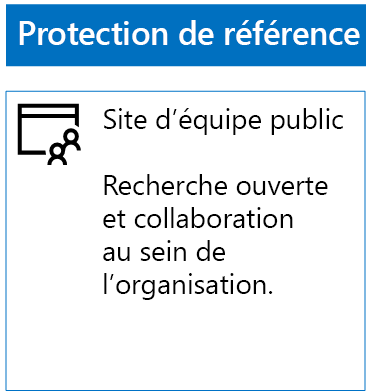
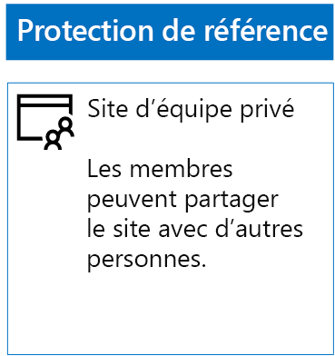
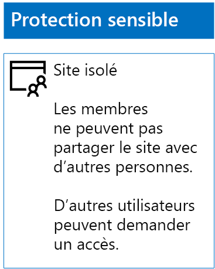
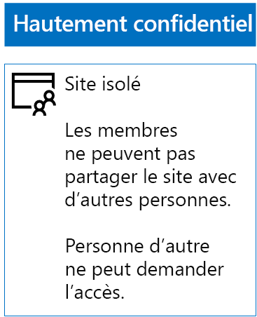

# Déployer des sites SharePoint Online pour trois niveaux de protection

 **Résumé :** Créez et configurez des sites d’équipe SharePoint Online avec différents niveaux de protection des informations.
  
Utilisez les étapes de cet article pour concevoir et déployer des sites d’équipe SharePoint Online de base de référence, sensibles et hautement confidentiels. Pour plus d’informations sur ces trois niveaux de protection, consultez [Sécuriser des sites et des fichiers SharePoint Online](secure-sharepoint-online-sites-and-files.md).
  
## Sites d’équipe SharePoint Online de base de référence

La protection Base de référence inclut les sites d’équipe publics et privés. Les sites d’équipe publics peuvent être découverts et sont accessibles par toute personne de l’organisation. Les sites privés peuvent être découverts et sont accessibles seulement par les membres du groupe Office 365 associé au site d’équipe. Ces deux types de sites d’équipe permettent aux membres de partager le site avec d’autres utilisateurs.
  
### Public

Pour créer un site d’équipe SharePoint Online de base de référence avec un accès et des autorisations publics, procédez comme suit :
  
1. Connectez-vous au centre d’administration avec un compte qui servira également à gérer le site d’équipe SharePoint Online (par un administrateur SharePoint Online). Pour obtenir de l’aide, consultez [Où se connecter à Office 365](https://support.office.com/Article/Where-to-sign-in-to-Office-365-e9eb7d51-5430-4929-91ab-6157c5a050b4).
    
2. Dans la liste des vignettes, cliquez sur **SharePoint**.
    
3. Sous le nouvel onglet **SharePoint** de votre navigateur, cliquez sur **+ Créer un site**.
    
4. Dans la page **Créer un site**, cliquez sur **Site d’équipe**.
    
5. Dans **Nom du Site**, tapez un nom pour le site d’équipe public. 
    
6. Dans **Description du site d’équipe**, tapez une description de l’objectif du site.
    
7. Dans **Paramètres de confidentialité**, sélectionnez **Public - tout le monde dans l’organisation peut accéder à ce site**, puis cliquez sur **Suivant**.
    
8. Dans le volet **Qui voulez-vous ajouter ?**, cliquez sur **Terminer**.
    
Voici la configuration finale.
  

  
### Private

Pour créer un site d’équipe SharePoint Online de base de référence avec un accès et des autorisations privés, procédez comme suit :
  
1. Connectez-vous au centre d’administration avec un compte qui servira également à gérer le site d’équipe SharePoint Online (par un administrateur SharePoint Online). Pour obtenir de l’aide, consultez [Où se connecter à Office 365](https://support.office.com/Article/Where-to-sign-in-to-Office-365-e9eb7d51-5430-4929-91ab-6157c5a050b4).
    
2. Dans la liste des vignettes, cliquez sur **SharePoint**.
    
3. Sous le nouvel onglet **SharePoint** de votre navigateur, cliquez sur **+ Créer un site**.
    
4. Dans la page **Créer un site**, cliquez sur **Site d’équipe**.
    
5. Dans **Nom du site**, tapez un nom pour le site d’équipe privé. 
    
6. Dans **Description du site d’équipe**, tapez une description de l’objectif du site.
    
7. Dans **Paramètres de confidentialité**, sélectionnez **Privé - Seuls les membres peuvent accéder à ce site**, puis cliquez sur **Suivant**.
    
8. Dans le volet **Qui voulez-vous ajouter ?**, dans **Ajouter des membres**, tapez les noms des comptes d’utilisateurs qui ont accès à ce site d’équipe privé.
    
9. Quand vous avez fini d’ajouter l’ensemble initial des membres au site, cliquez sur **Terminer**.
    
Voici la configuration finale.
  

  
## Sites d’équipe SharePoint Online sensibles

Un site d’équipe SharePoint Online sensible est un site d’équipe isolé. En d’autres termes, les autorisations sont contrôlées selon l’appartenance de l’utilisateur à des groupes SharePoint, et non selon son appartenance au groupe Office 365 associé au site d’équipe.
  
La création d’un site d’équipe isolé se déroule en deux étapes.
  
### Étape 1 : Concevoir votre site isolé

Pour concevoir votre site d’équipe isolé, vous devez déterminer :
  
- Vos groupes et vos niveaux d’autorisation SharePoint.
    
- L’ensemble de groupes d’accès qui seront membres de vos groupes SharePoint.
    
     L’ensemble de groupes d’accès recommandé est le suivant : un pour les membres du site, un pour les personnes consultant le site et un pour les administrateurs du site.
    
- Si vous utilisez des groupes imbriqués au sein de vos groupes d’accès.
    
Par exemple, la structure des groupes et les niveaux d’autorisations recommandés se présentent comme ceci :
  
|**Groupe SharePoint**|**Niveau d’autorisation**|**Groupe d’accès (exemples)**|
|:-----|:-----|:-----|
|Membres de [nom du site]    |Éditer    |Membres de [nom du site]    |
|Visiteurs de [nom du site]    |Lire    |Personnes consultant [nom du site]    |
|Propriétaires de [nom du site]    |Contrôle total    |Administrateurs de [nom du site]    |
   
Les groupes et les niveaux d’autorisation SharePoint sont créés par défaut pour un site d’équipe. Vous devez déterminer les noms de vos groupes d’accès.
  
Pour plus d’informations sur le processus de conception, consultez [Concevoir un site d’équipe SharePoint Online isolé](design-an-isolated-sharepoint-online-team-site.md).
  
### Étape 2 : Déployer votre site isolé

Pour déployer votre site isolé, vous devez d’abord :
  
- Déterminer les comptes d’utilisateur et les groupes à ajouter à chacun de vos groupes d’accès.
    
- Créer les groupes d’accès, et ajouter les utilisateurs et les groupes membres.
    
Pour la procédure détaillée, consultez la **phase 1** de [Déployer un site d’équipe SharePoint Online isolé](deploy-an-isolated-sharepoint-online-team-site.md).
  
Ensuite, vous devez créer le site d’équipe SharePoint Online en suivant ces étapes.
  
1. Connectez-vous au centre d’administration avec un compte qui servira également à gérer le site d’équipe SharePoint Online (par un administrateur SharePoint Online). Pour obtenir de l’aide, consultez [Où se connecter à Office 365](https://support.office.com/Article/Where-to-sign-in-to-Office-365-e9eb7d51-5430-4929-91ab-6157c5a050b4).
    
2. Dans la liste des vignettes, cliquez sur **SharePoint**.
    
3. Sous le nouvel onglet **SharePoint** de votre navigateur, cliquez sur **+ Créer un site**.
    
4. Dans la page **Créer un site**, cliquez sur **Site d’équipe**.
    
5. Dans **Nom du site**, tapez un nom pour le site d’équipe privé.
    
6. Dans **Description du site d’équipe**, tapez une description facultative.
    
7. Dans **Paramètres de confidentialité**, sélectionnez **Privé - Seuls les membres peuvent accéder à ce site**, puis cliquez sur **Suivant**.
    
8. Dans le volet **Qui voulez-vous ajouter ?**, cliquez sur **Terminer**.
    
Ensuite, dans le nouveau site d’équipe SharePoint Online, configurez les autorisations en suivant ces étapes.
  
1. Choisissez le Nom d’utilisateur principal (UPN) de l’administrateur informatique ou d’une autre personne qui sera chargée de répondre aux demandes d’accès au site (belindan@contoso.com est un exemple d’UPN). 
    
2. Dans la barre d’outils, cliquez sur l’icône Paramètres, puis cliquez sur **Paramètres du site**.
    
3. Dans le volet **Autorisations du site**, cliquez sur **Paramètres d’autorisations avancés**.
    
4. Sous le nouvel onglet **Autorisations** dans votre navigateur, cliquez sur **Paramètres des demandes d’accès**.
    
5. Dans la boîte de dialogue **Paramètres des demandes d’accès** :
    
  - Décochez les cases **Autoriser les membres à partager le site, ainsi que des fichiers et dossiers individuels** et **Autoriser les membres à inviter d’autres personnes sur le groupe de membres du site**.
    
  - Tapez le nom d’utilisateur principal de votre administrateur informatique de l’étape 1 dans **Envoyer toutes les demandes d’accès**.
    
  - Cliquez sur **OK**.
    
6. Sous l’onglet **Autorisations** de votre navigateur, cliquez sur **Membres de [nom du site]** dans la liste.
    
7. Dans **Personnes et groupes**, cliquez sur **Nouveau**.
    
8. Dans la boîte de dialogue **Partager**, tapez le nom du groupe d’accès des membres de site pour ce site, sélectionnez-le, puis cliquez sur **Partager**.
    
9. Cliquez sur le bouton de retour de votre navigateur.
    
10. Cliquez sur **Propriétaires de [nom du site]** dans la liste.
    
11. Dans **Personnes et groupes**, cliquez sur **Nouveau**.
    
12. Dans la boîte de dialogue **Partager**, tapez le nom du groupe d’accès des administrateurs de site pour ce site, sélectionnez-le, puis cliquez sur **Partager**.
    
13. Cliquez sur le bouton de retour de votre navigateur.
    
14. Cliquez sur **Visiteurs de [nom du site]** dans la liste.
    
15. Dans **Personnes et groupes**, cliquez sur **Nouveau**.
    
16. Dans la boîte de dialogue **Partager**, tapez le nom du groupe d’accès des personnes consultant ce site, sélectionnez-le, puis cliquez sur **Partager**.
    
17. Fermez l’onglet **Autorisations** de votre navigateur.
    
Voici les résultats que vous devez escompter :
  
- Le groupe SharePoint **Propriétaires de [nom du site]** contient le groupe d’accès Administrateurs du site, dans lequel tous les membres ont le niveau d’autorisation **Contrôle total**.
    
- Le groupe SharePoint **Membres de [nom du site]** contient le groupe d’accès Membres du site, dans lequel tous les membres ont le niveau d’autorisation **Modifier**.
    
- Le groupe SharePoint **Visiteurs de [nom du site]** contient le groupe d’accès Visiteurs du site, dans lequel tous les membres ont le niveau d’autorisation **Lire**.
    
- La possibilité pour les membres d’inviter d’autres membres est désactivée.
    
- La possibilité pour les non-membres de demander l’accès est activée.
    
Voici la configuration finale.
  

  
Les membres du site, via l’appartenance à un des groupes d’accès, peuvent désormais collaborer sur les ressources du site de façon sécurisée.
  
## Sites d’équipe SharePoint Online hautement confidentiels

Un site d’équipe SharePoint Online hautement confidentiel est un site d’équipe isolé, ce qui signifie que les autorisations sont contrôlées via l’appartenance à des groupes SharePoint, au lieu de l’appartenance au groupe Office 365 associé au site d’équipe.
  
Pour créer un site d’équipe isolé pour des informations et une collaboration hautement confidentielles, vous devez procéder en deux étapes principales.
  
### Étape 1 : Concevoir votre site isolé

Pour concevoir votre site d’équipe isolé, vous devez déterminer :
  
- Vos groupes et vos niveaux d’autorisation SharePoint.
    
- L’ensemble de groupes d’accès qui seront membres de vos groupes SharePoint.
    
     L’ensemble de groupes d’accès recommandé est le suivant : un pour les membres du site, un pour les personnes consultant le site et un pour les administrateurs du site.
    
- Si vous utilisez des groupes imbriqués au sein de vos groupes d’accès.
    
Par exemple, la structure des groupes et les niveaux d’autorisations recommandés se présentent comme ceci :
  
|**Groupe SharePoint**|**Niveau d’autorisation**|**Groupe d’accès (exemples)**|
|:-----|:-----|:-----|
|Membres de [nom du site]    |Éditer    |Membres de [nom du site]    |
|Visiteurs de [nom du site]    |Lire    |Personnes consultant [nom du site]    |
|Propriétaires de [nom du site]    |Contrôle total    |Administrateurs de [nom du site]    |
   
Les groupes et les niveaux d’autorisation SharePoint sont créés par défaut pour un site d’équipe. Vous devez déterminer les noms de vos groupes d’accès.
  
Pour plus d’informations sur le processus de conception, consultez [Concevoir un site d’équipe SharePoint Online isolé](design-an-isolated-sharepoint-online-team-site.md).
  
### Étape 2 : Déployer votre site isolé

Pour déployer votre site isolé, vous devez d’abord :
  
- déterminer les utilisateurs et les membres du groupe de chacun de vos groupes d’accès ;
    
- créer les groupes d’accès et ajouter les utilisateurs et les membres du groupe ;
    
- créer un site d’équipe isolé qui utilise vos groupes d’accès.
    
Pour la procédure détaillée, consultez [Déployer un site d’équipe SharePoint Online isolé](deploy-an-isolated-sharepoint-online-team-site.md).
  
Voici les résultats que vous devez escompter :
  
- Le groupe SharePoint **Propriétaires de [nom du site]** contient le groupe d’accès Administrateurs du site, dans lequel tous les membres ont le niveau d’autorisation **Contrôle total**.
    
- Le groupe SharePoint **Membres de [nom du site]** contient le groupe d’accès Membres du site, dans lequel tous les membres ont le niveau d’autorisation **Modifier**.
    
- Le groupe SharePoint **Visiteurs de [nom du site]** contient le groupe d’accès Visiteurs du site, dans lequel tous les membres ont le niveau d’autorisation **Lire**.
    
- La possibilité pour les membres d’inviter d’autres membres est désactivée.
    
- La possibilité pour les non-membres de demander l’accès est désactivée.
    
Voici la configuration finale.
  

  
Les membres du site, via l’appartenance à un des groupes d’accès, peuvent désormais collaborer sur les ressources du site de façon sécurisée.
  
## Étape suivante

[Protéger les fichiers SharePoint Online avec des étiquettes Office 365 et la protection contre la perte de données](protect-sharepoint-online-files-with-office-365-labels-and-dlp.md)

## Voir aussi

[Sécuriser les fichiers et sites SharePoint Online](secure-sharepoint-online-sites-and-files.md)
  
[Conseils de sécurité Microsoft pour les campagnes électorales, les organisations à but non lucratif et d’autres organisations flexibles](microsoft-security-guidance-for-political-campaigns-nonprofits-and-other-agile-o.md)
  
[Adoption du cloud et solutions hybrides](https://docs.microsoft.com/office365/enterprise/cloud-adoption-and-hybrid-solutions)
