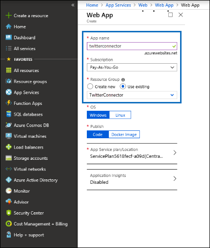
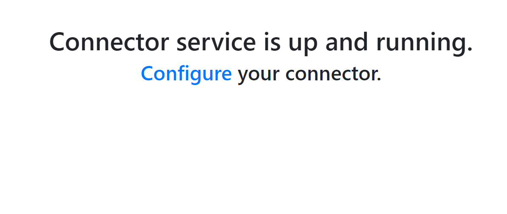
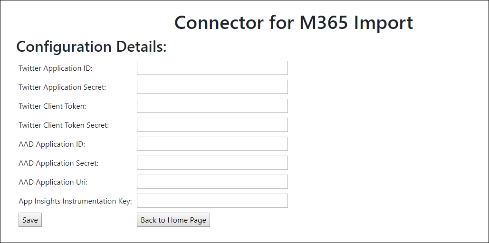
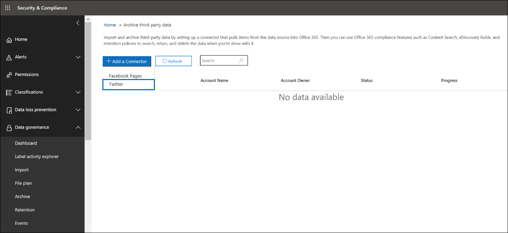
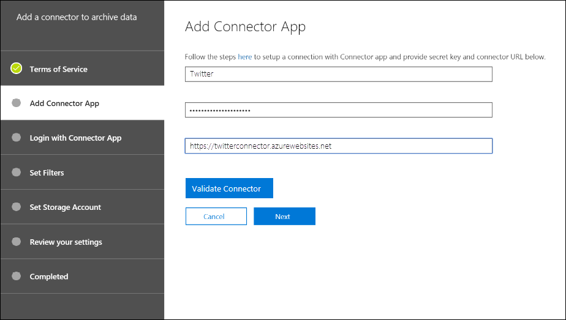
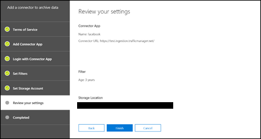

# Déploiement d’un connecteur pour l’archivage des données Twitter dans Office 365Deploy a connector to archive Twitter data in Office 365

Cet article contient le processus étape par étape pour déployer un connecteur qui utilise le service d’importation Office 365 pour importer des données à partir du compte Twitter de votre organisation vers Office 365.This article contains the step-by-step process to deploy a connector that uses the Office 365 Import service to import data from your organization's Twitter account to Office 365. Pour une vue d’ensemble de ce processus et une liste des conditions préalables requises pour déployer un connecteur Twitter, reportez-vous à la rubrique [utiliser un exemple de connecteur pour archiver des données Twitter dans Office 365 (version d’évaluation)](archive-twitter-data-with-sample-connector.md).For a high-level overview of this process and a list of prerequisites required to deploy a Twitter connector, see [Use a sample connector to archive Twitter data in Office 365 (Preview)](archive-twitter-data-with-sample-connector.md). 

## Étape 1: Télécharger le packageStep 1: Download the package

Téléchargez le package prédéfini à partir de la section Release dans le référentiel GitHub à l' [https://github.com/microsoft/m365-sample-twitter-connector-csharp-aspnet/releases](https://github.com/microsoft/m365-sample-twitter-connector-csharp-aspnet/releases)adresse.Download the prebuilt package from the Release section in the GitHub repository at [https://github.com/microsoft/m365-sample-twitter-connector-csharp-aspnet/releases](https://github.com/microsoft/m365-sample-twitter-connector-csharp-aspnet/releases). Sous la dernière version, téléchargez le fichier zip nommé **SampleConnector. zip**.Under the latest release, download the zip file named **SampleConnector.zip**. Vous téléchargez ce fichier zip vers Azure à l’étape 4.You upload this zip file to Azure in Step 4.

## Étape 2: créer une application dans Azure Active DirectoryStep 2: Create an app in Azure Active Directory

1. Accédez à <https://portal.azure.com> et connectez-vous à l’aide des informations d’identification d’un compte d’administrateur global Office 365.Go to <https://portal.azure.com> and sign in using the credentials of an Office 365 global admin account.

   

2. Dans le volet de navigation de gauche, cliquez sur **Azure Active Directory**.In the left navigation pane, click **Azure Active Directory**.

   

3. Dans le volet de navigation de gauche, cliquez sur **inscriptions des applications (aperçu)** , puis cliquez sur **nouvelle inscription**.In the left navigation pane, click **App registrations (Preview)** and then click **New registration**.

   

4. Inscrivez l’application.Register the application. Sous **URI de redirection (facultatif)**, sélectionnez Web dans la liste déroulante type d' <https://portal.azure.com> application, puis tapez dans la zone de l’URI.Under **Redirect URI (optional)**, select Web in the application type dropdown list and then type <https://portal.azure.com> in the box for the URI.

   

5. Copiez l’ID d' **application (client)** et l' **ID de répertoire (** client) et enregistrez-les dans un fichier texte ou un autre emplacement sûr.Copy the **Application (client) ID** and **Directory (tenant) ID** and save them to a text file or other safe location. Vous utilisez ces ID dans les étapes ultérieures.You use these IDs in later steps.

    

6. Accédez à **certificats & secrets de la nouvelle application** , puis sous **secrets client** , cliquez sur **nouvelle clé secrète client**.Go to **Certificates & secrets for the new app** and under **Client secrets** click **New client secret**.

   

7. Créer une nouvelle clé secrète.Create a new secret. Dans la zone Description, tapez le secret, puis choisissez une période d’expiration.In the description box, type the secret and then choose an expiration period. 

   

8. Copiez la valeur de la clé secrète et enregistrez-la dans un fichier texte ou dans un autre emplacement de stockage.Copy the value of the secret and save it to a text file or other storage location. Il s’agit de la clé secrète de l’application AAD que vous utilisez dans les étapes ultérieures.This is the AAD application secret that you use in later steps.

   

9. Accédez au **manifeste** et copiez le identifierUris (également appelé URI de l’application AAD) en surbrillance dans la capture d’écran suivante.Go to **Manifest** and copy the identifierUris (which is also called the AAD application Uri) as highlighted in the following screenshot. Copiez l’URI de l’application AAD dans un fichier texte ou un autre emplacement de stockage.Copy the AAD application Uri to a text file or other storage location. Vous l’utilisez à l’étape 6.You use it in Step 6.

    

## Étape 3: créer un compte de stockage AzureStep 3: Create an Azure storage account

1.  Accédez à la page d’accueil Azure de votre organisation.Go to the Azure home page for your organization.

    

2. Cliquez sur **créer une ressource** et tapez le **compte de stockage** dans la zone de recherche.Click **Create a resource** and they type **storage account** in the search box.

   

3. Cliquez sur **stockage**, puis sur **compte de stockage**.Click **Storage**, and then click **Storage account**.

   

4. Sur la page **créer un compte de stockage** , dans la zone abonnement, sélectionnez **paiement en cours** ou **version d’évaluation gratuite** en fonction du type d’abonnement Azure dont vous disposez.On the **Create storage account** page, in the Subscription box, select **Pay-As-You-Go** or **Free Trial** depending on which type of Azure subscription you have. 

   

5. Sélectionnez ou créez un groupe de ressources.Select or create a resource group.

   

6. Tapez un nom pour le compte de stockage.Type a name for the storage account.

   

7. Passez en revue, puis cliquez sur **créer** pour créer le compte de stockage.Review and then click **Create** to create the storage account.

   

8. Après quelques instants, cliquez \*\*\*\* sur Actualiser, puis sur **accéder à la ressource** pour accéder au compte de stockage.After a few moments, click **Refresh** and then click **Go to resource** to navigate to the storage account.

   

9. Cliquez sur **touches d’accès** dans le volet de navigation de gauche.Click **Access keys** in the left navigation pane.

   

10. Copiez une **chaîne de connexion** et enregistrez-la dans un fichier texte ou un autre emplacement de stockage.Copy a **Connection string** and save it to a text file or other storage location. Vous pouvez l’utiliser lors de la création d’une ressource d’application Web à l’étape 4.You use this when creating a web app resource in Step 4.

    

## Étape 4: créer une nouvelle ressource d’application Web dans AzureStep 4: Create a new web app resource in Azure

1. Sur la page d' **Accueil** du portail Azure, cliquez sur **créer une \> ressource \> tout le Web App**.On the **Home** page in the Azure portal, click **Create a resource \> Everything \> Web app**. Dans la page **application Web** , cliquez sur **créer**.On the **Web app** page, click **Create**.

   

2. Renseignez les détails (comme indiqué ci-dessous), puis créez l’application Web.Fill in the details (as shown below) and then create the Web app. Le nom que vous entrez dans la zone nom de l' **application** est utilisé pour créer l’URL du service d’application Azure; par exemple, twitterconnector.azurewebsites.net.The name that you enter in the **App name** box is used to create the Azure app service URL; for example, twitterconnector.azurewebsites.net.

   

3. Accédez à la ressource d’application Web nouvellement créée, puis cliquez sur paramètres de l' **application** dans le volet de navigation de gauche.Go to the newly created web app resource and click **Application Settings** in the left navigation pane. Sous **paramètres**de l’application, cliquez sur **Ajouter un nouveau paramètre** , puis ajoutez les trois paramètres suivants.Under **Application settings**, click **Add new setting** and add the following three settings. Utilisez les valeurs (que vous avez copiées dans le fichier texte à partir des étapes précédentes):Use the values (that you copied to the text file from the previous steps): 

    – \* \* APISecretKey — vous pouvez taper n’importe quelle valeur en tant que clé secrète.– \*\*APISecretKey — You can type any value as the secret. Il est utilisé pour accéder à l’application Web de connecteur à l’étape 7.This is used to access the connector web app in Step 7.

    – **StorageAccountConnectionString** – URI de chaîne de connexion que vous avez copiée après avoir créé le compte de stockage Azure à l’étape 3.– **StorageAccountConnectionString** – The connection string Uri that you copied after creating the Azure storage account in Step 3.

    – **tenantId** – ID de client de votre organisation Office 365 que vous avez copié après avoir créé l’application connecteur Twitter dans Azure Active Directory à l’étape 2.– **tenantId** – The tenant ID of your Office 365 organization that you copied after creating the Twitter connector app in Azure Active Directory in Step 2.

    

4. Sous **paramètres généraux**, cliquez sur **en** regard de l’est **toujours activé**.Under **General settings**, click **On** next to the **Always On**. Cliquez sur **Enregistrer** en haut de la page pour enregistrer les paramètres de l’application.Click **Save** at the top of the page to save the application settings.

   

5. La dernière étape consiste à télécharger le code source de l’application du connecteur vers Azure que vous avez téléchargé à l’étape 1.The final step is to upload the connector app source code to Azure that you downloaded in Step 1. Dans un navigateur Web, accédez à https://<AzureAppResourceName>. SCM.azurewebsites.net/ZipDeployUi.In a web browser, go to https://<AzureAppResourceName>.scm.azurewebsites.net/ZipDeployUi. Par exemple, si le nom de votre ressource d’application Azure (que vous avez nommée à l’étape 2 de cette section) est **twitterconnector**, vous accédez https://twitterconnector.scm.azurewebsites.net/ZipDeployUià.For example, if the name of your Azure app resource (which you named in step 2 in this section) is **twitterconnector**, then you would go to https://twitterconnector.scm.azurewebsites.net/ZipDeployUi.

6. Faites glisser et déposez le SampleConnector. zip (que vous avez téléchargé à l’étape 1) sur cette page.Drag and drop the SampleConnector.zip (that you downloaded in Step 1) to this page. Une fois les fichiers téléchargés et le déploiement réussi, la capture d’écran suivante se présente:After the files are uploaded and the deployment is successful, the page will look similar to the following screenshot:

   

## Étape 5: créer l’application TwitterStep 5: Create the Twitter app

1. Accédez à https://developer.twitter.com, connectez-vous à l’aide des informations d’identification pour le compte de développeur de votre organisation, puis cliquez sur **applications**.Go to https://developer.twitter.com, log in using the credentials for the developer account for your organization, and then click **Apps**.

   
2. Cliquez sur **créer une application**.Click **Create an app**.
   
   

3. Sous **Détails**de l’application, ajoutez des informations sur l’application.Under **App details**, add information about the application.

   

4. Dans le tableau de bord du développeur Twitter, sélectionnez l’application que vous venez de créer et copiez l’ID d’application affiché et enregistrez-le dans un fichier texte ou dans un autre emplacement de stockage.On the Twitter developer dashboard, select the app that you just created and copy the App ID that's displayed  and save it to a text file or other storage location. Ensuite, cliquez sur **Détails**.Then click **Details**.
   
   

5. Sous l’onglet **clés et jetons** , sous clés de l' **API consommateur** , copiez la clé secrète de l’API et enregistrez-la dans un fichier texte ou un autre emplacement de stockage.On the **Keys and tokens** tab, under **Consumer API keys** copy the API secret key and save it to a text file or other storage location. Ensuite, cliquez sur **créer** pour générer un jeton d’accès et un secret de jeton d’accès, puis copiez-les dans un fichier texte ou un autre emplacement de stockage.Then click **Create** to generate an access token and an access token secret, and copy these to a text file or other storage location.
   
   

   Ensuite, cliquez sur **créer** pour générer un jeton d’accès et un secret de jeton d’accès, puis copiez-les dans un fichier texte ou un autre emplacement de stockage.Then click **Create** to generate an access token and an access token secret, and copy these to a text file or other storage location.

6. Cliquez sur l’onglet **autorisations** et configurez les autorisations comme indiqué dans la capture d’écran suivante:Click the **Permissions** tab and configure the permissions as shown in the following screenshot:

   

7. Une fois que vous avez enregistré les paramètres d’autorisation, cliquez sur l’onglet Détails de l' **application** , puis cliquez sur **modifier > modifier les détails**.After you save the permission settings, click the **App details** tab, and then click **Edit > Edit details**.

   

8. Effectuez les tâches suivantes:Do the following tasks:

   : Activez cette case à cocher pour autoriser l’application de connecteur à se connecter à Twitter.– Select the checkbox to allow the connector app to sign in to Twitter.
   
   : Ajoutez l’URI de redirection OAuth en utilisant le format suivant: \*\* \<connectorserviceuri>/views/twitteroauth\*\*, où la valeur de *connectorserviceuri* est l’URL de service d’application Azure pour votre organisation; par exemple, https://twitterconnector.azurewebsites.net/Views/TwitterOAuth.– Add the OAuth redirect Uri using the following format: **\<connectorserviceuri>/Views/TwitterOAuth**, where the value of *connectorserviceuri* is the Azure app service URL for your organization; for example, https://twitterconnector.azurewebsites.net/Views/TwitterOAuth.

   

L’application de développeur Twitter est maintenant prête à être utilisée.The Twitter developer app is now ready to use.

## Étape 6: configuration de l’application Web de connecteurStep 6: Configure the connector web app 

1. Accédez à https://\<AzureAppResourceName>. azurewebsites.net (où **AzureAppResourceName** est le nom de votre ressource d’application Azure que vous avez nommée à l’étape 4).Go to https://\<AzureAppResourceName>.azurewebsites.net (where **AzureAppResourceName** is the name of your Azure app resource that you named in Step 4). Par exemple, si le nom est **twitterconnector**, accédez à https://twitterconnector.azurewebsites.net.For example, if the name is **twitterconnector**, go to https://twitterconnector.azurewebsites.net. La page d’accueil de l’application se présente comme la capture d’écran suivante:The home page of the app looks like the following screenshot:

   

2. Cliquez sur **configurer** pour afficher une page de connexion.Click **Configure** to display a sign in page.

   

3. Dans la zone ID de locataire, tapez ou collez l’ID de votre client (que vous avez obtenu à l’étape 2).In the Tenant Id box, type or paste your tenant Id (that you obtained in Step 2). Dans la zone mot de passe, tapez ou collez le APISecretKey (que vous avez obtenu à l’étape 2), puis cliquez sur **définir les paramètres de configuration** pour afficher la page Détails de la **configuration** .In the password box, type or paste the APISecretKey (that you obtained in Step 2), and then click **Set Configuration Settings** to display the **Configuration Details** page.

   

4. Sous **Détails**de la configuration, entrez les paramètres de configuration suivantsUnder **Configuration Details**, enter the following configuration settings 

   – **Clé de l’API Twitter** – ID de l’application Twitter que vous avez créée à l’étape 5.– **Twitter Api Key** – The app ID for the Twitter application that you created in Step 5.
   – **Clé secrète de l’API Twitter** : clé secrète de l’API pour l’application Twitter que vous avez créée à l’étape 5.– **Twitter Api Secret Key** – The API secret key for the Twitter application that you created in Step 5.
   – **Jeton d’accès Twitter** – le jeton d’accès que vous avez créé à l’étape 5.– **Twitter Access Token** – The access token that you created in Step 5.
   – **Jeton d’accès Twitter-secret** de jeton d’accès que vous avez créé à l’étape 5.– **Twitter Access Token Secret** – The access token secret that you created in Step 5.
   – **ID de l’application AAD** – ID de l’application Azure Active Directory que vous avez créée à l’étape 2 – **clé secrète de l’application AAD** – valeur de la clé secrète APISecretKey que vous avez créée à l’étape 4.– **AAD Application ID** – The application ID for the Azure Active Directory app that you created in Step 2 – **AAD Application Secret** – The value for the APISecretKey secret that you created in Step 4.
   – **URI de l’application AAD** – URI de l’application AAD obtenue à l’étape 2; par exemple, https://microsoft.onmicrosoft.com/2688yu6n-12q3-23we-e3ee-121111123213.– **AAD Application Uri** – The AAD application Uri obtained in Step 2; for example, https://microsoft.onmicrosoft.com/2688yu6n-12q3-23we-e3ee-121111123213.
   – **Clé d’instrumentation Insights** de l’application: laissez cette zone vide.– **App Insights Instrumentation Key** – Leave this box blank.

5. Cliquez sur **Enregistrer** pour enregistrer les paramètres du connecteur.Click **Save** to save the connector settings.

## Étape 7: configurer un connecteur personnalisé dans le centre de sécurité et de conformitéStep 7: Set up a custom connector in the security and compliance center

1.  Accédez à <https://protection.office.com> , puis cliquez sur importation de la **gouvernance \> des données \> importer des données**tierces.Go to <https://protection.office.com> and then click **Data governance \> Import \> Archive third-party data**.

    

2. Cliquez sur **Ajouter un connecteur** , puis sur **Twitter**.Click **Add a connector** and then click **Twitter**.

   

3. Dans la page **Ajouter une application connecteur** , entrez les informations suivantes, puis cliquez sur **valider le connecteur**.On the **Add Connector App** page, enter the following information and then click **Validate connector**.

    – Dans la première zone, tapez un nom pour le connecteur, tel que **Twitter**.– In the first box, type a name for the connector, such as **Twitter**.
    – Dans la deuxième zone, tapez ou collez la valeur du APISecretKey que vous avez ajouté à l’étape 4.– In the second box, type or paste the value of the APISecretKey that you added in Step 4.
    – Dans la troisième zone, tapez ou collez l’URL du service d’application Azure; par exemple, **https://twitterconnector.azurewebsites.net**.– In the third box, type or paste the Azure app service URL; for example, **https://twitterconnector.azurewebsites.net**.

   Une fois le connecteur validé, cliquez sur **suivant**.After the connector is successfully validated, click **Next**.

   

4. Cliquez sur **connexion avec application connecteur**.Click **Login with Connector App**.

   

5. Tapez ou collez à nouveau le APISecretKey, puis cliquez sur **connexion au service connecteur**.Type or paste the APISecretKey again and then click  **Login to Connector Service**.

   

6. Cliquez sur **continuer avec Twitter**.Click **Continue with Twitter**.

7. Sur la page de connexion Twitter, connectez-vous à l’aide des informations d’identification du compte pour le compte Twitter de votre organisation.On the Twitter sign in page, sign in using the credentials for the account for your organization’s Twitter account.

   

   Une fois que vous êtes connecté, la page Twitter affiche le message suivant: «travail de connecteur Twitter correctement configuré».After you sign in, the Twitter page will display the following message, "Twitter Connector Job Successfully set up."

8. Cliquez sur **Terminer** pour terminer la configuration du connecteur Twitter.Click **Finish** to complete setting up the Twitter connector.

9. Sur la page **définir les filtres** , vous pouvez appliquer un filtre pour importer (et archiver) les éléments qui sont un certain âge.On the **Set Filters** page, you can apply a filter to import (and archive) items that are a certain age. Cliquez sur **Suivant**.Click **Next**.

   

10. Sur la page **définir le compte de stockage** , tapez l’adresse de messagerie d’une boîte aux lettres Office 365 dans laquelle les éléments Twitter seront importés.On the **Set Storage Account** page, type the email address of an Office 365 mailbox that the Twitter items will be imported to.

    

11. Vérifiez vos paramètres, puis cliquez sur **Terminer** pour terminer l’installation du connecteur dans le centre de sécurité & conformité.Review your settings and then click **Finish** to complete the connector setup in the Security & Compliance Center.

    

    

12. Accédez à la page **données** tierces d’archivage pour voir la progression du processus d’importation.Go to the **Archive third-party data** page to see the progress of the import process.

    
