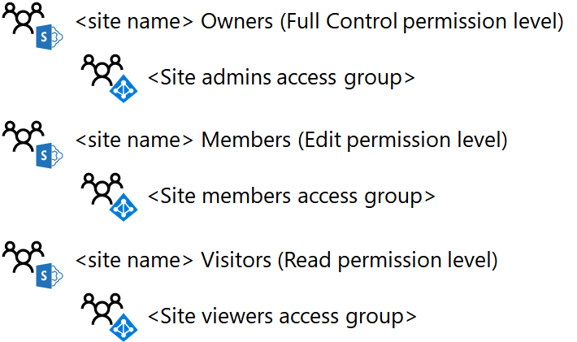

# Conception d’un site d’équipe SharePoint Online isoléDesign an isolated SharePoint Online team site

 **Résumé :** Découvrez comment concevoir des sites d’équipe SharePoint Online.**Summary:** Step through the design process for isolated SharePoint Online team sites.
  
Cet article vous aide à faire les bons choix de conception avant de créer un site d’équipe SharePoint Online isolé.This article takes you through the key design decisions you must make before creating an isolated SharePoint Online team site.
  
## Phase 1 : choix des groupes SharePoint et des niveaux d’autorisationPhase 1: Determine your SharePoint groups and permission levels

Chaque site d’équipe SharePoint Online par défaut est créé avec les groupes SharePoint suivants :Every SharePoint Online team site by default is created with the following SharePoint groups:
  
- \<Membres du name> de site\<site name> Members
    
- \<Visiteurs du site name>\<site name> Visitors
    
- \<Propriétaires de sites name>\<site name> Owners
    
Ces groupes sont différents des groupes Office 365 et Azure Active Directory (AD), et permettent d’attribuer des autorisations pour l’utilisation des ressources du site.These groups are separate from Office 365 and Azure Active Directory (AD) groups and are the basis for assigning permissions for the resources of the site.
  
L’ensemble des autorisations qui déterminent ce que le membre d’un groupe SharePoint peut faire dans un site est un niveau d’autorisation. Il existe trois niveaux d’autorisation par défaut pour un site d’équipe SharePoint Online : Modification, Lecture et Contrôle total. Le tableau suivant indique la corrélation par défaut des groupes SharePoint et les niveaux d’autorisation affectés :The set of specific permissions that determines what a member of a SharePoint group can do in a site is a permission level. There are three permission levels by default for a SharePoint Online team site: Edit, Read, and Full control. The following table shows the default correlation of SharePoint groups and assigned permission levels:
  
|**Groupe SharePoint****SharePoint group**|**Niveau d’autorisation****Permission level**|
|:-----|:-----|
|\<Membres du name> de site\<site name> Members    |ModifierEdit    |
|\<Visiteurs du site name>\<site name> Visitors    |LectureRead    |
|\<Propriétaires de sites name>\<site name> Owners    |Contrôle totalFull control    |
   
 **Conseil :** vous pouvez créer des groupes SharePoint et des niveaux d’autorisation supplémentaires. Cependant, nous vous recommandons d’utiliser les groupes SharePoint par défaut et les niveaux d’autorisation pour votre site SharePoint Online isolé.**Best practice:** You can create additional SharePoint groups and permission levels. However, we recommend using the default SharePoint groups and permission levels for your isolated SharePoint Online site.
  
Voici les groupes et les niveaux d'autorisation SharePoint par défaut.Here are the default SharePoint groups and permission levels.
  

  
## Phase 2 : attribution des autorisations aux utilisateurs membres de groupes d’accèsPhase 2: Assign permissions to users with access groups

Vous pouvez attribuer des autorisations aux utilisateurs en ajoutant leur compte d’utilisateur, ou un groupe Office 365 ou Azure AD dont est membre le compte d’utilisateur, aux groupes SharePoint. Une fois ajoutés, les comptes d’utilisateur Office 365 reçoivent, directement ou indirectement via l’appartenance à un groupe Office 365 ou Azure AD, le niveau d’autorisation associé au groupe SharePoint.You can assign permissions to users by adding their user account, or an Office 365 or Azure AD group of which the user account is a member, to the SharePoint groups. Once added, the Office 365 user accounts, either directly or indirectly via membership in an Office 365 or Azure AD group, are assigned the permission level associated with the SharePoint group.
  
En prenant l’exemple des groupes SharePoint par défaut :Using the default SharePoint groups as an example:
  
- Les membres du groupe SharePoint \*\* \<name> membres du site\*\* , qui peuvent inclure à la fois des comptes d'utilisateur et des groupes, se voient attribuer le niveau d'autorisation **modifier**Members of the **\<site name> Members** SharePoint group, which can include both user accounts and groups, are assigned the **Edit** permission level
    
- Les membres du groupe SharePoint \*\* \<name> visiteurs du site\*\* , qui peuvent inclure à la fois des comptes d'utilisateur et des groupes, se voient attribuer le niveau d'autorisation **lecture**Members of the **\<site name> Visitors** SharePoint group, which can include both user accounts and groups, are assigned the **Read** permission level
    
- Les membres du groupe SharePoint \*\* \<name> propriétaires de site\*\* , qui peuvent inclure à la fois des comptes d'utilisateur et des groupes, se voient attribuer le niveau d'autorisation **contrôle total** .Members of the **\<site name> Owners** SharePoint group, which can include both user accounts and groups, are assigned the **Full control** permission level
    
 **Conseil :** même si vous pouvez gérer les autorisations dans chaque compte d’utilisateur, nous vous recommandons plutôt d’utiliser un seul groupe Azure AD, appelé groupe d’accès. Cela simplifie la gestion des autorisations via l’appartenance au groupe d’accès, plutôt que via la gestion de la liste des comptes d’utilisateur pour chaque groupe SharePoint.**Best practice:** Although you can manage permissions through individual user accounts, we recommend that you use a single Azure AD group, known as an access group, instead. This simplifies the management of permissions through membership in the access group, rather than managing the list of user accounts for each SharePoint group.
  
Les groupes Azure AD pour Office 365 sont différents des groupes Office 365. Les groupes Azure AD apparaissent dans le Centre d’administration Office. Leur **type** est défini sur **Sécurité** et ils n’ont pas d’adresse e-mail. Les groupes Azure AD peuvent être gérés dans :Azure AD groups for Office 365 are different than Office 365 groups. Azure AD groups appear in the Office Admin center with their **Type** set to **Security** and do not have an email address. Azure AD groups can be managed within:
  
- Windows Server Active Directory (AD)Windows Server Active Directory (AD)
    
    Ces groupes ont été créés dans votre infrastructure locale Windows Server AD et ont été synchronisés avec votre abonnement Office 365. Dans le Centre d’administration Office, ils affichent l’**état\*\*\*\*Synchronisés avec Active Directory**.These are groups that have been created in your on-premises Windows Server AD infrastructure and synchronized to your Office 365 subscription. In the Office Admin center, these groups have a **Status** of **Synched with active directory**.
    
- Office 365Office 365
    
    Ces groupes ont été créés à l’aide du Centre d’administration Office, du portail Azure ou de Microsoft PowerShell. Dans le Centre d’administration Office, ils affichent l’**état\*\*\*\*Cloud**.These are groups that have been created using either the Office Admin center, the Azure portal, or Microsoft PowerShell. In the Office Admin center, these groups have a **Status** of **Cloud**.
    
 **Conseil :** si vous utilisez Windows Server AD en local et que vous le synchronisez avec votre abonnement Office 365, gérez vos utilisateurs et groupes avec Windows Server AD.**Best practice:** If you are using Windows Server AD on-premises and synchronizing with your Office 365 subscription, perform your user and group management with Windows Server AD.
  
Pour les sites d’équipe SharePoint Online isolés, voici à quoi ressemble la structure recommandée du groupe :For isolated SharePoint Online team sites, the recommended group structure looks like this:
  
|**Groupe SharePoint****SharePoint group**|**Groupe d’accès basé sur Azure AD****Azure AD-based access group**|**Niveau d’autorisation****Permission level**|
|:-----|:-----|:-----|
|\<Membres du name> de site\<site name> Members    |\<Membres du name> de site\<site name> Members    |ModifierEdit    |
|\<Visiteurs du site name>\<site name> Visitors    |\<Visionneuses de site name>\<site name> Viewers    |LectureRead    |
|\<Propriétaires de sites name>\<site name> Owners    |\<Administrateurs de site name>\<site name> Admins    |Contrôle totalFull control    |
   
 **Conseil :** même si vous pouvez utiliser des groupes Office 365 ou Azure AD en tant que membres des groupes SharePoint, nous vous recommandons d’utiliser les groupes Azure AD. Grâce aux groupes Azure AD, gérés via Windows Server AD ou Office 365, vous bénéficiez d’une plus grande flexibilité pour attribuer des autorisations avec les groupes imbriqués.**Best practice:** Although you can use either Office 365 or Azure AD groups as members of SharePoint groups, we recommend that you use Azure AD groups. Azure AD groups, managed either through Windows Server AD or Office 365, give you more flexibility to use nested groups to assign permissions.
  
Voici les groupes SharePoint par défaut configurés pour utiliser les groupes d'accès basé sur Azure AD.Here are the default SharePoint groups configured to use Azure AD-based access groups.
  

  
Lorsque vous concevez les trois groupes d’accès, rappelez-vous de ceci :When designing the three access groups, keep the following in mind:
  
- Le groupe d'accès \*\* \<administrateurs de site name>\*\* doit contenir seulement quelques membres, correspondant à un petit nombre d'administrateurs SharePoint Online qui gèrent le site d'équipe.There should be only a few members in the **\<site name> Admins** access group, corresponding to a small number of SharePoint Online administrators who are managing the team site.
    
- La plupart des membres de votre site se trouvent dans les groupes d'accès \*\* \<name> des membres\*\* du site ou \*\* \<des visionneuses de site name>\*\* .Most of your site members are in the **\<site name> Members** or **\<site name> Viewers** access groups. Étant donné que les membres du site dans le groupe d'accès \*\* \<membres du site name>\*\* ont la possibilité de supprimer ou de modifier les ressources du site, réfléchissez bien à son appartenance.Because site members in the **\<site name> Members** access group have the ability to delete or modify resources in the site, carefully consider its membership. En cas de doute, ajoutez le membre du site au groupe d'accès \*\* \<name> les utilisateurs du site\*\* .When in doubt, add the site member to the **\<site name> Viewers** access group.
    
Voici un exemple des groupes SharePoint et des groupes d'accès pour un site isolé nommé ProjectX.Here is an example of the SharePoint groups and access groups for an isolated site named ProjectX.
  

  
## Phase 3: utiliser des groupes Azure AD imbriquésPhase 3: Use nested Azure AD groups

Pour un projet impliquant un petit nombre d’utilisateurs, vous pouvez ajouter, dans la plupart des cas, un seul niveau de groupes d’accès basés sur Azure AD aux groupes SharePoint du site.For a project confined to a small number of people, a single level of Azure AD-based access groups added to the SharePoint groups of the site will fit most scenarios. Toutefois, si vous avez un grand nombre de personnes et que ces personnes sont déjà membres de groupes Azure AD établis, vous pouvez plus facilement attribuer des autorisations SharePoint à l'aide de groupes imbriqués ou de groupes qui contiennent d'autres groupes en tant que membres.However, if you have a large number of people and those people are already members of established Azure AD groups, you can more easily assign SharePoint permissions by using nested groups, or groups that contain other groups as members.
  
Par exemple, vous souhaitez créer un site d’équipe SharePoint Online isolé pour favoriser la collaboration entre les responsables des services ventes, marketing, ingénierie, juridique et support technique, mais ils ont déjà leur propre groupe de comptes de responsable. Au lieu de créer un groupe pour les nouveaux membres du site et d’y placer tous les comptes de responsable un par un, placez les groupes de responsables existants pour chaque service dans le nouveau groupe.For example, you want to create an isolated SharePoint online team site for collaboration among the executives of the sales, marketing, engineering, legal, and support departments and those departments already their own groups with executive user account membership. Rather than creating a new group for the new site members and placing all the individual executive user accounts in it, put the existing executive groups for each department in the new group.
  
  Si vous partagez un abonnement Office 365 avec d’autres organisations, il peut s’avérer difficile de gérer un seul niveau de groupe pour le site isolé d’une organisation en raison du nombre important de comptes d’utilisateur. Dans ce cas, vous pouvez utiliser les groupes Azure AD imbriqués pour chaque organisation dont les groupes gèrent les autorisations.If you are sharing an Office 365 subscription between multiple organizations, a single level of group membership for an isolated site for an organization might become difficult to manage due to the sheer number of user accounts. In this case, you can use nested Azure AD groups for each organization that contain the groups within their organizations to manage the permissions.
  
Pour utiliser les groupes Azure AD imbriqués, procédez comme suit :To use nested Azure AD groups:
  
1. Identifiez ou créez les groupes Azure AD qui contiendront les comptes d’utilisateur et ajoutez les comptes d’utilisateur en tant que membres.Identify or create the Azure AD groups that will contain user accounts and add the appropriate user accounts as members.
    
2. Créez le groupe d’accès basé sur Azure AD conteneur qui contiendra les autres groupes Azure AD et ajoutez ces groupes en tant que membres.Create the container Azure AD-based access group that will contain the other Azure AD groups and add those groups as members.
    
3.   Pour définir le niveau d’accès approprié pour le groupe d’accès conteneur, identifiez le groupe SharePoint et définissez le niveau d’autorisation correspondant.For the appropriate level of access for the container access group, identify the SharePoint group and corresponding permission level.
    
> [!NOTE]
> Vous ne pouvez pas utiliser des groupes Office 365 imbriqués.You cannot use nested Office 365 groups. 
  
Voici un exemple de groupes Azure AD imbriqués pour le groupe d'accès au membre ProjectX.Here is an example of nested Azure AD groups for the ProjectX member access group.
  

  
Étant donné que tous les comptes d'utilisateur dans les équipes de recherche, d'ingénierie et de projet sont destinés à être membres de site, il est plus facile d'ajouter leurs groupes Azure AD au groupe d'accès membres ProjectX.Because all of the user accounts in the Research, Engineering, and Project leads teams are intended to be site members, it is easier to add their Azure AD groups to the ProjectX Members access group.
  
## Étape suivanteNext step

Lorsque vous êtes prêt à créer et à configurer un site isolé en production, consultez la rubrique [Deploy an isolated SharePoint Online team site](deploy-an-isolated-sharepoint-online-team-site.md).When you are ready to create and configure an isolated site in production, see [Deploy an isolated SharePoint Online team site](deploy-an-isolated-sharepoint-online-team-site.md).
  
## Voir aussiSee Also

[Sites d'équipe SharePoint Online isolésIsolated SharePoint Online team sites](isolated-sharepoint-online-team-sites.md)
  
[Gestion d’un site d’équipe SharePoint Online isoléManage an isolated SharePoint Online team site](manage-an-isolated-sharepoint-online-team-site.md)

[Déploiement d’un site d’équipe SharePoint Online isoléDeploy an isolated SharePoint Online team site](deploy-an-isolated-sharepoint-online-team-site.md)

