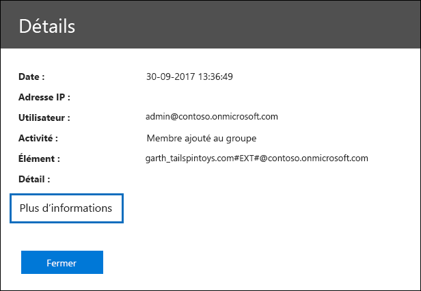

# Propriétés détaillées dans le journal d’audit Office 365Detailed properties in the Office 365 audit log

Lorsque vous exportez les résultats d'une recherche de journal d'audit à &amp; partir du centre de sécurité conformité Office 365, vous avez la possibilité de télécharger tous les résultats qui correspondent à vos critères de recherche. Pour ce faire, sélectionnez **Exporter les résultats** \> **Télécharger tous les résultats** sur la page de **recherche du journal d'audit** dans le centre de sécurité &amp; et de conformité. Pour plus d'informations, consultez la rubrique relative [à la recherche dans le &amp; journal d'audit dans le centre de sécurité conformité Office 365](search-the-audit-log-in-security-and-compliance.md).When you export the results of an audit log search from the Office 365 Security &amp; Compliance Center, you have the option to download all the results that meet your search criteria. You do this by selecting **Export results** \> **Download all results** on the **Audit log search** page in the Security &amp; Compliance Center. For more information, see [Search the audit log in the Office 365 Security &amp; Compliance Center](search-the-audit-log-in-security-and-compliance.md).
  
 Lorsque vous exportez tous les résultats d'une recherche de journal d'audit, les données brutes du journal d'audit unifié Office 365 sont copiées dans un fichier de valeurs séparées par des virgules (CSV) téléchargé sur votre ordinateur local. Ce fichier contient des informations supplémentaires provenant de l'entrée du journal d'audit dans une colonne nommée **détail**. Cette colonne contient une propriété à valeurs multiples pour plusieurs propriétés de l'enregistrement du journal d'audit. Chacune des paires **propriété: valeur** de cette propriété à valeurs multiples est séparée par une virgule.When your export all results for an audit log search, the raw data from the Office 365 unified audit log is copied to a comma separated value (CSV) file this is downloaded to your local computer. This file contains additional information from the audit log entry in a column named **Detail**. This column contains a multi-value property for multiple properties from the audit log record. Each of the **property:value** pairs in this multi-value property are separated by a comma. 
  
Le tableau suivant décrit les propriétés incluses, selon le service Office 365 dans lequel un événement se produit, dans la colonne de **détail** à plusieurs propriétés. Le **service Office 365 qui a cette** colonne de propriété indique le service et le type d'activité (utilisateur ou administrateur) qui inclut la propriété. Pour plus d'informations sur ces propriétés ou sur les propriétés qui ne sont peut-être pas mentionnées dans cette rubrique, voir [Office 365 Management Activity Schema API Schema](https://go.microsoft.com/fwlink/p/?LinkId=717993).The following table describes the properties that are included—depending on the Office 365 service in which an event occurs—in the multi-property **Detail** column. The **Office 365 service that has this property** column indicates the service and type of activity (user or admin) that includes the property. For more detailed information about these properties or about properties that might not be listed in this topic, see [Office 365 Management Activity API Schema](https://go.microsoft.com/fwlink/p/?LinkId=717993).
  
> [!TIP]
> Vous pouvez utiliser la Power Query dans Excel pour fractionner cette colonne en plusieurs colonnes afin que chaque propriété dispose de sa propre colonne. Cela vous permettra de trier et de filtrer sur une ou plusieurs de ces propriétés. Pour savoir comment procéder, consultez la section «fractionner une colonne par délimiteur» dans [fractionner une colonne de texte (Power Query)](https://support.office.com/article/5282d425-6dd0-46ca-95bf-8e0da9539662).You can use the Power Query in Excel to split this column into multiple columns so that each property will have its own column. This will let you sort and filter on one or more of these properties. To learn how to do this, see the "Split a column by delimiter" section in [Split a column of text (Power Query)](https://support.office.com/article/5282d425-6dd0-46ca-95bf-8e0da9539662). 
  
|**Propriété****Property**|**Description****Description**|**Service Office 365 avec cette propriété****Office 365 service that has this property**|
|:-----|:-----|:-----|
|CinémaActor    |L'utilisateur ou le compte de service qui a effectué l'action.The user or service account that performed the action. |Azure Active DirectoryAzure Active Directory    |
|AddOnNameAddOnName    |Nom d'un module complémentaire ajouté, supprimé ou mis à jour dans une équipe. Le type de modules complémentaires de Microsoft teams est un bot, un connecteur ou un onglet.The name of an add-on that was added, removed, or updated in a team. The type of add-ons in Microsoft Teams are a bot, a connector, or a tab.    |Microsoft TeamsMicrosoft Teams    |
|AddOnTypeAddOnType    |Type d'un module complémentaire ajouté, supprimé ou mis à jour dans une équipe. Les valeurs suivantes indiquent le type de module complémentaire.The type of an add-on that was added, removed, or updated in a team. The following values indicate the type of add-on.    **1** -indique un bot.**1** - Indicates a bot.  **2** -indique un connecteur.**2** - Indicates a connector.  **3** -indique un onglet.**3** - Indicates a tab. |Microsoft TeamsMicrosoft Teams    |
|AzureActiveDirectoryEventTypeAzureActiveDirectoryEventType    |Type d'événement Azure Active Directory. Les valeurs suivantes indiquent le type d'événement.The type of Azure Active Directory event. The following values indicate the type of event.    **0** -indique un événement de connexion au compte.**0** - Indicates an account login event.  **1** -indique un événement de sécurité d'application Azure.**1** - Indicates an Azure application security event. |Azure Active DirectoryAzure Active Directory    |
|ChannelGuidChannelGuid    |ID d'un canal Microsoft Teams. L'équipe dans laquelle se trouve le canal est identifiée par les propriétés **nom** et **TeamGuid** .The ID of a Microsoft Teams channel. The team that the channel is located in is identified by the **TeamName** and **TeamGuid** properties.    |Microsoft TeamsMicrosoft Teams    |
|ChannelNameChannelName    |Nom d'un canal Microsoft Teams. L'équipe dans laquelle se trouve le canal est identifiée par les propriétés **nom** et **TeamGuid** .The name of a Microsoft Teams channel. The team that the channel is located in is identified by the **TeamName** and **TeamGuid** properties.    |Microsoft TeamsMicrosoft Teams    |
|ClientClient    |Le périphérique client, le système d'exploitation de l'appareil et le navigateur d'appareil utilisé pour l'événement de connexion (par exemple, Nokia Lumia 920; Windows Phone 8; Internet Explorer 11).The client device, the device OS, and the device browser used for the login event (for example, Nokia Lumia 920; Windows Phone 8; IE Mobile 11).    |Azure Active DirectoryAzure Active Directory    |
|ClientInfoStringClientInfoString    |Informations sur le client de messagerie qui a été utilisé pour effectuer l'opération, par exemple une version de navigateur, une version d'Outlook et des informations sur l'appareil mobileInformation about the email client that was used to perform the operation, such as a browser version, Outlook version, and mobile device information    |Exchange (activité de boîte aux lettres)Exchange (mailbox activity)    |
|ClientIPClientIP    |Adresse IP du périphérique qui a été utilisé lors de l'enregistrement de l'activité. L'adresse IP est affichée dans un format d'adresse IPv4 ou IPv6.The IP address of the device that was used when the activity was logged. The IP address is displayed in either an IPv4 or IPv6 address format.    |Exchange et Azure Active DirectoryExchange and Azure Active Directory    |
|ClientIPAddressClientIPAddress    |Identique à ClientIP.Same as ClientIP.    |SharePointSharePoint    |
|CreationTimeCreationTime    |Date et heure au format UTC (temps universel coordonné) lorsque l'utilisateur a effectué l'activité.The date and time in Coordinated Universal Time (UTC) when the user performed the activity.    |ToutAll    |
|DestinationFileExtensionDestinationFileExtension    |Extension de fichier d'un fichier qui est copié ou déplacé. Cette propriété s'affiche uniquement pour les activités utilisateur les et FileMoved.The file extension of a file that is copied or moved. This property is displayed only for the FileCopied and FileMoved user activities.    |SharePointSharePoint    |
|DestinationFileNameDestinationFileName    |Le nom du fichier est copié ou déplacé. Cette propriété est affichée uniquement pour les actions les et FileMoved.The name of the file is copied or moved. This property is displayed only for the FileCopied and FileMoved actions.    |SharePointSharePoint    |
|DestinationRelativeUrlDestinationRelativeUrl    |URL du dossier de destination dans lequel un fichier est copié ou déplacé. La combinaison des valeurs des propriétés **SiteUrl**, **DestinationRelativeURL**et **destinationFileName** est identique à la valeur de la propriété **ObjectID** , qui est le nom du chemin d'accès complet au fichier qui a été copié. Cette propriété s'affiche uniquement pour les activités utilisateur les et FileMoved.The URL of the destination folder where a file is copied or moved. The combination of the values for the **SiteURL**, the **DestinationRelativeURL**, and the **DestinationFileName** properties is the same as the value for the **ObjectID** property, which is the full path name for the file that was copied. This property is displayed only for the FileCopied and FileMoved user activities.    |SharePointSharePoint    |
|EventSourceEventSource    |Indique qu'un événement s'est produit dans SharePoint. Les valeurs possibles sont **SharePoint** et **ObjectModel**.Identifies that an event occurred in SharePoint. Possible values are **SharePoint** and **ObjectModel**.    |SharePointSharePoint    |
|ExternalAccessExternalAccess    |Pour l'activité d'administration Exchange, indique si la cmdlet a été exécutée par un utilisateur de votre organisation, par le personnel du centre de connaissances Microsoft ou par un compte de service de centre de de services, ou par un administrateur délégué. La valeur **false** indique que l'applet de commande a été exécutée par une personne de votre organisation. La valeur **true** indique que l'applet de commande a été exécutée par le personnel du centre de services, un compte de service de centre de contenu ou un administrateur délégué.For Exchange admin activity, specifies whether the cmdlet was run by a user in your organization, by Microsoft datacenter personnel or a datacenter service account, or by a delegated administrator. The value **False** indicates that the cmdlet was run by someone in your organization. The value **True** indicates that the cmdlet was run by datacenter personnel, a datacenter service account, or a delegated administrator.    Pour l'activité des boîtes aux lettres Exchange, indique si un utilisateur a accédé à une boîte aux lettres à l'extérieur de votre organisation.For Exchange mailbox activity, specifies whether a mailbox was accessed by a user outside your organization.    |ExchangeExchange    |
|ExtendedPropertiesExtendedProperties    |Les propriétés étendues pour un événement Azure Active Directory.The extended properties for an the Azure Active Directory event.    |Azure Active DirectoryAzure Active Directory    |
|IDID    |ID de l'entrée de rapport. L'ID identifie de manière unique l'entrée de rapport.The ID of the report entry. The ID uniquely identifies the report entry.    |ToutAll    |
|InternalLogonTypeInternalLogonType    |Réservé à un usage interne.Reserved for internal use.    |Exchange (activité de boîte aux lettres)Exchange (mailbox activity)    |
|ItemTypeItemType    |Type d'objet auquel l'utilisateur a accédé ou modifié. Les valeurs possibles sont les suivants: **file**, **Folder**, **Web**, **site**, **client**et **DocumentLibrary**.The type of object that was accessed or modified. Possible values include **File**, **Folder**, **Web**, **Site**, **Tenant**, and **DocumentLibrary**.    |SharePointSharePoint    |
|LoginStatusLoginStatus    |Identifie les échecs de connexion qui ont pu se produire.Identifies login failures that might have occurred.    |Azure Active DirectoryAzure Active Directory    |
|LogonTypeLogonType    |Type d'accès à la boîte aux lettres. Les valeurs suivantes indiquent le type d'utilisateur qui a accédé à la boîte aux lettres.The type of mailbox access. The following values indicate the type of user who accessed the mailbox.     **0** -indique un propriétaire de boîte aux lettres.**0** - Indicates a mailbox owner.  **1** -indique un administrateur.**1** - Indicates an administrator.  **2** -indique un délégué.**2** - Indicates a delegate.  **3** -indique le service de transport dans le centre de Microsoft.**3** - Indicates the transport service in the Microsoft datacenter.  **4** -indique un compte de service dans le centre de Microsoft.**4** - Indicates a   service account in the Microsoft datacenter.  **6** -indique un administrateur délégué.**6** - Indicates a delegated administrator. |Exchange (activité de boîte aux lettres)Exchange (mailbox activity)    |
|MailboxGuidMailboxGuid    |GUID Exchange de la boîte aux lettres consultée.The Exchange GUID of the mailbox that was accessed.    |Exchange (activité de boîte aux lettres)Exchange (mailbox activity)    |
|MailboxOwnerUPNMailboxOwnerUPN    |Adresse de messagerie de la personne qui possède la boîte aux lettres à laquelle l'utilisateur a accédé.The email address of the person who owns the mailbox that was accessed.    |Exchange (activité de boîte aux lettres)Exchange (mailbox activity)    |
|MembresMembers    |Répertorie les utilisateurs qui ont été ajoutés ou supprimés d'une équipe. Les valeurs suivantes indiquent le type de rôle affecté à l'utilisateur.Lists the users that have been added or removed from a team. The following values indicate the Role type assigned to the user.     **1** -indique le rôle de propriétaire.**1** - Indicates  the Owner role.  **2** -indique le rôle de membre.**2** - Indicates the Member role.  **3** -indique le rôle invité.**3** - Indicates the Guest role.   La propriété Members inclut également le nom de votre organisation et l'adresse de messagerie du membre.The Members property also includes the name of your organization, and the member's email address.    |Microsoft TeamsMicrosoft Teams    |
|ModifiedProperties (Name, NewValue, OldValue)ModifiedProperties (Name, NewValue, OldValue)    |La propriété est incluse pour les événements d'administrateur, tels que l'ajout d'un utilisateur en tant que membre d'un site ou d'un groupe d'administrateurs de collection de sites. La propriété inclut le nom de la propriété qui a été modifiée (par exemple, le groupe administrateurs de site) la nouvelle valeur de la propriété modifiée (par exemple, l'utilisateur qui a été ajouté en tant qu'administrateur de site, et la valeur précédente de l'objet modifié.The property is included for admin events, such as adding a user as a member of a site or a site collection admin group. The property includes the name of the property that was modified (for example, the Site Admin group) the new value of the modified property (such the user who was added as a site admin, and the previous value of the modified object.    |All (activité de l'administrateur)All (admin activity)    |
|ObjectIDObjectID    |Pour la journalisation d'audit de l'administrateur Exchange, nom de l'objet qui a été modifié par la cmdlet.For Exchange admin audit logging, the name of the object that was modified by the cmdlet.    Pour l'activité SharePoint, le nom du chemin d'accès complet de l'URL du fichier ou du dossier auquel un utilisateur a accédé.For SharePoint activity, the full URL path name of the file or folder accessed by a user.    Pour l'activité Azure AD, le nom du compte d'utilisateur qui a été modifié.For Azure AD activity, the name of the user account that was modified.    |ToutAll    |
|OpérationOperation    |Nom de l'activité de l'utilisateur ou de l'administrateur. La valeur de cette propriété correspond à la valeur sélectionnée dans la liste déroulante **activités** . Si l'option **afficher les résultats pour toutes les activités** a été sélectionnée, le rapport inclura les entrées de toutes les activités d'utilisateur et d'administration de tous les services. Pour obtenir une description des opérations/activités qui sont consignées dans le journal d'audit Office 365, voir l'onglet **activités auditées** dans Rechercher dans le [Journal d'audit &amp; dans le centre de sécurité conformité Office 365](search-the-audit-log-in-security-and-compliance.md).The name of the user or admin activity. The value of this property corresponds to the value that was selected in the **Activities** drop down list. If **Show results for all activities** was selected, the report will included entries for all user and admin activities for all services. For a description of the operations/activities that are logged in the Office 365 audit log, see the **Audited activities** tab in [Search the audit log in the Office 365 Security &amp; Compliance Center](search-the-audit-log-in-security-and-compliance.md).    Pour l'activité d'administration Exchange, cette propriété identifie le nom de la cmdlet exécutée.For Exchange admin activity, this property identifies the name of the cmdlet that was run.    |ToutAll    |
|N...OrganizationID    |GUID de votre organisation Office 365.The GUID for your Office 365 organization.    |ToutAll    |
|PathPath    |Nom du dossier de boîte aux lettres dans lequel se trouve le message consulté. Cette propriété identifie également le dossier dans lequel un message est créé ou copié/déplacé.The name of the mailbox folder where the message that was accessed is located. This property also identifies the folder a where a message is created in or copied/moved to.    |Exchange (activité de boîte aux lettres)Exchange (mailbox activity)    |
|ParamètresParameters    |Pour l'activité d'administration Exchange, le nom et la valeur de tous les paramètres qui ont été utilisés avec la cmdlet identifiée dans la propriété Operation.For Exchange admin activity, the name and value for all parameters that were used with the cmdlet that is identified in the Operation property.    |Exchange (activité d'administration)Exchange (admin activity)    |
|RecordTypeRecordType    |Type d'opération indiqué par l'enregistrement. Les valeurs suivantes indiquent le type d'enregistrement.The type of operation indicated by the record. The following values indicate the record type.     **1** -indique un enregistrement du journal d'audit de l'administrateur Exchange.**1** - Indicates a record from the  Exchange  admin audit log.  **2** -indique un enregistrement du journal d'audit de boîte aux lettres Exchange pour une opération effectuée sur un élément de boîte aux lettres unique.**2** - Indicates a record from the  Exchange  mailbox audit log for an operation performed on a singled mailbox item.  **3** -indique également un enregistrement à partir du journal d'audit de boîte aux lettres Exchange. Ce type d'enregistrement indique que l'opération a été effectuée sur plusieurs éléments dans la boîte aux lettres source (par exemple, le fait de placer plusieurs éléments dans le dossier éléments supprimés ou de supprimer définitivement plusieurs éléments).**3** - Also indicates a record from the  Exchange  mailbox audit log. This record type indicates the operation was performed on multiple items in the source mailbox (such as moving multiple items to the Deleted Items folder or permanently deleting multiple items).  **4** -indique une opération d'administrateur de site dans SharePoint, telle qu'un administrateur ou un utilisateur qui affecte des autorisations à un site.**4** - Indicates a site admin operation in SharePoint, such as an administrator or user assigning permissions to a site.  **6** -indique une opération sur un fichier ou un dossier dans SharePoint, telle qu'un utilisateur visualisant ou modifiant un fichier.**6** - Indicates a file or folder-related operation in SharePoint, such as a user viewing or modifying a file.  **8** -indique une opération d'administration effectuée dans Azure Active Directory.**8** - Indicates an admin operation performed in Azure Active Directory.  **9** -indique les événements de connexion OrgId dans Azure Active Directory. Ce type d'enregistrement est en cours de dépréciation.**9** - Indicates  OrgId logon events in Azure Active Directory. This record type is being deprecated.  **10** -indique les événements de cmdlet de sécurité qui ont été exécutés par le personnel de Microsoft dans le centre de données.**10** - Indicates security cmdlet events that were performed by Microsoft personnel in the data center.  **11** -indique les événements de protection contre la perte de données (DLP) dans SharePoint.**11** - Indicates Data loss protection (DLP) events in SharePoint.  **12** -indique les événements Sway.**12** - Indicates Sway events.  **13** -indique les événements DLP dans Exchange, lorsqu'il est configuré avec une stratégie DLP unifié. Les événements DLP basés sur les règles de transport Exchange ne sont pas pris en charge.**13** - Indicates DLP events in Exchange, when configured with a unified a DLP policy. DLP events based on Exchange transport rules aren't supported. **14** -indique des événements de partage dans SharePoint.**14** - Indicates sharing events in SharePoint.  **15** -indique les événements de connexion STS (Secure Token Service) dans Azure Active Directory.**15** - Indicates Secure Token Service (STS) logon events in Azure Active Directory.  **18** -indique les &amp; événements du centre de sécurité conformité.**18** - Indicates Security &amp; Compliance Center events.  **20** -indique les événements Power bi.**20** - Indicates Power BI events.  **21**-indique les événements Dynamics 365.**21**- Indicates Dynamics 365 events. **22** -indique des événements Yammer.**22** - Indicates Yammer events.  **23** -indique les événements Skype entreprise.**23** - Indicates Skype for Business events.  **24** -indique des événements eDiscovery. Ce type d'enregistrement indique les activités réalisées en exécutant des recherches de contenu et en gérant les cas &amp; eDiscovery dans le centre de sécurité conformité. Pour plus d'informations, voir Search for eDiscovery Activities dans le journal d'audit Office 365.**24** - Indicates eDiscovery events. This record type indicates activities that were performed by running content searches and managing eDiscovery cases in the Security &amp; Compliance Center. For more information, see Search for eDiscovery activities in the Office 365 audit log. **25, 26 ou 27** -indique des événements Microsoft Teams.**25, 26, or 27** - Indicates Microsoft Teams events.  **28** -indique des événements d'hameçonnage et de programmes malveillants à partir d'Exchange Online Protection et Office 365 Advanced Threat Protection.**28** - Indicates phishing and malware events from Exchange Online Protection and Office 365 Advanced Threat Protection events.  **30** -indique les événements de flux Microsoft.**30** - Indicates Microsoft Flow events.  **32** -indication des événements de flux Microsoft.**32** - Indicated Microsoft Stream events.  **35** -indique les événements Microsoft Project.**35** - Indicates Microsoft Project events.   **36** -indique les événements de liste SharePoint.**36** - Indicates SharePoint list events.  **40** -indique les événements résultant de signaux d'alerte de sécurité et de conformité.**40** - Indicates events that results from security and compliance alert signals.  **41** -indique les liens approuvés des événements de remplacement de bloc et de blocage dans Office 365 protection avancée contre les menaces.**41** - Indicates safe links time-of-block and block override events in Office 365 Advanced Threat Protection. **44** -indique les événements Workplace Analytics.**44** - Indicates Workplace Analytics events.  **47** -indique des événements de hameçonnage et de programmes malveillants à partir d'Office 365 protection avancée contre les menaces pour les fichiers dans SharePoint, OneDrive et Microsoft Teams.**47** - Indicates phishing and malware events from Office 365 Advanced Threat Protection for files in SharePoint, OneDrive, and Microsoft Teams. |ToutAll    |
|ResultStatusResultStatus    |Indique si l'action (spécifiée dans la propriété **operation** ) a réussi ou non.Indicates whether the action (specified in the **Operation** property) was successful or not.    Pour l'activité d'administration Exchange, la valeur est **true** (réussite) ou **false** (échec).For Exchange admin activity, the value is either **True** (successful) or **False** (failed).    |ToutAll   |
|SecurityComplianceCenterEventTypeSecurityComplianceCenterEventType    |Indique que l'activité était un événement &amp; du centre de sécurité conformité. Toutes les &amp; activités du centre de sécurité conformité auront la valeur **0** pour cette propriété.Indicates that the activity was a Security &amp; Compliance Center event. All Security &amp; Compliance Center activities will have a value of **0** for this property.    |Centre de sécurité et conformité Office 365Office 365 Security &amp; Compliance Center    |
|SharingTypeSharingType    |Type d'autorisations de partage attribué à l'utilisateur avec lequel la ressource a été partagée. Cet utilisateur est identifié dans la propriété **UserSharedWith** .The type of sharing permissions that was assigned to the user that the resource was shared with. This user is identified in the **UserSharedWith** property.    |SharePointSharePoint    |
|SiteSite    |GUID du site où se trouve le fichier ou le dossier accédé par l'utilisateur.The GUID of the site where the file or folder accessed by the user is located.    |SharePointSharePoint    |
|SiteUrlSiteUrl    |URL du site où se trouve le fichier ou le dossier accédé par l'utilisateur.The URL of the site where the file or folder accessed by the user is located.    |SharePointSharePoint    |
|SourceFileExtensionSourceFileExtension    |Extension de fichier du fichier accédé par l'utilisateur. Cette propriété est vide si l'objet accédé est un dossier.The file extension of the file that was accessed by the user. This property is blank if the object that was accessed is a folder.    |SharePointSharePoint    |
|SourceFileNameSourceFileName    |Nom du fichier ou du dossier auquel l'utilisateur a accédé.The name of the file or folder accessed by the user.    |SharePointSharePoint    |
|SourceRelativeUrlSourceRelativeUrl    |URL du dossier qui contient le fichier accédé par l'utilisateur. La combinaison des valeurs des propriétés **SiteUrl**, **SourceRelativeURL**et **sourceFileName** est identique à la valeur de la propriété **ObjectID** , qui est le nom du chemin d'accès complet au fichier accédé par l'utilisateur.The URL of the folder that contains the file accessed by the user. The combination of the values for the **SiteURL**, the **SourceRelativeURL**, and the **SourceFileName** properties is the same as the value for the **ObjectID** property, which is the full path name for the file accessed by the user.    |SharePointSharePoint    |
|SujetSubject    |La ligne d'objet du message qui a été consulté.The subject line of the message that was accessed.    |Exchange (activité de boîte aux lettres)Exchange (mailbox activity)    |
|TabTypeTabType    | Type d'onglet ajouté, supprimé ou mis à jour dans une équipe. Les valeurs possibles pour cette propriété sont les suivantes:The type of tab added, removed, or updated in a team. The possible values for this property are:     **Excelpin** -un onglet Excel.**Excelpin** - An Excel tab.    **Extension** -toutes les applications tierces et tierces; comme Planner, VSTS et Forms.**Extension** - All first-party and third-party apps; such as Planner, VSTS, and Forms.    Onglet **Notes** -OneNote.**Notes** - OneNote tab.    **Pdfpin** -onglet PDF.**Pdfpin** - A PDF tab.    **Powerbi** -un onglet Powerbi.**Powerbi** - A PowerBI tab.    **Powerpointpin** -un onglet PowerPoint.**Powerpointpin** - A PowerPoint tab.    **Sharepointfiles** -un onglet SharePoint.**Sharepointfiles** - A SharePoint tab.    **Page Web** : onglet site Web épinglé.**Webpage** - A pinned website tab.    **Wiki-onglet** -un onglet wiki.**Wiki-tab** - A wiki tab.    **Wordpin** -un onglet Word.**Wordpin** - A Word tab.    |Microsoft TeamsMicrosoft Teams    |
|CibleTarget    |Utilisateur sur lequel l'action (identifiée dans la propriété **operation** ) a été effectuée. Par exemple, si un utilisateur invité est ajouté à SharePoint ou à une équipe Microsoft, cet utilisateur est mentionné dans cette propriété.The user that the action (identified in the **Operation** property) was performed on. For example, if a guest user is added to SharePoint or a Microsoft Team, that user would be listed in this property.    |Azure Active DirectoryAzure Active Directory    |
|TeamGuidTeamGuid    |ID d'une équipe dans Microsoft Teams.The ID of a team in Microsoft Teams.    |Microsoft TeamsMicrosoft Teams    |
|NomTeamName    |Nom d'une équipe dans Microsoft Teams.The name of a team in Microsoft Teams.    |Microsoft TeamsMicrosoft Teams    |
|UserAgentUserAgent    |Informations sur le navigateur de l'utilisateur. Ces informations sont fournies par le navigateur.Information about the user's browser. This information is provided by the browser.    |SharePointSharePoint    |
|UserDomainUserDomain    |Informations d'identité sur l'organisation cliente de l'utilisateur (acteur) qui a effectué l'action.Identity information about the tenant organization of the user (actor) who performed the action.    |Azure Active DirectoryAzure Active Directory    |
|IdentifiUserID    |Utilisateur qui a effectué l'action (spécifié dans la propriété **operation** ) ayant provoqué l'enregistrement journalisé. Notez que les enregistrements de l'activité effectuée par les comptes système (par exemple, SHAREPOINT\system ou NT AUTHORITY\SYSTEM) sont également inclus dans le journal d'audit.The user who performed the action (specified in the **Operation** property) that resulted in the record being logged. Note that records for activity performed by system accounts (such as SHAREPOINT\system or NT AUTHORITY\SYSTEM) are also included in the audit log.    |ToutAll    |
|UserKeyUserKey    |Autre ID pour l'utilisateur identifié dans la propriété **userid** . Par exemple, cette propriété est renseignée avec l'ID unique Passport (PUID) pour les événements exécutés par les utilisateurs dans SharePoint. Cette propriété peut également spécifier la même valeur que celle de la propriété **userid** pour les événements survenus dans d'autres services et événements exécutés par des comptes système.An alternative ID for the user identified in the **UserID** property. For example, this property is populated with the passport unique ID (PUID) for events performed by users in SharePoint. This property also might specify the same value as the **UserID** property for events occurring in other services and events performed by system accounts.    |ToutAll    |
|UserSharedWithUserSharedWith    |Utilisateur avec lequel une ressource a été partagée. Cette propriété est incluse si la valeur de la propriété **operation** est **SharingSet**. Cet utilisateur est également mentionné dans la colonne **partagé avec** du rapport.The user that a resource was shared with. This property is included if the value for the **Operation** property is **SharingSet**. This user is also listed in the **Shared with** column in the report.    |SharePointSharePoint    |
|UserTypeUserType    |Type d'utilisateur qui a effectué l'opération. Les valeurs suivantes indiquent le type d'utilisateur.The type of user that performed the operation. The following values indicate the user type.     **0** -un utilisateur normal.**0** - A regular user.  **2** -un administrateur de votre organisation Office 365.**2** - An administrator in your Office 365  organization.  **3** -un compte d'administrateur ou de système de centre de connaissances Microsoft.**3** - A Microsoft datacenter administrator or datacenter system account.  **4** -un compte système.**4** - A system account.  **5** -une application.**5** - An application.  **6** -un principal de service.**6** - A service principal. **7** -une stratégie personnalisée.**7** - A custom policy. **8** -une stratégie système.**8** - A system policy. |ToutAll    |
|VersionVersion    |Indique le numéro de version de l'activité (identifiée par la propriété **operation** ) qui est enregistrée.Indicates the version number of the activity (identified by the **Operation** property) that's logged.    |ToutAll    |
|Charge de travailWorkload    |Service Office 365 où l'activité s'est produite. Les valeurs possibles pour cette propriété sont les suivantes:The Office 365 service where the activity occurred. The possible values for this property are:     **SharePoint OneDrive Exchange AzureActiveDirectory DataCenterSecurity la conformité Sway Skype entreprise SecurityComplianceCenter PowerBI CRM Yammer MicrosoftTeams ThreatIntelligence MicrosoftFlow MicrosoftStream DlpSharePointClassificationData Project Analytics Workplace Workplace****SharePoint OneDrive Exchange AzureActiveDirectory DataCenterSecurity Compliance Sway Skype for Business SecurityComplianceCenter PowerBI CRM Yammer MicrosoftTeams ThreatIntelligence MicrosoftFlow MicrosoftStream DlpSharePointClassificationData Project PowerApps Workplace Analytics**|ToutAll    |
||||
   
Notez que les propriétés décrites ci-dessus s'affichent également lorsque vous cliquez sur **informations supplémentaires** lorsque vous affichez les détails d'un événement spécifique.Note that the properties described above are also displayed when you click **More information** when viewing the details of a specific event. 
  

  

