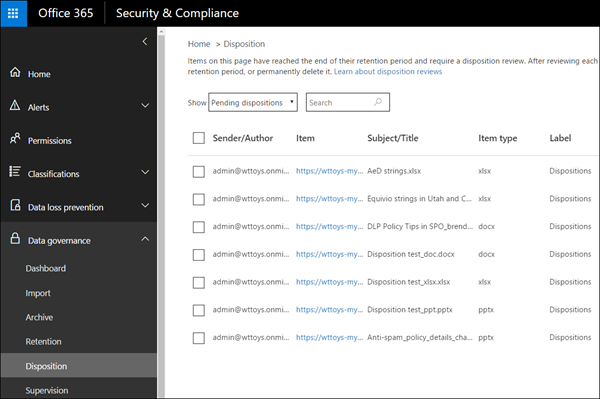
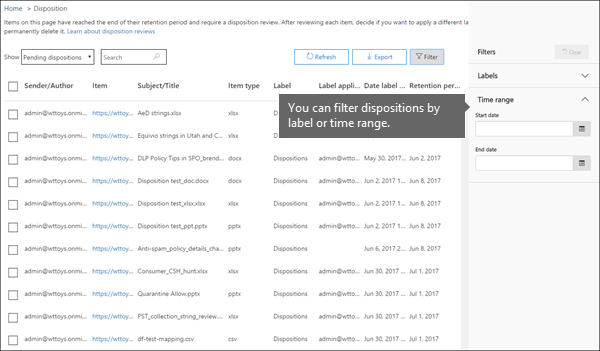

# Vue d'ensemble des révisions de destructionOverview of disposition reviews

Lorsque le contenu atteint la fin de sa période de rétention, il existe plusieurs raisons pour lesquelles vous pouvez souhaiter examiner ce contenu pour décider s'il peut être supprimé en toute sécurité («supprimé»).When content reaches the end of its retention period, there are several reasons why you might want to review that content to decide whether it can be safely deleted ("disposed"). Par exemple, vous devrez peut-être:For example, you might need to:
  
- Suspendre la suppression («disposition») du contenu pertinent en cas de litige ou d'audit.Suspend the deletion ("disposition") of relevant content in the event of litigation or an audit.
    
- Supprimer le contenu de la liste de disposition pour le stocker dans une archive, si ce contenu a une recherche ou une valeur historique.Remove content from the disposition list to store in an archive, if that content has research or historical value.
    
- Affecter une période de rétention différente au contenu, si la stratégie d'origine était une solution temporaire ou provisoire.Assign a different retention period to the content, if the original policy was a temporary or provisional solution.
    
- Renvoyer le contenu aux clients ou le transférer vers une autre organisation.Return the content to clients or transfer it to another organization.
    
Lorsque vous créez une étiquette qui conserve du contenu dans Office 365, vous pouvez choisir de déclencher une révision de disposition à la fin de la période de rétention.When you create a label that retains content in Office 365, you can choose to trigger a disposition review at the end of the retention period. Dans une révision de disposition:In a disposition review:
  
- Les personnes que vous choisissez reçoivent une notification par courrier électronique dont le contenu doit être révisé.The people you choose receive an email notification that they have content to review. Ces relecteurs peuvent être des utilisateurs individuels, des groupes de distribution ou des groupes de sécurité ou des groupes Office 365.These reviewers can be individual users, distribution or security groups, or Office 365 groups. Notez que les notifications sont envoyées chaque semaine.Note that notifications are sent on a weekly basis.
    
- Les réviseurs accèdent à la page de **disposition** dans &amp; le centre de conformité et de sécurité pour examiner le contenu.The reviewers go to the **Disposition** page in the Security &amp; Compliance Center to review the content. 
    
- Pour chaque document, le réviseur peut:For each document, the reviewer can:
    
  - Appliquer une étiquette différente.Apply a different label.
    
  - Prolonger sa période de rétention.Extend its retention period.
    
  - Supprimez-la définitivement.Permanently delete it.
    
- Les relecteurs peuvent afficher les dépôts en attente ou historiques, et exporter cette liste sous la forme d'un fichier. csv.Reviewers can view either pending or historical dispositions, and export that list as a .csv file.
    
Notez que les révisions de disposition nécessitent un abonnement Office 365 entreprise E5.Note that disposition reviews require an Office 365 Enterprise E5 subscription.
  
Une révision de disposition peut inclure du contenu dans des boîtes aux lettres Exchange, des sites SharePoint, des comptes OneDrive et des groupes Office 365.A disposition review can include content in Exchange mailboxes, SharePoint sites, OneDrive accounts, and Office 365 groups. Le contenu en attente d'une révision de disposition dans ces emplacements est supprimé uniquement lorsqu'un relecteur choisit de supprimer définitivement le contenu.Content awaiting a disposition review in those locations is deleted only after a reviewer chooses to permanently delete the content.
  

  
## Configuration de la révision de la disposition en créant une étiquetteSetting up the disposition review by creating a label

Il s'agit du flux de travail de base pour la configuration d'une révision de la disposition.This is the basic workflow for setting up a disposition review. Notez que ce flux affiche une étiquette publiée, puis appliquée manuellement par un utilisateur; par ailleurs, une étiquette qui déclenche une révision de disposition peut être appliquée automatiquement au contenu.Note that this flow shows a label being published and then manually applied by a user; alternatively, a label that triggers a disposition review can be auto-applied to content.
  

  
Une révision de disposition est une option lorsque vous créez une étiquette dans Office 365.A disposition review is an option when you create a label in Office 365. Notez que cette option n'est pas disponible dans une stratégie de rétention, mais uniquement dans une étiquette avec des paramètres de rétention.Note that this option is not available in a retention policy but only in a label with retention settings.
  
Pour en savoir plus sur les étiquettes, consultez l’article [Vue d’ensemble des étiquettes](labels.md).For more information about labels, see [Overview of labels](labels.md).
  

  
## Suppression du contenuDisposing content

Lorsqu'un réviseur est averti par courrier électronique que le contenu est prêt à être révisé, il peut \*\*\*\* accéder à la page de disposition &amp; dans le centre de sécurité conformité et sélectionner un ou plusieurs éléments.When a reviewer is notified by email that content is ready to review, they can go to the **Disposition** page in the Security &amp; Compliance Center and select one or more items. Le réviseur peut ensuite:The reviewer can then: 
  
- Appliquer une étiquette différente.Apply a different label.
    
- Prolonger la période de rétention.Extend the retention period.
    
- Supprimez définitivement l'élément.Permanently delete the item.
    
Un réviseur peut utiliser le lien pour afficher le document à son emplacement d'origine, si le réviseur dispose des autorisations pour cet emplacement.A reviewer can use the link to view the document in its original location, if the reviewer has permissions for that location. Lors d'une révision de destruction, le contenu ne se déplace jamais à partir de son emplacement d'origine et n'est jamais supprimé tant que le relecteur n'a pas choisi de le faire.During a disposition review, the content never moves from its original location, and it's never deleted until the reviewer chooses to do so.
  
Notez que les notifications par courrier électronique sont envoyées automatiquement aux relecteurs chaque semaine.Note that the email notifications are sent automatically to reviewers on a weekly basis. Par conséquent, lorsque le contenu atteint la fin de sa période de rétention, il peut falloir jusqu'à sept jours pour que les relecteurs reçoivent la notification par courrier électronique que le contenu attend.Therefore, when content reaches the end of its retention period, it may take up to seven days for reviewers to receive the email notification that content is awaiting disposition.
  
Notez également que toutes les actions de disposition sont auditées.Also note that all disposition actions are audited. Pour ce faire, vous devez activer l'audit au moins un jour avant la première action de disposition-pour plus d'informations, consultez [la rubrique Search the audit log dans le centre de &amp; sécurité conformité Office 365](search-the-audit-log-in-security-and-compliance.md).To ensure this, you must turn on auditing at least one day prior to the first disposition action - for more information, see [Search the audit log in the Office 365 Security &amp; Compliance Center](search-the-audit-log-in-security-and-compliance.md). 
  

  
## Autorisations pour la dispositionPermissions for disposition

Pour accéder à la page de **disposition** , les relecteurs doivent être membres du rôle de **gestion disposition** et du rôle **journaux d'audit en affichage seul** .To get access to the **Disposition** page, reviewers must be members of the **Disposition Management** role and the **View-Only Audit Logs** role. Nous vous recommandons de créer un nouveau groupe de rôles appelé réviseurs de disposition, d'ajouter ces deux rôles à ce groupe de rôles, puis d'ajouter des membres au groupe de rôles.We recommend creating a new role group called Disposition Reviewers, adding these two roles to that role group, and then adding members to the role group. 
  
Pour plus d'informations, consultez [la rubrique accorder aux utilisateurs l'accès &amp; au centre de sécurité conformité Office 365](grant-access-to-the-security-and-compliance-center.md)For more information, see [Give users access to the Office 365 Security &amp; Compliance Center](grant-access-to-the-security-and-compliance-center.md)
  
## Durée jusqu'à la suppression définitive du contenu suppriméHow long until disposed content is permanently deleted

Le contenu en attente d'une révision de disposition est supprimé uniquement lorsqu'un relecteur choisit de supprimer définitivement le contenu.Content awaiting a disposition review is deleted only after a reviewer chooses to permanently delete the content. Lorsque le relecteur choisit cette option, le contenu du site SharePoint ou du compte OneDrive devient éligible pour le processus de nettoyage standard décrit dans cette section: fonctionnement d' [une stratégie de rétention avec le contenu en place](retention-policies.md#how-a-retention-policy-works-with-content-in-place).When the reviewer chooses this option, the content in the SharePoint site or OneDrive account becomes eligible for the standard cleanup process described in this section: [How a retention policy works with content in place](retention-policies.md#how-a-retention-policy-works-with-content-in-place).
  
Cela signifie que:This means that:
  
- Le contenu d'une bibliothèque de documents est déplacé vers la corbeille de première étape **dans les 7 jours suivant** la disposition, puis supprimé définitivement **93 jours** après cela.Content in a document library will be moved to the first-stage Recycle Bin **within 7 days** of disposition, and then permanently deleted **93 days** after that. La Corbeille n'est pas indexée par la recherche et, par conséquent, son contenu n'est pas disponible pour une conservation eDiscovery.The Recycle Bin is not indexed by search and therefore its contents are not available to an eDiscovery hold. 
    
- Le contenu de la bibliothèque de conservation sera définitivement supprimé **dans les 7 jours suivant** la disposition.Content in the Preservation Hold library will be permanently deleted **within 7 days** of disposition. 
    
## Afficher les destructions en attente et terminéesView pending and completed dispositions

Sur la page de **disposition** du centre de &amp; sécurité et de conformité, vous pouvez afficher les dispositions en attente et terminées:On the **Disposition** page of the Security &amp; Compliance Center, you can view both pending and completed dispositions: 
  
- Les impositions **en attente** ont atteint la fin de leur période de rétention et nécessitent une révision de la disposition.**Pending** dispositions have reached the end of their retention period and require a disposition review. Après avoir vérifié chaque élément, déterminez si vous voulez lui appliquer une étiquette différente, prolonger sa période de rétention ou le supprimer définitivement.After reviewing each item, decide if you want to apply a different label to it, extend its retention period, or permanently delete it. 
    
- \*\*\*\* Les imPositions terminées ont été approuvées pour suppression lors d'une révision de destruction et sont maintenant en cours de suppression définitive.**Completed** dispositions were approved for deletion during a disposition review and are now in the process of being permanently deleted. Les éléments ayant une étiquette différente appliquée ou leur période de rétention étendue dans le cadre d'une révision ne s'afficheront pas ici.Items that had a different label applied or their retention period extended as part of a review won't appear here. 
    
### Filtrer les vues de dispositionFilter the disposition views

Vous pouvez filtrer ces affichages par étiquette ou plage de temps.You can filter these views by label or time range. Pour les impositions en attente, la plage horaire est basée sur la date d'expiration.For pending dispositions, the time range is based on the expiry date. Pour les dépôts historiques, la plage horaire est basée sur la date de suppression.For historical dispositions, the time range is based on the deletion date.
  

  
### Exportation des éléments de dispositionExport the disposition items

En outre, vous pouvez exporter les éléments de l'affichage en tant que fichier. csv que vous pouvez ouvrir dans Excel.In addition, you can export the items in either view as a .csv file that you can open in Excel.
  

  

