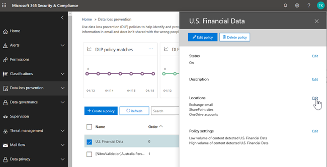
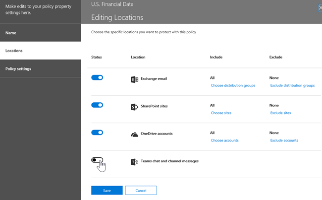

# Protection contre la perte de données et Microsoft teams

## Vue d'ensemble de DLP pour Microsoft teams

Récemment, les fonctionnalités de [protection contre la perte de données](data-loss-prevention-policies.md) (DLP) ont été étendues pour inclure Microsoft Teams. Si votre organisation dispose de DLP, vous pouvez maintenant définir des stratégies qui empêchent les utilisateurs de partager des informations sensibles dans un canal Microsoft teams ou une session de conversation. Voici quelques exemples illustrant le fonctionnement de cette protection:

- **Exemple 1: protection des informations sensibles dans les messages**. Supposons qu'une personne tente de partager des informations sensibles dans une conversation ou un canal de teams avec des invités (utilisateurs externes). Si vous avez défini une stratégie DLP pour éviter cela, les messages contenant des informations sensibles qui sont envoyés à des utilisateurs externes sont supprimés. Cela se produit automatiquement et en quelques secondes, en fonction de la configuration de votre stratégie DLP.

- **Exemple 2: protection des informations sensibles dans les documents**. Supposons qu'une personne tente de partager un document avec des invités dans un canal ou une conversation Microsoft Teams, et que le document contienne des informations sensibles. Si une stratégie DLP est définie pour éviter cela, le document ne s'ouvrira pas pour ces utilisateurs. Notez que dans ce cas, votre stratégie DLP doit inclure SharePoint et OneDrive pour que la protection soit mise en place.

## Conseils de stratégie pour aider les utilisateurs

Tout comme le fonctionnement de DLP dans [Exchange, Outlook et Outlook sur le Web, les](data-loss-prevention-policies.md#policy-evaluation-in-exchange-online-outlook-and-outlook-on-the-web) [sites SharePoint et OneDrive entreprise](data-loss-prevention-policies.md#policy-evaluation-in-onedrive-for-business-and-sharepoint-online-sites), ainsi que [les](data-loss-prevention-policies.md#policy-evaluation-in-the-office-desktop-programs)conseils de stratégie s'affichent lorsqu'une action est en conflit avec une stratégie DLP. Voici un exemple de Conseil de stratégie:

Dans ce cas, l'expéditeur a tenté de partager un numéro de sécurité sociale dans un canal Microsoft Teams. Le lien **que puis-je faire?** ouvre une boîte de dialogue qui fournit des options pour l'expéditeur afin de résoudre le problème. Notez que dans ce cas, l'expéditeur peut choisir de remplacer la stratégie ou d'informer un administrateur qu'il doit l'examiner et le résoudre.

Dans votre organisation, vous pouvez choisir d'autoriser ou non les utilisateurs à remplacer une stratégie DLP. Lorsque vous configurez vos stratégies DLP, vous pouvez utiliser les conseils de stratégie par défaut ou [personnaliser les conseils de stratégie](#to-customize-policy-tips) pour votre organisation. 

Pour revenir à notre exemple, lorsqu'un expéditeur partage un numéro de sécurité sociale dans un canal Teams, voici ce que Saw le destinataire:

Le lien **qu'est-ce que c'est?** ouvre un [article](data-loss-prevention-policies.md) sur les stratégies DLP, ce qui permet d'expliquer pourquoi le message a été bloqué.

### Pour personnaliser les conseils de stratégie

Pour effectuer cette tâche, vous devez disposer d'un rôle disposant d'autorisations pour modifier les stratégies DLP. Pour en savoir plus, consultez la rubrique [autorisations](data-loss-prevention-policies.md#permissions).

1. Accédez au centre de sécurité & de sécurité Office 365[https://protection.office.com](https://protection.office.com)() et connectez-vous.

2. Choisissez**stratégie**de **protection contre** > la perte de données. 

3. Sélectionnez une stratégie, puis en regard de **paramètres de stratégie**, sélectionnez **modifier**.

4. Créez une règle ou modifiez une règle existante pour la stratégie.  

5. Dans l'onglet **notifications utilisateur** , sélectionnez **personnaliser le texte du message électronique** et/ou **personnaliser les options de texte du Conseil de stratégie** .    

6. Spécifiez le texte que vous souhaitez utiliser pour les notifications par courrier électronique et/ou les conseils de stratégie, puis cliquez sur **Enregistrer**. 

7. Dans l'onglet **paramètres de stratégie** , sélectionnez **Enregistrer**.

Prévoyez environ une heure pour que vos modifications fonctionnent dans votre centre de données et qu'elles soient synchronisées avec les comptes d'utilisateur.
 
## Ajout de Microsoft teams à des stratégies DLP existantes

Pour effectuer cette tâche, vous devez disposer d'un rôle disposant d'autorisations pour modifier les stratégies DLP. Pour en savoir plus, consultez la rubrique [autorisations](data-loss-prevention-policies.md#permissions).

1. Accédez au centre de sécurité & de sécurité Office 365[https://protection.office.com](https://protection.office.com)() et connectez-vous.

2. Choisissez**stratégie**de **protection contre** > la perte de données. 

3. Sélectionnez une stratégie, puis examinez les valeurs figurant dans la zone **emplacements**. Si vous voyez la **conversation teams et les messages de canal**, tous sont définis. Si ce n'est pas le cas, cliquez sur **modifier**.  

4. Dans la colonne **État** , activez la stratégie pour la **conversation de teams et les messages de canal**.  

5. Conservez les paramètres par défaut de tous les comptes, ou spécifiez les comptes à inclure ou à exclure.

6. Cliquez sur **Enregistrer**.

Prévoyez environ une heure pour que vos modifications fonctionnent dans votre centre de données et qu'elles soient synchronisées avec les comptes d'utilisateur.

## Définir une nouvelle stratégie DLP pour Microsoft teams

Pour effectuer cette tâche, vous devez disposer d'un rôle disposant d'autorisations pour modifier les stratégies DLP. Pour en savoir plus, consultez la rubrique [autorisations](data-loss-prevention-policies.md#permissions).

1. Accédez au centre de sécurité & de sécurité Office 365[https://protection.office.com](https://protection.office.com)() et connectez-vous.

2. Choisir une**stratégie** > de **protection contre** > la perte**de données + créer une stratégie**. 

3. Choisissez un [modèle](data-loss-prevention-policies.md#dlp-policy-templates), puis cliquez sur **suivant**. Dans notre exemple, nous avons choisi le modèle de données des informations d'identification personnelle aux États-Unis.  

4. Dans l'onglet **nom de votre stratégie** , spécifiez un nom et une description pour la stratégie, puis cliquez sur **suivant**. 

5. Dans l'onglet **choisir les emplacements** , conservez le paramètre par défaut tous les emplacements ou sélectionnez **me laisser choisir des emplacements spécifiques**, puis cliquez sur **suivant**. Si vous avez choisi de choisir des emplacements spécifiques, sélectionnez les emplacements de votre stratégie DLP, puis cliquez sur **suivant**.  
    > [!NOTE]
    > Si vous souhaitez vous assurer que les documents qui contiennent des informations sensibles ne sont pas partagés de manière inappropriée, assurez-vous que les **sites SharePoint** et **OneDrive** sont activés, ainsi que la **conversation et les messages de canal**de teams.
 

6. Dans l' **onglet Paramètres de stratégie** , sous **personnaliser le type de contenu à protéger**, conservez les paramètres par défaut simples ou choisissez **utiliser les paramètres avancés**, puis cliquez sur **suivant**. Si vous choisissez Paramètres avancés, vous pouvez créer ou modifier des règles pour votre stratégie. (Pour obtenir de l'aide, consultez la rubrique [paramètres simples et paramètres avancés](data-loss-prevention-policies.md#simple-settings-vs-advanced-settings).)

7.  Dans l'onglet **paramètres de stratégie** , sous que voulez **-vous faire si nous détectons des informations sensibles?**, vérifiez les paramètres. (C'est ici que vous pouvez choisir de conserver les conseils de stratégie par défaut et les notifications par [courrier électronique](use-notifications-and-policy-tips.md), ou de les personnaliser.)  Lorsque vous avez terminé d'examiner ou de modifier les paramètres, choisissez **suivant**.

8. Dans l' **onglet Paramètres de stratégie** , sous voulez- **vous activer la stratégie ou effectuer d'abord des tests?**, indiquez si vous souhaitez activer la stratégie, la [Tester](data-loss-prevention-policies.md#roll-out-dlp-policies-gradually-with-test-mode)ou la désactiver pour le moment, puis cliquez sur **suivant**.  

9. Dans l'onglet **vérifier vos paramètres** , passez en revue les paramètres de votre nouvelle stratégie. Choisissez **modifier** pour apporter des modifications. Lorsque vous avez terminé, sélectionnez **créer**. 

Prévoyez environ une heure pour que votre nouvelle stratégie fonctionne dans votre centre de données et synchronisez-vous avec les comptes d'utilisateur.

## Articles connexes

[Création, test et réglage d’une stratégie DLP](create-test-tune-dlp-policy.md)

[Envoi des notifications et affichage des conseils de stratégie pour les stratégies DLP](use-notifications-and-policy-tips.md)
