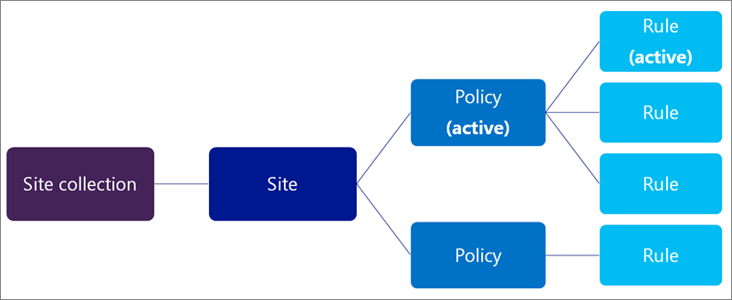

# Vue d’ensemble des stratégies de suppression de documents

> [!IMPORTANT]
> Pour aller plus loin, nous vous recommandons d'utiliser une stratégie de rétention ou des étiquettes créées dans le centre de conformité Microsoft 365, le centre &amp; de sécurité Microsoft 365 ou le centre de sécurité conformité Office 365 au lieu d'une stratégie de suppression de documents. Les stratégies de suppression de documents continueront à fonctionner côte à côte avec des stratégies de rétention, mais si vous devez conserver ou supprimer du contenu n'importe où dans Office 365, nous vous recommandons d'utiliser une stratégie de rétention. Pour plus d'informations, consultez [la rubrique utiliser une stratégie de rétention au lieu de ces fonctionnalités](retention-policies.md#use-a-retention-policy-instead-of-these-features).
  
Votre organisation peut être amenée à conserver des documents pendant une période de temps en raison de la conformité, de la légalité ou d'autres exigences professionnelles. Toutefois, si votre organisation conserve les documents plus longtemps que nécessaire, vous risquez de créer des risques légaux inutiles. Avec une stratégie de suppression de documents, vous pouvez réduire de manière proactive les risques en supprimant des documents dans un site après une période de temps spécifique (par exemple, vous pouvez supprimer des documents dans les sites OneDrive entreprise de l'utilisateur cinq ans après la création des documents).
  
Les stratégies de suppression de documents sont puissantes mais flexibles, par exemple, vous pouvez:
  
- Autorisez les propriétaires de sites à choisir parmi les stratégies que vous créez et gérez de manière centralisée. Vous pouvez également autoriser les propriétaires de sites à désactiver totalement s'ils décident qu'une stratégie ne s'applique pas à leur contenu.
    
- Appliquer une seule stratégie obligatoire sur tous les sites d'une collection de sites, tels que tous les sites OneDrive entreprise, ou même appliquer une stratégie sur toutes les collections de sites créées à partir d'un modèle de collection de sites spécifique, tel que le modèle de site d'équipe.
    
- Fournir une stratégie par défaut avec une règle par défaut qui sera automatiquement appliquée sans aucune action requise par les propriétaires de site.
    
- Créer une stratégie qui inclut plusieurs règles de suppression pouvant être choisies par un propriétaire de site.
    
Vous créez et gérez des stratégies de suppression de documents à l'aide du centre de stratégies de suppression de documents. Vous pouvez également créer le centre de stratégies manuellement en [créant la collection de sites](https://go.microsoft.com/fwlink/p/?LinkID=404342) et en choisissant **Centre de stratégie de conformité** dans l'onglet **entreprise** . Chaque client ne peut avoir qu'un seul centre de stratégie de suppression de documents. 
  

  
## Quand utiliser des stratégies de suppression de documents?

Outre les stratégies de suppression de documents, Office 365 fournit ces stratégies de rétention pour le contenu du site:
  
- [Gestion des enregistrements](https://go.microsoft.com/fwlink/p/?LinkID=404250)
    
- [Stratégies de gestion des informations pour les types de contenu, les listes et les bibliothèques](https://go.microsoft.com/fwlink/p/?LinkID=404239)
    
- [Stratégies de site](https://go.microsoft.com/fwlink/p/?LinkID=404242)
    
Chaque type de stratégie fonctionne de manière optimale pour un type spécifique de site ou de données. Par exemple, votre organisation peut disposer d'un site hautement structuré qui utilise des types de contenu, tels qu'un site financier pour les contrats ou une base de connaissances pour les articles. Dans ce cas, vous pouvez utiliser des stratégies de type de contenu. Il se peut que votre organisation doive conserver des documents juridiques, auquel cas vous pouvez utiliser des types de contenu et un centre d'enregistrements pour implémenter un plan de fichiers.
  
Les stratégies de suppression de documents ne remplacent pas les stratégies de gestion des enregistrements ou de gestion des informations, qui fonctionnent mieux avec des données structurées et des types de contenu. Au lieu de cela, vous devez utiliser des stratégies de suppression de documents lorsque vous avez besoin de gérer largement la suppression automatique des données non structurées comme les sites d'équipe et les sites OneDrive entreprise.
  

  
Si vous appliquez une stratégie de suppression de documents à un site qui utilise déjà des stratégies de type de contenu ou des stratégies de gestion des informations pour une liste ou une bibliothèque, ces stratégies sont ignorées alors que la stratégie de suppression de documents est appliquée. Cela signifie que vous devez planifier un site pour qu'il utilise uniquement des stratégies destinées à un contenu structuré ou non structuré, pas les deux. Pour plus d'informations sur la façon dont les stratégies de suppression de documents remplacent les autres stratégies, consultez la rubrique [appliquer ou supprimer une stratégie de suppression de documents pour un site](apply-or-remove-a-document-deletion-policy-for-a-site.md).
  
Contrairement à d'autres stratégies, les stratégies de suppression de documents fonctionnent uniquement sur les bibliothèques de documents, pas sur les listes.
  
## Règles et stratégies de suppression

Une stratégie de suppression de documents contient une ou plusieurs règles de suppression qui spécifient les éléments suivants:
  
- La période de temps jusqu'à la suppression.
    
- Indique s'il faut calculer la date de suppression à partir du moment où le document a été créé ou modifié pour la dernière fois.
    
- S'il faut supprimer définitivement le document ou la corbeille.
    
Si une stratégie contient plusieurs règles, les propriétaires de site peuvent sélectionner la règle qui s'applique le mieux à leur contenu.
  

  
## Stratégies et affectations

Une fois que vous avez créé une stratégie de suppression de documents, vous pouvez l'affecter à un modèle de collection de sites, par exemple, vous pouvez affecter une stratégie au modèle OneDrive entreprise afin qu'elle comprenne le site OneDrive de chaque utilisateur. Lorsque vous affectez une stratégie à un modèle de collection de sites, cette méthode s'applique à toutes les collections de sites déjà créées à partir de ce modèle, en plus des collections de sites créées à partir de ce modèle à l'avenir.
  

  
Vous pouvez également affecter une stratégie à une collection de sites spécifique: cela remplace toutes les stratégies qui ont été affectées à ce modèle de collection de sites. Par exemple, vous pouvez affecter des stratégies au modèle de site d'équipe, mais les remplacer par l'application d'un ensemble de stratégies différent à une collection de sites spécifique créée à partir de ce modèle.
  
### Une stratégie obligatoire ou plusieurs stratégies à choisir

Lorsque vous affectez une stratégie, vous pouvez choisir de la rendre obligatoire, afin que seule cette stratégie puisse être affectée et qu'elle soit appliquée à tous les sites de la collection de sites. Les propriétaires de site ne peuvent pas désactiver une stratégie obligatoire, ce qui signifie que les documents du site seront soumis à la stratégie de suppression quelle que soit la stratégie.
  
Au lieu de rendre obligatoire une seule stratégie, vous pouvez également affecter plusieurs stratégies à une collection de sites, ce qui permet à chaque propriétaire de site de choisir la stratégie à appliquer à son site, voire de désactiver totalement. Par exemple, vous pouvez créer une stratégie pour les documents professionnels généraux et une autre pour les documents financiers dont la planification de rétention est différente. Un propriétaire de site connaît souvent le mieux le contenu de son site et, par conséquent, la stratégie de suppression de documents à appliquer. Une seule stratégie peut être appliquée à chaque site.
  
### Une règle ou plusieurs règles à choisir

À son tour, chaque stratégie peut contenir de nombreuses règles, par exemple, une stratégie de suppression pour des documents d'entreprise généraux peut avoir deux règles:
  
- Les documents qui n'ont pas besoin d'une rétention en fonction des obligations légales ou d'un besoin d'entreprise permanent ne doivent pas être conservés pendant une période de création de plus d'un an.
    
- Les documents nécessaires à l'utilisation active de l'entreprise, qui sont nécessaires pendant plus d'un an, ne doivent pas être conservés pendant une période de trois ans à compter de la création.
    
Un propriétaire de site peut déterminer que son site contient des documents d'entreprise généraux, sélectionner cette stratégie de suppression, puis sélectionner la règle appropriée dans la stratégie. Vous pouvez sélectionner uniquement une règle à partir de la stratégie actuellement appliquée au site (et non à partir d'une stratégie), et la règle s'applique à toutes les bibliothèques de documents du site.
  
## La relation des collections de sites, des stratégies et des règles;

La relation de base est la suivante:
  
Une ou plusieurs stratégies peuvent être affectées à une collection de sites ou à un modèle de collection de sites, et chacune d'entre elles peut avoir une ou plusieurs règles. Toutefois, il ne peut y avoir qu'une seule stratégie active par site, et il ne peut y avoir qu'une seule règle de suppression active à tout moment pour les bibliothèques au sein du site.
  

  
## Les stratégies de suppression de documents sont héritées

À l'inStar des autorisations, de la navigation et de nombreuses autres fonctionnalités de site, les stratégies de suppression de documents sont héritées. Un propriétaire de site peut sélectionner une stratégie de suppression de documents pour son site, et tous les sous-sites héritent de la stratégie du parent. Le propriétaire d'un sous-site peut rompre l'héritage en sélectionnant une autre combinaison de stratégie et de règle, et cette stratégie s'applique à tous les sous-sites jusqu'à ce que l'héritage soit de nouveau rompu.
  
## Première affectation des stratégies de suppression de documents

Il est important de comprendre que la période spécifiée pour une stratégie de suppression de documents signifie le temps écoulé depuis que le document a été créé ou modifié, et non le moment où la stratégie a été affectée. Par exemple, vous pouvez créer une stratégie de suppression de documents qui supprime définitivement les documents deux ans après leur création, puis affecter cette stratégie à un modèle de collection de sites à partir duquel plusieurs collections de sites ont été créées quatre ou cinq ans auparavant. Dans ce cas, il est probable que les collections de sites existantes contiennent de nombreux documents qui sont déjà plus anciens que les deux années spécifiés par la stratégie de suppression, ce qui signifie que beaucoup de contenu seront supprimés peu après l'affectation de la stratégie de suppression de documents pour le premier périodes.
  
Lorsque vous affectez la stratégie pour la première fois, tous les documents du site sont évalués et supprimés s’ils répondent aux critères. Cela s’applique à tous les documents existants, et non simplement aux documents créés depuis l’affectation de la stratégie. Et n'oubliez pas que la période est l'âge de chaque document, et non l'heure à laquelle la stratégie a été affectée pour la première fois.
  
Par conséquent, avant d'affecter une stratégie à un site pour la première fois, vous devez tout d'abord prendre en compte l'âge du contenu existant et la façon dont la stratégie peut avoir un impact sur le contenu existant. Vous souhaiterez peut-être également communiquer la nouvelle stratégie aux propriétaires de site avant de l'affecter, afin de leur accorder le temps d'évaluer l'impact possible.
  
## Délai de propagation des stratégies

Une fois que vous avez affecté des stratégies à une collection de sites, les propriétaires de sites utilisent le lien **stratégies de suppression de documents** sur la page Paramètres du **site** pour afficher et appliquer les stratégies disponibles pour le site. 
  
Le lien **stratégies de suppression de documents** ne s'affiche pas, sauf si des stratégies ont été affectées à la collection de sites. De plus, le lien ne s'affiche pas immédiatement après que des stratégies ont été affectées au site; le lien des stratégies de **Suppression de documents** peut prendre jusqu'à 24 heures. 
  
## Autorisations

Les membres de votre équipe de conformité qui utiliseront le centre de stratégie de suppression de documents doivent disposer d'autorisations sur le centre de stratégies et sur les collections de sites auxquelles les stratégies seront appliquées. Nous vous recommandons d'effectuer les actions suivantes :
  
1. Créez un groupe de sécurité qui contient tous les utilisateurs du centre de stratégies de suppression de documents, très probablement votre équipe de gestion des stratégies de conformité. Pour plus d'informations, voir [gérer les groupes de sécurité à extension messagerie](https://go.microsoft.com/fwlink/p/?LinkID=404345) . 
    
2. Dans le centre de stratégie de suppression de documents, affectez des autorisations de propriétaire de collection de sites au groupe de sécurité. Pour plus d'informations, consultez la rubrique [autorisations pour les administrateurs de collections de sites](https://go.microsoft.com/fwlink/p/?LinkID=404346) . 
    
3. Dans chaque collection de sites à laquelle vous devez affecter des stratégies de suppression de documents, affectez des autorisations de propriétaire de collection de sites au groupe de sécurité.
    
## Fonctionnement des stratégies de suppression de documents avec les stratégies de blocage

Une stratégie de blocage garantit que tout le contenu est préservé pendant une période de temps spécifique, tandis qu'une stratégie de suppression de documents garantit que tout le contenu est supprimé après une période de temps spécifique.
  
Si vous avez besoin de conserver des documents pendant une période de temps fixe, vous pouvez utiliser une stratégie de blocage en association avec une stratégie de suppression. Par exemple, vous pouvez conserver des documents pendant trois ans après leur modification, puis configurer une stratégie de suppression pour supprimer ces documents trois ans après leur dernière modification.
  
Notez qu'une stratégie de suppression ne peut pas remplacer une conservation. Si un site est en attente et qu'une stratégie de suppression de documents supprime un document, le document est préservé dans la bibliothèque de conservation de la même manière que si le document avait été supprimé manuellement.
  
## Voir aussi

[Application ou suppression d’une stratégie de suppression de documents pour un site](apply-or-remove-a-document-deletion-policy-for-a-site.md)

[Création d’une stratégie de suppression de documents](create-a-document-deletion-policy.md)

