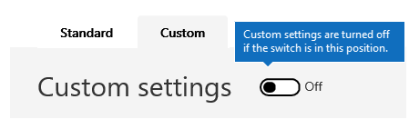

# <a name="enable-or-disable-safety-tips-in-office-365"></a><span data-ttu-id="27297-103">Activer ou désactiver les conseils de sécurité dans Office 365</span><span class="sxs-lookup"><span data-stu-id="27297-103">Enable or disable safety tips in Office 365</span></span>

<span data-ttu-id="27297-104">Exchange Online Protection (EOP) ajoute ou horodate un Conseil de sécurité pour les messages électroniques qu’il remet.</span><span class="sxs-lookup"><span data-stu-id="27297-104">Exchange Online Protection (EOP) adds, or stamps, a safety tip to email messages that it delivers.</span></span> <span data-ttu-id="27297-105">Ces conseils de sécurité fournissent aux destinataires un moyen rapide de déterminer si un message provient d’un expéditeur sécurisé et vérifié, si le message a été marqué comme courrier indésirable par Office 365, si le message contient un message suspect, tel qu’une escroquerie de type hameçonnage, ou si des images externes ont été bloquée.</span><span class="sxs-lookup"><span data-stu-id="27297-105">These safety tips provide recipients with a quick, visual way to determine if a message is from a safe, verified sender, if the message has been marked as spam by Office 365, if the message contains something suspicious such as a phishing scam, or if external images have been blocked.</span></span> <span data-ttu-id="27297-106">Les administrateurs d’Office 365 et d’EOP peuvent modifier un paramètre de stratégie de courrier indésirable pour activer ou désactiver l’affichage des conseils de sécurité dans les messages électroniques dans Outlook et d’autres clients de messagerie de bureau.</span><span class="sxs-lookup"><span data-stu-id="27297-106">Office 365 and EOP-standalone admins can edit a spam policy setting to enable or disable safety tips from being displayed in email in Outlook and other desktop email clients.</span></span> 
  
<span data-ttu-id="27297-107">Office 365 active les conseils de sécurité par défaut pour votre organisation et nous vous recommandons de les laisser activés pour combattre le courrier indésirable et les attaques par hameçonnage.</span><span class="sxs-lookup"><span data-stu-id="27297-107">Office 365 enables safety tips by default for your organization and we recommend that you leave them enabled to help combat spam and phishing attacks.</span></span> <span data-ttu-id="27297-108">Vous ne pouvez pas désactiver les conseils de sécurité pour Outlook sur le Web.</span><span class="sxs-lookup"><span data-stu-id="27297-108">You can't disable safety tips for Outlook on the web.</span></span>
  
<span data-ttu-id="27297-109">Pour voir des exemples et pour en savoir plus sur les informations affichées dans les conseils de sécurité, consultez la rubrique [conseils de sécurité dans les messages électroniques dans Office 365.](safety-tips-in-office-365.md)</span><span class="sxs-lookup"><span data-stu-id="27297-109">To see examples and to learn about the information displayed in safety tips, see [Safety tips in email messages in Office 365.](safety-tips-in-office-365.md)</span></span>
  
<span data-ttu-id="27297-110">Dans cet article :</span><span class="sxs-lookup"><span data-stu-id="27297-110">In this topic:</span></span>
  
- [<span data-ttu-id="27297-111">Pour activer ou désactiver les conseils de sécurité à l’aide du &amp; Centre de sécurité conformité Office 365</span><span class="sxs-lookup"><span data-stu-id="27297-111">To enable or disable safety tips by using the Office 365 Security &amp; Compliance Center</span></span>](enable-or-disable-safety-tips.md#SandCCsafetytip)
    
- [<span data-ttu-id="27297-112">Pour activer ou désactiver les conseils de sécurité à l’aide de PowerShell</span><span class="sxs-lookup"><span data-stu-id="27297-112">To enable or disable safety tips by using PowerShell</span></span>](enable-or-disable-safety-tips.md#pshellsafetytip)
    
## <a name="to-enable-or-disable-safety-tips-by-using-the-office-365-security-amp-compliance-center"></a><span data-ttu-id="27297-113">Pour activer ou désactiver les conseils de sécurité à l’aide du &amp; Centre de sécurité conformité Office 365</span><span class="sxs-lookup"><span data-stu-id="27297-113">To enable or disable safety tips by using the Office 365 Security &amp; Compliance Center</span></span>
<span data-ttu-id="27297-114"><a name="SandCCsafetytip"> </a></span><span class="sxs-lookup"><span data-stu-id="27297-114"></span></span>

1. <span data-ttu-id="27297-115">Accédez à [https://protection.office.com](https://protection.office.com).</span><span class="sxs-lookup"><span data-stu-id="27297-115">Go to [https://protection.office.com](https://protection.office.com).</span></span>
    
2. <span data-ttu-id="27297-116">Connectez-vous à Office 365 avec votre compte professionnel ou scolaire.</span><span class="sxs-lookup"><span data-stu-id="27297-116">Sign in to Office 365 with your work or school account.</span></span>
    
3. <span data-ttu-id="27297-117">Choisissez \*\*\*\* \> **stratégie**de gestion des menaces.</span><span class="sxs-lookup"><span data-stu-id="27297-117">Choose **Threat Management** \> **Policy**.</span></span> 
    
4. <span data-ttu-id="27297-118">Sur la page **stratégie** , choisissez **blocage du courrier**indésirable.</span><span class="sxs-lookup"><span data-stu-id="27297-118">On the **Policy** page, choose **Anti-Spam**.</span></span>
    
    
  
5. <span data-ttu-id="27297-120">Sur la page **paramètres de blocage du courrier** indésirable, sélectionnez l’onglet **personnalisé** .</span><span class="sxs-lookup"><span data-stu-id="27297-120">On the **Anti-spam settings** page choose the **Custom** tab.</span></span> 
    
    
  
6. <span data-ttu-id="27297-122">Si nécessaire, choisissez le commutateur **paramètres personnalisés** pour activer les paramètres personnalisés.</span><span class="sxs-lookup"><span data-stu-id="27297-122">If necessary, choose the **Custom settings** switch to turn on custom settings.</span></span> <span data-ttu-id="27297-123">Si le commutateur de paramètres personnalisés est **désactivé**, vous ne pourrez pas modifier les stratégies de filtrage du courrier indésirable.</span><span class="sxs-lookup"><span data-stu-id="27297-123">If the custom settings switch is set to **Off**, you won't be able to modify spam filter policies.</span></span>
    
    
  
7. <span data-ttu-id="27297-125">Développez la stratégie de courrier indésirable que vous souhaitez modifier, puis choisissez **modifier la stratégie**.</span><span class="sxs-lookup"><span data-stu-id="27297-125">Expand the spam policy you want to modify and then choose **Edit policy**.</span></span> <span data-ttu-id="27297-126">Par exemple, cliquez sur la flèche vers le bas en regard de **stratégie de filtrage du courrier indésirable par défaut**.</span><span class="sxs-lookup"><span data-stu-id="27297-126">For example, choose the down arrow next to **Default spam filter policy**.</span></span> <span data-ttu-id="27297-127">Si vous le souhaitez, vous pouvez créer une nouvelle stratégie en sélectionnant **Ajouter une stratégie**.</span><span class="sxs-lookup"><span data-stu-id="27297-127">Or, if you want, you can create a new policy by choosing **Add a policy**.</span></span>
    
8. <span data-ttu-id="27297-128">Développez **les actions de courrier indésirable et en bloc** .</span><span class="sxs-lookup"><span data-stu-id="27297-128">Expand **Spam and bulk** actions.</span></span> 
    
9. <span data-ttu-id="27297-129">Pour activer les conseils de sécurité, sous **conseils de sécurité**, activez la case à cocher **activé** .</span><span class="sxs-lookup"><span data-stu-id="27297-129">To enable safety tips, under **Safety Tips**, check the **On** checkbox.</span></span> <span data-ttu-id="27297-130">Pour désactiver les conseils de sécurité, désactivez la case à cocher **activé** .</span><span class="sxs-lookup"><span data-stu-id="27297-130">To disable safety tips, clear the **On** checkbox.</span></span> 
    
10. <span data-ttu-id="27297-131">Choisissez **Enregistrer**.</span><span class="sxs-lookup"><span data-stu-id="27297-131">Choose **Save**.</span></span>
    
## <a name="to-enable-or-disable-safety-tips-by-using-powershell"></a><span data-ttu-id="27297-132">Pour activer ou désactiver les conseils de sécurité à l’aide de PowerShell</span><span class="sxs-lookup"><span data-stu-id="27297-132">To enable or disable safety tips by using PowerShell</span></span>
<span data-ttu-id="27297-133"><a name="pshellsafetytip"> </a></span><span class="sxs-lookup"><span data-stu-id="27297-133"></span></span>

<span data-ttu-id="27297-134">Les administrateurs peuvent utiliser Exchange Online PowerShell pour activer ou désactiver les conseils de sécurité.</span><span class="sxs-lookup"><span data-stu-id="27297-134">Admins can use Exchange Online PowerShell to enable or disable safety tips.</span></span> <span data-ttu-id="27297-135">La cmdlet Set-HostedContentFilterPolicy permet d’activer ou de désactiver les conseils de sécurité dans une stratégie de filtrage du courrier indésirable.</span><span class="sxs-lookup"><span data-stu-id="27297-135">Use the Set-HostedContentFilterPolicy cmdlet to enable or disable safety tips in a spam filter policy.</span></span>
  
1. <span data-ttu-id="27297-136">Connectez-vous à Exchange Online PowerShell.</span><span class="sxs-lookup"><span data-stu-id="27297-136">Connect to Exchange Online PowerShell.</span></span> <span data-ttu-id="27297-137">Pour plus d’informations, consultez la rubrique [connexion à Exchange Online PowerShell](http://go.microsoft.com/fwlink/p/?LinkId=396554).</span><span class="sxs-lookup"><span data-stu-id="27297-137">For information, see [Connect to Exchange Online PowerShell](http://go.microsoft.com/fwlink/p/?LinkId=396554).</span></span>
    
2. <span data-ttu-id="27297-138">Exécutez la cmdlet Set-HostedContentFilterPolicy pour activer ou désactiver les conseils de sécurité:</span><span class="sxs-lookup"><span data-stu-id="27297-138">Run the Set-HostedContentFilterPolicy cmdlet to enable or disable safety tips:</span></span>
    
  ```
  Set-HostedContentFilterPolicy -Identity "policy name " -InlineSafetyTipsEnabled <$true|$false>
  ```

<span data-ttu-id="27297-139">Où :</span><span class="sxs-lookup"><span data-stu-id="27297-139">Where:</span></span>
    
  -  <span data-ttu-id="27297-140">*nom* de la stratégie est le nom de la stratégie que vous souhaitez modifier, par exemple **par défaut**.</span><span class="sxs-lookup"><span data-stu-id="27297-140">*policy name*  is the name of the policy you want to modify, for example **default**.</span></span>
    
  -  <span data-ttu-id="27297-141">`$true`active les conseils de sécurité pour la stratégie de filtrage du courrier indésirable.</span><span class="sxs-lookup"><span data-stu-id="27297-141">`$true` enables safety tips for the spam filter policy.</span></span> 
    
  -  <span data-ttu-id="27297-142">`$false`désactive les conseils de sécurité pour la stratégie de filtrage du courrier indésirable.</span><span class="sxs-lookup"><span data-stu-id="27297-142">`$false` disables safety tips for the spam filter policy.</span></span> 
    
    <span data-ttu-id="27297-143">Par exemple, pour désactiver les conseils de sécurité pour la stratégie de filtrage du courrier indésirable par défaut, exécutez la commande suivante:</span><span class="sxs-lookup"><span data-stu-id="27297-143">For example, to disable safety tips for the default spam filter policy, run the following command:</span></span>
    
  ```
  PS C:\> Set-HostedContentFilterPolicy -Identity "default" -InlineSafetyTipsEnabled $false
  ```

<span data-ttu-id="27297-144">Pour plus d’informations sur cette cmdlet, consultez la rubrique [Set-HostedContentFilterPolicy](https://technet.microsoft.com/library/jj200781.aspx).</span><span class="sxs-lookup"><span data-stu-id="27297-144">For more information about this cmdlet, see [Set-HostedContentFilterPolicy](https://technet.microsoft.com/library/jj200781.aspx).</span></span>
    
## <a name="still-need-help"></a><span data-ttu-id="27297-145">Vous avez encore besoin d’aide ?</span><span class="sxs-lookup"><span data-stu-id="27297-145">Still need help?</span></span>
<span data-ttu-id="27297-146"><a name="pshellsafetytip"> </a></span><span class="sxs-lookup"><span data-stu-id="27297-146"></span></span>

<span data-ttu-id="27297-147">Si vous avez désactivé les conseils de sécurité, mais que vous les voyez toujours dans vos messages électroniques, vérifiez les points suivants:</span><span class="sxs-lookup"><span data-stu-id="27297-147">If you disabled safety tips but are still seeing them in your email messages, check these things:</span></span>
  
- <span data-ttu-id="27297-148">Vous ne pouvez pas désactiver les conseils de sécurité pour Outlook sur le Web.</span><span class="sxs-lookup"><span data-stu-id="27297-148">You can't disable safety tips for Outlook on the web.</span></span> <span data-ttu-id="27297-149">Essayez d’afficher le même courrier électronique dans un autre client, tel qu’Outlook.</span><span class="sxs-lookup"><span data-stu-id="27297-149">Try viewing the same email in another client, such as Outlook.</span></span>
    
- <span data-ttu-id="27297-150">Les conseils de sécurité sont activés par défaut pour chaque personne qui utilise EOP, y compris toutes les personnes qui disposent d’Office 365.</span><span class="sxs-lookup"><span data-stu-id="27297-150">Safety tips are on by default for every one who uses EOP, this includes everyone who has Office 365.</span></span> <span data-ttu-id="27297-151">Pour désactiver l’affichage des conseils de sécurité dans le courrier électronique, vous devez les désactiver à l’aide d’une stratégie de filtrage du courrier indésirable, comme décrit dans cette rubrique.</span><span class="sxs-lookup"><span data-stu-id="27297-151">In order to disable safety tips from showing up in email, you must disable them by using a spam filter policy as described in this topic.</span></span> <span data-ttu-id="27297-152">Une fois que vous avez configuré la stratégie, vérifiez qu’elle est activée.</span><span class="sxs-lookup"><span data-stu-id="27297-152">Once you've set up the policy, ensure that it is enabled.</span></span> <span data-ttu-id="27297-153">Pour plus d’informations sur l’activation des stratégies de filtrage du courrier indésirable, voir [Configure Your Spam Filter Policies](https://technet.microsoft.com/library/jj200684.aspx).</span><span class="sxs-lookup"><span data-stu-id="27297-153">For information on enabling spam filter policies, see [Configure your spam filter policies](https://technet.microsoft.com/library/jj200684.aspx).</span></span>
    
<span data-ttu-id="27297-154">Pour découvrir d’autres méthodes de lutte contre le courrier indésirable et le hameçonnage, consultez la rubrique [Office 365 E-mail anti-spam protection](anti-spam-protection.md).</span><span class="sxs-lookup"><span data-stu-id="27297-154">For more ways to combat spam and phishing, see [Office 365 Email Anti-Spam Protection](anti-spam-protection.md).</span></span>
  

