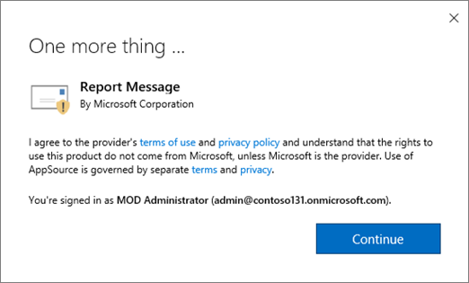
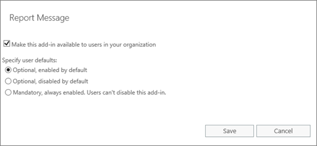

# Activer le complément de Message de rapportEnable the Report Message add-in

Le complément de Message de rapport pour Outlook permet aux utilisateurs de créer facilement des rapports e-mail mal classé, fiables ou malveillantes, Microsoft et ses filiales pour l’analyse. Microsoft utilise ces envois pour améliorer l’efficacité des technologies de protection de courrier électronique.The Report Message add-in for Outlook enables people to easily report misclassified email, whether safe or malicious, to Microsoft and its affiliates for analysis. Microsoft uses these submissions to improve the effectiveness of email protection technologies.
  
Si vous êtes un utilisateur individuel, vous pouvez activer le complément de Message de rapport par vous-même.If you're an individual user, you can enable the Report Message add-in for yourself. 
  
Si vous êtes un administrateur Exchange Online, vous pouvez activer le complément de Message de rapport pour votre organisation.If you're an Exchange Online administrator, you can enable the Report Message add-in for your organization.
    
## Obtenez le Message de rapport de complément pour vous-mêmeGet the Report Message add-in for yourself

1. Accédez à [https://store.office.com](https://store.office.com)et la recherche pour le complément de Message de rapport.Go to [https://store.office.com](https://store.office.com), and search for the Report Message add-in.
    
2. Choisissez **obtenir maintenant** (ou **Ajouter** ).Choose **Get it now** (or **Add** ). 
    
3. Passez en revue les termes du contrat de stratégie de confidentialité et d’utilisation. Puis cliquez sur **Continuer**.Review the terms of use and privacy policy. Then choose **Continue**. 
    
4. Connectez-vous à votre messagerie électronique Office 365 à l’aide de votre travail compte école (pour une utilisation professionnelle) ou votre compte Microsoft (pour une utilisation personnelle).Sign in to your Office 365 email using your work or school account (for business use) or your Microsoft account (for personal use).
    
Une fois que le complément est installé et activé, vous verrez les icônes suivantes :After the add-in is installed and enabled, you'll see the following icons: 

- Dans Outlook, l’icône ressemble à ceci :In Outlook the icon looks like this:    
- Dans Outlook Web App, l’icône ressemble à ceci :In Outlook Web App the icon looks like this:  

  
Étape suivante, découvrez comment [utiliser le complément de Message de rapport](https://support.office.com/article/b5caa9f1-cdf3-4443-af8c-ff724ea719d2).As a next step, learn how to [Use the Report Message add-in](https://support.office.com/article/b5caa9f1-cdf3-4443-af8c-ff724ea719d2).
  
## Obtenir et activer le complément de Message de rapport pour votre organisationGet and enable the Report Message add-in for your organization

> [!IMPORTANT]
> Vous devez être administrateur Exchange Online pour effectuer cette tâche.You must be an Exchange Online Administrator to perform this task.
  
1. Accédez à [https://portal.office.com](https://portal.office.com) et connectez-vous à l’aide de votre compte professionnel ou de l’école.Go to [https://portal.office.com](https://portal.office.com) and sign in using your work or school account. 
    
2. Choisissez **Admin** pour accéder au centre d’administration.Choose **Admin** to go to the Admin center. 
    
3. Choisissez **Centre d’administration** \> **Exchange** pour accéder au centre d’administration Exchange (CAE).Choose **Admin centers** \> **Exchange** to go to the Exchange admin center (EAC). 
    
4. Cliquez sur **organisation** \> **des compléments**.Choose **organization** \> **add-ins**. 
    
5. Choisissez **+** \> **Ajouter à partir de l’Office Store**.Choose **+** \> **Add from the Office Store**. 
    
6. Rechercher les messages d’état.Search for Report Message.
    
7. Dans la liste des **résultats de l’application** , rechercher **Un Message de rapport**, puis cliquez sur **obtenir maintenant** (ou **Ajouter** ).In the **App results** list, find **Report Message**, and then choose **Get it now** (or **Add** ). 
    
8. Passez en revue les termes du contrat de stratégie de confidentialité et d’utilisation. Puis cliquez sur **Continuer**.Review the terms of use and privacy policy. Then choose **Continue**. 
    
    
  
9. Dans l’écran de confirmation, cliquez sur **Oui**.On the confirmation screen, choose **Yes**. 
    
10. Après avoir installé le complément de Message de rapport, vous devez l’activer. Pour cela, procédez comme suit :After you have installed the Report Message add-in, you must enable it. To do that, follow these steps:
    
1. Revenez au CAE et actualiser la fenêtre du navigateur.Return to the EAC, and refresh your browser window.
    
2. Cliquez sur **organisation** \> **des compléments**.Choose **organization** \> **add-ins**. 
    
3. Dans la liste des compléments, sélectionnez **Rapport de Message**.In the list of add-ins, select **Report Message**. 
    
    
  
4. Choisissez **Modifier**et sélectionnez une option pour activer le complément.Choose **Edit**, and select an option to enable the add-in. 
    
    
  
5. Sélectionnez **Enregistrer**.Choose **Save**. 
    
> [!TIP]
> Une fois que le complément est installé et activé, les personnes dans votre organisation voyez seront afficher les icônes suivantes :After the add-in is installed and enabled, people in your organization will see the following icons: 
  
Ensuite, découvrez comment [utiliser le complément de Message de rapport](https://support.office.com/article/b5caa9f1-cdf3-4443-af8c-ff724ea719d2)et configurer une règle pour voir les messages électroniques signalés.Next, learn how to [Use the Report Message add-in](https://support.office.com/article/b5caa9f1-cdf3-4443-af8c-ff724ea719d2), and set up a rule to see reported email messages.
  
### Définir une règle pour obtenir une copie des messages électroniques signalés par vos utilisateursSet up a rule to get a copy of email messages reported by your users

> [!IMPORTANT]
> Vous devez être administrateur Exchange Online pour effectuer cette tâche.You must be an Exchange Online Administrator to perform this task.
  
Vous pouvez configurer une règle pour obtenir une copie des messages électroniques signalés par les utilisateurs de votre organisation. Cela après avoir téléchargé et activé le complément de Message de rapport pour votre organisation.You can set up a rule to get a copy of email messages reported by users in your organization. You do this after you have downloaded and enabled the Report Message add-in for your organization.
  
1. Dans le centre d’administration Exchange, choisissez **flux de messagerie** \> **règles**.In the EAC, choose **mail flow** \> **rules**. 
    
2. Choisissez **+** \> **créer une nouvelle règle**.Choose **+** \> **Create a new rule**. 
    
3. Dans la zone **nom** , tapez un nom, tel que des envois.In the **Name** box, type a name, such as Submissions.
    
4. Dans la liste **appliquer cette règle si** , sélectionnez **l’adresse du destinataire inclut...**.In the **Apply this rule if** list, choose **The recipient address includes...**. 
    
5. Dans l’écran **spécifier les mots ou expressions** , ajoutez junk@office365.microsoft.com et phish@office365.microsoft.com, puis cliquez sur **OK**.In the **specify words or phrases** screen, add junk@office365.microsoft.com and phish@office365.microsoft.com, and then choose **OK**. 
    
    
  
6. Dans la liste **effectuer les opérations suivantes** , choisissez **Cci du message pour...**.In the **Do the following...** list, choose **Bcc the message to...**. 
    
7. Ajouter un administrateur global, un administrateur de sécurité et/ou lecteur de sécurité qui doit recevoir une copie de chaque message électronique qui signalent à Microsoft les personnes, puis cliquez sur **OK**.Add a global administrator, security administrator, and/or security reader who should receive a copy of each email message that people report to Microsoft, and then choose **OK**. 
    
    
  
8. Sélectionnez **Auditer cette règle avec le niveau de gravité**, puis choisissez **moyenne**.Select **Audit this rule with severity level**, and choose **Medium**. 
    
9. Sous **Choisir un mode de cette règle**, cliquez sur **Appliquer**.Under **Choose a mode for this rule**, choose **Enforce**. 
    
    
  
10. Sélectionnez **Enregistrer**.Choose **Save**. 
    
À cette règle en place, chaque fois qu’une personne de votre organisation signale un message électronique à l’aide du complément Message de rapport, votre administrateur général, administrateur de sécurité et/ou lecteur sécurité reçoit une copie de ce message. Ces informations permettent de vous permet de définir ou ajuster les stratégies, telles que les stratégies de [Liaisons sans échec de Office 365 DAV](atp-safe-links.md) .With this rule in place, whenever someone in your organization reports an email message using the Report Message add-in, your global administrator, security administrator, and/or security reader will receive a copy of that message. This information can enable you to set up or adjust policies, such as [Office 365 ATP Safe Links](atp-safe-links.md) policies. 
  
## Voir aussiRelated topics

[Utiliser le complément de Message de rapportUse the Report Message add-in](https://support.office.com/article/b5caa9f1-cdf3-4443-af8c-ff724ea719d2)
  
[Protection de Microsoft Office 365 menace avancéesOffice 365 Advanced Threat Protection](office-365-atp.md)
  

