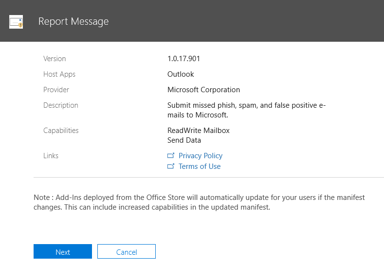
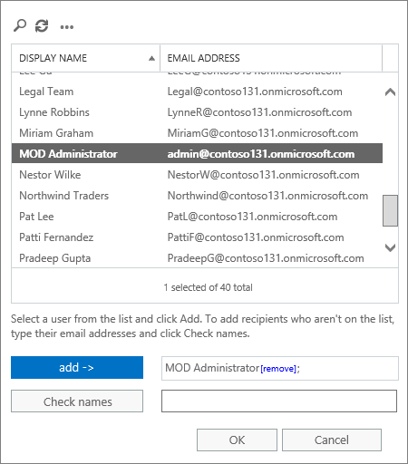

# Activer le complément Signaler le messageEnable the Report Message add-in

> [!NOTE]
> Le complément de message de rapport pour Outlook et Outlook sur le Web n'est pas exactement identique au filtre de courrier inDésirable [Outlook](https://support.office.com/article/Overview-of-the-Junk-Email-Filter-5ae3ea8e-cf41-4fa0-b02a-3b96e21de089), bien que ces deux types permettent de marquer le courrier comme légitime, non légitime ou une tentative de hameçonnage.The Report Message add-in for Outlook and Outlook on the web is not exactly the same thing as the [Outlook Junk Email Filter](https://support.office.com/article/Overview-of-the-Junk-Email-Filter-5ae3ea8e-cf41-4fa0-b02a-3b96e21de089), although both can be used to mark email as junk, not junk, or a phishing attempt. La différence réside dans le fait que le complément de message de rapport pour Outlook et Outlook sur le Web avertit Microsoft du courrier inDésirable, tandis que le filtre de courrier inDésirable d'Outlook est utilisé pour organiser les messages électroniques dans la boîte aux lettres d'un utilisateur.The difference is, the Report Message add-in for Outlook and Outlook on the web notifies Microsoft about misclassified email, whereas the Outlook Junk Email Filter is used to organize email messages in a user's mailbox. 

## Vue d’ensembleOverview

Le complément de message de rapport pour Outlook et Outlook sur le Web permet aux utilisateurs de signaler facilement les messages électroniques, qu'ils soient fiables ou malveillants, à Microsoft et à ses filiales pour analyse.The Report Message add-in for Outlook and Outlook on the web enables people to easily report misclassified email, whether safe or malicious, to Microsoft and its affiliates for analysis. Microsoft utilise ces soumissions pour améliorer l'efficacité des technologies de protection de la messagerie.Microsoft uses these submissions to improve the effectiveness of email protection technologies. En outre, si votre organisation utilise [Office 365 Advanced Threat Protection Plan 1](office-365-atp.md) ou [plan 2](office-365-ti.md), le complément Report message fournit à l'équipe de sécurité de votre organisation des informations utiles qu'il peut utiliser pour examiner et mettre à jour les stratégies de sécurité.In addition, if your organization is using [Office 365 Advanced Threat Protection Plan 1](office-365-atp.md) or [Plan 2](office-365-ti.md), the Report Message add-in provides your organization's security team with useful information they can use to review and update security policies. 

Par exemple, supposons que des personnes signalent un grand nombre de messages comme hameçonnage.For example, suppose that people are reporting a lot of messages as phishing. Ces informations sont rePrésentées dans le [tableau de bord de sécurité](security-dashboard.md) et d'autres rapports.This information surfaces in the [Security Dashboard](security-dashboard.md) and other reports. L'équipe de sécurité de votre organisation peut utiliser ces informations pour indiquer que les stratégies de détection d'hameçonnage doivent être mises à jour.Your organization's security team can use this information as an indication that anti-phishing policies might need to be updated. Ou bien, si des personnes signalent un grand nombre de messages marqués comme légitimes comme légitimes à l'aide du complément de message de rapport, il se peut que l'équipe de sécurité de votre organisation doive ajuster les [stratégies de blocage du courrier](configure-the-anti-spam-policies.md)indésirable.Or, if people are reporting a lot of messages that were flagged as junk mail as Not Junk by using the Report Message add-in, your organization's security team might need to adjust [anti-spam policies](configure-the-anti-spam-policies.md). 

Le complément de message de rapport fonctionne avec votre abonnement Office 365 et les produits suivants:The Report Message add-in works with your Office 365 subscription and the following products:
 - Outlook sur le webOutlook on the web
 - Outlook 2013 SP1Outlook 2013 SP1
 - Outlook 2016Outlook 2016
 - Outlook 2016 pour MacOutlook 2016 for Mac
 - Outlook inclus avec Office 365 proPlusOutlook included with Office 365 ProPlus

Votre navigateur Web existant doit être suffisant pour que le complément de message de rapport fonctionne; Toutefois, si vous remarquez que le complément n'est pas disponible ou ne fonctionne pas comme prévu, essayez un autre navigateur.Your existing web browser should suffice for the Report Message add-in to work; however, if you notice the add-in is not available or not working as expected, try a different browser.
  
Si vous êtes un utilisateur individuel, vous pouvez [activer le complément de rapport de message pour vous-même](#get-the-report-message-add-in-for-yourself).If you're an individual user, you can [enable the Report Message add-in for yourself](#get-the-report-message-add-in-for-yourself). 
  
Si vous êtes un administrateur général Office 365 ou un administrateur Exchange Online et qu'Exchange est configuré pour utiliser l'authentification OAuth, vous pouvez [activer le complément de message de rapport pour votre organisation](#get-and-enable-the-report-message-add-in-for-your-organization).If you're an Office 365 global administrator or an Exchange Online administrator, and Exchange is configured to use OAuth authentication, you can [enable the Report Message add-in for your organization](#get-and-enable-the-report-message-add-in-for-your-organization). Le complément de message de rapport est désormais disponible via un [déploiement centralisé](https://docs.microsoft.com/office365/admin/manage/centralized-deployment-of-add-ins).The Report Message Add-In is now available through [Centralized Deployment](https://docs.microsoft.com/office365/admin/manage/centralized-deployment-of-add-ins).
    
## Obtenir le complément de message de rapport pour vous-mêmeGet the Report Message add-in for yourself

1. Dans [Microsoft AppSource](https://appsource.microsoft.com/marketplace/apps), recherchez le [complément Report message](https://appsource.microsoft.com/product/office/wa104381180).In [Microsoft AppSource](https://appsource.microsoft.com/marketplace/apps), search for the [Report Message add-in](https://appsource.microsoft.com/product/office/wa104381180).
    
2. Choisissez **obtenir maintenant**.Choose **GET IT NOW**.   
    
3. Passez en revue les conditions d'utilisation et la politique de confidentialité.Review the terms of use and privacy policy. Sélectionnez **Continue (Continuer)**.Then choose **Continue**. 
    
4. Connectez-vous à Office 365 à l'aide de votre compte professionnel ou scolaire (pour une utilisation professionnelle) ou de votre compte Microsoft (pour une utilisation personnelle).Sign in to Office 365 using your work or school account (for business use) or your Microsoft account (for personal use).
    
Une fois le complément installé et activé, les icônes suivantes s'affichent:After the add-in is installed and enabled, you'll see the following icons: 

- Dans Outlook, l'icône se présente comme suit:In Outlook, the icon looks like this:    
- Dans Outlook sur le Web (anciennement appelé Outlook Web App), l'icône se présente comme suit:In Outlook on the web (formerly known as Outlook Web App), the icon looks like this:  

> [!TIP]
> En guise d'étape suivante, Découvrez comment [utiliser le complément Report message](https://support.office.com/article/b5caa9f1-cdf3-4443-af8c-ff724ea719d2).As a next step, learn how to [Use the Report Message add-in](https://support.office.com/article/b5caa9f1-cdf3-4443-af8c-ff724ea719d2).
  
## Obtenir et activer le complément de message de rapport pour votre organisationGet and enable the Report Message add-in for your organization

> [!IMPORTANT]
> Vous devez être un administrateur général Office 365 ou un administrateur Exchange Online pour effectuer cette tâche.You must be an Office 365 global administrator or an Exchange Online Administrator to complete this task. De plus, Exchange doit être configuré pour utiliser l'authentification OAuth pour en savoir plus, consultez la rubrique [Exchange Requirements (déploiement centralisé des compléments)](https://docs.microsoft.com/office365/admin/manage/centralized-deployment-of-add-ins&view=o365-worldwide#exchange-requirements).In addition, Exchange must be configured to use OAuth authentication To learn more, see [Exchange requirements (Centralized Deployment of add-ins)](https://docs.microsoft.com/office365/admin/manage/centralized-deployment-of-add-ins&view=o365-worldwide#exchange-requirements). 

1. Accédez à la [page des compléments & de services](https://admin.microsoft.com/AdminPortal/Home#/Settings/ServicesAndAddIns) dans le centre d'administration Microsoft 365.Go to the [Services & add-ins page](https://admin.microsoft.com/AdminPortal/Home#/Settings/ServicesAndAddIns) in the Microsoft 365 admin center.   
    
2. Choisissez **+ déployer le complément**.Choose **+ Deploy Add-in**.   
    
3. Dans l'écran **nouveau complément** , passez en revue les informations, puis cliquez sur **suivant**.In the **New Add-In** screen, review the information, and then choose **Next**.  
    
4. Sélectionnez **je veux ajouter un complément à partir de l'Office Store**, puis cliquez sur **suivant**.Select **I want to add an Add-In from the Office Store**, and then choose **Next**.   
    
5. Recherchez **message de rapport**, et dans la liste des résultats, en regard du **complément de message de rapport**, choisissez **Ajouter**.Search for **Report Message**, and in the list of results, next to the **Report Message Add-In**, choose **Add**.  
    
6. Dans l'écran du **rapport** , passez en revue les informations, puis cliquez sur **suivant**.On the **Report Message** screen, review the information, and then choose **Next**.  

7. Spécifiez les paramètres par défaut de l'utilisateur pour Outlook, puis cliquez sur **suivant**.Specify the user default settings for Outlook, and  then choose **Next**.  

8. Spécifiez qui reçoit le complément de message de rapport, puis cliquez sur **Enregistrer**.Specify who gets the Report Message Add-in, and then choose **Save**.   

> [!TIP]
> Nous vous recommandons de [configurer une règle pour obtenir une copie des messages électroniques signalés par vos utilisateurs](#set-up-a-rule-to-get-a-copy-of-email-messages-reported-by-your-users).We recommend [setting up a rule to get a copy of email messages reported by your users](#set-up-a-rule-to-get-a-copy-of-email-messages-reported-by-your-users).

En fonction de ce que vous avez sélectionné lors de la configuration du complément (étapes 7-8 ci-dessus), le complément de message de [rapport](https://support.office.com/article/b5caa9f1-cdf3-4443-af8c-ff724ea719d2) sera disponible pour les personnes de votre organisation.Depending on what you selected when you set up the add-in (steps 7-8 above), people in your organization will have the [Report Message add-in](https://support.office.com/article/b5caa9f1-cdf3-4443-af8c-ff724ea719d2) available. Les personnes de votre organisation verront les icônes suivantes:People in your organization will see the following icons: 

- Dans Outlook, l'icône se présente comme suit:In Outlook, the icon looks like this:    
- Dans Outlook sur le Web, l'icône se présente comme suit:In Outlook on the web, the icon looks like this:  

> [!TIP]
> Lorsque vous informez les utilisateurs du complément Report message, incluez un lien permettant d' [utiliser le complément Report message](https://support.office.com/article/b5caa9f1-cdf3-4443-af8c-ff724ea719d2).When you notify users about the Report Message add-in, include a link to [Use the Report Message add-in](https://support.office.com/article/b5caa9f1-cdf3-4443-af8c-ff724ea719d2).

## Configurer une règle pour obtenir une copie des messages électroniques signalés par vos utilisateursSet up a rule to get a copy of email messages reported by your users

> [!IMPORTANT]
> Vous devez être un administrateur Exchange Online pour effectuer cette tâche.You must be an Exchange Online Administrator to perform this task.
  
Vous pouvez configurer une règle pour obtenir une copie des messages électroniques signalés par les utilisateurs de votre organisation.You can set up a rule to get a copy of email messages reported by users in your organization. Vous effectuez cette opération après avoir téléchargé et activé le complément de message de rapport pour votre organisation.You do this after you have downloaded and enabled the Report Message add-in for your organization.
  
1. Dans le centre d'administration Exchange, sélectionnez **règles**de **flux** \> de messagerie.In the Exchange admin center, choose **mail flow** \> **rules**. 
    
2. Sélectionnez **+** \> **créer une nouvelle règle**.Choose **+** \> **Create a new rule**. 
    
3. Dans la zone **nom** , tapez un nom, tel que des envois.In the **Name** box, type a name, such as Submissions.
    
4. Dans la liste **appliquer cette règle si** , choisissez **l'adresse du destinataire inclut...**.In the **Apply this rule if** list, choose **The recipient address includes...**. 
    
5. Dans l' **écran spécifier des mots ou** des expressions `junk@office365.microsoft.com` , `phish@office365.microsoft.com`ajoutez et, puis choisissez **OK**.In the **specify words or phrases** screen, add `junk@office365.microsoft.com` and `phish@office365.microsoft.com`, and then choose **OK**.  
  
6. Dans la liste **effectuer les opérations suivantes...** , choisissez **CCI le message à..**..In the **Do the following...** list, choose **Bcc the message to...**. 
    
7. Ajoutez un administrateur général, un administrateur de sécurité et/ou un lecteur de sécurité qui doit recevoir une copie de chaque message électronique que les personnes signalent à Microsoft, puis choisissez **OK**.Add a global administrator, security administrator, and/or security reader who should receive a copy of each email message that people report to Microsoft, and then choose **OK**.  
  
8. Sélectionnez **auditer cette règle avec le niveau de gravité**, puis choisissez **moyenne**.Select **Audit this rule with severity level**, and choose **Medium**. 
    
9. Sous **choisir un mode pour cette règle**, choisissez **appliquer**.Under **Choose a mode for this rule**, choose **Enforce**.  
  
10. Cliquez sur **Enregistrer**.Choose **Save**. 
    
Avec cette règle en place, chaque fois que quelqu'un de votre organisation signale un message électronique à l'aide du complément de message de rapport, votre administrateur général, votre administrateur de sécurité et/ou votre lecteur de sécurité recevront une copie de ce message.With this rule in place, whenever someone in your organization reports an email message using the Report Message add-in, your global administrator, security administrator, and/or security reader will receive a copy of that message. Ces informations vous permettent de configurer ou d'ajuster des stratégies, telles que [des stratégies de liens approuvés Office 365 ATP](atp-safe-links.md) ou vos paramètres de [blocage du courrier](anti-spam-protection.md) indésirable.This information can enable you to set up or adjust policies, such as [Office 365 ATP Safe Links](atp-safe-links.md) policies, or your [anti-spam](anti-spam-protection.md) settings. 

## En savoir plus sur l'utilisation du complément de message de rapportLearn how to use the Report Message add-in

Voir [use the Report message Add-in](https://support.office.com/article/b5caa9f1-cdf3-4443-af8c-ff724ea719d2).See [Use the Report Message add-in](https://support.office.com/article/b5caa9f1-cdf3-4443-af8c-ff724ea719d2).

## Vérifier ou modifier les paramètres du complément de message de rapportReview or edit settings for the Report Message add-in

Vous pouvez consulter et modifier les paramètres par défaut du complément de message de rapport sur la [page des compléments & de services](https://admin.microsoft.com/AdminPortal/Home#/Settings/ServicesAndAddIns).You can review and edit the default settings for the Report Message add-in on the [Services & Add-Ins page](https://admin.microsoft.com/AdminPortal/Home#/Settings/ServicesAndAddIns). 

> [!IMPORTANT]
> Vous devez être un administrateur général Office 365 ou un administrateur Exchange Online pour effectuer cette tâche.You must be an Office 365 global administrator or an Exchange Online Administrator to complete this task.
    
1. Accédez à la [page des compléments & de services](https://admin.microsoft.com/AdminPortal/Home#/Settings/ServicesAndAddIns) dans le centre d'administration Microsoft 365.Go to the [Services & add-ins page](https://admin.microsoft.com/AdminPortal/Home#/Settings/ServicesAndAddIns) in the Microsoft 365 admin center.  

2. Recherchez et sélectionnez le complément Report message.Find and select the Report Message add-in.   
    
3. Dans l'écran signaler un message, vérifiez et modifiez les paramètres en fonction de votre organisation.On the Report Message screen, review and edit settings as appropriate for your organization.   

## Voir aussiRelated topics

[Utiliser le complément de message de rapportUse the Report Message add-in](https://support.office.com/article/b5caa9f1-cdf3-4443-af8c-ff724ea719d2)
  
[Afficher les rapports de sécurité de messagerie &amp; dans le centre de sécurité conformitéView email security reports in the Security &amp; Compliance Center](view-email-security-reports.md)

[Afficher les rapports pour Office 365 protection avancée contre les menacesView reports for Office 365 Advanced Threat Protection](view-reports-for-atp.md)

[Utiliser l'Explorateur dans le &amp; Centre de sécurité conformitéUse Explorer in the Security &amp; Compliance Center](use-explorer-in-security-and-compliance.md)
  

