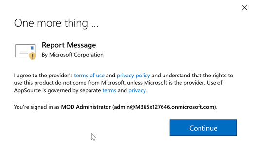
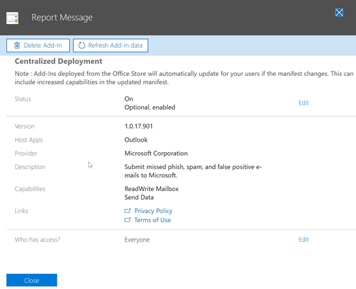

# Activer le complément Signaler le message

Le complément de Message de rapport pour Outlook permet aux utilisateurs de créer facilement des rapports e-mail mal classé, fiables ou malveillantes, Microsoft et ses filiales pour l’analyse. Microsoft utilise ces envois pour améliorer l’efficacité des technologies de protection de courrier électronique. En outre, si votre organisation utilise les services de Cloud Microsoft incluant les [Menaces](office-365-ti.md)ou [Contre les menaces avancées Office 365](office-365-atp.md) , le complément de Message de rapport fournit l’équipe de sécurité de votre organisation avec des informations utiles ils peuvent utiliser pour examiner et mettre à jour des stratégies de sécurité. 

Par exemple, supposons que personnes signalent un grand nombre de messages phishing. Cette surfaces d’informations dans le [Tableau de bord de sécurité](security-dashboard.md) et autres rapports. L’équipe de sécurité de votre organisation permettre utiliser ces informations comme une indication que les stratégies anti-hameçonnage devront être mis à jour. Ou, si un grand nombre de messages qui ont été marqués comme courrier indésirable comme légitime à l’aide du complément de Message de rapport signalez des personnes, l’équipe de sécurité de votre organisation devront ajuster les [stratégies de blocage du courrier indésirable](configure-the-anti-spam-policies.md).  
  
Si vous êtes un utilisateur individuel, vous pouvez [Activer le complément de Message de rapport par vous-même](#get-the-report-message-add-in-for-yourself). 
  
Si vous êtes un administrateur Exchange Online, vous pouvez [Activer le complément de Message de rapport pour votre organisation](#get-and-enable-the-report-message-add-in-for-your-organization).
    
## Obtenez le Message de rapport de complément pour vous-même

1. Dans le [magasin d’Office](https://appsource.microsoft.com/product/office/WA104381180?src=office), obtenir le Message de rapport complément.
    
2. Choisissez **obtenir maintenant IT**.   
    
3. Passez en revue les termes du contrat de stratégie de confidentialité et d’utilisation. Puis cliquez sur **Continuer**. 
    
4. Connectez-vous à votre messagerie électronique Office 365 à l’aide de votre travail compte école (pour une utilisation professionnelle) ou votre compte Microsoft (pour une utilisation personnelle).
    

Une fois que le complément est installé et activé, vous verrez les icônes suivantes : 

- Dans Outlook, l’icône ressemble à ceci :    
- Dans Outlook Web App, l’icône ressemble à ceci :  

Étape suivante, découvrez comment [utiliser le complément de Message de rapport](https://support.office.com/article/b5caa9f1-cdf3-4443-af8c-ff724ea719d2).
  
## Obtenir et activer le complément de Message de rapport pour votre organisation

> [!IMPORTANT]
> Vous devez être un administrateur global d’Office 365 ou Exchange Online administrateur pour effectuer cette tâche.

1. Accédez à [https://portal.office.com](https://portal.office.com) et connectez-vous à l’aide de votre compte professionnel ou de l’école. 
    
2. Choisissez **Admin** pour accéder au centre d’administration. 
    
3. Choisissez **Centre d’administration** \> **Exchange** pour accéder au centre d’administration Exchange (CAE). 
    
4. Cliquez sur **organisation** \> **des compléments**. 
    
5. Choisissez **+**  >  **Ajouter à partir de l’Office Store**.  L’Office Store dans votre navigateur web s’ouvre.
    
6. Rechercher les messages d’état.  
    
7. Dans la liste des **applications** , sélectionnez **Rapport de Message**, puis cliquez sur **Obtenir les maintenant**.   
    
8. Passez en revue les termes du contrat de stratégie de confidentialité et d’utilisation. Puis cliquez sur **Continuer**. 
    
    
  
9. Un Assistant s’ouvre pour vous aider à configurer la révision de complément de Message de rapport les informations et cliquez sur **suivant** pour continuer.   

10. Spécifiez le paramètre par défaut que vous souhaitez que les utilisateurs ont pour le complément de Message de rapport.  
    
11. Spécifier qui obtient le Message de rapport de complément.   

12. Sélectionnez **Enregistrer**.

Selon ce que vous sélectionné à l’aide de l’Assistant, les personnes de votre organisation auront le complément Message d’état disponible. Les personnes dans votre organisation, voient les icônes suivantes : 

- Dans Outlook, l’icône ressemble à ceci :    
- Dans Outlook Web App, l’icône ressemble à ceci :  

Ensuite, découvrez comment [utiliser le complément de Message de rapport](https://support.office.com/article/b5caa9f1-cdf3-4443-af8c-ff724ea719d2)et configurer une règle pour voir les messages électroniques signalés.

## Consulter ou modifier les paramètres par défaut pour le complément de Message de rapport

Vous pouvez consulter et modifier les paramètres par défaut pour le Message de rapport complément à l’aide du centre d’administration. 

> [!IMPORTANT]
> Vous devez être un administrateur global d’Office 365 ou Exchange Online administrateur pour effectuer cette tâche.
    
1. Si vous avez uniquement installé le complément de Message de rapport pour votre organisation, vous serez déjà dans la page Services et compléments. Dans le cas contraire, accédez [ici](https://portal.office.com/adminportal/home#/Settings/ServicesAndAddIns) et connexion à l’aide de votre compte professionnel ou de l’école pour Office 365.

2. Rechercher **Un Message de rapport**, puis sélectionnez-le.   
    
3. Un volet s’ouvre et affiche les paramètres qui ont été activées pour le complément de Message d’état pendant le déploiement.   

4. Passez en revue et modifier les paramètres pour le complément de Message de rapport et si nécessaire, puis enregistrez vos modifications.
    
  
## Définir une règle pour obtenir une copie des messages électroniques signalés par vos utilisateurs

> [!IMPORTANT]
> Vous devez être administrateur Exchange Online pour effectuer cette tâche.
  
Vous pouvez configurer une règle pour obtenir une copie des messages électroniques signalés par les utilisateurs de votre organisation. Cela après avoir téléchargé et activé le complément de Message de rapport pour votre organisation.
  
1. Dans le centre d’administration Exchange, choisissez **flux de messagerie** \> **règles**. 
    
2. Choisissez **+** \> **créer une nouvelle règle**. 
    
3. Dans la zone **nom** , tapez un nom, tel que des envois.
    
4. Dans la liste **appliquer cette règle si** , sélectionnez **l’adresse du destinataire inclut...**. 
    
5. Dans l’écran **spécifier les mots ou expressions** , ajoutez junk@office365.microsoft.com et phish@office365.microsoft.com, puis cliquez sur **OK**. 
    
    
  
6. Dans la liste **effectuer les opérations suivantes** , choisissez **Cci du message pour...**. 
    
7. Ajouter un administrateur global, un administrateur de sécurité et/ou lecteur de sécurité qui doit recevoir une copie de chaque message électronique qui signalent à Microsoft les personnes, puis cliquez sur **OK**. 
    
    
  
8. Sélectionnez **Auditer cette règle avec le niveau de gravité**, puis choisissez **moyenne**. 
    
9. Sous **Choisir un mode de cette règle**, cliquez sur **Appliquer**. 
    
    
  
10. Sélectionnez **Enregistrer**. 
    
À cette règle en place, chaque fois qu’une personne de votre organisation signale un message électronique à l’aide du complément Message de rapport, votre administrateur général, administrateur de sécurité et/ou lecteur sécurité reçoit une copie de ce message. Ces informations permettent de vous permet de définir ou ajuster les stratégies, telles que les stratégies de [Liaisons sans échec de Office 365 DAV](atp-safe-links.md) . 
  
## Voir aussi

[Utiliser le complément de Message de rapport](https://support.office.com/article/b5caa9f1-cdf3-4443-af8c-ff724ea719d2)
  
[Afficher les rapports de sécurité de messagerie de la sécurité &amp; centre de conformité](view-email-security-reports.md)

[Afficher les rapports de Protection de menace avancées d’Office 365](view-reports-for-atp.md)

[Utiliser l’Explorateur de solutions de sécurité &amp; centre de conformité](use-explorer-in-security-and-compliance.md)
  

