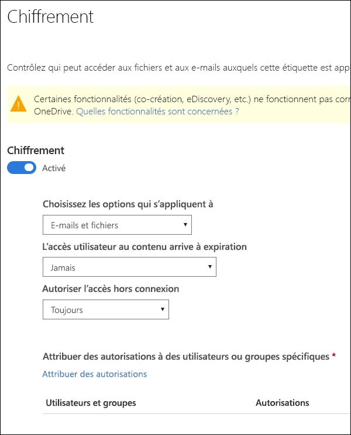
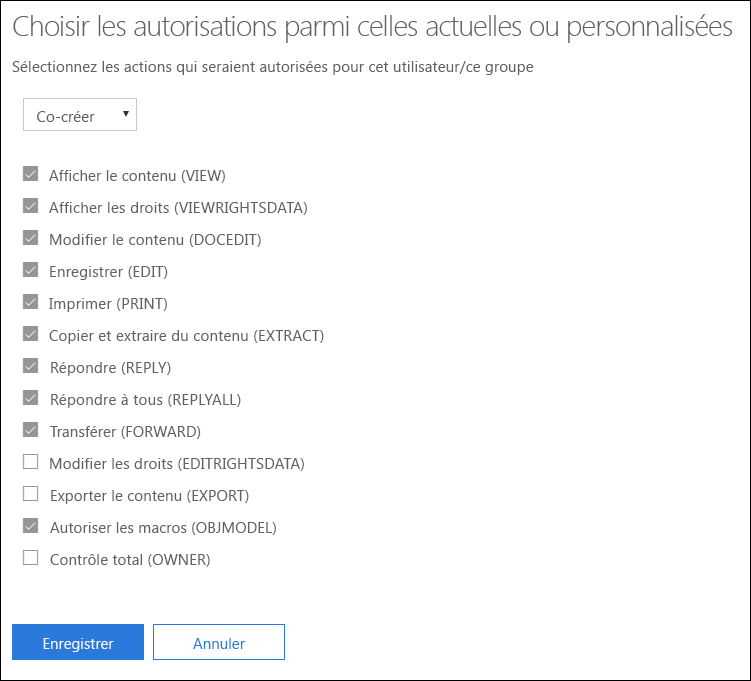
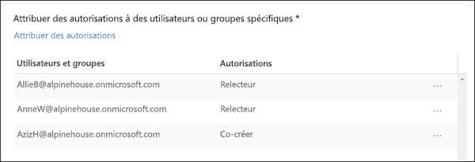

# Restriction de l’accès au contenu à l’aide du chiffrement dans les étiquettes de sensibilitéRestrict access to content by using encryption in sensitivity labels

Lorsque vous créez une étiquette de sensibilité, vous pouvez restreindre l’accès au contenu auquel l’étiquette sera appliquée. Par exemple, avec les paramètres de chiffrement d’une étiquette de sensibilité, vous pouvez protéger le contenu comme suit :When you create a sensitivity label, you can restrict access to content that the label will be applied to. For example, with the encryption settings for a sensitivity label, you can protect content so that:

- Seuls les utilisateurs de votre organisation peuvent ouvrir un document ou un e-mail confidentiel.Only users within your organization can open a confidential document or email.
- Seuls les utilisateurs du département marketing peuvent modifier et imprimer le document ou l’e-mail d’annonce de promotion, alors que tous les autres utilisateurs de votre organisation peuvent uniquement le lire.Only users in the marketing department can edit and print the promotion announcement document or email, while all other users in your organization can only read it.
- Les utilisateurs ne peuvent pas transférer un e-mail ou y copier tout contenu relatif à une réorganisation interne.Users cannot forward an email or copy information from it that contains news about an internal reorganization.
- La liste de prix à jour envoyée aux partenaires ne peut pas être ouverte après une date spécifiée.The current price list that is sent to business partners cannot be opened after a specified date.

Lorsqu’un document ou un e-mail est chiffré, l’accès à son contenu est restreint de l’une des façons suivantes :When a document or email is encrypted, access to the content is restricted, so that it:

- Il peut uniquement être déchiffré par les utilisateurs autorisés par les paramètres de chiffrement de l’étiquette.Can be decrypted only by users authorized by the label’s encryption settings.
- Il reste chiffré quel que soit son emplacement, interne ou externe à votre organisation, même si le fichier est renommé.Remains encrypted no matter where it resides, inside or outside your organization, even if the file’s renamed.
- Il est chiffré lorsqu’il est inactif (par exemple dans un compte OneDrive) et en transit (par exemple, un e-mail envoyé).Is encrypted both at rest (for example, in a OneDrive account) and in transit (for example, a sent email).

Les paramètres de chiffrement sont disponibles lorsque vous créez une étiquette de sensibilité dans le Centre de conformité Microsoft 365, dans le Centre de sécurité Microsoft 365 ou dans le Centre de sécurité et conformité Office 365.The encryption settings are available when you create a sensitivity label in the Microsoft 365 compliance center, Microsoft 365 security center, or Office 365 Security & Compliance Center.

## Fonctionnement du chiffrementHow encryption works

Le chiffrement utilise Azure Rights Management (Azure RMS). Azure RMS repose sur des stratégies de chiffrement, d’identité et d’autorisation. Pour en savoir plus, reportez-vous à l’article [En quoi consiste Azure Rights Management ?](https://docs.microsoft.com/fr-FR/azure/information-protection/what-is-azure-rms)Encryption uses Azure Rights Management (Azure RMS). Azure RMS uses encryption, identity, and authorization policies. To learn more, see [What is Azure Rights Management?](https://docs.microsoft.com/en-us/azure/information-protection/what-is-azure-rms)

## Comment activer le chiffrement pour une étiquette de sensibilitéHow to turn on encryption for a sensitivity label

Pour commencer, activez le **chiffrement**vers**Sur**, puis utilisez les options ci-dessous pour contrôler les utilisateurs autorisés à accéder aux e-mails ou aux documents auxquels cette étiquette est appliquée. Vous pouvez :To begin, simply toggle **Encryption** to **On**, and then use the options below to control who can access email or documents to which this label is applied. You can:

1. **Appliquer le chiffrement aux e-mails et aux documents, ou uniquement aux e-mails.** Si vous sélectionnez uniquement les e-mails, les messages portant cette étiquette seront chiffrés dans Outlook, mais les documents qui portent cette étiquette ne seront pas chiffrés dans les autres applications, telles que Word ou PowerPoint.**Apply encryption to both email and documents, or just email.** If you choose just email, messages with this label will be encrypted in Outlook, but documents with this label won't be encrypted in other apps, such as Word or PowerPoint. 
2. **Autoriser l’expiration des accès au contenu portant l’étiquette**, à une date spécifique ou au bout d’un certain nombre de jours après l’application de l’étiquette. Après cette période, les utilisateurs ne sont plus en mesure d’ouvrir l’élément étiqueté. Si vous spécifiez une date, elle prend effet le jour choisi à minuit dans votre fuseau horaire actuel. (Notez que certains clients de messagerie peuvent ne pas imposer l'expiration et ne pas afficher les e-mails dont la date d'expiration est dépassée, en raison de leurs mécanismes de mise en cache).**Allow access to labeled content to expire**, either on a specific date or after a specific number of days after the label is applied. After this time, users won’t be able to open the labeled item. If you specify a date, it is effective midnight on that date in your current time zone. (Note that some email clients may not enforce expiration and show emails past their expiration date, due to their caching mechanisms.)
3. **Autoriser l’accès hors connexion** : Jamais, Toujours ou pendant un nombre de jours déterminé après que l’étiquette a été appliquée. Si vous limitez l’accès hors connexion sur Jamais ou sur un nombre de jours, lorsque ce seuil est atteint, les utilisateurs doivent s’authentifier à nouveau et leur accès est journalisé. Pour plus d’informations, reportez-vous à la section suivante sur la licence d’utilisation de Rights Management.**Allow offline access** never, always, or for a specific number of days after the label is applied. If you restrict offline access to never or a number of days, when that threshold is reached, users must be reauthenticated and their access is logged. For more information, see the next section on the Rights Management use license.

### Licence d’utilisation de Rights Management pour l’accès en mode hors connexionRights Management use license for offline access

Lorsqu’un utilisateur ouvre un document ou un e-mail en mode hors connexion et que celui-ci a été protégé par une étiquette de sensibilité, il reçoit une licence d’utilisation Azure Rights Management sur ce contenu. Cette licence d’utilisation est un certificat qui contient les droits d’utilisation de l’utilisateur sur le document ou l’e-mail, ainsi que la clé de chiffrement qui a été utilisée pour chiffrer le contenu. La licence d’utilisation contient également une date d’expiration si celle-ci a été définie, ainsi que la durée de validité de la licence.When a user opens a document or email offline that’s been protected by a sensitivity label, an Azure Rights Management use license for that content is granted to the user. This use license is a certificate that contains the user's usage rights for the document or email, and the encryption key that was used to encrypt the content. The use license also contains an expiration date if this has been set, and how long the use license is valid.

Si aucune date d’expiration n’a été configurée, la période de validité par défaut de la licence d’utilisation est de 30 jours. Pendant la durée de la licence, l’utilisateur n’a pas besoin d’être authentifié ou autorisé à nouveau pour accéder au contenu. Il peut ainsi continuer à ouvrir le document ou l’e-mail protégé sans connexion à Internet. Lorsque la période de validité de la licence d’utilisation a expiré, l’utilisateur doit à nouveau s’authentifier ou être autorisé lorsqu’il souhaite accéder au document ou à l’e-mail protégé.If no expiration date has been set, the default use license validity period for a tenant is 30 days. For the duration of the use license, the user is not reauthenticated or reauthorized for the content. This lets the user continue to open the protected document or email without an Internet connection. When the use license validity period expires, the next time the user accesses the protected document or email, the user must be reauthenticated and reauthorized.

En plus de la nouvelle authentification, la stratégie et l’appartenance à un groupe d’utilisateurs sont également réévaluées. Autrement dit, les utilisateurs peuvent constater des résultats d’accès différents au même document ou au même e-mail si des modifications ont été apportées à la stratégie ou à l’appartenance au groupe depuis leur dernier accès au contenu.In addition to reauthentication, the policy and user group membership is reevaluated. This means that users could experience different access results for the same document or email if there are changes in the policy or group membership from when they last accessed the content.

Pour savoir comment modifier le paramètre de 30 jours par défaut, reportez-vous à [Licence d’utilisation Rights Management](https://docs.microsoft.com/fr-FR/azure/information-protection/configure-usage-rights#rights-management-use-license).To learn how to change the default 30-day setting, see [Rights Management use license](https://docs.microsoft.com/en-us/azure/information-protection/configure-usage-rights#rights-management-use-license).

## Attribuer des autorisations à des utilisateurs ou des groupes spécifiquesAssign permissions to specific users or groups

Vous pouvez accorder des autorisations à des personnes spécifiques, de manière à ce qu’elles soient les seules à pouvoir interagir avec le contenu étiqueté.You can grant permissions to specific people so that only they can interact with the labeled content.

Pour ce faire, suivez un processus simple en deux étapes :Doing so is a straightforward two-step process:

1. Ajoutez tout d’abord les utilisateurs ou les groupes qui vont recevoir les autorisations sur le contenu étiqueté.First you add users or groups that will be assigned permissions to the labeled content.
2. Choisissez ensuite les autorisations desquelles les utilisateurs bénéficieront sur le contenu étiqueté.Then you choose which permissions those users have for the labeled content.

### Ajouter des utilisateurs ou des groupesAdd users or groups

Lorsque vous attribuez des autorisations, vous pouvez choisir :When you assign permissions, you can choose:

- Tous les membres de votre organisation (tous les membres du client). Ce paramètre exclut les comptes Invité.Everyone in your organization (all tenant members). This setting excludes guest accounts.
- N’importe quel utilisateur, groupe de sécurité à extension messagerie, groupe de distribution, groupe Office 365 ou groupe de distribution dynamique.Any specific user or email-enabled security group, distribution group, Office 365 group, or dynamic distribution group. 
- Une adresse e-mail ou un domaine en dehors de votre organisation, tels que gmail.com, hotmail.com ou outlook.com.Any email address or domain outside your organization, such as gmail.com, hotmail.com, or outlook.com.

Lorsque vous choisissez tous les membres de client ou parcourez l’annuaire, les utilisateurs ou les groupes doivent avoir une adresse e-mail.When you choose all tenant members or browse the directory, the users or groups must have an email address.

Nous vous recommandons d’utiliser des groupes plutôt que des utilisateurs. En effet, avec cette stratégie, votre configuration reste plus simple.As a best practice, use groups rather than users. This strategy keeps your configuration simpler.

### Choisir les autorisationsChoose permissions

Lorsque vous choisissez les autorisations à attribuer à ces utilisateurs ou ces groupes, vous pouvez sélectionner :When you choose which permissions to allow for those users or groups, you can select either:

- Un [niveau d’autorisation prédéfini](https://docs.microsoft.com/fr-FR/azure/information-protection/configure-usage-rights#rights-included-in-permissions-levels) avec un groupe de droits prédéfini, par exemple, Co-auteur ou Réviseur.A [predefined permissions level](https://docs.microsoft.com/en-us/azure/information-protection/configure-usage-rights#rights-included-in-permissions-levels) with a preset group of rights, such as Co-Author or Reviewer.
- Un groupe d’autorisations personnalisé, avec lequel vous choisissez les autorisations que vous voulez.A Custom group of rights, where you choose whichever permissions you want.

Pour plus d’informations sur chacune des autorisations spécifiques, reportez-vous à [Descriptions et droits d’utilisation](https://docs.microsoft.com/fr-FR/azure/information-protection/configure-usage-rights#usage-rights-and-descriptions).For more information on each specific permission, see [Usage rights and descriptions](https://docs.microsoft.com/en-us/azure/information-protection/configure-usage-rights#usage-rights-and-descriptions).  

Notez qu’une même étiquette peut accorder différentes autorisations à différents utilisateurs. Par exemple, une étiquette unique peut affecter à certains utilisateurs des droits de réviseur et à un autre utilisateur des droits de co-auteur, comme illustré ci-dessous.Note that the same label can grant different permissions to different users. For example, a single label can assign some users as Reviewer and a different user as Co-author, as shown below.

Pour ce faire, ajoutez des utilisateurs ou groupes, attribuez-leur des autorisations et enregistrez ces paramètres. Répétez ensuite ces étapes : ajoutez des utilisateurs, attribuez-leur des autorisations et enregistrez les paramètres à chaque fois. Vous pouvez répéter cette procédure autant de fois que nécessaire, afin de définir différentes autorisations pour différents utilisateurs.To do this, add users or groups, assign them permissions, and save those settings. Then repeat these steps, adding users and assigning them permissions, saving the settings each time. You can do this as often as necessary, to define different permissions for different users.

### L’émetteur de Rights Management (celui qui applique l’étiquette de sensibilité) bénéficie toujours d’un contrôle total.Rights Management issuer (user applying the sensitivity label) always has Full Control

Le chiffrement d’une étiquette de sensibilité utilise Azure RMS. Lorsqu’un utilisateur applique une étiquette de sensibilité pour protéger un document ou un e-mail à l’aide d’Azure RMS, il devient l’émetteur Rights Management sur ce contenu.Encryption for a sensitivity label uses Azure RMS. When a user applies a sensitivity label to protect a document or email by using Azure RMS, that user becomes the Rights Management issuers for that content.

L’émetteur Rights Management bénéficie toujours d’autorisations en contrôle total sur le document ou l’e-mail et, par ailleurs :The Rights Management issuer is always granted Full Control permissions for the document or email, and in addition:

- Si les paramètres de protection comportent une date d’expiration, l’émetteur Rights Management peut toujours ouvrir et modifier le document ou l’e-mail après cette date.If the protection settings include an expiration date, the Rights Management issuer can still open and edit the document or email after that date.
- L’émetteur Rights Management peut toujours accéder au document ou à l’e-mail hors connexion.The Rights Management issuer can always access the document or email offline.
- L’émetteur Rights Management peut toujours ouvrir un document après sa révocation.The Rights Management issuer can still open a document after it is revoked.

Pour plus d’informations, reportez-vous à [Émetteur Rights Management et propriétaire Rights Management](https://docs.microsoft.com/fr-FR/azure/information-protection/configure-usage-rights#rights-management-issuer-and-rights-management-owner).For more information, see [Rights Management issuer and Rights Management owner](https://docs.microsoft.com/en-us/azure/information-protection/configure-usage-rights#rights-management-issuer-and-rights-management-owner).

## Qu’advient-il du chiffrement existant lorsqu’une nouvelle étiquette est appliquée ?What happens to existing encryption when a label's applied

Avant l’application d’une étiquette de niveau de confidentialité à du contenu, il est possible qu’un utilisateur ait déjà chiffré le contenu en lui appliquant un autre paramètre de protection.Before a sensitivity label is applied to content, it's possible that a user already encrypted the content by applying some other protection setting. Par exemple, un utilisateur peut avoir appliqué :For example, a user might have applied:

- L’option **Ne pas transférer**.The **Do Not Forward** option.
- Une protection personnalisée à l’aide du client d’étiquetage unifié Azure Information Protection.Custom protection by using the Azure Information Protection unified labeling client.
- Un modèle Azure Rights Management Service (RMS) qui chiffre le contenu mais n’est pas associé à une étiquette.An Azure Rights Management Service (RMS) template that encrypts the content but is not associated with a label.

Ce tableau explique ce qu’il advient du chiffrement existant lorsqu’une étiquette de niveau de confidentialité est appliqué à ce contenu.This table describe what happens to existing encyption when a sensitivity label is applied to that content.
 
 

| |**L’utilisateur applique une étiquette de niveau de confidentialité avec chiffrement désactivé****User applies a sensitivity label with encryption turned off**|**L’utilisateur applique une étiquette de niveau de confidentialité avec chiffrement activé****User applies a sensitivity label with encryption turned on**|**L’utilisateur applique une étiquette avec suppression de la protection**1**User applies a label with Remove Protection**1|
|:-----|:-----|:-----|:-----|
|**Ne pas transférer****Do Not Forward**|E-mail - La protection est suppriméeEmail - Protection is removed Document - La protection est conservéeDocument - Protection is preserved|La protection de l’étiquette est appliquéeLabel protection is applied|L’option **Ne pas transférer** est supprimée**Do Not Forward** is removed|
|**Protection personnalisée**1**Custom protection**1|La protection est conservéeProtection is preserved|La protection de l’étiquette est appliquéeLabel protection is applied|La protection personnalisée est suppriméeCustom protection is removed|
|**Modèle Azure RMS****Azure RMS template**|La protection est conservéeProtection is preserved|La protection de l’étiquette est appliquéeLabel protection is applied|La protection personnalisée est suppriméeCustom protection is removed|

1Uniquement pris en charge dans le client d’étiquetage Azure Information Protection.1This is supported only in the Azure Information Protection labeling client.

## Stockage du contenu chiffré dans OneDrive et SharePointStoring encrypted content in OneDrive and SharePoint

Notez que lorsque le chiffrement est appliqué aux fichiers stockés dans OneDrive et SharePoint, le service ne peut pas traiter le contenu de ces fichiers. Autrement dit, des fonctionnalités telles que la co-création, eDiscovery, la recherche, Delve et d’autres fonctionnalités de collaboration ne fonctionnent pas. De plus, les stratégies de protection contre la perte de données peuvent uniquement fonctionner avec les métadonnées (y compris les étiquettes Office 365), mais pas avec le contenu des fichiers chiffrés (par exemple, des numéros de cartes de crédit au sein des fichiers).Be aware that when encryption is applied to files stored in OneDrive and SharePoint, the service cannot process the contents of these files. This means that features such as co-authoring, eDiscovery, search, Delve, and other collaborative features do not work. Also, data loss prevention (DLP) policies can work only with the metadata (including Office 365 labels) but not the contents of encrypted files (such as credit card numbers within files).

Ceci s’applique uniquement au contenu stocké dans OneDrive et SharePoint. Dans Exchange Online, les règles de flux de messagerie (également connues sous le nom de règles de transport) utilisent le [compte de super utilisateur](https://docs.microsoft.com/fr-FR/azure/information-protection/configure-super-users) pour analyser le contenu chiffré et appliquer des stratégies DLP.This applies only to content stored in OneDrive and SharePoint. In Exchange Online, mail flow rules (also known as transport rules) use the [super user account](https://docs.microsoft.com/en-us/azure/information-protection/configure-super-users) so that they can scan encrypted content and enforce DLP policies.

## Conditions préalables importantesImportant prerequisites

Pour utiliser le chiffrement, vous devrez peut-être effectuer les tâches suivantes.Before you can use encryption, you might need to perform these tasks.

### Activation d’Azure Rights ManagementActivating Azure Rights Management

Pour que le chiffrement puisse être utilisé dans les étiquettes de sensibilité, le service Azure Rights Management doit être activé dans votre client. Avec les clients les plus récents, le service est activé par défaut, mais il peut s’avérer nécessaire de l’activer manuellement. Pour plus d’informations, reportez-vous à [Activation d’Azure Rights Management](https://docs.microsoft.com/fr-FR/azure/information-protection/activate-service).To use encryption in sensitivity labels, the Azure Rights Management service needs to be activated in your tenant. In newer tenants, the service is on by default, but you might need to manually activate the service. For more information, see [Activating Azure Rights Management](https://docs.microsoft.com/en-us/azure/information-protection/activate-service).

### Configurer Exchange pour Azure Information ProtectionConfigure Exchange for Azure Information Protection

Il n’est pas nécessaire de configurer Exchange pour Azure Information Protection pour que les utilisateurs puissent appliquer des étiquettes dans Outlook pour protéger leurs e-mails. Toutefois, tant qu’Exchange n’a pas été configuré pour Azure Information Protection, vous ne bénéficiez pas de toutes les fonctionnalités de protection Azure Rights Management avec Exchange.Exchange does not have to be configured for Azure Information Protection before users can apply labels in Outlook to protect their emails. However, until Exchange is configured for Azure Information Protection, you do not get the full functionality of using Azure Rights Management protection with Exchange.
 
Par exemple, les utilisateurs ne peuvent pas afficher les e-mails protégés sur des téléphones mobiles ou avec Outlook sur le web, les messages e-mails protégés ne peuvent pas être indexés pour la recherche et vous ne pouvez pas configurer la protection contre la perte de données (DLP) Exchange Online pour la protection Rights Management.For example, users cannot view protected emails on mobile phones or with Outlook on the web, protected emails cannot be indexed for search, and you cannot configure Exchange Online DLP for Rights Management protection. 

Pour vous assurer qu’Exchange est en mesure de prendre en charge ces scénarios supplémentaires, reportez-vous aux rubriques suivantes :To ensure that Exchange can support these additional scenarios, see the following:

- Pour Exchange Online, consultez les instructions de la section [Exchange Online : configuration de la gestion des droits relatifs à l’information](https://docs.microsoft.com/fr-FR/azure/information-protection/configure-office365#exchange-online-irm-configuration).For Exchange Online, see the instructions for [Exchange Online: IRM Configuration](https://docs.microsoft.com/en-us/azure/information-protection/configure-office365#exchange-online-irm-configuration).
- Pour Exchange en local, vous devez déployer le [connecteur RMS et configurer vos serveurs Exchange](https://docs.microsoft.com/fr-FR/azure/information-protection/deploy-rms-connector).For Exchange on-premises, you must deploy the [RMS connector and configure your Exchange servers](https://docs.microsoft.com/en-us/azure/information-protection/deploy-rms-connector). 
