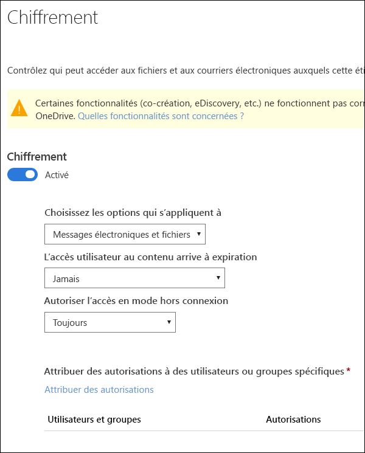
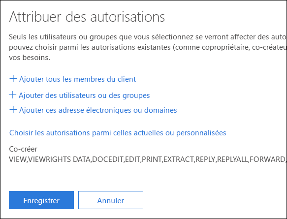
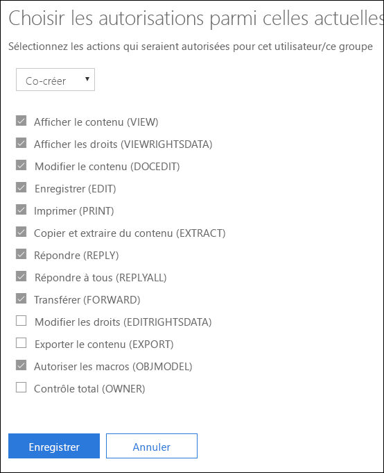
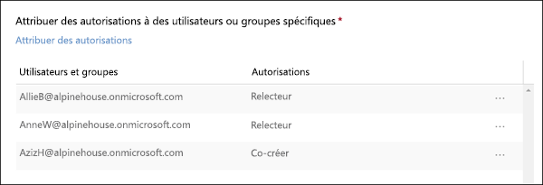

# Restriction de l’accès au contenu à l’aide du chiffrement dans les étiquettes de sensibilité

Lorsque vous créez une étiquette de sensibilité, vous pouvez restreindre l’accès au contenu auquel l’étiquette sera appliquée. Par exemple, avec les paramètres de chiffrement d’une étiquette de sensibilité, vous pouvez protéger le contenu comme suit :

- Seuls les utilisateurs de votre organisation peuvent ouvrir un document ou un e-mail confidentiel.
- Seuls les utilisateurs du département marketing peuvent modifier et imprimer le document ou l’e-mail d’annonce de promotion, alors que tous les autres utilisateurs de votre organisation peuvent uniquement le lire.
- Les utilisateurs ne peuvent pas transférer un e-mail ou y copier tout contenu relatif à une réorganisation interne.
- La liste de prix à jour envoyée aux partenaires ne peut pas être ouverte après une date spécifiée.

Lorsqu’un document ou un e-mail est chiffré, l’accès à son contenu est restreint de l’une des façons suivantes :

- Il peut uniquement être déchiffré par les utilisateurs autorisés par les paramètres de chiffrement de l’étiquette.
- Il reste chiffré quel que soit son emplacement, interne ou externe à votre organisation, même si le fichier est renommé.
- Il est chiffré lorsqu’il est inactif (par exemple dans un compte OneDrive) et en transit (par exemple, un e-mail envoyé).

Les paramètres de chiffrement sont disponibles dans le centre de conformité et sécurité Office 365 > page **Étiquettes** > onglet **Critère de diffusion** > **Créer une étiquette**.

## Fonctionnement du chiffrement

Le chiffrement utilise Azure Rights Management (Azure RMS). Azure RMS repose sur des stratégies de chiffrement, d’identité et d’autorisation. Pour en savoir plus, reportez-vous à l’article [En quoi consiste Azure Rights Management ?](https://docs.microsoft.com/fr-FR/azure/information-protection/what-is-azure-rms)

## Comment activer le chiffrement pour une étiquette de sensibilité

Pour commencer, activez le **chiffrement**vers**Sur**, puis utilisez les options ci-dessous pour contrôler les utilisateurs autorisés à accéder aux e-mails ou aux documents auxquels cette étiquette est appliquée. Vous pouvez :

1. **Appliquer le chiffrement aux e-mails et aux documents, ou uniquement aux e-mails.** Si vous sélectionnez uniquement les e-mails, les messages portant cette étiquette seront chiffrés dans Outlook, mais les documents qui portent cette étiquette ne seront pas chiffrés dans les autres applications, telles que Word ou PowerPoint. 
2. **Autoriser l’expiration des accès au contenu portant l’étiquette**, à une date spécifique ou au bout d’un certain nombre de jours après l’application de l’étiquette. Après cette période, les utilisateurs ne sont plus en mesure d’ouvrir l’élément étiqueté. Si vous spécifiez une date, elle prend effet le jour choisi à minuit dans votre fuseau horaire actuel. 
3. **Autoriser l’accès hors connexion** : Jamais, Toujours ou pendant un nombre de jours déterminé après que l’étiquette a été appliquée. Si vous limitez l’accès hors connexion sur Jamais ou sur un nombre de jours, lorsque ce seuil est atteint, les utilisateurs doivent s’authentifier à nouveau et leur accès est journalisé. Pour plus d’informations, reportez-vous à la section suivante sur la licence d’utilisation de Rights Management.

### Licence d’utilisation de Rights Management pour l’accès en mode hors connexion

Lorsqu’un utilisateur ouvre un document ou un e-mail en mode hors connexion et que celui-ci a été protégé par une étiquette de sensibilité, il reçoit une licence d’utilisation Azure Rights Management sur ce contenu. Cette licence d’utilisation est un certificat qui contient les droits d’utilisation de l’utilisateur sur le document ou l’e-mail, ainsi que la clé de chiffrement qui a été utilisée pour chiffrer le contenu. La licence d’utilisation contient également une date d’expiration si celle-ci a été définie, ainsi que la durée de validité de la licence.

Si aucune date d’expiration n’a été configurée, la période de validité par défaut de la licence d’utilisation est de 30 jours. Pendant la durée de la licence, l’utilisateur n’a pas besoin d’être authentifié ou autorisé à nouveau pour accéder au contenu. Il peut ainsi continuer à ouvrir le document ou l’e-mail protégé sans connexion à Internet. Lorsque la période de validité de la licence d’utilisation a expiré, l’utilisateur doit à nouveau s’authentifier ou être autorisé lorsqu’il souhaite accéder au document ou à l’e-mail protégé.

En plus de la nouvelle authentification, la stratégie et l’appartenance à un groupe d’utilisateurs sont également réévaluées. Autrement dit, les utilisateurs peuvent constater des résultats d’accès différents au même document ou au même e-mail si des modifications ont été apportées à la stratégie ou à l’appartenance au groupe depuis leur dernier accès au contenu.

Pour savoir comment modifier le paramètre de 30 jours par défaut, reportez-vous à [Licence d’utilisation Rights Management](https://docs.microsoft.com/fr-FR/azure/information-protection/configure-usage-rights#rights-management-use-license).

## Attribuer des autorisations à des utilisateurs ou des groupes spécifiques

Vous pouvez accorder des autorisations à des personnes spécifiques, de manière à ce qu’elles soient les seules à pouvoir interagir avec le contenu étiqueté.

Pour ce faire, suivez un processus simple en deux étapes :

1. Ajoutez tout d’abord les utilisateurs ou les groupes qui vont recevoir les autorisations sur le contenu étiqueté.
2. Choisissez ensuite les autorisations desquelles les utilisateurs bénéficieront sur le contenu étiqueté.

### Ajouter des utilisateurs ou des groupes

Lorsque vous attribuez des autorisations, vous pouvez choisir :

- Tous les membres de votre organisation (tous les membres du client). Ce paramètre exclut les comptes Invité.
- N’importe quel utilisateur, groupe de sécurité à extension messagerie, groupe de distribution, groupe Office 365 ou groupe de distribution dynamique. 
- Une adresse e-mail ou un domaine en dehors de votre organisation, tels que gmail.com, hotmail.com ou outlook.com.

Lorsque vous choisissez tous les membres de client ou parcourez l’annuaire, les utilisateurs ou les groupes doivent avoir une adresse e-mail.

Nous vous recommandons d’utiliser des groupes plutôt que des utilisateurs. En effet, avec cette stratégie, votre configuration reste plus simple.

### Choisir les autorisations

Lorsque vous choisissez les autorisations à attribuer à ces utilisateurs ou ces groupes, vous pouvez sélectionner :

- Un [niveau d’autorisation prédéfini](https://docs.microsoft.com/fr-FR/azure/information-protection/configure-usage-rights#rights-included-in-permissions-levels) avec un groupe de droits prédéfini, par exemple, Co-auteur ou Réviseur.
- Un groupe d’autorisations personnalisé, avec lequel vous choisissez les autorisations que vous voulez.

Pour plus d’informations sur chacune des autorisations spécifiques, reportez-vous à [Descriptions et droits d’utilisation](https://docs.microsoft.com/fr-FR/azure/information-protection/configure-usage-rights#usage-rights-and-descriptions).  

Notez qu’une même étiquette peut accorder différentes autorisations à différents utilisateurs. Par exemple, une étiquette unique peut affecter à certains utilisateurs des droits de réviseur et à un autre utilisateur des droits de co-auteur, comme illustré ci-dessous.

Pour ce faire, ajoutez des utilisateurs ou groupes, attribuez-leur des autorisations et enregistrez ces paramètres. Répétez ensuite ces étapes : ajoutez des utilisateurs, attribuez-leur des autorisations et enregistrez les paramètres à chaque fois. Vous pouvez répéter cette procédure autant de fois que nécessaire, afin de définir différentes autorisations pour différents utilisateurs.

### L’émetteur de Rights Management (celui qui applique l’étiquette de sensibilité) bénéficie toujours d’un contrôle total.

Le chiffrement d’une étiquette de sensibilité utilise Azure RMS. Lorsqu’un utilisateur applique une étiquette de sensibilité pour protéger un document ou un e-mail à l’aide d’Azure RMS, il devient l’émetteur Rights Management sur ce contenu.

L’émetteur Rights Management bénéficie toujours d’autorisations en contrôle total sur le document ou l’e-mail et, par ailleurs :

- Si les paramètres de protection comportent une date d’expiration, l’émetteur Rights Management peut toujours ouvrir et modifier le document ou l’e-mail après cette date.
- L’émetteur Rights Management peut toujours accéder au document ou à l’e-mail hors connexion.
- L’émetteur Rights Management peut toujours ouvrir un document après sa révocation.

Pour plus d’informations, reportez-vous à [Émetteur Rights Management et propriétaire Rights Management](https://docs.microsoft.com/fr-FR/azure/information-protection/configure-usage-rights#rights-management-issuer-and-rights-management-owner).

## Stockage du contenu chiffré dans OneDrive et SharePoint

Notez que lorsque le chiffrement est appliqué aux fichiers stockés dans OneDrive et SharePoint, le service ne peut pas traiter le contenu de ces fichiers. Autrement dit, des fonctionnalités telles que la co-création, eDiscovery, la recherche, Delve et d’autres fonctionnalités de collaboration ne fonctionnent pas. De plus, les stratégies de protection contre la perte de données peuvent uniquement fonctionner avec les métadonnées (y compris les étiquettes Office 365), mais pas avec le contenu des fichiers chiffrés (par exemple, des numéros de cartes de crédit au sein des fichiers).

Ceci s’applique uniquement au contenu stocké dans OneDrive et SharePoint. Dans Exchange Online, les règles de flux de messagerie (également connues sous le nom de règles de transport) utilisent le [compte de super utilisateur](https://docs.microsoft.com/fr-FR/azure/information-protection/configure-super-users) pour analyser le contenu chiffré et appliquer des stratégies DLP.

## Conditions préalables importantes

Pour utiliser le chiffrement, vous devrez peut-être effectuer les tâches suivantes.

### Activation d’Azure Rights Management

Pour que le chiffrement puisse être utilisé dans les étiquettes de sensibilité, le service Azure Rights Management doit être activé dans votre client. Avec les clients les plus récents, le service est activé par défaut, mais il peut s’avérer nécessaire de l’activer manuellement. Pour plus d’informations, reportez-vous à [Activation d’Azure Rights Management](https://docs.microsoft.com/fr-FR/azure/information-protection/activate-service).

### Configurer Exchange pour Azure Information Protection

Il n’est pas nécessaire de configurer Exchange pour Azure Information Protection pour que les utilisateurs puissent appliquer des étiquettes dans Outlook pour protéger leurs e-mails. Toutefois, tant qu’Exchange n’a pas été configuré pour Azure Information Protection, vous ne bénéficiez pas de toutes les fonctionnalités de protection Azure Rights Management avec Exchange.
 
Par exemple, les utilisateurs ne peuvent pas afficher les e-mails protégés sur des téléphones mobiles ou avec Outlook sur le web, les messages e-mails protégés ne peuvent pas être indexés pour la recherche et vous ne pouvez pas configurer la protection contre la perte de données (DLP) Exchange Online pour la protection Rights Management. 

Pour vous assurer qu’Exchange est en mesure de prendre en charge ces scénarios supplémentaires, reportez-vous aux rubriques suivantes :

- Pour Exchange Online, consultez les instructions de la section [Exchange Online : configuration de la gestion des droits relatifs à l’information](https://docs.microsoft.com/fr-FR/azure/information-protection/configure-office365#exchange-online-irm-configuration).
- Pour Exchange en local, vous devez déployer le [connecteur RMS et configurer vos serveurs Exchange](https://docs.microsoft.com/fr-FR/azure/information-protection/deploy-rms-connector). 
